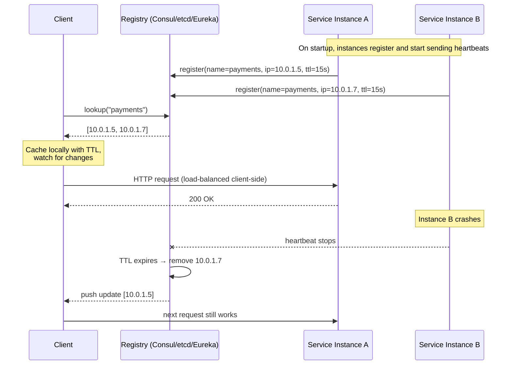
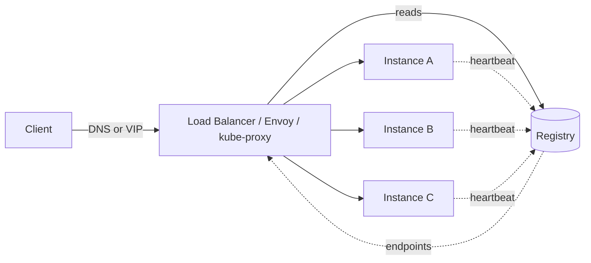
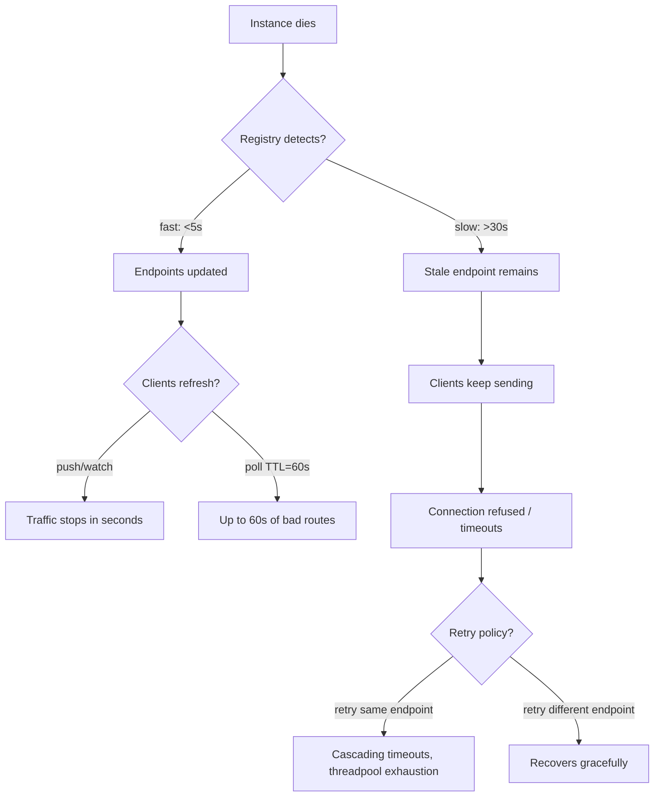
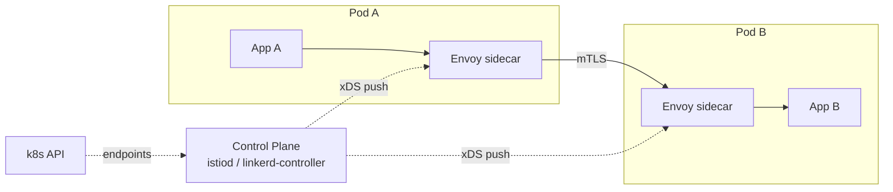
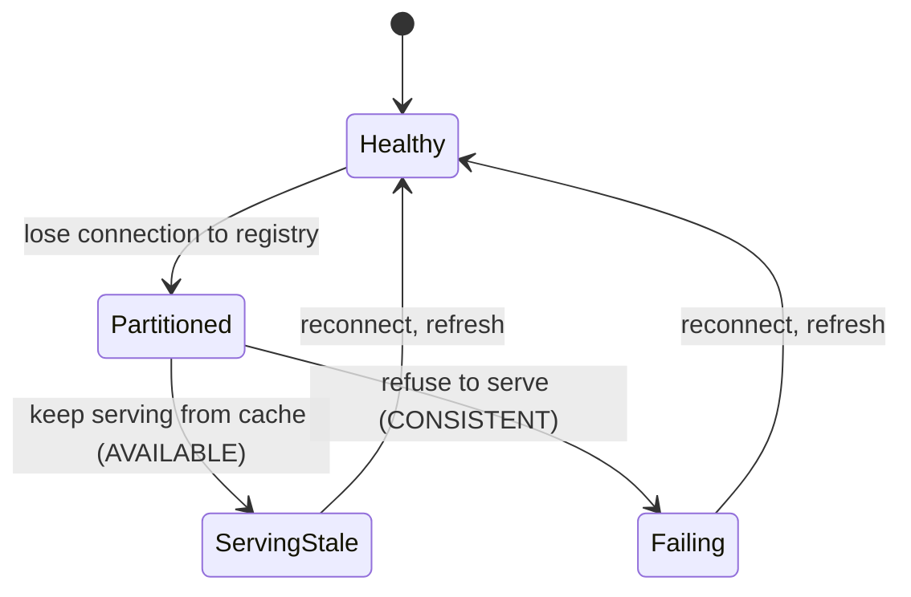

# Service Discovery

## Why This Exists

**Problem.** In a static datacenter, you wrote IPs in a config file and reloaded on deploys. In a cloud/k8s/autoscaled world, instances appear, die, get rescheduled, and change IPs every few minutes. A client that hard-codes IPs — or even hostnames with naive DNS caching — will route traffic to a dead host, a different tenant, or a black hole. Service discovery is the layer that answers "**what are the current healthy network endpoints for service `X`?**" and propagates the answer fast enough that requests don't pile up against ghosts.

**Key insight.** Service discovery is fundamentally a **distributed cache of (logical name → set of healthy endpoints)** with three knobs you must tune deliberately:
1. **Freshness vs availability** — how stale can the cache get before it routes traffic to dead hosts? Inverse: can the system serve traffic when the registry itself is unhealthy?
2. **Where the lookup happens** — client-side (clients pick an instance) vs server-side (load balancer/proxy picks for them).
3. **What "healthy" means** — liveness (process is up) vs readiness (process can serve traffic) vs application-level (business invariants hold).

Get any of these wrong and you get the symptoms above. Most service discovery outages aren't the registry itself failing — they're the *interaction* between the registry's health model and the client's caching/retry behavior under partial failure.

**Reach for this when**:
- You're moving from a fixed fleet to autoscaling, k8s, ECS, or any environment where IPs are ephemeral.
- You see stale endpoints causing 5xx after deploys, host replacements, or zone failures.
- Your DNS-based discovery is breaking under JVM TTL=Forever or aggressive resolver caching.
- You're choosing between Consul, etcd, Eureka, ZooKeeper, k8s native, or AWS Cloud Map.
- You're deciding "do I need a service mesh, or is k8s Services enough?"

**Don't reach for this when**:
- You have ≤10 services in a single AZ on fixed IPs — `/etc/hosts` or a static config map is fine, and operationally simpler.
- The problem is actually **load balancing strategy** (least-conn vs round-robin) — that's a layer above discovery.
- The problem is actually **service-to-service auth/mTLS** — that's the mesh's *security* plane, not discovery.
- You need request-level routing (canary, traffic-splitting, retries with budgets) — you want a service mesh or smart proxy, not a discovery system.

---

## Diagrams

### Client-side discovery (the client picks the instance)



### Server-side discovery (a load balancer hides the registry from clients)



Client knows nothing about the registry. The LB (or sidecar) does the lookup. **This is what k8s Services + kube-proxy gives you for free.**

### How a stale cache turns into a partial outage



The two boxes that matter most: **how fast does the registry detect death**, and **how fast do clients learn**. The product of those latencies is your blast radius.

---

## The discovery mechanisms, ranked by complexity

### 1. DNS (the simplest thing that could possibly work)

DNS is service discovery — it's just slow, eventually consistent, and has no real health model. But for many workloads it's the right answer.

```bash
# Simplest: A records, multiple IPs, client picks one
$ dig +short payments.internal.example.com
10.0.1.5
10.0.1.7
10.0.1.9

# Better: SRV records carry port + priority + weight
$ dig +short SRV _payments._tcp.internal.example.com
10 5 8080 host-a.internal.example.com.
10 5 8080 host-b.internal.example.com.
```

**Why people get burned by DNS:**

```java
// JAVA TRAP: the JVM caches DNS lookups *forever* by default
// when a SecurityManager is installed, and 30s otherwise.
// In a long-running process, you'll route to dead IPs for hours.

// Fix in code:
java.security.Security.setProperty("networkaddress.cache.ttl", "30");
java.security.Security.setProperty("networkaddress.cache.negative.ttl", "0");

// Or via JVM arg:
// -Dsun.net.inetaddr.ttl=30
```

```python
# Python's socket.getaddrinfo respects the OS resolver, which
# usually respects TTL — but connection pools (urllib3, requests)
# pin the connection to whatever IP they resolved at pool creation.
# A pool with keep-alive will never re-resolve until the connection dies.

# Mitigations: short pool max-age, or use a resolver-aware client like
# aiohttp with a TCPConnector(resolver=AsyncResolver(), ttl_dns_cache=10)
```

**When DNS-only is the right answer:**
- You're in AWS and using Route 53 + ALB/NLB — the ALB is the load balancer; DNS just points to it. Endpoint health is the ALB's job.
- You can tolerate 30–60s detection of a dead instance (most batch and async workloads).
- You don't need active health-checking from the client side.

**When DNS-only fails you:**
- You need <5s detection. DNS TTL floor in many resolvers is ~30s; some clients refuse to honor TTL=0.
- You need to carry metadata (instance tags, version, weight) — A/AAAA records can't.
- You need active health checks from the client. DNS doesn't know if the IP is alive, only that *something* registered it.

### 2. Consul (general-purpose, multi-datacenter, service-meshable)

Consul is a distributed KV + service registry built on Raft. Each Consul agent runs on every node, performs local health checks, gossips state, and forwards registration to the servers (3 or 5 in a Raft quorum).

```hcl
# /etc/consul.d/payments.hcl — register the service
service {
  name = "payments"
  id   = "payments-${HOSTNAME}"
  port = 8080
  tags = ["v2", "canary"]

  # Consul does the health checks for you, locally on the node.
  check {
    http     = "http://localhost:8080/health"
    interval = "5s"
    timeout  = "2s"

    # CRITICAL: deregister if check stays critical for too long.
    # Without this, dead instances linger in the catalog forever.
    deregister_critical_service_after = "1m"
  }
}
```

```go
// Go client: blocking query (long poll) for low-latency change detection
import "github.com/hashicorp/consul/api"

func watchPayments(ctx context.Context) {
    client, _ := api.NewClient(api.DefaultConfig())
    var lastIndex uint64

    for {
        opts := &api.QueryOptions{
            WaitIndex: lastIndex,
            WaitTime:  30 * time.Second, // long-poll
        }
        // PassingOnly=true is non-negotiable; otherwise you get
        // unhealthy instances in the result set.
        services, meta, err := client.Health().Service("payments", "", true, opts)
        if err != nil {
            // Don't busy-loop — back off, keep serving stale data.
            time.Sleep(2 * time.Second)
            continue
        }
        lastIndex = meta.LastIndex

        endpoints := make([]string, 0, len(services))
        for _, s := range services {
            endpoints = append(endpoints,
                fmt.Sprintf("%s:%d", s.Service.Address, s.Service.Port))
        }
        updateLocalCache(endpoints)
    }
}
```

**Consul's strengths:**
- Local agent does health checks, so failure detection is sub-second from the *node's* perspective; gossip propagates in seconds.
- Built-in DNS interface (`payments.service.consul`) — your legacy clients get DNS-based discovery without learning the API.
- Multi-datacenter native; WAN gossip + datacenter-aware queries.
- Watches/blocking queries give you near-real-time updates without polling.

**Consul's footguns:**
- Raft quorum on the servers means **a network partition that isolates the minority side stops writes there**. Reads are usually fine (stale reads opt-in via `?stale`).
- The agent on every node is a sidecar with memory and disk cost; on tiny nodes this hurts.
- If the local agent crashes and you weren't doing `deregister_critical_service_after`, dead instances stay registered.
- ACL bootstrapping is genuinely hard; many Consul outages trace back to misconfigured ACL tokens.

### 3. etcd (the registry behind k8s)

etcd is a Raft-backed strongly consistent KV store. By itself it's a primitive — you build discovery on top by writing keys with leases.

```go
import (
    clientv3 "go.etcd.io/etcd/client/v3"
    "go.etcd.io/etcd/client/v3/concurrency"
)

// Register self with a lease — when this process dies, the lease
// expires and the key is GC'd. This is the standard pattern.
func register(cli *clientv3.Client, name, addr string) error {
    ctx := context.Background()
    // 10s lease — if we don't refresh in 10s, k8s thinks we're dead.
    lease, err := cli.Grant(ctx, 10)
    if err != nil { return err }

    key := fmt.Sprintf("/services/%s/%s", name, addr)
    _, err = cli.Put(ctx, key, addr, clientv3.WithLease(lease.ID))
    if err != nil { return err }

    // KeepAlive returns a channel; if it closes, the lease is gone
    // and we MUST re-register or shut down. Don't ignore it.
    ch, err := cli.KeepAlive(ctx, lease.ID)
    if err != nil { return err }
    go func() {
        for range ch { /* heartbeat ack */ }
        log.Fatal("etcd lease lost — refusing to serve stale registration")
    }()
    return nil
}

// Discover with a Watch — get prefix events as they happen.
func watch(cli *clientv3.Client, name string) {
    prefix := fmt.Sprintf("/services/%s/", name)
    rch := cli.Watch(context.Background(), prefix, clientv3.WithPrefix())
    for resp := range rch {
        for _, ev := range resp.Events {
            switch ev.Type {
            case clientv3.EventTypePut:
                addEndpoint(string(ev.Kv.Value))
            case clientv3.EventTypeDelete:
                removeEndpoint(string(ev.Kv.Key))
            }
        }
    }
}
```

**When etcd makes sense:**
- You're already running k8s and want to piggyback on its etcd (don't — see pitfalls).
- You need strong consistency for things adjacent to discovery: leader election, distributed locks, config.
- You want a primitive to build your own thing on, not a turnkey solution.

**When it doesn't:**
- You want a service registry, not a KV store. Use Consul or k8s Services.
- Don't share an etcd cluster across discovery + your app's data. etcd is sized for k8s control-plane traffic; high-velocity app writes will saturate it and take down the cluster.

### 4. Kubernetes Services + Endpoints (the default if you're on k8s)

In k8s you usually don't write any of the above. The cluster gives you discovery for free:

```yaml
apiVersion: v1
kind: Service
metadata:
  name: payments
spec:
  selector:
    app: payments
  ports:
    - port: 80
      targetPort: 8080
  # type: ClusterIP (default) — virtual IP, kube-proxy routes
  # type: Headless (clusterIP: None) — DNS returns pod IPs directly
```

What happens under the hood:
1. The **kubelet** runs liveness + readiness probes on each pod.
2. **EndpointSlice controller** (newer than Endpoints) watches pods, adds *ready* pod IPs to the EndpointSlice.
3. **kube-proxy** on each node watches EndpointSlices and programs iptables/IPVS/eBPF rules so traffic to the Service VIP load-balances across ready pods.
4. **CoreDNS** resolves `payments.default.svc.cluster.local` to the Service VIP (or to pod IPs for headless services).

```yaml
# Probes are where discovery meets reality. Get these wrong and
# you'll route traffic to pods that aren't ready, OR you'll
# kill pods that are slow but healthy.
spec:
  containers:
    - name: payments
      readinessProbe:           # gates Service endpoints
        httpGet:
          path: /ready
          port: 8080
        initialDelaySeconds: 5
        periodSeconds: 5
        failureThreshold: 3      # 15s of failures → removed from Service
      livenessProbe:             # restarts the pod
        httpGet:
          path: /live
          port: 8080
        initialDelaySeconds: 30  # IMPORTANT: don't kill during startup
        periodSeconds: 10
        failureThreshold: 3
      # Hot tip: lifecycle preStop + terminationGracePeriodSeconds
      # is what fixes "503 right after deploy". When a pod is
      # being deleted, kube-proxy needs time to remove it from rules.
      lifecycle:
        preStop:
          exec:
            command: ["sh", "-c", "sleep 10"]  # let endpoints propagate
      terminationGracePeriodSeconds: 30
```

**The `preStop` sleep is the single most-important pattern people miss.** When a pod terminates, two things happen in parallel: (a) the container gets SIGTERM, and (b) the EndpointSlice update propagates through kube-proxy on every node. If (a) finishes before (b) reaches every node, you serve 503s for that interval. The sleep delays (a) so (b) has time to finish.

### 5. Service mesh (Istio, Linkerd, Consul Connect, AWS App Mesh)

A mesh adds a sidecar proxy (Envoy, linkerd2-proxy) next to every service. The sidecar handles discovery, load balancing, retries, mTLS, and observability. Discovery is now **server-side from the app's perspective** (it talks to localhost) but **client-side from the proxy's perspective** (the proxy holds the endpoint cache, configured via xDS).



**When the mesh is worth the operational cost:**
- You need consistent mTLS, retries, timeouts, and circuit breakers across many languages and you're tired of re-implementing them in each language's RPC library.
- You need traffic-splitting for canaries / A/B / progressive delivery.
- You need request-level observability (golden signals per route, not per host).

**When it isn't:**
- You have <10 services and one language. The polyglot tax doesn't apply; just use a good RPC library (gRPC, finagle).
- You can't operate the control plane. A misconfigured mesh control-plane outage takes down all data-plane discovery.
- You can't tolerate the +1–5ms per hop and the memory overhead of a sidecar per pod.

---

## Health checks: the part everyone underestimates

Discovery without good health checks is a list of IPs that *might* be alive. Three layers:

| Layer | Question | Owner | Failure action |
|---|---|---|---|
| **Liveness** | Is the process running? | Process supervisor (kubelet, systemd) | Restart |
| **Readiness** | Can it serve traffic *right now*? | Discovery layer (Service, registry) | Remove from rotation |
| **Application/deep** | Are downstream deps OK? Cache warm? Migration done? | App + sometimes registry | Remove or degrade |

**Anti-pattern: the deep readiness probe.** Your readiness probe checks the database. The DB has a 30s blip. *Every pod simultaneously fails its probe.* The Service has zero endpoints. You return 503 for everything, including requests that don't even need the DB. **Cascading failure from over-eager health checks is more common than under-eager ones.**

Better: liveness is shallow, readiness is shallow + maybe checks "have I served at least one request in the last N seconds", and deep checks live in app-level circuit breakers + load shedding.

```python
# A defensible readiness probe
@app.get("/ready")
def ready():
    # Don't check the DB here. The DB being slow shouldn't take
    # the whole pod out of rotation — let in-flight requests
    # surface that via circuit breakers and let the LB shed
    # at the request level.
    if not server_started.is_set():
        return Response(status=503)
    if shutdown_requested.is_set():
        # During graceful shutdown, fail readiness BEFORE we
        # stop accepting connections. This is what makes
        # zero-downtime deploys actually zero-downtime.
        return Response(status=503)
    return {"status": "ready"}
```

---

## Cache invalidation: where most discovery bugs live

Three propagation models:

1. **TTL polling** — clients re-fetch every N seconds. Simple, robust, but stale for up to N. DNS works this way.
2. **Long-poll / blocking query** — Consul's pattern. Client sends a request that blocks until the value changes or a timeout. Fast detection, no busy-loop.
3. **Push / streaming** — etcd Watch, Envoy xDS, k8s informers. The server pushes changes as they happen. Fastest, but the client must reconnect cleanly when the stream breaks and resync state.

**The hidden bug in all three: what happens during a partition?**



You **must** decide: when the client can't reach the registry, does it (a) keep serving from the last known endpoint list, or (b) fail closed? The boring correct answer for most systems is (a) **fail open / serve stale**, with a bounded staleness limit (e.g., refuse stale data older than 1 hour and shed load). Failing closed turns every registry blip into a total outage.

Eureka pioneered this trade-off explicitly: it's an AP system that prefers serving stale data to refusing service. Consul/etcd are CP and will refuse writes during partitions, but reads can be configured stale. **Pick consciously.**

---

## Trade-offs

| Benefit | Cost |
|---|---|
| **DNS**: zero new infra, every language supports it | TTLs are coarse, no health model, JVM caching trap, no metadata |
| **Consul**: rich health checks, multi-DC, KV+discovery in one | Agent on every node, ACL complexity, Raft partitions stop writes |
| **etcd**: strongly consistent, primitive for building leader election + locks | Not a turnkey registry; sharing with k8s control plane is dangerous |
| **k8s Services**: built-in, free, well-understood | Tied to k8s; cross-cluster discovery needs extra (Submariner, mesh, ExternalName) |
| **Service mesh**: per-request retries/timeouts/mTLS, traffic policy | Sidecar tax (CPU/RAM/latency), control-plane complexity, debugging now spans 2 processes |
| **Push/watch**: sub-second updates | Stream reconnect logic, thundering herd on registry restart |
| **TTL polling**: dead simple, partition-tolerant | Up to TTL of staleness; floor on detection time |
| **Client-side LB**: no extra hop, smart algorithms (P2C, EWMA) | Every language needs a good client; harder to change policy globally |
| **Server-side LB**: simple clients, central policy | Extra hop, hot-spotting if the LB fleet itself isn't autoscaled |

---

## Common Pitfalls

- **JVM DNS caching forever.** Long-running JVMs cache DNS lookups for the lifetime of the process unless you set `networkaddress.cache.ttl`. After a deploy, the old JVMs still talk to dead IPs.
- **Client connection pools that pin to an IP.** urllib3, http.client, and many SDKs resolve once at pool init and never re-resolve. New endpoints from DNS are invisible until the pool churns. Mitigate with bounded connection lifetime (`max-age`) or a resolver-aware HTTP client.
- **Forgetting `deregister_critical_service_after` in Consul.** A crashed instance stays in the catalog forever as "critical" but still appears in queries that don't filter `passing=true`. Always filter, and always set the deregister timeout.
- **Liveness probe == readiness probe.** A flaky DB connection now restarts your pods in a loop instead of just removing them from rotation. Liveness should answer "is the process wedged?", nothing more.
- **No `preStop` sleep on k8s pods.** You get 503s during every rolling deploy because traffic arrives at terminating pods before kube-proxy on every node has updated. Add `preStop: sleep 10–30s`.
- **Sharing etcd between k8s and your app.** k8s control-plane traffic is bursty and bounded by API calls. Your app's writes are unbounded. The control plane goes down and now your cluster is unscheduled.
- **Health-check storms.** 1000 clients each polling Consul every 1s = 1000 QPS just for health. Use blocking queries / watches.
- **Deep readiness probes that check transitive deps.** One DB blip → every pod fails readiness → Service has zero endpoints → full outage. Push deep health into circuit breakers, not into the discovery layer.
- **Service mesh control-plane SPOF.** istiod outage → no new xDS pushes → endpoints stale → eventually the data plane diverges from reality. Mesh control planes need their own HA story.
- **Cross-AZ/region discovery via the same registry.** Consul WAN federation works, but a partition between DCs that you didn't model means you fail over to a DC the registry says is down but is actually fine (or vice versa). Test partition scenarios.
- **DNS round-robin assumed to be load balancing.** Round-robin on the resolver side is per-resolver-cache-line, not per-request. Many clients always pick the first record. Real LB needs a real LB.
- **Heartbeat liveness without lease semantics.** "Renew every 5s, expire at 15s" is fine until clock skew or GC pauses delay the renewal and the registry deregisters a healthy instance. Use lease semantics where the *registry* expires keys, not the client.
- **Eureka self-preservation mode confusing operators.** Eureka stops evicting instances when too many heartbeats are lost (assumes network partition). During a real mass-outage it serves dead endpoints for a long time.

---

## Decision Table

| Situation | Choose | Why |
|---|---|---|
| Single AZ, ≤10 services, fixed fleet | `/etc/hosts` or static config | Operationally simplest; discovery isn't your problem |
| AWS, public/internal HTTP services | Route 53 + ALB/NLB target groups | The ALB is the registry + LB + health checker. Don't reinvent. |
| Already on k8s, single cluster | k8s Services + Endpoints | Free, works, well-understood |
| k8s + need cross-cluster | Multi-cluster Services / Submariner / mesh | k8s native discovery is cluster-scoped |
| Mixed VMs + containers, multi-DC | Consul | Best polyglot fit, multi-DC native, good DNS bridge |
| Need strong consistency for leader election + discovery | etcd | Raft KV; build discovery on leases |
| Need per-request retries, mTLS, traffic split, polyglot | Service mesh (Istio/Linkerd) | Sidecar handles it across languages |
| Need <1s detection of dead instances | Watch/streaming-based (Consul blocking, etcd Watch, xDS) | TTL polling can't beat its TTL floor |
| Tolerate stale reads to keep serving during registry outage | Eureka or Consul `?stale` reads | AP semantics; survives partitions |
| Heavy push from registry → 1000s of clients | Use long-poll/watch with backoff and jittered reconnect | Avoid thundering herd on registry restart |
| You think you need a service mesh | First check: do you have <5 services in 1 language? Skip the mesh. | The operational cost is real |

---

## References

- Sam Newman — *Building Microservices* (2nd ed.), ch. 5 "Implementing Microservice Communication" — service discovery patterns. https://samnewman.io/books/building_microservices_2nd_edition/
- Chris Richardson — *Microservices Patterns*, ch. 3 "Interprocess communication", patterns: Client-side discovery, Server-side discovery, Service registry. https://microservices.io/patterns/server-side-discovery.html and https://microservices.io/patterns/client-side-discovery.html
- Martin Kleppmann — *Designing Data-Intensive Applications*, ch. 8 "The Trouble with Distributed Systems" and ch. 9 "Consistency and Consensus" — partition behavior + Raft. https://dataintensive.net/
- Google SRE Book — ch. 19 "Load Balancing at the Frontend" and ch. 20 "Load Balancing in the Datacenter". https://sre.google/sre-book/load-balancing-frontend/ , https://sre.google/sre-book/load-balancing-datacenter/
- Google SRE Workbook — ch. 11 "Managing Load". https://sre.google/workbook/managing-load/
- AWS Builders' Library — Marc Brooker, "Workload isolation using shuffle-sharding" (relevant to client-side LB choices). https://aws.amazon.com/builders-library/workload-isolation-using-shuffle-sharding/
- AWS Builders' Library — "Avoiding fallback in distributed systems" (why falling back to stale registry data is often correct). https://aws.amazon.com/builders-library/avoiding-fallback-in-distributed-systems/
- AWS Builders' Library — "Implementing health checks". https://aws.amazon.com/builders-library/implementing-health-checks/
- HashiCorp — Consul architecture and gossip. https://developer.hashicorp.com/consul/docs/architecture
- HashiCorp — Consul service registration and health checks. https://developer.hashicorp.com/consul/docs/services/usage/register-services-checks
- etcd — official docs, leases and watch. https://etcd.io/docs/v3.5/learning/api/#lease-api , https://etcd.io/docs/v3.5/learning/api/#watch-api
- Kubernetes — Service, EndpointSlice, kube-proxy. https://kubernetes.io/docs/concepts/services-networking/service/ , https://kubernetes.io/docs/concepts/services-networking/endpoint-slices/
- Kubernetes — Pod lifecycle, probes, termination. https://kubernetes.io/docs/concepts/workloads/pods/pod-lifecycle/ , https://kubernetes.io/docs/tasks/configure-pod-container/configure-liveness-readiness-startup-probes/
- Envoy — service discovery (xDS) overview. https://www.envoyproxy.io/docs/envoy/latest/intro/arch_overview/upstream/service_discovery
- Istio — traffic management and discovery model. https://istio.io/latest/docs/concepts/traffic-management/
- Linkerd — service discovery and load balancing. https://linkerd.io/2/features/load-balancing/
- Diego Ongaro & John Ousterhout — *In Search of an Understandable Consensus Algorithm* (Raft), USENIX ATC 2014. https://raft.github.io/raft.pdf
- Netflix — *Eureka 2.0 Design Decisions* (historical, but the AP-vs-CP discussion is still the clearest write-up). https://github.com/Netflix/eureka/wiki/Eureka-2.0-Architecture-Overview
- Adrian Cockcroft — "Microservices: Lessons from Netflix" — early service-discovery-at-scale war stories. https://www.infoq.com/presentations/migration-cloud-native/
- DNS RFCs — RFC 1035 (DNS), RFC 2782 (SRV records). https://datatracker.ietf.org/doc/html/rfc1035 , https://datatracker.ietf.org/doc/html/rfc2782

---

## See Also

- `../../architecture-patterns/service-mesh/` — discovery + mTLS + traffic policy + observability as a coherent platform
- `../api-gateway/` — north-south discovery and routing for external traffic
- `../../reliability/circuit-breaker/` — what to do when an "available" endpoint isn't actually serving
- `../../performance/tracing/` — trace context propagation through discovery hops
