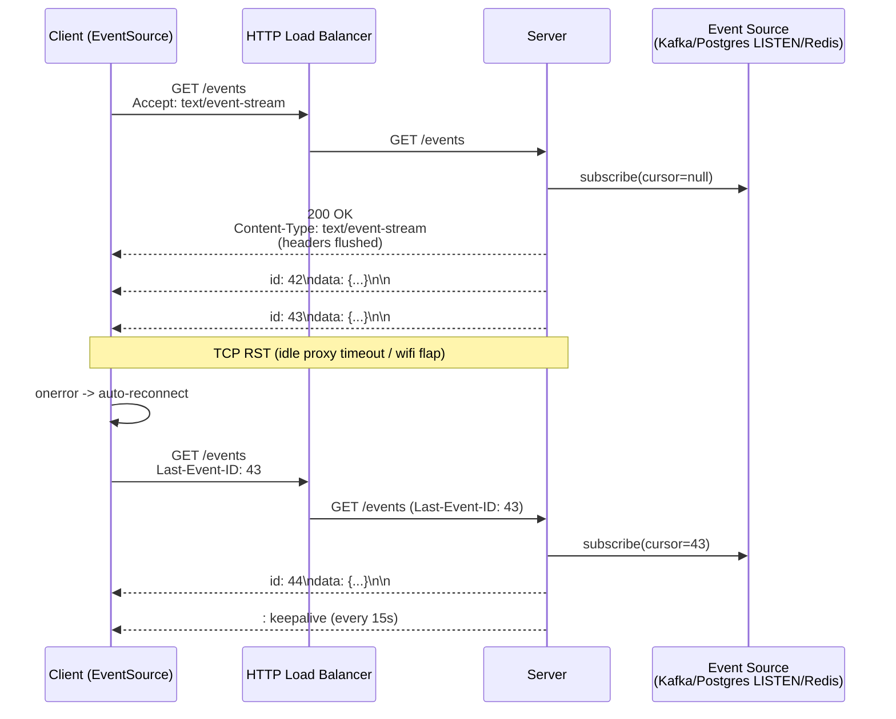
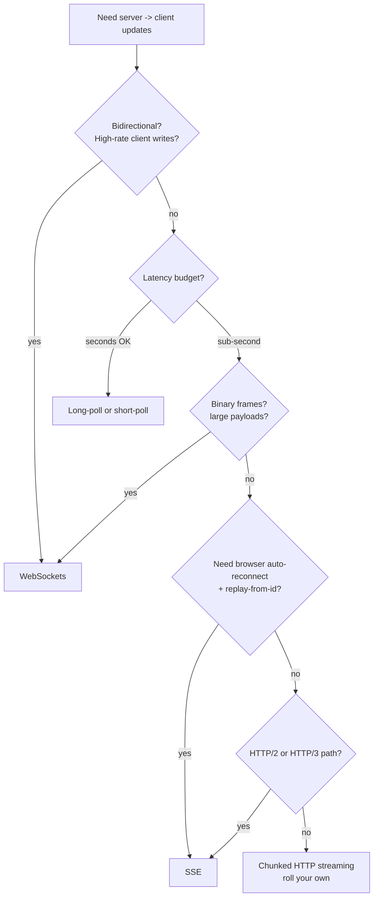

# Server-Sent Events (SSE)

## Why This Exists

**Problem.** A browser (or any HTTP client) needs a steady drip of server-originated updates: chat tokens streaming from an LLM, a stock ticker, a build log tail, a notification feed. Two bad options dominate:

- **Short polling** — clients hammer the server every N seconds. Most requests return nothing. You pay a TCP/TLS handshake per poll, your DB takes the hit, and latency floor = poll interval / 2.
- **WebSockets** — full-duplex, but you've now adopted a non-HTTP protocol mid-stream (`Upgrade: websocket`). Load balancers, corporate proxies, CDNs, request-tracing, and auth middleware all need to learn a new trick. You also lose HTTP caching, automatic gzip negotiation, and standard logging shapes.

SSE splits the difference. It's just a `GET` that returns `Content-Type: text/event-stream` and never closes. The server writes framed events; the browser's built-in `EventSource` reassembles them, **auto-reconnects on disconnect**, and **replays from the last seen event ID** via the `Last-Event-ID` header. No new protocol. No new infra. No new mental model.

**Key insight.** *One-way push is the common case.* Most "real-time" UIs read far more than they write. The rare write (send message, vote, ack) is just a normal `POST` on a sibling endpoint. By matching the protocol to the asymmetry of the workload, SSE deletes a category of operational pain — proxies, gateways, and CDNs already know how to stream a long HTTP response.

**Reach for this when:**
- The dominant traffic is server → client (LLM streaming, log tails, dashboards, notifications, build/deploy progress, MJPEG-style frame pushes).
- You want auto-reconnect with **gap-free resume** out of the box.
- You're terminating TLS at a stock HTTP load balancer (ALB, nginx, Cloudflare) and want it to "just work".
- Clients are browsers (`EventSource` is standard) or curl-friendly tooling.
- Events are small text/JSON. Binary needs base64 (acceptable but adds 33% overhead).

**Don't reach for this when:**
- You need bidirectional or client-heavy streams (collaborative editing CRDTs, gaming, voice). Use WebSockets or WebRTC.
- You hit the **per-origin connection cap** (HTTP/1.1: 6 per origin). Multiple SSE tabs to the same origin will starve each other. Use HTTP/2 (multiplexed, ~100 streams) or share a stream across tabs via a `BroadcastChannel`/`SharedWorker`.
- Events are large, frequent, and binary (e.g., video frames). Use WebSockets or a media protocol.
- You need request/response correlation per message. SSE has no built-in reply channel — you'd be reinventing it.

---

## Diagrams

### Connection lifecycle with resume



### Decision flow: SSE vs alternatives



---

## The Wire Format (in 30 seconds)

SSE is a UTF-8 text protocol. Each event is a block of `field: value` lines terminated by a blank line:

```
id: 1138
event: price-tick
retry: 5000
data: {"symbol":"AMZN","px":189.42,"ts":1717599012}

id: 1139
event: price-tick
data: {"symbol":"AMZN","px":189.45,"ts":1717599013}

: keepalive comment, ignored by client
```

Recognized fields:
- `id` — sticks on the client; sent back as `Last-Event-ID` on reconnect.
- `event` — names the event type; client subscribes via `es.addEventListener('price-tick', ...)`. Default is `message`.
- `data` — payload. Multi-line `data:` lines are joined with `\n`.
- `retry` — overrides the client's reconnect backoff in ms.
- Lines starting with `:` are comments — used as keepalive heartbeats to defeat idle proxy timeouts.

Required response headers:

```
HTTP/1.1 200 OK
Content-Type: text/event-stream
Cache-Control: no-cache, no-transform
Connection: keep-alive
X-Accel-Buffering: no   ; nginx-specific: disables proxy buffering
```

`X-Accel-Buffering: no` is the single most common production gotcha. Without it, nginx buffers your stream into 4–8 KiB chunks and the user sees nothing for seconds. Same goes for `proxy_buffering off` in nginx and `Cache-Control: no-transform` to stop intermediaries from gzipping (chunked + dynamic gzip = stalls).

---

## Implementations

### Browser client (built-in `EventSource`)

```javascript
// EventSource is in every modern browser. No library needed.
const es = new EventSource('/api/events', { withCredentials: true });

// Default channel
es.onmessage = (e) => {
  const msg = JSON.parse(e.data);
  console.log('msg', msg);
};

// Named channel
es.addEventListener('price-tick', (e) => {
  const tick = JSON.parse(e.data);
  render(tick);
});

// Auto-reconnect is built in. The browser will:
//   1. Reconnect after `retry` ms (default 3000).
//   2. Send `Last-Event-ID: <last id seen>` on reconnect.
//   3. Backoff if the server returns 5xx.
// To stop reconnecting, the SERVER must return 204 No Content
// or the client must call es.close().
es.onerror = (e) => {
  if (es.readyState === EventSource.CLOSED) {
    console.log('stream closed permanently');
  } else {
    console.log('reconnecting…');
  }
};
```

**`EventSource` limitations** that bite in production:
- No custom headers. You cannot set `Authorization: Bearer …`. Workarounds: cookies (and CORS `withCredentials: true`), or use `fetch()` + `ReadableStream` and parse the framing yourself, or smuggle the token as a query param (logged everywhere — careful).
- No request body. It's always `GET`.
- Subject to the HTTP/1.1 6-per-origin connection cap. **Use HTTP/2** in production — it multiplexes streams over one TCP connection.

### Server: Go (idiomatic, single binary)

```go
// /events handler streaming domain events with id-based resume.
func eventsHandler(w http.ResponseWriter, r *http.Request) {
    // Required headers — flush before first event so proxies commit headers.
    h := w.Header()
    h.Set("Content-Type", "text/event-stream")
    h.Set("Cache-Control", "no-cache, no-transform")
    h.Set("Connection", "keep-alive")
    h.Set("X-Accel-Buffering", "no") // nginx
    w.WriteHeader(http.StatusOK)

    flusher, ok := w.(http.Flusher)
    if !ok {
        http.Error(w, "streaming unsupported", http.StatusInternalServerError)
        return
    }
    flusher.Flush() // commit response headers immediately

    // Resume cursor from client.
    var since int64
    if last := r.Header.Get("Last-Event-ID"); last != "" {
        if v, err := strconv.ParseInt(last, 10, 64); err == nil {
            since = v
        }
    }

    // Subscribe to the event source. The fanout abstraction here could be
    // a Kafka consumer, postgres LISTEN, redis stream — pick one source of truth.
    sub, err := bus.Subscribe(r.Context(), since)
    if err != nil {
        // Don't 500 silently — the browser will reconnect forever otherwise.
        http.Error(w, err.Error(), http.StatusInternalServerError)
        return
    }
    defer sub.Close()

    // Heartbeat defeats idle-connection timeouts at LB / proxies.
    // ALB default idle: 60s. Cloudflare: 100s. Set heartbeat well under.
    heartbeat := time.NewTicker(15 * time.Second)
    defer heartbeat.Stop()

    for {
        select {
        case <-r.Context().Done():
            return // client disconnected; cleanup via defers
        case <-heartbeat.C:
            // SSE comment line — invisible to onmessage handlers.
            if _, err := fmt.Fprint(w, ": keepalive\n\n"); err != nil {
                return
            }
            flusher.Flush()
        case ev, ok := <-sub.C():
            if !ok {
                return // upstream closed
            }
            // Frame an event. Multi-line data must be split with leading "data: ".
            // We assume ev.Payload is single-line JSON; encode/json by default is.
            _, err := fmt.Fprintf(w,
                "id: %d\nevent: %s\ndata: %s\n\n",
                ev.ID, ev.Type, ev.Payload,
            )
            if err != nil {
                return // client gone; bus.Subscribe Close runs via defer
            }
            flusher.Flush()
        }
    }
}
```

Key things this gets right:
- **Flush headers before first event** — without this, browsers wait for the response body to grow before firing `onopen`, and HTTP/1.1 keep-alive negotiation can stall.
- **`r.Context().Done()`** is the canonical disconnect signal in Go's net/http — fires when the client TCP closes or the server shuts down.
- **Heartbeat under proxy idle timeout.** ALB defaults to 60s, nginx `proxy_read_timeout` defaults to 60s, Cloudflare to 100s, AWS API Gateway WebSocket to 10 min but **API Gateway HTTP cuts at 30s no matter what** — SSE through API Gateway is fundamentally broken for long streams.
- **`Last-Event-ID` resume.** The bus subscribes from the client's cursor, so a TCP blip never produces a gap. (This requires events to have **monotonic, durable IDs** — see Trade-offs.)

### Server: Python (FastAPI / Starlette)

```python
import asyncio, json
from typing import AsyncIterator
from fastapi import FastAPI, Request, Header
from fastapi.responses import StreamingResponse

app = FastAPI()

async def event_stream(request: Request, since: int) -> AsyncIterator[bytes]:
    # Subscribe to your bus. Could be aiopg LISTEN, aiokafka, redis xread.
    async with bus.subscribe(since=since) as sub:
        last_heartbeat = asyncio.get_event_loop().time()
        while True:
            if await request.is_disconnected():
                return  # client gone

            try:
                ev = await asyncio.wait_for(sub.next(), timeout=15.0)
            except asyncio.TimeoutError:
                # No event in 15s; emit a comment heartbeat.
                yield b": keepalive\n\n"
                continue

            payload = json.dumps(ev.payload, separators=(",", ":"))
            # Frame: id, event, data, terminator blank line.
            chunk = (
                f"id: {ev.id}\n"
                f"event: {ev.type}\n"
                f"data: {payload}\n\n"
            ).encode("utf-8")
            yield chunk

@app.get("/events")
async def events(
    request: Request,
    last_event_id: str | None = Header(default=None, alias="Last-Event-ID"),
):
    since = int(last_event_id) if last_event_id and last_event_id.isdigit() else 0
    return StreamingResponse(
        event_stream(request, since),
        media_type="text/event-stream",
        headers={
            "Cache-Control": "no-cache, no-transform",
            "X-Accel-Buffering": "no",
            "Connection": "keep-alive",
        },
    )
```

**ASGI gotcha.** Run under `uvicorn` or `hypercorn` with HTTP/1.1 keep-alive. **Don't run SSE behind WSGI** (gunicorn sync workers, mod_wsgi) — sync workers block one process per long-lived connection, and you'll exhaust the worker pool with 50 clients. Use ASGI workers (`gunicorn -k uvicorn.workers.UvicornWorker`).

### Browser without `EventSource`: `fetch` + `ReadableStream`

When you need custom headers (auth tokens) or `POST` semantics, drop `EventSource` and parse SSE yourself:

```typescript
async function* sseLines(resp: Response): AsyncGenerator<string> {
  const reader = resp.body!.getReader();
  const decoder = new TextDecoder();
  let buf = "";
  for (;;) {
    const { value, done } = await reader.read();
    if (done) return;
    buf += decoder.decode(value, { stream: true });
    let idx;
    // Events are separated by a blank line (\n\n).
    while ((idx = buf.indexOf("\n\n")) !== -1) {
      yield buf.slice(0, idx);
      buf = buf.slice(idx + 2);
    }
  }
}

async function streamEvents(token: string, lastId: string | null) {
  const resp = await fetch("/api/events", {
    headers: {
      "Accept": "text/event-stream",
      "Authorization": `Bearer ${token}`,
      ...(lastId ? { "Last-Event-ID": lastId } : {}),
    },
  });
  if (!resp.ok || !resp.body) throw new Error(`stream failed: ${resp.status}`);

  for await (const block of sseLines(resp)) {
    let id: string | null = null;
    let event = "message";
    const dataLines: string[] = [];
    for (const line of block.split("\n")) {
      if (line.startsWith(":")) continue;            // comment / heartbeat
      const colon = line.indexOf(":");
      if (colon === -1) continue;
      const field = line.slice(0, colon);
      // Spec: optional single space after colon.
      const value = line.slice(colon + 1).replace(/^ /, "");
      if (field === "id") id = value;
      else if (field === "event") event = value;
      else if (field === "data") dataLines.push(value);
    }
    if (id) lastId = id;                              // remember for reconnect
    handle(event, dataLines.join("\n"));
  }
  // If we get here, server closed cleanly (or with EOF).
  // Implement your own backoff + retry loop carrying lastId.
}
```

**You now own reconnect.** Wrap `streamEvents` in a `while (true)` with exponential backoff and jitter (cap at ~30s), and pass `lastId` back in. This is what `EventSource` does for you for free — only hand-roll when you must.

---

## Resume Semantics: Where Most Implementations Cheat

`Last-Event-ID` is the killer feature. It gives you **at-least-once delivery across reconnects** with zero client-side code. But it only works if your server can honor it. Three failure modes:

1. **Non-monotonic IDs.** If `id` is a wall-clock timestamp, two events in the same millisecond collide; clients drop one. Use a monotonic source: postgres `BIGSERIAL`, Kafka `(partition, offset)` (encode as `"p3:8472"`), Redis Streams `1717599012345-0`, or a per-process atomic counter + epoch.

2. **Cursor is unaddressable.** The client says `Last-Event-ID: 43`, but your bus only retains the last 100 events in memory. If client was offline for an hour through 50,000 events, **silently skipping ahead is a correctness bug** (they think they got everything). Decide deliberately:
   - Fail fast: `409 Conflict` + `event: stream-reset` and force a full snapshot reload.
   - Or guarantee retention horizon (e.g., 24h Kafka retention) and document it.

3. **Different server, different stream.** With sticky sessions off (the right default), reconnect lands on a new pod. If event IDs are per-pod-counters, `Last-Event-ID: 43` means nothing on the new pod. Use **globally-ordered IDs** (DB sequence, Kafka offsets, snowflake-style with node bits).

```
# WRONG — per-pod counter, breaks under reconnect to a different pod
id: 43

# RIGHT — globally ordered (kafka offset)
id: orders-7-3917442

# RIGHT — DB sequence, durable across restarts
id: 1138429
```

---

## SSE vs WebSockets vs HTTP/2 Server Push vs Long-Poll

| Property | SSE | WebSockets | HTTP/2 Server Push | Long Poll |
|---|---|---|---|---|
| Direction | Server → client only | Bidirectional | Server → client (resources) | Server → client per request |
| Transport | HTTP (plain GET) | `Upgrade: websocket`, custom framing | HTTP/2 PUSH_PROMISE | HTTP |
| Browser API | `EventSource` (built-in) | `WebSocket` (built-in) | None usable — **deprecated** | `fetch` + loop |
| Auto reconnect | Yes (built-in) | No (DIY) | N/A | DIY |
| Resume from gap | `Last-Event-ID` (built-in) | DIY (sequence numbers in app protocol) | N/A | DIY |
| Binary frames | No (use base64 / not idiomatic) | Yes | N/A | No |
| Works through corp HTTP proxies | Usually yes | Often blocked / requires CONNECT tunnel | N/A | Yes |
| Multiplexing per origin | HTTP/1.1: 6 cap; HTTP/2: ~100 streams | One TCP per socket (subprotocol-defined mux) | HTTP/2 native | One per poll |
| Standard middleware (auth, logging, tracing) | Works as-is | Often needs special-casing | N/A | Works as-is |
| Server complexity | Low (single goroutine / async gen per client) | Higher (frame parsers, ping/pong, close codes) | High and now-unsupported | Low |

**HTTP/2 server push is dead.** Chrome 106 (Sep 2022) removed support. Firefox followed. Cache priming via push never panned out — clients couldn't reliably know what was already in cache, and round-trips weren't actually saved. Use SSE or `103 Early Hints` for resource hinting instead. (Source: Chrome blog, "Removing HTTP/2 Server Push from Chrome", Aug 2022.)

---

## Trade-offs

| Benefit | Cost |
|---|---|
| **Just HTTP** — terminates at any L7 LB; no `Upgrade:` dance | Server holds one TCP connection per client; concurrency = file descriptors |
| **Auto-reconnect with `Last-Event-ID` is built into the browser** | Server MUST emit globally-monotonic IDs and retain enough history to honor any cursor a client could send |
| **Simple text framing, easy to debug with `curl -N`** | Text only — binary needs base64 (33% bloat) and breaks the "human-readable in tcpdump" property |
| **Plays nicely with HTTP middleware** (auth, rate limit, tracing, gzip negotiation) | Some middleware (response buffering, response compression, CDN edge caching) actively breaks streaming — must be disabled per-route |
| **Cheaper than polling** at the per-message level | More expensive than polling at the per-idle-second level (you're holding a TCP connection vs paying nothing between polls) |
| **HTTP/2 multiplexes streams** — no 6-connection cap | Only if your LB and origin both speak HTTP/2 end-to-end; many setups terminate H2 at the edge and proxy H1 to origin, re-introducing the cap |
| **One-way == simple** mental model | The moment you need bidirectional, you'll bolt on a `POST /commands` endpoint and a correlation-id scheme. At that point, ask whether WebSocket would have been simpler |
| **Resume gives at-least-once for free** | "At least once" — clients can see the same event twice if the server flushed, the network dropped, but the cursor advance was lost. Your handlers must be idempotent |

---

## Common Pitfalls

- **Forgetting `X-Accel-Buffering: no` behind nginx.** Your local dev streams fine; staging buffers events for 8 KiB or 60 seconds, whichever first. Symptom: "events arrive in batches of 5" or "first event takes a minute".
- **Heartbeat interval ≥ proxy idle timeout.** If your heartbeat is 60s and ALB cuts at 60s, you race and lose. Always set heartbeat strictly less than the *minimum* idle timeout in the path. 15s is a safe default.
- **API Gateway HTTP API in front of SSE.** AWS API Gateway HTTP/REST APIs cap at 30s response time and buffer the body. Use ALB or CloudFront → ALB. (CloudFront supports streaming since 2021 but you must disable response compression for `text/event-stream`.)
- **Compression eating the stream.** A compressing proxy with a buffer threshold will hold your events until it has enough bytes to compress. Send `Cache-Control: no-transform` and explicitly disable gzip on the route.
- **Per-origin connection cap.** Open three tabs of your app on HTTP/1.1; each opens an SSE; you've used 3 of the browser's 6 slots to that origin. Image loads, XHRs, and API calls now contend with SSE for the remaining 3. Migrate to HTTP/2 at the edge.
- **Hung connections after pod scale-down.** Without a heartbeat, a pod that loses its replicaset slot can hold "ghost" connections until kernel TCP keepalive kicks in (default 2 hours). Always emit heartbeats so dead pods produce write errors fast.
- **Sticky sessions.** Tempting to enable so `Last-Event-ID` always lands on the right pod. Don't — it makes deploys painful and uneven load nightmarish. Make IDs global instead.
- **Client-side memory leak.** Browsers retain the entire event stream in JS memory if you keep references. Window the data structure on the client (rolling buffer) or detach old DOM nodes.
- **Authentication via query string.** `EventSource` can't set `Authorization`. Putting `?token=...` in the URL gets logged in access logs, browser history, and referer headers. Prefer cookies (with `SameSite` and `Secure`) or hand-rolled `fetch`-based clients.
- **Treating SSE as a queue.** It's a *transport*. The durable ordered log is your Kafka topic / Postgres outbox / Redis Stream. SSE is the projection from that log into the browser. If you "lose events" because your only copy was the SSE buffer, you've conflated transport with storage.
- **Multi-line `data:` mistakes.** The spec says multiple `data:` lines join with `\n`. If you send `data: {"foo":\n"bar"}`, you've broken framing. Always single-line your JSON (`json.dumps(separators=(",", ":"))`, `JSON.stringify`, no pretty-printing).
- **Missing `\n\n` terminator.** If the server crashes mid-event, the last event has `\n` (one newline). Browsers will buffer it indefinitely waiting for the second `\n`. Always finalize a chunk with `\n\n` and flush.
- **Reconnect storms.** A backend incident kills 50,000 connections; clients all reconnect at exactly the default 3s. Send `retry: 5000` early in the stream and randomize on the server (`retry: ${5000 + rand(5000)}`). Or implement `503 Retry-After`.
- **Forgetting to handle the close.** The browser stops reconnecting only on **204 No Content** or **client `es.close()`**. A `200 OK` with empty body → reconnect. A `500` → reconnect. A `403` → reconnect (in some browsers). Document and implement an explicit "stream is permanently done" path with `204`.

---

## Decision Table

| Situation | Use | Why not the alternative |
|---|---|---|
| LLM token streaming to a web UI | **SSE** | WebSocket is overkill; OpenAI-compatible APIs already standardize on SSE for streaming completions |
| Live multiplayer game state, voice, video | **WebSocket / WebRTC** | SSE can't push from client; per-frame text overhead; no binary |
| Notification feed (1–10 events/min, browser tab) | **SSE** | Polling wastes RTTs; WebSocket adds protocol complexity for one-way data |
| Build / deploy log tail | **SSE** | Native curl-friendly; auto-reconnect rescues users on flaky wifi |
| Collaborative document editor (multi-user CRDT) | **WebSocket** | Bidirectional + low-latency client→server is the whole point |
| Backend service → backend service event stream | **gRPC streaming / Kafka / NATS** | SSE works, but you give up backpressure, schema, codegen, and binary efficiency |
| Mobile app push notifications | **APNs / FCM** | Don't keep a TCP connection alive on mobile; OS-level push is purpose-built and battery-aware |
| Long-poll legacy that's working fine | **Leave it** | Migration risk often exceeds the win; revisit when you need <1s latency |
| Need fan-out to 100k+ concurrent connections | **SSE on HTTP/2** with a fanout layer (Pushpin, Mercure, NATS) | A single Go server handles ~50k SSE conns; beyond that, dedicated push servers earn their keep |
| Browser ↔ server, custom headers required (auth tokens) | **`fetch`+`ReadableStream` parsing SSE** or **WebSocket** | `EventSource` can't set headers — pick whichever you'll maintain |
| Internal admin dashboard, you control the proxies | **SSE** | Lowest infra cost, simplest model |
| Public CDN-fronted product, multi-region | **WebSocket** or **SSE on a streaming-capable CDN edge** (Cloudflare, Fastly Compute) | Generic CDN edges may buffer text/event-stream by default |

---

## References

- WHATWG — HTML Living Standard: Server-Sent Events — https://html.spec.whatwg.org/multipage/server-sent-events.html
- MDN — Using Server-Sent Events — https://developer.mozilla.org/en-US/docs/Web/API/Server-sent_events/Using_server-sent_events
- MDN — `EventSource` interface — https://developer.mozilla.org/en-US/docs/Web/API/EventSource
- IETF RFC 7230 — HTTP/1.1 Message Syntax and Routing (chunked transfer encoding) — https://www.rfc-editor.org/rfc/rfc7230
- IETF RFC 9113 — HTTP/2 (multiplexing eliminates the 6-per-origin cap) — https://www.rfc-editor.org/rfc/rfc9113.html
- Chrome Developers — "Removing HTTP/2 Server Push from Chrome" (Aug 2022) — https://developer.chrome.com/blog/removing-push/
- nginx docs — "ngx_http_proxy_module: proxy_buffering" — https://nginx.org/en/docs/http/ngx_http_proxy_module.html#proxy_buffering
- AWS — "Application Load Balancer: connection idle timeout" — https://docs.aws.amazon.com/elasticloadbalancing/latest/application/edit-idle-timeout.html
- OpenAI API Reference — "Streaming responses" (real-world SSE usage) — https://platform.openai.com/docs/api-reference/streaming
- Mercure — "An open, easy, fast, reliable and battery-efficient solution for real-time communications" — https://mercure.rocks/spec
- Pushpin / Fanout — "Realtime API gateway using SSE/WebSocket fan-out" — https://pushpin.org/docs/
- Kleppmann — *Designing Data-Intensive Applications* (DDIA), ch. 11 "Stream Processing" — for upstream durable-log design that feeds SSE
- Beyer et al. — *Site Reliability Engineering*, ch. 22 "Addressing Cascading Failures" — applies directly to reconnect-storm design — https://sre.google/sre-book/addressing-cascading-failures/
- AWS Builders' Library — "Timeouts, retries, and backoff with jitter" (essential for reconnect strategy) — https://aws.amazon.com/builders-library/timeouts-retries-and-backoff-with-jitter/
- Helland — "Life Beyond Distributed Transactions" (idempotency / at-least-once) — https://queue.acm.org/detail.cfm?id=3025012

---

## See Also

- `../websockets/` — full-duplex sibling; reach for it when SSE's one-way model isn't enough
- `../long-polling/` — the predecessor; useful when SSE is blocked by infra
- `../webhooks/` — server-to-server push; the inverse of "browser sits and listens"
- `../idempotency/` — required reading because SSE resume is at-least-once
- `../../performance/tracing/` — propagate trace context across an SSE stream
