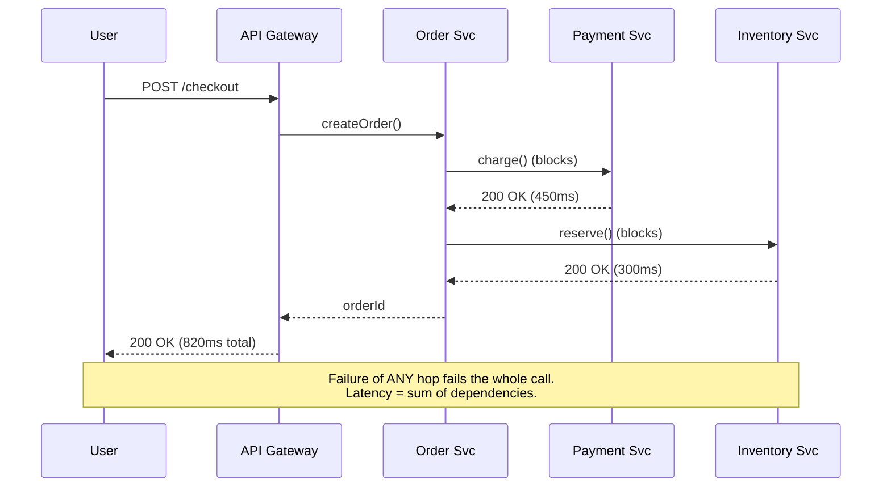
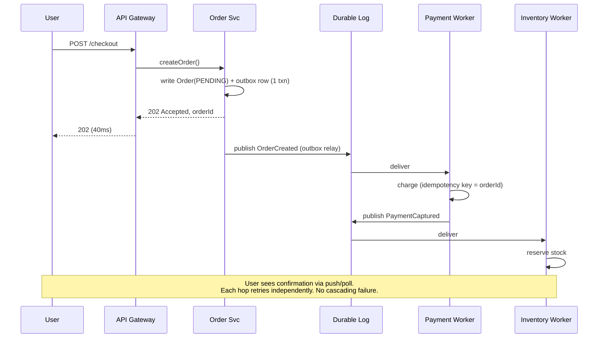
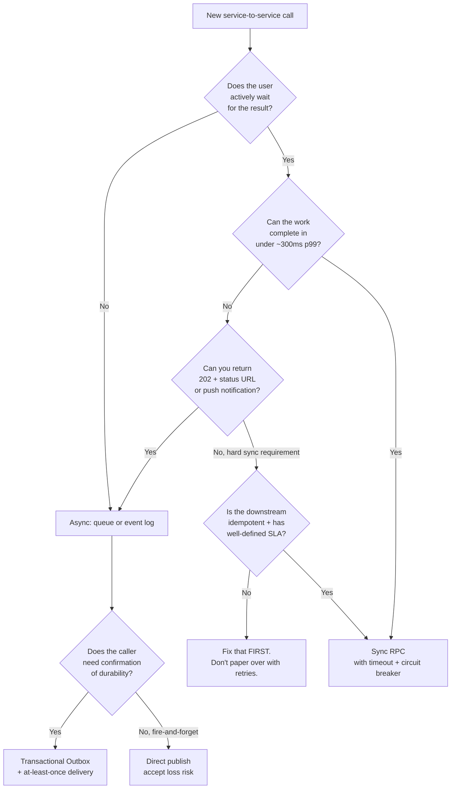

# Sync vs Async Communication

## Why This Exists

**Problem.** Engineers default to synchronous HTTP because it's the path of least resistance: a function call over the wire. That default works until the downstream slows down, the queue depth grows, the retry storm starts, or the user clicks "Pay" twice because the spinner ran for 12 seconds. Conversely, teams who've been burned by sync coupling sometimes over-correct and shove everything onto a queue — then spend the next quarter debugging why a refund "succeeded" but the customer never got their money, because the worker silently dead-lettered.

**Key insight.** The choice is not "sync vs async" — it's **"who waits, who retries, and who owns durability."** Synchronous communication couples *liveness* (caller and callee must both be up *right now*) and forces the caller to hold the failure semantics. Asynchronous communication decouples liveness via a durable buffer (queue, log, outbox) but pushes failure handling into a separate plane the caller cannot observe. Every distributed-systems bug worth its salt comes from getting that boundary wrong.

**Reach for this when:**
- A user-facing endpoint calls 3+ downstream services in series and you're seeing p99 explode.
- You're tempted to "just add a retry" to fix a flaky write, and you haven't proven the operation is idempotent.
- A PRD says "must respond synchronously to the client" and you suspect that's a requirement smuggled in from a UX assumption, not a business one.
- You're designing a workflow that spans more than ~200ms of work (payment capture, file processing, fan-out notifications).
- You're moving a monolith to services and need to decide which calls become RPCs and which become events.

**Don't reach for this when:**
- You're designing within a single process (function calls, in-memory channels) — the durability/coupling tradeoffs don't apply.
- You're doing pure read-only fan-out where the only question is caching — see `../../performance/caching/`.

## Diagrams

### Synchronous request/response



### Asynchronous (event-driven) equivalent



### Decision flow



## Core patterns

### 1. Synchronous RPC — done right

```python
# python: httpx + tenacity, with the four things every sync call MUST have
import httpx
from tenacity import retry, stop_after_attempt, wait_exponential_jitter, retry_if_exception_type

class PaymentClient:
    def __init__(self, base_url: str, breaker):
        # Connection pool is bounded — without this, a slow downstream
        # exhausts your worker pool and takes the WHOLE service down.
        self._client = httpx.Client(
            base_url=base_url,
            timeout=httpx.Timeout(connect=0.5, read=2.0, write=1.0, pool=0.1),
            limits=httpx.Limits(max_connections=50, max_keepalive_connections=20),
        )
        self._breaker = breaker  # e.g. pybreaker.CircuitBreaker

    @retry(
        # Only retry on transport errors and 5xx — NEVER on 4xx (caller bug).
        retry=retry_if_exception_type((httpx.TimeoutException, httpx.NetworkError)),
        stop=stop_after_attempt(3),
        # Jitter is non-negotiable. Synchronized retries cause thundering herds.
        wait=wait_exponential_jitter(initial=0.05, max=1.0),
        reraise=True,
    )
    def charge(self, order_id: str, amount_cents: int) -> dict:
        # Idempotency key MUST be tied to the business operation, not the attempt.
        # Re-trying the same charge for the same order MUST be a no-op server-side.
        return self._breaker.call(self._do_charge, order_id, amount_cents)

    def _do_charge(self, order_id: str, amount_cents: int) -> dict:
        r = self._client.post(
            "/charges",
            json={"order_id": order_id, "amount_cents": amount_cents},
            headers={"Idempotency-Key": f"charge:{order_id}"},
        )
        r.raise_for_status()
        return r.json()
```

The four non-negotiables for any sync RPC:
1. **Bounded timeouts** — connect, read, and *pool acquisition*. The default `None` (wait forever) is how outages cascade.
2. **Bounded connection pool** — saturation must produce fast failures, not silent queueing.
3. **Idempotency keys** — without them, retries either lose the operation or duplicate it. Pick which bug you'd rather debug at 3 AM.
4. **Circuit breaker** — open after N failures, half-open with probes, fast-fail in between. See AWS Builders' Library "Avoiding fallback in distributed systems."

### 2. Async via Transactional Outbox

The single biggest correctness bug in async systems: writing to the database AND publishing to the broker in two separate steps. One of them fails and the system is permanently inconsistent. Outbox fixes this.

```sql
-- Postgres: outbox table lives in the SAME database as your domain state.
-- The transaction either commits BOTH the order and the event, or NEITHER.
CREATE TABLE outbox (
    id              BIGSERIAL PRIMARY KEY,
    aggregate_id    TEXT NOT NULL,        -- e.g. order_id, used as partition key
    event_type      TEXT NOT NULL,        -- e.g. 'OrderCreated'
    payload         JSONB NOT NULL,
    created_at      TIMESTAMPTZ NOT NULL DEFAULT now(),
    published_at    TIMESTAMPTZ,          -- NULL = unpublished
    -- Index the relay scans. Partial index keeps it small.
    CHECK (published_at IS NULL OR published_at >= created_at)
);
CREATE INDEX outbox_unpublished_idx ON outbox (id) WHERE published_at IS NULL;
```

```go
// Go: write domain state and outbox row in one transaction.
func (s *OrderService) CreateOrder(ctx context.Context, req CreateOrderRequest) (string, error) {
    tx, err := s.db.BeginTx(ctx, nil)
    if err != nil { return "", err }
    defer tx.Rollback() // safe to call even after Commit

    orderID := newOrderID()
    if _, err := tx.ExecContext(ctx,
        `INSERT INTO orders (id, customer_id, status) VALUES ($1, $2, 'PENDING')`,
        orderID, req.CustomerID); err != nil {
        return "", err
    }

    payload, _ := json.Marshal(OrderCreatedEvent{OrderID: orderID, CustomerID: req.CustomerID})
    if _, err := tx.ExecContext(ctx,
        `INSERT INTO outbox (aggregate_id, event_type, payload) VALUES ($1, $2, $3)`,
        orderID, "OrderCreated", payload); err != nil {
        return "", err
    }

    if err := tx.Commit(); err != nil { return "", err }
    return orderID, nil
}
```

A separate **relay process** polls (or tails the WAL via Debezium / logical decoding) and publishes to the broker. The relay can be at-least-once because consumers must be idempotent anyway.

```go
// Relay: simplest version. Production uses CDC (Debezium) to avoid polling.
func (r *OutboxRelay) Run(ctx context.Context) error {
    for {
        rows, err := r.db.QueryContext(ctx,
            `SELECT id, aggregate_id, event_type, payload FROM outbox
             WHERE published_at IS NULL ORDER BY id LIMIT 100 FOR UPDATE SKIP LOCKED`)
        if err != nil { return err }

        for rows.Next() {
            var ev outboxRow
            rows.Scan(&ev.ID, &ev.AggregateID, &ev.EventType, &ev.Payload)
            // Publish with the row id as the producer-side dedupe key.
            if err := r.broker.Publish(ctx, ev.EventType, ev.AggregateID, ev.Payload,
                broker.WithDedupeKey(strconv.FormatInt(ev.ID, 10))); err != nil {
                continue // leave unpublished; retry next tick
            }
            r.db.ExecContext(ctx, `UPDATE outbox SET published_at = now() WHERE id = $1`, ev.ID)
        }
        if err := waitOrDone(ctx, 200*time.Millisecond); err != nil { return err }
    }
}
```

### 3. Idempotent consumer

```typescript
// TypeScript: consumer-side dedupe. At-least-once → exactly-once *effect*.
async function handleOrderCreated(msg: KafkaMessage) {
  const event = JSON.parse(msg.value.toString()) as OrderCreatedEvent;
  // dedupe key uniquely identifies the *event*, not the *delivery*.
  const dedupeKey = `consumer:inventory:order_created:${event.orderId}`;

  await db.transaction(async (tx) => {
    // INSERT ... ON CONFLICT DO NOTHING. If we've seen this event, skip.
    const { rowCount } = await tx.query(
      `INSERT INTO processed_events (key) VALUES ($1) ON CONFLICT DO NOTHING`,
      [dedupeKey],
    );
    if (rowCount === 0) {
      // Already processed — commit empty txn and ack.
      return;
    }
    await tx.query(
      `INSERT INTO inventory_reservations (order_id, sku, qty) VALUES ($1, $2, $3)`,
      [event.orderId, event.sku, event.qty],
    );
  });
  // ack only AFTER commit. If we crash before ack, redelivery hits the
  // dedupe row and is a no-op. This is the "exactly-once *effect*" pattern.
  await msg.ack();
}
```

### 4. Sync API hiding async work — the 202 pattern

The "must respond synchronously" trap is usually solved by separating *acknowledgement* (sync, fast, durable) from *completion* (async, eventually-consistent, observable).

```http
POST /v1/exports HTTP/1.1
Content-Type: application/json
{"format":"csv","filter":{"month":"2026-05"}}

HTTP/1.1 202 Accepted
Location: /v1/exports/exp_01HZX9...
Retry-After: 5
{"id":"exp_01HZX9...","status":"queued"}
```

```http
GET /v1/exports/exp_01HZX9... HTTP/1.1

HTTP/1.1 200 OK
{"id":"exp_01HZX9...","status":"completed","download_url":"https://..."}
```

The client polls (or subscribes to a webhook / SSE / WebSocket). The server has full latitude to retry, fan out, scale workers, and degrade gracefully — none of which is possible if the original POST blocks until the export is built.

## Trade-offs

| Synchronous benefit | Synchronous cost |
|---|---|
| Caller learns success/failure immediately | Caller's latency = sum of *all* downstream latencies |
| Stack traces span the whole call (easy debugging) | Failure of any hop fails the whole transaction |
| Strong consistency at the boundary (read-after-write) | Liveness coupling: every dependency must be up |
| Simple API contract: function call over the wire | Backpressure manifests as timeouts → cascading failures |
| No infrastructure beyond HTTP/gRPC | Capacity = min(capacity of every dependency) |

| Asynchronous benefit | Asynchronous cost |
|---|---|
| Caller decoupled from downstream availability | Caller cannot observe downstream failures directly |
| Buffer absorbs traffic spikes (load smoothing) | Queue depth becomes a *new* SLO to monitor |
| Failure isolation: one consumer down ≠ producer down | Eventual consistency surprises (read your writes!) |
| Natural fan-out to N consumers (pub/sub) | Operational complexity: broker, DLQ, replay, schema evolution |
| Workers scale independently of API tier | Debugging requires distributed tracing across the broker |
| Retries handled by infra, not application code | At-least-once → consumers MUST be idempotent or you double-charge |

## Common Pitfalls

- **"Fire and forget" with no durability.** A producer publishes to a broker but doesn't await ack, and the broker connection is down. The event is silently dropped. Symptom: "we sent the email, but the user never got it" — except you didn't send it. Fix: outbox or `acks=all` with synchronous ack handling.
- **Sync retries without idempotency keys.** First call timed out at 5s but actually completed at 6s. Retry double-charges the customer. Symptom: duplicate charges, duplicate emails, double-booked rooms. Fix: server-side idempotency on a stable business key.
- **Async hides bugs in dev.** Local testing has tiny queues that drain instantly, so eventual consistency looks instant. Production has 30s lag during peak. Symptom: reads return stale data right after a write — only in prod, only at peak. Fix: artificial broker delay in staging; explicit `read_your_writes` semantics where needed (route reads to leader for N seconds, or use causal tokens).
- **Sync chains > 3 hops.** Every additional hop multiplies failure probability and adds latency. p99 of A→B→C→D is approximately p99(A) + p99(B) + p99(C) + p99(D), not max. A four-hop chain with each hop at p99=200ms has end-to-end p99 of nearly 800ms. Fix: parallelize what you can, async-ify what doesn't need to block.
- **Unbounded queues = unbounded latency.** A queue absorbing a 10× traffic spike creates a 10× latency spike for everything in it. Symptom: "the system is up but everything is 30 minutes behind." Fix: bounded queues, load shedding, autoscaling on queue depth (not just CPU).
- **The "must respond synchronously" trap.** Product says "the user needs to see the confirmation immediately." That almost never means "the work must complete before the response." It means "the user needs durable acknowledgement that the system received the request." 202 + status endpoint solves it 90% of the time.
- **Synchronous retries on the same connection pool.** Retry storms exhaust the pool, the service becomes unhealthy, the load balancer routes traffic elsewhere, and the cascade begins. Fix: separate retry budget (e.g. retry only 10% of requests), client-side circuit breaker, jittered exponential backoff.
- **DLQ as a dumping ground.** Messages flow into the DLQ but no one watches it. Symptom: a class of operations has been silently failing for 6 weeks. Fix: alert on DLQ depth > 0 with the same severity as a 5xx alarm. Have a documented replay procedure.
- **Schema evolution without versioning.** Producer changes the event shape, consumers crash, the broker fills with poison pills. Fix: backwards-compatible schemas (Avro/protobuf with rules), explicit version field, contract tests.
- **Eventual consistency violating user mental models.** User clicks "Add to cart" then immediately navigates to cart and sees nothing. Fix: optimistic UI; or sticky reads to leader for N seconds; or send the event over a session-scoped causal channel.
- **Distributed transactions in disguise.** "We'll just call service A, then service B, then service C synchronously, and if C fails, undo." Welcome to a hand-rolled saga without compensations. Either commit to the saga pattern with explicit compensating transactions, or restructure so only one service owns the write.

## Decision Table

| Situation | Choose | Why |
|---|---|---|
| User-facing read, fits in <200ms p99 | **Sync** | Simpler, lower latency, no queue overhead |
| User-facing write that must be durable but takes >1s | **Sync ack + async work** (202 pattern) | User gets fast confirmation; work isolated from request lifecycle |
| Internal service A *must* know if B succeeded to proceed | **Sync RPC** | Async forces you to invent a saga |
| Producer doesn't care which consumers exist | **Async pub/sub** | Decouples producer from consumer fan-out |
| Operation spans 3+ services with possible failures at each | **Async saga** with explicit compensations | Sync orchestration creates fragile chains |
| Read-your-writes semantics required | **Sync** OR async with sticky leader reads | Async + cached reads = stale-data bugs |
| Bursty traffic with idle periods | **Async** | Queue smooths the burst; sync needs over-provisioning |
| Bounded latency required (sub-100ms) | **Sync** | Broker hop adds ≥ 1–10ms even at best |
| Multi-region with WAN between caller/callee | **Async** | WAN failures are common; sync makes them user-visible |
| Webhook to external partner | **Async with retry + DLQ** | You don't control their availability |
| Critical path with strict idempotency (e.g. payments) | **Either, but always idempotent** | Idempotency is mandatory regardless of transport |
| Bulk operation (>100 items) | **Async per-item** | Sync batch fails atomically — one bad item kills the lot |
| Real-time UI feedback (typing indicator) | **Sync (or WebSocket)** | Async lag = bad UX, durability not needed |
| Audit log / analytics fan-out | **Async** | Consumers must not affect producer latency or availability |

## When sync limits throughput

A common production failure mode: you have an API tier sized for 1000 RPS. It calls a synchronous downstream sized for 800 RPS. At 850 RPS, the downstream's latency rises (queuing theory: ρ → 1, latency → ∞). Your API tier's connection pool fills up. Healthy upstream calls now wait for pool slots. Effective throughput drops to maybe 600 RPS, *worse than if you'd never had the burst*. This is the classic "death spiral" — see Marc Brooker's writing on goodput vs throughput.

**Async breaks this.** Producer writes to the broker (cheap, ~1ms), returns to the user. Consumer drains at 800 RPS. Queue depth grows during the spike, drains during the trough. End-to-end latency rises but the *system stays up* and goodput equals offered load up to the consumer's sustained capacity.

## When async hides bugs

The flip side: a worker silently fails on a poison message and dead-letters it. The producer has long since returned 202 to the user. The user thinks their refund processed. The DLQ alarm wasn't wired up. Three weeks later, support gets a ticket.

**Sync exposes failure to the caller.** Async requires you to *engineer* failure visibility:
- DLQ alarms with non-zero thresholds
- End-to-end SLOs (e.g. "95% of refunds complete within 10 minutes")
- Reconciliation jobs that compare expected vs actual state
- Distributed tracing that follows the message through the broker (W3C trace context propagation)
- User-facing status pages or status endpoints

If your team can't commit to that operational surface area, sync is honestly safer — the failure shows up as an HTTP 500 the user can react to.

## References

- Kleppmann — *Designing Data-Intensive Applications* — ch. 4 (Encoding & Evolution), ch. 11 (Stream Processing). DDIA is the canonical reference for the consistency/availability tradeoffs.
- Helland — *Life Beyond Distributed Transactions: An Apostate's Opinion* — https://queue.acm.org/detail.cfm?id=3025012 — the foundational paper on why async + idempotency beats distributed sync transactions.
- Helland — *Data on the Outside vs Data on the Inside* — https://queue.acm.org/detail.cfm?id=3415014 — explains why event payloads are values, not references.
- Fowler — *What do you mean by "Event-Driven"?* — https://martinfowler.com/articles/201701-event-driven.html — disambiguates the four flavors of "event."
- Fowler — *Microservices and the First Law of Distributed Objects* — https://martinfowler.com/articles/distributed-objects-microservices.html — why "just RPC" is rarely just RPC.
- Richardson — *Pattern: Transactional Outbox* — https://microservices.io/patterns/data/transactional-outbox.html — canonical writeup of the outbox pattern.
- Richardson — *Pattern: Saga* — https://microservices.io/patterns/data/saga.html — for multi-step async workflows.
- Google SRE Book — *Handling Overload* — https://sre.google/sre-book/handling-overload/ — load shedding, graceful degradation.
- Google SRE Book — *Addressing Cascading Failures* — https://sre.google/sre-book/addressing-cascading-failures/ — the canonical reference on why sync chains die.
- Google SRE Workbook — *Managing Load* — https://sre.google/workbook/managing-load/ — practical patterns.
- AWS Builders' Library — *Timeouts, retries, and backoff with jitter* — https://aws.amazon.com/builders-library/timeouts-retries-and-backoff-with-jitter/ — required reading for anyone writing sync clients.
- AWS Builders' Library — *Avoiding fallback in distributed systems* — https://aws.amazon.com/builders-library/avoiding-fallback-in-distributed-systems/ — why "graceful degradation" is harder than it looks.
- AWS Builders' Library — *Using load shedding to avoid overload* — https://aws.amazon.com/builders-library/using-load-shedding-to-avoid-overload/.
- Brooker — *Tail latency and the end of scaling* — https://brooker.co.za/blog/2021/04/19/latency.html — why synchronous fan-out destroys p99.
- Brooker — *It's About Time: Why Tail Latency Matters* — https://brooker.co.za/blog/2017/12/28/tail.html.
- Nygard — *Release It!*, 2nd ed. — chapters on Stability Patterns (Circuit Breaker, Bulkhead, Timeouts) and Stability Antipatterns. Pragmatic Bookshelf.
- Vogels — *Eventually Consistent* — https://queue.acm.org/detail.cfm?id=1466448 — the original CAP-aware framing of why async is acceptable.
- Stripe Engineering — *Designing robust and predictable APIs with idempotency* — https://stripe.com/blog/idempotency — production-grade idempotency.
- Wampler — *Fast Data Architectures for Streaming Applications* (O'Reilly) — for the async-first end of the spectrum.

## See Also

- `../grpc/` — sync transport options and their tradeoffs.
- `../webhooks/` — async-to-external-systems patterns; retry, DLQ, signing.
- `../../reliability/circuit-breaker/` — bulkheading sync clients.
- `../../reliability/retries-backoff/` — jitter, retry budgets, idempotency keys.
- `../../reliability/timeouts/` — connect/read/pool timeout layering.
- `../../reliability/load-shedding/` — what to do when async queues grow without bound.
- `../../architecture-patterns/saga/` — orchestrated and choreographed compensations.
- `../../performance/tracing/` — propagating trace context across async hops.
