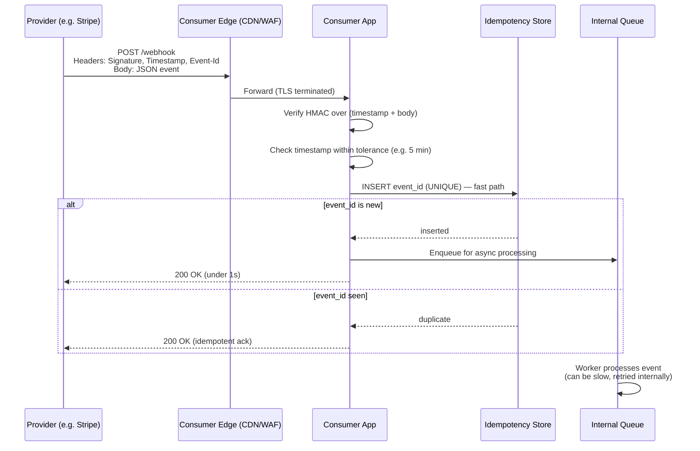
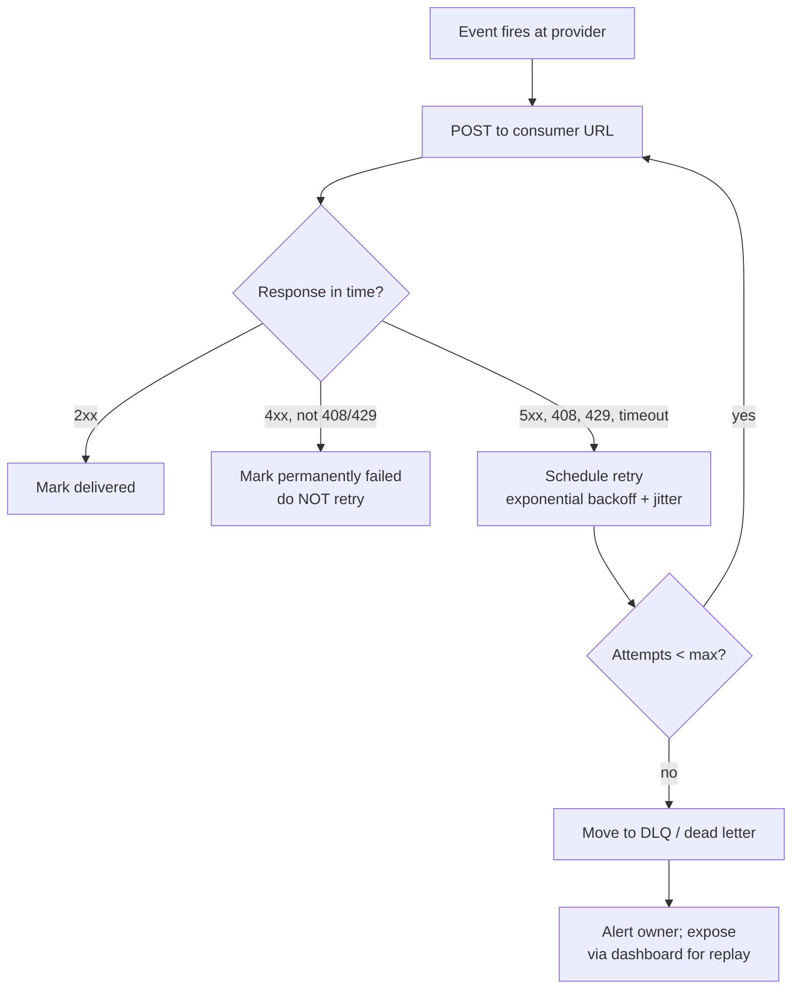
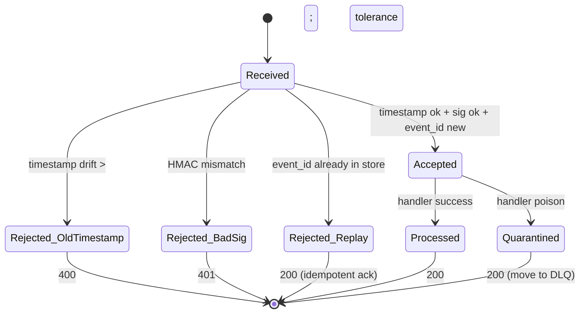
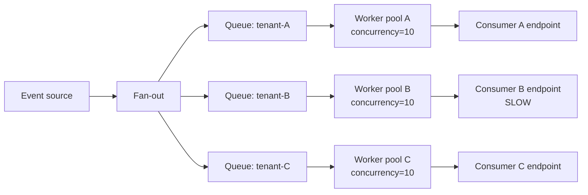

# Webhooks

## Why This Exists

**Problem.** A provider system (Stripe, GitHub, Shopify, your internal billing service) generates events. Consumers need to react to those events with low latency. Polling every consumer every few seconds wastes both sides' resources and still leaves a latency floor. Long-polling is fragile across NAT and load balancers. Server-sent events and WebSockets need persistent connections that don't survive autoscaling well.

**Key insight.** Invert the direction. The provider performs an authenticated HTTP `POST` to a URL the consumer controls *the moment* an event happens. The consumer is now a tiny HTTP server. The provider is a tiny HTTP client. The internet's existing infrastructure (TLS, HTTP, load balancers, retries) does the rest.

This sounds simple. It is not. Webhooks fail in characteristic, painful ways:

- **The consumer is down or slow.** The provider must retry — but retries cause duplicate processing.
- **An attacker forges requests.** Anyone on the internet can `POST` to your public URL. You need cryptographic proof the provider sent it.
- **Captured requests are replayed.** Even with HMAC signatures, an attacker can replay a valid old event.
- **Events arrive out of order.** `subscription.canceled` arrives before `subscription.created` because retries reordered them.
- **The consumer accepts but loses the event.** It returned `200 OK` then crashed before persisting.
- **The consumer takes 30s to respond.** The provider times out, marks it failed, and retries — while the consumer is *still processing the original*.

Webhooks are an **at-least-once** push channel with no ordering guarantees and an adversarial security boundary. Treat them that way.

### Reach for this when

- A third-party SaaS (Stripe, GitHub, Twilio, Shopify, Slack, Zoom, PagerDuty) needs to notify your system of events.
- You publish events to *external* customers who run their own systems and want push.
- Latency target is seconds, not minutes — polling can't get you there cheaply.
- Volume is low-to-moderate per consumer (< ~100 events/sec sustained). Above that, prefer a managed bus.

### Don't reach for this when

- Both sides are inside your VPC/network — use **SQS, SNS, Kafka, EventBridge, or NATS**. Webhooks pay a TLS handshake, a public-internet hop, and an HTTP framing tax for no benefit.
- Consumers need **strict ordering** or **exactly-once** semantics — use a log-based stream (Kafka with consumer group offsets).
- Volume is high and bursty — webhooks force the *provider* to manage a fan-out queue per consumer. A pub/sub bus is purpose-built for this.
- The event is request/response — that's an RPC, not a webhook.
- Consumers are mobile clients or browsers — use push notifications (APNs/FCM) or WebSockets/SSE.

---

## Diagrams

### Happy path: signed delivery with idempotent consumer



### Retry / backoff with poison pill quarantine



### Replay protection state machine



---

## The Wire Contract

A production-grade webhook request looks like this:

```http
POST /webhooks/stripe HTTP/1.1
Host: api.example.com
Content-Type: application/json
User-Agent: Stripe/1.0 (+https://stripe.com/docs/webhooks)
Stripe-Signature: t=1717599600,v1=5257a869e7ecebeda32affa62cdca3fa51cad7e77a0e56ff536d0ce8e108d8bd
Webhook-Id: evt_3PQs8x2eZvKYlo2C0K3PqA9B
Webhook-Timestamp: 1717599600

{"id":"evt_3PQs8x2eZvKYlo2C0K3PqA9B","type":"payment_intent.succeeded","created":1717599600,"data":{...}}
```

Five things to notice:

1. **Distinct event id** (`Webhook-Id` / `evt_...`). The consumer's idempotency key.
2. **Timestamp** outside the body so it's covered by the signature without parsing JSON.
3. **Signature** is HMAC over `timestamp + "." + body` — not just body. This binds the timestamp into the signature so attackers can't strip it.
4. **Versioned signature scheme** (`v1=`). Lets the provider rotate to `v2=` later without breaking consumers.
5. **No secret in the URL.** Never put a token in the path or query string — it leaks via logs, referrers, and CDNs.

---

## Provider Side: Sending a Webhook

### Sign the way Stripe and GitHub do — HMAC-SHA256 over (timestamp + body)

```python
# provider/dispatch.py
import hmac, hashlib, json, time, uuid
from typing import Mapping

import httpx

SIGNING_SCHEME = "v1"  # bumped when algo changes

def sign(secret: bytes, timestamp: int, body: bytes) -> str:
    # Bind timestamp INTO the signature. Attackers cannot rewrite the timestamp
    # to bypass replay windows without invalidating the HMAC.
    payload = f"{timestamp}.".encode() + body
    mac = hmac.new(secret, payload, hashlib.sha256).hexdigest()
    return f"t={timestamp},{SIGNING_SCHEME}={mac}"

async def deliver(
    url: str,
    secret: bytes,
    event: Mapping,
    *,
    client: httpx.AsyncClient,
    attempt: int = 1,
) -> int:
    body = json.dumps(event, separators=(",", ":"), sort_keys=True).encode()
    ts = int(time.time())
    headers = {
        "Content-Type": "application/json",
        "Webhook-Id": event["id"],
        "Webhook-Timestamp": str(ts),
        "Webhook-Signature": sign(secret, ts, body),
        "Webhook-Attempt": str(attempt),
    }
    # Tight timeout — consumer must ack fast. They can do real work async.
    resp = await client.post(url, content=body, headers=headers, timeout=10.0)
    return resp.status_code
```

### Retry policy that doesn't take down your customer

```python
# provider/retry.py
import random
from datetime import datetime, timedelta

# Stripe-style schedule. The exact numbers matter less than: fast at first,
# wide at the end, capped, and jittered so we don't synchronize across events.
RETRY_DELAYS_SEC = [
    5, 30, 120, 600, 3_600, 21_600, 86_400, 86_400, 86_400,  # ~3 days total
]
MAX_ATTEMPTS = len(RETRY_DELAYS_SEC) + 1

def next_attempt_at(attempt: int) -> datetime | None:
    """Return when to next try, or None if we've exhausted retries."""
    if attempt > MAX_ATTEMPTS:
        return None
    delay = RETRY_DELAYS_SEC[attempt - 1]
    # Full jitter (AWS Architecture Blog "Exponential Backoff and Jitter").
    # Without jitter, a flapping consumer that came back online sees ALL
    # queued retries arrive simultaneously — instant DDoS.
    jittered = random.uniform(0, delay)
    return datetime.utcnow() + timedelta(seconds=jittered)

def should_retry(status: int) -> bool:
    if 200 <= status < 300:
        return False  # delivered
    if status in (408, 425, 429, 500, 502, 503, 504):
        return True  # transient
    if 400 <= status < 500:
        return False  # consumer rejected — don't hammer them
    return True  # network error, treat as transient
```

### Per-consumer queues — never let one bad consumer poison the rest



If you put all events on one queue and a single consumer slows to 30s response times, your worker pool is saturated and *every other consumer* starves. Per-consumer queues with bounded concurrency are a correctness requirement, not an optimization.

---

## Consumer Side: Receiving a Webhook

This is where most teams get it wrong. A correct consumer does **five things in this exact order**:

1. **Read the body once into bytes.** Do not parse JSON yet. The signature is over the raw bytes, and any reformatting (whitespace, key reorder) breaks verification.
2. **Verify HMAC** in constant time.
3. **Verify timestamp** is within tolerance (typically 5 min) — defeats replay of old captured requests.
4. **Insert the event id** into an idempotency store with a UNIQUE constraint. If insert fails, return 200 immediately — already processed.
5. **Hand off to async processing.** Acknowledge fast (< 1s). The handler runs on its own retry domain.

```python
# consumer/handler.py
import hmac, hashlib, time, json, os
from fastapi import FastAPI, Request, HTTPException, Header
from sqlalchemy import text

app = FastAPI()
WEBHOOK_SECRET = os.environ["WEBHOOK_SECRET"].encode()
TOLERANCE_SEC = 300  # 5 minutes — same as Stripe default

def parse_signature_header(h: str) -> tuple[int, str]:
    # "t=1717599600,v1=abcdef..."
    parts = dict(p.split("=", 1) for p in h.split(","))
    return int(parts["t"]), parts["v1"]

def verify(secret: bytes, ts: int, body: bytes, expected: str) -> bool:
    payload = f"{ts}.".encode() + body
    mac = hmac.new(secret, payload, hashlib.sha256).hexdigest()
    # CONSTANT TIME comparison. A naive == leaks bytes via timing on TLS.
    return hmac.compare_digest(mac, expected)

@app.post("/webhooks/billing")
async def receive(request: Request, db, queue,
                  signature: str = Header(..., alias="Webhook-Signature"),
                  event_id: str = Header(..., alias="Webhook-Id")):
    body = await request.body()  # raw bytes — DO NOT json.loads yet

    try:
        ts, sig = parse_signature_header(signature)
    except (ValueError, KeyError):
        raise HTTPException(400, "malformed signature header")

    if abs(time.time() - ts) > TOLERANCE_SEC:
        # Old request, possibly replayed. Reject.
        raise HTTPException(400, "timestamp outside tolerance")

    if not verify(WEBHOOK_SECRET, ts, body, sig):
        # Either tampered or wrong secret. 401, NOT 400 — the body is fine,
        # the auth is wrong. Don't leak which.
        raise HTTPException(401, "signature mismatch")

    # Idempotency: UNIQUE constraint does the work. Cheap and race-free.
    # Note: we also store body hash so a replay with same id but different
    # body (which would imply a bug, not an attack) is detectable.
    body_hash = hashlib.sha256(body).hexdigest()
    try:
        await db.execute(
            text("""
              INSERT INTO webhook_events (event_id, body_sha256, received_at)
              VALUES (:id, :hash, now())
            """),
            {"id": event_id, "hash": body_hash},
        )
    except UniqueViolation:
        # Already received. Ack idempotently — the provider would otherwise retry.
        return {"status": "duplicate"}

    # Hand off. Do NOT process inline — keep p99 ack time well under provider timeout.
    event = json.loads(body)
    await queue.enqueue("process_webhook", event_id=event_id, event=event)

    return {"status": "queued"}
```

### Why a queue between the HTTP handler and the worker?

The provider has a hard timeout (Stripe: 30s, GitHub: 10s, most: <30s). If your handler does the actual work synchronously — write to DB, call downstream API, send email — any one of those latency spikes turns into a webhook timeout, which the provider treats as failure, which causes a retry. You then process the same event twice, and your downstream call counts get billed twice.

**Rule:** the HTTP handler's job is to authenticate, deduplicate, persist, and acknowledge. Real work happens on a worker that has its own retry domain and dead-letter queue.

### Idempotency table schema

```sql
-- consumer/migrations/001_webhook_events.sql
CREATE TABLE webhook_events (
    event_id      TEXT PRIMARY KEY,           -- provider-assigned id
    body_sha256   TEXT NOT NULL,              -- detect "same id, different body" bugs
    received_at   TIMESTAMPTZ NOT NULL DEFAULT now(),
    processed_at  TIMESTAMPTZ,                -- NULL = queued or in flight
    last_error    TEXT,
    attempt_count INT NOT NULL DEFAULT 0
);

-- Retention: webhook providers retry for ~3 days. Keep at least 7.
-- For high-volume systems, partition by received_at and drop old partitions.
CREATE INDEX webhook_events_received_at_idx ON webhook_events (received_at)
    WHERE processed_at IS NULL;
```

### Processing on the worker side — make handlers idempotent too

The HTTP-layer dedupe protects against provider retries. It does **not** protect against your own worker retrying after a crash. The worker's job must also be idempotent.

```python
# consumer/worker.py
async def process_webhook(event_id: str, event: dict, db):
    # Use event_id as the idempotency key in EVERY downstream effect.
    # Examples:
    #   - Outbound API: pass it as Idempotency-Key header (Stripe pattern).
    #   - DB write: INSERT ... ON CONFLICT (event_id) DO NOTHING.
    #   - Outgoing webhook: include it as Webhook-Id so YOUR consumer dedupes.
    event_type = event["type"]

    if event_type == "payment_intent.succeeded":
        await db.execute(
            text("""
              INSERT INTO payments (id, amount_cents, status, source_event)
              VALUES (:id, :amt, 'succeeded', :evt)
              ON CONFLICT (id) DO UPDATE
                SET status = EXCLUDED.status,
                    source_event = EXCLUDED.source_event
                -- ORDERING GUARD: only apply newer events.
                WHERE payments.last_event_at < :ts
            """),
            {"id": event["data"]["object"]["id"],
             "amt": event["data"]["object"]["amount"],
             "evt": event_id,
             "ts": event["created"]},
        )

    # Mark processed only AFTER side effects. If we crash between the side
    # effect and this update, we re-process — fine, because every step is
    # idempotent.
    await db.execute(
        text("UPDATE webhook_events SET processed_at = now() WHERE event_id = :id"),
        {"id": event_id},
    )
```

The `WHERE payments.last_event_at < :ts` clause is the **out-of-order guard**. Webhooks have no ordering guarantee — a `payment.refunded` retry can arrive after a later `payment.succeeded` for an unrelated reason. Always carry the event timestamp and refuse to overwrite newer state with older.

---

## Security Beyond Signatures

HMAC verification is necessary, not sufficient. The full checklist:

| Threat                              | Mitigation                                                                                                    |
| ----------------------------------- | ------------------------------------------------------------------------------------------------------------- |
| Forged request                      | HMAC over (timestamp, body) with shared secret rotated regularly                                              |
| Replayed old capture                | Reject if `\|now - timestamp\|` > tolerance (5 min typical)                                                   |
| Replayed *recent* capture           | Idempotency store on event_id — even within tolerance, dupes are no-ops                                      |
| Secret leakage                      | Rotate secrets; support multiple active secrets during rotation; never log them; not in URLs or query strings |
| SSRF via webhook URL (provider side)| Disallow private IP ranges; resolve DNS once and pin to public IP for that delivery                           |
| Unbounded body                      | Cap request size (e.g. 1 MB); 413 above that                                                                  |
| Slowloris / starvation              | Read body with timeout; bounded concurrent handlers per source                                                 |
| TLS downgrade                       | Require TLS 1.2+; reject HTTP URLs at registration                                                             |
| Public discovery of webhook URLs    | URLs include unguessable component (e.g. `/webhooks/stripe/{tenant_uuid}`); no enumeration                    |
| Compromised consumer endpoint       | Sign requests; on consumer side, allowlist provider IP ranges where published                                 |

### Rotating signing secrets without downtime

The consumer must accept signatures from **any of the currently active** secrets:

```python
def verify_with_rotation(secrets: list[bytes], ts: int, body: bytes, expected: str) -> bool:
    return any(verify(s, ts, body, expected) for s in secrets)
```

Rotation procedure: provider adds a new secret (now two are active), consumer is updated to accept both, provider switches signing to the new secret, consumer drops the old secret. Each step is independently reversible.

---

## Trade-offs

| Benefit                                         | Cost                                                                              |
| ----------------------------------------------- | --------------------------------------------------------------------------------- |
| Push-based: low latency, no polling waste       | Consumer must run a public, hardened HTTP endpoint                                 |
| Uses existing internet plumbing (HTTP/TLS)      | Subject to internet weather: TLS handshakes, ISP routing, DNS                     |
| Provider doesn't need a message broker          | Provider re-implements queueing, retries, DLQ — usually worse than a real broker  |
| Trivial to integrate (curl-able, language-agnostic) | Every consumer reimplements signing, idempotency, replay protection — often wrongly |
| Per-event auth via HMAC                         | Secret distribution and rotation is its own headache                              |
| Decouples timing                                | At-least-once with no ordering — every consumer must be idempotent + reordering-safe |
| Customer-controlled URL                         | Provider must SSRF-defend, IP-allowlist defend, and timeout-defend their dispatcher |
| Cheap at low scale                              | Per-consumer queue + worker isolation needed once you have many consumers          |

---

## Common Pitfalls

- **Returning 200 before the work is durable.** The handler ack'd, then crashed. Provider thinks it's delivered. Event lost forever. **Fix:** persist (queue insert or idempotency row) *before* responding 200. The persistence is the receipt.

- **Doing real work synchronously in the HTTP handler.** Handler latency creeps from 50ms to 8s as your DB grows. Provider timeout is 10s. One bad day, every webhook is a duplicate. **Fix:** ack-then-process. Always.

- **`==` instead of `hmac.compare_digest`.** Timing leaks a few bits of the HMAC per request. Theoretical, but trivially fixable, and security review will fail you. **Fix:** constant-time compare.

- **Verifying the signature on parsed JSON.** You re-serialized with different whitespace; signature now fails. Or you trusted parsed `event.created` for the replay window check, but that field is unsigned content the attacker controls. **Fix:** sign and verify over raw bytes; use the *header* timestamp for replay window.

- **No event id, deduping on body hash.** Provider sends a corrected version of an event with the same logical meaning but slightly different body. You think it's new and double-process. **Fix:** dedupe on the provider's event id.

- **Idempotency store with a TTL shorter than provider retry window.** Stripe retries for 3 days; your TTL is 1 day. On day 2, retry arrives, you've forgotten the id, you process it again. **Fix:** retention ≥ provider's max retry window + safety margin.

- **No backoff on the provider's retry loop.** Consumer comes back from a 10-minute outage. Provider's queue dumps 50,000 retries in 5 seconds. Consumer dies again. **Fix:** exponential backoff with jitter; rate limit per consumer.

- **Single shared queue across consumers.** One slow customer hangs your worker pool, every other customer's webhooks are delayed by minutes. **Fix:** per-consumer (or per-tenant) queue with bounded concurrency.

- **No DLQ / no UI to inspect failed deliveries.** When a customer says "we missed your webhook last Tuesday," you have nothing. **Fix:** persist every delivery attempt with status; expose a "redeliver" button.

- **Treating 4xx as retryable.** Customer's endpoint returns 401 because their secret is wrong. You retry for 3 days, hammering them, generating support tickets. **Fix:** 4xx (except 408/425/429) = permanent failure. Surface to customer, stop retrying.

- **Out-of-order updates clobbering newer state.** Retry of `order.shipped` at t=100 arrives after fresh `order.delivered` at t=120. You overwrite "delivered" with "shipped". **Fix:** carry event timestamps; conditional updates with `WHERE last_event_at < :new_ts`.

- **Webhook URL discoverable / guessable.** `/webhooks/stripe` is fine for the path *prefix*, but the secret is the only thing protecting it. If your HMAC has a bug, anyone on the internet can write to your billing pipeline. **Fix:** include an unguessable tenant UUID in the path; allowlist provider IPs where they're published.

- **No SSRF defense in the provider.** A customer registers `http://169.254.169.254/latest/meta-data/iam/...` as their webhook URL. Your dispatcher fetches AWS instance credentials and POSTs them to... them. **Fix:** resolve DNS, reject private/link-local/loopback ranges, pin the IP for the request.

- **Logging request bodies including PII or secrets.** Webhook bodies contain card metadata, email, sometimes tokens. Your access logs are now a compliance fire. **Fix:** structured logs with body hash, not body contents; redact known sensitive fields if you must log.

---

## Decision Table

| Situation                                                  | Use this                                              | Why                                                                          |
| ---------------------------------------------------------- | ----------------------------------------------------- | ---------------------------------------------------------------------------- |
| External SaaS notifying your service                       | **Webhook (this skill)**                              | The SaaS already supports it; you'd otherwise poll their API                 |
| You publishing to *external customer* systems              | **Webhook**                                           | Customers want push; HTTP is universal; signing is well-understood           |
| Internal service → internal service, same VPC              | **SNS+SQS, EventBridge, Kafka, NATS, RabbitMQ**       | Real broker: ordering, exactly-once-ish, batching, fan-out, no public surface |
| Polling a slow-changing resource                           | **HTTP polling with `If-Modified-Since` / ETag**      | Simple, cacheable, no public endpoint to harden                              |
| Need strict ordering per key                               | **Log-based stream (Kafka, Kinesis, Pulsar)**         | Webhooks are unordered; a log gives partition-ordered offsets                 |
| Need exactly-once with downstream side effects             | **Outbox pattern + idempotent consumer**              | Even with a webhook, you need this — webhooks are at-least-once               |
| Low-latency push to mobile/browser                         | **APNs/FCM (mobile) or WebSocket/SSE (browser)**      | Webhooks need a public HTTP server; browsers don't have one                  |
| Bidirectional realtime (chat, collab)                      | **WebSocket / WebRTC data channel**                   | Webhooks are one-way request/ack                                             |
| Workflow with long-running steps and human approval        | **Workflow engine (Temporal, Step Functions, AWF)**   | Webhooks just trigger; the engine owns state                                 |
| Provider has high event volume to many subscribers         | **Pub/sub bus (SNS, EventBridge, GCP Pub/Sub)**       | Native fan-out, retry, DLQ — don't reinvent it                                |
| Cross-cloud / cross-org event flow                         | **Webhook OR managed event mesh (EventBridge, Solace)** | Webhooks if simple; mesh if many producers × many consumers                 |

---

## Operating Webhooks in Production

A short checklist that has saved more than one outage:

- **Dashboard per consumer**: delivery success rate, p50/p99 ack time, retry depth, DLQ size. If any consumer's success rate drops below ~99%, alert.
- **Self-service redelivery**: customers can replay a specific event id or a time range. Reduces support load 10x.
- **Webhook receipts**: each delivery row has provider attempt id, response status, response body (truncated), latency. Support engineers stop guessing.
- **Test mode / sandbox**: customers can register a webhook URL that receives test events on demand, with a "send test event" button.
- **Documented signing scheme**: publish the exact signing algorithm with a reference implementation in 3+ languages. Consumers WILL get this wrong; your docs are the only thing between them and a security incident.
- **Backpressure surfacing**: if your dispatcher's queue depth grows, expose it as a per-consumer "delayed" status — don't silently let events fall hours behind.
- **Schema evolution**: version the event payload (`api_version`, or per-event `schema_version`). Consumers pin a version. Add fields freely; remove or rename never.

---

## References

- Stripe — *Receive Stripe events in your webhook endpoint* — https://docs.stripe.com/webhooks
- Stripe — *Best practices for using webhooks* — https://docs.stripe.com/webhooks/best-practices
- GitHub — *Webhooks documentation: securing your webhooks* — https://docs.github.com/en/webhooks/using-webhooks/validating-webhook-deliveries
- Standard Webhooks (cross-vendor spec by Stripe, Twilio, Ngrok, Svix, et al.) — https://www.standardwebhooks.com/
- Twilio — *Validating signatures from Twilio* — https://www.twilio.com/docs/usage/webhooks/webhooks-security
- Shopify — *Verifying webhooks* — https://shopify.dev/docs/apps/build/webhooks/subscribe/verify-https-webhooks
- AWS Architecture Blog — Marc Brooker — *Exponential Backoff and Jitter* — https://aws.amazon.com/blogs/architecture/exponential-backoff-and-jitter/
- AWS Builders' Library — *Timeouts, retries, and backoff with jitter* — https://aws.amazon.com/builders-library/timeouts-retries-and-backoff-with-jitter/
- AWS Builders' Library — *Avoiding insurmountable queue backlogs* — https://aws.amazon.com/builders-library/avoiding-insurmountable-queue-backlogs/
- Pat Helland — *Idempotence Is Not a Medical Condition* — Communications of the ACM, 2012 — https://queue.acm.org/detail.cfm?id=2187821
- Pat Helland — *Life beyond Distributed Transactions: an Apostate's Opinion* — https://queue.acm.org/detail.cfm?id=3025012
- Martin Kleppmann — *Designing Data-Intensive Applications* — ch. 8 (The Trouble with Distributed Systems), ch. 11 (Stream Processing) — O'Reilly 2017
- Martin Fowler — *What do you mean by "Event-Driven"?* — https://martinfowler.com/articles/201701-event-driven.html
- Google SRE Book — *Handling Overload* (ch. 21) — https://sre.google/sre-book/handling-overload/
- Google SRE Book — *Addressing Cascading Failures* (ch. 22) — https://sre.google/sre-book/addressing-cascading-failures/
- IETF RFC 2104 — *HMAC: Keyed-Hashing for Message Authentication* — https://datatracker.ietf.org/doc/html/rfc2104
- IETF RFC 9110 — *HTTP Semantics* (status codes, idempotency) — https://datatracker.ietf.org/doc/html/rfc9110
- OWASP — *Server Side Request Forgery Prevention Cheat Sheet* — https://cheatsheetseries.owasp.org/cheatsheets/Server_Side_Request_Forgery_Prevention_Cheat_Sheet.html
- Svix — *Webhooks: the definitive guide* — https://docs.svix.com/

---

## See Also

- `../message-queues/` — for when both ends are inside your network and a real broker beats a webhook
- `../pub-sub/` — fan-out patterns, when one event has many interested consumers
- `../grpc/` — synchronous RPC alternative when the caller needs a response
- `../websockets/` — bidirectional persistent connections; complement to webhooks for browser/mobile push
- `../idempotency/` — deeper coverage of idempotency keys, dedupe windows, and exactly-once illusions
- `../../reliability/retries-backoff/` — exponential backoff, jitter, retry budgets, circuit breakers
- `../message-queues/` — DLQ design for poison messages and operator workflows
- `../../architecture-patterns/saga/` — coordinating distributed work where each step is webhook- or event-triggered
- `../../performance/tracing/` — propagating trace context across the webhook boundary
