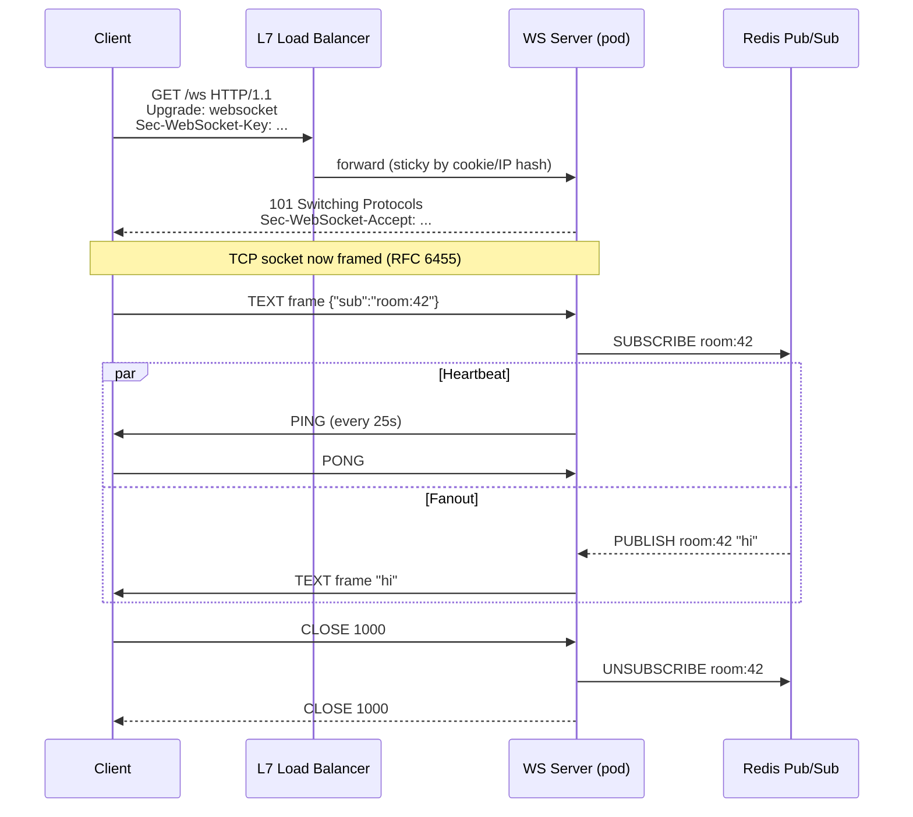
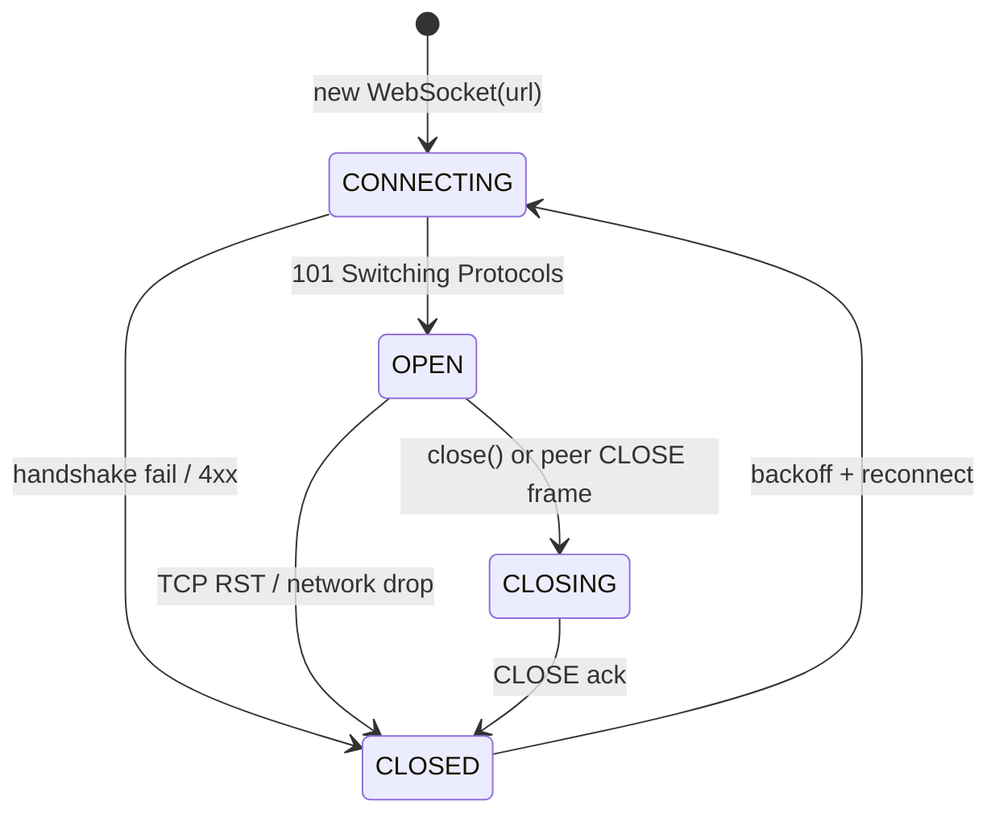
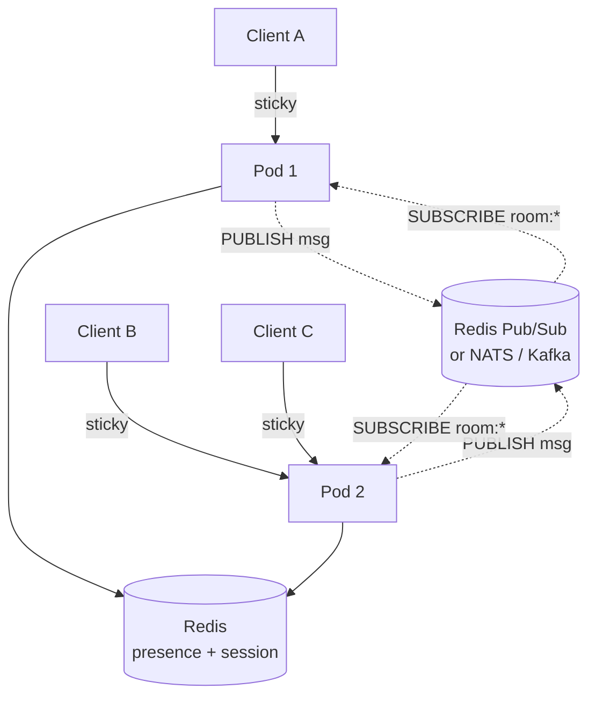

# WebSockets

## Why This Exists

**Problem.** HTTP request/response is half-duplex and client-initiated. For chat, live dashboards, collaborative editing, presence, multiplayer games, market data, and notifications you need the **server to push** at sub-second latency and the **client to send** small messages without paying TCP+TLS handshake cost on each one. Long-polling and Server-Sent Events solve subsets of this; WebSockets solve all of it with one socket.

**Key insight.** WebSocket is **not a new transport** — it is an HTTP/1.1 upgrade handshake (`Upgrade: websocket`, RFC 6455) that hands the underlying TCP connection over to a **frame-oriented full-duplex protocol**. Once upgraded, HTTP semantics are gone: no more requests, no more cookies-per-message, no intermediate proxies that buffer responses. This is also why every "scaling problem" is really a **stateful connection problem** — your fleet has to remember which user is on which box.

**Reach for this when:**
- You need **server-initiated push** (chat, live trade ticks, presence, collab cursors).
- Round-trip latency on small messages matters (gaming, trading, IoT control).
- You need **bidirectional** messaging from the same client (control plane + data plane).
- Message frequency is high enough that long-polling reconnects dominate cost.

**Don't reach for this when:**
- Push is **server → client only** and infrequent → use **Server-Sent Events (SSE)**. SSE rides plain HTTP, auto-reconnects with `Last-Event-ID`, and works through every proxy.
- Traffic is request/response with occasional push → use **HTTP/2 + SSE** or polling.
- You need **guaranteed delivery / at-least-once** with replay → use a real broker (Kafka, NATS JetStream) and let WS be the *transport* on the last mile, not the durability layer.
- Your platform has a managed primitive that fits — **AWS API Gateway WebSockets**, **AppSync subscriptions**, **Ably/Pusher/Pubnub** — and you don't want to operate stateful boxes.

## Diagrams

### Handshake and lifecycle



### Connection state machine



### Horizontal scaling with a fanout bus



## The Protocol — what you have to know

**Handshake.** Client sends `GET` with `Upgrade: websocket`, `Connection: Upgrade`, `Sec-WebSocket-Key` (random base64), `Sec-WebSocket-Version: 13`. Server replies `101 Switching Protocols` with `Sec-WebSocket-Accept = base64(sha1(key + "258EAFA5-E914-47DA-95CA-C5AB0DC85B11"))`. The magic GUID is from RFC 6455 §1.3 and prevents accidental upgrades.

**Frames.** After 101, traffic is **frames**, not HTTP:

| Field | Bits | Purpose |
|---|---|---|
| FIN | 1 | Last frame of message |
| RSV1-3 | 3 | Reserved (used by `permessage-deflate`) |
| opcode | 4 | `0x0` continuation, `0x1` text (UTF-8), `0x2` binary, `0x8` close, `0x9` ping, `0xA` pong |
| MASK | 1 | **Client→server frames MUST be masked**, server→client MUST NOT |
| payload len | 7 / 7+16 / 7+64 | extended length encoding |
| masking-key | 0/32 | XOR key when MASK=1 |
| payload | n | the bytes |

The masking rule exists to prevent **cache-poisoning attacks against intermediaries** that misinterpret framed data as HTTP — see RFC 6455 §10.3.

**Control frames** (`0x8`/`0x9`/`0xA`) MUST be ≤125 bytes and MUST NOT be fragmented. Use them — heartbeats are how you detect dead peers behind NATs.

**Close codes** (RFC 6455 §7.4): `1000` normal, `1001` going away, `1006` abnormal (no close frame — usually network), `1008` policy violation, `1011` server error, `4000-4999` application-defined. Don't invent codes outside reserved ranges.

## Server: a production-grade Node.js / TypeScript pattern

```typescript
// server.ts — Node 20, ws 8.x, ioredis 5.x
import { WebSocketServer, WebSocket } from 'ws';
import Redis from 'ioredis';
import { randomUUID } from 'node:crypto';

const HEARTBEAT_MS = 25_000;          // < 30s — beats most NAT/idle timeouts
const HEARTBEAT_TIMEOUT_MS = 5_000;   // pong must arrive in this window
const MAX_BACKLOG_BYTES = 1 << 20;    // 1 MiB per-conn write buffer

const pub = new Redis(process.env.REDIS_URL!);
const sub = new Redis(process.env.REDIS_URL!); // separate connection — pub/sub blocks the client

const wss = new WebSocketServer({
  // Don't run a raw HTTP server in prod; attach to your existing one so /healthz etc work.
  noServer: true,
  perMessageDeflate: false, // CPU hot; only enable if your payloads are >1KB and repetitive
  maxPayload: 1 << 20,      // hard cap; reject frames > 1 MiB
});

interface Conn {
  id: string;
  userId: string;
  rooms: Set<string>;
  isAlive: boolean;
  ws: WebSocket;
}

const conns = new Map<string, Conn>();
const roomIndex = new Map<string, Set<string>>(); // room -> connId set

// One Redis subscription per pod, multiplex locally. DON'T sub once per connection.
sub.psubscribe('room:*');
sub.on('pmessage', (_pattern, channel, message) => {
  const room = channel.slice('room:'.length);
  const ids = roomIndex.get(room);
  if (!ids) return;
  for (const id of ids) {
    const c = conns.get(id);
    if (!c || c.ws.readyState !== WebSocket.OPEN) continue;
    // Backpressure — if client can't drain, drop it rather than OOM the pod.
    if (c.ws.bufferedAmount > MAX_BACKLOG_BYTES) {
      c.ws.close(1011, 'slow consumer');
      continue;
    }
    c.ws.send(message);
  }
});

wss.on('connection', (ws, req) => {
  // AuthN happens BEFORE upgrade in the HTTP layer; here we trust req.user.
  const userId = (req as any).user.sub;
  const conn: Conn = {
    id: randomUUID(),
    userId,
    rooms: new Set(),
    isAlive: true,
    ws,
  };
  conns.set(conn.id, conn);

  ws.on('pong', () => { conn.isAlive = true; });

  ws.on('message', async (data, isBinary) => {
    if (isBinary) return ws.close(1003, 'binary not supported');
    let msg: any;
    try { msg = JSON.parse(data.toString()); }
    catch { return ws.close(1007, 'bad json'); } // 1007 = invalid frame payload data

    switch (msg.type) {
      case 'sub': {
        const room = String(msg.room);
        conn.rooms.add(room);
        if (!roomIndex.has(room)) roomIndex.set(room, new Set());
        roomIndex.get(room)!.add(conn.id);
        // Track presence in Redis with TTL — pod crash auto-cleans within TTL.
        await pub.set(`presence:${room}:${conn.userId}`, '1', 'EX', 60);
        break;
      }
      case 'pub': {
        const room = String(msg.room);
        if (!conn.rooms.has(room)) return; // authorize: must be subscribed
        await pub.publish(`room:${room}`, JSON.stringify({
          from: conn.userId,
          ts: Date.now(),
          body: msg.body,
          // Server-assigned monotonic id lets clients dedupe on reconnect-replay.
          id: randomUUID(),
        }));
        break;
      }
    }
  });

  ws.on('close', () => {
    for (const room of conn.rooms) {
      roomIndex.get(room)?.delete(conn.id);
      pub.del(`presence:${room}:${conn.userId}`).catch(() => {});
    }
    conns.delete(conn.id);
  });
});

// Heartbeat sweep — kill peers that stopped responding to PINGs.
setInterval(() => {
  for (const c of conns.values()) {
    if (!c.isAlive) {
      // Dead — RFC 6455 §5.5.2 says we may not get a CLOSE; just terminate the TCP socket.
      c.ws.terminate();
      continue;
    }
    c.isAlive = false;
    c.ws.ping();
  }
}, HEARTBEAT_MS).unref();

// Graceful shutdown — give clients a chance to reconnect to a new pod.
process.on('SIGTERM', () => {
  for (const c of conns.values()) {
    c.ws.close(1001, 'going away'); // 1001 — clients should reconnect with backoff
  }
  setTimeout(() => process.exit(0), 5_000).unref();
});
```

**Why these choices:**
- **Two Redis clients** — `ioredis`/`redis-cli` enter subscriber mode on `SUBSCRIBE` and refuse other commands. One pub, one sub.
- **One subscription per pod** (`psubscribe room:*`) and a local `roomIndex`. The naive "subscribe per connection" pattern produces O(N) Redis subscriptions and falls over by ~10k clients.
- **`perMessageDeflate: false`** by default. The compression context is per-connection memory and the CPU is real. Benchmark before enabling. (Node `ws` README has a warning paragraph on this.)
- **`bufferedAmount` backpressure** — without it a slow client keeps Node's write buffer growing until the pod OOMs.
- **Heartbeat at 25s** — most NATs / ALBs / clouds drop idle TCP between 60-350s. Be the one to detect the drop, not the network.

## Client: reconnect with exponential backoff and resume

```typescript
// client.ts — runs in browser or React Native
type Outbox = { id: string; payload: unknown };

class ResilientWS {
  private ws?: WebSocket;
  private backoff = 500;   // ms
  private readonly maxBackoff = 30_000;
  private outbox: Outbox[] = [];
  private lastSeenId: string | null = null; // server-assigned monotonic id
  private closedByUser = false;

  constructor(private url: string, private onMsg: (m: any) => void) {
    this.connect();
    // Reconnect on tab wakeup — mobile/laptop sleep silently kills the socket.
    window.addEventListener('online', () => this.maybeReconnect());
    document.addEventListener('visibilitychange', () => {
      if (document.visibilityState === 'visible') this.maybeReconnect();
    });
  }

  private connect() {
    const url = this.lastSeenId
      ? `${this.url}?since=${encodeURIComponent(this.lastSeenId)}`
      : this.url;
    this.ws = new WebSocket(url);

    this.ws.onopen = () => {
      this.backoff = 500; // reset on success
      // Drain queued sends (writes that happened while offline).
      for (const m of this.outbox) this.ws!.send(JSON.stringify(m));
      this.outbox = [];
    };

    this.ws.onmessage = (ev) => {
      const m = JSON.parse(ev.data);
      if (m.id) this.lastSeenId = m.id;
      this.onMsg(m);
    };

    this.ws.onclose = (ev) => {
      // 1000 = normal, 1008 = policy (don't reconnect — auth or banned).
      if (this.closedByUser || ev.code === 1000 || ev.code === 1008) return;
      this.scheduleReconnect();
    };

    this.ws.onerror = () => {/* onclose will fire */};
  }

  private scheduleReconnect() {
    // Full jitter — equal distribution of [0, backoff].
    // See AWS Architecture Blog "Exponential Backoff and Jitter".
    const wait = Math.random() * this.backoff;
    this.backoff = Math.min(this.maxBackoff, this.backoff * 2);
    setTimeout(() => this.connect(), wait);
  }

  private maybeReconnect() {
    if (this.ws && this.ws.readyState === WebSocket.OPEN) return;
    this.connect();
  }

  send(payload: unknown) {
    const msg: Outbox = { id: crypto.randomUUID(), payload };
    if (this.ws?.readyState === WebSocket.OPEN) {
      this.ws.send(JSON.stringify(msg));
    } else {
      this.outbox.push(msg); // will drain on next open
    }
  }

  close() {
    this.closedByUser = true;
    this.ws?.close(1000, 'user');
  }
}
```

**The two reconnection bugs everyone ships:**
1. **No jitter.** A pod crash creates a "thundering herd" — every disconnected client retries at exactly `t + 1s`, then `t + 2s`, etc., synchronized. Use **full jitter** (`Math.random() * backoff`), not "exponential ± 10%".
2. **No resume token.** Clients reconnect, server sends the *current* state, anything that happened during the gap is silently lost. Track a server-assigned monotonic id (or vector clock for collab) and replay from `?since=<id>` on reconnect — server keeps a short ring buffer per topic.

## Scaling: where state actually lives

A WebSocket server is **stateful** — the TCP connection itself is state, plus the user→pod mapping. You have to decide where each piece of state lives.

### Sticky sessions (L7 load balancer)

The LB hashes by cookie or source IP and pins each client to one pod for the connection's lifetime. Required for the **handshake** because mid-handshake reroute = dead socket. After 101, the connection naturally pins (it's one TCP socket — the LB just relays bytes).

- **AWS ALB** — set `stickiness.type=app_cookie` or use `lb_cookie`; ALB supports WebSockets natively (no need for NLB unless you need to preserve client IP at the TCP layer).
- **NGINX** — `proxy_http_version 1.1; proxy_set_header Upgrade $http_upgrade; proxy_set_header Connection "upgrade";` and `ip_hash` or `hash $cookie_sid consistent`. Set `proxy_read_timeout` to >> heartbeat (e.g. `3600s`).
- **HAProxy** — `option http-server-close` is wrong; you want `option http-keep-alive` plus `timeout tunnel 1h`.

**Sticky sessions are not a scaling strategy** — they're a routing requirement. You still need to broadcast across pods.

### Server-side state in Redis

Keep these in Redis, not in pod memory:
- **Presence** — `presence:room:<room>:<user>` with `EX 60`, refreshed on heartbeat. Pod crash → entries expire → no ghost users.
- **User → pod map** (only if you need direct addressing) — `user:<uid> = pod-id`. Use Redis Hash + `EX`.
- **Resume buffers** — last N messages per room as a Redis Stream (`XADD room:42 MAXLEN ~ 1000 *`). Reconnecting clients read from `?since=<stream-id>`.

### Fanout: Redis Pub/Sub vs Kafka vs NATS

| Bus | Latency | Durability | Fanout cost | Good for |
|---|---|---|---|---|
| **Redis Pub/Sub** | sub-ms | **None — fire-and-forget** | O(subscribers) per pod | Chat rooms, presence, sub-100k connections per cluster |
| **Redis Streams** | ms | At-least-once + retention | Consumer groups | Same as above + replay-on-reconnect |
| **NATS / NATS JetStream** | sub-ms | Optional (JetStream) | Subject-tree routing | Microservice mesh + WS fanout, IoT |
| **Kafka** | 5-50ms | Days/weeks | Partitioned | Audit trail, analytics, event sourcing — too high latency for typed-cursor collab |
| **AWS SNS + SQS-per-pod** | 10-200ms | Yes | Linear in pods | Lambda-friendly, easy ops, not real-time |

**Rule of thumb.** If a missed message is "ok, the next one will overwrite it" (cursor positions, ticker prices), Redis Pub/Sub is fine. If a missed message is "the user thinks they sent a chat that nobody got", you need a stream with replay (Redis Streams, Kafka, NATS JetStream) **and** a server-assigned id the client can resume from.

### Direct addressing vs broadcast

Two patterns to fan a single message out to N connections across M pods:

**Pattern A — broadcast everywhere, filter locally.** Every pod subscribes to every channel. Each pod checks its local `roomIndex` and sends to its own clients. Simple. Wastes bandwidth across pods when most pods don't care. Good up to ~50 pods × ~50k channels.

**Pattern B — directed delivery.** Maintain `room → set<pod-id>` in Redis. Publisher PUBLISHes to a per-pod channel. Better at 100+ pods. Pays a write per `subscribe` and you need cleanup on pod death.

Most teams start with A, switch to B when fanout cost dominates.

## Heartbeats — get this right or everything breaks

Three different "is the peer alive?" signals that you must NOT confuse:

1. **TCP keepalive** — kernel-level, defaults to **2 hours** on Linux. Useless for our timescales. Don't rely on it.
2. **WebSocket ping/pong frames** (opcode `0x9`/`0xA`) — application-controlled. **Browsers do not expose these** (the JS WebSocket API has no `ping()`); browsers respond to server PINGs automatically but **cannot initiate** them. So:
   - **Server pings client** with WS PING frames.
   - **Client pings server** with an application-level `{type:"ping"}` text message and expects a `pong` back.
3. **Application-level liveness** — a domain message like "still typing", which doubles as a heartbeat.

**Common timing:**
- Server pings every **20-30s** (most idle proxies drop at 60s).
- Mark dead if no pong within **5-10s**.
- Client app-pings every **20-30s**, reconnects if no reply in 10s.

**The bug:** Many teams ping every 60s thinking that "matches" the proxy timeout. The proxy fires *first* sometimes, marking the conn dead from the outside. Always ping at < proxy_idle / 2.

## Fallback: long-polling and SSE

WebSockets fail in three real-world ways:
- Corporate proxies stripping `Upgrade` headers (still common in some enterprises).
- Network blips on mobile that drop the socket faster than reconnect can succeed.
- Aggressive browser tab throttling that pauses timers (background tabs).

**Long-polling fallback** — client opens an HTTP GET that the server holds open for up to ~25s, returning either the next batch of messages or `204 No Content`. Client immediately reopens. Works through every proxy. ~10-100x more expensive per message but proven to work.

**Don't roll your own.** If you need fallback, use a library that has done it well:
- **Socket.IO** (Node + many clients) — auto-falls-back from WS to long-polling, has rooms, ack-based delivery, and a Redis adapter. Cost: protocol overhead, framework lock-in.
- **SignalR** (.NET) — same idea, with WebSockets/SSE/long-polling negotiation.
- **Phoenix Channels** (Elixir) — best-in-class for very large fanout (1M+ on one box), but you have to be on BEAM.
- **Centrifugo** (Go, standalone) — language-agnostic via a simple JSON protocol, handles scaling, presence, history.

If you don't need fallback (modern users, public app), raw `ws` / `gorilla/websocket` / `tokio-tungstenite` are simpler and faster.

**SSE alternative.** If push is one-way (server→client), `EventSource` is dramatically simpler: it's HTTP, it has built-in reconnect with `Last-Event-ID`, and it works through every CDN. Reach for SSE first; reach for WS when you actually need bidirectional.

## Trade-offs

| Benefit | Cost |
|---|---|
| Sub-ms server push, no polling overhead | Stateful pods → harder deploys (graceful drain), harder autoscaling (existing conns don't migrate) |
| Bidirectional on one TCP/TLS handshake | Every load balancer / CDN / proxy is a potential break point — test the full path |
| Native browser support, no plugin | No HTTP semantics: forget cookies-per-request, mid-stream auth refresh is awkward (use short-lived JWT + reconnect) |
| Binary frames + low framing overhead | `permessage-deflate` adds CPU and per-connection memory; backpressure is your problem |
| Simple protocol (RFC 6455 ~70 pages) | No built-in delivery guarantees, ordering across reconnect, or replay — you build that on top |
| Scales horizontally with a fanout bus | Pub/Sub bus becomes the new SPOF and bottleneck; fanout cost grows O(subscribers) |
| Long-lived = amortized handshake cost | Long-lived = per-connection memory × N; 100k conns × 50 KiB ≈ 5 GiB just for buffers |

## Common Pitfalls

- **Sticky sessions misconfigured.** ALB without `stickiness` enabled will round-robin the **handshake** across pods. The 101 succeeds, but routing tables on the LB don't pin until traffic flows — and on some LBs not at all. Symptom: handshake works, no messages flow, or random "auth failed" because the pod that got the upgrade isn't the one with the session.
- **Idle timeouts shorter than heartbeat.** AWS ALB default idle timeout is 60s. NGINX `proxy_read_timeout` defaults to 60s. CloudFront has its own. Pinging every 90s = drops every 60s. Symptom: "users disconnect after exactly 60s of inactivity".
- **`proxy_buffering on` in NGINX.** Buffers the upgrade response. The 101 never reaches the client, or arrives late and the WS lib gives up. Symptom: handshake hangs in dev when fronted by NGINX.
- **No backpressure handling.** Slow client + chatty server = unbounded `bufferedAmount` = pod OOM. Use `bufferedAmount` in JS / `WriteBuffer.Len()` in Go and *drop the connection* past a threshold. Better to disconnect one bad client than crash the pod.
- **`onclose` without reconnect = silent failure.** Tab wakes from sleep, socket is dead but `readyState === CLOSED`, app thinks it's online. Listen for `online` and `visibilitychange` events.
- **No resume token.** Reconnect succeeds → server sends current state → user lost the 30 seconds of messages in between. Pair WS with a Redis Stream + `since=<id>` query param.
- **JWT expiry mid-connection.** A 1-hour JWT was checked at handshake. The connection lives 4 hours. The user has been "unauthenticated" for 3 hours from the auth team's POV. Either accept this (most do — auth is at handshake), or implement a re-auth control message and force reconnect on rotate.
- **Pub/Sub has no replay.** Redis Pub/Sub drops messages for offline subscribers. Pod restart = clients miss everything in the gap. Use Streams when this matters.
- **Per-connection Redis subscription.** Naive impl does `SUBSCRIBE room:42` for each user. 100k users = 100k subscriptions on Redis. Multiplex through one psubscribe per pod instead.
- **Compression on small messages.** `permessage-deflate` is per-connection state and a CPU spike on every message. For typical chat (<200 bytes) it can be net-negative. Measure.
- **Letting the LB choose the close code.** A TCP RST surfaces as `1006 (abnormal closure)` on the client with no info. Always have the server send an explicit CLOSE frame with a code in [1000, 4999] before TCP teardown — gives the client signal to act.
- **Treating WebSockets like HTTP for security.** No CORS preflight on WS. The browser sends `Origin` header — *check it server-side* and reject unknown origins. Subprotocols can be used as a second auth lever. Never trust the URL alone.
- **No graceful drain on deploy.** SIGKILL the pod → 1006 storm → all clients reconnect at once → new pods overwhelmed. Drain path: `SIGTERM` → send `1001 going away` to all clients → wait 5-10s → exit. Combined with client jitter, the herd stays manageable.

## Decision Table

| Need | Use | Why |
|---|---|---|
| Server push, infrequent, server→client only | **SSE** | Simpler protocol, HTTP-native, built-in reconnect, works everywhere |
| Server push + bidirectional, low latency, modern clients | **WebSocket (raw)** | Lowest overhead, native browser support |
| Same as above + must work behind hostile proxies | **Socket.IO / SignalR / Centrifugo** | Auto-fallback to long-polling |
| 1M+ concurrent connections, low budget | **Phoenix Channels (Elixir)** or **Go + epoll** | BEAM scheduler / Go's M:N model handle stateful conns at this scale; Node will struggle past ~50-100k per process |
| Mostly request/response with occasional push | **HTTP/2 + SSE** or **gRPC server streaming** | One TCP connection, multiplexed; better dev ergonomics for unary calls |
| AWS-managed, don't want to operate stateful boxes | **API Gateway WebSockets** + **Lambda** | No conn-state in your code; pay per message; 2h max conn lifetime |
| Real-time multiplayer game (low-latency, lossy ok) | **WebRTC DataChannel** or **WebTransport (QUIC)** | UDP semantics, P2P possible, no TCP head-of-line blocking |
| GraphQL with real-time subscriptions | **graphql-ws** over WebSocket | Standard subprotocol; AppSync supports natively |
| MQTT-style IoT pub/sub | **MQTT over WebSocket** | Topic hierarchy, QoS levels, retained messages designed for this |
| Need durable replay / event sourcing | **Kafka / Pulsar** with WS as last-mile | WS is transport, Kafka is the source of truth |
| In-process actor messaging at scale | **NATS** | Subject routing + JetStream when you need durability |

## References

- IETF RFC 6455 — *The WebSocket Protocol* — https://datatracker.ietf.org/doc/html/rfc6455
- IETF RFC 7692 — *Compression Extensions for WebSocket (permessage-deflate)* — https://datatracker.ietf.org/doc/html/rfc7692
- IETF RFC 8441 — *Bootstrapping WebSockets with HTTP/2* — https://datatracker.ietf.org/doc/html/rfc8441
- MDN — *The WebSocket API (Client-side) and Writing WebSocket servers* — https://developer.mozilla.org/en-US/docs/Web/API/WebSockets_API
- Node `ws` library — README and performance notes — https://github.com/websockets/ws
- gorilla/websocket — Go reference implementation — https://github.com/gorilla/websocket
- AWS Architecture Blog — *Exponential Backoff and Jitter* (Marc Brooker) — https://aws.amazon.com/blogs/architecture/exponential-backoff-and-jitter/
- AWS Builders' Library — *Timeouts, retries and backoff with jitter* — https://aws.amazon.com/builders-library/timeouts-retries-and-backoff-with-jitter/
- AWS docs — *API Gateway WebSocket APIs* — https://docs.aws.amazon.com/apigateway/latest/developerguide/apigateway-websocket-api.html
- AWS docs — *Application Load Balancer WebSocket support* — https://docs.aws.amazon.com/elasticloadbalancing/latest/application/load-balancer-listeners.html
- NGINX docs — *WebSocket proxying* — https://nginx.org/en/docs/http/websocket.html
- Phoenix Channels — *The Road to 2 Million Websocket Connections in Phoenix* — https://www.phoenixframework.org/blog/the-road-to-2-million-websocket-connections
- Discord Engineering — *How Discord Stores Trillions of Messages* (background on WS at scale) — https://discord.com/blog/how-discord-stores-trillions-of-messages
- Slack Engineering — *Real-time messaging* — https://slack.engineering/real-time-messaging/
- Cloudflare Blog — *WebSockets and Workers* — https://blog.cloudflare.com/introducing-websockets-in-workers/
- Martin Kleppmann — *Designing Data-Intensive Applications* — Ch. 11 *Stream Processing* (push vs pull, change capture, fanout)
- Google SRE Book — Ch. 22 *Addressing Cascading Failures* (load shedding, backoff) — https://sre.google/sre-book/addressing-cascading-failures/
- Google SRE Workbook — Ch. 11 *Managing Load* — https://sre.google/workbook/managing-load/
- Redis docs — *Pub/Sub* and *Streams* — https://redis.io/docs/latest/develop/interact/pubsub/ and https://redis.io/docs/latest/develop/data-types/streams/
- NATS docs — *Concepts and JetStream* — https://docs.nats.io/
- Centrifugo — *Server documentation* — https://centrifugal.dev/docs/getting-started/introduction
- W3C — *Server-Sent Events* — https://html.spec.whatwg.org/multipage/server-sent-events.html
- IETF Draft — *WebTransport* (the QUIC-based successor for browsers) — https://datatracker.ietf.org/doc/draft-ietf-webtrans-overview/

## See Also

- ../sse/ — Server-Sent Events (one-way push alternative)
- ../webtransport/ — QUIC-based bidirectional transport, the future of browser real-time
- ../grpc/ — gRPC streaming, the RPC-flavored alternative for internal services
- ../http2/ — HTTP/2 multiplexing and how WS over H2 works (RFC 8441)
- ../webrtc-datachannel/ — UDP-style P2P messaging for games and low-latency apps
- ../mqtt/ — pub/sub protocol that often rides on top of WebSocket for IoT
- ../graphql-subscriptions/ — graphql-ws subprotocol pattern
- ../../scaling/sticky-sessions/ — load-balancer pinning strategies
- ../../scaling/connection-pooling/ — managing socket lifecycles at scale
- ../../messaging/redis-pubsub/ — fanout substrate
- ../../messaging/redis-streams/ — durable replay for reconnect
- ../../messaging/kafka/ — when you need full event-sourced durability
- ../../messaging/nats/ — subject-routed messaging mesh
- ../../reliability/exponential-backoff/ — full-jitter retry math
- ../../reliability/circuit-breakers/ — protect upstreams from reconnect storms
- ../../reliability/graceful-shutdown/ — drain stateful pods cleanly
- ../../security/origin-validation/ — Origin header / CSRF on WS
- ../../security/jwt-rotation/ — auth on long-lived connections
- ../../observability/connection-metrics/ — instrumenting handshake / heartbeat / drop rates
