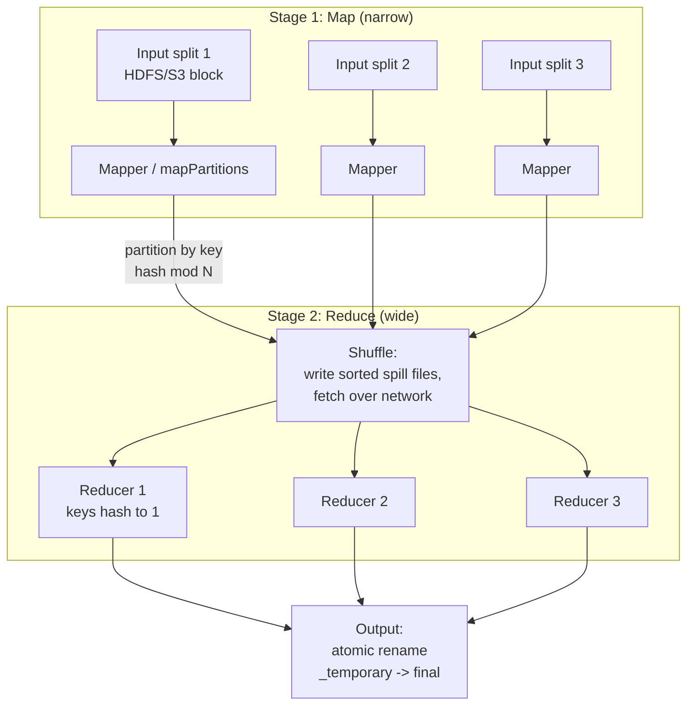
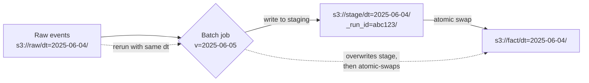
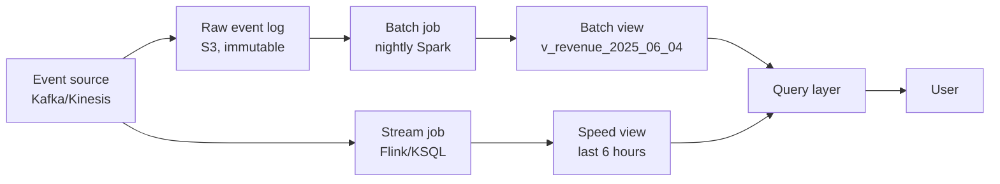

# Batch Processing

## Why This Exists

**Problem.** Streams are seductive — "everything real-time" — but most data systems still need a pass over the **bounded, complete, immutable** dataset of yesterday. Streams give you approximate, eventually-correct answers over an unbounded firehose. Batch gives you **exact, reproducible** answers over a finite input. When the stream pipeline is wrong (bad code, bad schema, late data, a poisoned event), the only honest fix is a **deterministic batch recomputation** from raw inputs.

**Key insight (DDIA ch. 10).** A batch job is a **pure function** from input files to output files. Same inputs → same outputs, every time, on any cluster. This is what makes batch jobs *debuggable, restartable, and reusable* in ways streams fundamentally cannot match. The cost is latency (minutes to hours) and the engineering discipline of **idempotence** — you must be able to rerun any job without corrupting anything.

**Reach for this when:**
- You need **exact** aggregates (revenue, billing, regulatory reporting, ML training labels).
- You need to **reprocess history** because a bug or schema change invalidated past output.
- The dataset fits a "process once, snapshot the result" mental model (daily ETL, nightly model retrain, monthly invoice generation).
- You're building **lambda's batch layer** — the slow, correct ground truth that the speed layer approximates.
- A query is too expensive to run interactively but cheap to precompute (denormalized views, sessionization, graph analytics).

**Don't reach for this when:**
- End-to-end latency must be under ~minutes (use stream processing — see `../stream-processing/`).
- Output must reflect events within seconds (fraud detection, leaderboard, alerting).
- The input is genuinely unbounded and you cannot define a "snapshot" — though even here, **micro-batch** (Spark Structured Streaming) often beats true streaming for operational simplicity.
- Each record needs an external side-effect with at-most-once semantics (notifications, payments) — batch's "rerun the whole job" model becomes dangerous.

## Diagrams

### MapReduce / Spark stage anatomy



The stage boundary is the **shuffle**. Everything inside a stage is a narrow dependency (one input partition → one output partition, pipelineable). The shuffle is where data crosses the network, hits disk, and where most of your job's wall-clock time and failure modes live.

### Idempotent rerun via output partitioning



The **partition (`dt=2025-06-04`)** is the unit of idempotence. Reruns target a single partition; the staging-then-swap pattern (or Hive `INSERT OVERWRITE`, Iceberg/Delta `MERGE`) makes the operation atomic at the partition level.

## Core Patterns

### 1. The MapReduce contract (and why Spark inherited it)

MapReduce (Dean & Ghemawat, 2004) gave us three things that every modern batch engine still implements:

1. **A pure-function programming model** — `map(k1,v1) -> list(k2,v2)`, `reduce(k2, list(v2)) -> list(k3,v3)`.
2. **Automatic parallelism via partitioning** — the framework hashes keys to reducers; you write single-key logic.
3. **Fault tolerance via deterministic recomputation** — if a task dies, re-run it on its input split; the output is identical.

Spark generalizes this to a DAG of stages with the same guarantees, but adds:
- **In-memory caching** between stages (the original Spark thesis: ML and graph algorithms are iterative; spilling to HDFS between every iteration is the bottleneck).
- **Lazy evaluation** — you build a logical plan; Catalyst optimizes it; execution starts at an *action* (`.collect()`, `.write()`, `.count()`).
- **Higher-level APIs** (DataFrame, Dataset, SQL) that compile down to the same shuffle/sort/aggregate primitives.

### 2. Idempotent jobs — the non-negotiable property

A job is idempotent if **running it N times produces the same final state as running it once**. This is what lets you:
- Retry on failure without thinking.
- Rerun yesterday's job to fix a bug.
- Run the same job in dev and prod and diff the output.

```python
# PySpark: idempotent daily aggregation
# Pattern: partition by dt, INSERT OVERWRITE the partition, never APPEND.

from pyspark.sql import SparkSession, functions as F

spark = SparkSession.builder.appName("daily_revenue").getOrCreate()

PROCESS_DATE = "2025-06-04"  # passed in via arg, never `today()`

events = (
    spark.read.parquet(f"s3://raw/events/dt={PROCESS_DATE}/")
    # Filter on the partition column too — defense in depth against
    # late-arriving events that landed in the wrong partition.
    .filter(F.col("event_dt") == PROCESS_DATE)
)

revenue = (
    events
    .filter(F.col("event_type") == "purchase")
    .groupBy("customer_id", "country")
    .agg(
        F.sum("amount_usd").alias("revenue_usd"),
        F.count("*").alias("n_purchases"),
        # Stable tie-breakers in aggregations are essential for determinism.
        F.max("event_ts").alias("last_purchase_ts"),
    )
    .withColumn("dt", F.lit(PROCESS_DATE))
    .withColumn("_pipeline_version", F.lit("v3.2.1"))
)

# INSERT OVERWRITE the *one* partition. This is atomic in modern table
# formats (Iceberg, Delta, Hudi). On plain Hive/parquet you need
# spark.sql.sources.partitionOverwriteMode=dynamic and you accept the
# directory-rename window of inconsistency.
(
    revenue.write
    .mode("overwrite")
    .partitionBy("dt")
    .option("partitionOverwriteMode", "dynamic")
    .saveAsTable("warehouse.fct_daily_revenue")
)
```

**Idempotence checklist (every batch job must pass):**
- Input is **parameterized by partition** (`dt`, `hour`, `region`), never `now()` or `current_date()`.
- All non-deterministic functions (`rand()`, `uuid()`, wall-clock) are **seeded** or replaced with deterministic equivalents (hash of input keys).
- Output is written to a **partition** that is fully overwritten, not appended.
- The job has a **version tag** in the output (so you can tell which code produced which row when you rerun with new logic).
- External side-effects (Kafka publishes, API calls, emails) are gated behind a **sentinel** — only the *first* successful run sends them, identified by a per-partition `_SUCCESS` marker or transactional outbox.

### 3. Shuffle, partition, sort — where jobs go to die

The shuffle is the most expensive operation in a batch job. Understanding it is the difference between a 20-minute job and a 6-hour job.

**What a shuffle actually does:**
1. Each map task writes one **sorted** spill file *per output partition* (so for N reducers, M mappers produce M×N files — the "shuffle service" exists to manage this).
2. Reducers fetch their assigned partition's data from every mapper over the network.
3. Reducer merges the sorted runs (external merge sort if data > memory).
4. User code runs on each key group.

**The three knobs that matter:**

| Knob | What it controls | When to tune |
|---|---|---|
| `spark.sql.shuffle.partitions` (default 200) | Number of reducers in any wide op | Default is wrong for almost every real workload. Aim for ~128–256MB per partition post-shuffle. |
| Partitioner (hash vs range) | How keys are distributed | Hash is fine 95% of the time. Range partitioning matters for `orderBy`, top-N, or downstream joins on a sorted key. |
| AQE (Adaptive Query Execution) | Coalesces small partitions, splits skewed ones at runtime | Turn it on (`spark.sql.adaptive.enabled=true`). Spark 3+ default. |

**Skew — the silent killer.** If 1 key has 100M rows and the other 999,999 keys have 100 rows each, one reducer does 99% of the work. Symptoms: 999 tasks finish in 30 seconds, 1 task runs for 2 hours; the Spark UI shows one fat green bar. The full treatment — detection, salting, AQE skew join, secondary sort, isolate-and-replicate, storage-level mitigations — lives in [`../data-skew/`](../data-skew/). Below: the three Spark patterns you reach for first.

Mitigations:

```python
# Pattern 1: Salted aggregation for known-skewed keys
# Splits a hot key into N "buckets" so multiple reducers share the load.

from pyspark.sql import functions as F

N_SALT = 32

salted = (
    events
    .withColumn(
        "salt",
        F.when(F.col("customer_id") == "WHALE_CUSTOMER",
               (F.rand() * N_SALT).cast("int"))
         .otherwise(F.lit(0))
    )
    .groupBy("customer_id", "salt")
    .agg(F.sum("amount").alias("partial"))
    .groupBy("customer_id")  # second pass folds the salt away
    .agg(F.sum("partial").alias("revenue"))
)

# Pattern 2: Broadcast join for small dim tables
# Avoid shuffle entirely when one side fits in executor memory (~10–100MB safe).

big_facts = spark.read.parquet("s3://fact/orders/")
small_dim = spark.read.parquet("s3://dim/products/")

joined = big_facts.join(F.broadcast(small_dim), "product_id")

# Pattern 3: Pre-bucket the data on disk
# If you join on customer_id every day, write the table bucketed by customer_id.
# Then joins between two co-bucketed tables skip the shuffle entirely.
(
    customer_events.write
    .bucketBy(256, "customer_id")
    .sortBy("event_ts")
    .saveAsTable("warehouse.events_bucketed")
)
```

### 4. When batch beats stream (honest comparison)

The industry over-corrected toward streaming around 2015–2018. Batch is back, and not because of nostalgia.

| Dimension | Batch wins when... |
|---|---|
| **Correctness** | You need the *exact* answer over the *complete* dataset. Streams give you eventually-consistent approximations under the unstated assumption that watermarks are correct (they aren't). |
| **Cost** | Throughput per dollar. A Spark job over 10TB of S3 parquet costs ~$10. The equivalent Flink pipeline running 24/7 on the same data costs $50+/day. |
| **Debuggability** | You can rerun a batch job locally with a sample of input. You cannot "rerun yesterday's stream" without rebuilding the whole stateful operator graph. |
| **Schema evolution** | Add a column, rerun the batch job, all of history is consistent. In streams you have a fork-in-the-road: backfill (which is just batch in disguise) or live with split-brain output. |
| **Backfill** | Trivial — change the partition argument. Streams require a separate "backfill mode" that's almost always a different code path from the live mode. |
| **Predictable resource use** | Cluster spins up, runs, dies. Streams are always-on; capacity planning means peak provisioning forever. |

Stream wins when latency dominates the value of the result. Fraud detection at T+5 minutes is useless. Daily revenue at T+4 hours is fine.

### 5. Lambda architecture's batch layer

Nathan Marz's lambda architecture (2011) split data systems into three layers:
1. **Batch layer** — owns the master dataset (immutable, append-only). Recomputes batch views from scratch periodically.
2. **Speed layer** — handles the gap between "now" and "the most recent batch run." Approximate, fast, throwaway.
3. **Serving layer** — merges batch view + speed view at query time.

The batch layer is the **system of record**. Its job is to be *correct*, not fast.



**Why the batch layer exists even when streams "could do it":**
- Bugs in stream code corrupt state silently and irrecoverably. The batch layer is your **escape hatch**: nuke the speed view, re-run batch from raw, you're back.
- Schema changes are free in batch (just change the job). In streams they are migrations, with downtime.
- Reproducibility is automatic in batch; in streams it requires careful checkpoint engineering you probably haven't done correctly.

The "kappa architecture" (Jay Kreps, 2014) argues you can do everything with streams. In practice, "everything with streams" turns into "streams plus a batch backfill job", which is lambda with extra steps. Most mature pipelines today use **Spark Structured Streaming** (micro-batch) or **Flink with batch+stream unified APIs** — they collapsed the distinction at the *engine* level, but the *operational* split between "the system of record" and "the live approximation" persists.

### 6. Hadoop, MapReduce, Spark — what you actually need to know in 2026

| System | When you'll see it | What to know |
|---|---|---|
| **HDFS** | Legacy on-prem, some bioinformatics, Cloudera shops | A distributed filesystem with ~128MB blocks, 3x replication, immutable files. Largely replaced by S3/GCS/ADLS for new work. The mental model still matters because data locality (compute moves to data) was its core idea, and S3 throws that away. |
| **MapReduce** | You will not write new MapReduce in 2026. Reading old MR code in maintenance mode, yes. | The two-stage map-then-reduce model is *too restrictive* — multi-stage workflows turn into Oozie DAGs of MR jobs writing intermediate state to HDFS at every boundary. Spark fixed this. |
| **YARN** | Hadoop-era cluster manager. Still around. | Resource manager + node managers, schedules containers. K8s is the modern replacement; Spark on K8s is mature as of Spark 3.x. |
| **Hive / Hive Metastore** | Ubiquitous. Even if you don't run Hive queries, the *Hive Metastore* is the de facto standard for table/partition metadata. | Schemas, partitions, statistics. Replaced at the catalog level by Iceberg/Delta/Hudi metadata, but most clusters still front them with HMS or Glue Catalog. |
| **Spark** | Default choice for new batch work | DataFrame API + Spark SQL covers ~90% of what you need. RDDs are legacy — use them only when DataFrame API can't express your logic (graph algorithms via GraphX, custom partitioners). |
| **Iceberg / Delta Lake / Hudi** | The 2020s "open table format" wave | Add ACID, time travel, schema evolution, hidden partitioning on top of S3+parquet. Iceberg is winning the standardization war. Use one — not raw parquet — for any new warehouse. |

### 7. A complete, realistic Spark job skeleton

```python
"""
fct_daily_revenue.py — production-grade batch job template.

Run with: spark-submit --conf spark.sql.adaptive.enabled=true \
    fct_daily_revenue.py --dt 2025-06-04
"""

import argparse
import logging
import sys
from pyspark.sql import SparkSession, functions as F, Window

log = logging.getLogger(__name__)

def parse_args(argv):
    p = argparse.ArgumentParser()
    p.add_argument("--dt", required=True, help="YYYY-MM-DD partition to process")
    p.add_argument("--input-table", default="raw.events")
    p.add_argument("--output-table", default="warehouse.fct_daily_revenue")
    p.add_argument("--pipeline-version", default="v3.2.1")
    return p.parse_args(argv)

def build_revenue(spark, input_table, dt):
    """Pure function: (spark, table, partition) -> DataFrame.
    No side effects. Easy to unit-test on a sample."""
    raw = (
        spark.table(input_table)
        .filter(F.col("dt") == dt)
        .filter(F.col("event_type") == "purchase")
    )

    # Deduplicate within the partition. Events arrive at-least-once;
    # dedup on (event_id, customer_id) is the boundary that makes
    # this job idempotent w.r.t. duplicate raw events.
    dedup_w = Window.partitionBy("event_id").orderBy(F.col("ingest_ts").asc())
    deduped = (
        raw.withColumn("_rn", F.row_number().over(dedup_w))
           .filter(F.col("_rn") == 1)
           .drop("_rn")
    )

    return (
        deduped
        .groupBy("customer_id", "country")
        .agg(
            F.sum("amount_usd").alias("revenue_usd"),
            F.count("*").alias("n_purchases"),
            F.max("event_ts").alias("last_purchase_ts"),
        )
        .withColumn("dt", F.lit(dt))
    )

def main(argv):
    args = parse_args(argv)
    logging.basicConfig(level=logging.INFO, format="%(asctime)s %(levelname)s %(message)s")

    spark = (
        SparkSession.builder
        .appName(f"fct_daily_revenue/{args.dt}")
        .config("spark.sql.adaptive.enabled", "true")
        .config("spark.sql.adaptive.skewJoin.enabled", "true")
        .config("spark.sql.sources.partitionOverwriteMode", "dynamic")
        # Iceberg or Delta config goes here in production.
        .getOrCreate()
    )

    try:
        log.info("Building revenue for dt=%s", args.dt)
        df = build_revenue(spark, args.input_table, args.dt)
        df = df.withColumn("_pipeline_version", F.lit(args.pipeline_version))

        # Sanity check before writing — fail fast if input looked empty.
        n = df.count()
        if n == 0:
            log.error("No rows produced for dt=%s — refusing to overwrite", args.dt)
            sys.exit(2)
        log.info("Producing %d rows", n)

        (df.write
            .mode("overwrite")
            .partitionBy("dt")
            .saveAsTable(args.output_table))

        log.info("Wrote partition dt=%s to %s", args.dt, args.output_table)
    finally:
        spark.stop()

if __name__ == "__main__":
    main(sys.argv[1:])
```

Key things this template gets right:
- **`--dt` is a required argument**, not `today()`. Reruns are a first-class operation.
- **`build_revenue` is pure** — no I/O, no `spark.stop()`. Unit-testable in isolation with `pytest` and a local SparkSession.
- **Deduplication is explicit** at the partition boundary, not relied on upstream.
- **`INSERT OVERWRITE` of one partition** — the entire job's effect on the output table is atomically scoped to `dt=$ARG`.
- **Empty-output guard** — fail loudly rather than silently overwriting yesterday's good data with nothing.
- **Pipeline version in every row** — when you rerun with new logic, you can diff old vs new in SQL.

## Trade-offs

| Benefit | Cost |
|---|---|
| Exact, reproducible results — the *correct* answer, not an approximation | Latency: minutes to hours from input arrival to output availability |
| Idempotent reruns make backfill, bug-fix-and-replay, and schema migration trivial | You must engineer for idempotence (partitioned outputs, deterministic UDFs, no wall-clock); not free |
| Throughput per dollar is unbeatable — process 10TB for $10 in Spark on spot instances | Capacity is bursty; spot interruptions can kill long jobs without checkpointing |
| Failure recovery via deterministic recomputation — no checkpointing complexity | A failed task far into a 6-hour job re-runs from its stage boundary, not its last record |
| Pure-function model is easy to test, easy to reason about | Side effects (notifications, payments) are dangerous from batch jobs — every retry sends them again unless gated |
| Schema evolution: add column, rerun, history is consistent | You pay full reprocessing cost for any history-wide change |
| Predictable resource model — clusters spin up and down on schedule | Cluster startup latency (Spark on K8s: ~30–60s) means very small jobs are inefficient |
| Mature tooling: Spark UI, query plans, EXPLAIN, lineage | The shuffle is opaque until you've spent ~50 hours reading Spark UI; learning curve is real |
| Works on cheap object storage (S3, GCS) — separate compute and storage | S3 has no atomic rename — output commit protocols (FileOutputCommitter v2, Iceberg, Delta) exist to plug this gap |

## Common Pitfalls

- **Using `current_date()` or `now()` in the job body.** The job processes a different partition every time it runs. Reruns become impossible. War story: a billing job re-ran a week later for an audit and produced numbers based on the *new* `now()`, off by 7 days; took two days to find.

- **Appending instead of overwriting.** A retry after partial failure leaves duplicate rows in the output. The "fix" — adding a `DISTINCT` on read — papers over the bug and slows every downstream query forever.

- **Not setting `spark.sql.shuffle.partitions`.** Default 200 means every wide op re-partitions to exactly 200 tasks. If your data is 10TB, each task has 50GB; you OOM. If your data is 10MB, you have 200 tasks doing 50KB each; scheduling overhead dwarfs work. Tune it.

- **One bad row crashes the whole job.** A malformed JSON record at hour 18 of 22 kills everything. Defense: read with `mode=PERMISSIVE`, write the bad rows to a quarantine table, and *alert* on quarantine size — don't silently swallow them.

- **Side effects inside `mapPartitions`.** Sending an email, hitting an API, or writing to a non-transactional store from inside a Spark task means: every speculative-execution duplicate, every task retry, every stage retry sends the side-effect again. Move side effects out of the DAG; emit a "to-send" table and have a downstream idempotent consumer process it.

- **Skew you don't notice until it's 4 AM.** A NULL key, an "unknown" sentinel, or a 1% whale customer creates a hot reducer. The Spark UI shows it immediately if you look. Build a dashboard for max/median task duration ratio across your jobs; alert when it exceeds 5x.

- **Treating S3 like HDFS.** No atomic rename, eventual consistency on listings (historically), throttling at high request rates. Use a real table format (Iceberg, Delta) — they handle the commit protocol correctly. Plain `parquet.write.partitionBy(...)` on S3 has subtle correctness bugs under failure.

- **Joining against a slowly-changing dim table without snapshotting.** Yesterday's fact joined to today's dim → "the customer lived in Germany when they bought, but the report says US because they moved last week." Always join facts to the *as-of* version of the dimension (SCD Type 2 or temporal join).

- **Not version-tagging output.** When you rerun with a bug fix, you can't diff "old buggy output" vs "new fixed output" because they're in the same partition. Add `_pipeline_version` to every row, write to a *versioned* staging table, then promote.

- **Over-optimizing too early.** "I'll write this in Scala for performance." No, you'll write it in PySpark, ship it in 2 days, and find out the bottleneck is the 4-way join, not the language. Profile first.

## Decision Table

| Situation | Use | Don't use |
|---|---|---|
| Daily revenue / billing rollup | Batch (Spark on Iceberg) | Stream — exact-once is hard, batch is trivial |
| Real-time fraud scoring | Stream (Flink) | Batch — minutes-to-hours latency unacceptable |
| ML training data pipeline | Batch | Stream — training wants snapshots |
| Live ML inference features | Stream (or batch + online store) | Pure batch — features are stale |
| Backfill 2 years of history after schema change | Batch | Stream — there's no "last 2 years" in a stream |
| Sessionization over the last 30 days | Batch | Stream — windowing over 30 days is expensive in Flink, free in Spark |
| Operational alerting | Stream | Batch — by the time the job runs, the customer has churned |
| Recompute a corrupted serving view | Batch (lambda batch layer) | Stream — you can't rebuild stream state without batch anyway |
| < 100GB, fits on one machine | DuckDB / Polars / pandas | Spark — cluster overhead exceeds work |
| > 1TB, multi-stage joins | Spark | Single-machine tools — they will swap to death |
| Graph traversal (PageRank, shortest path) | Spark (GraphX/GraphFrames) or specialized (Pregel, GraphX) | Generic SQL — too many shuffles |
| You need ACID + time travel | Iceberg / Delta / Hudi on top of Spark | Raw parquet — corruption on partial failures |
| You're writing new MapReduce code in 2026 | You almost certainly aren't | If you are, switch to Spark — same model, 10–100x faster, better DX |

## References

- Kleppmann, M. — *Designing Data-Intensive Applications*, **Chapter 10: Batch Processing** — primary canonical reference; covers MapReduce, Hadoop, dataflow engines, output idempotence, and the philosophy of treating jobs as pure functions. — https://dataintensive.net/
- Dean, J. & Ghemawat, S. — *MapReduce: Simplified Data Processing on Large Clusters* (OSDI 2004) — the foundational paper. Read it once. — https://research.google/pubs/mapreduce-simplified-data-processing-on-large-clusters/
- Zaharia, M. et al. — *Resilient Distributed Datasets: A Fault-Tolerant Abstraction for In-Memory Cluster Computing* (NSDI 2012) — the original Spark paper. — https://www.usenix.org/conference/nsdi12/technical-sessions/presentation/zaharia
- Armbrust, M. et al. — *Spark SQL: Relational Data Processing in Spark* (SIGMOD 2015) — Catalyst optimizer, DataFrame API. — https://dl.acm.org/doi/10.1145/2723372.2742797
- Apache Spark — *Performance Tuning Guide* — official, current. — https://spark.apache.org/docs/latest/sql-performance-tuning.html
- Apache Spark — *Adaptive Query Execution (AQE)* — https://spark.apache.org/docs/latest/sql-performance-tuning.html#adaptive-query-execution
- Apache Iceberg — *Specification* — open table format, ACID over object storage. — https://iceberg.apache.org/spec/
- Delta Lake — *Protocol* — https://github.com/delta-io/delta/blob/master/PROTOCOL.md
- Marz, N. & Warren, J. — *Big Data: Principles and best practices of scalable realtime data systems* — original lambda architecture exposition.
- Kreps, J. — *Questioning the Lambda Architecture* (2014) — the kappa architecture counter-argument. — https://www.oreilly.com/radar/questioning-the-lambda-architecture/
- Akidau, T. et al. — *The Dataflow Model* (VLDB 2015) — unifies batch and stream; foundational for Beam/Flink. — http://www.vldb.org/pvldb/vol8/p1792-Akidau.pdf
- Helland, P. — *Immutability Changes Everything* (CIDR 2015) — why immutable input + pure functions is the foundation of batch correctness. — https://queue.acm.org/detail.cfm?id=2884038
- AWS Builders' Library — *Reliability, constant work, and a good cup of coffee* — Colm MacCárthaigh on the value of batch-shaped, predictable workloads. — https://aws.amazon.com/builders-library/reliability-and-constant-work/
- Google SRE Workbook — *Data Processing Pipelines* — operational concerns: SLOs, monitoring, on-call for batch. — https://sre.google/workbook/data-processing/
- Wampler, D. — *Fast Data Architectures for Streaming Applications* (O'Reilly) — Chapter 2 contrasts batch and streaming systems honestly.
- Karau, H. & Warren, R. — *High Performance Spark* (O'Reilly 2017) — the practical handbook for shuffle, skew, and tuning.

## See Also

- `../stream-processing/` — when latency matters more than exactness; Flink, Kafka Streams, watermarks
- `../cdc/` — getting changes out of OLTP databases into the batch layer
- `../consistency-models/` — why "atomic partition swap" is the consistency story for batch
- `../data-skew/` — the canonical treatment of skew detection, salting, AQE, secondary sort
- `../bloom-filter/` — Spark runtime bloom join filter; reduce-side join optimization with Bloom from the small side
- `../../communication/idempotency/` — the broader pattern; batch is one application of it
