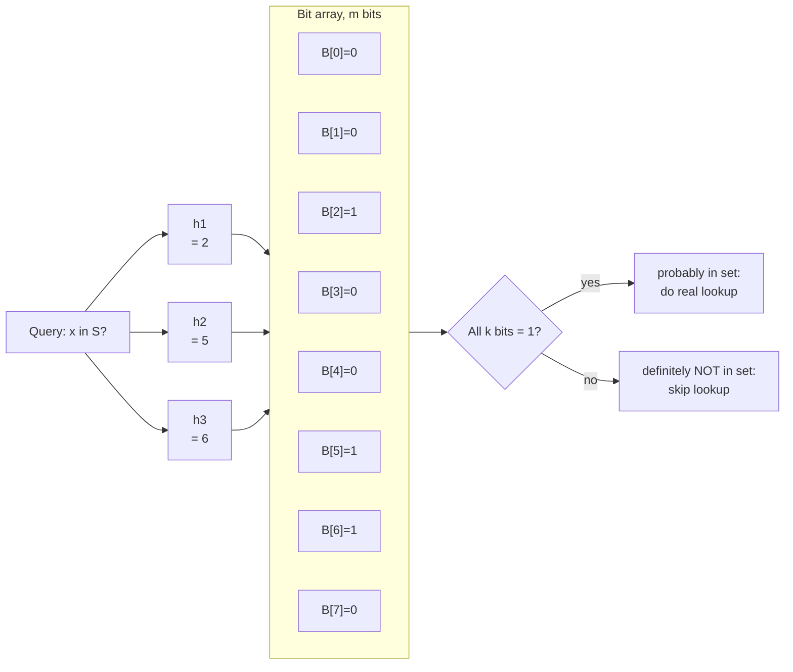
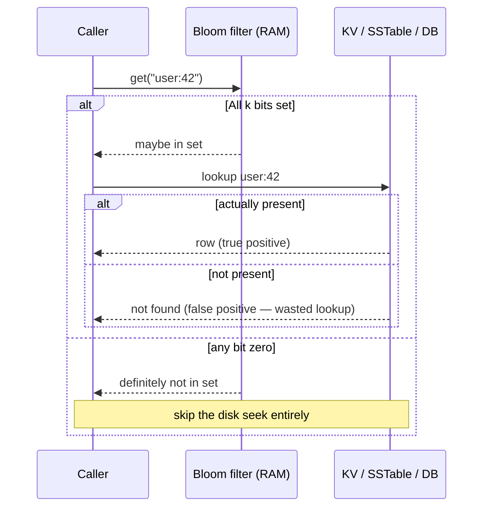
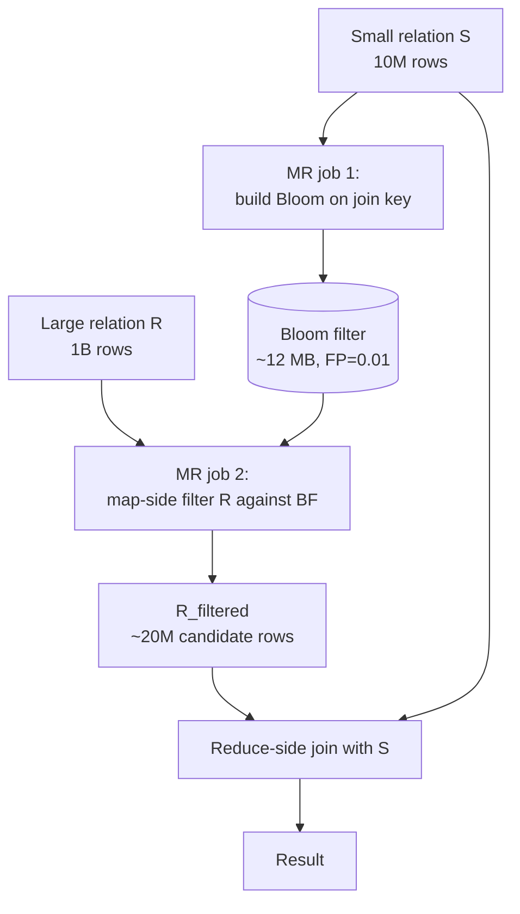

# Bloom Filters and Friends

## Why This Exists

**Problem.** You have a large set `S` (URLs seen by a crawler, message IDs already delivered, keys present in cold storage, payment IDs already processed) and you keep asking "is `x` in `S`?" The honest answer requires storing every element — but `S` is 1B+ items, doesn't fit in RAM, and most lookups would return false anyway. A round-trip to disk or a remote KV store on every miss is the bottleneck.

**Key insight.** You don't need the *exact* answer. If a fast, tiny RAM filter can say **"definitely not in S"** with certainty and **"probably in S"** with a tunable false-positive rate, you can short-circuit 99% of misses at zero I/O cost. Bloom filters do this with ~10 bits per element for ~1% false positives — independent of element size. That's two orders of magnitude smaller than a hash set.

**The four error properties (only one is allowed):**

| Outcome | Bloom | Cuckoo | Counting Bloom | Hash Set |
|---|---|---|---|---|
| `x ∈ S` reported as in | ✅ always | ✅ always | ✅ always | ✅ always |
| `x ∉ S` reported as not in | ✅ usually | ✅ usually | ✅ usually | ✅ always |
| **False positive** (says in, actually not) | ✅ yes (tunable) | ✅ yes (tunable) | ✅ yes (tunable) | ❌ never |
| **False negative** (says not in, actually is) | ❌ never | ❌ never (without delete bugs) | ❌ never | ❌ never |
| Supports delete | ❌ no | ✅ yes (rare collisions) | ✅ yes (counter saturation) | ✅ yes |

False positives cost an extra round trip. False negatives would lie. Bloom filters guarantee no false negatives — that's the property that makes them safe in front of authoritative storage.

**Reach for this when:**

- You front authoritative storage (DB, KV, blob store) with a cheap "skip the lookup if not in set" guard. The classic LSM read path.
- You deduplicate a high-cardinality stream where exact dedup wouldn't fit in RAM and rare duplicates leaking through (or rare event drops, depending on which side you're on) are acceptable.
- You optimize a join: build a Bloom from the small side, push it down to the scan of the big side. MapReduce/Spark/Snowflake/BigQuery all use this internally.
- You shrink a "have we seen this?" check on the hot path from "1 round trip to remote KV" to "1 RAM bit lookup" for the negative case.
- You're integrating with something whose tunables already mention `bloom_filter_fp_chance` (Cassandra), `BloomFilterIndexEnable` (RocksDB / HBase), or `enable.bloom.filter` (HBase).

**Don't reach for this when:**

- The set is small enough to keep exactly (≤ a few million entries, low memory pressure) — a `HashSet` / Redis Set is simpler and exact.
- False positives would be unsafe — e.g. "is this user authorized?" must not say "yes" when the answer is "no". (Though Bloom can still front the *authoritative* check; you must always confirm on hit.)
- You need deletion in a high-churn set — basic Bloom doesn't support delete. Counting Bloom or Cuckoo do, with caveats.
- You need the elements themselves later (iterate, list, sample) — Bloom only answers membership; it does not store elements. Use a sketch (HyperLogLog for count, Count-Min for frequency) or the real set.
- You need exact-once semantics on a side effect — false positives become real duplicates, not just extra checks. Use idempotency keys instead (see `../../communication/idempotency/`).

## Diagrams

### How a Bloom filter answers a query



**Insert:** set `B[h_i(x)] = 1` for every hash function `i ∈ {1..k}`. **Query:** if any `B[h_i(x)] = 0`, definitely not in set. Otherwise, probably in set — confirm with the authoritative store.

### Bloom filter in front of slow storage (the classic LSM / cache-miss pattern)



This is **the** pattern. RocksDB, Cassandra, HBase, Bigtable, Lucene's `.fdt` segments, BigQuery's columnar pruning — all of them keep a Bloom (or block-Bloom variant) per SSTable / row group / column block to skip reads the data couldn't have satisfied.

### Reduce-side join optimization (Parsian, *Data Algorithms*, ch. 31)



Without the Bloom, the shuffle moves all 1B rows of R across the network. With the Bloom, ~98% of R is dropped at the mapper before the shuffle ever starts. This is now invisible plumbing in Spark / BigQuery / Snowflake — they call it **runtime filtering** or **bloom join filter** and emit it automatically when the planner sees a small build side.

## Math Cheat Sheet

For `n` expected elements, `m` bits, `k` hash functions, false-positive rate `p`:

```
Optimal k          = (m / n) · ln 2     ≈ 0.6931 · (m/n)
Required m         = -n · ln(p) / (ln 2)^2
Bits per element   = m / n              ≈ -1.4427 · ln(p)
False-positive rate p (after n inserts) = (1 - e^(-kn/m))^k
```

**Sizing table** (memorize the row that matches your tolerance):

| Bits/elem (m/n) | Optimal k | False-positive rate | RAM for 1B elements |
|---:|---:|---:|---:|
| 4 | 3 | ~14.7% | 500 MB |
| 8 | 6 | ~2.16% | 1.0 GB |
| **10** | **7** | **~0.81%** | **1.25 GB** |
| 12 | 8 | ~0.31% | 1.5 GB |
| 16 | 11 | ~0.046% | 2.0 GB |
| 20 | 14 | ~0.0067% | 2.5 GB |

Practical rule: **10 bits/element → ~1% FP** is the sweet spot. Going below 8 bits/element rarely buys enough RAM savings to justify the FP rate; going above 16 means you're better off storing the real set.

## Variants — pick the one that matches your needs

### Standard Bloom filter

- One bit array, k independent hash functions.
- **Insert** sets bits; **query** checks bits. No delete, no enumeration.
- Use Murmur3 / xxHash, not cryptographic hashes — Murmur is ~10x faster than SHA-1 and the bias is irrelevant for this use case.
- **Double hashing trick** (Kirsch & Mitzenmacher, 2006): you only need *two* independent hashes `h1`, `h2`; derive `g_i(x) = h1(x) + i · h2(x)` for `i = 0..k-1`. Cuts hashing CPU in half with no measurable FP impact.

### Counting Bloom filter

- Each cell is a small counter (typically 4 bits) instead of a single bit.
- **Insert** increments k counters; **delete** decrements them.
- Cost: 4× the memory of standard Bloom for the same n, k. Counter saturation (cell pinned at 15) leaks small false-negative risk over time on very heavy churn — rebuild periodically.

### Cuckoo filter (Fan et al., 2014)

- Stores small (8–16 bit) **fingerprints** of each item in a cuckoo hash table.
- Supports delete cleanly; lookup compares fingerprints to the two candidate buckets.
- Beats Bloom at FP rates ≤ ~3% (uses fewer bits per element per FP rate).
- Insert can fail at high load factor (≥ ~95%); needs to be sized with headroom or fall back to expand.

### Block / cache-aware Bloom

- Lays out the bit array so all k probes for a given key fall in the same 64 B (or 256 B) cache line.
- ~2-3× faster than naive Bloom because every lookup is one cache miss instead of k. RocksDB and ClickHouse use this.
- Slightly worse FP rate at the same bits/element — you trade ~2 bits/element to recover.

### Xor / Binary Fuse filter (Graf & Lemire, 2020 / 2022)

- Static: built once from a known set, queried many times. Cannot insert/delete.
- ~9 bits/element for 0.39% FP, vs Bloom's ~10 bits/element for 1% — strictly smaller and faster than Bloom for the *static* case.
- Use this when you build the filter from a snapshot (LSM compaction output, search-engine segment immutable file).

### HyperLogLog vs Count-Min vs Bloom — they answer different questions

| Question | Right tool |
|---|---|
| "Is `x` in the set?" | Bloom / Cuckoo |
| "How many distinct elements has the set seen?" (cardinality) | HyperLogLog |
| "How many times has `x` been seen?" (frequency) | Count-Min Sketch |
| "What are the top-K most frequent items?" | Count-Min + heap, or Misra-Gries |
| "Is this set a subset of that set?" | Two Blooms (intersection has bias; use cautiously) |

If a colleague reaches for Bloom to count distinct users, redirect them — see `../../interview-templates/distributed-counter/` for HyperLogLog.

## Code

### Building one with Guava (Java) — production-grade, two lines

```java
// 1M expected items, 1% false-positive rate. Guava picks m and k for you.
BloomFilter<String> seen = BloomFilter.create(
    Funnels.stringFunnel(StandardCharsets.UTF_8),
    1_000_000,
    0.01
);

seen.put("https://example.com/a");
boolean maybe = seen.mightContain("https://example.com/a"); // true
boolean no    = seen.mightContain("https://example.com/b"); // probably false

// Snapshot to bytes for transport / persistence.
ByteArrayOutputStream out = new ByteArrayOutputStream();
seen.writeTo(out);
```

Guava's implementation uses Murmur3 + the Kirsch-Mitzenmacher double-hashing trick. It's the canonical reference implementation; read its source if you're writing your own.

### Python — straight from the math

```python
import math
import mmh3            # MurmurHash3
from bitarray import bitarray

class BloomFilter:
    def __init__(self, n: int, p: float):
        self.m = max(1, int(-n * math.log(p) / (math.log(2) ** 2)))
        self.k = max(1, int((self.m / n) * math.log(2)))
        self.bits = bitarray(self.m); self.bits.setall(0)

    def _indices(self, x: bytes):
        h1 = mmh3.hash(x, seed=0)
        h2 = mmh3.hash(x, seed=1)
        return [(h1 + i * h2) % self.m for i in range(self.k)]

    def add(self, x: bytes) -> None:
        for i in self._indices(x):
            self.bits[i] = 1

    def __contains__(self, x: bytes) -> bool:
        return all(self.bits[i] for i in self._indices(x))

bf = BloomFilter(n=10_000_000, p=0.01)   # ~12 MB, 7 hash funcs
bf.add(b"user:42")
assert b"user:42" in bf
```

### LSM-style "front the disk" pattern

```python
# Pseudocode — RocksDB / Cassandra / Bigtable read path
def get(key):
    # Tier 1: memtable (RAM, exact)
    if key in memtable:
        return memtable[key]

    # Tier 2: SSTables on disk, ordered newest-first
    for sst in sstables_newest_to_oldest():
        if key not in sst.bloom_filter:   # ~ns; saves a 4 KB block read
            continue
        block = sst.read_block_for(key)   # ~10-100 us SSD seek
        v = block.lookup(key)
        if v is not None:
            return v
    return None
```

A 1% FP rate means you do 1 unnecessary block read per 100 missing-key lookups. Without the Bloom, you'd do an unnecessary read for *every* SSTable — typically 5–10× amplification.

### Spark — runtime bloom join filter (Catalyst will emit this for you on a broadcast join, but you can force it)

```python
from pyspark.sql import functions as F

big = spark.read.parquet("s3://fact/orders/")              # 1B rows
small = spark.read.parquet("s3://dim/eligible_users/")    # 10M rows

# Spark 3.x with AQE + bloom join enabled
spark.conf.set("spark.sql.optimizer.runtime.bloomFilter.enabled", "true")

# Or do it manually if you want explicit control:
ids = small.select("user_id").rdd.map(lambda r: r.user_id).collect()
# (in real life, ship a serialized BloomFilter via broadcast — never collect 10M strings)

joined = big.join(small, "user_id", "inner")
```

## Trade-offs

| Benefit | Cost |
|---|---|
| Constant ~10 bits/element (vs 32–64 B for a hash set entry) — 30-100× smaller | Cannot answer "what's in the set?" — only "is x maybe in?" |
| `O(k)` query, where k ≈ 7 — RAM-resident, sub-microsecond | False positives are real and grow as more items are inserted; you must size for the *peak* n, not today's n |
| No false negatives → safe in front of authoritative storage | Cannot delete (standard Bloom); use Counting/Cuckoo if you must |
| Trivially mergeable: bitwise OR two Blooms with same m, k → union | Cannot split/intersect cleanly (intersection is biased upward) |
| Serializes to a fixed-size blob — easy to ship / persist / version | Resizing requires a rebuild from the source set; you can't "grow" one cleanly |
| Hash-only — works on bytes, doesn't care about element type | Tuning n, p wrong is silent: undersize n and FP rate creeps to 100% |
| Mature library support (Guava, RocksDB, redis-bloom, pgbloom, Cassandra, Snowflake, BigQuery) | Many implementations bias hashes oddly under adversarial input — defend with a per-instance random seed if untrusted users can choose keys |

## Common Pitfalls

- **Sizing for today, not for peak.** `n` is the *maximum* number of inserts the filter will see in its lifetime, not the count today. If you build for `n = 10M, p = 1%` and end up inserting 100M, the FP rate is no longer 1% — it has degraded to roughly the fraction of bits set, which approaches 100%. Always rebuild on a known schedule (LSM compaction, daily rebuild, sliding window).

- **Forgetting the confirmation step.** A Bloom hit is **probably** in set, not **definitely** in set. If you treat hits as authoritative, every false positive becomes a wrong answer. Always do a real lookup on hit when correctness matters.

- **Deleting from a standard Bloom.** Doesn't work — flipping a bit to 0 may break N other elements that share that bit. Use Counting Bloom (with care for counter saturation) or Cuckoo. Better: use a "tombstone" Bloom alongside the main one.

- **Adversarial inputs choosing keys to maximize collisions.** If users can pick the strings you Bloom, they can grind hash collisions and inflate your FP rate. Defense: per-instance random seed (`murmurhash3(x, seed=random_per_instance)`), and don't expose the filter contents.

- **Caching the filter without versioning.** When the underlying set changes, the cached filter is stale. Every Bloom in production needs a `(generation, sealed_at)` tuple; consumers check it before trusting.

- **Dual-purposing one filter for two sets.** "I'll use one Bloom for both 'seen URLs' and 'banned URLs'." No — you can't tell which set caused a hit. Use two filters; OR them for "seen OR banned" if needed.

- **Confusing Bloom with HyperLogLog or Count-Min.** Bloom answers membership. HLL counts cardinality. Count-Min counts frequency. The three sketches show up in the same chapters but answer different questions; mixing them is one of the most common interview-and-prod mistakes.

- **Using cryptographic hashes (SHA-1, SHA-256).** They're 5–10× slower than Murmur/xxHash and the cryptographic property is irrelevant — you don't need second-preimage resistance from a Bloom hash.

- **Storing the filter on disk and re-reading it per query.** Defeats the point: the entire value of a Bloom is "I never touch disk on a miss." Pin it in RAM. If it doesn't fit, partition it.

- **Believing the FP rate at insert time = FP rate observed.** The "p" you size for is the FP rate *at the design fill level n*. During the warm-up phase the rate is much lower; past n inserts it degrades fast. Monitor observed FP rate via sampled true-set lookups in canary tests.

- **Not reseting / rebuilding on a sliding window.** "Has this user clicked an ad today?" is a 24-hour question. A Bloom that has accumulated 30 days of data has a wildly worse FP rate than one rebuilt nightly. Rotate.

## Decision Table

| Situation | Use | Don't use |
|---|---|---|
| LSM read path, "is key in this SSTable?" | Block Bloom (per-SSTable) | Hash set — won't fit in RAM at TB-scale tables |
| Web crawler "URL seen?" | Bloom + persistent KV (RocksDB) — see web-crawler interview template | In-memory `set()` — OOMs past 100M URLs |
| Cache miss filter — "skip the DB on guaranteed misses" | Bloom in front of the cache + DB | None; this is the canonical pattern |
| Stream dedup, message IDs, 24-hour window | Counting / sliding-window Bloom, rebuild daily | Hash set in Redis — RAM cost dominates |
| MapReduce / Spark reduce-side join, big-vs-small | Build Bloom from small side, push to big-side scan | Naive shuffle of full big side |
| Deletion needed (subscribe / unsubscribe lists) | Counting Bloom or Cuckoo filter | Standard Bloom — no delete |
| Static set, build once, query many | Xor / binary fuse filter | Standard Bloom — strictly worse for static workload |
| Need to count distinct visitors | HyperLogLog | Bloom — answers membership, not cardinality |
| Need top-K frequent items | Count-Min Sketch + heap | Bloom — no frequency info |
| Set is small (≤ a few million) | `HashSet` / Redis Set | Bloom — exact is simpler and indistinguishable in cost |
| Adversarial user-chosen keys | Bloom with per-instance random seed | Bloom with public seed — DoS via collision-grinding |
| Authorization decision ("is user allowed?") | Authoritative DB / cache | Bloom alone — false positives = security holes |

## References

- Bloom, B. H. — *Space/Time Trade-offs in Hash Coding with Allowable Errors* (CACM 1970) — the original 4-page paper. Worth reading in full once. — https://dl.acm.org/doi/10.1145/362686.362692
- Broder, A. & Mitzenmacher, M. — *Network Applications of Bloom Filters: A Survey* (Internet Mathematics, 2003) — canonical survey of variants and use cases. — https://www.eecs.harvard.edu/~michaelm/postscripts/im2005b.pdf
- Kirsch, A. & Mitzenmacher, M. — *Less Hashing, Same Performance: Building a Better Bloom Filter* (ESA 2006) — the double-hashing trick (`g_i = h1 + i·h2`). — https://www.eecs.harvard.edu/~michaelm/postscripts/rsa2008.pdf
- Fan, B. et al. — *Cuckoo Filter: Practically Better Than Bloom* (CoNEXT 2014) — Cuckoo filter, with delete support and lower bits/element at small p. — https://www.cs.cmu.edu/~dga/papers/cuckoo-conext2014.pdf
- Graf, T. M. & Lemire, D. — *Xor Filters: Faster and Smaller Than Bloom and Cuckoo Filters* (ACM JEA 2020) — static-set replacement that beats Bloom strictly. — https://arxiv.org/abs/1912.08258
- Graf, T. M. & Lemire, D. — *Binary Fuse Filters: Fast and Smaller Than Xor Filters* (2022) — improved xor filter. — https://arxiv.org/abs/2201.01174
- Putze, F. et al. — *Cache-, Hash- and Space-Efficient Bloom Filters* (ACM JEA 2009) — block/cache-aware Bloom design that RocksDB and ClickHouse use. — https://dl.acm.org/doi/10.1145/1498698.1594230
- Parsian, M. — *Data Algorithms* (O'Reilly 2015), **Chapter 31: The Bloom Filter** — applied MapReduce / Spark reduce-side join optimization with Bloom; concrete example with Guava. — https://www.oreilly.com/library/view/data-algorithms/9781491906170/
- Kleppmann, M. — *Designing Data-Intensive Applications*, **Chapter 3** — Bloom filters in LSM-tree storage engines (RocksDB, Cassandra, Bigtable). — https://dataintensive.net/
- Apache Cassandra docs — *Bloom Filter Tuning* (`bloom_filter_fp_chance`) — production tuning guide. — https://cassandra.apache.org/doc/latest/cassandra/managing/operating/bloom_filters.html
- RocksDB Wiki — *Bloom Filter, Full Filter Block, Ribbon Filter* — the operational reference for the LSM use case. — https://github.com/facebook/rocksdb/wiki/RocksDB-Bloom-Filter
- Snowflake Engineering Blog — *Search Optimization Service* — micro-partition bloom filters in a columnar warehouse. — https://docs.snowflake.com/en/user-guide/search-optimization-service
- redis-bloom (RedisBloom module) docs — production Bloom / Cuckoo / Top-K / Count-Min as Redis primitives. — https://redis.io/docs/latest/develop/data-types/probabilistic/bloom-filter/
- Lemire, D. — *A practical guide to Bloom filters* — concise tuning notes from one of the bit-twiddling authorities. — https://lemire.me/blog/2019/12/19/xor-filters-faster-and-smaller-than-bloom-filters/

## See Also

- `../indexing/` — where Bloom filters live inside LSM and B-tree indexes
- `../storage-engines/` — RocksDB / Cassandra / Bigtable use Bloom filters per SSTable; the engine-level integration
- `../batch-processing/` — Spark's runtime bloom join filter and reduce-side join optimization
- `../data-skew/` — Bloom filters help skip cold tails after skew mitigation; the two patterns compose
- `../stream-processing/` — sliding-window dedup and Counting Bloom filters
- `../../performance/caching/` — Bloom in front of cache + DB to skip the lookup on guaranteed misses
- `../../communication/idempotency/` — when correctness matters, idempotency keys + Bloom is a common combo
- `../../interview-templates/web-crawler/` — concrete URL-seen Bloom + RocksDB design
- `../../interview-templates/distributed-counter/` — HyperLogLog (Bloom's cousin for cardinality) and Count-Min (frequency)
