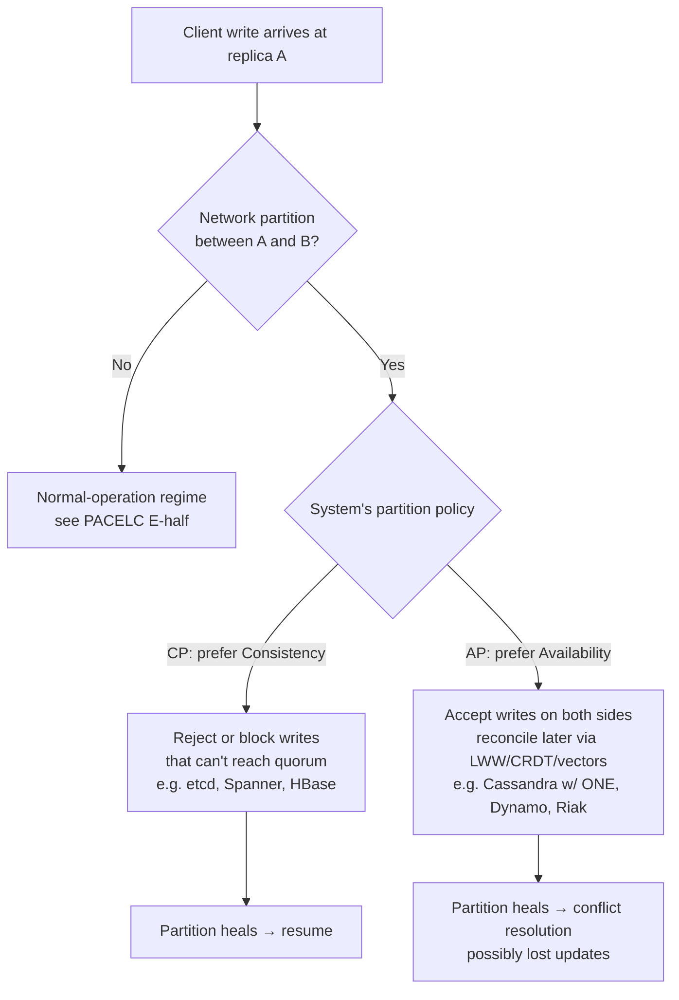
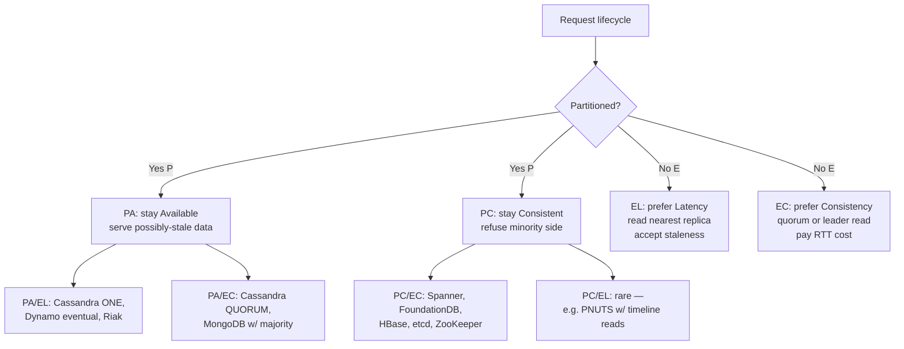
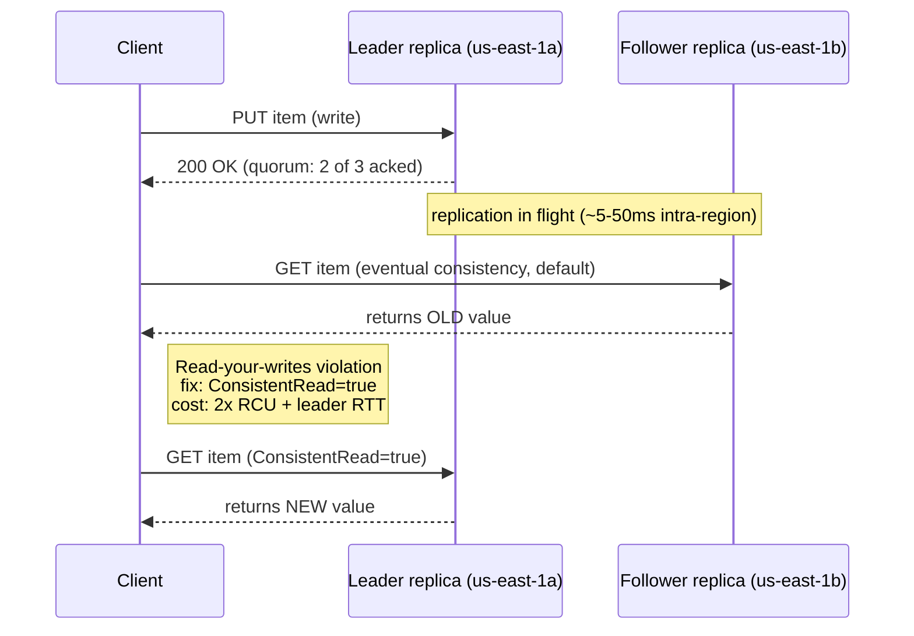

# CAP and PACELC

## Why This Exists

**Problem.** Engineers reach for CAP ("pick 2 of C, A, P") to justify database choices, and almost always misuse it. CAP is a statement about behavior **during a network partition** — not a 3-way menu. It also says nothing about the 99.9% of time when there *isn't* a partition, which is where most of your latency budget actually gets spent. PACELC (Abadi, 2010/2012) fixes the gap: **if Partitioned, choose C or A; Else, choose L or C**. That second axis — latency vs. consistency in normal operation — is where Spanner, DynamoDB, and Cassandra really differ.

**Key insight.** The interesting trade-off isn't C vs. A vs. P. *P is a fact of the network*, not a choice. The choices are:
1. **During a partition**: do reads/writes still succeed (A) at the cost of possibly stale or divergent state, or do they fail/block (C) to preserve a single linearizable history?
2. **In normal operation** (no partition): do you pay the cross-AZ/region round-trip to keep replicas in lockstep (C), or do you serve from the nearest replica and accept staleness (L)?

A system that's "CP" under CAP can still be PA/EL under PACELC (Cassandra with quorum) or PC/EC (Spanner with TrueTime). Saying "we picked CP" without specifying the E-half tells reviewers nothing about your tail-latency posture.

**Reach for this when:**
- Choosing between Spanner / DynamoDB / Cassandra / Aurora / Mongo / etcd / FoundationDB and someone asks "what consistency model?"
- Designing multi-region writes — every cross-region hop is ~60–200 ms, and PACELC's E-axis is exactly this trade.
- Debugging "the write succeeded but the read returned old data" — that's a read-your-writes failure, which PACELC's EL classification predicts.
- An incident review where one AZ partitioned and you need to explain why writes blocked (CP/PC) or why two regions accepted conflicting writes (AP/PA).
- Justifying why your 99.99% availability SLO is incompatible with linearizable single-region quorum (CAP theorem proves it: a partition longer than your error budget mathematically violates A *or* C).

**Don't reach for this when:**
- You have a single-node database. CAP/PACELC is a *distributed systems* theorem; SQLite on one host has neither.
- The discussion is really about isolation levels (serializable vs. snapshot vs. read-committed). That's a different axis (concurrency control, not replication). See `../consistency-models/`.
- The question is "ACID vs. BASE." That's a marketing dichotomy; Spanner is both ACID *and* horizontally distributed. Use PACELC instead.
- Latency budget is dominated by application logic (not network). PACELC's E-axis is irrelevant if your bottleneck is a slow ORM.

## Diagrams

### CAP — what actually happens during a partition



### PACELC — the full picture



### The DynamoDB read-your-writes timeline



## Core content

### What CAP actually states

Brewer's CAP (informally 2000, formalized by Gilbert & Lynch 2002, clarified by Brewer 2012):

> In an asynchronous network model, no protocol can simultaneously guarantee **linearizability** (C) and **total availability** (A) in the presence of arbitrary message loss between non-faulty nodes (P).

Misreadings to watch for:
- WRONG: **"Pick 2 of 3."** P is not optional in any real distributed system; networks partition. The actual choice is C vs. A *given* P.
- WRONG: **"C means ACID consistency."** No — CAP-C is *linearizability*, a single-key real-time-ordering property. ACID-C is integrity constraints. Different word, different concept.
- WRONG: **"A means the system is up."** CAP-A means *every non-failing node responds successfully to every request*. A system can be 99.99% "up" by SLO and still be CP under CAP if it occasionally returns 503 during partitions.
- WRONG: **"AP means eventually consistent."** AP requires *some* convergence story but doesn't mandate it. A truly AP system with no convergence is just broken.

### PACELC: the missing axis

Daniel Abadi (2010 PACELC paper, 2012 IEEE Computer article):

> **If there is a Partition (P), how does the system trade off Availability and Consistency (A and C); Else (E), when the system is running normally in the absence of partitions, how does the system trade off Latency (L) and Consistency (C)?**

The four canonical classifications:

| Class | Partition behavior | Normal-op behavior | Examples |
|-------|--------------------|--------------------|----------|
| **PC/EC** | Refuses minority side, preserves linearizability | Pays cross-replica RTT for every consistent read/write | Spanner, FoundationDB, HBase, etcd, ZooKeeper, CockroachDB |
| **PA/EL** | Both sides accept writes, reconcile later | Reads from nearest replica, accepts staleness | Cassandra (ONE), DynamoDB (eventual), Riak, original Dynamo |
| **PA/EC** | Available during partition (sloppy quorum etc.) | Strong reads via quorum in normal op | Cassandra (QUORUM), MongoDB (w:majority, readConcern:majority) |
| **PC/EL** | Refuses minority side | Allows stale reads from local replica in normal op for low latency | PNUTS (Yahoo!), some configurations of MongoDB |

### Where real systems sit

```python
# Pseudocode-as-spec — not real client code, but the operational semantics

# Spanner: PC/EC
# Uses TrueTime (GPS+atomic clocks) to assign globally-ordered timestamps.
# Writes: 2-phase commit + Paxos across replicas in multiple zones.
# Reads: consistent reads wait out TrueTime uncertainty interval (~7ms).
# Partition: minority replicas can't form Paxos quorum → unavailable.
spanner_write = paxos_quorum(zones) + truetime_commit_wait()  # blocks during partition (PC)
spanner_read  = paxos_lease_holder() or read_at_safe_timestamp()  # always linearizable (EC)

# DynamoDB: PA/EL by default, PC/EC opt-in
# Default reads are eventually consistent — served from any replica.
# Strong reads (ConsistentRead=true) go to leader, cost 2x RCU.
# Across regions (Global Tables): last-writer-wins with vector-clock-like timestamps.
ddb_write_default = quorum_of_3_replicas_in_region()  # available across AZ partition (PA)
ddb_read_default  = any_replica()                      # may be stale (EL)
ddb_read_strong   = leader_replica()                   # linearizable (EC)
ddb_global_table  = async_replicate_cross_region()     # PA/EL across regions, LWW conflict res

# Cassandra: PA/EL with tunable knobs
# Per-query CONSISTENCY level: ANY < ONE < QUORUM < LOCAL_QUORUM < EACH_QUORUM < ALL
# QUORUM = floor(RF/2)+1; if R+W > RF you get strong consistency in normal op.
# Hinted handoff means writes succeed even if some replicas are down (sloppy quorum) → PA.
cass_write_one    = first_replica_to_ack()             # PA/EL
cass_write_quorum = ceil((RF+1)/2)_replicas_ack()      # still PA (hints), but EC if R+W>RF
cass_write_all    = all_RF_replicas_ack()              # PC during any replica failure

# Aurora (Multi-AZ, single writer): PC/EC within region
# Single primary, 4-of-6 quorum write to storage. Failover ~30s.
# Aurora Global Database: PA/EL across regions (async, ~1s lag).
aurora_write = quorum_4_of_6_storage_nodes()  # PC: minority storage failure tolerated, but writer is single point
aurora_read_replica = async_replica()         # EL within region (replica lag ~10-100ms)

# MongoDB: configurable, but defaults matter
# writeConcern={w:1} + readPreference=primaryPreferred → PA/EL
# writeConcern={w:'majority'} + readConcern={level:'majority'} → PA/EC
# Linearizable read concern → PC/EC for that op
mongo_default     = writeConcern_w1()                  # acks after primary write only — risk of rollback on failover
mongo_majority    = writeConcern_majority() + readConcern_majority()  # PA/EC

# etcd / ZooKeeper / Consul: PC/EC by design
# Used as coordination services exactly because they refuse to lie during partitions.
# A 3-node etcd cluster with one node partitioned away: still serves writes (2/3 quorum).
# Partition that isolates 2 of 3: ALL writes block until heal. Reads can be stale unless --consistency=l (linearizable).
etcd_write = raft_quorum()  # PC: blocks on minority partition
etcd_read_serializable = local_replica()  # may be slightly stale — EL
etcd_read_linearizable = leader_read_index()  # EC, costs RTT
```

### Picking a class for a given workload

```python
def pick_pacelc_class(workload):
    """
    Decision logic for a new system. This is opinionated.
    """
    # Step 1: does correctness require linearizability?
    if workload.has_invariants_that_must_hold_globally:
        # E.g. uniqueness constraints (no two users with same email),
        # monetary balance (no double-spend), leader election, distributed locks,
        # config/feature-flag rollout where two values must never coexist.
        return "PC/EC"  # Spanner, FoundationDB, etcd, CockroachDB

    # Step 2: does the workload tolerate convergent staleness?
    if workload.tolerates_seconds_of_staleness and workload.is_high_volume:
        # Product catalogs, social feeds, analytics, IoT telemetry, session state
        # with sticky routing, shopping carts (you can merge concurrent edits).
        if workload.is_multi_region_active_active:
            return "PA/EL"  # Cassandra, DynamoDB Global Tables, Riak
        return "PA/EL or PA/EC"  # within one region, QUORUM is cheap

    # Step 3: read-heavy with strong-read requirement, write-rare?
    if workload.read_write_ratio > 100 and workload.requires_strong_reads:
        return "PC/EC with read-replica caching"  # Spanner stale reads, or Aurora + ElastiCache

    # Step 4: writes need to succeed even when one DC is gone?
    if workload.must_accept_writes_during_region_failure:
        return "PA/EL with conflict resolution"  # Dynamo Global Tables, Cassandra LOCAL_QUORUM
        # Document the LWW/CRDT/manual-merge story explicitly.

    return "default to PA/EC and revisit when it bites"
```

### The math behind quorum and PACELC

For a replicated store with replication factor RF, read quorum R, write quorum W:

- **R + W > RF** ⇒ strong consistency in normal operation (every read sees every write).
- **R + W ≤ RF** ⇒ eventual consistency; reads can miss recent writes.
- **W > RF/2** ⇒ no two concurrent writes can both succeed → linearizable writes.
- During partition: if one side has < RF/2 + 1 replicas, it cannot achieve W > RF/2; PC systems refuse, PA systems use *sloppy quorum* (write to any RF nodes, including non-replica peers via hinted handoff).

```yaml
# Cassandra example: 3-AZ deployment, RF=3 per region, multi-region
keyspace_strategy:
  class: NetworkTopologyStrategy
  us-east-1: 3
  eu-west-1: 3

# Tuning knobs and their PACELC implications:
read_consistency:
  ONE:           # PA/EL — fast (~1ms intra-AZ), may return stale
  LOCAL_QUORUM:  # PA/EC within region, EL across regions — common default
  QUORUM:        # PA/EC across all regions — pays cross-region RTT (~80ms)
  EACH_QUORUM:   # writes only — quorum in EVERY DC, expensive but durable
  ALL:           # PC/EC — any replica down = unavailable
```

### Spanner's TrueTime trick

Spanner is famously PC/EC, but it cheats the latency cost of EC by using **TrueTime**: GPS receivers and atomic clocks in every datacenter give every node a bounded-uncertainty timestamp. Every commit waits for `TT.now().latest` to pass — typically 5–7 ms — which guarantees external consistency without a coordination round-trip. This is why Spanner can be globally linearizable and still serve reads in single-digit ms within a region; the coordination is "spent" in the commit-wait, not in a Paxos round per read.

The lesson: PACELC's E-half is not destiny. With specialized hardware (TrueTime) or read-only leases (Spanner read-only transactions), EC systems can approximate EL latencies — but you pay in operational complexity and hardware.

## Trade-offs

| Choice | Benefit | Cost |
|--------|---------|------|
| **PC/EC (Spanner, etcd, FoundationDB)** | Linearizable, simple programming model — "the database is the truth" | Cross-zone/region RTT on every committed write; minority partitions = unavailable; ops complexity (TrueTime / Raft tuning); usually 2–10× cost of eventual stores |
| **PA/EL (Cassandra ONE, DynamoDB eventual)** | Lowest latency (single-replica reads), highest availability, scales horizontally to PB | Stale reads, conflict resolution required (LWW loses data), no multi-key transactions, harder to reason about |
| **PA/EC (Cassandra QUORUM, Mongo majority)** | Strong reads in normal op, available under one-AZ failure | Pays quorum RTT in normal op (~ms intra-region, ~tens to hundreds ms cross-region); during partition, minority side may serve stale or fail depending on knobs |
| **Tunable per-query (Cassandra, Mongo, DynamoDB)** | Mix consistency levels per call site — strong for billing, eventual for feed | Easy to misconfigure; defaults often weaker than developers assume; observability becomes harder |
| **Single-region only** | Simplest mental model, cheapest, low latency | Region-level outage = full outage (no PA option); usually rules out 99.99%+ SLOs |
| **Multi-region active-active (PA/EL)** | Survives region failure, reads served locally everywhere | Conflict resolution is *your* problem; impossible to enforce uniqueness without a coordinator (so you build one anyway, e.g. Dynamo + ElastiCache locks) |
| **Multi-region active-passive with sync replication (PC/EC global)** | Strong consistency globally | Cross-region RTT (60–200 ms) on every write — usually unacceptable for user-facing writes |

## Common Pitfalls

- **"We picked AP, so we're highly available."** AP only describes partition behavior. If your *single coordinator* dies, you're down — that's a *failure*, not a *partition*. Real availability is end-to-end (load balancer + service + DB + cache); CAP-A is one slice.
- **Reading "C" as "the database has integrity."** CAP-C is linearizability. Your foreign keys still hold in an AP store; what doesn't hold is "this read will reflect every prior committed write."
- **Defaulting MongoDB writeConcern to {w:1}.** Acks after the primary writes — but a primary failover *before replication* rolls back that write. Many production incidents trace to this. Use `{w: "majority"}` and `readConcern: "majority"` unless you've thought hard about it.
- **Assuming DynamoDB Global Tables give you global linearizability.** They don't. They're PA/EL: last-writer-wins with timestamp-based conflict resolution. Two concurrent writes to the same key in different regions = one is silently lost. (DynamoDB single-region with `ConsistentRead=true` *is* linearizable per-key.)
- **"Eventually consistent" with no upper bound on eventual.** Cassandra hinted handoff has a TTL (default 3 hours). Beyond that, hints are dropped and you need anti-entropy repair. If you don't run repairs, "eventual" becomes "never."
- **Conflating session consistency with linearizability.** Read-your-writes / monotonic-reads / monotonic-writes are *session* guarantees and are far cheaper than linearizability. DynamoDB sessions, Mongo causal consistency, Cassandra LWT all offer these. Most apps need session, not linearizable.
- **Picking PC/EC and then bypassing it with caches.** A read-through Redis in front of Spanner moves you to PA/EL semantics but with *no* convergence story. The cache *is* a replica with a TTL-shaped consistency model. Account for it explicitly.
- **Cross-region synchronous writes for the wrong reason.** If you're doing 80 ms cross-region round-trips per write because of a compliance checkbox, you've signed up for PC/EC global — and your p99 will be terrible. Usually the fix is per-region writes + async replication + a clear conflict-resolution policy.
- **Forgetting that quorum reads aren't free.** A `QUORUM` read in Cassandra hits 2 of 3 replicas; that's 2× the network and the slower replica's tail dominates. P99 of QUORUM ≈ P99 of the slowest replica.
- **Treating "split-brain" as a CAP problem when it's a fencing problem.** CP systems prevent split-brain via quorum; AP systems embrace it. But the dangerous case — a stale leader continuing to accept writes after a new leader is elected — is solved by **fencing tokens** (DDIA ch. 8), not by CAP class.

## Decision Table

| Workload | Recommended class | Concrete pick | Rationale |
|----------|-------------------|---------------|-----------|
| Money movement, ledger, balance updates | PC/EC | Spanner / CockroachDB / Aurora (single region) | Invariants must hold globally; no LWW |
| Distributed locks, leader election, config | PC/EC | etcd / ZooKeeper / Consul | Coordination services are PC by definition |
| Product catalog (read-heavy, seconds-stale OK) | PA/EL | DynamoDB / Cassandra ONE / Mongo eventual | Latency matters more than freshness |
| Social feed / activity stream | PA/EL | Cassandra / DynamoDB | Approximate ordering acceptable; multi-region |
| Shopping cart (multi-region, mergeable) | PA/EL with CRDT | DynamoDB Global Tables, Riak | Concurrent edits → set-union, not LWW |
| User session state | PA/EL | Redis / DynamoDB | Sticky routing makes single-replica reads safe |
| IoT telemetry / time-series ingest | PA/EL | Cassandra / Timestream / InfluxDB | Append-mostly, eventual analytics OK |
| Multi-region uniqueness (usernames, emails) | PC/EC | Spanner, OR single-region store + global lock | LWW silently merges duplicates — unsafe |
| Feature flag rollout | PC/EC for the source of truth, PA/EL for read replicas | Launchdarkly-style: strong write + cached reads | One-way fan-out tolerates EL |
| Analytics warehouse | PA/EL irrelevant — async ETL | Snowflake, Redshift, BigQuery | Not OLTP; PACELC doesn't apply directly |
| 99.999% available across regions | PA/EL with conflict resolution | Active-active Dynamo / Cassandra | Math: PC/EC global can't hit five-nines if any region partition takes longer than your error budget |
| Regulatory: must show "single source of truth" | PC/EC | Spanner / FoundationDB | Auditability requires linearizable history |

## References

### Primary sources
- Brewer, Eric — *Towards Robust Distributed Systems* (PODC keynote, 2000) — the original CAP conjecture. Slides: https://people.eecs.berkeley.edu/~brewer/cs262b-2004/PODC-keynote.pdf
- Brewer, Eric — *CAP Twelve Years Later: How the "Rules" Have Changed* (IEEE Computer, 2012) — Brewer's own clarification that "2 of 3" was always a misreading. https://www.infoq.com/articles/cap-twelve-years-later-how-the-rules-have-changed/
- Gilbert, Seth and Lynch, Nancy — *Brewer's Conjecture and the Feasibility of Consistent, Available, Partition-Tolerant Web Services* (ACM SIGACT News, 2002) — the formal proof. https://groups.csail.mit.edu/tds/papers/Gilbert/Brewer2.pdf
- Abadi, Daniel — *Consistency Tradeoffs in Modern Distributed Database System Design* (IEEE Computer, 2012) — the PACELC paper. https://www.cs.umd.edu/~abadi/papers/abadi-pacelc.pdf
- Abadi, Daniel — *Problems with CAP, and Yahoo's little known NoSQL system* (blog, 2010) — the original PACELC announcement. http://dbmsmusings.blogspot.com/2010/04/problems-with-cap-and-yahoos-little.html

### System papers
- Corbett et al. — *Spanner: Google's Globally-Distributed Database* (OSDI 2012) — TrueTime + Paxos = PC/EC at planet scale. https://research.google/pubs/pub39966/
- DeCandia et al. — *Dynamo: Amazon's Highly Available Key-value Store* (SOSP 2007) — the canonical PA/EL design. https://www.allthingsdistributed.com/files/amazon-dynamo-sosp2007.pdf
- Lakshman and Malik — *Cassandra: A Decentralized Structured Storage System* (SIGOPS 2010) — Dynamo + BigTable lineage, tunable consistency. https://www.cs.cornell.edu/projects/ladis2009/papers/lakshman-ladis2009.pdf
- Cooper et al. — *PNUTS: Yahoo!'s Hosted Data Serving Platform* (VLDB 2008) — the rare PC/EL system, with timeline consistency. https://research.yahoo.com/publications/pnuts-yahoo!s-hosted-data-serving-platform

### Books and long-form
- Kleppmann, Martin — *Designing Data-Intensive Applications* (O'Reilly 2017) — ch. 5 "Replication", ch. 8 "The Trouble with Distributed Systems", ch. 9 "Consistency and Consensus." DDIA ch. 9 is the single best treatment of why CAP-as-stated is misleading and what to use instead.
- Kleppmann, Martin — *A Critique of the CAP Theorem* (arXiv 2015) — argues CAP's definitions are too narrow and proposes a better framework. https://arxiv.org/abs/1509.05393
- Beyer et al. — *Site Reliability Engineering* — ch. 23 "Managing Critical State: Distributed Consensus for Reliability" (CP coordination systems in practice). https://sre.google/sre-book/managing-critical-state/
- Helland, Pat — *Life Beyond Distributed Transactions: An Apostate's Opinion* (CIDR 2007, ACM Queue 2016) — why most large systems abandon global ACID. https://queue.acm.org/detail.cfm?id=3025012
- Helland, Pat — *Immutability Changes Everything* (CIDR 2015) — append-only data sidesteps much of the CAP discussion. https://www.cidrdb.org/cidr2015/Papers/CIDR15_Paper16.pdf

### Vendor / operational
- AWS — *Amazon DynamoDB read consistency* — official docs on eventual vs. strongly consistent reads. https://docs.aws.amazon.com/amazondynamodb/latest/developerguide/HowItWorks.ReadConsistency.html
- AWS — *Global tables: multi-Region replication for DynamoDB* — explicit LWW semantics. https://docs.aws.amazon.com/amazondynamodb/latest/developerguide/GlobalTables.html
- Google Cloud — *Spanner TrueTime and external consistency*. https://cloud.google.com/spanner/docs/true-time-external-consistency
- DataStax / Apache Cassandra — *Configuring data consistency* — tunable R/W levels. https://cassandra.apache.org/doc/latest/cassandra/architecture/dynamo.html#tunable-consistency
- MongoDB — *Read concern, write concern, and read preference*. https://www.mongodb.com/docs/manual/reference/read-concern/
- AWS Builders' Library — *Challenges with distributed systems* (Marc Brooker). https://aws.amazon.com/builders-library/challenges-with-distributed-systems/

### Commentary worth reading
- Colyer, Adrian (the morning paper) — *A critique of the CAP theorem* — accessible summary of Kleppmann's critique. https://blog.acolyer.org/2017/01/26/a-critique-of-the-cap-theorem/
- Bailis, Peter — *Linearizability vs. Serializability* — clarifies the C in CAP vs. the C in ACID. http://www.bailis.org/blog/linearizability-versus-serializability/
- Fowler, Martin — *CAP Theorem* / *Eventual Consistency* — short and pragmatic. https://martinfowler.com/bliki/CAP.html

## See Also

- `../consistency-models/` — linearizability, sequential, causal, eventual, session guarantees (read-your-writes, monotonic reads).
- `../replication/` — leader/follower, multi-leader, leaderless; sync vs. async; quorum math.
- `../partitioning/` — sharding strategies; how partitioning interacts with replication for availability.
- `../distributed-transactions/` — 2PC, Sagas, Percolator-style; what you give up when you move from PC/EC to PA/EC.
