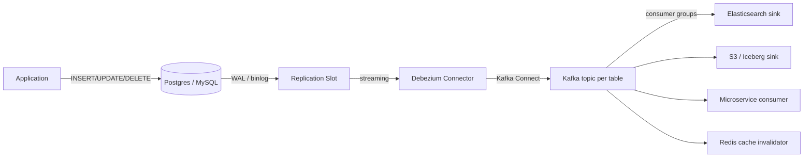
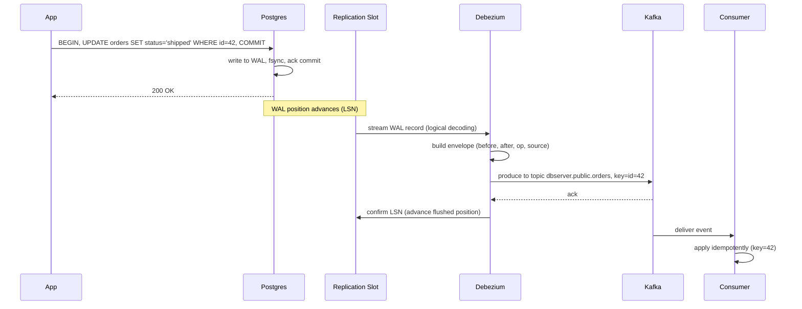
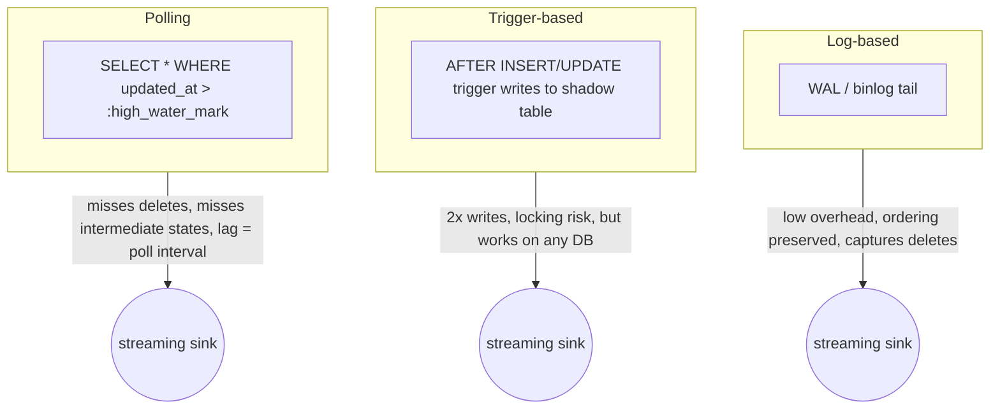

# Change Data Capture (CDC)

## Why This Exists

**Problem.** You have a system of record (Postgres, MySQL, Oracle) and N downstream consumers that need to react to data changes — a search index, a cache, an analytics warehouse, a notification service, another microservice. The naive solution is **dual writes**: the application writes to the DB and publishes to Kafka in the same request handler. Dual writes are broken: the DB commit and the Kafka publish are not atomic, so a crash between them leaves the two systems inconsistent forever. There is no two-phase commit that survives in production at scale.

**Key insight.** The database's **write-ahead log (WAL)** — the same log used for crash recovery and replication — is already an ordered, durable, append-only stream of every committed change. CDC turns that log into a first-class event stream. The DB transaction commit becomes the *only* place truth is recorded; downstream propagation is a tail of an existing log, not a second write.

**Reach for this when:**

- You need to keep a search index, cache, or read-optimized view in sync with an OLTP database.
- You're decomposing a monolith and a new service needs to consume changes from a legacy DB you don't yet own.
- Nightly batch ETL has unacceptable latency (you need minutes or seconds, not hours).
- You're implementing the **outbox pattern** but want to skip the polling overhead.
- You need to backfill a downstream system from a snapshot, then switch to streaming live changes (Debezium's incremental snapshot).
- Audit / compliance requires every row-level change with before-image and after-image.

**Don't reach for this when:**

- You only need *current* state, not history of changes — a periodic full export may be simpler.
- The source isn't a real database (e.g. an external SaaS API) — there's no log to tail; use webhooks or polling.
- You need synchronous read-after-write consistency across systems — CDC is asynchronous; downstream lag is a fact of life.
- Your workload is mostly writes that touch many rows per transaction with high throughput, and downstream can't keep up — CDC pipelines are bounded by the slowest consumer.
- Schema changes happen constantly and downstream consumers can't tolerate evolution — CDC propagates DDL imperfectly.

## Diagrams

### Log-based CDC pipeline (Debezium → Kafka → consumers)



### Anatomy of a single change event



### Log-based vs trigger-based vs polling — where the change is captured



## Core Patterns

### 1. Debezium Postgres connector — the canonical setup

Postgres uses **logical replication** via a replication slot and an output plugin (`pgoutput` is built-in since PG 10; `wal2json` is older). The slot guarantees the DB will retain WAL until the consumer confirms it's been read — a powerful guarantee, and a sharp-edged one (see Pitfalls).

```sql
-- 1. Set wal_level=logical (requires restart)
ALTER SYSTEM SET wal_level = 'logical';
ALTER SYSTEM SET max_replication_slots = 10;
ALTER SYSTEM SET max_wal_senders = 10;

-- 2. Create a publication for the tables you want to stream
CREATE PUBLICATION dbz_pub FOR TABLE public.orders, public.customers;

-- 3. Create a role with REPLICATION attribute
CREATE ROLE debezium WITH REPLICATION LOGIN PASSWORD '...';
GRANT SELECT ON ALL TABLES IN SCHEMA public TO debezium;

-- 4. Enable REPLICA IDENTITY FULL on tables where you need before-images for UPDATE/DELETE
-- Without this, UPDATE events only contain the PK (not the old values of changed columns).
ALTER TABLE public.orders REPLICA IDENTITY FULL;
```

```json
// Debezium connector config (POST to Kafka Connect /connectors)
{
  "name": "orders-cdc",
  "config": {
    "connector.class": "io.debezium.connector.postgresql.PostgresConnector",
    "database.hostname": "pg-primary.internal",
    "database.port": "5432",
    "database.user": "debezium",
    "database.password": "${file:/secrets/pg-pw}",
    "database.dbname": "shop",
    "topic.prefix": "shop",
    "plugin.name": "pgoutput",
    "publication.name": "dbz_pub",
    "slot.name": "debezium_orders",
    "table.include.list": "public.orders,public.customers",
    "snapshot.mode": "initial",
    // Critical: heartbeat keeps the slot moving even when watched tables are idle.
    // Without this, a slot can pin WAL forever on a quiet table while a chatty
    // unrelated table fills the disk.
    "heartbeat.interval.ms": "10000",
    "heartbeat.action.query":
      "INSERT INTO public.dbz_heartbeat (id, ts) VALUES (1, now()) ON CONFLICT (id) DO UPDATE SET ts = excluded.ts",
    // Tombstones for deletes — required for Kafka log compaction to remove keys
    "tombstones.on.delete": "true",
    // Kafka topic per table; key = primary key
    "key.converter": "org.apache.kafka.connect.json.JsonConverter",
    "value.converter": "io.confluent.connect.avro.AvroConverter",
    "value.converter.schema.registry.url": "http://schema-registry:8081"
  }
}
```

The event envelope Debezium emits has a stable shape:

```json
{
  "op": "u",                 // c=create, u=update, d=delete, r=read (snapshot)
  "ts_ms": 1717450000000,
  "source": {
    "db": "shop", "schema": "public", "table": "orders",
    "lsn": 23984710,         // Postgres WAL position — your offset of record
    "txId": 9912,
    "snapshot": "false"
  },
  "before": { "id": 42, "status": "pending",  "total": 100 },
  "after":  { "id": 42, "status": "shipped",  "total": 100 }
}
```

### 2. Idempotent consumer — the only safe way to consume

CDC delivery is **at-least-once**. A connector restart, a Kafka rebalance, or a network blip will replay events. Every consumer must be idempotent on the primary key + LSN.

```python
# Python consumer — apply CDC event to a downstream Postgres read-model.
# Idempotency comes from the (table, pk, source_lsn) tuple being monotonic.
def apply_event(conn, evt):
    pk = evt["after"]["id"] if evt["op"] != "d" else evt["before"]["id"]
    src_lsn = int(evt["source"]["lsn"])

    with conn.cursor() as cur:
        # Reject out-of-order or replayed events. The read-model stores the
        # last LSN we applied per row; a smaller LSN means we already saw it.
        cur.execute(
            "SELECT last_lsn FROM read_model_orders WHERE id = %s FOR UPDATE",
            (pk,),
        )
        row = cur.fetchone()
        if row and row[0] >= src_lsn:
            return  # duplicate / out-of-order — drop silently

        if evt["op"] == "d":
            cur.execute("DELETE FROM read_model_orders WHERE id = %s", (pk,))
        else:
            after = evt["after"]
            cur.execute(
                """INSERT INTO read_model_orders (id, status, total, last_lsn)
                   VALUES (%(id)s, %(status)s, %(total)s, %(lsn)s)
                   ON CONFLICT (id) DO UPDATE SET
                     status   = EXCLUDED.status,
                     total    = EXCLUDED.total,
                     last_lsn = EXCLUDED.last_lsn""",
                {**after, "lsn": src_lsn},
            )
    conn.commit()
```

Two non-obvious points buried in the code above:

1. **The LSN goes into the read-model row, not just an offset table.** Otherwise a consumer that resets to an earlier offset will undo correct state with stale data.
2. **`SELECT ... FOR UPDATE`** prevents two consumer instances from racing on the same key. If you partition by PK in Kafka and run one consumer per partition this is unnecessary — but most teams don't, and discover the race in production.

### 3. Outbox pattern — when you need *application-level* events, not table-level

Raw CDC streams reflect physical schema. If you rename a column or split a table, every downstream consumer breaks. The **outbox pattern** decouples by giving the application control of the event payload:

```sql
CREATE TABLE outbox (
  id          uuid PRIMARY KEY,
  aggregate   text NOT NULL,    -- e.g. 'Order'
  aggregate_id text NOT NULL,
  event_type  text NOT NULL,    -- e.g. 'OrderShipped'
  payload     jsonb NOT NULL,   -- application-defined event schema
  created_at  timestamptz NOT NULL DEFAULT now()
);
```

```python
# In the same DB transaction that mutates the aggregate, write the outbox row.
# The DB commit is atomic; either both happen or neither does.
def ship_order(order_id):
    with db.transaction() as tx:
        tx.execute("UPDATE orders SET status='shipped' WHERE id=%s", (order_id,))
        tx.execute(
            "INSERT INTO outbox (id, aggregate, aggregate_id, event_type, payload) "
            "VALUES (%s, 'Order', %s, 'OrderShipped', %s)",
            (uuid4(), str(order_id), Json({"order_id": order_id, "shipped_at": "..."})),
        )
```

Debezium's [`outbox` Single Message Transform (SMT)](https://debezium.io/documentation/reference/stable/transformations/outbox-event-router.html) reads CDC events from the `outbox` table and routes them to per-aggregate Kafka topics. The application controls the schema; the physical `outbox` table can be deleted from after publishing (Debezium recommends a separate cleanup job — don't delete in the same transaction or the consumer never sees the row).

### 4. Snapshot + streaming handoff

Cold-starting a downstream system requires a consistent snapshot of existing rows, then a seamless switch to streaming. Debezium does this in `snapshot.mode = initial`:

1. Open a read-only transaction with `REPEATABLE READ` isolation, capturing the current LSN.
2. `SELECT *` from each watched table inside that transaction, emitting `op: r` (read) events.
3. Close the snapshot transaction, then resume streaming the WAL from the captured LSN.

For tables too large for a single snapshot, **incremental snapshotting** (Debezium 1.6+, based on the [DBLog paper from Netflix](https://arxiv.org/abs/2010.12597)) interleaves chunked snapshot reads with live streaming, preserving correctness via watermark events written to a signal table.

## Trade-offs

| Benefit | Cost |
|---|---|
| Eliminates dual-writes; DB commit is the only source of truth | Adds operational surface: replication slots, connector cluster, schema registry |
| Total ordering per table partition (Kafka key = PK preserves per-row order) | Cross-table ordering is lost; events on different topics race |
| Captures every intermediate state, including deletes | Replay storms during connector recovery can overwhelm downstream |
| Snapshot + streaming gives bootstrap + live updates from one mechanism | Snapshots take long-running read transactions, can bloat WAL |
| Schema evolution via Schema Registry / Avro is well-tooled | DDL changes (column drops, table renames) often require connector restart and manual coordination |
| At-least-once is sufficient for idempotent consumers | At-least-once forces idempotency in *every* consumer — no exceptions |
| Postgres logical replication slots are durable across restarts | A slot held by a stopped consumer pins WAL forever and fills the disk — a top-3 outage cause |
| Kafka topics give multiple consumers independent offsets | Each consumer adds load on the slot/binlog reader, not free |
| Decouples producers and consumers in time and deployment | Debugging "where did this event come from?" requires correlating LSN/binlog/GTID across systems |

## Common Pitfalls

- **Replication slot fills the disk.** A Debezium connector that crashes and isn't restarted leaves an inactive slot. Postgres retains WAL until the slot's `confirmed_flush_lsn` advances, so disk usage grows monotonically. Symptom: free space alarm at 3am on the OLTP primary, application writes start failing. Mitigation: monitor `pg_replication_slots.confirmed_flush_lsn` lag in bytes; alert when it exceeds a threshold; consider `max_slot_wal_keep_size` (PG 13+) to cap the damage at the cost of breaking the slot.

- **`REPLICA IDENTITY` is `DEFAULT` and you're surprised by missing data.** Default identity sends only the primary key for UPDATE/DELETE before-images. If your consumer needed to know "what was the old `status`?" — too bad. `REPLICA IDENTITY FULL` fixes this but writes more WAL.

- **Heartbeats not enabled, slot lag explodes on a quiet table.** Postgres only advances a slot when WAL activity touches a table the publication watches. If your `audit_log` table is quiet but `analytics_events` is chatty, the slot pins WAL until the next `audit_log` change. Heartbeats (`heartbeat.interval.ms`) force movement.

- **Consumer assumes events are in commit order across tables.** Debezium emits one Kafka topic per table. A multi-row transaction touching `orders` and `order_items` produces events on two topics, with no ordering guarantee between them. If you `JOIN` downstream, you must tolerate seeing the child row before the parent — design for this or use a single topic with `topic.routing` SMT.

- **Tombstone events confuse consumers.** Debezium emits a null-value record after every delete (the "tombstone") so log-compacted topics can drop the key. Naive consumers crash on null payloads. Either disable tombstones or handle them.

- **Schema changes propagated incorrectly.** Adding a column is usually safe (consumers ignore unknown fields). Dropping or renaming a column is not — Avro readers blow up, Schema Registry rejects incompatible schemas, the connector halts. Coordinate DDL with consumer rollouts; consider a dual-write column-add → backfill → consumer-update → column-drop sequence over weeks.

- **Trigger-based CDC under high write load deadlocks.** Triggers run inside the writing transaction, holding locks longer. A heavy CDC trigger on a hot table can take down the OLTP workload. Real outage at multiple companies — log-based is preferred for a reason.

- **Snapshotting a large table holds a long-running read transaction.** On Postgres this prevents `VACUUM` from cleaning up dead tuples, leading to bloat. Use incremental snapshotting or accept the bloat window.

- **MySQL binlog `ROW` format not configured.** MySQL CDC requires `binlog_format=ROW` and `binlog_row_image=FULL` for Debezium / Maxwell to emit useful events. `STATEMENT` format gives you the SQL string but not the rows it affected — useless for replication into a non-MySQL sink.

- **Oracle GoldenGate licensing surprise.** GoldenGate is a separate Oracle license, not bundled with the DB. Teams discover this after deploying. The open-source Debezium Oracle connector uses LogMiner (free but slow on high write volume) or XStream (requires GoldenGate license too). There's no free lunch.

- **Forgetting that CDC is *eventually* consistent.** A user updates their email, the API returns 200, and a downstream search index lags by 200ms. The user reloads, sees the old email, files a bug. Either explain the consistency model in UI ("indexing…") or read from the source for read-after-write paths.

- **Kafka retention shorter than consumer downtime.** Default Kafka retention is 7 days. A consumer that's down for 8 days has lost events. Either tier-storage / increase retention for CDC topics, or use log compaction (which retains the latest value per key forever but loses delete history).

- **Multiple connectors pointing at the same slot.** Each Postgres replication slot can have only one active consumer. A second connector with the same `slot.name` will fail to start. In Kubernetes, a partial failover where two pods fight for the slot causes flapping. Ensure connector deployments are singleton (StatefulSet with replicas=1, or Connect cluster's single-task semantics).

## Decision Table

### CDC technique selection

| Scenario | Choose | Why |
|---|---|---|
| Postgres source, want streaming to Kafka | Debezium + `pgoutput` plugin | Built-in, well-documented, used at scale |
| MySQL source, simple JSON events to Kafka | Maxwell or Debezium MySQL | Maxwell is lighter; Debezium is more featureful |
| Oracle source, enterprise budget, lowest-latency | Oracle GoldenGate | Native, mature, expensive license |
| Oracle source, open-source-only | Debezium Oracle (LogMiner) | Works, but high-volume workloads strain LogMiner |
| SQL Server source | Debezium SQL Server | Uses MS native CDC tables (which themselves are log-based) |
| MongoDB source | Debezium MongoDB | Tails the oplog |
| Source DB has no log access (ancient version, hosted SaaS) | Trigger-based or polling | Last resort; accept the costs |
| Need application-controlled event schema, not raw rows | Outbox pattern + Debezium outbox SMT | Decouples from physical schema |
| Source can't run a connector (firewalls, no replication user) | Polling on `updated_at` + soft-delete | Fragile but simple |
| All-in-one without Kafka | Debezium Server (writes to Kinesis, Pulsar, Pub/Sub directly) | Skips Kafka if you don't need it |

### CDC vs alternatives

| Need | Use CDC | Use alternative |
|---|---|---|
| Replicate every row change with low latency | Yes | — |
| Eventual consistency between OLTP and search/cache | Yes | — |
| Strong cross-system consistency | No | Saga / two-phase commit |
| Source is an external SaaS (Stripe, Salesforce) | No | Webhooks, polling |
| Aggregate events at application level, not row level | Use outbox + CDC | Domain events on a message bus |
| Periodic bulk export to warehouse (T+1 latency OK) | Overkill | Scheduled `COPY` / `pg_dump` / DMS full load |
| In-DB triggers fanning out to other rows in the same DB | Wrong tool | Native triggers / stored procedures |
| Audit log of who changed what | Yes (with `REPLICA IDENTITY FULL`) | App-level audit table |

### Log-based vs trigger-based

| Dimension | Log-based | Trigger-based |
|---|---|---|
| Write overhead on source | Near zero (log already exists) | Doubles writes; trigger executes per row |
| Lock / contention impact | None on writers | Triggers extend transaction time, increase deadlock risk |
| Captures schema changes (DDL) | Partial (some connectors emit DDL events) | No — DDL doesn't fire DML triggers |
| Captures bulk writes (`COPY`, `INSERT … SELECT`) | Yes | Yes, but overhead can be catastrophic |
| Requires DB version / privilege | Replication user, modern version | Any version with triggers |
| Captures DELETE | Yes | Yes (with delete trigger) |
| Recovery / replay from arbitrary point | Yes (LSN / binlog position) | Only from shadow table contents |
| Operationally complex | More so (slots, plugins) | Less so (just SQL) |

## References

- Confluent — *Debezium Documentation* — https://debezium.io/documentation/
- Confluent — *Streaming Data Pipelines with Debezium and Kafka Connect* — https://www.confluent.io/blog/cdc-and-streaming-analytics-using-debezium-kafka/
- Confluent — *No More Silos: How to Integrate Your Databases with Apache Kafka and CDC* — https://www.confluent.io/blog/no-more-silos-how-to-integrate-your-databases-with-apache-kafka-and-cdc/
- PostgreSQL — *Logical Replication* — https://www.postgresql.org/docs/current/logical-replication.html
- PostgreSQL — *Replication Slots* — https://www.postgresql.org/docs/current/warm-standby.html#STREAMING-REPLICATION-SLOTS
- MySQL — *The Binary Log* — https://dev.mysql.com/doc/refman/8.0/en/binary-log.html
- Maxwell's Daemon — *Maxwell* — https://maxwells-daemon.io/
- Oracle — *GoldenGate Documentation* — https://docs.oracle.com/en/middleware/goldengate/
- Andrew Schofield et al. (Netflix) — *DBLog: A Generic Change-Data-Capture Framework* — https://arxiv.org/abs/2010.12597
- Gunnar Morling — *Reliable Microservices Data Exchange With the Outbox Pattern* — https://debezium.io/blog/2019/02/19/reliable-microservices-data-exchange-with-the-outbox-pattern/
- Martin Kleppmann — *Designing Data-Intensive Applications* (O'Reilly, 2017) — ch. 5 "Replication" (statement-based vs WAL shipping vs logical/row-based), ch. 11 "Stream Processing" (CDC, log-compacted topics, dual-writes problem), and ch. 12 "The Future of Data Systems" (turning the DB inside out).
- Martin Kleppmann — *Turning the database inside-out with Apache Samza* — https://martin.kleppmann.com/2015/03/04/turning-the-database-inside-out.html
- Pat Helland — *Immutability Changes Everything* — https://queue.acm.org/detail.cfm?id=2884038
- Jay Kreps — *The Log: What every software engineer should know about real-time data's unifying abstraction* — https://engineering.linkedin.com/distributed-systems/log-what-every-software-engineer-should-know-about-real-time-datas-unifying
- Apache Kafka — *Kafka Connect* — https://kafka.apache.org/documentation/#connect
- Apache Kafka — *Log Compaction* — https://kafka.apache.org/documentation/#compaction
- AWS Database Migration Service — *Using CDC with DMS* — https://docs.aws.amazon.com/dms/latest/userguide/CHAP_Task.CDC.html
- Confluent Schema Registry — https://docs.confluent.io/platform/current/schema-registry/index.html
- Dean Wampler — *Fast Data Architectures for Streaming Applications* (O'Reilly) — ch. 3-4 on CDC patterns and exactly-once illusions.
- Beyer et al. — *Site Reliability Engineering* — https://sre.google/sre-book/data-integrity/ — ch. 26 on data integrity and replication invariants.

## See Also

- `../../architecture-patterns/event-sourcing/` — when CDC's "row diff" event isn't expressive enough; events as the source of truth.
- `../outbox/` — the application-level companion to log-based CDC.
- `../../communication/kafka-patterns/` — Kafka semantics, partitioning, and log-compaction details that shape CDC sink design.
- `../distributed-transactions/` — what CDC replaces; understand why XA failed at scale.
- `../../architecture-patterns/saga/` — for cross-service transactions where CDC events drive compensation steps.
- `../replication/` — physical vs logical replication, leader-follower vs multi-leader, where CDC fits.
- `../../communication/idempotency/` — the contract every CDC consumer must implement.
- `../../performance/tracing/` — propagating trace context through CDC events for end-to-end visibility.
