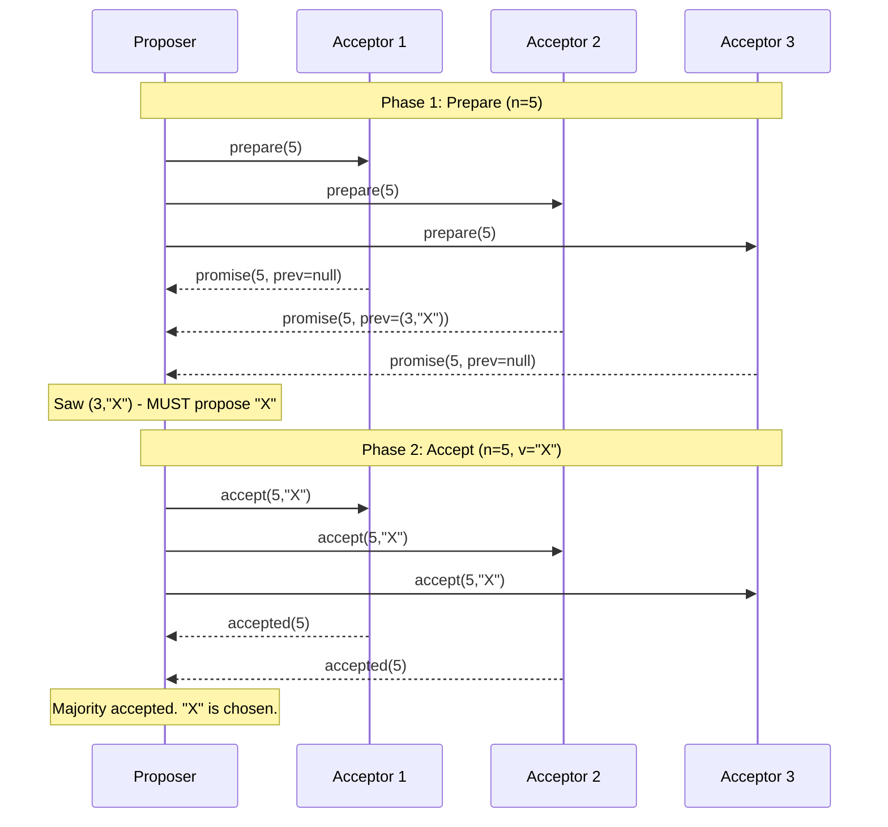
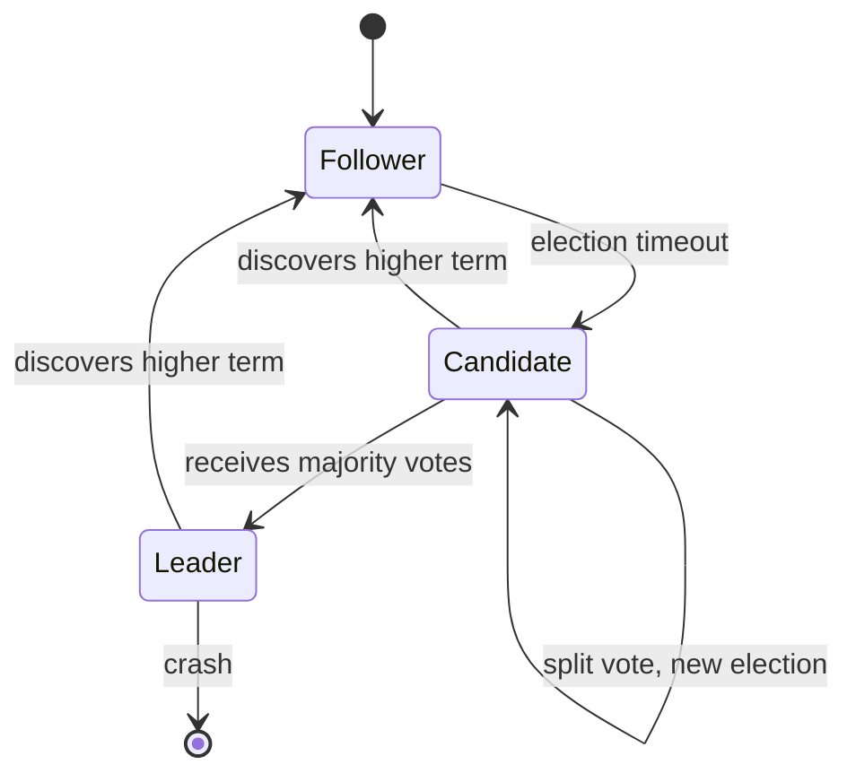
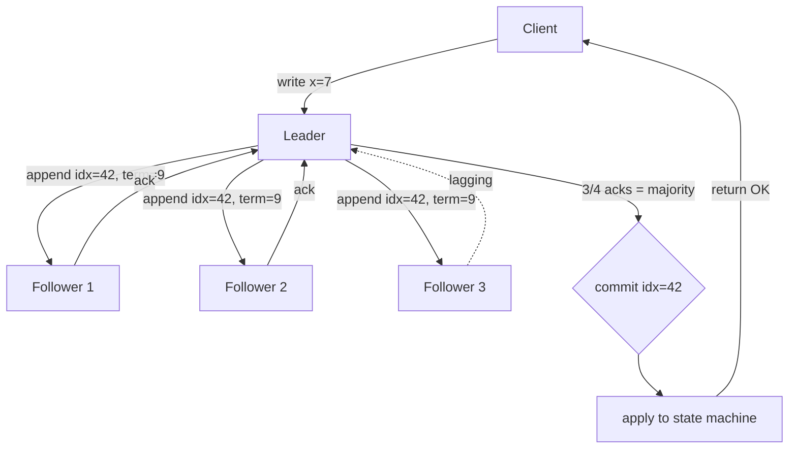

# Consensus: Paxos, Multi-Paxos, Raft, EPaxos

## Why This Exists

**Problem.** A set of replicas needs to agree on a sequence of values (commands, log entries, leader identity, config) despite crashes, message loss, reordering, and arbitrary delays. Naive solutions — "ask the leader", "majority vote once", "use a lock service" — all degrade into split-brain, lost writes, or duplicate commits the moment the network misbehaves.

**Key insight.** Consensus is **not** about voting once. It's about ensuring that any value chosen is *learnable* by every non-faulty node, *forever*, even if the node that learned it crashes the next nanosecond. The whole game is forcing later operations to *recover* the decision rather than overwrite it. Quorum intersection (`|Q1| + |Q2| > N`) is the structural reason this works: any two majorities share at least one node who remembers.

**FLP (Fischer–Lynch–Paterson, 1985).** In a purely asynchronous model with even *one* crash failure, no deterministic consensus protocol can guarantee both safety and liveness. Real systems escape FLP not by violating it but by adding partial synchrony (timeouts, randomized backoff, failure detectors) — they sacrifice liveness during pathological networks while preserving safety always.

**Reach for this when:**
- You're building a replicated state machine — config store, scheduler, lock service, metadata service.
- You need linearizable reads/writes across replicas (etcd, ZooKeeper, Consul-style).
- You're picking the leader for a sharded system (Kafka KRaft, ClickHouse Keeper, CockroachDB ranges).
- You see "two primaries accepted writes" or "stale read after failover" in incident reports.
- You need exactly-once semantics across a small replica group (3–7 nodes).

**Don't reach for this when:**
- You need geo-scale replication of independent objects → use leaderless quorums (Dynamo/Cassandra) or CRDTs.
- You need throughput >> 100k ops/s on commodity hardware → consensus is a coordination tax; shard first, then run consensus per shard.
- You only need eventual consistency → gossip + anti-entropy is simpler and cheaper.
- You have one writer and many readers → primary/replica with WAL shipping is enough; you don't need agreement.
- You're tempted to "just use a database transaction across services" → that's distributed transactions, not consensus. See `../distributed-transactions/`.

---

## Diagrams

### Paxos single-decree (one round)



### Raft state machine



### Replicated log convergence (Multi-Paxos / Raft)



---

## Paxos: the foundational protocol

Lamport's *Paxos Made Simple* (2001) defines **single-decree Paxos**: a group agrees on *one* value. Roles: proposers (drive rounds), acceptors (vote), learners (observe outcome). One node typically plays all three.

### The two-phase rule

Each round has a unique, monotonically increasing **proposal number** `n` (typically `(round_id, node_id)` to ensure uniqueness across proposers).

**Phase 1 — Prepare:**
- Proposer sends `prepare(n)` to a majority of acceptors.
- Acceptor: if `n > highest_promised`, reply `promise(n, last_accepted_n, last_accepted_v)` and refuse any future proposal `< n`. Otherwise reject.

**Phase 2 — Accept:**
- If proposer got promises from a majority: pick `v` = the value with the highest `last_accepted_n` from the replies (or proposer's own value if none). Send `accept(n, v)`.
- Acceptor: if it has not promised any `n' > n`, accept and persist `(n, v)`.
- If a majority accepts, `v` is **chosen** — irrevocably.

### Why it's safe

The crux is the "pick the value with the highest accepted `n`" rule. If any value `v` was ever chosen at proposal `n0`, then a majority of acceptors logged it. Any later proposer with `n > n0` *must* contact at least one of those acceptors (quorum intersection) and *must* re-propose `v`. Once chosen, always chosen.

### Why a single-decree protocol is useless alone

Each Paxos instance decides one value. To replicate a log of commands you run an instance per slot — and naively that's two RTTs per command, with dueling proposers livelocking forever. Hence Multi-Paxos.

```python
# Single-decree Paxos acceptor — minimal but correct
class Acceptor:
    def __init__(self, persistent_store):
        self.store = persistent_store
        self.promised_n = self.store.load("promised_n", default=-1)
        self.accepted_n = self.store.load("accepted_n", default=-1)
        self.accepted_v = self.store.load("accepted_v", default=None)

    def on_prepare(self, n):
        # Reject lower-numbered proposals
        if n <= self.promised_n:
            return ("reject", self.promised_n)
        # CRITICAL: persist BEFORE replying. Crash here = forget promise.
        self.promised_n = n
        self.store.save_sync({"promised_n": n})
        return ("promise", self.accepted_n, self.accepted_v)

    def on_accept(self, n, v):
        # Reject if we promised a higher number
        if n < self.promised_n:
            return ("reject", self.promised_n)
        self.promised_n = n
        self.accepted_n = n
        self.accepted_v = v
        # CRITICAL: fsync. "Accepted" is a durable promise to the world.
        self.store.save_sync({
            "promised_n": n, "accepted_n": n, "accepted_v": v,
        })
        return ("accepted", n)
```

**Operational note.** The `save_sync` calls are the entire reason Paxos systems are slow on consumer SSDs. Every promise and every accept is an `fsync`. Production systems batch promises across instances and use group commit; see Chubby's "Paxos Made Live" (Chandra et al., 2007).

---

## Multi-Paxos: replicated log

To agree on a *sequence* of values, run a Paxos instance per log slot. The optimization is to **elect a stable leader**: once a proposer wins Phase 1 across all future slots, it can skip Phase 1 forever and just send `accept` messages. One RTT per command, not two.

The leader maintains a **ballot number** that's valid for all uncommitted slots. New leader election runs Phase 1 once for the entire suffix of the log.

Production systems descended from Multi-Paxos:
- **Chubby** (Google) — coarse-grained lock service. Inspired ZooKeeper.
- **Spanner** (Google) — Paxos per shard, TrueTime for external consistency.
- **MegaStore** — Paxos per entity group across data centers.

---

## Raft: Paxos you can actually understand

Ongaro & Ousterhout's 2014 paper *In Search of an Understandable Consensus Algorithm* explicitly trades theoretical minimalism for understandability. Raft is **strong-leader Multi-Paxos** with:

1. **Leader election** via randomized timeouts (avoids livelock).
2. **Log replication** strictly leader → follower; followers never accept entries from each other.
3. **Safety** enforced by the "log matching" property and the election restriction.

### Terms and elections

Time is divided into **terms** (monotonically increasing integers). Each term has at most one leader. Followers wait for `electionTimeout` (randomized, typically 150–300ms). If no heartbeat arrives, they become candidates, increment term, vote for self, and request votes.

A candidate wins if it gets votes from a majority. Voters refuse if the candidate's log is *less up-to-date* than their own (last log term, then last log index). This **election restriction** is what guarantees safety: any new leader's log already contains all committed entries.

### Log replication

```python
# Raft AppendEntries — leader side, simplified
def append_entries_to_follower(self, follower):
    next_idx = self.next_index[follower]
    prev_log_idx = next_idx - 1
    prev_log_term = self.log[prev_log_idx].term if prev_log_idx >= 0 else 0
    entries = self.log[next_idx:]  # may be empty (heartbeat)

    resp = rpc.append_entries(
        follower,
        term=self.current_term,
        leader_id=self.id,
        prev_log_index=prev_log_idx,
        prev_log_term=prev_log_term,
        entries=entries,
        leader_commit=self.commit_index,
    )

    if resp.term > self.current_term:
        # Stale leader. Step down. THIS is how you avoid split-brain.
        self.step_down(resp.term)
        return

    if resp.success:
        self.match_index[follower] = prev_log_idx + len(entries)
        self.next_index[follower] = self.match_index[follower] + 1
        self.advance_commit_index()  # may trigger applies
    else:
        # Log inconsistency — back up and retry.
        # Naive: decrement by 1 (slow). Production: use conflict-term hint.
        self.next_index[follower] = max(1, self.next_index[follower] - 1)
```

```python
# Raft AppendEntries — follower side
def on_append_entries(self, req):
    if req.term < self.current_term:
        return Response(term=self.current_term, success=False)

    # Recognize new leader; reset election timer.
    if req.term > self.current_term:
        self.current_term = req.term
        self.voted_for = None
    self.role = "follower"
    self.reset_election_timer()
    self.leader_id = req.leader_id

    # Log matching property: prev entry must agree.
    if req.prev_log_index >= 0:
        if (req.prev_log_index >= len(self.log) or
            self.log[req.prev_log_index].term != req.prev_log_term):
            return Response(term=self.current_term, success=False)

    # Truncate conflicting entries, then append.
    for i, entry in enumerate(req.entries):
        idx = req.prev_log_index + 1 + i
        if idx < len(self.log) and self.log[idx].term != entry.term:
            self.log = self.log[:idx]  # truncate
        if idx >= len(self.log):
            self.log.append(entry)
    self.persist_log()  # fsync before ack

    if req.leader_commit > self.commit_index:
        self.commit_index = min(req.leader_commit, len(self.log) - 1)
        self.apply_committed_entries()

    return Response(term=self.current_term, success=True)
```

### Commitment rule (the subtle one)

A leader **may not** commit entries from a previous term by counting replicas alone — Figure 8 of the Raft paper shows a scenario where this would lose data. Rule: only commit an entry from the *current term* once it's on a majority; older-term entries get committed transitively when a current-term entry is committed on top.

### Membership changes

Raft's joint consensus or single-server-at-a-time changes are **not optional** — naive "stop, edit config, restart" causes split-brain. etcd uses single-server changes; CockroachDB uses joint consensus.

---

## EPaxos: leaderless, commutative, fast

Egalitarian Paxos (Moraru, Andersen, Kaminsky, SOSP 2013) drops the leader. Any replica can propose; commands that **don't conflict** (commute) commit in **one round-trip** in the fast path. Only conflicting commands need a second round.

The dependency graph is the trick: each command records the set of prior commands it depends on (overlapping keys). Execution order is a topological sort of the dep graph. No leader = no leader-election storms, balanced load, but the dependency tracking is genuinely complex and has had multiple safety bugs in published versions.

**Where you actually see this idea:**
- **Cassandra LWT** (lightweight transactions) implement Paxos *per partition key*, giving leaderless single-key linearizability. Well-known to be slow (~4 RTTs) — used sparingly.
- **ScyllaDB Raft tables** moved to Raft for schema/topology after years of LWT-based config.
- **CockroachDB** uses Raft per range, not EPaxos, despite EPaxos's theoretical wins.

EPaxos is the algorithm everyone admires and few deploy. Operational complexity beats latency wins for most teams.

---

## Quorum math

For `N` replicas tolerating `f` failures, you need `N ≥ 2f + 1` and quorum `Q = f + 1 = ⌈(N+1)/2⌉`.

| N | f tolerated | Quorum |
|---|---|---|
| 3 | 1 | 2 |
| 5 | 2 | 3 |
| 7 | 3 | 4 |

**Even-N footgun.** N=4 tolerates 1 failure (same as N=3) but requires quorum of 3 (worse latency than N=3). Even sizes are strictly worse than the odd size below them. Always run odd numbers.

**Flexible quorums** (Howard, Malkhi, Spiegelman 2016): you can shrink Phase-1 quorums (Q1) at the cost of growing Phase-2 quorums (Q2), as long as `Q1 + Q2 > N`. Useful when leader changes are rare — make steady-state writes cheaper.

**Geographic note.** A 3-DC deployment with N=3 (one replica per DC) tolerates 1 DC failure. N=5 across 3 DCs (2/2/1) tolerates 1 DC + 1 host. Spanner's Paxos groups span 3 to 5 zones for this reason.

---

## Real systems

### etcd / Consul (Raft)

etcd is the canonical Raft implementation in Go. Used as the metadata store for Kubernetes — when etcd loses quorum, the control plane is read-only. Consul similarly uses Raft for service catalog and KV.

- Defaults: 3 or 5 nodes, single-server membership changes, snapshot every 10k entries.
- Disk fsync latency is the #1 bottleneck — etcd's `wal_fsync_duration_seconds` p99 alarm at 10ms is a sentinel for disk problems.
- Leader's heartbeat interval default 100ms, election timeout 1s — tune up for cross-region.

### Spanner (Multi-Paxos)

Each shard ("tablet") has its own Paxos group. Crucially, Spanner combines Paxos with **TrueTime** (bounded clock skew via GPS/atomic clocks) to provide *external* consistency — equivalent to linearizability across the entire database. Reads at a timestamp are served from any replica, no coordination required. Writes still pay full Paxos cost.

### Chubby

Google's lock service. Coarse-grained (sessions, advisory locks, small files). Lesson from "Paxos Made Live": building Paxos in production took years of subtle bug fixing — disk corruption, master leases, group membership, log compaction. *Reading the algorithm is 5%; productionizing is 95%.*

### Kafka KRaft

Kafka 3.x replaced ZooKeeper-based metadata with KRaft — a Raft implementation embedded in the controllers. The motivations: fewer moving parts (no ZK), faster controller failover (seconds → ms), millions of partitions (ZK was the scaling bottleneck). KRaft is *single-leader Raft for metadata*; partition data replication uses Kafka's older ISR (in-sync replica) protocol, which is its own consensus-flavored thing — not Paxos/Raft.

### ZooKeeper (Zab)

Zab (ZooKeeper Atomic Broadcast) is its own protocol, descended from Paxos but designed around primary-backup ordering. Functionally equivalent to Multi-Paxos for replicated state machines. Used by HBase, Solr, Hadoop YARN, classic Kafka.

### Cassandra LWT

Per-partition Paxos using the system tables for acceptor state. `INSERT ... IF NOT EXISTS` and `UPDATE ... IF column = ?` use 4 RTTs (prepare, propose, commit, read-after). Avoid in hot paths; use only for genuine compare-and-set scenarios.

---

## Trade-offs

| Benefit | Cost |
|---|---|
| Linearizability — reads always see latest committed write | Every write costs ≥ 1 RTT to a majority (typically 2–4ms intra-DC, 50–150ms cross-region) |
| Survives `f` failures with `2f+1` nodes | Loses *availability* below quorum (split brain prevention requires unavailability) |
| Strong leader (Raft, Multi-Paxos) → simple semantics | Leader is throughput bottleneck; followers idle on writes |
| Replicated log enables exactly-once state-machine semantics | Log grows unboundedly without snapshot+compact machinery |
| Membership changes are well-defined | Naive config edits cause split-brain — must use joint consensus / single-server change |
| Predictable performance under stable network | Liveness fails under flaky network (FLP); election storms during partial partitions |
| Strong invariants enable simple application code | fsync per write — disk latency dominates; SSD wear |
| Single-leader simplifies reasoning | All writes serialize through the leader; no horizontal write scale (must shard) |
| Quorum reads = strong reads | Quorum reads halve read throughput vs leader-only reads (and leader-only is stale-tolerant) |

---

## Common Pitfalls

- **Even-sized clusters.** N=4 has the failure tolerance of N=3 with worse latency. Run 3, 5, or 7. *Never 2, 4, 6.*
- **Skipping fsync to "make it faster".** Loses safety. After a power loss the node forgets its promise and may double-vote, breaking quorum intersection. Linkedin's 2017 Kafka data loss bug had this flavor in older `unclean.leader.election.enable` defaults.
- **Committing previous-term entries by replica count.** Raft Figure 8. Only commit current-term entries; older entries roll forward transitively. Many homegrown Raft implementations ship with this bug.
- **Not handling the "leader is partitioned but doesn't know it" case.** A leader needs to *step down* when it can't reach a majority within an election timeout. Otherwise it serves stale reads. Raft addresses this with leader leases and check-quorum.
- **Stale reads from the leader.** A node thinks it's leader because it didn't get the latest term update. Mitigation: leader leases (Raft §6.4) or read-index protocol.
- **Ignoring clock skew in lease-based reads.** Spanner uses TrueTime; lesser systems assume bounded skew and break under VM pause/migrate.
- **Membership change as "just edit the config".** Causes overlapping majorities → split brain. Use joint consensus or single-server-at-a-time. etcd's `etcdctl member add` is correct; manually editing `etcd.conf` is not.
- **Snapshot install during election.** New node needs snapshot, but leader's bandwidth is saturated → election timeouts → flapping. Throttle snapshot delivery; use learners (non-voting members) until caught up.
- **Mixing protocol versions during upgrade.** Raft assumes all nodes implement the same RPCs. Rolling upgrades must be backward-compatible at the wire level.
- **Running consensus on shared storage.** N replicas pointing at the same EBS volume defeats the purpose. *Replicas must fail independently.*
- **Believing Paxos "tolerates Byzantine failures".** It does not. All four protocols here assume fail-stop (crash-only). Byzantine tolerance requires `3f+1` nodes (PBFT, HotStuff) and is a different beast.
- **Cassandra LWT in hot paths.** 4 RTTs per write. People discover this when their "atomic" feature flag flip becomes a 100ms p99.
- **Forgetting that quorum reads are *expensive* reads.** A "linearizable read" in etcd costs almost as much as a write. If you can tolerate slightly stale reads, follower reads with bounded staleness give 5–10x throughput.
- **Putting the consensus group on the hot path of every request.** Build a *cache* in front; consensus is for *coordination*, not workload.
- **Ignoring leader election under network jitter.** Default Raft timeouts (150–300ms) cause election storms on flaky cloud networks. Use PreVote (Raft §9.6) and CheckQuorum.

---

## Decision Table

| Situation | Pick | Why |
|---|---|---|
| 3-7 nodes, single DC, need strong leader, want operational simplicity | **Raft (etcd, Consul, hashicorp/raft)** | Best documented, mature libs, easy to operate |
| Massive scale, geo-replicated, need external consistency | **Multi-Paxos + TrueTime (Spanner-style)** | Only viable if you can build/buy bounded-skew clocks |
| Single-key compare-and-set across many keys, high write throughput | **Cassandra LWT (per-partition Paxos)** | Leaderless per key; accept 4 RTTs cost |
| Want one-RTT leaderless commits for non-conflicting commands | **EPaxos** | Theoretically optimal; *operational risk is high* — most teams should pick Raft |
| Replacing ZooKeeper for metadata in a Kafka-like system | **KRaft / embedded Raft** | Avoid ZK operational burden; integrates with rest of system |
| Need Byzantine fault tolerance (blockchain, untrusted nodes) | **PBFT / HotStuff / Tendermint** | Paxos/Raft assume fail-stop, not adversarial |
| Need eventual consistency only, AP system | **Dynamo-style quorum reads/writes (R+W>N)** | No consensus required; cheaper, more available |
| Coordinating ephemeral state, high churn (service discovery) | **Gossip + ZK/Raft for membership** | Consensus only for stable membership, gossip for liveness |
| Single-writer, multiple readers (primary-replica DB) | **Async or sync WAL replication** | If "promote on failover with possible data loss" is acceptable, you don't need consensus |
| Cross-region replication with multi-master writes | **CRDTs or last-writer-wins quorums** | Consensus across continents has 100ms+ commit latency; usually unacceptable |

---

## References

- Lamport, L. — *Paxos Made Simple* (2001) — https://lamport.azurewebsites.net/pubs/paxos-simple.pdf
- Lamport, L. — *The Part-Time Parliament* (1998, original Paxos) — https://lamport.azurewebsites.net/pubs/lamport-paxos.pdf
- Ongaro, D., Ousterhout, J. — *In Search of an Understandable Consensus Algorithm (Extended)* (2014, USENIX ATC) — https://raft.github.io/raft.pdf
- Ongaro, D. — *Consensus: Bridging Theory and Practice* (PhD thesis, 2014) — https://github.com/ongardie/dissertation
- The Raft site (visualization, implementations) — https://raft.github.io/
- Fischer, M., Lynch, N., Paterson, M. — *Impossibility of Distributed Consensus with One Faulty Process* (1985, JACM) — https://groups.csail.mit.edu/tds/papers/Lynch/jacm85.pdf
- Chandra, T., Griesemer, R., Redstone, J. — *Paxos Made Live: An Engineering Perspective* (Google, 2007) — https://research.google/pubs/paxos-made-live-an-engineering-perspective/
- Burrows, M. — *The Chubby Lock Service for Loosely-Coupled Distributed Systems* (Google, 2006) — https://research.google/pubs/the-chubby-lock-service-for-loosely-coupled-distributed-systems/
- Corbett, J. et al. — *Spanner: Google's Globally-Distributed Database* (2012) — https://research.google/pubs/spanner-googles-globally-distributed-database-2/
- Moraru, I., Andersen, D., Kaminsky, M. — *There Is More Consensus in Egalitarian Parliaments* (EPaxos, SOSP 2013) — https://www.cs.cmu.edu/~dga/papers/epaxos-sosp2013.pdf
- Howard, H., Malkhi, D., Spiegelman, A. — *Flexible Paxos: Quorum Intersection Revisited* (2016) — https://arxiv.org/abs/1608.06696
- Junqueira, F., Reed, B., Serafini, M. — *Zab: High-Performance Broadcast for Primary-Backup Systems* (2011) — https://marcoserafini.github.io/papers/zab.pdf
- Kafka KRaft design (KIP-500) — https://cwiki.apache.org/confluence/display/KAFKA/KIP-500%3A+Replace+ZooKeeper+with+a+Self-Managed+Metadata+Quorum
- etcd Raft implementation docs — https://etcd.io/docs/v3.5/learning/design-learner/
- HashiCorp Raft library — https://github.com/hashicorp/raft
- TLA+ spec of Raft (Ongaro) — https://github.com/ongardie/raft.tla
- Kleppmann, M. — *Designing Data-Intensive Applications* — ch. 9 "Consistency and Consensus", ch. 5 "Replication" (O'Reilly, 2017)
- Google SRE Book — *Managing Critical State: Distributed Consensus for Reliability* (ch. 23) — https://sre.google/sre-book/managing-critical-state/
- Helland, P. — *Data on the Outside vs. Data on the Inside* (CIDR 2005) — https://www.cidrdb.org/cidr2005/papers/P12.pdf
- Colyer, A. ("the morning paper") — Raft paper review — https://blog.acolyer.org/2015/03/06/in-search-of-an-understandable-consensus-algorithm-extended-version/
- Howard, H. — Distributed Consensus reading list — https://decentralizedthoughts.github.io/

---

## See Also

- `../replication/` — leader-follower vs leaderless replication patterns; consensus is the strong-consistency end of this spectrum.
- `../distributed-transactions/` — distributed transactions (2PC, Saga); often built *on top of* a per-shard consensus log.
- `../crdts/` — convergent replicated data types; coordination-free convergence as a consensus alternative.
- `../partitioning/` — running consensus *per shard* is how systems scale beyond a single Raft group.
