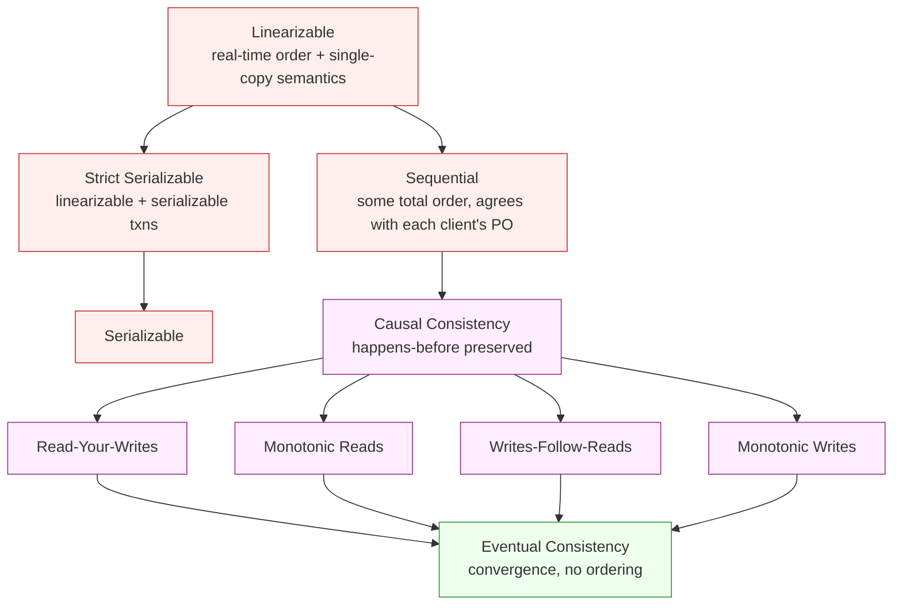
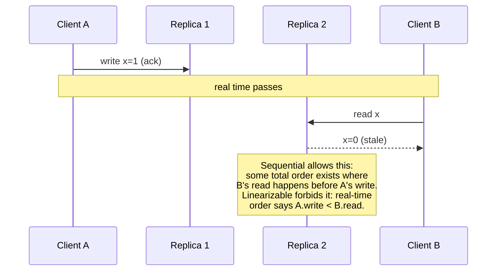
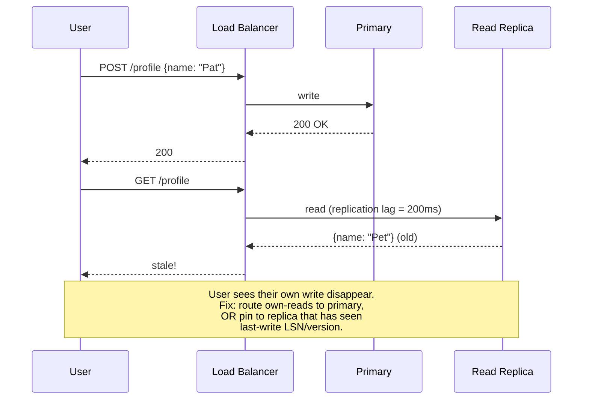

# Consistency Models

## Why This Exists

**Problem.** Distributed systems replicate data for availability, throughput, and latency. The moment you have more than one copy, clients can observe states that disagree. Without a precise vocabulary you end up with bug reports like *"the dashboard is wrong sometimes"* and architecture decisions made by vibes — *"let's use strong consistency"* — that cost you a 10x latency budget you didn't need to spend.

**Key insight.** Consistency is a **contract between the storage system and the client about what executions are observable**. Stronger contracts forbid more anomalies but cost more (latency, availability under partition, coordination). The trick is matching the contract to the *actual invariant the application needs*, not to a generic feeling of "safer is better."

**Reach for this when:**
- You're picking a database, queue, or cache and the docs say "eventual consistency" / "read-your-writes" / "strong consistency" and you need to know what that actually buys you.
- A bug report says data "disappeared" or "came back from the dead" after a write.
- You're designing multi-region replication and weighing latency vs anomalies.
- You need to explain to a PM why "just make it consistent" costs 100ms per request.
- You're writing Jepsen-style tests or interpreting Jepsen reports for vendor claims.

**Don't reach for this when:**
- The system is single-node, single-process, single-threaded — you have linearizability for free.
- The problem is *isolation* (concurrent transactions) not *consistency* (replica divergence). They overlap but are different axes — see DDIA ch. 7 vs ch. 9.
- You haven't yet defined the invariant. Pick the invariant first, then the model.

## Diagrams

### The hierarchy (Aphyr / Bailis)



Read top-to-bottom as "implies." Linearizability implies sequential implies causal implies all the session guarantees implies eventual. The interesting band for most apps is **causal + session guarantees**: cheap enough to deploy globally, strong enough to avoid almost all user-visible anomalies.

### Anomaly that linearizability prevents but sequential doesn't



### Read-your-writes failure



## Formal definitions, plainly

### Linearizability (Herlihy & Wing, 1990)

Every operation appears to take effect **atomically at some single point between its invocation and response**, and that point respects **real-time order**: if op A finishes before op B starts (wall clock), then A's effect is visible to B.

Concretely: there exists a sequential history `H'` equivalent to the actual concurrent history `H` such that
1. `H'` is a legal sequential execution of the object (e.g. a register), and
2. If `op_A` returns before `op_B` is invoked in real time, then `op_A` precedes `op_B` in `H'`.

This is the "single-machine illusion." It's what `etcd`, `ZooKeeper`, Spanner reads with `read_timestamp >= TT.now().latest`, and a Raft leader's linearizable reads provide.

### Sequential consistency (Lamport, 1979)

There exists *some* total order over operations that is consistent with each client's program order. **Real time doesn't matter** — only per-client order. Two clients that never communicate can see writes in opposite orders, as long as each client's own operations stay in order.

Almost no modern distributed database advertises sequential without also being linearizable; it's mostly a memory-model concept (Java `volatile` was sequential before JSR-133 strengthened it).

### Causal consistency (Ahamad et al., 1995; Lloyd et al. COPS, SOSP 2011)

If operation A *causally precedes* B (A happens-before B in Lamport's sense — same client's later op, or B reads A's write), every replica sees A before B. **Concurrent operations can be seen in any order.**

This is the strongest model achievable under network partitions while remaining available (the *CAP-available* + *high availability* threshold from Mahajan et al.; see also Bailis et al. "Bolt-on Causal Consistency" SIGMOD 2013).

### Session / client-centric guarantees (Terry et al., Bayou, 1994)

Four guarantees, each useful alone:
- **Read-your-writes (RYW):** after you write, your subsequent reads see that write or newer.
- **Monotonic reads (MR):** if you read v=5, you never later read v=3.
- **Monotonic writes (MW):** your writes are applied in the order you issued them.
- **Writes-follow-reads (WFR):** if you read v=5 then write v=6, every replica that sees v=6 has already seen v=5.

These are *session* properties, scoped to a single client. They can be implemented by sticky-routing the client to one replica, by carrying a vector / LSN cookie, or by waiting for the replica to catch up before serving.

### Eventual consistency

If writes stop, all replicas converge to the same state. **No ordering or recency guarantee.** "Eventual" can mean microseconds (Dynamo under low load) or hours (cross-region S3 historically, before strong read-after-write in Dec 2020). Useful only when the application can tolerate any intermediate state — which usually requires CRDTs or commutative ops, otherwise you ship bugs.

### Strict serializability

Linearizable for single-key ops AND serializable for multi-key transactions. Spanner external consistency, CockroachDB SERIALIZABLE, FoundationDB. The gold standard; pay for it only where multi-key invariants demand it.

## Code: testing each guarantee

The patterns below are realistic skeletons — not full Jepsen tests, but the shape of what those tests do. Run them as soak tests against staging.

### Read-your-writes probe (Python)

```python
# tests/consistency/ryw_probe.py
import time, uuid, statistics, requests

def probe(base_url: str, n: int = 1000) -> dict:
    """
    Detects RYW violations: write a unique value, immediately read it back
    via the *same* client identity, see if we get our own write.
    """
    violations = 0
    lags = []
    for _ in range(n):
        key = f"ryw-{uuid.uuid4()}"
        val = str(uuid.uuid4())
        # Same session/connection -> sticky load balancing must hold.
        s = requests.Session()
        s.headers["X-Session-Id"] = key

        t0 = time.monotonic()
        r = s.put(f"{base_url}/kv/{key}", json={"value": val})
        r.raise_for_status()

        # No sleep on purpose: RYW must hold even at zero think-time.
        got = s.get(f"{base_url}/kv/{key}").json()
        t1 = time.monotonic()

        if got.get("value") != val:
            violations += 1
            # Keep polling to measure lag-to-convergence.
            while got.get("value") != val and time.monotonic() - t0 < 5:
                time.sleep(0.01)
                got = s.get(f"{base_url}/kv/{key}").json()
            lags.append(time.monotonic() - t0)

    return {
        "n": n,
        "violations": violations,
        "violation_rate": violations / n,
        "p50_recovery_ms": 1000 * statistics.median(lags) if lags else 0,
        "p99_recovery_ms": 1000 * statistics.quantiles(lags, n=100)[98] if len(lags) > 99 else 0,
    }
```

A passing system reports `violation_rate == 0`. A "RYW-eventually" system (most read-replica setups without sticky routing) reports a small but nonzero rate plus a recovery distribution.

### Monotonic-reads check

```python
def monotonic_reads(base_url: str, key: str, n_writers: int = 4, duration_s: int = 30):
    """
    Single reader watches a key while writers increment it.
    Records every value seen; any decrease is a monotonic-reads violation.
    """
    import threading
    stop = threading.Event()

    def writer(idx: int):
        v = idx
        while not stop.is_set():
            requests.put(f"{base_url}/kv/{key}", json={"value": v})
            v += n_writers  # ensure strict increase across writers

    threads = [threading.Thread(target=writer, args=(i,), daemon=True) for i in range(n_writers)]
    for t in threads: t.start()

    seen = []
    deadline = time.time() + duration_s
    s = requests.Session()  # same session = should pin to one replica
    while time.time() < deadline:
        v = s.get(f"{base_url}/kv/{key}").json().get("value", 0)
        seen.append(v)

    stop.set()
    for t in threads: t.join(timeout=2)

    violations = [(seen[i-1], seen[i]) for i in range(1, len(seen)) if seen[i] < seen[i-1]]
    return {"reads": len(seen), "violations": len(violations), "examples": violations[:5]}
```

### Linearizability — Jepsen-style with Knossos

True linearizability checking is NP-hard in general. The standard technique is **Jepsen + Knossos / Elle**: record a history of operations with start/end timestamps and concurrent invocations, then search for a serialization that satisfies the spec.

```clojure
;; Sketch of a Jepsen test definition (Clojure).
;; Real tests live in github.com/jepsen-io/jepsen.
(defn register-test [opts]
  (assoc tests/noop-test
         :name      "linearizable-register"
         :client    (->Client {:base-url (:url opts)})
         :checker   (checker/linearizable
                      {:model (model/cas-register 0)
                       :algorithm :linear})  ;; Knossos
         :generator (->> (gen/mix [r w cas])
                         (gen/stagger 1/50)
                         (gen/nemesis (cycle [(gen/sleep 5)
                                              {:type :info :f :start}
                                              (gen/sleep 5)
                                              {:type :info :f :stop}]))
                         (gen/time-limit 60))
         :nemesis   (nemesis/partition-random-halves)))
```

Don't roll your own linearizability checker. Use **Elle** (Kingsbury 2020) for transactional histories — it can detect serializability and snapshot-isolation violations on real workloads cheaply by checking dependency cycles.

### Causal consistency via vector clocks

```go
// Minimal vector-clock-based causal store. Production systems use
// version vectors (one entry per replica, not per client) for compactness.
package causal

type VClock map[string]uint64

func (a VClock) Happens(b VClock) bool {
    leq := true
    lt := false
    for k, va := range a {
        vb := b[k]
        if va > vb { leq = false }
        if va < vb { lt = true }
    }
    for k, vb := range b {
        if _, ok := a[k]; !ok && vb > 0 { lt = true }
    }
    return leq && lt
}

type Update struct {
    Key   string
    Value []byte
    VC    VClock      // dependencies: all updates we causally depend on
}

// Replica must hold an update in a *pending* queue until every dep has been applied.
func (r *Replica) Apply(u Update) {
    for k, depV := range u.VC {
        if r.applied[k] < depV && k != r.id {
            r.pending = append(r.pending, u) // can't apply yet; missing causal deps
            return
        }
    }
    r.store[u.Key] = u.Value
    r.applied[r.id]++
    r.drainPending()
}
```

This is the COPS/Eiger/Bayou approach. Trade-off: metadata grows with the number of writers and operations; production systems compress with **dependency clocks** (one timestamp per partition, not per write).

### Read-your-writes via LSN tokens

```typescript
// PostgreSQL: clients pass the WAL LSN of their last write; the read replica
// blocks (or returns stale) until it has caught up. This is the "bounded staleness"
// pattern — most cloud DBs expose it.
import { Pool } from "pg";

class ReadYourWritesPool {
  constructor(private primary: Pool, private replicas: Pool[]) {}

  async write(sql: string, params: unknown[]): Promise<{ lsn: string }> {
    const c = await this.primary.connect();
    try {
      await c.query("BEGIN");
      await c.query(sql, params);
      const { rows } = await c.query("SELECT pg_current_wal_lsn() AS lsn");
      await c.query("COMMIT");
      return { lsn: rows[0].lsn };
    } finally { c.release(); }
  }

  async read<T>(sql: string, params: unknown[], minLsn?: string): Promise<T[]> {
    const r = this.replicas[Math.floor(Math.random() * this.replicas.length)];
    if (minLsn) {
      // Block until replica has applied >= minLsn. In practice cap with a timeout
      // and fall back to primary on timeout to bound tail latency.
      const start = Date.now();
      while (Date.now() - start < 200) {
        const { rows } = await r.query(
          "SELECT pg_last_wal_replay_lsn() >= $1::pg_lsn AS caught_up", [minLsn]);
        if (rows[0].caught_up) break;
        await new Promise(res => setTimeout(res, 5));
      }
      if (Date.now() - start >= 200) {
        return (await this.primary.query(sql, params)).rows as T[];
      }
    }
    return (await r.query(sql, params)).rows as T[];
  }
}
```

Pattern: **the client carries a token** representing "my latest causal frontier." The system checks the token before serving a stale read. This is how Spanner exposes `read_timestamp`, how Cosmos DB exposes the session token, how DynamoDB strongly-consistent reads work (route to leader), and how Cassandra `LOCAL_QUORUM` plus same-session pinning approximate it.

## What real systems actually offer

| System | Default | Strongest available | Notes |
|---|---|---|---|
| PostgreSQL (single primary) | linearizable on primary | strict serializable (`SERIALIZABLE` + sync replica) | Read replicas are async → eventual unless you carry LSN |
| MySQL InnoDB | RR isolation, single primary | serializable | Same caveat for replicas |
| Spanner | strict serializable (`bounded staleness` opt-in for cheap reads) | strict serializable | TrueTime gives external consistency globally |
| CockroachDB | strict serializable | strict serializable | HLC + transaction protocol |
| FoundationDB | strict serializable | strict serializable | 5-phase commit, deterministic simulation testing |
| DynamoDB | eventual reads (default) | linearizable per-key (`ConsistentRead`), serializable txns (`TransactWriteItems`) | Cross-region tables are eventual |
| Cassandra | tunable per-op (`ONE` / `QUORUM` / `ALL`) | `QUORUM` reads + `QUORUM` writes ≈ linearizable per-key, but no LWT-free txns | LWT (Paxos) for compare-and-set |
| MongoDB | "majority" read/write concern available | linearizable (`readConcern: linearizable`) | Costs an extra round-trip; rarely needed |
| Cosmos DB | session (per-client RYW) | strong (linearizable) | Five named levels — strong, bounded-staleness, session, consistent-prefix, eventual |
| etcd / ZooKeeper | linearizable | linearizable | Raft / Zab; serial reads opt-in for perf |
| Riak | eventual + CRDTs | "strong buckets" via Paxos (deprecated) | Designed AP from day one |
| Kafka | per-partition total order | per-partition total order; idempotent + transactional producer for EOS | Cross-partition: no ordering |
| Redis (single primary) | linearizable on primary | linearizable | Replication is async; failover loses writes |
| Redis Cluster | per-slot linearizable on primary | same | No cross-slot transactions |
| S3 (post-Dec 2020) | strong read-after-write for new objects | strong read-after-write | Old behavior was eventual on overwrite |

When a vendor says "strongly consistent" without qualification, ask: *across keys? across regions? under partition? for reads-from-followers?* Almost every claim has a footnote.

## Isolation vs Consistency — the cross-axis

DDIA ch. 7 (Transactions) and ch. 9 (Consistency & Consensus) live next to each other for a reason. They're orthogonal:

- **Consistency** = recency / order of *single* objects across replicas. (CAP "C" in Brewer's sense.)
- **Isolation** = how concurrent *multi-object transactions* appear to interleave on one logical copy. (ACID "I".)

A system can be:
- **Eventually consistent + serializable** — single-replica with async followers, txns are serializable on the primary; replicas are stale. (Postgres + async streaming.)
- **Linearizable + read-committed** — etcd-style KV: every op is linearizable, but no multi-key txn isolation beyond CAS.
- **Strict serializable** — both axes maxed: Spanner, CockroachDB, FoundationDB.

Adya's PhD (1999) gives the rigorous taxonomy: PL-1 (read uncommitted), PL-2 (read committed), PL-2.99 (snapshot isolation), PL-3 (serializable), and adds **PL-SS (strict serializable)** = serializable + linearizable. **Snapshot isolation is *not* serializable** (write skew anomaly) — DDIA ch. 7 has the doctor on-call example.

## Trade-offs

| Benefit | Cost |
|---|---|
| Linearizable: simple to reason about, single-machine illusion | Cannot be both available and partition-tolerant (CAP); needs leader → 1 RTT minimum, often 2; cross-region = WAN latency |
| Strict serializable: multi-key invariants safe, easy app code | Requires global timestamp service (TrueTime / HLC) or 2PC; commit latency ≥ slowest participant |
| Causal: high availability under partition, no anomalies users notice | Metadata overhead (vector clocks); complex implementation; convergence requires conflict resolution (CRDTs or LWW) |
| Read-your-writes only: cheap, fixes 80% of user-visible bugs | Doesn't help cross-user causality (User A posts, User B doesn't see it) |
| Eventual: lowest latency, highest availability, easy to scale | Application must tolerate any intermediate state; bug-prone unless ops are commutative; "lost update" is the default |
| Tunable consistency (Cassandra, Cosmos): right-tool-per-op | Each call site is a decision; easy to mis-tune; emergent behavior across mixed levels is hard to predict |
| Session guarantees via sticky routing | Loses load-balancing flexibility; replica failure forces session migration with token reconciliation |
| Strong consistency in multi-region | Latency floor = speed-of-light RTT; SF↔Frankfurt ≈ 150ms one-way → no sub-100ms p99 writes |

## Common Pitfalls

- **"Strongly consistent reads" on followers without LSN tokens.** Async replication is async. Marketing the option doesn't change physics. Either route to leader or pass a token. Otherwise users hit RYW violations directly after their own writes — the #1 cause of "the UI didn't update" bugs.
- **Confusing read-after-write within a session with cross-session causal.** Cosmos DB "session" consistency only protects *one* client. If User A posts a comment and User B reads the thread, User B can miss it. You need *causal* (or stronger) for multi-user threads.
- **Assuming Kafka gives global order.** It gives *per-partition* order. Cross-partition events have no defined order. If you need a global timeline, partition by tenant and accept the throughput ceiling, or build a sequencer.
- **Snapshot isolation ≠ serializable.** Two doctors both go off-call simultaneously, each transaction reads "two doctors on call → I can leave," both commit. PostgreSQL `REPEATABLE READ` is snapshot — write-skew possible. Use `SERIALIZABLE` (SSI) for invariants that span rows.
- **CAP misuse.** "AP" doesn't mean "good under partition" — it means *available* under partition. Most "AP" systems still surrender either correctness (eventual, with anomalies) or progress (writes blocked) for parts of the cluster. Read Kleppmann's "A Critique of the CAP Theorem" (2015).
- **PACELC ignored.** CAP is about partitions; **PACELC** (Abadi 2012) adds: *else* (no partition), trade Latency vs Consistency. Spanner picks C in P+L; Dynamo picks A+L. Most architectural decisions live in the "else" branch, not the rare-partition branch.
- **Lost updates from naive last-write-wins.** Two clients update the same row; LWW keeps one, drops the other silently. Use CAS / version columns / OCC / CRDTs. The classic shopping-cart-items-reappear bug (Dynamo paper §6.3) is LWW eating deletes.
- **Linearizable reads "for safety."** They cost a leader round-trip (or quorum-read in some implementations). If your invariant is "user sees recent-ish data," bounded-staleness is 10x cheaper. Measure before you pay.
- **Time-based reasoning across replicas.** NTP drifts seconds. Don't compare wall clocks across nodes for ordering. Use HLCs or version vectors. (The Spanner answer: TrueTime + commit-wait — *uncertainty-aware* clocks.)
- **Ignoring the staleness distribution.** "Eventually consistent" is a worst-case label. The *interesting* metric is p50/p99 staleness in seconds. Bailis "PBS — Probabilistic Bounded Staleness" gives the math; your monitoring should expose it.
- **Mixing consistency levels in one workflow.** Quorum-write + ONE-read in Cassandra silently breaks linearizability. Pick a coherent profile per logical operation.
- **Treating queues as databases.** "I'll just write to Kafka" gives you durability and per-partition order, not transactional consistency with your DB. Use the **outbox pattern** to bridge them.

## Decision Table

| Need | Pick | Reason |
|---|---|---|
| Bank account balance, idempotent transfer | Strict serializable (Spanner/CockroachDB/Postgres single-primary with SERIALIZABLE) | Multi-row invariant; you cannot afford lost updates or write skew |
| User profile, posts, comments | Read-your-writes + causal | RYW for "I see my edit," causal for "thread order makes sense"; eventual is enough for everything else |
| Shopping cart | Causal + CRDT (G-Set or OR-Set) | Add/remove must be commutative; Dynamo paper §6.3 |
| Distributed lock / leader election | Linearizable | etcd / ZooKeeper / Consul; anything weaker is unsafe |
| Configuration / feature flags | Linearizable for writes, bounded-staleness reads | Reads dominate; a few seconds of stale flag is fine, but writers must agree |
| Analytics dashboard | Eventual / bounded-staleness | Recency tolerance is minutes; cost-per-op dominates |
| Session state | Sticky to one replica → linearizable per session | RYW + monotonic reads achievable cheaply |
| Cross-region multi-master writes | Causal + CRDTs, OR strict serializable with TrueTime | Don't try to invent a third option |
| Event log for downstream consumers | Per-partition total order (Kafka) + idempotent consumer | Global order is rarely needed; idempotency handles retries |
| Cache | Eventual + TTL + write-through invalidation | Don't try to make a cache linearizable; you'll just rebuild the database |
| Search index (Elasticsearch) | Eventual, with bounded-staleness SLO | Refresh interval is the staleness floor; design queries to tolerate it |
| Audit log | Append-only + monotonic | Use sequence numbers; never rely on wall clock for ordering |

## References

Primary sources, ordered roughly from foundational to practical:

- Kleppmann, M. — *Designing Data-Intensive Applications*, ch. 5 (Replication), ch. 7 (Transactions), ch. 9 (Consistency and Consensus). O'Reilly 2017. — https://dataintensive.net/
- Kleppmann, M. — *A Critique of the CAP Theorem* — https://arxiv.org/abs/1509.05393
- Herlihy, M. & Wing, J. — *Linearizability: A Correctness Condition for Concurrent Objects* (TOPLAS 1990) — https://dl.acm.org/doi/10.1145/78969.78972
- Lamport, L. — *How to Make a Multiprocessor Computer that Correctly Executes Multiprocess Programs* (1979, sequential consistency) — https://lamport.azurewebsites.net/pubs/multi.pdf
- Lamport, L. — *Time, Clocks, and the Ordering of Events in a Distributed System* (CACM 1978) — https://lamport.azurewebsites.net/pubs/time-clocks.pdf
- Terry, D. et al. — *Session Guarantees for Weakly Consistent Replicated Data* (Bayou, 1994) — https://www.cs.utexas.edu/users/dahlin/Classes/GradOS/papers/SessionGuaranteesPDIS94.pdf
- Lloyd, W. et al. — *Don't Settle for Eventual: Scalable Causal Consistency for Wide-Area Storage with COPS* (SOSP 2011) — https://www.cs.cmu.edu/~dga/papers/cops-sosp2011.pdf
- Bailis, P. et al. — *Bolt-on Causal Consistency* (SIGMOD 2013) — http://www.bailis.org/papers/bolton-sigmod2013.pdf
- Bailis, P. et al. — *Probabilistically Bounded Staleness for Practical Partial Quorums* (VLDB 2012) — http://www.bailis.org/papers/pbs-vldb2012.pdf
- Adya, A. — *Weak Consistency: A Generalized Theory and Optimistic Implementations for Distributed Transactions* (MIT PhD thesis 1999) — https://pmg.csail.mit.edu/papers/adya-phd.pdf
- Abadi, D. — *Consistency Tradeoffs in Modern Distributed Database System Design* (PACELC, IEEE Computer 2012) — https://www.cs.umd.edu/~abadi/papers/abadi-pacelc.pdf
- DeCandia, G. et al. — *Dynamo: Amazon's Highly Available Key-value Store* (SOSP 2007) — https://www.allthingsdistributed.com/files/amazon-dynamo-sosp2007.pdf
- Corbett, J. et al. — *Spanner: Google's Globally-Distributed Database* (OSDI 2012) — https://research.google/pubs/pub39966/
- Brewer, E. — *CAP Twelve Years Later: How the "Rules" Have Changed* (IEEE Computer 2012) — https://www.infoq.com/articles/cap-twelve-years-later-how-the-rules-have-changed/
- Kingsbury, K. (Aphyr) — *Jepsen analyses* — https://jepsen.io/analyses (read at minimum the MongoDB, Cassandra, etcd, FaunaDB, and CockroachDB reports)
- Kingsbury, K. — *Strong consistency models* (the canonical hierarchy diagram) — https://jepsen.io/consistency
- Kingsbury, K. & Alvaro, P. — *Elle: Inferring Isolation Anomalies from Experimental Observations* (VLDB 2020) — https://arxiv.org/abs/2003.10554
- Helland, P. — *Life Beyond Distributed Transactions* (CIDR 2007) — https://queue.acm.org/detail.cfm?id=3025012
- Helland, P. — *Immutability Changes Everything* — https://queue.acm.org/detail.cfm?id=2884038
- Vogels, W. — *Eventually Consistent* (CACM 2009) — https://www.allthingsdistributed.com/2008/12/eventually_consistent.html
- AWS Builders' Library — *Challenges with distributed systems* (Marc Brooker) — https://aws.amazon.com/builders-library/challenges-with-distributed-systems/
- Google SRE Book — ch. 23 *Managing Critical State: Distributed Consensus for Reliability* — https://sre.google/sre-book/managing-critical-state/
- Cosmos DB consistency levels — https://learn.microsoft.com/en-us/azure/cosmos-db/consistency-levels
- DynamoDB read consistency — https://docs.aws.amazon.com/amazondynamodb/latest/developerguide/HowItWorks.ReadConsistency.html
- Spanner external consistency — https://cloud.google.com/spanner/docs/true-time-external-consistency
- Shapiro, M. et al. — *Conflict-free Replicated Data Types* (CRDTs, INRIA 2011) — https://hal.inria.fr/inria-00609399v1/document

## See Also

- `../replication/` — leader/follower, multi-leader, leaderless; the mechanism that produces (or prevents) the anomalies above
- `../consensus/` — Raft, Paxos, Zab — how linearizability is actually built
- `../crdts/` — the practical answer when you pick eventual + want correctness
- `../cap-pacelc/` — the framing arguments around partition, latency, and consistency
- `../../architecture-patterns/event-sourcing/` — how immutability sidesteps many consistency questions
- `../outbox/` — bridging a transactional DB to an eventually-consistent stream
- `../../communication/idempotency/` — what you need at the edge when the middle is eventually consistent
