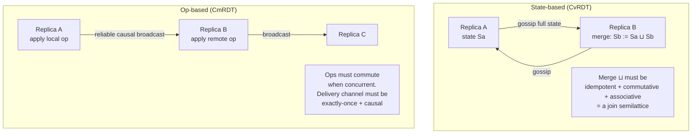
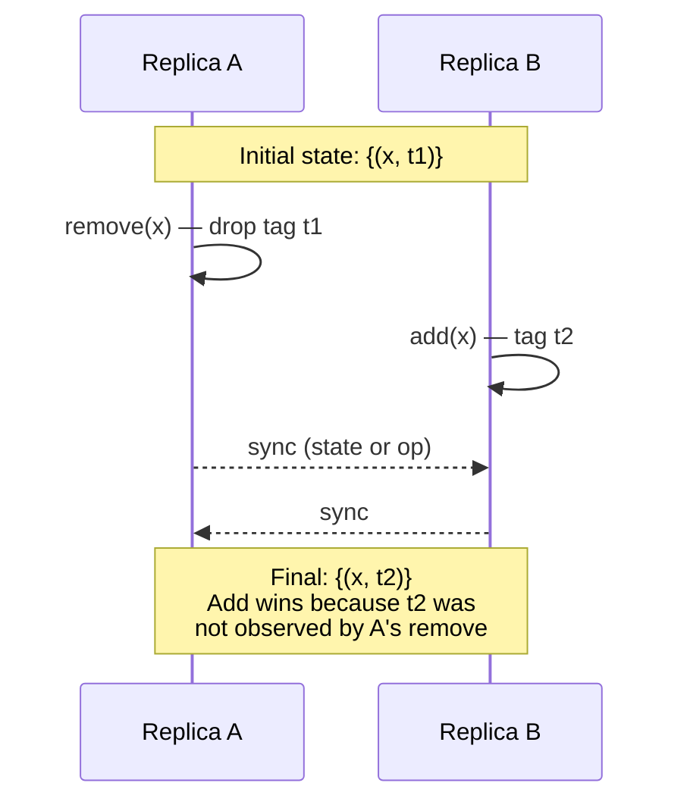
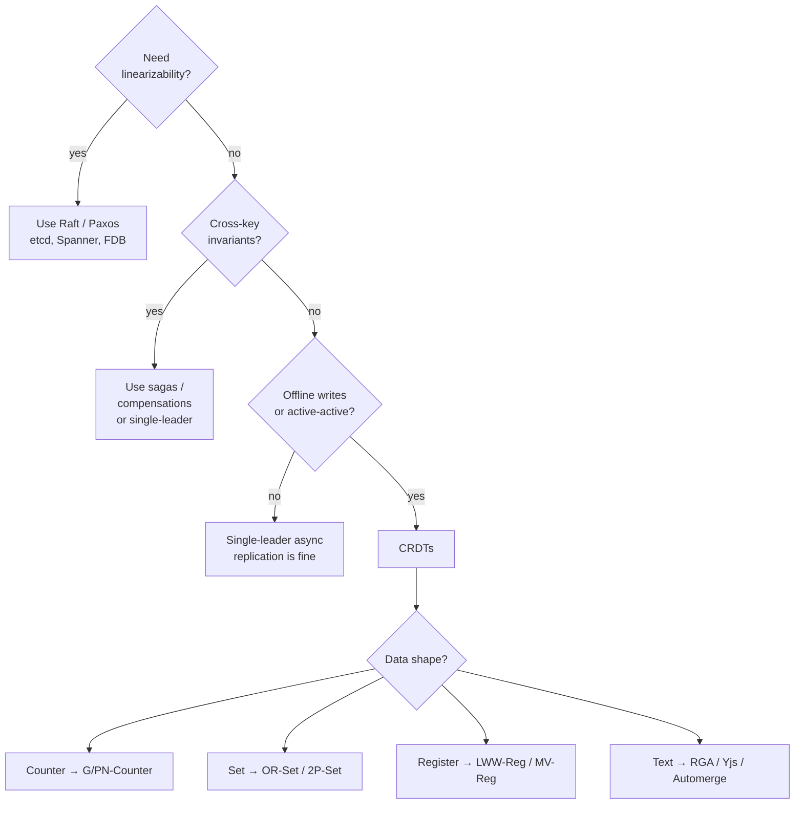

# CRDTs (Conflict-Free Replicated Data Types)

## Why This Exists

**Problem.** You have multiple replicas — multi-region databases, mobile clients that go offline, a collaborative editor with five cursors. They each accept writes. The network partitions, heals, and now you must merge. The naive answers all fail at scale:

- **Last-write-wins (LWW) on wall-clock time** — silently drops concurrent writes; clock skew makes it worse. Cassandra tombstones, S3 eventual consistency, DynamoDB last-writer all bite users this way.
- **Quorum + leader election** — buys you linearizability but costs you availability under partition (CAP). Not viable for offline-first.
- **"Just resolve conflicts in the app"** — pushes a distributed-systems problem onto product engineers. Slack, Notion, Trello, and every "shopping cart goes wrong" story started here.

**Key insight.** If every replica's merge function is **commutative, associative, and idempotent**, then *any* delivery order produces the same final state. No coordinator. No conflicts. This is **strong eventual consistency** (SEC): replicas that have received the same updates — in any order, with any duplicates — converge to the same value. Shapiro, Preguiça, Baquero, and Zawirski formalized this in 2011 and gave us a zoo of data types that satisfy it.

**Reach for this when:**
- **Offline-first** mobile/desktop apps where the user expects local writes to survive a 4-hour airplane ride.
- **Collaborative editing** (text, spreadsheets, whiteboards, Figma-style canvases) where every keystroke is a write.
- **Multi-region active-active** databases where you want writes in every region without paying cross-region latency on the write path (Riak, Redis Enterprise CRDB, Azure Cosmos with custom merge).
- **Edge / IoT** with intermittent connectivity and aggregation (counters, presence, sets).
- **Shopping carts, like buttons, view counters, presence indicators** — the canonical Riak use cases.

**Don't reach for this when:**
- You need **linearizable reads** (banking ledger, unique-username assignment, stock-level "do not oversell"). Use Paxos/Raft (etcd, Spanner, FoundationDB).
- The data has **invariants that span values** ("balance ≥ 0", "exactly 100 seats"). CRDTs converge but they don't enforce cross-key invariants — you'll converge to a state that violates your invariant.
- **Schemas change frequently**. CRDT structures are sticky; migrating an OR-Set to a different conflict semantic mid-flight is hard.
- You're tempted because "conflicts are scary" — most CRUD systems are fine with single-leader replication and don't need this complexity.

## Diagrams

### State-based (CvRDT) vs Op-based (CmRDT)



### Concurrent edits in an OR-Set (add-wins)



### When CRDTs vs Consensus



## Core Content

### 1. The math, in two paragraphs

A **state-based CRDT** (CvRDT) is a tuple `(S, ⊔, ⊥)` where `S` is the state space, `⊥` is the initial state, and `⊔` (merge / join) is **idempotent**, **commutative**, and **associative**. That makes `(S, ⊔)` a *join semilattice*. Local updates monotonically advance the state in the lattice; merging two states gives the least upper bound. Because joins are idempotent, you can re-deliver state forever; because they commute, network reordering is free; because they're associative, three-way merges work.

An **op-based CRDT** (CmRDT) ships *operations* over a *reliable causal broadcast* channel (each op delivered exactly once, in causal order to every replica). The operations only need to commute *when they are concurrent* — i.e. neither happened-before the other. Op-based wins on bandwidth (small ops vs. whole state) but requires a much harder transport.

In practice you choose state-based when the network is unreliable and replicas come and go (mobile, IoT). You choose op-based when you have a stable cluster and bandwidth matters (Yjs is essentially op-based with deltas).

### 2. The canonical types

#### G-Counter (grow-only counter)

```python
# State: Dict[ReplicaId, int]  — vector of per-replica increments
class GCounter:
    def __init__(self, replica_id: str):
        self.id = replica_id
        self.counts: dict[str, int] = {}

    def increment(self, n: int = 1):
        # WHY: each replica only ever writes its own slot. No conflicts possible.
        assert n >= 0, "G-Counter is grow-only; use PN-Counter for decrement"
        self.counts[self.id] = self.counts.get(self.id, 0) + n

    def value(self) -> int:
        return sum(self.counts.values())

    def merge(self, other: "GCounter") -> "GCounter":
        merged = GCounter(self.id)
        keys = set(self.counts) | set(other.counts)
        # WHY: max() per replica is idempotent + commutative + associative.
        merged.counts = {k: max(self.counts.get(k, 0), other.counts.get(k, 0)) for k in keys}
        return merged
```

Use for: page views, likes, "X people are typing", any monotonically-growing aggregate.

#### PN-Counter (positive-negative)

Two G-Counters: `P` for increments, `N` for decrements. `value() = sum(P) − sum(N)`. Merge is component-wise max on each. Lets you decrement while keeping the lattice property.

**Pitfall**: PN-Counter can go negative even if your app never decrements below zero on any replica, because two replicas can both decrement concurrently. CRDTs don't enforce non-negative.

#### G-Set, 2P-Set, OR-Set

- **G-Set** — grow-only set; merge is union. Trivially correct, but you can't remove.
- **2P-Set** — two G-Sets, `A` for added and `R` for removed. Element ∈ set iff in `A` and not in `R`. Once removed, an element cannot be re-added (tombstone forever).
- **OR-Set (Observed-Remove Set)** — the workhorse. Each `add(x)` tags the element with a unique id. `remove(x)` removes only the tags currently observed. Concurrent add+remove → **add wins**, which matches user intent ("I just added it, why did it disappear?").

```typescript
type Tag = string; // unique per add; e.g. (replicaId, lamportClock)

class ORSet<T> {
  // element -> set of live tags
  private elements = new Map<T, Set<Tag>>();
  // tombstones: tags that were removed
  private tombstones = new Set<Tag>();

  add(value: T, replicaId: string, clock: number) {
    const tag: Tag = `${replicaId}:${clock}`;
    if (!this.elements.has(value)) this.elements.set(value, new Set());
    this.elements.get(value)!.add(tag);
  }

  remove(value: T) {
    // WHY: only kill the tags I have observed. Concurrent add on another
    // replica has a tag I haven't seen → it survives → add-wins.
    const tags = this.elements.get(value);
    if (!tags) return;
    for (const t of tags) this.tombstones.add(t);
    this.elements.delete(value);
  }

  has(value: T): boolean {
    const tags = this.elements.get(value);
    if (!tags) return false;
    for (const t of tags) if (!this.tombstones.has(t)) return true;
    return false;
  }

  merge(other: ORSet<T>) {
    // union of live tags, then subtract union of tombstones
    for (const [v, ts] of other.elements) {
      const mine = this.elements.get(v) ?? new Set();
      for (const t of ts) mine.add(t);
      this.elements.set(v, mine);
    }
    for (const t of other.tombstones) this.tombstones.add(t);
    // GC: remove any element whose live tags are all tombstoned
    for (const [v, ts] of this.elements) {
      const live = [...ts].filter((t) => !this.tombstones.has(t));
      if (live.length === 0) this.elements.delete(v);
      else this.elements.set(v, new Set(live));
    }
  }
}
```

**War story.** Riak's first set CRDT was a 2P-Set. Customers complained: "I removed an item from my cart, then re-added it, and on reconnect it stayed gone forever." The OR-Set replaced it. Bieniusa et al. ("An optimized conflict-free replicated set", 2012) and Shapiro's tech report walk through every variant.

#### LWW-Element-Set / LWW-Register

Each element carries `(value, timestamp)`. Merge keeps the higher timestamp (ties broken by replica id). **Use only when you genuinely don't care about lost concurrent updates** — a presence beacon, a "last seen" pointer. Don't use for shopping carts or anything users care about.

#### MV-Register (multi-value)

Returns a *set* of concurrent values when there's a conflict (Dynamo-style siblings). Pushes resolution to the application. DynamoDB and early Riak do this.

#### RGA / Logoot / Treedoc / YATA — sequence CRDTs for text

The hard one. You want `insert(pos, char)` on a string where two users typing concurrently at "the same position" both end up in the document, in a deterministic order, on every replica.

- **RGA (Replicated Growable Array, Roh et al. 2011)** — each character has a unique id and a "previous" pointer; tombstones for deletes. Linear-ish memory in document length + history.
- **Treedoc** — characters live in a binary tree; concurrent inserts at the same position go left/right by replica id. Path encodes position. Needs occasional rebalancing.
- **Logoot / LSEQ** — dense identifier scheme; no tombstones for deletes (uses unique ids). Identifier sizes can grow.
- **YATA (used by Yjs)** — list with origin pointers (left and right); resolves concurrent inserts by replica id. Very fast in practice; benchmarks (Kleppmann's `crdt-benchmarks`) show Yjs beating Automerge by ~10–100× on large docs as of 2023.

#### Maps / nested CRDTs

- **OR-Map** — keys handled like an OR-Set, values are CRDTs themselves (recursive). Removing a key while concurrently updating its value is the painful case; "remove-wins" vs "update-wins" semantics differ. Riak uses *causal context* (a version vector) to track observed state per key.
- **JSON CRDTs** (Automerge, Yjs `Y.Map`/`Y.Array`) — nest maps, lists, and registers; each leaf has a CRDT type. Kleppmann & Beresford's "A Conflict-Free Replicated JSON Datatype" (2017) is the spec.

### 3. Production libraries

#### Yjs (TypeScript / WASM)

```typescript
import * as Y from "yjs";
import { WebsocketProvider } from "y-websocket";

const doc = new Y.Doc();
const provider = new WebsocketProvider("wss://sync.example.com", "room-42", doc);
const ytext = doc.getText("body");

// Local edit; broadcast as delta to all peers
ytext.insert(0, "Hello ");

// Observe remote edits
ytext.observe((event) => {
  // event.changes.delta is a Quill-compatible delta
  // WHY: Yjs ships small binary deltas (lib0 encoding), not full state.
  console.log("remote delta:", event.changes.delta);
});

// Awareness (cursors, selections) — ephemeral, NOT a CRDT, gossip only.
provider.awareness.setLocalStateField("cursor", { anchor: 5, head: 9 });
```

Yjs is op-based (delta updates over a reliable causal channel) but also supports state-based merge for catch-up. In production: use `y-websocket` or `y-webrtc` for sync, `y-indexeddb` for offline persistence. Used by Notion-likes, Tldraw, Jupyter RTC, BlockNote.

#### Automerge (Rust core, JS/Python/Go bindings)

```javascript
import * as Automerge from "@automerge/automerge";

let doc1 = Automerge.from({ tasks: [] });
// Each change captures a transaction with a Lamport-ordered id.
doc1 = Automerge.change(doc1, "add task", (d) => {
  d.tasks.push({ title: "ship CRDTs", done: false });
});

// Replica B sees a different change concurrently.
let doc2 = Automerge.clone(doc1);
doc2 = Automerge.change(doc2, "rename", (d) => { d.tasks[0].title = "ship Automerge"; });
doc1 = Automerge.change(doc1, "complete", (d) => { d.tasks[0].done = true; });

// Merge — both edits survive because they touched different fields.
const merged = Automerge.merge(doc1, doc2);
console.log(merged.tasks[0]); // { title: "ship Automerge", done: true }
```

Automerge stores the **full op history** by default, which makes time-travel and rich diffs free but bloats storage. Automerge 2.x added compressed columnar storage and incremental sync. Strong fit when you want "git for JSON".

#### Riak Data Types

Riak ships built-in CRDTs (`counter`, `set`, `map`, `register`, `flag`, `hll`). You wire a bucket type to a CRDT and the cluster handles convergence. Causal context (an opaque blob, basically a dotted version vector) is round-tripped on read/write so the server knows what state your client *observed*, enabling correct OR-Map remove semantics.

```bash
# Set up a bucket type for OR-Sets
riak-admin bucket-type create sets '{"props":{"datatype":"set"}}'
riak-admin bucket-type activate sets

# Add via HTTP
curl -X POST http://riak:8098/types/sets/buckets/cart/datatypes/user-42 \
  -H "Content-Type: application/json" \
  -d '{"add":"sku-123"}'
```

#### Redis CRDB / Redis Enterprise active-active

Redis Enterprise implements CRDTs over multi-master geo-replicated databases ("CRDBs"). Strings are LWW, counters are PN-Counters, sets/hashes are OR-Sets/OR-Maps. Caveat: it's the **Enterprise** product; OSS Redis is single-leader.

#### AntidoteDB, ElectricSQL, CRSQLite

- **AntidoteDB** — research-grade Erlang DB; transactional causal+ consistency over CRDTs (Shapiro et al.).
- **ElectricSQL** — Postgres ↔ SQLite sync with CRDTs under the hood; great for offline-first mobile + relational.
- **CR-SQLite (cr-sqlite)** — SQLite extension that turns tables into CRDTs (last-write-wins by default, with `CRR` causal lengths). Practical for embedded apps.

### 4. Implementation pitfalls (the part the papers gloss over)

#### Tombstones and garbage collection

OR-Sets and RGA accumulate tombstones forever unless you GC. Safe GC requires knowing every replica has seen the tombstone — that's a **stable** version vector. Common approaches:

1. **Periodic stability checkpoint.** Coordinator collects min version vector across replicas, prunes tombstones below it. Brings back a coordinator, but only on a slow path.
2. **Causal stability via heartbeats** (Akka DistributedData, Riak). Replicas advertise their clocks; tombstones older than the global min are removed.
3. **Bounded version vectors** — once a replica disappears for > T, declare it dead and proceed. Risk: a returning replica produces ghost adds.

#### Causal context and the "remove-wins on concurrent update" trap

Without causal context, a remove on replica A concurrent with an add+update on replica B can either lose the add (broken) or keep a half-formed value (broken differently). Always pass the causal context (version vector or dot-store) on every read, return it on every write.

#### Clock skew kills LWW

If you LWW on `Date.now()`, a phone with a 5-minute skew silently overwrites correct data. Use **Hybrid Logical Clocks** (Kulkarni et al. 2014) or **Lamport timestamps tagged with replica id**. NTP is necessary, not sufficient.

#### Identifier explosion in sequence CRDTs

Naive Logoot grows id sizes proportional to the *log* of insert positions; pathological "always insert at the front" workloads make ids huge. RGA and YATA bound id size at insert-time (one tuple per character) but pay tombstone cost for deletes. Profile your workload.

#### "CRDTs are conflict-free" ≠ "your app is conflict-free"

CRDTs eliminate *data structure* conflicts. They do not eliminate *semantic* conflicts. Two users editing the same calendar event to point at different rooms — both writes survive, the resulting state is "valid" but wrong. You still need product-level UI ("conflict detected, please choose").

#### Memory and CPU

Every replica holds enough metadata (tags, version vectors, op log) to converge with any future delivery. For a 1 MB JSON document with 10 years of edits, Automerge 1.x histories were sometimes 100 MB+. Automerge 2 and Yjs bring this down dramatically; benchmark before committing.

### 5. A realistic shopping-cart sketch

```python
# A shopping cart that survives offline edits across N devices.
# Cart = OR-Map[sku, PN-Counter[quantity]]
# Add-wins on item presence, summed quantities on counts.

@dataclass(frozen=True)
class Dot:
    replica: str
    seq: int

class Cart:
    def __init__(self, replica: str):
        self.replica = replica
        self.seq = 0
        # sku -> set of dots that "added" it
        self.items: dict[str, set[Dot]] = {}
        # sku -> PN-Counter
        self.qty: dict[str, PNCounter] = {}
        # tombstoned dots
        self.tombs: set[Dot] = set()

    def _next_dot(self) -> Dot:
        self.seq += 1
        return Dot(self.replica, self.seq)

    def add_item(self, sku: str, qty: int = 1):
        d = self._next_dot()
        self.items.setdefault(sku, set()).add(d)
        c = self.qty.setdefault(sku, PNCounter(self.replica))
        c.increment(qty)

    def remove_item(self, sku: str):
        # WHY: only tombstone dots we have OBSERVED. A concurrent add on
        # another device has a dot we don't know about → survives → add-wins.
        for d in self.items.get(sku, ()):
            self.tombs.add(d)
        self.items.pop(sku, None)
        # NOTE: we do NOT zero the PN-Counter. A concurrent +1 stays at +1.

    def visible(self) -> dict[str, int]:
        out = {}
        for sku, dots in self.items.items():
            live = [d for d in dots if d not in self.tombs]
            if live:
                out[sku] = self.qty[sku].value()
        return out

    def merge(self, other: "Cart"):
        for sku, dots in other.items.items():
            self.items.setdefault(sku, set()).update(dots)
        self.tombs |= other.tombs
        for sku, c in other.qty.items():
            self.qty.setdefault(sku, PNCounter(self.replica)).merge_in(c)
        # GC: drop SKUs whose dots are all tombstoned
        for sku in list(self.items):
            if all(d in self.tombs for d in self.items[sku]):
                del self.items[sku]
```

**Why not just LWW?** A user adds "milk" on their phone (offline), then removes "bread" on their laptop (online). When the phone reconnects: with LWW on the cart object, the phone overwrites the laptop's removal — bread reappears. With CRDTs, both edits survive.

## Trade-offs

| Benefit | Cost |
|---|---|
| **Strong eventual consistency** with no coordinator | Cannot enforce cross-key invariants ("balance ≥ 0", "exactly N seats") |
| Writes are always available (AP in CAP) | Reads may be stale; convergence is asynchronous |
| Offline writes survive arbitrary network outages | Local state size grows with history (tombstones, op logs) until GC |
| Add-wins / observed-remove matches user intent | Implementer must carry **causal context** on every operation |
| Op-based: tiny network deltas (Yjs ~bytes per keystroke) | Requires reliable, exactly-once, causal broadcast — hard to build |
| State-based: tolerates lossy/duplicating networks | Whole-state gossip wastes bandwidth at scale |
| Composable (CRDTs of CRDTs: OR-Map of PN-Counters) | Composition pitfalls: remove-vs-update on nested keys is subtle |
| RGA/Yjs gives Google-Docs UX without a central server | Sequence CRDTs accumulate tombstones; identifier schemes have pathological inputs |
| Time-travel and offline merge "for free" (Automerge) | History bloat — multi-MB docs can mean 100s of MB on disk |

## Common Pitfalls

- **"We'll just use timestamps"** — the LWW trap. Wall-clock skew, ties, vector clock confusion. Anything important loses data this way. Use HLC or proper causal context.
- **Forgetting causal context on the wire.** Riak and Akka both make you carry it; if your homegrown CRDT doesn't, your remove operations are wrong on concurrent updates.
- **Tombstone leak.** No GC plan → unbounded growth. After 18 months, cart documents are 50 MB. Build a stability checkpoint *before* you ship.
- **OR-Set add of the same value twice.** Each `add(x)` must produce a fresh tag; otherwise idempotency assumptions break and removes can over-delete.
- **Counter underflow.** PN-Counter can go negative; CRDT does not enforce ≥ 0. If you need the invariant, use a reservation pattern with consensus, not a CRDT.
- **Putting CRDTs behind a serialized WAL.** Some teams run a Kafka log of CRDT ops with a single consumer applying them. That works but throws away the *whole point* — you've reintroduced a single leader. Either commit to single-leader (simpler) or commit to multi-master CRDTs.
- **Merging CRDTs of different schema versions.** Adding a new field to an OR-Map between releases: old replicas drop the field, then a merge propagates the drop. Treat schema migrations as a coordination event.
- **Using LWW-Register for collaborative text.** Two users typing → only one survives. Use a sequence CRDT (RGA/Yjs).
- **Assuming "CRDTs scale forever".** Op-based CRDTs need reliable causal delivery; at 10k+ replicas that delivery infrastructure (e.g. epidemic broadcast, anti-entropy) is itself a hard system. Beyond ~hundreds of writers, partition into smaller CRDT shards.
- **Ignoring awareness vs document state.** Cursor/selection state should NOT be in the CRDT (would tombstone forever). Use ephemeral gossip (Yjs `Awareness`).
- **Letting the client trust replica ids.** A malicious client can mint dots from any replica id and forge history. Sign ops at the boundary or run an authoritative server (this is what Liveblocks, Linear, and Replicache do).

## Decision Table

| Situation | Pick | Why |
|---|---|---|
| Single-region OLTP with strong invariants ("balance ≥ 0") | **Single-leader (Postgres) or Raft (Spanner/CockroachDB)** | CRDTs cannot enforce cross-key invariants |
| Multi-region active-active KV with availability priority | **Riak / Cassandra+CRDT layer / Redis Enterprise CRDB** | Built-in CRDTs handle merge; tunable consistency |
| Offline-first mobile app, simple data | **Local SQLite + sync layer (PowerSync, ElectricSQL, CR-SQLite)** | Relational ergonomics + CRDT under the hood |
| Collaborative document editor (text/whiteboard) | **Yjs** (or Automerge if you want history) | Battle-tested, fast, ecosystem of providers |
| Need git-like history & branching of structured data | **Automerge** | Persists every op; explicit `merge()` & `clone()` |
| IoT / sensor aggregation across edge | **G-Counter, PN-Counter, HLL CRDT** | Cheap, monotone, lossy-network friendly |
| Distributed feature flag rollout state | **OR-Set or Flag CRDT in Riak** | Add/remove with last-write-wins on the flag value is fine |
| Counter that must never lose increments under partition | **PN-Counter** | Each replica owns its slot; merge is max |
| Counter that must never go negative | **NOT a CRDT** — use Raft or single-leader | CRDTs don't enforce non-negative invariants |
| Username uniqueness | **NOT a CRDT** — use consensus | Uniqueness is a cross-key invariant |
| Inventory ("don't oversell the last 5 seats") | **NOT a CRDT in the hot path** — reservations + consensus, or careful saga | Same as above |
| Set with re-addable elements & remove semantics | **OR-Set** | 2P-Set forbids re-add; LWW-Set drops concurrent ops |
| Single global "latest value" pointer (config flag) | **LWW-Register w/ HLC** | Simple, correct enough when concurrency is rare |
| Concurrent values must all be visible | **MV-Register** | Pushes resolution to app — Dynamo siblings model |

## References

- Shapiro, Preguiça, Baquero, Zawirski — *Conflict-Free Replicated Data Types* (INRIA TR 7687, 2011) — https://hal.inria.fr/inria-00609399v1/document
- Shapiro et al. — *A comprehensive study of Convergent and Commutative Replicated Data Types* (INRIA RR-7506, 2011) — https://hal.inria.fr/inria-00555588/document
- Bieniusa, Zawirski, Preguiça, Shapiro et al. — *An Optimized Conflict-free Replicated Set* — https://arxiv.org/abs/1210.3368
- Roh, Jeon, Kim, Lee — *Replicated Abstract Data Types: Building Blocks for Collaborative Applications (RGA)* — https://www.sciencedirect.com/science/article/pii/S0743731510002716
- Kleppmann & Beresford — *A Conflict-Free Replicated JSON Datatype* (IEEE TPDS 2017) — https://arxiv.org/abs/1608.03960
- Kleppmann, Wiggins, van Hardenberg, McGranaghan — *Local-First Software: You Own Your Data, In Spite of the Cloud* (Onward! 2019) — https://www.inkandswitch.com/local-first/
- Kulkarni, Demirbas, Madappa, Avva, Leone — *Logical Physical Clocks (HLC)* (OPODIS 2014) — https://cse.buffalo.edu/tech-reports/2014-04.pdf
- Preguiça — *Conflict-free Replicated Data Types: An Overview* (2018 survey) — https://arxiv.org/abs/1806.10254
- Almeida, Shoker, Baquero — *Delta State Replicated Data Types* — https://arxiv.org/abs/1603.01529
- Yjs documentation — https://docs.yjs.dev/
- Yjs / YATA paper — Nicolaescu et al., *Near Real-Time Peer-to-Peer Shared Editing on Extensible Data Types* — https://www.researchgate.net/publication/310212186_Near_Real-Time_Peer-to-Peer_Shared_Editing_on_Extensible_Data_Types
- Automerge documentation — https://automerge.org/docs/welcome/
- Riak Data Types documentation — https://docs.riak.com/riak/kv/latest/developing/data-types/index.html
- Redis Enterprise active-active (CRDBs) — https://redis.io/docs/latest/operate/rs/databases/active-active/
- Akka Distributed Data — https://doc.akka.io/docs/akka/current/typed/distributed-data.html
- ElectricSQL — https://electric-sql.com/docs/intro/local-first
- CR-SQLite — https://vlcn.io/docs/cr-sqlite/intro
- Martin Kleppmann — *crdt-benchmarks* — https://github.com/dmonad/crdt-benchmarks
- Adrian Colyer — *The Morning Paper: A Comprehensive Study of Convergent and Commutative Replicated Data Types* — https://blog.acolyer.org/2015/03/04/a-comprehensive-study-of-convergent-and-commutative-replicated-data-types/
- DDIA (Kleppmann, O'Reilly 2017) — ch. 5 "Replication" (multi-leader, conflict resolution); ch. 9 "Consistency and Consensus" (linearizability vs causal+)
- AWS Builders' Library — *Challenges with distributed systems* — https://aws.amazon.com/builders-library/challenges-with-distributed-systems/
- Pat Helland — *Immutability Changes Everything* — https://queue.acm.org/detail.cfm?id=2884038
- Hasso Plattner Institute course on CRDTs (lecture notes, Kleppmann) — https://www.cl.cam.ac.uk/teaching/2122/Databases/

## See Also

- `../../architecture-patterns/event-sourcing/` — append-only logs as a different "no conflicts" approach
- `../consistency-models/` — where eventual consistency fits in the linearizability hierarchy.
- `../consensus/` — when you can't tolerate eventual semantics, Raft/Paxos take over.
- `../replication/` — multi-leader replication is CRDTs' natural deployment shape.
- `../../interview-templates/distributed-counter/` — counter CRDTs in the interview context.
- `../../architecture-patterns/event-driven/` — operation-based CRDTs as a special-case event log.
