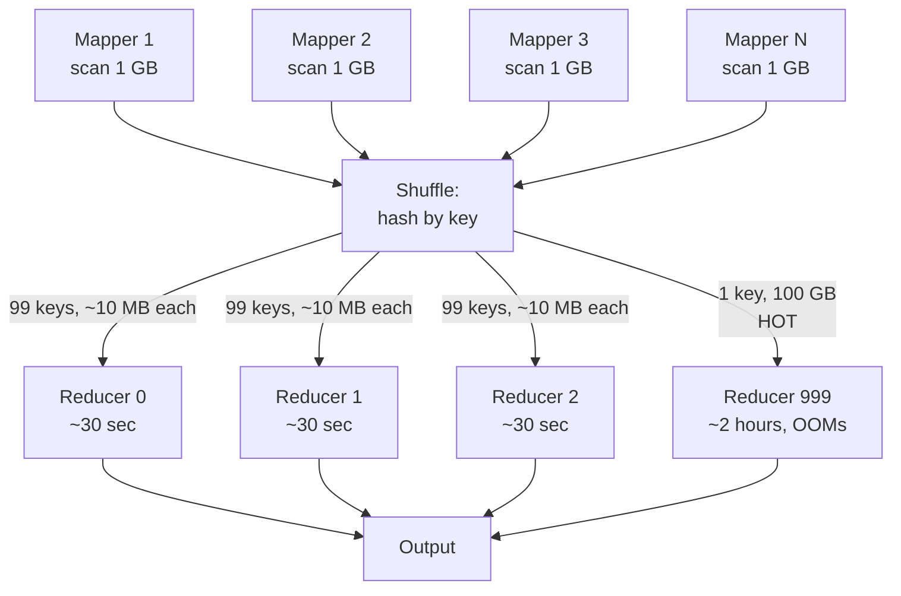
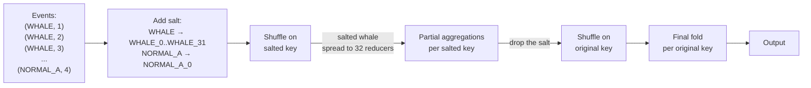
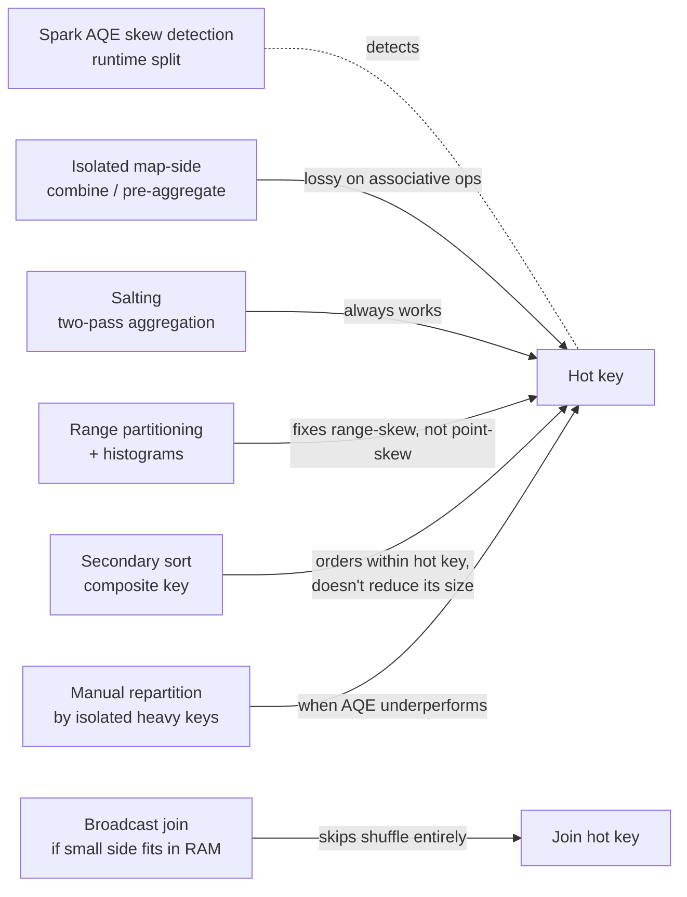

# Data Skew

## Why This Exists

**Problem.** In any partitioned system — Spark, MapReduce, Kafka, Cassandra, Snowflake — work is divided across N parallel workers by hashing or ranging the key. The framework promises throughput proportional to N. **Skew breaks the promise.** When 1 key has 100M rows and the other 999,999 keys have 100 each, one worker does 99% of the work and the other 999 idle. Your "1000-node cluster" becomes a 1-node cluster with extra steps — and the slow node usually OOMs because it tried to materialize the whole hot partition.

**Key insight.** Real data is *never* uniformly distributed. Power-law distributions (Zipfian) are the rule, not the exception: 1% of customers drive 50% of orders, 0.01% of users drive 99% of likes, NULL is a sentinel that looks like the most common value, "unknown" / "default" / `0` accumulate the residue of every bug. Skew isn't a Spark quirk — it's how production data is shaped. The fix is not "tune `shuffle.partitions`"; it's to **change the partitioning so the hot key splits across multiple workers**, and recombine results in a second pass.

**Reach for this when:**

- A small subset of your tasks dominates wall-clock time (dashboards: max/median task duration > 5x).
- A nightly job that "always finished by 3 AM" suddenly takes 14 hours after one customer 100x'd their volume.
- A Spark executor OOMs while peer executors finish; you see one fat green bar in the Spark UI stages tab.
- A Cassandra/DynamoDB partition gets throttled or hot — "partition too large" warnings, throttling on a single key.
- A Kafka consumer group's lag is concentrated on 1-2 partitions while others are caught up.
- A streaming job's watermark moves but one operator's local state grows unboundedly because one key dominates.
- A join's shuffle is fine, but reducer N runs forever while reducers 0..N-1 finish in seconds.

**Don't reach for this when:**

- Your data is genuinely uniform (rare; usually means you haven't looked closely). Synthetic test workloads, hash-keyed events, lottery-numbered IDs sometimes are.
- The job is small enough that single-machine tools (DuckDB, Polars, pandas) finish in minutes — skew doesn't matter when N=1.
- The skew is a *symptom*, not the disease — sometimes it's a bug (bad join key, missing filter, accidental cartesian) and the right fix is the underlying logic, not skew handling.
- You only have one heavy key and the data fits in driver memory after a `groupBy` — just collect it and process it locally.

## Diagrams

### What skew looks like in a wide stage



The wall-clock of the stage is the wall-clock of the slowest reducer. Adding more workers does *nothing* for the hot reducer — it just leaves more idle.

### Salt-then-fold: split a hot key into N partial keys, recombine



Two shuffles, but the heavy first shuffle is balanced and the second shuffle moves only the (already-aggregated) partial results — typically <1 MB per key total. Net: 4-10x faster for typical Zipfian skew.

### Where each mitigation fits in the planner pipeline



No single tool solves all skew. Match the technique to the shape of the skew (point vs range, join vs aggregation, known vs unknown hot keys).

## Patterns

### 1. Detection — before you mitigate, prove there *is* skew

```python
# Spark — quick stage-level skew check from the metrics tab
# Look for: max task duration / median task duration > 5x

# Programmatic skew detection on a key column
from pyspark.sql import functions as F

skew = (
    df.groupBy("user_id")
      .agg(F.count("*").alias("n"))
      .orderBy(F.col("n").desc())
      .limit(20)
)
skew.show()                              # eyeball the top 20

# Compute the skew ratio
stats = df.groupBy("user_id").count().describe("count").collect()
# Look at the spread between max and median, not max and mean.
```

**Heuristic.** If `max(rows_per_key) / median(rows_per_key) > 100`, you have skew. If `> 1000`, you have **severe** skew and the system is being held up by a handful of keys.

**Production dashboards** to build once and keep:

- Per-job: `max_task_duration_ms / p50_task_duration_ms` over time, alert at > 5x.
- Per-Kafka-topic: lag distribution across partitions, alert if 1 partition's lag > 10x the median.
- Per-Cassandra-table: partition-size histogram from `nodetool tablehistograms`, alert when p99 > 100MB.
- Per-DynamoDB-table: `ConsumedReadCapacityUnits` / `ConsumedWriteCapacityUnits` per partition; throttling = hot partition.

### 2. Salting (the universal fix for aggregation skew)

The textbook technique. Split the hot key into N synthetic sub-keys; aggregate twice.

```python
from pyspark.sql import functions as F

N_SALT = 64                              # tune to your hot-key cardinality

# Step 1 — salt only the known hot keys (whitelist), or salt everything
# if you don't know which keys are hot. Whitelisting is leaner.
hot_keys = {"WHALE_CUSTOMER", "NULL_BUCKET", "UNKNOWN"}

salted = (
    events
    .withColumn(
        "salt",
        F.when(F.col("customer_id").isin(hot_keys),
               (F.rand() * N_SALT).cast("int"))
         .otherwise(F.lit(0))
    )
    # First pass — heavy shuffle, but balanced because the whale is split 64 ways
    .groupBy("customer_id", "salt")
    .agg(F.sum("amount").alias("partial_amount"),
         F.count("*").alias("partial_n"))
    # Second pass — light shuffle, only 64 rows per hot key
    .groupBy("customer_id")
    .agg(F.sum("partial_amount").alias("amount"),
         F.sum("partial_n").alias("n"))
)
```

**Why two passes work.** `SUM`, `COUNT`, `AVG` (carry sum + count separately), `MIN`, `MAX`, `BIT_AND`, `BIT_OR`, `MERGE` of HyperLogLog / Count-Min sketches — all of these are **associative and commutative**. You can split, partial-aggregate, and re-combine with no loss. `MEDIAN`, `PERCENTILE`, `COUNT(DISTINCT)` (exact) and arbitrary UDFs are **not** — for those, switch to approximate (HLL / t-digest) or accept the skewed reducer.

**Salt cardinality `N_SALT`** is the only knob — too small and you don't break the hot key; too large and you over-shuffle the cold tail. Practical rule: `N_SALT ≈ rows_in_hottest_key / target_rows_per_task`. For a 100M-row hot key and a 5M-row target per task, `N_SALT ≈ 20`.

### 3. Broadcast (map-side) join — skip the shuffle when one side fits in RAM

```python
from pyspark.sql import functions as F

# Hot-keyed join: 10B fact rows joined with 10M dim rows.
# Without broadcast: shuffle hash-partitions BOTH sides; the dim side's
# hot key sits on one reducer and grinds the join.
# With broadcast: dim is replicated to every executor; the join is
# entirely map-side and skew on either side is irrelevant.

big = spark.read.parquet("s3://fact/orders/")     # 10B rows, ~500 GB
small = spark.read.parquet("s3://dim/products/")   # 10M rows, ~200 MB

# Catalyst auto-broadcasts under spark.sql.autoBroadcastJoinThreshold
# (default 10 MB). Bump it up if your dim is 50–500 MB and per-executor
# RAM allows.
joined = big.join(F.broadcast(small), "product_id")
```

**When to broadcast:** the smaller side fits comfortably in **executor heap** (usually 100 MB–2 GB depending on cluster). Beyond that, broadcasting starts to OOM executors during the broadcast phase.

**When you can't broadcast but the *join key* itself is skewed:** see "skew join split" (AQE) or **isolate-and-replicate** (below).

### 4. Isolate the hot keys and process them separately

When AQE / salting are not enough — typical for joins where the hot key has 10× the data of the cold tail — split the input into "hot" and "cold" branches and process each with the right strategy.

```python
HOT = {"WHALE", "NULL", "UNKNOWN"}

facts_cold = facts.filter(~F.col("customer_id").isin(HOT))
facts_hot  = facts.filter( F.col("customer_id").isin(HOT))

dim = spark.read.parquet("s3://dim/customers/")

# Cold path: regular shuffle hash join, balanced and fast.
joined_cold = facts_cold.join(dim, "customer_id")

# Hot path: broadcast the (tiny) restricted dim, no shuffle.
dim_hot = dim.filter(F.col("customer_id").isin(HOT)).cache()
joined_hot = facts_hot.join(F.broadcast(dim_hot), "customer_id")

result = joined_cold.unionByName(joined_hot)
```

This is what AQE's *skew join* feature does automatically (Spark 3.x), but the manual version is more controllable and works when AQE doesn't fire.

### 5. Spark Adaptive Query Execution (AQE) — turn it on, then tune

```python
spark.conf.set("spark.sql.adaptive.enabled", "true")
spark.conf.set("spark.sql.adaptive.skewJoin.enabled", "true")
# A partition is "skewed" if its size > skewedPartitionFactor * median-partition-size
# AND > skewedPartitionThresholdInBytes. Defaults: 5 and 256 MB.
spark.conf.set("spark.sql.adaptive.skewJoin.skewedPartitionFactor", "5")
spark.conf.set("spark.sql.adaptive.skewJoin.skewedPartitionThresholdInBytes", "256MB")
spark.conf.set("spark.sql.adaptive.coalescePartitions.enabled", "true")
```

**What it does at runtime:** After the shuffle but before the reducer, Spark inspects per-partition sizes. Any partition exceeding the threshold is *split* into N sub-partitions; the corresponding partition on the *other* join side is *replicated*. Net effect: the hot reducer becomes N parallel reducers without any code change.

**When AQE doesn't help:**

- The skew is in an **aggregation** (not a join) — AQE skew handling only works on joins. Use salting.
- The hot side dominates the entire stage — splitting the hot partition still leaves it as the bottleneck if it's >> the rest.
- Your `spark.sql.shuffle.partitions` was already too low — AQE coalesces, not creates.

### 6. Secondary sort — order *within* a heavy key without storing values in memory

This is the technique Parsian's *Data Algorithms* ch. 1–2 spends two chapters on, because in MapReduce the alternative ("buffer all values for a key in the reducer's RAM and sort in-memory") doesn't scale past a few GB per key.

The pattern: instead of `(key, value)`, emit `(composite_key, value)` where `composite_key = (key, sort_field)`. Configure a **partitioner** on the natural key (so all records for the key go to one reducer) and a **grouping comparator** on the natural key (so the reducer iterates one group per key, even though composite keys differ). The framework's existing key-sort delivers the values in sorted order *for free* — no in-memory sort, no OOM on a 50 GB key.

```python
# Spark equivalent — repartitionAndSortWithinPartitions
# Key = (sensor_id, ts), partitioned by sensor_id only, sorted by (sensor_id, ts).
from pyspark import RDD

def partition_by_sensor(composite_key):
    sensor_id, _ = composite_key
    return hash(sensor_id) % N_PARTITIONS

readings = (
    raw_readings.rdd
    .map(lambda r: ((r.sensor_id, r.ts), r))
    .repartitionAndSortWithinPartitions(N_PARTITIONS, partition_by_sensor)
)

# Now within a partition, all rows for the same sensor_id are contiguous and
# already sorted by ts. Iterate streamingly — no need to load the sensor's
# entire history into memory.
```

In SQL/DataFrame terms: `Window.partitionBy("sensor_id").orderBy("ts")` paired with a sort-merge join plan does the same thing under the hood.

**Secondary sort and skew interact subtly:** secondary sort orders values within a heavy key, but it does *not* reduce the heavy key's footprint on one reducer. If "sensor 42" produces 100 GB of readings, that 100 GB still lands on one reducer; secondary sort just lets you stream-process it without buffering. For *aggregations* over a hot key, salting beats secondary sort. For *windowed sequential analyses* of a hot key (sessionization, lag/lead, leaderboard top-K), secondary sort is the right tool.

### 7. Range partitioning + histograms — when keys are *contiguous-skewed*

Hash partitioning fails for keys that cluster (timestamps in the last hour, IDs in a lexicographic range, geo cells in a popular city). Switch to **range partitioning** with a sample-derived histogram.

```python
# Spark RangePartitioner samples the input to pick split points so each
# partition gets ~equal rows.
df.repartitionByRange(200, "event_ts").write.parquet(...)

# Or in raw RDD:
rdd.repartitionAndSortWithinPartitions(
    new RangePartitioner(200, rdd, ascending=True)
)
```

Range partitioning is what Bigtable, HBase, and CockroachDB do by default at the storage level (their physical splits are range-based), and what Google's BigQuery does with **clustered tables**. The trade-off: range partitioning needs a histogram (a sample), and it doesn't help with point-skew (one key dominating) — that's still a hash + salt problem.

### 8. Storage-level mitigations (Cassandra, DynamoDB, Kafka)

Skew is rarely just a Spark problem; it leaks into your operational store too.

| System | Symptom | Fix |
|---|---|---|
| **Cassandra** | Partition > 100 MB; tombstone read amplification on hot partition; one node's heap dominates | Add a "bucket" suffix to the partition key: `PRIMARY KEY ((user_id, day_bucket), event_ts)`. The bucket spreads a hot user across N rows. |
| **DynamoDB** | `ProvisionedThroughputExceededException` on one key; CloudWatch shows hot partition | Use **adaptive capacity** (auto for on-demand) or write-sharding: `PK = user_id#salt` where salt ∈ 0..N. Reads do a scatter-gather across N salts. |
| **Kafka** | Consumer lag concentrated on 1-2 partitions; producer's `RecordBatchSize` for one partition >> others | Custom partitioner to spread the hot key (sacrifices ordering), or a **separate "hot key" topic** with more partitions. Keying by `(user_id, hash(message_id) % salt)` is the salting analog. |
| **Bigtable / HBase** | Region server hotspot on lexicographic key | Salt-prefix the row key (`md5(user_id) || user_id`) or reverse it (`reverse_user_id`) so consecutive writes scatter across regions. |

Each of these has the same mathematical structure as Spark salting: a hot logical key gets multiple physical-storage homes; a virtual layer recombines.

### 9. Pre-aggregation / map-side combine — kill skew before the shuffle

If your aggregation is associative and commutative, you can pre-aggregate locally on each mapper. The shuffle then carries one row per (key, mapper) instead of one per source row.

```python
from pyspark.sql import functions as F

# Naive — shuffle 1B rows
agg = events.groupBy("country").agg(F.count("*"))

# Equivalent but pre-aggregates per partition first
# (Spark does this automatically for SUM/COUNT/AVG via "partial aggregation"
# in its physical plan — `EXPLAIN` shows HashAggregate with two phases.)
# For UDFs, force it explicitly:
from pyspark.sql.functions import pandas_udf

@pandas_udf("long")
def my_partial(s): return s.sum()

agg = events.groupBy("country").agg(my_partial("amount"))
```

In Spark, `RDD.reduceByKey(f)` does map-side combine; `RDD.groupByKey()` does *not* — the difference is the source of more "my Spark job is too slow" tickets than any other single mistake.

For non-associative aggregations (median, distinct-count, percentiles), use approximate sketches (`approx_count_distinct`, `percentile_approx`) which *are* associative.

## Trade-offs

| Benefit | Cost |
|---|---|
| Salting works for any associative/commutative aggregation, no framework support needed | Two shuffles instead of one (~1.5x cost on cold-path keys); requires choosing N_SALT |
| Broadcast join eliminates shuffle entirely | Only works when one side fits in executor RAM (~100 MB–2 GB practical limit) |
| AQE skew join is automatic, zero code change | Only fires on joins, not aggregations; thresholds need tuning per workload |
| Isolate-and-replicate gives you full control | More code; you must know which keys are hot |
| Secondary sort streams a heavy-key reducer's values without OOM | Doesn't reduce the heavy key's data volume — that key still lands on one node |
| Range partitioning balances contiguous-skew | Requires a sample/histogram; rebalancing on insert is expensive |
| Storage-level salting (Cassandra bucket, DynamoDB write-sharding) fixes hot partitions | Reads become scatter-gather (N requests instead of 1); ordering is lost |
| Pre-aggregation reduces shuffle volume linearly with average rows-per-key per mapper | Doesn't help when the hot key already dominates a single mapper |
| Map-side combine is free for `reduceByKey` and SQL aggregates | Doesn't apply to `groupByKey` or arbitrary UDFs |

## Common Pitfalls

- **"Just bump shuffle.partitions."** This is the wrong knob for skew. More partitions splits the cold tail finer; the hot key still lands on exactly one of them. Symptom: 1000 partitions, 999 finish in 5s, 1 runs for 90 minutes. Fix is to break up the hot key, not subdivide everyone else.

- **Salting an aggregation that isn't commutative.** `MEDIAN`, `COUNT(DISTINCT)` (exact), `COLLECT_LIST` (with order dependence), arbitrary UDFs — these don't decompose. If you partial-aggregate them and re-fold, you get wrong answers, often subtly. Switch to an approximate equivalent (HLL for distinct, t-digest for percentiles) or accept the hot reducer.

- **Choosing N_SALT empirically once and forgetting.** The hot key's volume drifts. A salt that worked on Black Friday is over-engineered in February and under-powered next Black Friday. Make `N_SALT` a config or compute it from a recent histogram.

- **Ignoring NULL.** NULL is the silent skew king. Many DBs hash NULL to the same bucket, and "fields that are sometimes NULL" become the world's worst partition key. Defense: filter NULLs out, or coalesce them to a randomized sentinel — `coalesce(user_id, concat('null_', cast(rand()*1000 as string)))`.

- **Grouping by a low-cardinality dimension.** "Group by `gender`" → at most 2-4 groups → at most 2-4 active reducers no matter how many you provision. The fix isn't skew handling; it's adding a more selective grouping key.

- **Broadcast-joining a side that's "small *most* days".** If the dim grows past `autoBroadcastJoinThreshold`, Catalyst silently switches to sort-merge — and your stage runtime quintuples. Force the strategy with a hint (`/*+ BROADCAST(dim) */`) or, if the dim is borderline, use isolate-and-replicate.

- **Treating one fat task as the same problem in stream and batch.** In batch, the fat task delays the job once. In a long-running stream, the fat task's local state grows forever — your operator's RocksDB on disk for the hot key fills, and the rebalancing event takes hours. Sliding-window cleanup matters more in streams.

- **Salting then forgetting the second pass.** "I added salting!" — but the downstream consumer reads the salted, not the folded, output. Now every key is split N ways at the consumer. The two-pass dance is the *whole* technique.

- **AQE thinks the partition is balanced because it measures bytes, not work.** A partition with 1M rows of 1KB strings vs 100K rows of 100B integers is the same byte size but does ~10x the CPU. Symptom: AQE skew handling reports "no skew" but the stage timeline shows it. Fix: use `spark.sql.adaptive.advisoryPartitionSizeInBytes` and watch task CPU not just bytes.

- **Confusing range-skew with point-skew.** "Recent timestamps are hot" is range-skew → fix with hash partitioning or a salt on the high bits. "User 42 is hot" is point-skew → hash partitioning *causes* it; fix with salting or isolation. Reaching for the wrong tool wastes a sprint.

- **Building dashboards only after the incident.** The skew dashboard is the cheapest insurance you can buy. Per-job: max/median task ratio, top-10 partition sizes, executor heap watermarks. Production teams that don't have these get caught by the same skew every quarter.

## Decision Table

| Skew shape | First fix | If that fails |
|---|---|---|
| Aggregation, hot keys known | Salting (whitelist hot keys, N_SALT ≈ 32-128) | Approximate sketches (HLL, Count-Min, t-digest) |
| Aggregation, hot keys unknown | Salt everything; AQE coalesce; pre-aggregate | Sample-and-histogram repartition |
| Inner join, small side fits in RAM | Broadcast join (force with hint if borderline) | Bucketed pre-shuffle on shared key |
| Inner join, both sides large, one key hot | AQE skew join (Spark 3+); isolate hot keys | Custom partitioner + manual two-pass |
| Range-skewed (timestamps, lex IDs) | `repartitionByRange` + clustered storage | Reverse-key / hash-prefix the partition key |
| Cassandra hot partition | Add bucket to PK (`(user_id, day_bucket)`) | Move to a wider PK + materialized view |
| DynamoDB hot partition | Adaptive capacity; write-sharding (PK + salt) | Switch to provisioned + DAX cache for reads |
| Kafka hot partition | Custom partitioner; separate hot-keys topic | Re-key the topic with `(key, salt)` |
| Streaming, hot operator state | Sliding-window cleanup; key sub-partitioning | RocksDB tuning; key-isolated operator |
| Hot key needs ordered iteration | Secondary sort (composite key + grouping comparator) | DataFrame `Window.partitionBy(key).orderBy(...)` |
| `groupBy` of a low-cardinality column (4 groups, 1B rows) | Add a finer grouping dimension | Pre-aggregate by `(low_card, hash(secondary) % N)` first |
| One bad row crashes the hot reducer | `mode=PERMISSIVE`, quarantine bad rows, alert | Isolate hot key into own job |

## References

- Parsian, M. — *Data Algorithms* (O'Reilly 2015), **Chapter 1: Secondary Sort: Introduction**, **Chapter 2: Secondary Sort: A Detailed Example**, **Chapter 7: Market Basket Analysis** — concrete MapReduce + Spark implementations of secondary sort and skew-aware aggregation. — https://www.oreilly.com/library/view/data-algorithms/9781491906170/
- Karau, H. & Warren, R. — *High Performance Spark* (O'Reilly 2017), Chapter 6 — the practitioner's guide to skew, salting, broadcasts, and partitioner selection.
- Apache Spark — *Performance Tuning Guide: Skew Join* — https://spark.apache.org/docs/latest/sql-performance-tuning.html#optimizing-skew-join
- Apache Spark — *Adaptive Query Execution (AQE)* — https://spark.apache.org/docs/latest/sql-performance-tuning.html#adaptive-query-execution
- Databricks — *Skew Join Optimization* — practical config + recipes. — https://docs.databricks.com/en/optimizations/skew-join.html
- Dean, J. & Ghemawat, S. — *MapReduce: Simplified Data Processing on Large Clusters* (OSDI 2004) — the partitioner / combiner contract that all this is built on. — https://research.google/pubs/mapreduce-simplified-data-processing-on-large-clusters/
- Kleppmann, M. — *Designing Data-Intensive Applications*, **Chapter 6: Partitioning** + **Chapter 10: Batch Processing** — partitioning strategies, hot keys, partial aggregation. — https://dataintensive.net/
- AWS — *DynamoDB Best Practices for Designing Partition Keys* — write-sharding, adaptive capacity. — https://docs.aws.amazon.com/amazondynamodb/latest/developerguide/bp-partition-key-design.html
- DataStax — *Cassandra: Avoiding Hot Spots* — bucket-keying patterns. — https://www.datastax.com/blog/avoiding-cassandra-anti-patterns-large-partitions
- Apache Kafka — *Custom Partitioner* docs — when default hash partitioning fails. — https://kafka.apache.org/documentation/#design_constanttime
- Akidau, T. et al. — *The Dataflow Model* (VLDB 2015) — windowing and per-key state in streaming, where skew compounds over time. — https://research.google/pubs/the-dataflow-model-a-practical-approach-to-balancing-correctness-latency-and-cost-in-massive-scale-unbounded-out-of-order-data-processing/
- Cloudera Engineering Blog — *Skew Mitigation in Apache Hive and Spark* — older but still applicable. — https://blog.cloudera.com/improving-the-performance-of-skewed-joins-in-hive/
- Databricks Engineering — *Adaptive Query Execution: Speeding Up Spark SQL at Runtime* (2020) — the canonical write-up of how AQE skew-join split actually works in production. — https://www.databricks.com/blog/2020/05/29/adaptive-query-execution-speeding-up-spark-sql-at-runtime.html

## See Also

- `../batch-processing/` — full batch-job lifecycle; this skill is the deep treatment of one of its core failure modes
- `../partitioning/` — hash vs range vs directory partitioning; the upstream choice that determines whether skew can even happen
- `../stream-processing/` — skew in long-running stateful operators (RocksDB growth, watermark stalls)
- `../storage-engines/` — Cassandra/HBase region splits and partition layout
- `../wide-column/` — Cassandra hot-partition patterns and bucket keys
- `../bloom-filter/` — used together with skew handling to skip cold tails efficiently
- `../../performance/hot-path-optimization/` — generic hot-path techniques; skew is one specialization
- `../../performance/capacity-modeling/` — sizing for the *peak* hot key, not the average
- `../../interview-templates/distributed-counter/` — HyperLogLog / Count-Min as skew-tolerant approximate aggregations
- `../../interview-templates/leaderboard/` — top-K under skew (celebrity scores)
