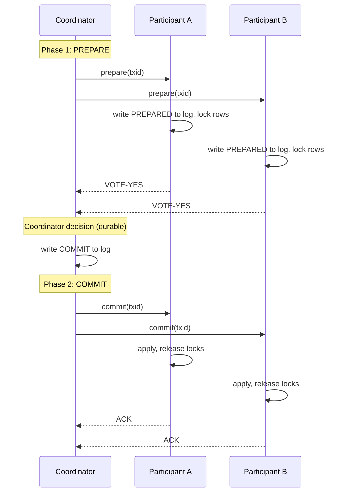
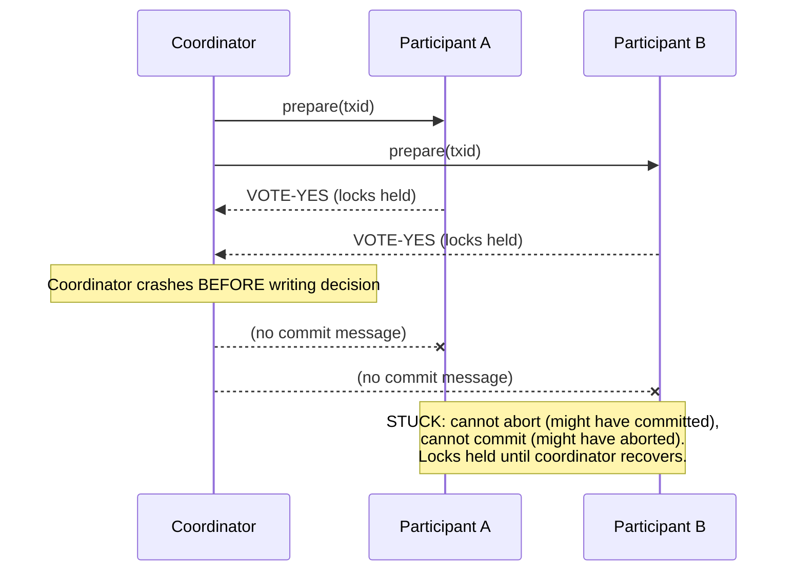
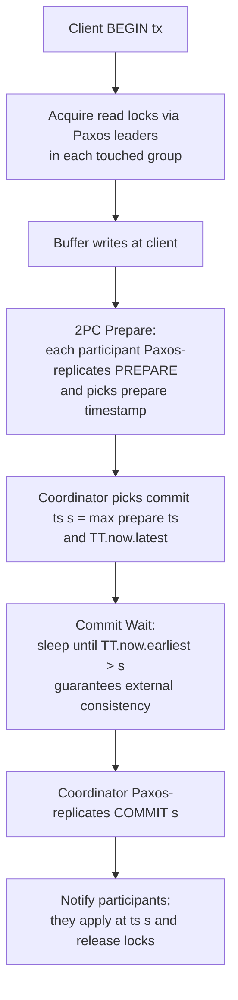

# Distributed Transactions (2PC, 3PC, Percolator, Spanner)

## Why This Exists

**Problem.** A single logical operation — "debit account A, credit account B", "reserve inventory + capture payment", "update user row in shard 7 + secondary index in shard 12" — touches multiple independent storage nodes. Any one of them can crash, the network can partition, and a message can be delivered zero, one, or many times. Without coordination, you get partial commits: money debited but never credited, inventory deducted but the order lost, indexes that disagree with the base table.

**Key insight.** True atomic commit across nodes requires *consensus* — every participant must agree on COMMIT or ABORT, and that decision must survive any subset of failures. Two-Phase Commit (2PC) is the canonical protocol, but it is **blocking**: a coordinator crash freezes participants holding locks. Three-Phase Commit (3PC) attempts to fix this but assumes synchronous networks, which the real world doesn't provide. Modern systems either (a) co-locate consensus with the commit (Spanner: Paxos groups + TrueTime), (b) use a transactional storage primitive plus a notifier (Percolator), or (c) abandon ACID across boundaries and use Sagas / idempotent operations / the outbox pattern.

**Reach for distributed transactions when:**
- You own *all* participants and they are inside a single trust boundary (one team, one DB cluster).
- The data is small, hot, and consistency is non-negotiable (financial ledger, inventory counters, secondary indexes).
- The transaction rate is moderate and you can tolerate the latency floor of a 2-round-trip protocol.
- You can choose a commit-coordinated database (Spanner, CockroachDB, YugabyteDB, FoundationDB, TiDB) instead of rolling your own.

**Don't reach for distributed transactions when:**
- The participants are *services owned by different teams* — Pat Helland's "Life Beyond Distributed Transactions" applies. Use Sagas + idempotent APIs.
- One participant is an external system you don't control (Stripe, a third-party SaaS, an email gateway) — wrap it with the **outbox pattern** instead.
- Latency budget is tight (<10ms p99 cross-region) and you can re-derive consistency via eventual reconciliation.
- The "transaction" is really a long-running business workflow (order → fulfillment → shipment) — that's a Saga, not a 2PC.

Cite: **DDIA ch. 9 — Consistency and Consensus**, especially the sections on atomic commit and 2PC. Helland's *Life Beyond Distributed Transactions* (2007) is required reading before you propose XA across service boundaries.

## Diagrams

### 2PC happy path



### 2PC blocked: coordinator crash after PREPARE



### Spanner read-write transaction with TrueTime



## Two-Phase Commit (2PC) — Mechanics and Failure Modes

2PC has exactly two roles:

- **Coordinator** (transaction manager): drives the protocol, owns the durable decision log.
- **Participants** (resource managers): hold the data, vote, and apply.

### The protocol (in pseudocode)

```python
# COORDINATOR
def commit_transaction(txid, participants):
    # Phase 1: PREPARE
    votes = []
    for p in participants:
        try:
            v = p.prepare(txid, timeout=PREPARE_TIMEOUT)
        except (Timeout, NetworkError):
            v = "VOTE-NO"
        votes.append(v)

    decision = "COMMIT" if all(v == "VOTE-YES" for v in votes) else "ABORT"

    # CRITICAL: durable write of decision BEFORE telling anyone.
    # If we crash after this line, recovery replays Phase 2.
    # If we crash before this line, recovery aborts.
    log.write_sync(txid, decision)

    # Phase 2: COMMIT or ABORT (retry forever — participants must obey)
    for p in participants:
        retry_forever(lambda: p.complete(txid, decision))


# PARTICIPANT
def prepare(txid):
    if not can_commit(txid):
        return "VOTE-NO"
    # Once we vote YES, we MUST be able to honor commit even after crash.
    # This means: write redo+undo to durable log, hold locks.
    log.write_sync(txid, "PREPARED", redo, undo)
    return "VOTE-YES"

def complete(txid, decision):
    # Idempotent: may be called many times after crash recovery.
    if decision == "COMMIT":
        apply_redo(txid)
    else:
        apply_undo(txid)
    log.write_sync(txid, decision)
    release_locks(txid)
```

### Failure modes you actually hit in production

| Failure | What happens | Recovery |
|---|---|---|
| Participant crashes before vote | Coordinator times out → ABORT. Safe. | Standard rollback. |
| Participant crashes after PREPARED, before commit msg | On restart, participant is **in doubt**. It must NOT unilaterally decide. | Ask coordinator (or peers in 3PC). |
| Coordinator crashes before writing decision | Participants in PREPARED state, locks held. | Coordinator recovers, finds no decision → ABORT, sends to participants. |
| Coordinator crashes *after* writing COMMIT, before Phase 2 sends | Participants stuck in PREPARED. | Coordinator recovers, replays Phase 2 from log. |
| Coordinator's disk dies after writing decision | **Disaster.** Participants may diverge — some committed, some still PREPARED forever. | Manual recovery. This is why coordinator log must be replicated (Paxos/Raft). |
| Network partition between coordinator and participant after PREPARE | Participant holds locks; everything blocking on those rows times out. | Operator runs `XA RECOVER` and force-commits or force-aborts. **Risk of split-brain decision.** |

### Why 2PC is "blocking"

A participant that has voted YES has committed itself: it cannot decide alone. If the coordinator is unreachable for 30 minutes, locks are held for 30 minutes, and every read or write touching those rows blocks. This is not a bug — it's the definition. The Coordinated Attack / Two Generals Problem proves no protocol over an unreliable network can avoid this in finite time without external information.

In practice: **stuck XA transactions are the #1 reason DBAs disable distributed transactions**. MySQL's `XA RECOVER`, PostgreSQL's `pg_prepared_xacts`, and Oracle's `DBA_2PC_PENDING` exist solely to manually unstick the protocol.

### XA in real code (JTA + JDBC)

```java
// DON'T DO THIS LIGHTLY. This is the textbook XA pattern that
// every production DBA has at least one horror story about.
UserTransaction tx = ctx.lookup("java:comp/UserTransaction");
tx.begin();
try {
    // Each enlisted resource gets a Phase 1 prepare and Phase 2 commit.
    Connection c1 = ds1.getConnection();   // shard A
    Connection c2 = ds2.getConnection();   // shard B
    Connection cMq = mqDs.getConnection(); // message queue (XA-capable)

    c1.prepareStatement("UPDATE accounts SET balance = balance - ? WHERE id = ?")
      .executeUpdate();
    c2.prepareStatement("UPDATE accounts SET balance = balance + ? WHERE id = ?")
      .executeUpdate();
    cMq.prepareStatement("INSERT INTO outbox(event) VALUES(?)").executeUpdate();

    tx.commit();   // 2PC across all three resources
} catch (Throwable t) {
    tx.rollback();
    throw t;
}
```

What goes wrong: any one resource can hang in PREPARED, the JTA coordinator's log is on the local disk of the app server (single point of failure), and you cannot scale by adding replicas because each new replica adds another coordinator with its own log.

## Three-Phase Commit (3PC)

3PC adds a **PRE-COMMIT** phase between PREPARE and COMMIT, intended to remove the blocking property by ensuring no participant ever holds locks while the coordinator is the only one who knows the decision.

```
Phase 1  CAN-COMMIT?  →  YES/NO
Phase 2  PRE-COMMIT   →  ACK   (everyone now knows the decision is COMMIT)
Phase 3  DO-COMMIT    →  ACK
```

If the coordinator dies after Phase 2, surviving participants can elect a new coordinator and proceed: anyone who reached PRE-COMMIT knows the outcome.

**Why nobody uses 3PC in practice:**

1. It assumes a **synchronous network with bounded message delay**. Real networks are asynchronous; partitions look identical to slow nodes. 3PC can cause split-brain commits under asymmetric partitions.
2. It adds an extra round trip (3 RTTs vs 2), increasing latency 50%.
3. The non-blocking property only holds under the failure model 3PC assumes; under realistic failure models it is no safer than 2PC.
4. Modern systems instead solve the coordinator-crash problem by **replicating the coordinator** with Paxos/Raft (Spanner, CockroachDB) — this gives a non-blocking 2PC where the "coordinator" is itself a fault-tolerant state machine.

DDIA ch. 9 makes the same point: prefer "2PC over a Paxos-replicated coordinator log" to "3PC".

## Percolator (BigTable Transactions)

Google's Percolator (Peng & Dabek, OSDI 2010) was built to incrementally update the web search index on top of BigTable, which provides only single-row atomic operations. It implements **snapshot-isolation, multi-row transactions** as a client-side library on a key-value store.

### The trick: locks-as-data + a timestamp oracle

Each user-visible column `c` has three BigTable columns:
- `c:data` — the actual versioned values
- `c:lock` — the primary-row lock (or pointer to it)
- `c:write` — the commit pointer: at timestamp `ts`, "the committed value lives at `data` ts'"

Two timestamps per transaction from a central **Timestamp Oracle (TSO)**: `start_ts` (read) and `commit_ts` (write).

```python
# Pseudocode for a Percolator-style transaction
class Txn:
    def __init__(self, tso, kv):
        self.start_ts = tso.next()      # global, monotonic
        self.writes = {}                # buffered locally
        self.kv = kv

    def get(self, key):
        # Snapshot read at start_ts; resolve any stuck locks first.
        while True:
            lock = self.kv.get(key, "lock", at=self.start_ts)
            if lock and lock.ts <= self.start_ts:
                self._resolve(lock)     # roll forward or roll back
                continue
            write = self.kv.get(key, "write", at=self.start_ts)
            if not write: return None
            return self.kv.get(key, "data", at=write.points_to)

    def set(self, key, value):
        self.writes[key] = value

    def commit(self):
        if not self.writes: return
        primary, *secondaries = list(self.writes.items())

        # Phase 1: PREWRITE.  Conditionally write data + lock.  Abort on conflict.
        for k, v in [primary] + secondaries:
            ok = self.kv.cas_put(
                key=k, ts=self.start_ts, data=v,
                lock={"primary": primary[0], "ts": self.start_ts},
                # CAS guard: no concurrent write at any ts > start_ts, no existing lock
                guard=lambda: no_conflict(k, self.start_ts),
            )
            if not ok:
                self._rollback()
                raise AbortException()

        # Phase 2: COMMIT.  Atomic single-row commit on the PRIMARY.
        self.commit_ts = tso.next()
        ok = self.kv.cas_put(
            key=primary[0], ts=self.commit_ts,
            write={"points_to": self.start_ts},
            clear_lock=True,
            guard=lambda: lock_still_held(primary[0], self.start_ts),
        )
        if not ok:
            # Someone (a reader) already cleaned us up.  We aborted.
            raise AbortException()

        # Now durably committed.  Asynchronously commit secondaries.
        # If we crash here, future readers will roll-forward by checking
        # the primary's write column.
        for k, _ in secondaries:
            self.kv.put(k, ts=self.commit_ts, write={"points_to": self.start_ts},
                        clear_lock=True)
```

### Why this is clever

- The "atomic decision" is a single-row CAS on the primary. BigTable already gives us that.
- Crashed clients leave behind locks. Any **reader** that encounters a lock can resolve it: look at the primary's `write` column. If primary committed, roll forward the secondary; otherwise roll back. **Recovery is decentralized** — no coordinator process needed.
- Snapshot isolation comes free from MVCC + the timestamp oracle.

### What you give up

- The **TSO is a SPOF and bottleneck**. Percolator centralized it; later systems (TiDB, Spanner) replicated it (Paxos) or replaced it with TrueTime.
- Latency is high: 2 RPC rounds + lock cleanup. Percolator's paper reports a **50× slowdown** vs MapReduce for batch indexing — but that was acceptable because it converted batch into incremental.
- Long-running transactions hold locks; readers slow down resolving them.

TiKV (the storage engine under TiDB) is the most widely deployed Percolator-derived implementation today.

## Google Spanner + TrueTime

Spanner's contribution: **external consistency** (linearizability across the whole database, including across continents) at scale, with no central coordinator bottleneck.

### Building blocks

1. **Sharded data** ("splits" / tablets), each replicated by a **Paxos group** (the "leader" of which is the local coordinator).
2. **TrueTime API** — `TT.now()` returns an interval `[earliest, latest]` such that the true absolute time is *definitely* inside the interval. Spanner's deployment keeps the interval width ε around 1–7 ms by combining GPS receivers and atomic clocks in every datacenter, polled every 30 s.
3. **2PC across Paxos groups**, with the coordinator role itself replicated by Paxos — so coordinator crashes are non-blocking in the practical sense (the new leader resumes the protocol from the replicated log).
4. **Commit Wait.** After picking commit timestamp `s`, the coordinator sleeps until `TT.now().earliest > s`. Only then does it release locks. This guarantees: if T1 commits before T2 starts (in real wall-clock time), T1's timestamp `<` T2's timestamp. No client can ever see them out of order.

### The math (why TrueTime matters)

Without TrueTime, you'd need a central sequencer (TSO) for global ordering, which doesn't scale across continents. With TrueTime, every Paxos group can pick timestamps locally, and external consistency is preserved by waiting out the uncertainty window. The latency penalty is bounded by `2ε ≈ 14 ms` worst case — the price of geo-distributed linearizability.

### Read-only transactions are fast

A snapshot read at timestamp `s` waits only until each replica's safe-time has caught up to `s`. No locks, no 2PC. Most production reads in Spanner are this kind. **This is the killer feature**: linearizable reads at scale, without coordinator round-trips.

### When you should consider Spanner / CockroachDB / YugabyteDB

- You need **strong consistency across regions** and you're willing to pay 14–100 ms commit latency for it.
- Your team is small enough that the operational simplicity of "one global SQL DB" beats a hand-rolled Saga mesh.
- Read-heavy with strict-consistency requirements.

When NOT to: hot-row contention (commit-wait amplifies tail latency), workloads where eventual consistency would be fine, or where you need cross-DB transactions (e.g. SQL DB + a different system).

## Alternatives — and why you should usually pick one

### 1. Sagas (Garcia-Molina & Salem, 1987)

Replace the ACID transaction with a **sequence of local transactions**, each with a compensating action. If step N fails, run the inverses of steps N-1, N-2, ..., 1.

```python
# Classic order Saga
def place_order(order):
    saga = Saga()
    saga.step(reserve_inventory,   compensate=release_inventory)
    saga.step(charge_payment,      compensate=refund_payment)
    saga.step(create_shipment,     compensate=cancel_shipment)
    saga.step(send_confirmation,   compensate=send_cancellation)
    saga.run(order)
```

Two flavors:

- **Choreography**: each step emits an event, the next step subscribes. Simple, decentralized, hard to debug.
- **Orchestration**: a central workflow engine (Temporal, AWS Step Functions, Cadence, Camunda) drives the steps. Easier to observe; the orchestrator is itself a small SPOF you must HA-replicate.

**The hard part of Sagas is *not* the happy path — it's the compensations.** "Refund payment" is rarely a true inverse of "charge payment" (refunds may be slow, may fail, the customer may have spent the money). Sagas trade ACID atomicity for **semantic atomicity** that the business has to design. The system can be left in intermediate states visible to users (the "ghost order" problem).

Read: Caitie McCaffrey's "Distributed Sagas: A Protocol for Coordinating Microservices" (Microservices Practitioner Summit 2017).

### 2. Idempotent operations + retries

Make every API operation idempotent (keyed by a client-supplied `Idempotency-Key`). Then retries are safe, and "exactly-once semantics" becomes "at-least-once delivery + at-most-once *effects*".

```python
def charge(idempotency_key, amount, customer):
    # SELECT ... FOR UPDATE on idempotency_keys row, or use INSERT ... ON CONFLICT DO NOTHING
    existing = db.find_charge(idempotency_key)
    if existing:
        return existing.result   # replay the original outcome
    result = stripe.charge(amount, customer)
    db.insert_charge(idempotency_key, result)
    return result
```

Stripe's API is the canonical example. This is *not* a transaction protocol — it's a primitive that lets you build Sagas safely.

### 3. The Outbox / Inbox pattern

When you need to atomically (a) write to your DB and (b) send a message, use a single local transaction that writes both to the business table AND an `outbox` table. A separate relay process tails the outbox and publishes to the message bus, marking rows as sent.

```sql
BEGIN;
UPDATE accounts SET balance = balance - 100 WHERE id = 1;
UPDATE accounts SET balance = balance + 100 WHERE id = 2;
INSERT INTO outbox(event_type, payload, created_at)
  VALUES ('TransferCompleted', '{...}', now());
COMMIT;
-- Relay process: SELECT ... FROM outbox WHERE sent_at IS NULL ORDER BY id;
--                publish; UPDATE outbox SET sent_at = now() WHERE id = ?;
```

This gives you **at-least-once message publication with no XA**. Pair with idempotent consumers and you have effectively-once semantics. The Debezium project popularized this pattern at scale via change-data-capture.

### 4. Co-locate the data

The cheapest distributed transaction is the one you don't have. If "user + their orders" always go together, **shard them on the same key** so the transaction is single-shard. Spanner, CockroachDB, Vitess, and Citus all expose this as table interleaving / co-location. *Most* "we need 2PC" requirements melt away once you re-shard.

## Trade-offs

| Approach | Benefit | Cost |
|---|---|---|
| **2PC (XA)** | True ACID across resources; SQL semantics preserved | Blocking on coordinator failure; locks held; coordinator log is SPOF; doesn't scale across orgs |
| **3PC** | Non-blocking under sync model | Assumes bounded delay (false in real networks); extra RTT; rarely used in practice |
| **Percolator** | Multi-row ACID on a KV store; decentralized recovery | Central TSO bottleneck; high latency; lock cleanup amplifies tail latency |
| **Spanner (Paxos+TrueTime)** | Global external consistency; non-blocking commit; linearizable reads | TrueTime hardware (GPS/atomic); commit-wait latency floor; vendor lock-in (or Cockroach/Yugabyte alternatives) |
| **Sagas (orchestrated)** | Scales across services & teams; no locks; observable | Compensations are semantic, not perfect inverses; intermediate states visible; engine is a critical dependency |
| **Sagas (choreographed)** | Fully decentralized; loose coupling | Hard to reason about; "where did we get stuck?" debugging is painful |
| **Idempotency keys** | Safe retries; works across any HTTP boundary | Doesn't give atomicity — only safety against duplicates |
| **Outbox** | Atomic DB + event publication; no XA | Eventual consistency; relay lag; requires CDC or polling infra |
| **Co-location / re-sharding** | Eliminates the problem entirely | Shard key choice constrains future query patterns |

## Common Pitfalls

- **"We'll just use XA across our microservices."** No. XA across services owned by different teams (and especially across non-RDBMS resources) is the source of more pain than it's worth. Re-read Helland.
- **Coordinator log on the local disk of the app server.** When the app server dies, in-flight prepared txns are stuck until you restore that disk. The coordinator log must be on replicated storage (Paxos/Raft) or the protocol is unsafe.
- **Stuck PREPARED transactions silently holding row locks.** Symptom: writes to seemingly-unrelated rows start timing out. Run `SELECT * FROM pg_prepared_xacts` (Postgres) or `XA RECOVER` (MySQL/Oracle) periodically as a monitor. Alert on age > 5 min.
- **Heuristic commit ("the DBA force-committed the prepared txn").** This breaks atomicity by definition. Sometimes unavoidable, but every occurrence is a postmortem.
- **Forgetting that PREPARE holds locks.** A 2PC across a slow participant (cross-region, unreliable network) blocks the fast participant for the duration of the slow one. Always set aggressive prepare timeouts.
- **Saga compensations that aren't truly inverse.** "Refund" is not the inverse of "charge" if the customer has been notified. "Cancel shipment" is not the inverse of "create shipment" if the package already shipped. Design the business-level semantics first.
- **Idempotency keys with too-narrow uniqueness.** If your key is `(user_id, day)` you'll collide with legitimate retries on the next day. Use a proper UUID per logical request, scoped to the endpoint.
- **Outbox poller hot-loop.** A naive `SELECT * FROM outbox WHERE sent_at IS NULL` becomes a sequential scan as the table grows. Index on `(sent_at, id)` and prune sent rows.
- **Reading-from-followers-after-write.** With a multi-region commit, your read-after-write on a follower may not see your own write yet. Either route reads to the leader, or use bounded staleness with explicit barriers (Spanner: `read_at(ts >= my_commit_ts)`).
- **Conflating "exactly-once" with "at-most-once effects".** No system can do exactly-once delivery in an asynchronous network (FLP). What you can build: at-least-once delivery + idempotent application.

## Decision Table

| Situation | Pick this |
|---|---|
| Two tables in the same RDBMS, same shard | **Local transaction.** Don't overthink it. |
| Multiple shards within one DB cluster you control (Spanner, Cockroach, Yugabyte, TiDB, Vitess+XA) | **Built-in distributed transaction.** Use the database's native facility. |
| Write to your DB + send a Kafka/SQS message | **Outbox pattern.** Never XA the broker. |
| Workflow spanning multiple services owned by other teams | **Saga (orchestrated, e.g. Temporal/Step Functions).** With idempotent steps. |
| Same as above but you control all the services | **Saga.** Still. The cross-team failure mode rarely makes XA worth it inside one team. |
| HTTP API where clients retry | **Idempotency keys** for every mutating endpoint. |
| Long-running business process (hours-to-days) | **Saga + workflow engine** (Temporal/Cadence). 2PC's locks are intolerable here. |
| Need linearizable global reads + writes across regions | **Spanner / CockroachDB / Yugabyte.** Pay the latency. |
| Legacy J2EE app where XA is already wired up and works | **Leave it alone.** Just monitor stuck txns. Don't migrate without a reason. |
| Cross-cloud / cross-vendor "transaction" | **Saga + outbox.** Distributed transactions across trust boundaries are a fantasy. |

## References

- Kleppmann, Martin — *Designing Data-Intensive Applications*, ch. 9 "Consistency and Consensus" (esp. "Distributed Transactions and Consensus") — https://dataintensive.net/
- Helland, Pat — *Life Beyond Distributed Transactions: An Apostate's Opinion* (CIDR 2007) — https://www.ics.uci.edu/~cs223/papers/cidr07p15.pdf
- Gray, Jim & Lamport, Leslie — *Consensus on Transaction Commit* (MSR-TR-2003-96, Paxos Commit) — https://www.microsoft.com/en-us/research/publication/consensus-on-transaction-commit/
- Skeen, Dale — *Nonblocking Commit Protocols* (SIGMOD 1981) — original 3PC paper.
- Peng, Daniel & Dabek, Frank — *Large-scale Incremental Processing Using Distributed Transactions and Notifications* (Percolator, OSDI 2010) — https://research.google/pubs/large-scale-incremental-processing-using-distributed-transactions-and-notifications/
- Corbett, James C. et al. — *Spanner: Google's Globally-Distributed Database* (OSDI 2012) — https://research.google/pubs/spanner-googles-globally-distributed-database-2/
- Bacon, David F. et al. — *Spanner: Becoming a SQL System* (SIGMOD 2017) — https://research.google/pubs/spanner-becoming-a-sql-system/
- Garcia-Molina, Hector & Salem, Kenneth — *Sagas* (SIGMOD 1987) — https://www.cs.cornell.edu/andru/cs711/2002fa/reading/sagas.pdf
- McCaffrey, Caitie — *Distributed Sagas: A Protocol for Coordinating Microservices* (talk, 2017) — https://www.youtube.com/watch?v=0UTOLRTwOX0
- Richardson, Chris — *Pattern: Saga* and *Pattern: Transactional Outbox* — https://microservices.io/patterns/data/saga.html and https://microservices.io/patterns/data/transactional-outbox.html
- AWS Builders' Library — *Challenges with distributed systems* — https://aws.amazon.com/builders-library/challenges-with-distributed-systems/
- AWS Builders' Library — *Implementing health checks* (relevant to coordinator failure detection) — https://aws.amazon.com/builders-library/implementing-health-checks/
- Google SRE Book — ch. 23 *Managing Critical State: Distributed Consensus for Reliability* — https://sre.google/sre-book/managing-critical-state/
- Google SRE Book — ch. 24 *Distributed Periodic Scheduling with Cron* (related leader-election patterns) — https://sre.google/sre-book/distributed-periodic-scheduling/
- Brewer, Eric — *Spanner, TrueTime & The CAP Theorem* (Google whitepaper, 2017) — https://research.google/pubs/spanner-truetime-and-the-cap-theorem/
- Stripe Engineering — *Designing robust and predictable APIs with idempotency* — https://stripe.com/blog/idempotency
- Debezium — *Reliable Microservices Data Exchange With the Outbox Pattern* — https://debezium.io/blog/2019/02/19/reliable-microservices-data-exchange-with-the-outbox-pattern/
- CockroachDB — *Architecture: Transaction Layer* — https://www.cockroachlabs.com/docs/stable/architecture/transaction-layer.html
- Lampson, Butler — *How to Build a Highly Available System Using Consensus* — https://www.microsoft.com/en-us/research/publication/how-to-build-a-highly-available-system-using-consensus/
- Bernstein, Hadzilacos, Goodman — *Concurrency Control and Recovery in Database Systems* (1987, free PDF) — https://www.microsoft.com/en-us/research/people/philbe/book/

## See Also

- ../consensus-paxos-raft/ — the consensus protocols that make a 2PC coordinator non-blocking when replicated
- ../consistency-models/ — linearizability, serializability, snapshot isolation, causal consistency
- ../replication-strategies/ — leader-follower, multi-leader, leaderless; the substrate distributed txns run over
- ../sharding-partitioning/ — co-locate to avoid the cross-shard transaction in the first place
- ../mvcc-snapshot-isolation/ — the concurrency-control regime Percolator and Spanner build on
- ../../microservices/saga-orchestration/ — workflow engines (Temporal, Step Functions) for long-running business transactions
- ../../microservices/outbox-pattern/ — atomic DB-write + event-publish without XA
- ../../microservices/idempotency-keys/ — the foundation under every safe retry-able API
- ../../reliability/leader-election/ — when your "coordinator" is itself a replicated state machine
- ../../observability/distributed-tracing/ — how you debug a Saga that got stuck halfway
- ../event-sourcing-cqrs/ — alternative architecture that sidesteps multi-row updates entirely
