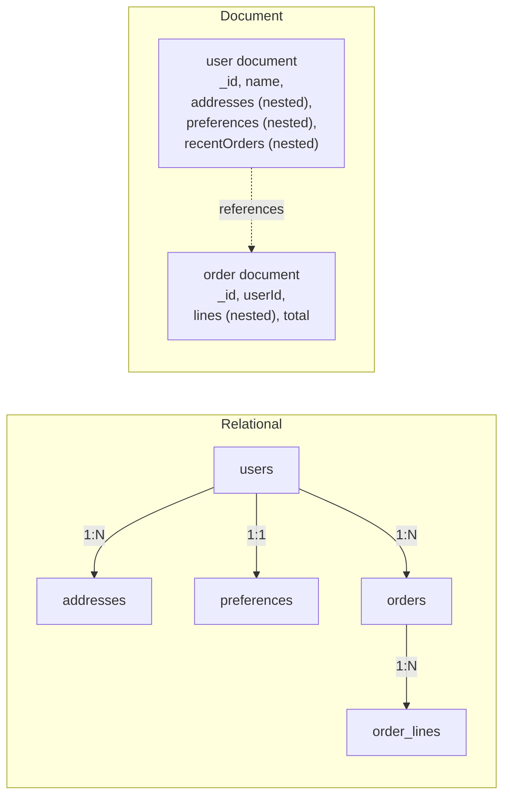
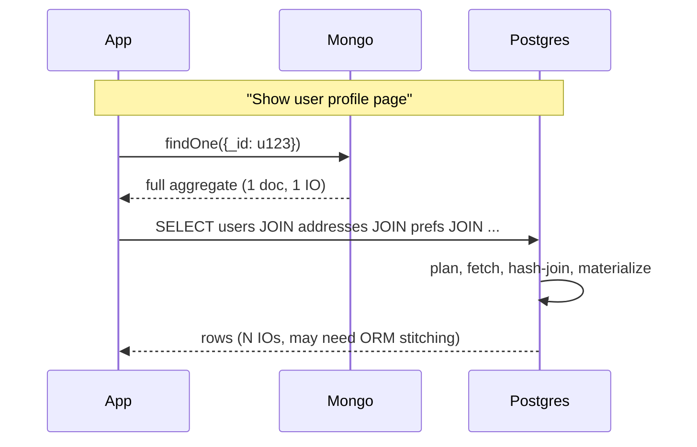
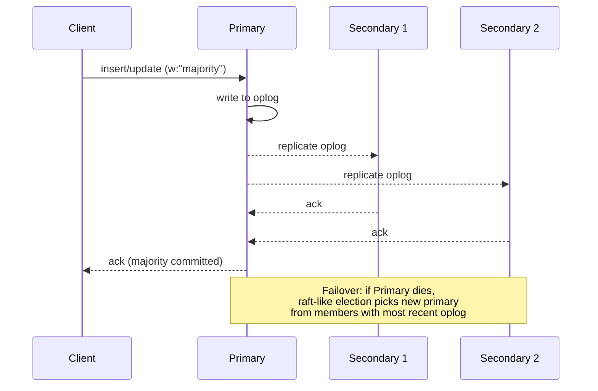

# Document Databases

## Why This Exists

**Problem.** Relational schemas force every entity into the same rectangle. When the entity's shape varies — per tenant, per product category, per integration version — you end up with sparse columns, EAV anti-patterns, polymorphic association tables, or a `data jsonb` column that defeats the point of having a schema. Meanwhile, applications usually read **aggregates** (a user with their preferences, an order with its line items, a CMS page with its blocks) — not third-normal-form rows. The relational model optimizes for ad-hoc joins; most app code doesn't need them.

**Key insight.** A document database stores **aggregates as units**: a single document holds the data the application normally loads together. Reads are one seek, writes are atomic at the document level, and the schema is encoded in the application — not in DDL. You trade the relational engine's ability to recombine data freely for **locality, schema flexibility, and write throughput**. This is Eric Evans' aggregate (DDD) made physical, and Pat Helland's "data on the outside" — entities exchanged across boundaries don't fit one global schema.

**Reach for this when:**
- The unit of access is an aggregate (user profile, order, product page, CMS entry, IoT event).
- Schema **must** vary per row — multi-tenant SaaS, polymorphic content, third-party webhooks with vendor-specific fields.
- You need to evolve the schema continuously without `ALTER TABLE` outages.
- Read pattern is "load this one thing by id, fast" — not "join five tables and group by".
- Writes are mostly self-contained to one entity (no cross-aggregate transactions on the hot path).

**Don't reach for this when:**
- The data is intrinsically relational and read patterns vary unpredictably (analytics, ad-hoc BI). Use Postgres or a warehouse.
- You need multi-row, multi-table ACID transactions across many aggregates routinely. Mongo 4.0+ supports them but they're slower than single-doc writes and contention is worse than in Postgres.
- The natural shape is a graph (social, fraud rings, recommendation). Use a graph DB.
- You'll join across documents constantly via `$lookup`. That's a relational workload pretending to be document.
- You can't afford eventual consistency on secondaries and you're using a multi-region setup that prefers AP.

## Diagrams

### Aggregate-oriented vs. relational layout



Note the document side **embeds** what's read with the entity (addresses, preferences, recent orders) and **references** what's an aggregate of its own (full order history). That choice is the core design tension.

### Read path: one seek vs. join fan-out



### Replica set write path (Mongo)



## The Three Implementations You'll Actually Meet

| Engine | What it actually is | When to pick it |
|--------|--------------------|-----------------|
| **MongoDB** | Reference document DB. WiredTiger storage, B-tree + LSM-ish, replica sets w/ raft-ish elections, sharding via range/hash. | Default. Largest ecosystem, drivers, Atlas managed service, change streams, time-series collections (5.0+), multi-document transactions (4.0+). |
| **Amazon DocumentDB** | "MongoDB API-compatible" service on top of Aurora's distributed storage. Not Mongo internals. | You already live in AWS, want managed, need point-in-time restore + IAM integration, and your app uses a subset of Mongo features (check the [API compatibility matrix](https://docs.aws.amazon.com/documentdb/latest/developerguide/mongo-apis.html)). Don't pick it expecting Mongo's full operator surface — `$lookup`, change streams, transactions all behave differently or are limited. |
| **CouchDB / PouchDB** | Crash-only, MVCC append-only, HTTP-native, multi-master replication is the headline feature. | Offline-first / mobile sync (PouchDB ↔ CouchDB), edge/embedded, eventually-consistent multi-master. Not for high-throughput OLTP. |

There are others (Couchbase, RavenDB, ArangoDB, FerretDB) but these three cover ~95% of real decisions.

## Core Content

### 1. Aggregate design — the only decision that matters

Document modeling collapses to one question, asked per relationship: **embed or reference?**

```python
# Embed — the related data is part of the aggregate's identity.
# Loads with the parent. Bounded size. Updated atomically with parent.
user = {
    "_id": "u_123",
    "email": "ada@example.com",
    "addresses": [                          # 1:few, bounded, read with user
        {"label": "home", "line1": "...", "country": "GB"},
        {"label": "work", "line1": "...", "country": "GB"},
    ],
    "preferences": {                        # 1:1, always read with user
        "locale": "en-GB",
        "newsletter": True,
    },
}

# Reference — the related data has its own lifecycle, is unbounded,
# or is an aggregate root in its own right.
order = {
    "_id": "o_9001",
    "userId": "u_123",                      # foreign key, application-enforced
    "lines": [                              # embedded: lines belong to order
        {"sku": "BOOK-1", "qty": 1, "priceCents": 1999},
    ],
    "totalCents": 1999,
    "placedAt": "2025-11-04T10:11:12Z",
}
```

**Embedding rules of thumb (Mongo & Couch both):**

1. **Read together → store together.** If a screen needs it, embed it.
2. **Bounded growth.** Comments on a viral post will hit Mongo's 16MB doc limit. Reference instead, or shard the comments collection.
3. **Cardinality matters.** 1:1 and 1:few embed comfortably. 1:many embeds if "many" is bounded and small (<~100). 1:huge always references.
4. **Lifecycle.** If the child is mutated independently and frequently while parent is hot, embedding causes write contention on the parent doc.
5. **Duplication is a feature, not a bug — until it isn't.** Denormalizing the seller's name onto the order is fine. When the seller renames, you must reconcile. Decide upfront: stale copy ok, or background fixup?

### 2. Schema flux: the benefit and the trap

The benefit is real. You can ship a new field today, backfill lazily, and never take a write lock:

```typescript
// v1 of the user doc: no `mfaEnabled`. Code reads it as undefined → falsy.
// v2 ships, sets it on new logins.
// Backfill runs in the background, idempotent.
//
// No ALTER TABLE. No deploy coordination. Old and new docs coexist.

interface UserV1 { _id: string; email: string; }
interface UserV2 { _id: string; email: string; mfaEnabled?: boolean; mfaSecret?: string; }

function isMfaOn(u: UserV1 | UserV2): boolean {
  return "mfaEnabled" in u && !!u.mfaEnabled;   // tolerant read
}
```

The trap is also real. **Schema-on-read becomes schema-of-no-one** when:

- Multiple services write the same collection with different mental models (the ETL team adds `email_lc`, the app team adds `emailLowercase`, the GDPR team adds `email_redacted`).
- Field types drift: `userId` is sometimes a string, sometimes an `ObjectId`, sometimes a number.
- Required-ness drifts: half the docs have `createdAt`, half don't, and your aggregation `$sort` silently puts nulls first.
- A renamed field is "fixed" with a one-shot migration that crashes halfway through.

**Counter-measures:**

1. **Validators on write.** Mongo's `$jsonSchema` validator catches drift at the boundary:

```javascript
// Add this when you create the collection. Set validationLevel: "moderate"
// initially so existing bad docs don't block writes; tighten later.
db.createCollection("users", {
  validator: {
    $jsonSchema: {
      bsonType: "object",
      required: ["email", "createdAt", "schemaVersion"],
      properties: {
        schemaVersion: { bsonType: "int", minimum: 1 },
        email:        { bsonType: "string", pattern: "^.+@.+\\..+$" },
        createdAt:    { bsonType: "date" },
        mfaEnabled:   { bsonType: "bool" },
      },
    },
  },
  validationLevel: "moderate",
  validationAction: "error",
});
```

2. **Embed `schemaVersion` in every doc.** This is non-negotiable for anything that lives more than a year. Code reads should be `switch (doc.schemaVersion)` with a tolerant fallback path.

3. **Migrate-on-read, then sweep.** Application reads upcast v1 → v2 in memory. A background job rewrites docs at idle. Same pattern as event-sourced upcasting.

4. **One canonical writer per field.** If three services write `email`, agree which is canonical. Others read.

### 3. Query model — what you get vs. what you pay for

Mongo's query language is JSON-shaped predicates plus an aggregation pipeline (`$match → $project → $group → ...`). It's expressive enough that people forget it isn't SQL.

```javascript
// Find recent paid orders for a user, with line item totals.
// Idiomatic Mongo: build a pipeline.
db.orders.aggregate([
  { $match: { userId: "u_123", status: "paid" } },
  { $sort:  { placedAt: -1 } },
  { $limit: 20 },
  { $project: {
      placedAt: 1,
      total: 1,
      itemCount: { $size: "$lines" },
  }},
]);

// Index that supports it. Without this, $match scans all of `orders`.
db.orders.createIndex({ userId: 1, status: 1, placedAt: -1 });
//                      ^^^^^^^  ^^^^^^^   ^^^^^^^^^^^^
//                      equality | equality | sort/range
//                      ESR rule: Equality, Sort, Range — in that order
```

The **ESR rule** (Equality, Sort, Range) is the indexing rule of thumb every Mongo dev must internalize. Compound index field order matters; getting it wrong silently slows queries by 100x.

**What you don't get for free:**

- **`$lookup` is not a relational join.** It's a per-input-doc query against another collection. For 10k input docs and a slow inner index, it'll fan out to 10k lookups. Use it sparingly. If you find yourself reaching for it on the hot path, your aggregate boundary is wrong.
- **Multi-key indexes** on arrays explode in size and limit further compound fields. Indexing `lines.sku` indexes every element.
- **No declarative referential integrity.** App code enforces foreign keys. Orphan refs are normal; you build a sweeper.
- **No window functions** until 5.0 (`$setWindowFields`); even then, less ergonomic than SQL.

### 4. Transactions: Mongo 4.0+, and when to actually use them

Pre-4.0 Mongo had only single-document atomicity. The party line was "design your aggregate so a single-doc update is enough" — and that's still right for hot paths. Multi-document, multi-collection ACID transactions arrived in 4.0 (replica sets) and 4.2 (sharded clusters).

```python
# pymongo. Use transactions for cross-aggregate invariants you couldn't
# encode in a single document. NOT as a default.
from pymongo import MongoClient, WriteConcern
from pymongo.read_concern import ReadConcern

client = MongoClient("mongodb://...", w="majority")
db = client.shop

def transfer_credits(from_user: str, to_user: str, amount: int) -> None:
    # We chose to keep `credits` on the user doc. A single user op is atomic.
    # But moving credits BETWEEN users crosses aggregate boundaries.
    with client.start_session() as session:
        with session.start_transaction(
            read_concern=ReadConcern("snapshot"),
            write_concern=WriteConcern("majority"),
        ):
            src = db.users.find_one_and_update(
                {"_id": from_user, "credits": {"$gte": amount}},
                {"$inc": {"credits": -amount}},
                session=session,
                return_document=True,
            )
            if src is None:
                raise InsufficientFunds(from_user)

            db.users.update_one(
                {"_id": to_user},
                {"$inc": {"credits": amount}},
                session=session,
            )
            db.ledger.insert_one(
                {"from": from_user, "to": to_user, "amount": amount},
                session=session,
            )
        # Commit happens at `with` block exit. On TransientTransactionError,
        # pymongo can be told to retry — see retryable transactions docs.
```

**Realities of Mongo transactions:**

- **Cost.** A txn holds resources on every shard it touches; commit is two-phase across shards. 5–10× the latency of an unsharded single-doc write is normal.
- **60-second default time limit.** Long-running txns get killed.
- **Write conflicts** (`WriteConflict`) on contended docs raise; the driver retries within the transaction. You also need outer retry for `TransientTransactionError`.
- **No DDL inside.** Can't create collections/indexes mid-txn (without 4.4+ specifics).
- **Causal consistency requires sessions.** Read-your-writes across operations needs `start_session()` even outside transactions.

**Rule:** if you're using transactions on the hot path, your aggregate boundaries are wrong. Use them for genuine cross-aggregate invariants (financial transfers, inventory + order, idempotent webhook deduplication).

### 5. Replication, consistency, durability

Mongo replica sets are **leader-based**, raft-ish. Writes go to the primary; secondaries replicate the oplog. Read/write concerns are knobs:

```javascript
// Write concerns
{ w: 1 }              // Acked by primary only. Fast. Loses data on failover.
{ w: "majority" }     // Acked by majority. Safe default. Slower.
{ w: "majority", j: true }  // Also fsynced. Pay for it only when you must.

// Read concerns
"local"     // Whatever this node has. Stale ok.
"majority"  // Only reads data acked by majority — won't see rolled-back writes.
"snapshot"  // Used inside transactions; consistent point-in-time view.
"linearizable"  // Strict; primary-only; expensive.
```

**Defaults to set in production:** `w:"majority"`, `readConcern:"majority"`, retryable writes on. Anything else is a load-shedding optimization — make it deliberate.

CouchDB inverts this: **multi-master, eventually consistent, MVCC**. Every write produces a new revision; conflicts are surfaced explicitly and resolved by the application. This is brilliant for offline sync (PouchDB → CouchDB) and miserable as an OLTP store at scale.

DocumentDB (AWS) decouples compute from storage Aurora-style. Up to 15 replicas share storage; replicas are read-only. Failover is faster than a Mongo election but feature surface is narrower — no change streams pre-4.0 emulation, limited transactions on older versions. **Always check the API compatibility page before promising features.**

### 6. Sharding: the cliff at the end of vertical scaling

Single replica set tops out somewhere between 100GB and a few TB depending on workload. Past that, shard.

```javascript
// Bad shard key: monotonic — every insert goes to the last shard.
sh.shardCollection("shop.events", { createdAt: 1 });

// Worse: low cardinality — entire collection collapses onto one shard.
sh.shardCollection("shop.events", { country: 1 });

// Better: hashed on a high-cardinality, evenly-distributed field.
sh.shardCollection("shop.events", { userId: "hashed" });

// Best for time-series + queryability: compound, with a hashed prefix
// or bucketed time. Range queries on userId stay on one shard;
// time-bounded scans hit a few.
sh.shardCollection("shop.events", { userId: 1, createdAt: 1 });
```

**Sharding pitfalls (war-story bingo):**

- **Hot shard from monotonic key.** Every new event goes to the same shard. CPU pinned, others idle.
- **Jumbo chunks.** A single tenant grew past `chunkSize`; balancer can't split because shard key has no internal cardinality (e.g. `{tenantId: 1}` for one whale tenant). Result: balancer paralysis.
- **Resharding is not free.** Pre-5.0 it required dump/restore. 5.0+ has online resharding, still expensive. Pick the shard key carefully — it's a marriage.
- **Cross-shard queries** (no shard key in predicate) scatter-gather to all shards. p99 dominated by the slowest shard.
- **Cross-shard transactions** are 2PC. Latency 10× single-shard.

### 7. Indexing — the rest of the iceberg

```javascript
// Compound, ESR-correct
db.orders.createIndex({ userId: 1, status: 1, placedAt: -1 });

// Partial — index only the hot subset (saves RAM, faster writes)
db.orders.createIndex(
  { placedAt: -1 },
  { partialFilterExpression: { status: "pending" } }
);

// TTL — auto-expire (sessions, magic links, soft-deleted)
db.sessions.createIndex({ expiresAt: 1 }, { expireAfterSeconds: 0 });

// Wildcard — for unknown-shape user-extensible attributes (use sparingly)
db.products.createIndex({ "attributes.$**": 1 });

// Text — full-text on string fields. Limited; use Atlas Search / OpenSearch for real search.
db.articles.createIndex({ title: "text", body: "text" });
```

**Working set must fit in RAM.** When the working set spills to disk, p99 goes vertical. Track `cache.bytes_read_into_cache` and `cache.pages_evicted` in WiredTiger metrics. Sizing rule: index size + hot data size ≤ 80% of RAM.

## Trade-offs

| Benefit | Cost |
|---------|------|
| Aggregate locality — one seek loads the whole entity. | Joins (`$lookup`) are expensive and discouraged; you must model what you read together. |
| Schema flexibility — ship fields without DDL. | Schema drift is silent; you need validators, `schemaVersion`, and discipline. |
| Horizontal scale via sharding. | Shard key is forever (mostly). Bad keys cause hot shards and jumbo chunks. |
| Atomic single-doc writes — no transactions for self-contained mutations. | Cross-document invariants are hard; multi-doc txns exist but cost 5–10× and don't scale to hot paths. |
| Replica sets give automatic failover with raft-ish elections. | Failover is seconds, not zero. `w:"majority"` writes pay round-trips; `w:1` risks rollbacks. |
| Aggregations + change streams enable lightweight CQRS / event sourcing. | Aggregation pipeline is its own DSL — non-trivial to debug, no `EXPLAIN` story as mature as Postgres. |
| Drivers are excellent in every mainstream language. | ORM-style abstractions (Mongoose etc.) reintroduce schema rigidity; some teams use them, then wonder why they didn't pick Postgres. |
| Time-series collections (Mongo 5.0+) are competitive for IoT-ish workloads. | If your TS workload is heavy, dedicated TSDBs (TimescaleDB, Influx, ClickHouse) usually win on compression and query. |

## Common Pitfalls

- **Modeling like you would in Postgres.** One collection per "table", `$lookup` everywhere. You've built a slow relational DB. Either commit to embedding or move to Postgres.
- **The unbounded array.** Comments on a post, events on a user, line items on an order that grows for years. Eventually you hit 16 MB and writes start failing. Always bound or shard.
- **`schemaVersion` absent.** Two years in, nobody knows whether `address` is a string or an object. Add it on day one.
- **No `$jsonSchema` validator.** Drift compounds silently until an aggregation crashes on a `null`.
- **Indexes that look used but aren't.** `explain("executionStats")` is mandatory before believing a query is fast. `IXSCAN` is what you want; `COLLSCAN` on anything bigger than tiny is a bug.
- **ESR violation.** Compound index `{placedAt:-1, userId:1}` to support `find(userId).sort(placedAt)` — won't be used optimally. Equality first.
- **`w:1` in production.** Looks fast in benchmarks, loses writes on primary failover. Always `w:"majority"` for anything important.
- **Long-running aggregations on the primary.** Block replication, evict working set. Run analytics on a dedicated `secondary`/`hidden` member or in a separate cluster.
- **Transactions as a load-bearing pattern.** If your write path uses txns by default, refactor aggregates. Txns are an escape hatch.
- **Treating DocumentDB as Mongo.** It isn't. Test against the actual engine you'll deploy on; mocking the Mongo driver in tests doesn't catch the difference.
- **CouchDB conflicts ignored.** Multi-master means concurrent writes produce conflicts. The default winner is deterministic but arbitrary. Real apps must read `_conflicts` and resolve.
- **Connection pool exhaustion.** Mongo drivers default to a small pool (often 100). A spike in slow queries plus per-request `connect()` patterns drives "MongoServerSelectionError" cascades.
- **Migrations that aren't idempotent.** Schema migrations on a live document store run in batches; they will be interrupted, retried, and re-run. Write them as `update_many({...filter for v1...}, {...set v2...})` — running twice must be safe.
- **Cosmos DB / DocumentDB feature mismatches.** Code that works on local Mongo silently degrades on the managed service. Run integration tests against the real backend.

## Decision Table

| Situation | Pick |
|-----------|------|
| User profile, product catalog, CMS — aggregate-shaped reads, schema varies, single-doc writes dominate. | **Document DB (Mongo).** Default. |
| Multi-tenant SaaS where every tenant has slightly different fields. | **Document DB.** Plus per-tenant `schemaVersion` and validators. |
| Order/inventory system where you need cross-aggregate consistency on every checkout. | **Postgres** (or Mongo with txns, but Postgres will be simpler). |
| Analytics, ad-hoc reporting, complex joins. | **Postgres / a warehouse** (Snowflake, BigQuery, ClickHouse). Replicate Mongo into it. |
| Social graph, fraud rings, recommendations. | **Graph DB** (Neo4j, Neptune). |
| Time-series at scale (metrics, IoT telemetry). | **TSDB** (TimescaleDB, Influx, ClickHouse) > Mongo time-series collections. |
| Offline-first mobile/desktop with multi-master sync. | **CouchDB + PouchDB.** Mongo doesn't do this well. |
| Already deep in AWS, want managed Mongo-API, don't need exotic operators. | **DocumentDB** (verify feature compatibility). |
| Need full-text search + analytics over docs. | **OpenSearch / Elasticsearch** as a search projection alongside Mongo. |
| Hyperscale OLTP with strict latency SLOs and a clean key-range. | **DynamoDB / Cassandra** — wide-column or KV outperforms document at extreme scale. |
| You're "just storing JSON in Postgres" and joins are rare. | **Postgres `jsonb`** — keep it. Don't introduce a new DB until you actually need one. |

## References

- Martin Kleppmann — *Designing Data-Intensive Applications*, ch. 2 ("Data Models and Query Languages") and ch. 5 ("Replication"). The aggregate-vs-relational discussion. — https://dataintensive.net/
- Pat Helland — *Data on the Outside vs. Data on the Inside* (CIDR 2005). Why immutable data crossing service boundaries doesn't fit one schema. — https://www.cidrdb.org/cidr2005/papers/P12.pdf
- Pat Helland — *Life Beyond Distributed Transactions: An Apostate's Opinion*. Foundational aggregate / eventual consistency thinking. — https://queue.acm.org/detail.cfm?id=3025012
- Eric Evans — *Domain-Driven Design*, ch. 6 ("The Lifecycle of a Domain Object"). Aggregate roots — the conceptual basis for document modeling.
- Martin Fowler — *NoSQL Distilled* (with Pramod Sadalage). Chapter on aggregate-oriented databases. — https://martinfowler.com/books/nosql.html
- Martin Fowler — *Aggregate Oriented Database*. — https://martinfowler.com/bliki/AggregateOrientedDatabase.html
- Martin Fowler — *Schemaless Data Structures*. — https://martinfowler.com/articles/schemaless/
- MongoDB — Data Modeling Introduction. — https://www.mongodb.com/docs/manual/core/data-modeling-introduction/
- MongoDB — Building with Patterns (Schema Design Patterns blog series). — https://www.mongodb.com/blog/post/building-with-patterns-a-summary
- MongoDB — Multi-Document Transactions. — https://www.mongodb.com/docs/manual/core/transactions/
- MongoDB — ESR Rule (Equality, Sort, Range) for Compound Indexes. — https://www.mongodb.com/docs/manual/tutorial/equality-sort-range-rule/
- MongoDB — Sharding. — https://www.mongodb.com/docs/manual/sharding/
- MongoDB — Schema Validation with `$jsonSchema`. — https://www.mongodb.com/docs/manual/core/schema-validation/
- AWS — Amazon DocumentDB API Compatibility. — https://docs.aws.amazon.com/documentdb/latest/developerguide/mongo-apis.html
- Apache CouchDB — *The Definitive Guide* (free online). — https://guide.couchdb.org/
- Adrian Colyer — *the morning paper* coverage of *Data on the Outside vs. Data on the Inside*. — https://blog.acolyer.org/2016/09/13/data-on-the-outside-versus-data-on-the-inside/
- AWS Builders' Library — *Caching challenges and strategies* (relevant for working-set / cache thinking). — https://aws.amazon.com/builders-library/caching-challenges-and-strategies/
- Google SRE Book — Chapter 26, "Data Integrity: What You Read Is What You Wrote". — https://sre.google/sre-book/data-integrity/

## See Also

- `../wide-column/` — Cassandra/Bigtable: hyperscale OLTP with a different shape.
- `../graph-db/` — when relationships are first-class.
- `../search-engine/` — Elasticsearch/OpenSearch as a query projection over your docs.
- `../time-series-db/` — when document time-series collections aren't enough.
