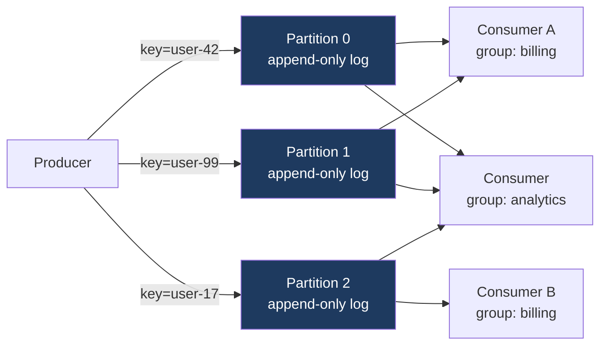
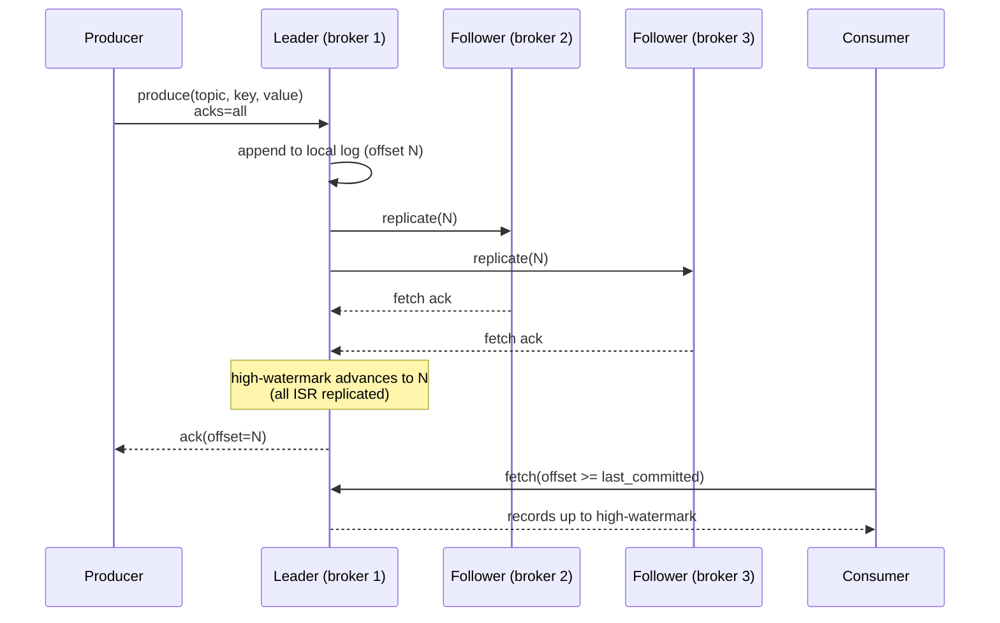
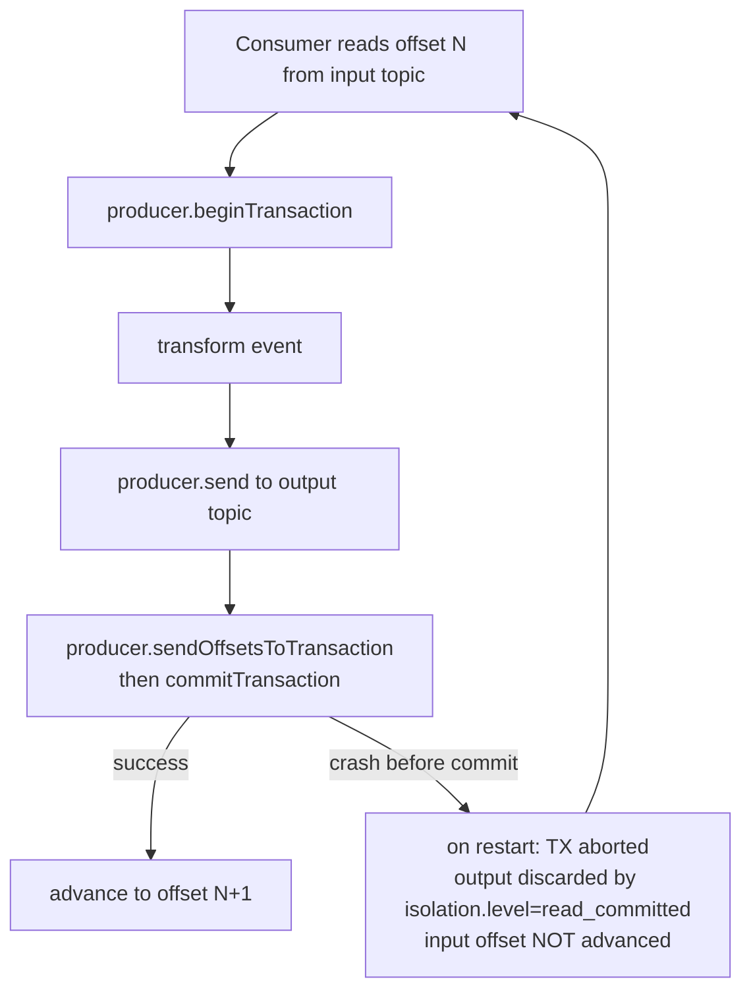

# Event Logs (Kafka / Pulsar)

## Why This Exists

**Problem.** Traditional message queues (RabbitMQ, SQS, ActiveMQ) treat messages as transient: a consumer ACKs, the broker deletes. That breaks the moment you need (a) multiple independent consumers reading the same stream at their own pace, (b) replay after a bug or schema migration, (c) ordering guarantees stronger than per-queue FIFO, or (d) backpressure that doesn't drop data when a consumer is slow. Worse, "exactly-once" in a queue usually means "at-least-once + idempotent consumer," which pushes hard correctness problems onto every team.

**Key insight.** A **partitioned, append-only log** inverts the model: the broker stores an immutable sequence of events on disk, indexed by offset. Consumers track their own position. Messages aren't deleted on read — they age out by retention policy or are compacted to "latest value per key." This single primitive subsumes pub/sub, queue, change-data-capture, event-sourcing replay, and stream-processing input — at the cost of operational complexity (rebalancing, ISR, partition planning) and a learning curve for transactional/EOS semantics.

**Reach for this when:**
- You need **multiple consumer groups** reading the same stream independently (e.g., billing service, fraud detector, data warehouse).
- You need **replayability** — after a deploy bug, reset offset to yesterday and reprocess. Queues can't do this; the data is gone.
- You need **per-key ordering** at high throughput (per-partition ordering with key-based partitioning).
- You're building **event-sourced** systems, **CDC pipelines** (Debezium → Kafka), or **stream processing** (Flink, Kafka Streams, ksqlDB).
- You need **exactly-once semantics** end-to-end across a Kafka-to-Kafka pipeline (transactions + idempotent producer).
- Throughput exceeds what queues handle gracefully (10k–10M msg/s per cluster is routine on Kafka).

**Don't reach for this when:**
- You have **<1k msg/s**, no replay need, no fan-out — SQS or RabbitMQ is simpler and cheaper. Don't run a 3-broker cluster for a sidecar workload.
- You need **per-message TTL** and dead-letter routing as first-class semantics — RabbitMQ/SQS handle this natively; Kafka does not.
- You need **priority queues** or **delayed messages** — Kafka has no priority, and delays are awkward (ksqlDB scheduled tasks, or Pulsar's delayed delivery).
- You need **request/response RPC** — use gRPC. Kafka is one-way pub/sub.
- You can't afford the **operational tax** (ZooKeeper or KRaft quorum, broker JVM tuning, partition rebalancing, schema registry, MirrorMaker for DR). Confluent Cloud / MSK / StreamNative cloud reduce this but don't eliminate it.

## Diagrams

**Topic, partitions, consumer groups — the core mental model:**



Two consumer groups read independently. Within `billing`, partitions are split across consumers (max parallelism = partition count). Each event with key `user-42` always lands on the same partition, preserving per-user order.

**Producer write path with replication and ISR:**



If a follower falls behind (replica.lag.time.max.ms exceeded), the leader **shrinks the ISR** — alarm-worthy, often the first signal of a sick broker.

**Exactly-once semantics with transactions (read-process-write):**



The atomic unit is `{output write, input offset commit}`. Consumers downstream must set `isolation.level=read_committed` or they will see aborted records.

## Core Concepts and Patterns

### 1. The log is the source of truth

A Kafka **partition** is a sequence of records on disk. Each record has an **offset** (monotonically increasing 64-bit integer), a key, a value, headers, and a timestamp. The broker doesn't care what's in the value — bytes are bytes. Schemas live in a separate **Schema Registry** (Confluent SR, Apicurio) referenced by ID in the message header.

Records are **never updated, never deleted by the consumer**. They age out by:
- **Time-based retention** (`retention.ms`, default 7 days): old segments are deleted.
- **Size-based retention** (`retention.bytes`): cap per-partition disk usage.
- **Log compaction** (`cleanup.policy=compact`): retain only the latest record per key. Used for changelog topics, KTables, and "current state" feeds. A `null` value is a **tombstone** — compaction eventually removes the key entirely.

You can also set `cleanup.policy=compact,delete` to bound compacted topics by time/size.

### 2. Partitioning determines parallelism and ordering

- **Ordering is per-partition only.** No global order across a topic. If you need it, use 1 partition (and accept low throughput).
- **Partition count = max consumer parallelism within a group.** 12 partitions → at most 12 active consumers in one group. More consumers than partitions = idle consumers.
- **Choose partition count carefully.** You can increase partitions later, but it **breaks key-based ordering** (a key may now hash to a different partition). Plan for 2–3x current throughput.
- **Default partitioner** = `murmur2(key) % num_partitions`. Pulsar uses similar key-shared semantics.
- **Hot partitions** are the #1 throughput killer. If 80% of traffic has key = `tenant=BIG_CUSTOMER`, one broker burns. Mitigation: composite keys, custom partitioner, or sticky-batch round-robin for null-key records.

### 3. Producer semantics — idempotence and acks

```python
from confluent_kafka import Producer

producer = Producer({
    'bootstrap.servers': 'kafka-1:9092,kafka-2:9092,kafka-3:9092',
    # acks=all: leader waits for all in-sync replicas. Survives broker loss.
    # acks=1: leader-only. Fast but loses data if leader dies before replication.
    # acks=0: fire-and-forget. Use only for metrics where loss is acceptable.
    'acks': 'all',
    # Idempotent producer dedups retries by (producer-id, sequence-number).
    # Required for exactly-once. Cost: minor throughput overhead.
    'enable.idempotence': True,
    # max.in.flight <= 5 required when idempotence is on (pre-2.0 it was 1).
    'max.in.flight.requests.per.connection': 5,
    # Retries: with idempotence, set to high value. Without, retries can reorder.
    'retries': 2_147_483_647,
    # Compression: zstd or lz4 are the default modern choices. snappy is older.
    'compression.type': 'zstd',
    # Batching: larger batches = better throughput, higher latency.
    'linger.ms': 10,
    'batch.size': 131072,  # 128 KiB
})

def delivery_report(err, msg):
    if err is not None:
        # CRITICAL: a callback error after retries are exhausted means the
        # record was NOT durably written. Don't ack the upstream source until
        # this fires successfully.
        log.error(f"delivery failed: {err}, topic={msg.topic()}, key={msg.key()}")
        # Push to a DLQ topic, or panic and let the upstream retry.
    else:
        log.debug(f"delivered offset={msg.offset()} partition={msg.partition()}")

# Per-key ordering: same user_id always goes to same partition.
producer.produce(
    topic='payments',
    key=str(payment.user_id).encode(),
    value=serialize(payment),
    on_delivery=delivery_report,
)
producer.poll(0)  # serve callbacks; do this every produce, not just at end
producer.flush(timeout=30)  # at shutdown — wait for all in-flight
```

**Pitfall: forgetting `acks=all`.** With `acks=1` the leader can ack a write, then crash before replication, and the next leader has no record of it. Confluent's default has been `acks=all` since v3.0 of the Java client, but older clients and many tutorials still default to `acks=1`. Always set it explicitly.

### 4. Transactional producer + transactional consumer = end-to-end EOS

The classic Kafka exactly-once use case is **read-process-write**: consume from topic A, transform, write to topic B, atomically with the offset commit.

```java
// Java producer config
props.put("enable.idempotence", true);
props.put("transactional.id", "payment-processor-pod-7");  // STABLE per pod
props.put("acks", "all");

// Consumer config
consumerProps.put("isolation.level", "read_committed");  // skip aborted TXs
consumerProps.put("enable.auto.commit", false);  // commit via TX, not auto

producer.initTransactions();

while (running) {
    ConsumerRecords<String, Payment> records = consumer.poll(Duration.ofMillis(500));
    if (records.isEmpty()) continue;

    producer.beginTransaction();
    try {
        for (var record : records) {
            var enriched = enrich(record.value());
            producer.send(new ProducerRecord<>("payments-enriched",
                record.key(), enriched));
        }
        // Atomically commit output writes AND consumer offsets in one TX.
        Map<TopicPartition, OffsetAndMetadata> offsets = currentOffsets(records);
        producer.sendOffsetsToTransaction(offsets, consumer.groupMetadata());
        producer.commitTransaction();
    } catch (ProducerFencedException e) {
        // Another instance with the same transactional.id started up.
        // We've been zombie-fenced. Exit; orchestrator will not restart us.
        throw e;
    } catch (KafkaException e) {
        // Transient. Abort and retry next loop.
        producer.abortTransaction();
    }
}
```

**Key correctness points:**
- `transactional.id` must be **stable per logical instance** (e.g., StatefulSet pod ordinal), not random per restart. Otherwise zombie fencing can't work.
- Downstream consumers MUST set `isolation.level=read_committed`. Default is `read_uncommitted` and they'll see aborted records.
- EOS is **only within Kafka**. If the transform writes to a database too, you need outbox pattern or 2PC-equivalent — see `../outbox/`.
- EOS is **not free**: ~3% throughput overhead, transaction coordinator on every commit, harder operational debugging (KIP-447 made it usable).

### 5. Consumer groups, offsets, and rebalancing

A **consumer group** is the unit of horizontal scaling. The group coordinator (a designated broker) assigns partitions to members. When membership changes (new pod, crashed pod, slow heartbeat), it triggers a **rebalance**.

```python
from confluent_kafka import Consumer, TopicPartition

consumer = Consumer({
    'bootstrap.servers': '...',
    'group.id': 'billing-processor-v2',
    # Where to start when no committed offset exists for this group:
    #   'earliest' = replay from beginning. Use for new groups doing backfill.
    #   'latest'   = only new records. Use for live, can't-miss-future feeds.
    'auto.offset.reset': 'earliest',
    # Manual commit. Don't auto-commit unless you're OK with at-most-once
    # (commit can happen before processing) or duplicates (after).
    'enable.auto.commit': False,
    # Cooperative rebalancing (KIP-429): only revokes partitions that need
    # reassignment, not all of them. MUCH less disruptive than the legacy
    # 'eager' protocol. Default in modern clients but verify.
    'partition.assignment.strategy': 'cooperative-sticky',
    # Heartbeat / session timing. Tune based on max processing time per batch.
    'session.timeout.ms': 45_000,
    'heartbeat.interval.ms': 3_000,
    # max.poll.interval.ms: if you don't call poll() within this, you're
    # considered dead. Default 5 min. If your batch processing is slower,
    # the group will eject you mid-batch. Common cause of rebalance storms.
    'max.poll.interval.ms': 300_000,
})

consumer.subscribe(['payments'])

try:
    while True:
        msg = consumer.poll(timeout=1.0)
        if msg is None:
            continue
        if msg.error():
            log.error(f"consumer error: {msg.error()}")
            continue

        try:
            process(msg)  # idempotent! we may see this record twice on retry
            # Commit *after* processing succeeds. At-least-once.
            consumer.commit(message=msg, asynchronous=False)
        except RetriableError:
            # Don't commit. Next poll will return the same record.
            # Add backoff to avoid hot-loop on poison messages.
            time.sleep(1)
        except PoisonMessageError:
            # Send to DLQ topic and commit so we don't get stuck.
            dlq_producer.produce('payments-dlq', value=msg.value())
            consumer.commit(message=msg, asynchronous=False)
finally:
    consumer.close()  # triggers final commit + group leave
```

**Rebalancing pitfalls:**
- A consumer that takes longer than `max.poll.interval.ms` to process a batch is ejected → rebalance → new owner replays from last commit → also takes too long → **rebalance storm**. Fix: shorter batches (`max.poll.records`), or process async with bounded queue.
- Long GC pauses in the JVM consumer trip session timeout. Tune G1 / use ZGC.
- A pod crashlooping (OOM, bad config) causes continuous rebalances. Cooperative sticky helps; circuit-break the deploy faster.

### 6. Log compaction — keep "latest value per key"

Compaction is the magic primitive behind Kafka Streams' KTables, change-data-capture, and "current state" topics.

```yaml
# Topic config for a compacted "user-profile" changelog
cleanup.policy: compact
min.cleanable.dirty.ratio: 0.5  # compact when >=50% of log is "dirty"
segment.ms: 86400000             # roll segments daily so head can be compacted
delete.retention.ms: 86400000    # tombstones live 24h before final removal
min.compaction.lag.ms: 0         # how long before a record is eligible
```

After compaction, replaying the topic from offset 0 yields the **current state** of every key. Tombstones (null value) eventually delete the key entirely — but only after `delete.retention.ms`. Consumers must handle nulls.

**Use compaction for:** user profiles, feature flags, configuration topics, stream-processing state changelogs, outbox tables published as CDC.

**Do NOT use compaction for:** event histories where every event matters (audit logs, financial transactions). You'll lose intermediate events.

### 7. Pulsar: the alternative architecture

Apache Pulsar shares the log abstraction but separates compute (brokers, stateless) from storage (BookKeeper bookies, stateful).

| Aspect | Kafka | Pulsar |
|---|---|---|
| Storage | Local disk per broker, replicated by leader | BookKeeper ledger, striped across bookies |
| Scaling brokers | Painful — partition rebalance moves data | Trivial — brokers are stateless |
| Topics per cluster | ~200k practical limit | Millions (multi-tenant first-class) |
| Geo-replication | MirrorMaker 2 (separate cluster) | Built-in, configurable per namespace |
| Tiered storage | Confluent Cloud / Kafka 3.6+ KIP-405 | Native (offload to S3 since 2.0) |
| Subscription models | Consumer groups only | Exclusive, shared, failover, key_shared |
| Maturity / ecosystem | Largest by far | Growing; strong in multi-tenant SaaS |

**Pulsar's `key_shared` subscription** is interesting: multiple consumers in one subscription share work, but messages with the same key always go to the same consumer (within a slice of the keyspace). Closer to per-key ordering without partition-count parallelism limits.

Pick Kafka by default. Pick Pulsar if you genuinely need millions of topics, easy geo-replication, or the BookKeeper model fits your ops better. **The decision should be based on operations, not features** — both can do most workloads.

### 8. Operational topology (production-grade Kafka)

```yaml
# Minimum production cluster
brokers: 3                     # tolerate 1 failure
replication.factor: 3          # default for new topics
min.insync.replicas: 2         # writes require 2 acks (leader + 1 follower)
unclean.leader.election: false # NEVER allow data loss leader election
zookeeper_or_kraft: kraft      # ZK is deprecated; KRaft GA in 3.3+

# Per-topic for critical data
retention.ms: 604800000        # 7 days
segment.ms: 86400000           # roll daily
compression.type: producer     # honor producer setting

# Disk
storage: local NVMe SSD        # XFS preferred; ext4 OK
disk_per_broker: >= 2x peak retention bytes
io_scheduler: none/noop
mount_options: noatime
```

`min.insync.replicas=2` + `acks=all` is the **durability contract**: a write is acked only after replication to ≥2 brokers; if only 1 ISR remains, producers get `NotEnoughReplicasException` and back off. **Without `min.insync.replicas` set, you can lose data even with `acks=all`** (if ISR has shrunk to just the leader, a leader crash loses unreplicated writes).

## Trade-offs

| Benefit | Cost |
|---|---|
| Durable, replayable event store; new consumers can backfill from offset 0 | Disk grows linearly with retention; tiered storage helps but adds complexity |
| Multiple independent consumer groups read same data without coordination | Operating a Kafka cluster (broker JVMs, ZK/KRaft, partition planning, schema registry) is a real ops burden |
| Per-key ordering at high throughput via partitioning | No global ordering across partitions; cross-partition workflows need explicit reconciliation |
| Exactly-once semantics within Kafka via idempotence + transactions | EOS adds latency, throughput overhead (~3%), and operational complexity (transactional.id management, fencing) |
| Decouples producers from consumers; producer doesn't care who reads | Schema evolution becomes a contract problem — needs schema registry + compatibility checks |
| High throughput (MB/s per partition, GB/s per cluster) on cheap hardware | Network and disk become the bottleneck quickly; partition count is a load-bearing decision you can't easily reverse |
| Compacted topics give you "current state" + history with one primitive | Compaction is eventual, not synchronous; consumers see intermediate values until compaction runs |
| Cooperative-sticky rebalancing minimizes disruption | Long-running consumer processing still trips `max.poll.interval.ms`; rebalance storms remain a top incident class |
| Industry-standard ecosystem (Connect, Streams, Flink, ksqlDB, Debezium) | Vendor lock-in is real — Confluent's commercial features (Tiered Storage, RBAC, Replicator) are open-core |

## Common Pitfalls

- **`acks=1` in production.** Default for many clients; loses data on leader crash before replication. Always set `acks=all` + `min.insync.replicas=2`.
- **Forgetting to set `min.insync.replicas`.** With it unset (default 1), `acks=all` degenerates to `acks=leader` when ISR shrinks. Silent data loss.
- **`unclean.leader.election.enable=true`.** Allows an out-of-sync replica to become leader, **deleting committed records** that weren't replicated. Never enable in financial / regulatory contexts. Confluent disabled it by default in 1.0.
- **Hot partition from skewed keys.** `tenant_id` as key, one tenant has 80% of traffic, one broker melts. Audit your key distribution; consider composite keys (`tenant_id + user_id`).
- **Increasing partition count breaks ordering.** Hash distribution changes, so messages for `key=K` may now go to a different partition than yesterday's. If you have ordered consumers, plan partition count carefully and pad upfront.
- **Rebalance storms.** A consumer batch takes longer than `max.poll.interval.ms`, gets kicked, rebalance triggers, new owner also slow, kicked, repeat. Fix: smaller `max.poll.records`, process async with backpressure, or extend the timeout (and accept slower failure detection).
- **Long GC pauses → consumer eviction.** JVM stops the world for 30s, session times out, group rebalances. Use ZGC / G1 with tuned heap; monitor `kafka.consumer.records-lag-max`.
- **ISR shrink unhandled.** A broker is slow (network, disk, GC) → falls behind → ejected from ISR → durability quietly degrades. Alarm on `UnderReplicatedPartitions > 0`.
- **Consumer lag treated as point-in-time.** Lag is meaningful as a derivative — is it growing? A flat 10M lag during backfill is fine; lag growing 1k/s during steady state is an outage.
- **Producer `flush()` skipped at shutdown.** Async produce returns before broker ack. SIGTERM, in-flight records lost. Always `flush(timeout)` and check the delivery report.
- **`enable.auto.commit=true` with manual processing.** Auto-commit fires on a timer and may commit offsets for records you haven't processed yet. Result: messages "processed" without ever running. Disable for any non-trivial consumer.
- **Treating Kafka like a database.** Random access by key isn't supported. You read sequentially. Need point lookups → consume into KTable / RocksDB / Postgres.
- **No schema registry, JSON-only.** Day 1 it works. Day 90, a producer adds a field, downstream Spark job NPEs in production. Use Avro/Protobuf with a registry and compatibility rules (`BACKWARD` is the safe default).
- **Mixing `transactional.id` across instances.** Two pods using the same `transactional.id` → zombie fencing → one of them perpetually `ProducerFenced`. Tie ID to pod ordinal in StatefulSet.
- **DLQ that nobody reads.** Routing poison messages to a `*-dlq` topic is fine; if you don't alarm on its size and triage, you're losing data with extra steps.
- **Cross-DC replication assumed identical.** MirrorMaker 2 replays records but offsets are not preserved across clusters. Failing over consumers requires offset translation (Confluent Replicator or MM2's offset sync topic).
- **Tiered storage as a magic answer.** Yes, it offloads cold segments to S3. No, it doesn't make queries faster, and it adds a failure mode (S3 throttling → broker stalls).

## Decision Table

| Situation | Choice | Why |
|---|---|---|
| Many consumers need same data, replay required, >5k msg/s | **Kafka** | Core sweet spot — replayability, fan-out, throughput |
| Single consumer, <500 msg/s, no replay, want simple ops | **SQS / RabbitMQ** | Don't pay Kafka tax for queue-shaped work |
| Need delayed messages, priority queues, complex routing | **RabbitMQ** | First-class features Kafka lacks |
| Millions of low-volume topics (per-tenant SaaS) | **Pulsar** | Kafka tops out ~200k topics; Pulsar designed for this |
| Need built-in geo-replication across regions | **Pulsar** or **Kafka + MirrorMaker2** | Pulsar native; Kafka workable but operationally heavier |
| Event sourcing as system of record | **Kafka with infinite retention + tiered storage** | Compaction + retention give you state + history |
| CDC from DB to multiple sinks | **Kafka + Debezium** | Industry standard; Connect ecosystem |
| Real-time analytics over a stream | **Kafka + Flink** (or Kafka Streams for JVM-only) | Stateful stream processing on top of the log |
| Need exactly-once across Kafka → Postgres | **Kafka transactions + outbox pattern** | EOS is Kafka-internal only; cross-system needs outbox or idempotency keys |
| In-process pub/sub (single binary, microservices later) | **In-memory channel / NATS / Redis Streams** | Don't run Kafka for one process; reach for it when you actually fan out |
| Audit log of all state changes, immutable | **Kafka, no compaction, long retention** | Compaction would destroy intermediate states |
| Last-known-value cache fed from a stream | **Kafka compacted topic + KTable** | Compaction is exactly this primitive |
| Workflow with retries, timeouts, multi-step orchestration | **Temporal / Cadence** | Kafka isn't a workflow engine; don't build one on top |

## References

- Apache Kafka — *Kafka Documentation: Design, Replication, Log Compaction* — https://kafka.apache.org/documentation/#design
- Apache Kafka — *Kafka Documentation: Configuration (broker, producer, consumer)* — https://kafka.apache.org/documentation/#configuration
- Confluent — *Kafka Transactions and Exactly-Once Semantics* — https://docs.confluent.io/kafka/design/transactions.html
- Confluent — *Idempotent Producer* — https://docs.confluent.io/platform/current/installation/configuration/producer-configs.html#enable-idempotence
- Confluent — *Consumer Configuration Reference* — https://docs.confluent.io/platform/current/installation/configuration/consumer-configs.html
- Confluent — *Log Compaction* — https://docs.confluent.io/platform/current/kafka/design.html#log-compaction
- Confluent Engineering Blog — Wang, G. — *Apache Kafka Made Simple: A First Glimpse of a Kafka Without ZooKeeper* (KRaft) — https://www.confluent.io/blog/kafka-without-zookeeper-a-sneak-peek/
- Confluent Engineering Blog — Wang, G. — *Enabling Exactly-Once in Kafka Streams* — https://www.confluent.io/blog/enabling-exactly-once-kafka-streams/
- Confluent Engineering Blog — Wang, G., Hartmann, J. — *Apache Kafka Supports 200K Partitions Per Cluster* — https://www.confluent.io/blog/apache-kafka-supports-200k-partitions-per-cluster/
- KIP-98 — *Exactly-Once Delivery and Transactional Messaging* — https://cwiki.apache.org/confluence/display/KAFKA/KIP-98+-+Exactly+Once+Delivery+and+Transactional+Messaging
- KIP-429 — *Kafka Consumer Incremental Rebalance Protocol* (cooperative-sticky) — https://cwiki.apache.org/confluence/display/KAFKA/KIP-429%3A+Kafka+Consumer+Incremental+Rebalance+Protocol
- KIP-447 — *Producer scalability for exactly-once semantics* — https://cwiki.apache.org/confluence/display/KAFKA/KIP-447%3A+Producer+scalability+for+exactly+once+semantics
- KIP-405 — *Kafka Tiered Storage* — https://cwiki.apache.org/confluence/display/KAFKA/KIP-405%3A+Kafka+Tiered+Storage
- Apache Pulsar — *Concepts and Architecture* — https://pulsar.apache.org/docs/concepts-architecture-overview/
- Apache Pulsar — *Messaging: subscription types* — https://pulsar.apache.org/docs/concepts-messaging/#subscription-types
- Kreps, J. — *The Log: What every software engineer should know about real-time data's unifying abstraction* — https://engineering.linkedin.com/distributed-systems/log-what-every-software-engineer-should-know-about-real-time-datas-unifying
- Kleppmann, M. — *Designing Data-Intensive Applications* — ch. 11 "Stream Processing" (esp. "Logs as Message Brokers", "Databases and Streams"); ch. 5 "Replication"; ch. 9 "Consistency and Consensus" for ISR/leader-election context.
- Wampler, D. — *Fast Data Architectures for Streaming Applications* (O'Reilly, 2nd ed.) — chs. 2–3 on log-centric architectures.
- Narkhede, N., Shapira, G., Palino, T. — *Kafka: The Definitive Guide* (O'Reilly, 2nd ed.) — chs. 3–4 (producer/consumer), ch. 6 (reliability), ch. 8 (exactly-once).
- Google SRE Workbook — *Managing Load* — https://sre.google/workbook/managing-load/ (consumer-lag and backpressure framing)
- AWS Builders' Library — Vogels, W. et al. — *Avoiding fallback in distributed systems* — https://aws.amazon.com/builders-library/avoiding-fallback-in-distributed-systems/
- Helland, P. — *Immutability Changes Everything* (CIDR 2015) — https://www.cidrdb.org/cidr2015/Papers/CIDR15_Paper16.pdf
- Fowler, M. — *Event Sourcing* — https://martinfowler.com/eaaDev/EventSourcing.html
- Colyer, A. (the morning paper) — *Kafka, Samza and the Unix Philosophy of Distributed Data* — https://blog.acolyer.org/2016/04/06/kafka-samza-and-the-unix-philosophy-of-distributed-data/

## See Also

- `../outbox/` — exactly-once across Kafka and a relational database via the outbox pattern; resolves the EOS gap when state lives outside Kafka.
- `../cdc/` — Debezium → Kafka; turning a database into a stream of events.
- `../stream-processing/` — Flink / Kafka Streams / ksqlDB on top of event logs.
- `../../communication/message-queues/` — when SQS / RabbitMQ is the right answer instead of a log.
- `../../architecture-patterns/event-sourcing/` — event-as-source-of-truth pattern that often consumes a Kafka topic.
- `../schema-evolution/` — Avro / Protobuf + Schema Registry, compatibility modes.
- `../../communication/idempotency/` — required for safe at-least-once consumption; foundational pattern for any consumer.
- `../../communication/backpressure/` — bounding consumer queues to avoid OOM under lag.
- `../../reliability/circuit-breaker/` — protecting downstream systems when consumers fan out to RPC calls.
- `../../performance/use-red-methods/` — what to alarm on (lag, ISR, under-replicated partitions, request rate).
- `../consensus/` — KRaft / ZooKeeper context; why metadata needs consensus and data doesn't.
