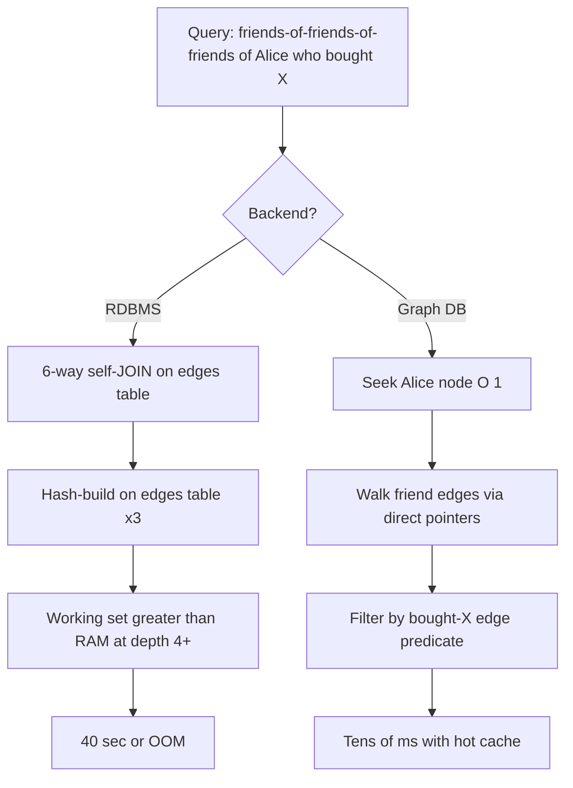
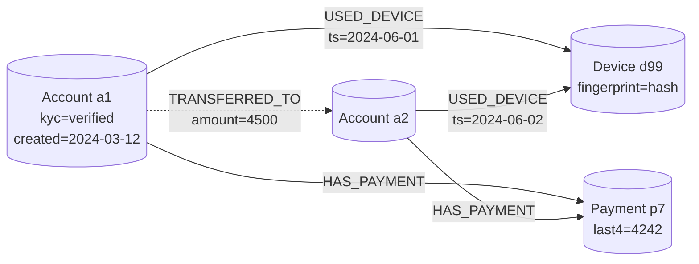
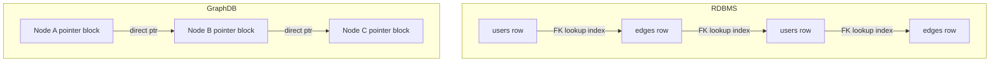
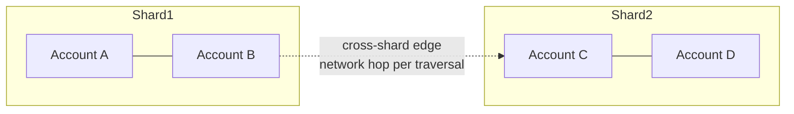

# Graph Databases

## Why This Exists

**Problem.** Relational databases store relationships as foreign keys, and traversing them at query time means JOINs. JOINs are O(N·M) without indexes and O(N log M) with them — and **every additional hop multiplies the cost**. A 6-hop "find all accounts that share a device, IP, or payment method with this fraud ring" query in Postgres becomes a recursive CTE that scans millions of rows, allocates gigabytes of working memory, and may never return. The same query in a property graph DB is a localized traversal: O(K) where K is the size of the connected subgraph, *independent of total table size*.

**Key insight.** Graph databases store edges as **first-class, pre-materialized pointers** between nodes. Following an edge is O(1) — no index probe, no hash join, no row reconstruction. This is called *index-free adjacency* (Neo4j's term) and it is the entire reason graph DBs exist. RDBMS pay the cost of reconstructing relationships at every query; graph DBs pay it once at write time.

**Reach for this when:**
- You traverse **3+ hops** routinely and the answer set is small relative to the total dataset (fraud rings, social neighborhoods, supply-chain blast radius).
- The shape of the question is *"find a pattern of relationships"* — triangles, paths, cycles, shortest path, communities.
- You have **highly variable connectivity** (some nodes with 10 edges, some with 10M) and recursive SQL on those hubs is unworkable.
- You're doing **identity resolution** / entity merging across many weak signals (email, phone, device, IP, payment).
- You need a **knowledge graph** with heterogeneous node/edge types and ad-hoc schema evolution.

**Don't reach for this when:**
- Most queries are aggregations over scalar columns (`SUM(revenue) GROUP BY region`). Use a columnar store or OLTP RDBMS.
- Relationships are shallow (1–2 hops, fixed). A well-indexed RDBMS or document store is simpler, cheaper, and faster.
- You need ACID across millions of writes/sec with strict horizontal scale-out. Graph DBs are notoriously hard to shard; most "distributed" graph DBs trade off consistency or pay huge cross-partition latency.
- Your data is fundamentally tabular and "graphy" is a mental model, not a physical one. Don't pay graph-DB ops cost for `users → orders → items`; that's just a normalized RDBMS.
- You need mature SQL tooling — BI dashboards, ORMs, regulatory reporting. The ecosystem around Cypher/Gremlin/SPARQL is thinner.

## Diagrams

### Why traversal beats JOINs



### Property graph data model



### Index-free adjacency vs RDBMS storage



## Property Graph vs RDF

There are two dominant data models. Pick deliberately — they are not interchangeable.

| Aspect | Property Graph (Neo4j, JanusGraph, Memgraph, Neptune-PG) | RDF / Triple Store (Neptune-RDF, GraphDB, Stardog, Blazegraph) |
|---|---|---|
| Atom | Node and edge with key/value properties | `<subject> <predicate> <object>` triple (or quad with named graph) |
| Schema | Optional labels and types; flexible | Open-world, ontology-driven (OWL, RDFS, SHACL) |
| Query language | Cypher (Neo4j), Gremlin (TinkerPop), GQL (ISO 2024) | SPARQL (W3C standard) |
| Inference | Manual / via algorithms | Built-in via RDFS/OWL reasoners |
| Typical use | Operational graphs, fraud, recsys, social | Knowledge graphs, semantic web, regulatory ontologies, life sciences |
| Edge properties | Native (e.g. `[:PAID {amount: 100}]`) | Awkward — requires reification or RDF-star |
| Federation | Weak | Strong (SPARQL federation across endpoints) |

**Default to property graph for operational workloads.** Pick RDF only when you have a real ontology requirement, regulatory semantic standards (HL7 FHIR-RDF, schema.org, life-sciences vocabs), or cross-organization data interchange.

## Query Languages — Side by Side

The same question — *"Find pairs of accounts that share a device AND a payment method, where one has been flagged"* — across the three big query languages.

### Cypher (Neo4j, Memgraph, AuraDB)

```cypher
// Cypher reads like ASCII-art of the pattern you want.
// () = node, [] = edge, -> = direction.
MATCH (a1:Account)-[:USED_DEVICE]->(d:Device)<-[:USED_DEVICE]-(a2:Account),
      (a1)-[:HAS_PAYMENT]->(p:Payment)<-[:HAS_PAYMENT]-(a2)
WHERE a1.id < a2.id           // dedupe symmetric pairs
  AND (a1.flagged OR a2.flagged)
RETURN a1.id, a2.id, d.fingerprint, p.last4
LIMIT 100;
```

### Gremlin (TinkerPop — JanusGraph, Neptune, Cosmos DB)

```groovy
// Gremlin is imperative traversal; you compose steps.
// More verbose than Cypher but works across many backends.
g.V().hasLabel('Account').as('a1')
  .out('USED_DEVICE').as('d')
  .in('USED_DEVICE').as('a2')
  .where('a1', neq('a2'))
  .where('a1', lt('a2')).by('id')          // dedupe
  .select('a1').out('HAS_PAYMENT').as('p')
  .select('a2').out('HAS_PAYMENT').where(eq('p'))
  .or(__.select('a1').has('flagged', true),
      __.select('a2').has('flagged', true))
  .select('a1', 'a2', 'd', 'p').by('id').by('fingerprint').by('last4')
  .limit(100)
```

### SPARQL (RDF triple stores)

```sparql
# SPARQL is declarative pattern matching over triples.
PREFIX :     <http://example.org/>
PREFIX xsd:  <http://www.w3.org/2001/XMLSchema#>

SELECT ?a1 ?a2 ?device ?payment WHERE {
  ?a1 :usedDevice ?device .
  ?a2 :usedDevice ?device .
  ?a1 :hasPayment ?payment .
  ?a2 :hasPayment ?payment .
  FILTER (str(?a1) < str(?a2))
  { ?a1 :flagged true } UNION { ?a2 :flagged true }
}
LIMIT 100
```

**Takeaway.** Cypher is the most readable for property-graph patterns. Gremlin is the most portable (TinkerPop is a vendor-neutral abstraction). SPARQL wins when you have a real ontology and need RDFS/OWL reasoning. ISO standardized **GQL** in 2024 — long-term it should converge with Cypher, but adoption is early.

## Multi-Hop Traversal: When Graph Beats SQL Recursive CTEs

The classic motivating example. We want all accounts within N hops of a known fraud account, via any of {shared device, shared payment, transfer}.

### SQL recursive CTE (Postgres) — what people try first

```sql
-- This works. It is also a memory bomb at depth 4+.
-- Cost grows roughly as (avg-fanout)^depth; hot nodes (a device used by 100k accounts)
-- explode the working set. Postgres has no built-in cycle detection until PG14
-- (CYCLE clause), and even with it you allocate the full result set in memory.
WITH RECURSIVE ring AS (
  SELECT id, 0 AS depth, ARRAY[id] AS path
  FROM accounts
  WHERE id = :seed_account_id

  UNION ALL

  SELECT a.id, r.depth + 1, r.path || a.id
  FROM ring r
  JOIN edges e
    ON e.src = r.id
    OR e.dst = r.id   -- undirected; this OR is a query-planner trap
  JOIN accounts a
    ON a.id = CASE WHEN e.src = r.id THEN e.dst ELSE e.src END
  WHERE r.depth < 5
    AND NOT a.id = ANY(r.path)   -- cycle break
)
SELECT DISTINCT id FROM ring;
```

**Why this hurts:**
- The `OR` on `e.src = r.id OR e.dst = r.id` defeats most planners — you'll see seq scans.
- The `path` array is materialized per row; at depth 5 with fanout 50, you have ~300M rows, each with a 6-element array.
- No bidirectional BFS: you can't search from both ends and meet in the middle.
- No early termination: even with `LIMIT 100`, the executor often expands the entire frontier first.
- Indexing strategy is brutal: you need `(src)`, `(dst)`, and ideally `(src, edge_type)` and `(dst, edge_type)`.

### Cypher equivalent — same logic, vastly cheaper

```cypher
// Variable-length pattern: 1..5 hops over any of three relationship types.
// Neo4j executes a bidirectional BFS when both endpoints are anchored;
// for an open expansion (one anchor) it streams results without materializing
// the full frontier.
MATCH (seed:Account {id: $seedId})
MATCH path = (seed)-[:USED_DEVICE|HAS_PAYMENT|TRANSFERRED_TO*1..5]-(other:Account)
WHERE other <> seed
RETURN DISTINCT other.id, length(path) AS hops
ORDER BY hops
LIMIT 500;
```

**For shortest path specifically, use the dedicated operator:**

```cypher
// Neo4j uses bidirectional BFS internally — O(b^(d/2)) instead of O(b^d).
MATCH (a:Account {id: $a}), (b:Account {id: $b})
MATCH p = shortestPath((a)-[:USED_DEVICE|HAS_PAYMENT|TRANSFERRED_TO*..6]-(b))
RETURN p;
```

### Gremlin equivalent (JanusGraph)

```groovy
// repeat()/until()/times() loop. emit() yields each hop.
// path().simplePath() prevents revisiting nodes in this traversal.
g.V().has('Account', 'id', seedId)
  .repeat(both('USED_DEVICE', 'HAS_PAYMENT', 'TRANSFERRED_TO').simplePath())
  .times(5)
  .emit()
  .dedup()
  .limit(500)
  .valueMap('id')
```

### Real-world cost numbers (order of magnitude)

These are illustrative — your mileage will vary by hardware, fanout, and indexes — but the *ratios* are stable across many published benchmarks (LDBC SNB, vendor whitepapers).

| Hops | Postgres recursive CTE (10M edges) | Neo4j (10M edges, hot cache) |
|---|---|---|
| 1 | 5 ms | 1 ms |
| 2 | 50 ms | 3 ms |
| 3 | 800 ms | 10 ms |
| 4 | 12 s | 40 ms |
| 5 | OOM / timeout | 200 ms |
| 6 | — | 1 s |

The crossover where graph DBs decisively win is around **3 hops with non-trivial fanout**. At 1–2 hops, a well-indexed RDBMS is competitive and may even win on raw single-query latency due to mature query planning and SIMD-aware joins.

## Operational Patterns

### Identity resolution / entity merging

```cypher
// Merge two accounts that share strong identity signals.
// The MERGE operator is "match-or-create" — idempotent.
// Use ON CREATE / ON MATCH to set properties only on the relevant branch.
MATCH (a1:Account {id: $id1}), (a2:Account {id: $id2})
WHERE a1 <> a2
MERGE (a1)-[r:SAME_PERSON_AS {confidence: $conf}]-(a2)
ON CREATE SET r.created = datetime(), r.signals = $signals
ON MATCH  SET r.confidence = CASE WHEN r.confidence < $conf THEN $conf ELSE r.confidence END,
              r.signals = r.signals + $signals;
```

Then a periodic **community detection** pass (Louvain, Leiden, weakly-connected-components) clusters connected `SAME_PERSON_AS` subgraphs into a canonical identity. This is the production pattern at most large fraud/identity teams.

### Fraud ring detection — circular money flow

```cypher
// Find money cycles of length 3..6 where total flow exceeds threshold.
// Cycles are notoriously hard in SQL; trivial in Cypher.
MATCH cycle = (a:Account)-[t:TRANSFERRED_TO*3..6]->(a)
WITH cycle, [r IN relationships(cycle) | r.amount] AS amounts
WHERE reduce(s = 0, x IN amounts | s + x) > 10000
RETURN [n IN nodes(cycle) | n.id] AS ring,
       reduce(s = 0, x IN amounts | s + x) AS total
ORDER BY total DESC
LIMIT 20;
```

### Recommendations — collaborative filtering as a graph walk

```cypher
// "Users who bought what I bought also bought..."
// This is a 3-hop graph walk; in SQL it's a 3-way self-join + GROUP BY.
MATCH (me:User {id: $userId})-[:PURCHASED]->(item:Item)
       <-[:PURCHASED]-(peer:User)-[:PURCHASED]->(rec:Item)
WHERE NOT (me)-[:PURCHASED]->(rec)
  AND me <> peer
RETURN rec.id, count(DISTINCT peer) AS strength
ORDER BY strength DESC
LIMIT 20;
```

### Permission/blast-radius queries

```cypher
// "If account X is compromised, what resources are reachable?"
// Single query replaces an entire IAM-graph-walking microservice.
MATCH (compromised:Principal {id: $principalId})
MATCH path = (compromised)-[:CAN_ASSUME|HAS_PERMISSION|MEMBER_OF*1..8]->(resource:Resource)
RETURN DISTINCT resource.arn, [r IN relationships(path) | type(r)] AS via
LIMIT 1000;
```

## Backend Comparison

### Neo4j

The market leader. Native graph storage, mature Cypher implementation, GDS (Graph Data Science) library with PageRank, Louvain, node embeddings, and shortest paths.

**Strengths:** Best query planner of any graph DB. Battle-tested. Excellent Bolt driver ecosystem. Causal clustering for HA reads. Aura is the managed offering.

**Weaknesses:** Single-leader writes — write throughput caps at one node. "Fabric" and sharding stories are immature compared to RDBMS scale-out. AGPL/commercial licensing. Memory-hungry — page cache sizing is a real operational concern.

```python
# Idiomatic Python driver usage. Use parameterized queries (NEVER string-format
# user input into Cypher — same Cypher-injection risk as SQL injection).
from neo4j import GraphDatabase

driver = GraphDatabase.driver("neo4j+s://xxx.databases.neo4j.io",
                              auth=("neo4j", os.environ["NEO4J_PASS"]))

def find_fraud_ring(seed_id: str, max_hops: int = 5):
    # execute_read uses a read replica when available (causal cluster).
    with driver.session(database="neo4j") as session:
        result = session.execute_read(
            lambda tx: list(tx.run("""
                MATCH (seed:Account {id: $seed})
                MATCH (seed)-[:USED_DEVICE|HAS_PAYMENT*1..5]-(other:Account)
                WHERE other.flagged = true
                RETURN DISTINCT other.id AS id
                LIMIT 100
            """, seed=seed_id, max_hops=max_hops)))
        return [r["id"] for r in result]
```

### JanusGraph

Apache-licensed, distributed graph DB built on top of pluggable storage backends (Cassandra, ScyllaDB, HBase, BerkeleyDB) and indexing backends (Elasticsearch, Solr, Lucene). Speaks Gremlin via TinkerPop.

**Strengths:** Genuinely horizontally scalable — scales with the underlying storage. Open source, no vendor lock-in. Good for very large graphs (billions of edges) where Neo4j becomes painful.

**Weaknesses:** Operationally complex (you're running Cassandra + Elasticsearch + JanusGraph). Query planner is weaker — you'll hand-tune Gremlin traversals. Multi-hop traversals across storage shards pay network round-trips. No native Cypher.

### Memgraph

In-memory, Cypher-compatible. Wire-protocol-compatible with Neo4j's Bolt — drop-in replacement for many use cases.

**Strengths:** Latency. Streaming integrations (Kafka, Pulsar) for real-time graphs. Full Cypher support. Open core.

**Weaknesses:** In-memory means dataset must fit in RAM (or use disk-backed storage at significant perf cost). Smaller ecosystem than Neo4j.

### Amazon Neptune

Managed graph DB on AWS. Supports both **property graph** (Gremlin, openCypher) and **RDF** (SPARQL) modes — pick at cluster creation, can't switch.

**Strengths:** Managed. Multi-AZ. Integrates with IAM, VPC, KMS. Handles both data models.

**Weaknesses:** Closed source. Cypher support is openCypher subset (lags Neo4j). No GDS-equivalent algorithms library — you bring your own. Cost scales with instance size, not just storage.

### TigerGraph, ArangoDB, Dgraph

- **TigerGraph** — proprietary GSQL, extremely fast on deep multi-hop, strong analytical workloads, expensive.
- **ArangoDB** — multi-model (document + graph + key-value); good when graph is one of several data shapes.
- **Dgraph** — distributed, GraphQL-native, Apache 2.0; smaller community than Neo4j/JanusGraph.

## The Sharding Problem

Sharding a graph is **fundamentally harder than sharding a relational DB**. In a relational DB, you shard by a key (`user_id`) and most queries hit one shard. In a graph, an edge by definition crosses two nodes — if those live on different shards, every traversal step pays network cost.

### Why naive sharding fails



A 5-hop traversal that crosses shards 4 times pays 4× the latency of a single-shard traversal. With cloud network p99 of 1–5 ms, that's 5–25 ms of pure network on a query that should take 10 ms total.

### Sharding strategies (all have pain)

1. **Vertex partitioning by hash.** Simple, balanced, terrible for traversal locality.
2. **Edge-cut partitioning** (METIS, KaHIP). Minimizes cross-partition edges via graph-cut algorithms. Expensive to compute (O(V+E) at minimum), and graphs evolve — partitions degrade.
3. **Vertex-cut / edge partitioning** (PowerGraph, GraphX). Replicate hub vertices across partitions, partition edges. Better for power-law graphs (social, web). Adds replication consistency cost.
4. **Community-aware partitioning.** Run Louvain/Leiden, partition by community. Fits domain locality (a fraud ring stays on one shard) but requires periodic re-partitioning.

**Practical advice:** if you can keep your working graph under ~100B edges and on a single big-memory machine, do that. Vertical scaling is shockingly underrated for graph workloads. A single Neo4j instance on a 768GB-RAM box outperforms most distributed graph clusters for OLTP-style queries.

## Trade-offs

| Benefit | Cost |
|---|---|
| Multi-hop traversal in O(K) instead of O(N^hops) | Single-hop and aggregate queries are *slower* than RDBMS |
| Schema-flexible (add edge types without migration) | Same flexibility lets data quality rot — no enforced contracts unless you add Cypher constraints |
| Query language matches the mental model of the problem | Smaller talent pool; Cypher/Gremlin/SPARQL are niche skills |
| Index-free adjacency = fast | Edge writes are more expensive than RDBMS row inserts (must update both endpoints' adjacency lists) |
| Pattern matching is declarative and powerful | Query planners are 10+ years behind RDBMS planners; bad queries silently do full graph scans |
| Excellent for relationship-heavy use cases | Sharding is hard; horizontal write-scale is limited |
| Built-in algorithms (PageRank, community, shortest path) | These algorithms typically need the graph to fit in memory |
| Streaming integrations (Memgraph, Neo4j CDC) for real-time graphs | Bulk loading is slow; rebuilding from a backup of a 10B-edge graph can take hours-to-days |
| Knowledge-graph / semantic capabilities (RDF) | RDF reasoning is computationally expensive; ontologies are hard to maintain |

## Common Pitfalls

- **Modeling EVERYTHING as a graph.** Reflexively making `(:User)-[:HAS_NAME]->(:Name)` is *worse* than a property. Properties are for facts about a node; edges are for relationships between distinct entities. If you'd never query the `Name` node alone, it's a property.

- **Supernodes / hubs.** A node with 10M edges (the "United States" country node, a popular celebrity, a shared CDN IP) destroys traversal performance. Mitigation: type-partition edges (`:USED_DEVICE_2024`, `:USED_DEVICE_2025`), introduce intermediate aggregator nodes, or filter at the edge level using indexed edge properties.

- **Cartesian explosions in Cypher.** `MATCH (a), (b) WHERE ...` with no connecting pattern computes |A| × |B| nodes. Always anchor your pattern with edges. The query planner will warn — read the warnings.

- **No edge-property indexing.** Cypher `WHERE r.timestamp > $cutoff` over 100M edges does a full edge scan unless you've created an edge-property index (Neo4j 4.3+). Forgetting this is a top-3 cause of "the graph DB is slow" tickets.

- **Sharding pretending to be free.** Vendors will sell you "horizontal scale-out." Read the fine print: cross-shard transactions are usually NOT supported, or are eventually consistent, or pay 10–100× latency. Benchmark with your actual query shapes before committing.

- **Forgetting to limit variable-length paths.** `[:KNOWS*]` (no upper bound) on a connected graph runs forever. Always specify `*1..N` with a sane N, and if you're not sure, prefix with `LIMIT` and read the query plan.

- **Assuming graph DBs replace RDBMS.** They don't. Most production systems use a graph DB **alongside** a primary RDBMS or document store, with the graph maintained via CDC (Debezium → Kafka → graph upserts). The graph is a derived view optimized for relationship queries.

- **Ignoring the bulk-load problem.** Loading 1B edges via Cypher `CREATE` runs for days. Use `neo4j-admin import` (offline bulk loader), `LOAD CSV` with `USING PERIODIC COMMIT`, or the equivalent for your backend. Plan capacity for *initial* load, not just steady state.

- **Cypher injection.** Same risk as SQL injection. Always parameterize: `tx.run("MATCH (n {id: $id})", id=user_input)`, never `f"MATCH (n {{id: '{user_input}'}})"`.

- **No backup story.** Graph backups are large and slow. A logical export of a 10B-edge graph is impractical; you need filesystem-level snapshots (with the DB stopped or in backup mode). Test restore procedures *before* you need them.

- **Algorithmic queries on stale data.** PageRank, community detection, and shortest-path-on-weighted-graph are batch operations. Running them on every query is infeasible — materialize results into node properties on a schedule.

## Decision Table

| Use case | Recommended | Why not the alternatives |
|---|---|---|
| `users → orders → line_items`, fixed 2-hop, BI dashboards | **Postgres / MySQL** | Graph DB adds ops cost for no traversal benefit; SQL ecosystem is overwhelmingly stronger for BI |
| Fraud ring detection, 3–6 hop pattern queries, real-time | **Neo4j** | Postgres recursive CTE OOMs at depth 4+; Neo4j ships GDS algorithms |
| Identity resolution across 10+ weak signals | **Neo4j or Memgraph** | Graph clustering (connected components, Louvain) is built-in; SQL "merge by signal" rules become unmaintainable past ~5 signals |
| 10B+ edge graph, write-heavy, eventually consistent OK | **JanusGraph + Cassandra** or **Dgraph** | Neo4j single-leader writes cap throughput; managed Neptune is expensive at this scale |
| Knowledge graph with formal ontology, regulatory semantics | **RDF triple store** (Neptune-RDF, GraphDB, Stardog) | Property graph forces you to hand-roll inference; OWL/RDFS reasoners are mature |
| Recommendation engine, real-time personalization | **Memgraph** or **Neo4j + GDS** | RDBMS recursive CTEs too slow; vector DB doesn't capture relational structure |
| Social graph, billions of edges, Facebook-scale | **Custom solution** (TAO-style) or **JanusGraph + ScyllaDB** | Off-the-shelf graph DBs hit limits; this is the territory of bespoke systems (TAO, LinkedIn's LIquid) |
| Document/content store with occasional graph queries | **ArangoDB** or **MongoDB + $graphLookup** | Multi-model avoids dual-DB complexity for moderate graph workloads |
| AWS shop, want managed, mixed property-graph + RDF needs | **Neptune** | Avoids running both Neo4j and a triple store; trade-off is closed source and limited Cypher |
| Streaming graph (continuous Kafka updates, sub-second freshness) | **Memgraph** | Native streaming integration; Neo4j CDC works but is bolted-on |
| Single-digit-ms p99 on shallow lookups, no traversal | **Redis** or **DynamoDB** | Graph DB overhead not worth it; KV is faster for adjacency-list-as-set |
| Recursive org-chart / BOM (bill-of-materials) traversal, 4+ levels | **Neo4j** or **SQL Server hierarchyid** | Postgres recursive CTE works for shallow trees; graph DB wins past depth 4 with branching |

## References

- Robinson, Webber, Eifrem — *Graph Databases* (O'Reilly, 2nd ed.) — https://neo4j.com/graph-databases-book/
- Kleppmann — *Designing Data-Intensive Applications* — ch. 2 ("Graph-Like Data Models") and ch. 3 ("Storage and Retrieval"). The canonical comparison of property-graph vs RDF/triple-store data models.
- Neo4j — *Cypher Manual* — https://neo4j.com/docs/cypher-manual/current/
- Neo4j — *Graph Data Science Library* — https://neo4j.com/docs/graph-data-science/current/
- Apache TinkerPop — *Gremlin Reference* — https://tinkerpop.apache.org/docs/current/reference/
- W3C — *SPARQL 1.1 Query Language* — https://www.w3.org/TR/sparql11-query/
- W3C — *RDF 1.1 Concepts and Abstract Syntax* — https://www.w3.org/TR/rdf11-concepts/
- ISO — *GQL (Graph Query Language) ISO/IEC 39075:2024* — https://www.iso.org/standard/76120.html
- JanusGraph — *Documentation* — https://docs.janusgraph.org/
- Memgraph — *Documentation* — https://memgraph.com/docs
- Amazon Neptune — *User Guide* — https://docs.aws.amazon.com/neptune/latest/userguide/intro.html
- LDBC — *Social Network Benchmark (SNB)* — https://ldbcouncil.org/benchmarks/snb/ — the standard graph-DB benchmark; read the workload definitions before believing any vendor claim.
- Bronson et al. — *TAO: Facebook's Distributed Data Store for the Social Graph* (USENIX ATC 2013) — https://www.usenix.org/conference/atc13/technical-sessions/presentation/bronson — how Facebook scaled to a planet-sized social graph; the answer was *not* an off-the-shelf graph DB.
- Gonzalez et al. — *PowerGraph: Distributed Graph-Parallel Computation on Natural Graphs* (OSDI 2012) — https://www.usenix.org/conference/osdi12/technical-sessions/presentation/gonzalez — the canonical paper on vertex-cut partitioning for power-law graphs.
- Karypis & Kumar — *METIS: A Software Package for Partitioning Unstructured Graphs* — http://glaros.dtc.umn.edu/gkhome/views/metis — the workhorse graph-partitioning library.
- Pat Helland — *Immutability Changes Everything* (CIDR 2015) — https://www.cidrdb.org/cidr2015/Papers/CIDR15_Paper16.pdf — relevant for thinking about graph snapshots and append-only edge logs.
- Adrian Colyer / The Morning Paper — graph database paper roundup — https://blog.acolyer.org/?s=graph — many summaries of seminal graph systems papers.
- AWS Builders' Library — https://aws.amazon.com/builders-library/ — for the operational/reliability principles that apply to any data store.

## See Also

- `../time-series-db/` — when edges are events with time semantics (transfer logs, access logs)
- `../../performance/caching/` — graph queries benefit hugely from result caching at the BFF layer
