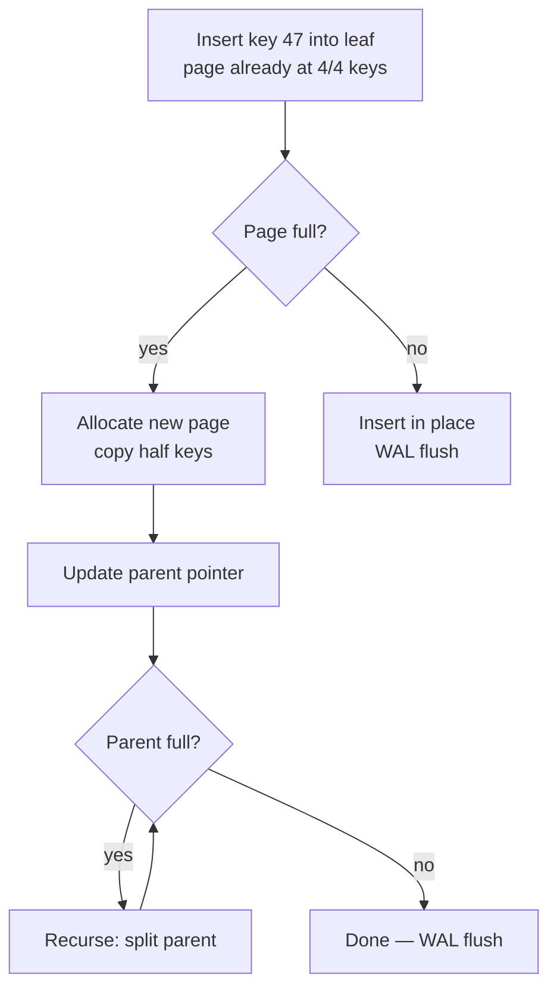
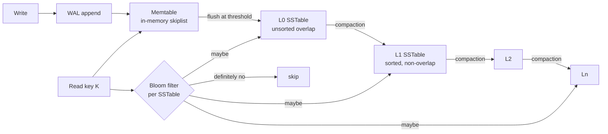
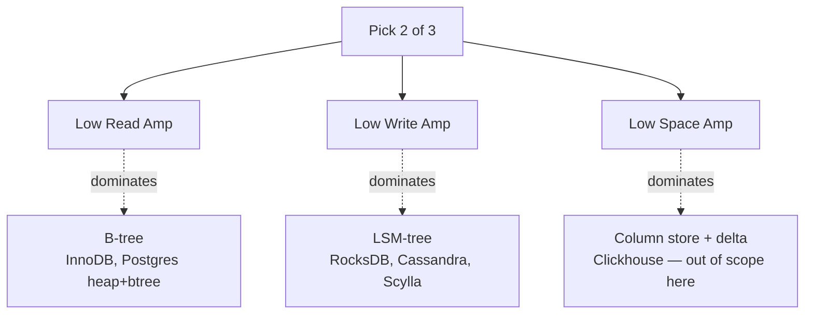

# Indexing: B-tree, LSM, Hash

## Why This Exists

**Problem.** A database without indexes does linear scans. A database with the *wrong* indexes does linear scans *and* pays write amplification. The choice between B-tree, LSM-tree, hash, and bitmap is not aesthetic — it determines whether your p99 read is 1 ms or 1 s, whether a write costs 1 IO or 30, and whether your storage bill is 100 GB or 1 TB for the same logical data.

**Key insight.** Every index is a **trade between read amplification, write amplification, and space amplification**. You can pick two; the third pays. B-trees minimize read amp at the cost of write amp (in-place updates, page splits, WAL). LSM-trees minimize write amp by buffering and batching, paying read amp (multiple SSTables per lookup) and CPU on compaction. Hash indexes give O(1) point lookups but cannot range-scan. Bitmap indexes are tiny and AND/OR fast, but only on low-cardinality columns and only when the table is mostly read-only.

**Reach for this when:**
- Picking a primary key strategy (clustered B-tree vs. heap + secondary).
- Choosing an OLTP engine (Postgres/MySQL/InnoDB vs. RocksDB/Cassandra/Scylla).
- A query is slow and you need to know whether the right index is *missing* or whether the planner is *ignoring* an existing one.
- Write throughput collapses as more secondary indexes are added.
- A column has skewed cardinality (NULL-heavy, status flags, tenant IDs) and a full B-tree is wasteful.

**Don't reach for this when:**
- The dataset fits in memory and is small enough that a hash map / skip list inside the application solves it. Don't bring a database to a Redis problem.
- The access pattern is "scan everything once" (ETL exports, snapshot dumps). An index here is pure write-cost.

DDIA ch. 3 ("Storage and Retrieval") is the canonical reference for everything below; cite it when convincing a teammate.

---

## Diagrams

### B-tree page split on insert



Page splits are the dominant cost of B-tree writes. Each split touches at least two pages plus one or more parent pages, all logged to WAL. This is why B-trees write-amplify and why bulk-loading wants `COPY` / sorted insert order, not row-by-row `INSERT`.

### LSM-tree write path and compaction



LSM read = memtable + N SSTables (worst case). Bloom filters keep the average case to ~1 disk read. Compaction is the tax that keeps N small.

### Read amp / write amp / space amp triangle



---

## B-tree (the default, for good reasons)

A B-tree is a balanced n-ary tree where every leaf is at the same depth. Internal nodes hold separator keys + child pointers; leaves hold key/value pairs (or key/row-id pairs for secondary indexes). Branching factor is typically 100–500 (a 4 KB or 8 KB page packed with keys), so a tree holding **billions** of keys is only 3–4 levels deep. Three levels means a point lookup is at most three random IOs, and the top two levels are almost always cached.

### Postgres: heap + B-tree secondary

Postgres stores table rows in an **unordered heap**. Every index — including the primary key — is a **secondary** B-tree pointing at heap tuple IDs (`ctid` = (page, offset)). This means:

- The PK index lookup is one B-tree descent + one heap fetch (two IO families).
- Updates that don't change indexed columns can use **HOT** (Heap-Only Tuple) updates and skip the index churn. This is the single biggest reason Postgres update throughput holds up under many indexes.
- `VACUUM` is necessary because MVCC writes new heap tuples, leaving dead ones to be reclaimed.

```sql
-- Postgres: a covering index (INCLUDE) avoids the heap fetch
CREATE INDEX idx_orders_user_created
  ON orders (user_id, created_at DESC)
  INCLUDE (status, total_cents);

-- This query is now an index-only scan: no heap touch
EXPLAIN (ANALYZE, BUFFERS)
SELECT status, total_cents
FROM orders
WHERE user_id = $1
ORDER BY created_at DESC
LIMIT 20;
-- Index Only Scan using idx_orders_user_created
--   Heap Fetches: 0   <-- the prize
```

The `INCLUDE` clause adds non-key columns to the leaf pages without making them part of the search key. **Caveat:** index-only scans still consult the visibility map, and pages with recent writes will fall back to heap fetches until the next `VACUUM`. If your `Heap Fetches:` is non-zero on a hot index, run `VACUUM (ANALYZE)`.

### MySQL InnoDB: clustered B-tree

InnoDB stores the *table itself* as a B-tree on the primary key. Leaves hold the full row. This means:

- Primary key lookups are **one** B-tree descent — no heap fetch.
- Secondary indexes hold `(secondary_key, primary_key)` and require a *second* B-tree descent (the PK B-tree) to fetch the row. This is the "double lookup" cost.
- Inserts in non-monotonic PK order (e.g., random UUIDv4) cause **page splits everywhere**. Sequential PKs (auto-increment, UUIDv7, ULID) keep all inserts at the rightmost leaf — minimal splits.

```sql
-- InnoDB: pick a PK that inserts append-only
CREATE TABLE orders (
  id BINARY(16) PRIMARY KEY,        -- UUIDv7 or ULID, NOT v4
  user_id BIGINT NOT NULL,
  created_at DATETIME(6) NOT NULL,
  status TINYINT NOT NULL,
  total_cents BIGINT NOT NULL,
  KEY idx_user_created (user_id, created_at DESC)
) ENGINE=InnoDB;

-- Anti-pattern: random UUID PK
-- CREATE TABLE orders (id BINARY(16) PRIMARY KEY, ...);
-- Inserting 10M rows with UUIDv4 PK can be 5-10x slower than UUIDv7
-- because every insert lands on a random leaf and splits it.
```

### B-tree write cost

Each insert does at minimum:
1. Root-to-leaf descent (cached, ~0 IO).
2. Leaf modify + WAL append (1 sequential write).
3. Page flush at checkpoint (1 random write, amortized).
4. **Per secondary index:** repeat the above on each one.

This is why "we added a fifth index and writes fell off a cliff" is a real and predictable failure mode. **Budget secondary indexes the same way you budget RAM.**

---

## LSM-tree (write-optimized)

The Log-Structured Merge-tree, formalized by O'Neil et al. (1996), buffers writes in memory and flushes them as immutable sorted files. RocksDB, LevelDB, Cassandra, Scylla, and HBase all use it. The write path is:

1. Append to **WAL** (sequential, durability).
2. Insert into **memtable** (in-memory sorted structure, typically a skiplist).
3. When memtable fills, flush as a sorted **SSTable** (Sorted String Table) to L0.
4. **Compaction** merges SSTables into larger, non-overlapping files at higher levels.

Reads check memtable, then each SSTable. **Bloom filters** make the per-SSTable check ~10 ns of CPU and ~1% false-positive rate, so the average read touches one disk SSTable.

### The compaction strategy decision

This is where most LSM tuning lives. RocksDB exposes the levers directly:

```cpp
// RocksDB: leveled compaction (default) — low space amp, higher write amp
rocksdb::Options options;
options.compaction_style = rocksdb::kCompactionStyleLevel;
options.level0_file_num_compaction_trigger = 4;
options.max_bytes_for_level_base = 256 * 1024 * 1024;  // L1 = 256 MB
options.max_bytes_for_level_multiplier = 10;            // L2 = 2.56 GB, L3 = 25.6 GB ...
// Write amp ≈ level_multiplier × num_levels ≈ 10 × 6 = ~60x in steady state

// Universal compaction — low write amp, higher space amp (up to ~2x)
options.compaction_style = rocksdb::kCompactionStyleUniversal;
// Better for write-heavy, append-mostly workloads (time-series, queues).

// Per-column-family bloom filters — non-negotiable
rocksdb::BlockBasedTableOptions table_options;
table_options.filter_policy.reset(rocksdb::NewBloomFilterPolicy(10, false));  // 10 bits/key, ~1% FP
table_options.cache_index_and_filter_blocks = true;
options.table_factory.reset(rocksdb::NewBlockBasedTableFactory(table_options));
```

**Rule of thumb (Facebook's published numbers, RocksDB blog 2017):**
- **Leveled**: write amp ~10-30x, space amp ~1.1x. Pick this for read-heavy or space-constrained workloads.
- **Tiered / Universal**: write amp ~3-5x, space amp ~2x. Pick this for write-heavy.

Cassandra calls these `LeveledCompactionStrategy` and `SizeTieredCompactionStrategy`. Scylla calls them the same plus `IncrementalCompactionStrategy` (its own innovation, lower write amp than leveled with similar space amp).

### LSM read amplification — the silent killer

Without bloom filters, a key lookup checks every SSTable that *could* hold the key. A range scan must merge across all of them. Symptoms of bloom-filter misconfiguration:

- p99 reads spike during compaction lulls (lots of L0 files, no bloom).
- `rocksdb.bloom.filter.useful` counter is low.
- CPU is high but disk IO is also high — you're paying for both.

Always enable bloom filters. Always size them for your workload (10 bits/key is the textbook starting point; raise to 16 if you're memory-rich and read-heavy).

### Tombstones and the deletion trap

LSM deletes write a **tombstone** — a marker that says "this key is dead." Tombstones live until compaction reaches them at the bottom level. **A workload that deletes a lot can have huge read amp** because every range scan has to walk past piles of tombstones.

Cassandra's `tombstone_warn_threshold` (default 1000) and `tombstone_failure_threshold` (default 100000) exist because someone, somewhere, ran `DELETE FROM events WHERE user_id = ?` and brought down a cluster.

---

## Hash indexes

A hash index maps keys to value locations via a hash function. **O(1) expected** point lookup, **O(n) range scan** (i.e., not supported). Variants:

- **In-memory hash table** (Redis, Memcached, Riak Bitcask): the entire index lives in RAM. Bitcask keeps the *keydir* (key → file offset) in RAM and the values on disk; this is the original "log-structured + hash index" pattern (DDIA ch. 3 walks through it).
- **On-disk hash index** (Postgres `USING hash`, BerkeleyDB hash): hash buckets stored as pages. Historically buggy in Postgres until v10 made them WAL-logged.
- **Linear hashing / extendible hashing**: handles bucket overflow without rehashing the whole table. Used in some embedded engines.

**When to actually use a hash index:**
- Equality-only lookups, no `<`, `>`, `BETWEEN`, `ORDER BY`.
- Very high cardinality (UUIDs, session tokens) where B-tree depth matters.
- The ratio of point-lookups to scans is overwhelming.

In practice, **modern Postgres B-trees are so close to hash index performance for point lookups that the hash index is rarely worth the loss of range support.** The exception is Bitcask-style stores where the entire keyspace fits in RAM and you want predictable single-IO writes.

---

## Clustered vs. secondary indexes

A **clustered index** stores the table data in the index leaf pages. A **secondary index** stores a pointer to the data.

| Engine | Primary | Secondary |
|---|---|---|
| **InnoDB (MySQL)** | Clustered B-tree on PK; leaves = full row | B-tree on (key, PK); needs second descent for full row |
| **Postgres** | Heap (unordered) + B-tree pointing at `ctid` | B-tree pointing at `ctid` |
| **SQL Server** | Clustered index optional (default on PK); leaves = full row | Non-clustered B-tree pointing at clustered key (or RID for heap) |
| **Cassandra/Scylla** | Partition key → SSTable position | Local secondary index per node (often anti-pattern; prefer materialized views) |
| **DynamoDB** | Hash (partition) or hash + range (sort) | LSI (same partition) or GSI (separate partition+sort) |

**Practical implications:**
- InnoDB secondary index lookup = 2 B-tree descents. If your secondary key already covers the query, *don't fetch the row* — use covering indexes (next section).
- Postgres secondary indexes are all "secondary" by InnoDB standards. The PK has no special leaf-storage privilege.
- Choosing the InnoDB clustered key is choosing the *physical sort order of the table*. Pick a key that matches your dominant range scan: timestamp for log-like data, tenant_id+id for multi-tenant.

---

## Covering indexes

A covering index includes every column the query needs in the index itself, so the engine never reads the underlying table.

```sql
-- Postgres
CREATE INDEX idx_orders_cover
  ON orders (user_id, created_at DESC)
  INCLUDE (status, total_cents);

-- MySQL (no INCLUDE; just put columns in the key — at the cost of larger keys)
CREATE INDEX idx_orders_cover
  ON orders (user_id, created_at, status, total_cents);
-- All four columns are in the key. Range scans on (user_id, created_at)
-- still work because of the leftmost-prefix rule.

-- SQL Server (has INCLUDE since 2005)
CREATE INDEX idx_orders_cover
  ON orders (user_id, created_at DESC)
  INCLUDE (status, total_cents);
```

**Trade:** larger index pages → more memory pressure → potentially slower writes. Don't reflexively cover every query; cover the **hot** ones (the ones in your p99 budget).

---

## Partial indexes

A partial index covers only rows matching a predicate. Smaller index, faster writes, faster reads on the matching subset.

```sql
-- Postgres: 90% of rows are status='completed'; we never query those
-- Index only the 10% that matter.
CREATE INDEX idx_orders_pending
  ON orders (user_id, created_at DESC)
  WHERE status IN ('pending', 'processing');

-- The index is ~10x smaller; queries with the same WHERE clause use it.
SELECT * FROM orders
WHERE user_id = $1 AND status IN ('pending', 'processing');

-- Partial unique index: enforce uniqueness only where applicable
CREATE UNIQUE INDEX idx_users_email_active
  ON users (email)
  WHERE deleted_at IS NULL;
-- Lets you "soft-delete" and reuse the email later.
```

MySQL **does not** support partial indexes (as of 8.x). The closest equivalent is generated columns + index on the generated column, which is uglier and writes wider.

---

## Bitmap indexes

A bitmap index stores, per distinct value of the column, a bitmap with one bit per row. Built for **low-cardinality** columns (status, country, gender) and **AND/OR-heavy analytical queries**.

```sql
-- Oracle
CREATE BITMAP INDEX idx_orders_status ON orders (status);
CREATE BITMAP INDEX idx_orders_country ON orders (country_code);

-- Query: "completed orders from US or CA" becomes a bitmap AND/OR — microseconds.
SELECT COUNT(*) FROM orders
WHERE status = 'completed' AND country_code IN ('US', 'CA');
```

**Hard caveats:**
- Bitmap indexes **lock at the block level on write** (Oracle) — concurrent OLTP writes will deadlock or serialize. Bitmap indexes are for **DSS / read-mostly** tables.
- High-cardinality columns kill you: a UNIQUE column with 100M values has 100M bitmaps, each mostly zero. Use B-tree or hash.
- Postgres has **no persistent bitmap index** — it builds *transient* bitmaps from B-tree results during query execution (`BitmapAnd` / `BitmapOr` plan nodes). You get the AND/OR speedup at query time without paying for bitmap maintenance at write time. This is the right default for OLTP.
- Clickhouse, DuckDB, and other column stores use bitmap-like structures (roaring bitmaps) for their own filtering, hidden from you.

---

## Index write cost (the back-of-envelope)

For an INSERT into a table with N indexes:

- **B-tree row store (Postgres):** ~1 heap write + N index writes + WAL. Each index write is 1–3 page writes (descent + maybe split). Steady-state: **N+1 page writes per row**.
- **B-tree clustered (InnoDB):** ~1 clustered write (= row write) + N secondary writes + WAL. **N+1 page writes per row**.
- **LSM (RocksDB, Cassandra):** ~1 WAL append + 1 memtable insert + amortized compaction cost. Compaction write amp is the multiplier: leveled ~10–30x, tiered ~3–5x. **WA × row size of bytes written per logical row**, but writes are sequential.

The rule: **B-tree pays per index immediately, sequentially small. LSM pays a fixed multiplier asynchronously, sequentially large.** B-tree writes scale with index count; LSM writes scale with data volume.

This is why "add an index, watch writes drop 20%" is a B-tree story and "add a column family, watch writes barely move" is an LSM story.

---

## Ratio tuning

Your indexing strategy should fall out of three ratios:

1. **Read:Write ratio.** 100:1 read-heavy → lavish indexes, B-tree, cover everything. 1:10 write-heavy → minimum indexes, LSM, accept scan cost or denormalize.
2. **Point:Range ratio.** Pure point lookups → hash or B-tree both fine. Range-heavy → B-tree or LSM, never hash.
3. **Hot:Cold data ratio.** Most data is cold → partial indexes on the hot slice; consider partitioning (time-based) so cold partitions can be archived.

Sample sizing math: a B-tree leaf page is 8 KB. With 16-byte keys + 8-byte pointers = 24 B/entry → ~340 entries/page. 100M rows = ~300K leaf pages = ~2.4 GB index. Three internal levels above that, all cacheable. Multiply by N indexes. *Memory budget the index set.*

---

## Trade-offs

| Benefit | Cost |
|---|---|
| **B-tree** range scans are cheap and correct under MVCC | Page splits + per-index write cost; slow bulk-load with random keys |
| **LSM** absorbs write bursts via memtable + WAL | Compaction CPU, read amp without bloom filters, tombstone bloat on delete-heavy workloads |
| **Hash** point lookup is O(1) | No range, no order, hash collisions degrade to O(n) under bad keys |
| **Clustered** primary index avoids one IO per lookup | Random PK inserts trash the leaf pages; secondary lookup needs PK descent |
| **Covering** index avoids heap fetch | Larger pages, more memory pressure, more bytes per write |
| **Partial** index is small and fast on the hot slice | Predicate must match query exactly; planner is finicky |
| **Bitmap** index does AND/OR in microseconds | Block-level locks on write; only viable for low-cardinality, read-mostly |
| **Bloom filter** (LSM) cuts read amp ~100x | False positives waste IO; sized wrong, eats RAM with no benefit |

---

## Common Pitfalls

- **Random UUIDs as the InnoDB clustered key.** Every insert lands on a random leaf; bulk-load throughput is 5–10x slower than UUIDv7 / ULID. The fix is *literally a different version of UUID*. (Daniel Lemire and Brad Peabody have benchmarked this; Buildkite published a public post-mortem.)
- **Unused indexes you forgot about.** `pg_stat_user_indexes.idx_scan = 0` after a month means delete it. Each is paying write cost for nothing. Run a quarterly index audit.
- **Index on a low-cardinality column with no compound key.** `CREATE INDEX ON users (status)` where status has 3 values: planner ignores it (returns >5% of rows). Use a partial index instead.
- **The leftmost prefix rule.** `INDEX (a, b, c)` cannot be used for `WHERE b = ?` alone. People relearn this every year. Order columns by **most-selective first**, *or* by the dominant query's prefix.
- **`OR` vs. index usage.** `WHERE a = 1 OR b = 2` often can't use a compound index. Either a `UNION ALL` of two scans or a bitmap-OR plan (Postgres) is faster.
- **Tombstone storms in Cassandra.** Bulk-deleting partitions with TTL or DELETE on a wide table → range scans walk piles of tombstones → reads timeout. Use `TWCS` (TimeWindowCompactionStrategy) for time-series and **drop partitions, don't delete rows**.
- **Compaction starvation in RocksDB.** L0 fills faster than L1 can compact → write stalls → application timeouts. Symptoms: `rocksdb.stall.micros` goes up. Fix: more compaction threads (`max_background_jobs`), bigger L1 (`max_bytes_for_level_base`), or rate-limit writes.
- **Indexing for the planner you wish you had.** EXPLAIN before and after. Postgres won't use an index if statistics say the scan is cheaper. `ANALYZE` after big data changes; tune `random_page_cost` for SSDs (default 4.0 is for spinning disks; SSDs want 1.1).
- **Bloom filters disabled on RocksDB.** Default in some configurations. p99 reads silently 100x slower than they should be. Always check `bloom_filter_block_size` and `filter_policy`.
- **`SELECT *` defeats covering indexes.** The covering index doesn't have all columns. Engine falls back to heap. Always project only what you need.
- **Updating an indexed column.** This is delete + insert in the index. Avoid indexing churning columns (last_seen_at, current_status). If you must, consider a partial or expression index that's stable.

---

## Decision Table

| Workload | First choice | Why |
|---|---|---|
| OLTP, mixed read/write, range queries | **B-tree (Postgres heap+btree, InnoDB clustered)** | Best general-purpose; range + point both fast |
| Write-heavy time-series, append-mostly | **LSM with TWCS / universal compaction** (RocksDB, Cassandra, Scylla) | Sequential writes, no in-place updates |
| Pure point lookups, in-RAM keyset | **Hash** (Redis, Bitcask) or B-tree | If keyset fits in RAM, hash wins; if not, B-tree |
| Multi-tenant SaaS, "hot" pending rows | **Partial B-tree on `WHERE status = 'pending'`** | Index is a fraction of the table, writes fast |
| Analytics on low-cardinality dims | **Bitmap (Oracle DSS) or column store** (Clickhouse) | OLTP B-tree is the wrong tool — see `../olap-warehouse/` |
| Need read-after-write strong consistency | **B-tree with synchronous WAL** | LSM works too, but compaction makes ops more complex |
| Storage cost is the binding constraint | **LSM leveled compaction** | Space amp ~1.1x; B-tree fragmentation 1.3-1.5x |
| Write throughput is the binding constraint | **LSM tiered/universal** | Write amp 3-5x vs. 10-30x leveled |
| Append-only with secondary index | **B-tree on Postgres + BRIN** (block range index, tiny) | BRIN is ~1000x smaller than B-tree for sorted columns |
| Geospatial / multi-dim | **R-tree, GiST, or geohash + B-tree** | B-tree on a single key won't help; out of scope here |

---

## References

- **Kleppmann, M. — *Designing Data-Intensive Applications*, ch. 3 ("Storage and Retrieval")** — canonical comparison of B-tree vs. LSM, including write/read/space amp framing. https://dataintensive.net/
- **O'Neil, P., Cheng, E., Gawlick, D., O'Neil, E. — "The Log-Structured Merge-Tree (LSM-Tree)" — Acta Informatica, 1996.** https://www.cs.umb.edu/~poneil/lsmtree.pdf
- **Bayer, R., McCreight, E. — "Organization and Maintenance of Large Ordered Indexes" — Acta Informatica, 1972.** Original B-tree paper.
- **PostgreSQL docs — "Index Types"** — https://www.postgresql.org/docs/current/indexes-types.html (B-tree, Hash, GiST, GIN, BRIN, SP-GiST).
- **PostgreSQL docs — "Index-Only Scans and Covering Indexes"** — https://www.postgresql.org/docs/current/indexes-index-only-scans.html
- **PostgreSQL docs — "Partial Indexes"** — https://www.postgresql.org/docs/current/indexes-partial.html
- **MySQL InnoDB Storage Engine — "Clustered and Secondary Indexes"** — https://dev.mysql.com/doc/refman/8.0/en/innodb-index-types.html
- **RocksDB Wiki — "Leveled Compaction"** — https://github.com/facebook/rocksdb/wiki/Leveled-Compaction
- **RocksDB Wiki — "Universal Compaction"** — https://github.com/facebook/rocksdb/wiki/Universal-Compaction
- **RocksDB Wiki — "RocksDB Tuning Guide"** — https://github.com/facebook/rocksdb/wiki/RocksDB-Tuning-Guide
- **Dong, S. et al. (Facebook) — "Optimizing Space Amplification in RocksDB" — CIDR 2017** — http://cidrdb.org/cidr2017/papers/p82-dong-cidr17.pdf
- **Cassandra docs — "How is data maintained? — Compaction"** — https://cassandra.apache.org/doc/latest/cassandra/operating/compaction/index.html
- **ScyllaDB — "Compaction Strategies"** — https://docs.scylladb.com/stable/architecture/compaction/compaction-strategies.html
- **Bitcask paper (Sheehy & Smith, 2010) — "Bitcask: A Log-Structured Hash Table for Fast Key/Value Data"** — https://riak.com/assets/bitcask-intro.pdf
- **Hellerstein, J., Stonebraker, M., Hamilton, J. — "Architecture of a Database System"** (esp. §4 on access methods) — https://dsf.berkeley.edu/papers/fntdb07-architecture.pdf
- **Adrian Colyer / The Morning Paper — "WiscKey: Separating Keys from Values in SSD-Conscious Storage"** — https://blog.acolyer.org/2016/04/26/wisckey-separating-keys-from-values-in-ssd-conscious-storage/
- **AWS Builders' Library — "Amazon's approach to building resilient services"** — https://aws.amazon.com/builders-library/ (general SRE context; specific to indexing: "Caching challenges and strategies").
- **Site Reliability Engineering (Google) — ch. 25 "Data Processing Pipelines"** — https://sre.google/sre-book/data-processing-pipelines/

---

## See Also

- `../storage-engines/` — how the engine layer (heap, MVCC, WAL) underpins index choice.
- `../partitioning/` — sharding by range/hash; partition pruning often beats indexing.
- `../replication/` — read replicas amplify the cost of bad indexes; build them right at the primary.
- `../../performance/caching/` — when even the right index is too slow, cache in front (Redis, CDN); cache invalidation interacts with index updates.
- `../oltp-vs-olap/` — the framing decision that picks B-tree vs. column store before you tune indexes.
