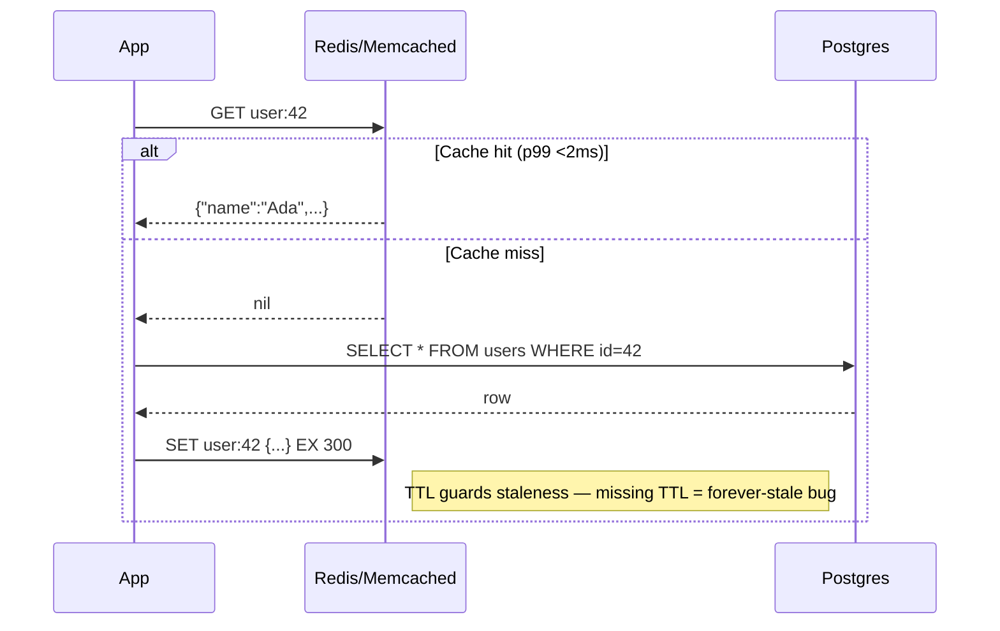
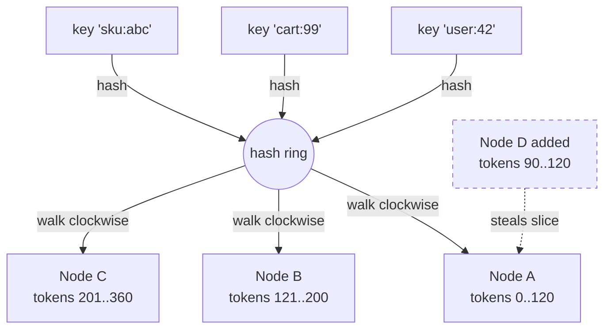
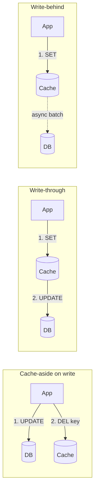

# Key-Value Stores

## Why This Exists

**Problem.** Relational databases optimize for flexible queries, ACID, and joins — but they pay for that with B-tree traversals, MVCC bookkeeping, query planning, and disk-bound IO. When your access pattern is *"give me the value at key X"* a thousand times per second per host, an RDBMS is the wrong tool. You're paying for SQL parsing, planner work, and locking on every lookup that could be an O(1) hash probe over a memory page.

**Key insight.** A **key-value store** is a hash map with a network on the front. By dropping joins, range queries, and a query language, you get:
- **Sub-millisecond p50, single-digit p99** (Redis: ~0.1–1ms; Memcached: ~0.2–0.5ms; DynamoDB: 1–10ms; etcd: 5–20ms because it's quorum-replicated).
- **Linear horizontal scale** via consistent hashing — add nodes and the keyspace re-partitions.
- **Trivial mental model** — `GET k`, `SET k v`, `DEL k`. No N+1 query problem because there *is* no query.

You give up: range scans, secondary indexes (mostly), ad-hoc filtering, and — depending on the system — durability or strong consistency. That's the trade.

**Reach for this when:**
- Caching read-mostly data (sessions, rendered pages, denormalized views, feature flags, JWT blocklists).
- Hot counters / rate limiters / leaderboards where contention would crush an RDBMS.
- Coordinator state that fits in memory and must be fast (service discovery, leader election, configs).
- Lookup-by-id workloads where the id is known in advance (user → profile, sku → price).
- Ephemeral state with TTLs (OTPs, magic links, idempotency keys, distributed locks).

**Don't reach for this when:**
- Queries need range scans (`WHERE created_at BETWEEN ... ORDER BY price LIMIT 50`) — use a sorted index in Postgres or a wide-column store.
- Queries need joins or aggregations across keys — a KV store cannot do `JOIN`. Denormalize at write or use a real DB.
- You need ad-hoc filtering on attributes you didn't anticipate — model the secondary indexes you need and pay the cost, or use a search index.
- You need strong cross-key transactions across more than a handful of keys — Redis `MULTI` works on one shard; cross-shard transactions are not the model.
- The dataset is much larger than RAM and the access pattern has poor locality — the cache hit ratio collapses and you're back to disk.

## Diagrams

### Cache-aside (lazy loading) — the canonical pattern



### Consistent hashing — why adding a node doesn't reshuffle everything



Only keys that hash into Node D's new slice move. With `mod N` sharding, **every** key would re-shard.

### When a write happens (write-through vs write-behind vs cache-aside)



Cache-aside + delete-on-write is the safest default. Write-behind risks data loss; write-through doubles your write latency.

## Core Patterns

### 1. Cache-aside with proper TTL and stampede protection

The naive cache-aside has two failure modes you'll hit in production: **stale-on-write** and **thundering herd on miss**. Here's a Python implementation that handles both.

```python
import time
import json
import random
import redis

r = redis.Redis(host="cache", decode_responses=True)
LOCK_TTL = 5  # seconds — must exceed worst-case DB query
JITTER = 0.2  # 20% jitter on TTL to avoid synchronized expiry

def get_user(user_id: int) -> dict:
    key = f"user:{user_id}"
    cached = r.get(key)
    if cached is not None:
        return json.loads(cached)

    # Stampede guard: only one caller per key may hit the DB.
    # Others wait briefly and retry the cache.
    lock_key = f"lock:{key}"
    got_lock = r.set(lock_key, "1", nx=True, ex=LOCK_TTL)

    if not got_lock:
        # Another worker is regenerating. Back off and re-read.
        time.sleep(0.05 + random.random() * 0.05)
        cached = r.get(key)
        if cached is not None:
            return json.loads(cached)
        # Lock holder may have crashed; fall through and try ourselves.

    try:
        row = db_fetch_user(user_id)  # DB hit
        # Jittered TTL prevents whole pages of keys expiring at once
        # (which would cause a synchronized stampede after a deploy).
        ttl = int(300 * (1 - JITTER + random.random() * 2 * JITTER))
        r.set(key, json.dumps(row), ex=ttl)
        return row
    finally:
        r.delete(lock_key)

def update_user(user_id: int, patch: dict) -> None:
    db_update_user(user_id, patch)
    # Delete-on-write, not SET — avoids race where two updaters
    # interleave and the slower one writes a stale value to cache.
    r.delete(f"user:{user_id}")
```

**Why delete-on-write, not write-through?** Two concurrent writers race: writer A reads old, writer B reads old, A writes v1 to DB then SETs cache to v1, B writes v2 to DB then SETs cache to v1 (out of order on the wire). Cache now has v1, DB has v2 — silent corruption. `DEL` makes the next reader regenerate from the DB.

### 2. Redis data structures — when "string" isn't enough

Redis is the rare KV store with rich values. Use them; you'll move work out of the app.

```python
# HASH — store an object as fields. Update one field without rewriting blob.
r.hset("session:abc123", mapping={"uid": 42, "ip": "1.2.3.4", "ts": 1700000000})
r.hincrby("session:abc123", "request_count", 1)  # atomic counter on a field
r.expire("session:abc123", 1800)

# SORTED SET — leaderboard, time-series, priority queue.
# O(log N) insert, O(log N + M) range. Member is unique key, score sorts.
r.zadd("leaderboard:global", {"player:1": 1500, "player:2": 1450})
top10 = r.zrevrange("leaderboard:global", 0, 9, withscores=True)
# Range by score (e.g. recent events in last hour):
r.zadd("events:user:42", {"event_id_xyz": time.time()})
r.zrangebyscore("events:user:42", time.time() - 3600, time.time())

# SET — unique tags, online users, dedup.
r.sadd("online:shard:1", "user:42")
online_now = r.scard("online:shard:1")
# Set algebra in one round-trip:
r.sinterstore("dest", "set:a", "set:b")  # intersection on the server

# STREAM — append-only log, the modern choice for queues.
# Consumers track their position; supports consumer groups (Kafka-lite).
r.xadd("orders", {"order_id": "o-99", "amt": "12.50"})
r.xreadgroup("workers", "worker-1", {"orders": ">"}, count=10, block=5000)

# HYPERLOGLOG — cardinality estimation in 12KB. Off by ~0.81%.
r.pfadd("uniques:2024-01-15", "user:42", "user:43", "user:42")
r.pfcount("uniques:2024-01-15")  # ~2

# BITMAP — 1 bit per user, "did user N do X today?" in 1.25MB per 10M users.
r.setbit("active:2024-01-15", 42, 1)
r.bitcount("active:2024-01-15")
```

**Why these matter.** A leaderboard in Postgres is `SELECT ... ORDER BY score DESC LIMIT 10` — a sort over potentially millions of rows, repeated for every page view. In Redis it's `ZREVRANGE` — O(log N + 10). A 1000x latency difference is realistic.

### 3. Atomic operations and Lua scripts (the only way to do it right)

Race conditions in Redis are a category of production bug. The fix is almost always *one round-trip with atomic semantics*.

```python
# WRONG — TOCTOU race. Two callers both see balance >= 10 and decrement.
balance = int(r.get(f"balance:{u}") or 0)
if balance >= 10:
    r.decrby(f"balance:{u}", 10)  # could go negative under contention

# RIGHT — Lua script runs atomically on the Redis thread.
DEBIT = r.register_script("""
    local bal = tonumber(redis.call('GET', KEYS[1]) or 0)
    local amt = tonumber(ARGV[1])
    if bal >= amt then
        return redis.call('DECRBY', KEYS[1], amt)
    else
        return -1
    end
""")
new_bal = DEBIT(keys=[f"balance:{u}"], args=[10])
if new_bal == -1:
    raise InsufficientFunds()
```

The same logic applies to **rate limiting** (token bucket), **distributed locks** (SET NX + Lua release), and **idempotency keys** (SETNX with TTL gates the operation).

### 4. Distributed locks — Redlock and its caveats

```python
import uuid

LOCK_RELEASE = r.register_script("""
    if redis.call('GET', KEYS[1]) == ARGV[1] then
        return redis.call('DEL', KEYS[1])
    else
        return 0
    end
""")

def with_lock(key: str, ttl_ms: int, fn):
    token = str(uuid.uuid4())  # unique per attempt, prevents releasing someone else's lock
    if not r.set(key, token, nx=True, px=ttl_ms):
        raise LockHeld()
    try:
        return fn()
    finally:
        # MUST be conditional: if our work took longer than ttl_ms,
        # the lock expired and someone else now holds it. Don't DEL theirs.
        LOCK_RELEASE(keys=[key], args=[token])
```

**Important caveat.** A single-node Redis lock is *not* safe under failover (the new primary may not have the lock). Redlock (the multi-node algorithm) reduces the window but is [contested by Martin Kleppmann](https://martin.kleppmann.com/2016/02/08/how-to-do-distributed-locking.html). For correctness-critical locking (financial txns, exclusive job execution) use **etcd / ZooKeeper / Consul** with a fencing token. For best-effort mutual exclusion (cron de-duplication, cache regeneration), Redis is fine.

### 5. Sharding with consistent hashing

When data exceeds one node's RAM, you shard. The choice is **client-side hashing** (Memcached, Redis Cluster), **proxy-based** (Twemproxy, Envoy), or **server-side cluster** (Redis Cluster, DynamoDB).

```python
# Client-side consistent hashing sketch — what Memcached clients do.
import bisect
import hashlib

class HashRing:
    def __init__(self, nodes, vnodes=150):
        # 150 virtual nodes per physical node — smooths the distribution.
        # Without vnodes, a 3-node cluster can be 50/30/20 instead of 33/33/33.
        self.ring = []  # sorted list of (hash, node)
        for node in nodes:
            for i in range(vnodes):
                h = self._hash(f"{node}#{i}")
                bisect.insort(self.ring, (h, node))

    def _hash(self, k: str) -> int:
        return int(hashlib.md5(k.encode()).hexdigest(), 16)

    def node_for(self, key: str) -> str:
        h = self._hash(key)
        idx = bisect.bisect(self.ring, (h, ""))
        # Wrap around to ring[0] when past end.
        return self.ring[idx % len(self.ring)][1]
```

**Why consistent hashing matters in production.** With `mod N` sharding, going from 4 → 5 nodes invalidates ~80% of the cache (every key that lands on a different node). With consistent hashing + vnodes, ~20% moves. After a deploy that re-shards, that's the difference between "cache cold for 3 minutes" and "cache mostly warm". Read [Karger et al.'s 1997 paper](https://www.akamai.com/blog/news/consistent-hashing-algorithmic-tradeoffs) — it's why CDNs work.

### 6. DynamoDB-on-keys — the "managed KV" model

DynamoDB at its core is a partitioned KV store: pick a **partition key** and your entire access pattern must be expressible as `GetItem(pk)`, `PutItem(pk, ...)`, `Query(pk, sk_predicate)`, or `BatchGetItem`. The rules:

```python
import boto3
ddb = boto3.client("dynamodb")

# Single-item GET — O(1), 1-10ms p99.
ddb.get_item(
    TableName="Users",
    Key={"pk": {"S": "USER#42"}},
    ConsistentRead=False,  # eventually consistent = half the cost, ~99% case
)

# Composite key — partition by user, sort by timestamp.
# Enables "give me user 42's last 50 orders" without a scan.
ddb.put_item(
    TableName="Orders",
    Item={
        "pk": {"S": "USER#42"},
        "sk": {"S": "ORDER#2024-01-15T10:30:00Z#o-99"},
        "amount": {"N": "12.50"},
    },
    # Idempotency: only insert if not present.
    ConditionExpression="attribute_not_exists(pk)",
)

# Single-table design — heterogeneous items in one table, sk encodes type.
# This is the Rick Houlihan pattern. Joins become a single Query.
ddb.query(
    TableName="App",
    KeyConditionExpression="pk = :u AND begins_with(sk, :p)",
    ExpressionAttributeValues={
        ":u": {"S": "USER#42"},
        ":p": {"S": "ORDER#"},
    },
)
```

**Why the partition key choice is everything.** DynamoDB hashes the PK to pick a physical partition. A "hot" PK (e.g., `pk="GLOBAL_COUNTER"`) sends all traffic to one partition and you hit the per-partition cap (~3000 RCU / 1000 WCU). The fix is **write sharding**: `pk = "COUNTER#" + str(random.randint(0, 9))` and aggregate on read. This is the same problem as a [hot key in Redis Cluster](https://redis.io/docs/management/scaling/) — KV stores assume your keyspace is uniformly distributed.

### 7. etcd / ZooKeeper — KV with consensus, not speed

etcd is a KV store, but it's not in the same league of latency as Redis. It uses Raft for consensus, so every write is a quorum round-trip (5–50ms). You use it for **coordinator state**, not request-path data.

```go
// etcd v3 client — leader election with a lease.
cli, _ := clientv3.New(clientv3.Config{Endpoints: []string{"etcd:2379"}})
defer cli.Close()

// Lease auto-expires if we crash — no orphaned leadership.
lease, _ := cli.Grant(ctx, 10) // 10-second TTL
keepAlive, _ := cli.KeepAlive(ctx, lease.ID)
go func() { for range keepAlive {} }()  // drain channel

session, _ := concurrency.NewSession(cli, concurrency.WithLease(lease.ID))
election := concurrency.NewElection(session, "/jobs/cleanup/leader")

if err := election.Campaign(ctx, hostname); err == nil {
    // We're the leader. Run the singleton job.
    runCleanupJob(ctx)
}
// On crash, lease expires, another node wins Campaign().
```

Use etcd / ZooKeeper / Consul for: service discovery, leader election, distributed config, fencing tokens. Do **not** use them as a request-path cache; they'll fall over at a few thousand QPS.

## Persistence Options (Redis)

Redis is in-memory, but offers three durability modes — and they're not equivalent.

| Mode | What it does | Cost | When |
|---|---|---|---|
| **None** (cache only) | Data lives in RAM; lost on restart. | Zero overhead. | Pure cache where DB is source of truth. |
| **RDB snapshots** | Periodic fork-and-dump of full memory to disk (`SAVE 900 1`). | Up to 15min data loss; fork doubles peak memory briefly. | Backups, dev/staging, "good enough" durability. |
| **AOF (append-only file)** | Every write logged to disk; configurable fsync (`always` / `everysec` / `no`). | Disk write per command; rewrite compaction needed. | When data loss matters. `everysec` = ≤1s loss, ~minor latency hit. |
| **AOF + RDB** | Both enabled; AOF for recovery, RDB for fast restart. | Highest durability; most disk IO. | Redis-as-primary-store, with replication. |

**Important nuance.** Even with `AOF appendfsync always`, Redis is **not** ACID across replicas. A primary fsync followed by a crash before replication = data loss on failover. If you need *real* durability, you need synchronous replication (Redis doesn't do this natively in OSS) or a different store (Postgres, FoundationDB). See [Aphyr's Redis Jepsen analysis](https://aphyr.com/posts/283-jepsen-redis).

## Consistency Guarantees

| System | Default | Strongest available | Notes |
|---|---|---|---|
| **Memcached** | None (no replication) | None | Pure cache; node loss = key loss for that shard. |
| **Redis (single)** | Linearizable per key (single-threaded) | Linearizable per key | Cross-key MULTI is atomic but not isolated from reads. |
| **Redis Cluster / Sentinel** | Eventual on failover | Eventual | Async replication; failover can lose recent writes. |
| **DynamoDB** | Eventually consistent reads | `ConsistentRead=true` (linearizable, 2x cost) | Writes are linearizable per partition. Transactions across items via `TransactWriteItems` (with cost). |
| **etcd / ZooKeeper** | Linearizable | Linearizable (Raft / Zab) | Quorum-based; expect 5–50ms writes. |
| **Riak / Cassandra-as-KV** | Eventual (tunable) | Strong with R+W>N | Last-write-wins by default; conflicts up to the app. |

**Key takeaway.** "Sub-ms" and "linearizable" rarely coexist. If you need both, you're using etcd inside one DC, paying the latency, and accepting a small keyspace. See DDIA ch. 9 — Consistency and Consensus.

## Trade-offs

| Benefit | Cost |
|---|---|
| O(1) lookups, sub-ms p99 | No range scans, joins, or ad-hoc queries — model access patterns up front |
| Linear horizontal scale via consistent hashing | Re-sharding live data is operationally painful; vnodes help but don't eliminate it |
| Rich data structures (Redis: hashes, sorted sets, streams) | Redis is single-threaded per shard — one slow `KEYS *` blocks everything |
| Cheap reads at scale (Memcached: ~1M QPS per node) | Cache invalidation is famously hard — pick TTL or accept staleness |
| Optional persistence (RDB/AOF) | Even AOF `always` is not durable across failover without sync replication |
| TTLs make ephemeral data trivial (sessions, OTPs) | Keys can vanish mid-request if TTL is tight; design for cache miss |
| In-memory speed | RAM cost: $5-10/GB/month vs. $0.10/GB SSD; cache size is a budget item |
| Atomic ops via Lua / DynamoDB conditions | Cross-shard transactions are not the model — denormalize or use a real DB |

## Common Pitfalls

- **No TTL on cache keys.** First incident: someone updates a value, cache holds stale forever, you ship a fix at 3am. Always TTL, even if "we'll invalidate explicitly".
- **Synchronized expiry → thundering herd.** All session keys set with `EX 3600` at startup expire at the same second; DB sees a 100x spike. **Fix:** jitter the TTL (`ex=base * (1 + random(-0.2, 0.2))`).
- **Cache stampede on hot key.** Popular product page expires; 10k workers simultaneously query the DB. **Fix:** per-key regeneration lock (Section 1) or *probabilistic early expiration* (XFetch).
- **`KEYS *` in production.** O(N) scan blocks the single-threaded Redis event loop. A million keys = seconds of unavailability. **Use `SCAN`** with a cursor.
- **Hot partition / hot key.** One PK gets 90% of traffic. DynamoDB throttles you; Redis Cluster pegs one shard. **Fix:** write-shard the key (`pk + "#" + random(0,N)`), aggregate on read.
- **Treating cache as source of truth without persistence.** Redis crash → all sessions invalidated → users logged out → support fire. **Fix:** AOF + replica, or store the truth in a DB and use Redis as cache.
- **`SETEX` then forgetting TTL.** Code path that updates the key uses `SET` without TTL, removing expiry silently. **Fix:** `SET key val EX <ttl>` always; lint for bare `SET` in cache modules.
- **Distributed lock without fencing token.** GC pause exceeds lock TTL; another worker takes the lock; both run; you double-charge a customer. See [Kleppmann's "How to do distributed locking"](https://martin.kleppmann.com/2016/02/08/how-to-do-distributed-locking.html). **Fix:** monotonic fencing token from the lock service, validated by the resource on every write.
- **Big keys.** A single Redis key holding a 100MB hash. Operations on it (HGETALL, DEL) block the event loop for hundreds of ms, spiking p99 across all keys. **Fix:** shard large structures (`hash:user:42:part:0`, `:part:1`, ...).
- **Memory eviction surprises.** `maxmemory-policy noeviction` (default) → writes start failing when RAM full. `allkeys-lru` is usually right for caches; `volatile-lru` if you mix cache and persistent keys.
- **Forgetting that DynamoDB Query is per-PK.** "I'll just query by status" — no, you can't, status isn't a partition key. **Fix:** GSI, or denormalize (write `STATUS#PENDING#<id>` as a sk pattern).
- **Read-your-writes inconsistency.** Eventually consistent reads after a write may return old data for ~100ms. User updates profile, immediately reloads, sees old data, files bug. **Fix:** strongly-consistent read after own write, or write-through cache.

## Decision Table

| Situation | Use | Avoid |
|---|---|---|
| Read-mostly cache in front of Postgres | Redis or Memcached cache-aside | Treating it as primary store |
| Session store (small, ephemeral, TTL'd) | Redis (data structures + persistence option) | Postgres (row churn, vacuum cost) |
| Distributed cache with rich types (counters, sets, sorted sets) | Redis | Memcached (strings only) |
| Pure get/set cache, simplest possible, max throughput | Memcached (multi-threaded, no persistence overhead) | Redis if you don't need its features |
| Service discovery / config / leader election | etcd, Consul, ZooKeeper | Redis (no real consensus) |
| Distributed lock for *correctness* (financial, exclusive job) | etcd / ZooKeeper with fencing token | Redis SET NX (best-effort only) |
| Distributed lock for *best effort* (cache regen, cron) | Redis SET NX EX | etcd (overkill, slow) |
| Managed KV at AWS scale, no ops | DynamoDB | Self-hosted Redis Cluster |
| Latency-critical (<1ms p99) request path | Redis (in-DC, single-shard ops) | DynamoDB (1-10ms), etcd (10-50ms) |
| Counters / rate limiting | Redis (INCR, Lua) or DynamoDB (atomic counters) | Postgres `UPDATE ... SET n=n+1` (lock contention) |
| Leaderboards, top-N queries | Redis sorted sets | RDBMS (`ORDER BY ... LIMIT` over millions of rows) |
| Time-series / event log within a key | Redis Streams or sorted sets | Generic KV (lose ordering / range) |
| Range queries by attribute | Postgres / Cassandra / OpenSearch | Any pure KV store |
| Cross-key ACID transactions | Postgres / FoundationDB / DynamoDB Transactions | Redis MULTI across shards |
| Data >> RAM, cold tail | RocksDB-backed (KeyDB, ScyllaDB) or DynamoDB | Pure in-memory Redis |
| Cardinality estimation at scale | Redis HyperLogLog | Counting unique values in SQL (slow, memory-heavy) |

## References

- Kleppmann, Martin — *Designing Data-Intensive Applications* — ch. 3 (Storage and Retrieval), ch. 5 (Replication), ch. 6 (Partitioning), ch. 9 (Consistency and Consensus). — https://dataintensive.net/
- Kleppmann, Martin — "How to do distributed locking" (2016) — https://martin.kleppmann.com/2016/02/08/how-to-do-distributed-locking.html
- Karger, David et al. — "Consistent Hashing and Random Trees" (1997) — https://dl.acm.org/doi/10.1145/258533.258660 (summary: https://www.akamai.com/blog/news/consistent-hashing-algorithmic-tradeoffs)
- DeCandia, Giuseppe et al. — "Dynamo: Amazon's Highly Available Key-value Store" (SOSP 2007) — https://www.allthingsdistributed.com/files/amazon-dynamo-sosp2007.pdf
- Sivasubramanian, Swami — "Amazon DynamoDB: a Fast and Scalable NoSQL Database Service Designed for Internet Scale Applications" — https://www.usenix.org/conference/atc22/presentation/elhemali (USENIX ATC 2022 paper)
- Redis Documentation — Data types — https://redis.io/docs/data-types/
- Redis Documentation — Persistence (RDB & AOF) — https://redis.io/docs/management/persistence/
- Redis Documentation — Cluster specification — https://redis.io/docs/reference/cluster-spec/
- Redis Documentation — Distributed locks (Redlock) — https://redis.io/docs/manual/patterns/distributed-locks/
- Memcached Wiki — Architecture and consistent hashing — https://github.com/memcached/memcached/wiki/Overview
- Aphyr (Kyle Kingsbury) — "Jepsen: Redis" — https://aphyr.com/posts/283-jepsen-redis
- Aphyr — "Jepsen: etcd and Consul" — https://aphyr.com/posts/316-jepsen-etcd-and-consul
- AWS Builders' Library — "Caching challenges and strategies" — https://aws.amazon.com/builders-library/caching-challenges-and-strategies/
- AWS Builders' Library — "Avoiding fallback in distributed systems" — https://aws.amazon.com/builders-library/avoiding-fallback-in-distributed-systems/
- DynamoDB Developer Guide — "Best practices for designing and architecting with DynamoDB" — https://docs.aws.amazon.com/amazondynamodb/latest/developerguide/best-practices.html
- Houlihan, Rick — "Advanced Design Patterns for DynamoDB" (re:Invent talk) — https://www.youtube.com/watch?v=HaEPXoXVf2k
- etcd Documentation — Concurrency primitives — https://etcd.io/docs/v3.5/learning/api/
- Ongaro, Diego & Ousterhout, John — "In Search of an Understandable Consensus Algorithm" (Raft) — https://raft.github.io/raft.pdf
- Google SRE Book — ch. 24, "Distributed Periodic Scheduling with Cron" (relevant for distributed locks) — https://sre.google/sre-book/distributed-periodic-scheduling/
- Vogels, Werner — "Eventually Consistent" — https://www.allthingsdistributed.com/2008/12/eventually_consistent.html
- Helland, Pat — "Life beyond Distributed Transactions" — https://queue.acm.org/detail.cfm?id=3025012
- Fitzpatrick, Brad — "Distributed caching with memcached" (Linux Journal, 2004) — https://www.linuxjournal.com/article/7451

## See Also

- `../relational/` — when you need joins, range queries, and ACID; the canonical alternative
- `../wide-column/` — Cassandra/ScyllaDB/Bigtable when KV needs to scan ranges of sort keys
- `../time-series-db/` — InfluxDB/TimescaleDB/Prometheus when access pattern is time-bounded
- `../../performance/caching/` — deeper dive on the cache-aside pattern and stampede mitigations
- `../consensus/` — Raft/Paxos for when you need etcd's guarantees
- `../../reliability/rate-limiting/` — token bucket / sliding window with Redis Lua
- `../../communication/idempotency/` — idempotency keys with SETNX + TTL
