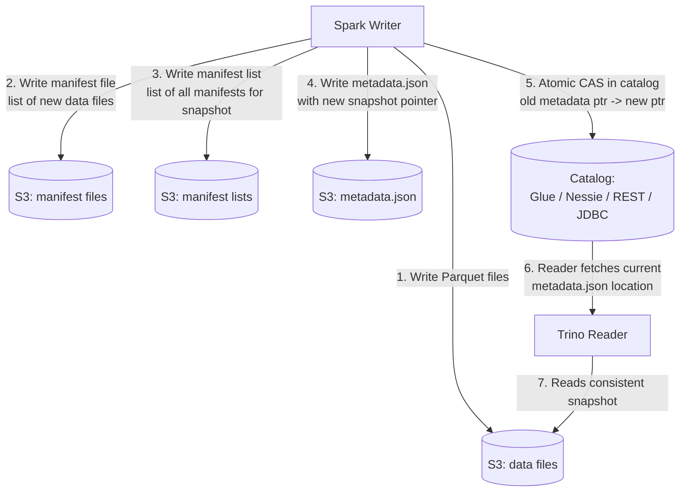
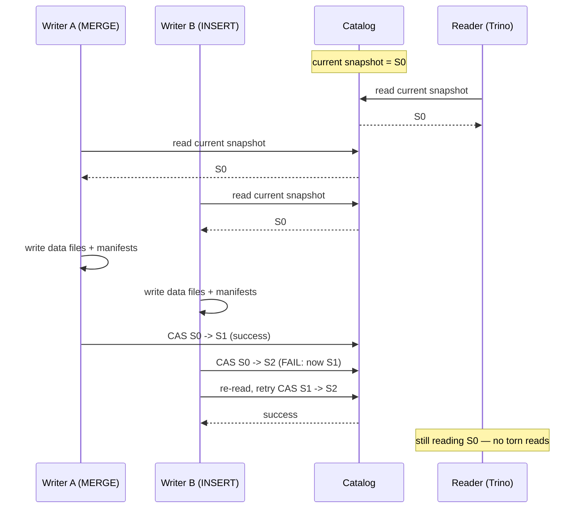
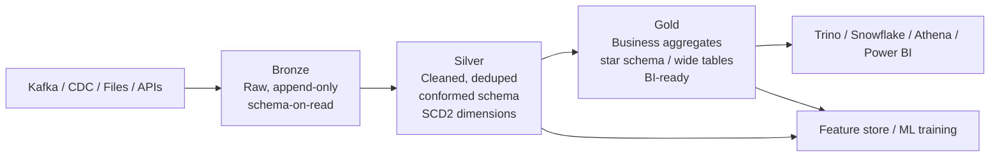

# Lakehouse: Iceberg / Delta / Hudi

## Why This Exists

**Problem.** Classic data lakes (Parquet/ORC files on S3 + Hive Metastore) lack the basic guarantees a database gives you for free:

- No atomic multi-file commit. A failed Spark job leaves half-written partitions; readers see torn writes.
- No isolation. Two concurrent backfills both rewrite `dt=2026-05-01/` and one silently overwrites the other.
- No row-level deletes or updates. GDPR "right-to-be-forgotten" means rewriting entire partitions for one row.
- Schema changes are dangerous. `ALTER TABLE ADD COLUMN` works in the metastore but old Parquet files don't have the column; downstream queries break unpredictably.
- Hive partitioning is rigid. You picked `PARTITION BY (dt, country)` two years ago; now `country` cardinality is 250 and small-files have killed S3 LIST performance. Repartitioning means rewriting petabytes.
- Time travel is impossible. "What did this table look like Tuesday at 3pm?" requires you to have manually snapshotted.

**Key insight.** A lakehouse adds a **transactional metadata layer** on top of immutable object-storage files. The metadata layer (Iceberg manifests, Delta `_delta_log`, Hudi timeline) is the source of truth: it points at exactly the file set that constitutes "the table at version N." Writers produce new files and atomically swap the metadata pointer (compare-and-swap on a catalog row, or a conditional PUT on object storage). Readers always observe a consistent snapshot — never a half-written commit.

This gives you warehouse semantics (ACID, schema evolution, MERGE, time travel) at lake economics (your data still lives as Parquet on S3, queryable by Spark, Trino, Snowflake, Athena, DuckDB, Flink — without copying).

**Reach for this when:**
- You have ≥1 TB of analytical data on object storage and multiple writers.
- You need GDPR/CCPA row-level deletes without rewriting whole partitions.
- Multiple engines (Spark + Trino + Snowflake/Athena + Flink) need to read the same tables consistently.
- You're seeing eventual-consistency bugs from S3 listing under heavy concurrent writes.
- You want streaming ingest (Kafka → table) with exactly-once semantics.
- Your warehouse bill (Snowflake/BigQuery storage) exceeds your S3 bill by 5–20×.

**Don't reach for this when:**
- Your data is < 100 GB total and lives happily in Postgres/MySQL. Use a real OLTP database.
- You have one writer, one reader, append-only, and don't care about schema changes. Plain Parquet + Hive partitioning is fine and simpler.
- You need sub-100ms point lookups. Lakehouse query latency is seconds-to-minutes, not milliseconds. Use a serving layer (Pinot, Druid, ClickHouse, DynamoDB).
- Your access pattern is full-table OLTP transactions across millions of small rows. Lakehouse is built for analytical scans.
- You're already deeply invested in a vertically integrated warehouse (Snowflake, BigQuery) and the storage cost doesn't hurt enough to justify migration risk.

## Diagrams

### Anatomy of a transactional commit (Iceberg)



The atomic step is **(5)**. Steps 1–4 are idempotent file writes; if the writer crashes, you have orphan files (cleaned up by `expire_snapshots` + `remove_orphan_files`) but no corruption. The CAS on the catalog is the linearization point.

### Reader/writer concurrency (snapshot isolation)



Iceberg and Delta use **optimistic concurrency control** (OCC). Conflicts on disjoint partitions auto-retry; conflicts on the same files (two MERGEs touching the same row) fail the loser, which retries from the new snapshot.

### Medallion architecture



Bronze is your immutable audit log of source reality. Silver is the canonical, deduped, type-cast version. Gold is the denormalized, partitioned-for-query, BI-facing layer. **Reprocessability** is the win: a bug in Silver→Gold logic doesn't lose source data.

## Core Patterns

### 1. Choosing a table format

The three open formats solve the same core problem with different priors:

| Format | Optimized for | Metadata model | Catalog options |
|---|---|---|---|
| **Apache Iceberg** | Multi-engine reads, large tables, schema/partition evolution | Hierarchical: `metadata.json` → manifest list → manifests → data files. Snapshot-per-commit. | REST catalog, Glue, Nessie, Hive, JDBC |
| **Delta Lake** | Spark/Databricks-first; simple mental model | Linear write-ahead log: `_delta_log/00000.json`, `_delta_log/00001.json`, ... | Unity Catalog, Hive, file-system-only |
| **Apache Hudi** | High-throughput streaming upserts (CDC mirroring) | Timeline of instants on a per-partition basis. CoW + MoR storage modes. | Hive, Glue, AWS DMS-style |

**Rule of thumb:**
- Multi-engine, multi-cloud, want vendor independence → **Iceberg**.
- Spark/Databricks shop and Unity Catalog feature parity matters → **Delta**.
- Upsert-heavy CDC with sub-minute freshness → **Hudi MoR**.

### 2. Iceberg: creating a table with hidden partitioning and writing transactionally

Iceberg's killer feature is **hidden partitioning** — you partition by a transform (`day(ts)`, `bucket(16, user_id)`) instead of a separate string column. Queries on `ts` get pruning automatically; you can change the partition spec later without rewriting data.

```python
# spark_iceberg_example.py
from pyspark.sql import SparkSession
from pyspark.sql.functions import current_timestamp, lit

spark = (
    SparkSession.builder
    .config("spark.sql.extensions", "org.apache.iceberg.spark.extensions.IcebergSparkSessionExtensions")
    .config("spark.sql.catalog.prod", "org.apache.iceberg.spark.SparkCatalog")
    .config("spark.sql.catalog.prod.catalog-impl", "org.apache.iceberg.aws.glue.GlueCatalog")
    .config("spark.sql.catalog.prod.warehouse", "s3://my-lakehouse/warehouse/")
    .config("spark.sql.catalog.prod.io-impl", "org.apache.iceberg.aws.s3.S3FileIO")
    .getOrCreate()
)

# Hidden partitioning: query users by event_ts and you get day-level pruning
# WITHOUT polluting the schema with an extra `event_date` column.
spark.sql("""
    CREATE TABLE prod.analytics.events (
        event_id     STRING,
        user_id      BIGINT,
        event_ts     TIMESTAMP,
        event_type   STRING,
        payload      STRING
    )
    USING iceberg
    PARTITIONED BY (days(event_ts), bucket(16, user_id))
    TBLPROPERTIES (
        'format-version' = '2',                 -- v2 enables row-level deletes
        'write.delete.mode' = 'merge-on-read',  -- fast deletes; reader merges
        'write.update.mode' = 'merge-on-read',
        'write.merge.mode'  = 'merge-on-read',
        'write.target-file-size-bytes' = '536870912',  -- 512MB target
        'write.distribution-mode' = 'hash',     -- prevents skewed file sizes
        'write.parquet.compression-codec' = 'zstd'
    )
""")

# Append. Iceberg snapshot isolation makes this safe under concurrent writers.
df = read_kafka_batch()  # your CDC source
df.writeTo("prod.analytics.events").append()

# MERGE for upserts (CDC pattern). Iceberg v2 row-level deletes make this efficient.
spark.sql("""
    MERGE INTO prod.analytics.events t
    USING staging.events_cdc s
    ON t.event_id = s.event_id
    WHEN MATCHED AND s.op = 'D' THEN DELETE
    WHEN MATCHED AND s.op = 'U' THEN UPDATE SET *
    WHEN NOT MATCHED AND s.op IN ('I','U') THEN INSERT *
""")
```

### 3. Time travel and rollback

Every commit is a snapshot. You can query the past and roll back if a bad job corrupted gold-layer data.

```sql
-- Iceberg: query the table as-of a specific snapshot or timestamp
SELECT count(*) FROM prod.analytics.events
  FOR VERSION AS OF 8723648576234234;

SELECT count(*) FROM prod.analytics.events
  FOR TIMESTAMP AS OF TIMESTAMP '2026-05-01 14:00:00';

-- Roll back: useful when a downstream job wrote bad rows and you want to
-- reset the table pointer without restoring from backup.
CALL prod.system.rollback_to_snapshot(
    'analytics.events',
    8723648576234234
);

-- Delta equivalent
SELECT count(*) FROM events VERSION AS OF 142;
SELECT count(*) FROM events TIMESTAMP AS OF '2026-05-01T14:00:00';

RESTORE TABLE events TO VERSION AS OF 142;
```

**Caveat.** Time travel is bounded by snapshot retention (default Iceberg: keep all; default Delta: 30 days for log, 7 days for VACUUM tombstones). If you `VACUUM` away the underlying data files, time travel to that version fails.

### 4. Schema evolution that doesn't break readers

Lakehouse formats track columns by **field ID**, not by name or position in the Parquet file. This means renames, drops, and reorders are metadata-only operations — no data rewrite, no broken readers.

```sql
-- All of these are O(1) metadata operations in Iceberg/Delta.
ALTER TABLE prod.analytics.events ADD COLUMN device_type STRING;
ALTER TABLE prod.analytics.events ADD COLUMN client_version STRING AFTER event_type;
ALTER TABLE prod.analytics.events RENAME COLUMN event_type TO event_kind;
ALTER TABLE prod.analytics.events DROP COLUMN payload;

-- Type promotion: int -> long is allowed (widening). long -> int is rejected.
ALTER TABLE prod.analytics.events ALTER COLUMN user_id TYPE BIGINT;

-- Old Parquet files don't have device_type. Readers fill NULL via the
-- field-ID -> column mapping. New writes embed the new column.
```

**Compare to Hive.** Hive ALTER TABLE only updates the metastore; the underlying Parquet files keep their old schemas, and readers use **column-by-name** matching. Drop a column then re-add one with the same name and a different type → readers silently get garbage. Iceberg's field IDs make this class of bug impossible.

### 5. Partition evolution

Iceberg uniquely supports **changing the partition spec without rewriting data**. Old data keeps its old layout; new data uses the new layout; query planning prunes both.

```sql
-- v1: partitioned by day
ALTER TABLE prod.analytics.events
  REPLACE PARTITION FIELD days(event_ts) WITH hours(event_ts);

-- v2: change bucket count (rare but supported)
ALTER TABLE prod.analytics.events
  REPLACE PARTITION FIELD bucket(16, user_id) WITH bucket(64, user_id);

-- Inspect partition specs
SELECT * FROM prod.analytics.events.partitions;
```

This is huge in practice. **War story:** a team partitioned a 4 PB table by `country_code` early on. Three years later, 80% of queries were time-range scans and `country_code` had crept to 280 distinct values, causing 280-way fan-out per query. In Hive, fixing this means a multi-week rewrite. In Iceberg, it's an `ALTER TABLE` and the next day's queries use the new spec.

### 6. The medallion pattern in practice

```python
# bronze.py — append-only landing zone for raw CDC events from Debezium/Kafka
def ingest_bronze(kafka_df):
    """
    Bronze: don't transform, don't dedupe, don't filter.
    Just land raw payloads with ingestion metadata.
    Schema-on-read: payload is STRING/JSON. Cheap to evolve.
    """
    bronze_df = (
        kafka_df
        .withColumn("ingest_ts", current_timestamp())
        .withColumn("source_topic", lit("orders.cdc"))
    )
    (bronze_df.writeStream
        .format("iceberg")
        .option("checkpointLocation", "s3://lakehouse/_chk/bronze_orders/")
        .outputMode("append")
        .toTable("prod.bronze.orders_cdc"))


# silver.py — cleaned, typed, deduped canonical table
def build_silver_orders():
    """
    Silver: parse JSON, cast types, dedupe by (order_id, op_ts) keeping latest,
    apply MERGE for upserts. This is your source of truth for downstream.
    """
    spark.sql("""
        MERGE INTO prod.silver.orders t
        USING (
            SELECT *
            FROM (
                SELECT
                    payload:order_id::BIGINT       AS order_id,
                    payload:user_id::BIGINT        AS user_id,
                    payload:amount_cents::BIGINT   AS amount_cents,
                    payload:status::STRING         AS status,
                    payload:updated_at::TIMESTAMP  AS updated_at,
                    op,
                    row_number() OVER (
                        PARTITION BY payload:order_id
                        ORDER BY payload:updated_at DESC
                    ) AS rn
                FROM prod.bronze.orders_cdc
                WHERE ingest_ts > (SELECT max(ingest_ts) FROM prod.silver._orders_watermark)
            )
            WHERE rn = 1
        ) s
        ON t.order_id = s.order_id
        WHEN MATCHED AND s.op = 'D' THEN DELETE
        WHEN MATCHED THEN UPDATE SET *
        WHEN NOT MATCHED AND s.op != 'D' THEN INSERT *
    """)


# gold.py — business aggregates, star schema, BI-ready
def build_gold_daily_revenue():
    """
    Gold: pre-aggregated, denormalized, partitioned for the dominant query.
    Recompute from silver — cheap because silver is the truth.
    """
    spark.sql("""
        INSERT OVERWRITE prod.gold.daily_revenue
            PARTITION (revenue_date)
        SELECT
            date_trunc('day', updated_at) AS revenue_date,
            sum(amount_cents) / 100.0     AS revenue_usd,
            count(DISTINCT user_id)       AS active_users,
            count(*)                      AS order_count
        FROM prod.silver.orders
        WHERE status = 'COMPLETED'
          AND updated_at >= current_date - INTERVAL 7 DAYS
        GROUP BY 1
    """)
```

### 7. Compaction and maintenance — the parts everyone forgets

Streaming writes produce many small files. Without periodic maintenance, your "p99 query latency" mysteriously climbs from 5s to 90s over six months. **Compaction is not optional.**

```sql
-- Iceberg: compact small files, sort within files for better pruning
CALL prod.system.rewrite_data_files(
    table => 'analytics.events',
    strategy => 'sort',
    sort_order => 'event_ts DESC, user_id ASC',
    options => map(
        'target-file-size-bytes', '536870912',  -- 512 MB
        'min-input-files', '5',
        'max-concurrent-file-group-rewrites', '4'
    )
);

-- Compact the metadata too (manifests get fragmented over time)
CALL prod.system.rewrite_manifests('analytics.events');

-- Expire old snapshots. Frees S3 storage but kills time travel for those versions.
CALL prod.system.expire_snapshots(
    table => 'analytics.events',
    older_than => TIMESTAMP '2026-05-01 00:00:00',
    retain_last => 100
);

-- Remove orphan files left by failed writes
CALL prod.system.remove_orphan_files(
    table => 'analytics.events',
    older_than => TIMESTAMP '2026-04-01 00:00:00'
);
```

```sql
-- Delta equivalents
OPTIMIZE prod.analytics.events
  WHERE event_ts >= current_date - INTERVAL 7 DAYS
  ZORDER BY (user_id, event_type);

VACUUM prod.analytics.events RETAIN 168 HOURS;  -- 7 day tombstone
```

Run these as scheduled jobs (Airflow / dbt / Databricks Jobs). A typical cadence:
- **Hourly**: compact hot partitions (last 24h).
- **Daily**: rewrite_manifests, expire snapshots older than retention.
- **Weekly**: remove_orphan_files (must be conservative — cutoff older than max in-flight job duration).

### 8. Hudi MoR (Merge-on-Read) for streaming upserts

When CDC freshness matters more than read-side simplicity:

```python
hudi_options = {
    'hoodie.table.name': 'orders_realtime',
    'hoodie.datasource.write.recordkey.field': 'order_id',
    'hoodie.datasource.write.precombine.field': 'updated_at',
    'hoodie.datasource.write.operation': 'upsert',
    'hoodie.datasource.write.table.type': 'MERGE_ON_READ',  # vs COPY_ON_WRITE
    'hoodie.compact.inline': 'false',                       # async compaction
    'hoodie.compact.schedule.inline': 'true',
    'hoodie.cleaner.policy': 'KEEP_LATEST_COMMITS',
    'hoodie.cleaner.commits.retained': '24',
}

(cdc_stream
    .writeStream
    .format("hudi")
    .options(**hudi_options)
    .option("checkpointLocation", "s3://lakehouse/_chk/hudi_orders/")
    .start("s3://lakehouse/orders_realtime/"))
```

**MoR tradeoff:** writes are cheap (append delta logs), reads pay merge cost on the fly. CoW is the inverse — writes rewrite full files (expensive), reads are fast. Pick MoR for streaming sinks; pick CoW for read-heavy analytics tables.

## Trade-offs

| Benefit | Cost |
|---|---|
| ACID on object storage; no torn reads | Catalog becomes a dependency. Glue/REST catalog availability now matters. |
| Schema evolution without rewrites | Field-ID metadata adds reader complexity; legacy tools that read Parquet directly may bypass the metadata layer and see stale schemas. |
| Time travel for debugging and audit | Snapshot retention costs S3 storage; without `expire_snapshots`, metadata grows unbounded. |
| Multiple engines read the same data | You must keep engine versions in sync with format spec versions (Iceberg v2, Delta protocol versions). Mismatch = silent data drops. |
| Row-level MERGE/DELETE for GDPR | Merge-on-read introduces read-side merge cost; queries get slower as delete files accumulate until compaction runs. |
| Partition evolution without rewrite | Query planners must understand multiple partition specs; older engines/connectors may not support evolution. |
| Storage costs ~10× cheaper than warehouse storage | Compute is BYO. You operate Spark/Trino, tune compaction, monitor small-files. Snowflake "just works" for a price. |
| Vendor independence (Iceberg especially) | Catalog interop is still maturing. Cross-catalog migrations are non-trivial. |
| Streaming + batch on the same table | Concurrency control is optimistic; high-conflict workloads (many writers same partition) cause retry storms. Tune `commit.retry.num-retries`. |

## Common Pitfalls

- **Forgetting compaction.** Streaming writes produce thousands of 5MB files per hour. Six months later your dashboard P99 is 90s and nobody knows why. Schedule `OPTIMIZE` / `rewrite_data_files` as part of the pipeline, not as an afterthought.
- **`VACUUM` with too aggressive a retention.** `VACUUM ... RETAIN 0 HOURS` deletes files that long-running queries are still reading → mid-query failures, time-travel breaks. Default 7 days exists for a reason.
- **Catalog as a single point of failure.** A Glue/Hive metastore outage takes down all reads and writes. Use a highly available catalog (Glue is regional, Nessie supports replication, REST catalog can be HA-deployed).
- **Direct file reads bypassing the catalog.** Tools that read `s3://.../events/` Parquet directly miss the manifest and see deleted/old files. Always query through an engine that understands the table format.
- **Mixing format versions.** Writing Iceberg v2 (with row-level deletes) and reading from a connector that only speaks v1 → reader silently ignores deletes → ghost rows. Pin format-version explicitly and verify all readers support it.
- **Partition-skew from `bucket(N, key)` with low cardinality.** Bucketing on `country_code` with 200 countries and `bucket(16, country_code)` → most rows hash to a few buckets, those files become huge, query parallelism drops. Pick a high-cardinality, evenly-distributed field for bucketing.
- **MERGE without the right join key.** `MERGE ... ON t.id = s.id` where neither side has a unique constraint → duplicate matches, undefined behavior. Always dedupe the source before MERGE.
- **Time travel relied on for backups.** Time travel is not a backup. A bad `DROP TABLE` (or aggressive `expire_snapshots`) eliminates history. Use real cross-region S3 replication for DR.
- **Concurrent writers on the same partition without retry.** Two backfills hitting `dt=2026-05-01` both attempt CAS; one wins, one fails — and dies if you didn't configure retry. Configure `commit.retry.num-retries=10` and exponential backoff.
- **Treating bronze as queryable.** Bronze is raw and full of duplicates, type errors, and replay artifacts. Analysts who query it produce wrong answers. Lock bronze down; expose only silver/gold to humans.
- **Schema evolution by name, not field ID.** Some Hudi configurations and old Spark versions match by column name. Drop+re-add a column with the same name → silent type confusion. Verify the format version actually uses field IDs.
- **`expire_snapshots` running concurrently with long backfills.** The expire job sees a snapshot referenced by no current pointer and deletes its files. The backfill, which read from that snapshot, fails. Coordinate: expire only past the longest-running job watermark.

## Decision Table

| Situation | Choose | Why |
|---|---|---|
| Multi-engine analytics (Spark + Trino + Snowflake/Athena + Flink) over the same data | **Iceberg** | Best multi-engine connector ecosystem; vendor-neutral; supported by Snowflake, BigQuery, Athena, Redshift |
| All-in on Databricks; want Unity Catalog governance | **Delta Lake** | Native Databricks format; Unity features (lineage, fine-grained ACL) only land first on Delta |
| CDC mirroring with sub-minute freshness, upsert-heavy | **Hudi MoR** | Append-only delta logs make upserts cheap; built for this from day one |
| Read-mostly analytics, infrequent updates | **Iceberg or Delta CoW** | Simpler reader path; no merge-on-read cost |
| Need partition-spec changes without table rewrite | **Iceberg** | Only format with first-class partition evolution |
| Need column-level encryption / masking integrated with catalog | **Delta + Unity** or **Iceberg + REST catalog with policies** | Delta+Unity is most mature today; Iceberg REST catalogs are catching up |
| Replacing a Hive table with minimal disruption | **Iceberg** | `migrate` procedure can convert in place without rewriting data |
| Data fits in one Postgres / one BigQuery dataset | **Don't use a lakehouse** | Operational overhead not justified below ~1 TB |
| Sub-second OLAP serving (dashboards) | **Druid / Pinot / ClickHouse** in front of the lakehouse | Lakehouse query latency is seconds-minutes, not millis |
| Strong write concurrency (>100 concurrent writers) on same partitions | **Reconsider the design**, or partition more finely | OCC conflict storms hurt at high contention; consider a streaming aggregator (Flink) that funnels into one writer |

## References

- Armbrust et al. — *Lakehouse: A New Generation of Open Platforms that Unify Data Warehousing and Advanced Analytics* (CIDR 2021) — https://www.cidrdb.org/cidr2021/papers/cidr2021_paper17.pdf
- Armbrust et al. — *Delta Lake: High-Performance ACID Table Storage over Cloud Object Stores* (VLDB 2020) — https://www.vldb.org/pvldb/vol13/p3411-armbrust.pdf
- Apache Iceberg — *Iceberg Table Spec v2* — https://iceberg.apache.org/spec/
- Apache Iceberg — *Concurrent Write & Commit Protocol* — https://iceberg.apache.org/docs/latest/reliability/
- Apache Hudi — *Storage Types: Copy-on-Write vs Merge-on-Read* — https://hudi.apache.org/docs/table_types
- Delta Lake — *Protocol Specification* — https://github.com/delta-io/delta/blob/master/PROTOCOL.md
- Databricks — *The Medallion Architecture* — https://www.databricks.com/glossary/medallion-architecture
- Ryan Blue (Iceberg co-creator) — *Apache Iceberg: An Architectural Look Under the Covers* — https://www.dremio.com/resources/guides/apache-iceberg-an-architectural-look-under-the-covers/
- AWS — *Using Apache Iceberg on AWS* — https://docs.aws.amazon.com/prescriptive-guidance/latest/apache-iceberg-on-aws/introduction.html
- Kleppmann — *Designing Data-Intensive Applications* — ch. 3 (Storage and Retrieval), ch. 7 (Transactions, esp. Snapshot Isolation), ch. 10 (Batch Processing) — book ref
- Pat Helland — *Immutability Changes Everything* (CIDR 2015) — https://queue.acm.org/detail.cfm?id=2884038
- Pat Helland — *Data on the Outside vs. Data on the Inside* — https://queue.acm.org/detail.cfm?id=3415014
- Martin Fowler — *DataLake* — https://martinfowler.com/bliki/DataLake.html
- Adrian Colyer / The Morning Paper — *Delta Lake* commentary — https://blog.acolyer.org/2020/09/02/delta-lake/
- Tabular (now Databricks) — *Iceberg Table Maintenance: Compaction & Snapshot Expiration* — https://www.tabular.io/apache-iceberg-cookbook/data-operations-table-maintenance/
- Snowflake — *External Tables with Apache Iceberg* — https://docs.snowflake.com/en/user-guide/tables-iceberg
- Confluent — *Streaming Data into the Lakehouse with Kafka and Iceberg* — https://www.confluent.io/blog/apache-iceberg-streaming-tables/
- Google SRE Book — ch. 26 (Data Integrity: What You Read Is What You Wrote) — https://sre.google/sre-book/data-integrity/

## See Also

- `../cdc/` — Debezium / DMS patterns for sourcing bronze
- `../consensus/` — why catalog CAS works and what guarantees it provides
- `../olap-warehouse/` — Snowflake/BigQuery vs Delta+Spark trade-offs.
- `../batch-processing/` — Spark/Hive/Trino patterns over the silver/gold layers.
- `../stream-processing/` — Flink/Kafka into bronze for sub-second freshness.
- `../partitioning/` — Hive-style partitioning and Z-ordering for query pruning.
- `../schema-evolution/` — Iceberg/Delta schema-evolution semantics.
- `../../architecture-patterns/lambda-architecture/` — the predecessor pattern lakehouses replaced.
