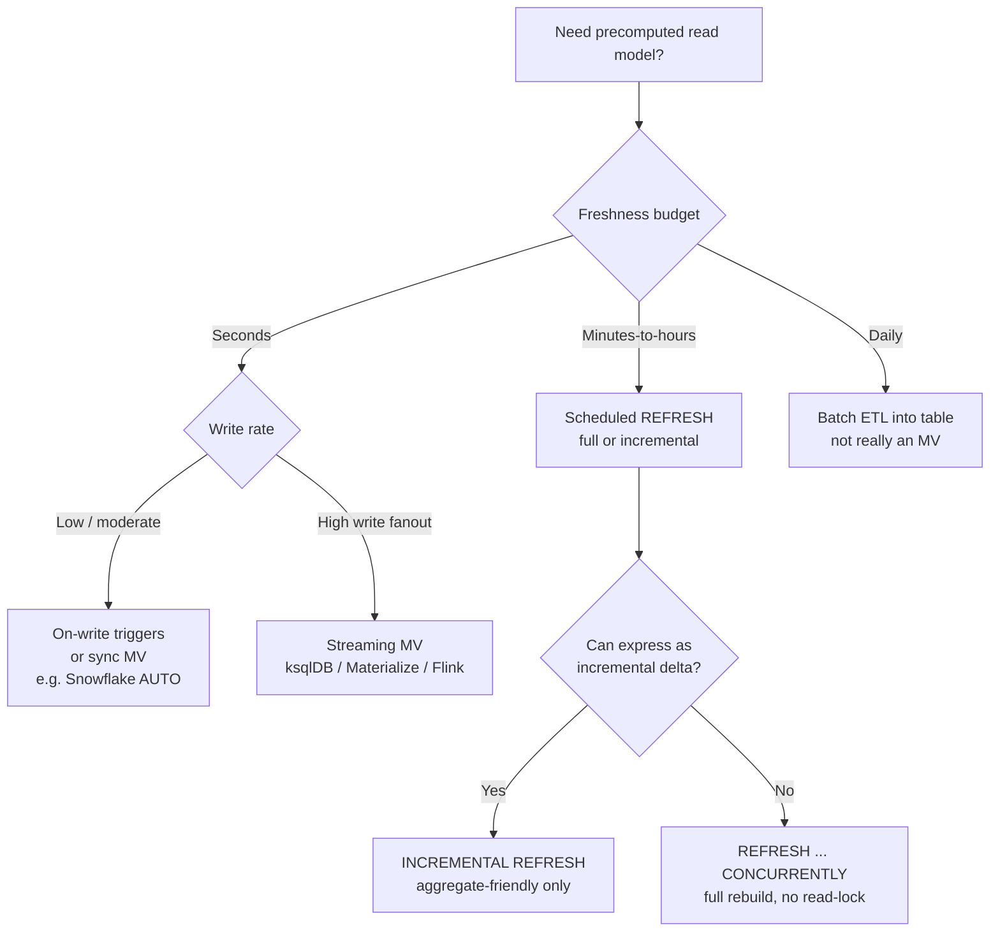
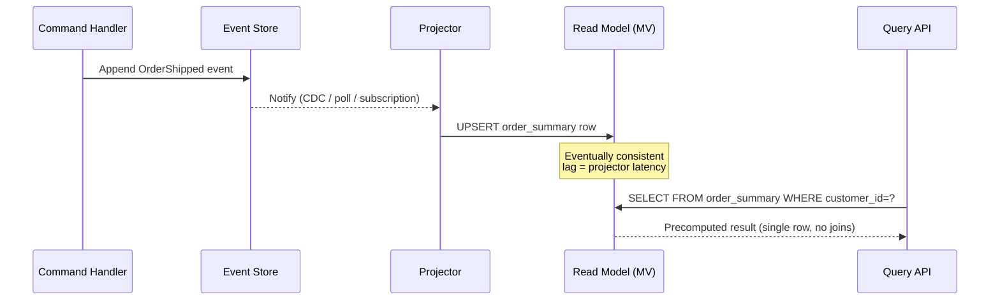
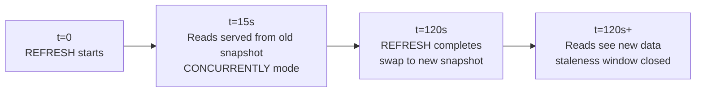

# Materialized Views

## Why This Exists

**Problem.** A view in SQL is a saved query — every read re-executes the underlying joins/aggregations. For a 200M-row fact table joined to 6 dimensions and grouped by month, that's hundreds of milliseconds to tens of seconds per query, every query, forever. A read-heavy workload (dashboards, search, reporting, ML feature serving, denormalized read-side in CQRS) cannot tolerate that. Adding indexes helps point lookups, not aggregations.

**Key insight.** A materialized view is **a precomputed cache, persisted as a table, of a query's result** — you pay the compute cost at *write time* (or on a schedule) so reads become a cheap table scan or index lookup. Like every cache, the hard part is **invalidation and refresh**: when does the MV diverge from truth, who pays to fix it, and how stale is "stale enough"?

A materialized view is the database-native answer to the same problem solved at the application layer by Redis caching, CQRS read models, and search-index pipelines. The trade-off shape is identical: **freshness, cost, complexity — pick two**.

**Reach for this when:**
- A query is run 1000× more often than its inputs change (classic cache hit ratio justification).
- Aggregations or expensive JOINs dominate p99 of a read-heavy workload.
- You need a denormalized read shape (CQRS, GraphQL list endpoints, dashboard tiles) without rewriting application data flow.
- The data warehouse / OLAP store is paying compute repeatedly for the same daily rollup.
- A streaming pipeline produces a "current state" projection that downstream services read constantly (ksqlDB, Materialize, Flink Table API).

**Don't reach for this when:**
- Reads are already cheap (sub-10ms point lookups via primary key) — you're adding complexity for no benefit.
- The query result must be **strictly consistent** with writes (e.g. financial balance check before debit) — MVs are stale by definition unless synchronously maintained, which costs write throughput.
- The base data churns faster than you can refresh — you'll spend more cycles refreshing than serving.
- A regular index would do the job. **Indexes first, then MVs.**
- Cardinality is so low (a few hundred rows) that a cached query result in the application layer is simpler.

## Diagrams

### Refresh strategy decision tree



### CQRS read-side as a materialized view



### Stale-while-revalidate timeline



## Refresh strategies — the four shapes

Every MV implementation, from Postgres to Snowflake to streaming engines, is a variation on one of these four. Picking the wrong one is the most common reason MVs become operational liabilities.

| Strategy | When MV updates | Latency | Cost model | Operational gotcha |
|----------|-----------------|---------|------------|--------------------|
| **Full refresh** | On schedule (cron / `REFRESH MATERIALIZED VIEW`) | Schedule interval | Recomputes whole result every run | Long refresh blocks readers (or doubles storage with `CONCURRENTLY`); cost grows with base table size, not delta |
| **Incremental refresh** | On schedule, applies delta since last refresh | Schedule interval | Recomputes only changed partitions / aggregate buckets | Only works for restricted query shapes (no `DISTINCT`, limited window funcs); engine-specific; debugging drift is painful |
| **On-write (synchronous)** | Inside the write transaction (triggers, indexed views) | Zero (strongly consistent) | Every write pays full propagation cost | Write amplification, deadlocks, hot-row contention; SQL Server indexed views, Oracle ON COMMIT MVs |
| **On-demand / lazy** | First read after invalidation | First-read penalty | Amortized; cold reads are slow | Stampede risk — many readers trigger simultaneous rebuild; need single-flight |

A fifth, increasingly important shape is **streaming / continuously-maintained**: ksqlDB tables, Materialize, Flink dynamic tables, RisingWave. The engine maintains an incremental view in near-real-time using change data capture. Latency is sub-second; cost is a continuously-running compute stream.

## Postgres materialized views

Postgres MVs are simple, well-understood, and **fully recomputed on REFRESH** — there is no built-in incremental refresh.

```sql
-- Base tables (simplified e-commerce)
CREATE TABLE orders (
    order_id        bigserial PRIMARY KEY,
    customer_id     bigint NOT NULL,
    placed_at       timestamptz NOT NULL,
    status          text NOT NULL,
    total_cents     bigint NOT NULL
);

CREATE TABLE order_items (
    order_id    bigint REFERENCES orders,
    sku         text NOT NULL,
    qty         int NOT NULL,
    PRIMARY KEY (order_id, sku)
);

-- Materialized view: per-customer 30-day rollup
-- Used by the customer dashboard's "your activity" widget.
-- Without this, the page does a 6M-row scan on every load.
CREATE MATERIALIZED VIEW customer_30d_summary AS
SELECT
    o.customer_id,
    COUNT(*)               AS order_count,
    SUM(o.total_cents)     AS total_cents,
    MAX(o.placed_at)       AS last_order_at,
    SUM(oi.qty)            AS items_count
FROM orders o
JOIN order_items oi USING (order_id)
WHERE o.placed_at >= now() - interval '30 days'
  AND o.status = 'completed'
GROUP BY o.customer_id
WITH NO DATA;  -- create empty; populate explicitly so we can index first

-- CRITICAL: unique index is REQUIRED for REFRESH ... CONCURRENTLY.
-- Without it, REFRESH takes an ACCESS EXCLUSIVE lock and blocks all reads.
CREATE UNIQUE INDEX customer_30d_summary_pk
    ON customer_30d_summary (customer_id);

-- Index for the dashboard's typical query pattern
CREATE INDEX customer_30d_summary_recent
    ON customer_30d_summary (last_order_at DESC);

-- Initial population
REFRESH MATERIALIZED VIEW customer_30d_summary;

-- Subsequent refreshes — CONCURRENTLY does swap-on-build, readers never blocked.
-- BUT: it does a row-by-row diff (FULL OUTER JOIN against new result) and is
-- significantly slower than a non-concurrent refresh. Trade-off: read availability vs refresh time.
REFRESH MATERIALIZED VIEW CONCURRENTLY customer_30d_summary;
```

**The catch:** `REFRESH MATERIALIZED VIEW` always rebuilds the entire MV. For a 30-day rolling window over 200M orders this could take 10+ minutes, during which:
- Without `CONCURRENTLY`: all readers blocked.
- With `CONCURRENTLY`: storage doubles for the duration, refresh takes longer due to diff, and the unique index requirement excludes some query shapes.

There is no `REFRESH MATERIALIZED VIEW INCREMENTAL` in stock Postgres. Workarounds:

```sql
-- Pattern 1: roll your own incremental MV using a regular table.
-- This gives you incremental upserts at the cost of writing your own refresh logic.

CREATE TABLE customer_30d_summary_t (
    customer_id     bigint PRIMARY KEY,
    order_count     bigint NOT NULL,
    total_cents     bigint NOT NULL,
    last_order_at   timestamptz NOT NULL,
    items_count     bigint NOT NULL,
    refreshed_at    timestamptz NOT NULL DEFAULT now()
);

-- Run every minute. Only re-aggregates customers whose orders changed since last run.
-- Watermark column avoids full scan of base tables.
WITH dirty_customers AS (
    SELECT DISTINCT customer_id
    FROM orders
    WHERE updated_at > (
        SELECT COALESCE(MAX(refreshed_at), '-infinity'::timestamptz)
        FROM customer_30d_summary_t
    )
),
recomputed AS (
    SELECT
        o.customer_id,
        COUNT(*)             AS order_count,
        SUM(o.total_cents)   AS total_cents,
        MAX(o.placed_at)     AS last_order_at,
        SUM(oi.qty)          AS items_count
    FROM orders o
    JOIN order_items oi USING (order_id)
    WHERE o.customer_id IN (SELECT customer_id FROM dirty_customers)
      AND o.placed_at >= now() - interval '30 days'
      AND o.status = 'completed'
    GROUP BY o.customer_id
)
INSERT INTO customer_30d_summary_t AS t
SELECT *, now() FROM recomputed
ON CONFLICT (customer_id) DO UPDATE SET
    order_count   = EXCLUDED.order_count,
    total_cents   = EXCLUDED.total_cents,
    last_order_at = EXCLUDED.last_order_at,
    items_count   = EXCLUDED.items_count,
    refreshed_at  = now();
```

For real incremental MVs in Postgres, look at the **pg_ivm** extension (project by Postgres committers) which adds `CREATE INCREMENTAL MATERIALIZED VIEW`. It's not in core Postgres as of v17.

### Refresh orchestration: don't use cron

```python
# A common anti-pattern: cron job that runs `REFRESH MATERIALIZED VIEW` every 5 min.
# Failure modes:
#   1. Refresh takes >5 min → next refresh queues, eventually overlaps, 10x load.
#   2. Refresh fails silently → MV is stale forever, nobody notices until a customer complains.
#   3. No backpressure when base table is bloated.
#
# Use a job runner with locking, observability, and retry policy.

import time
import logging
import psycopg
from contextlib import contextmanager

log = logging.getLogger(__name__)

@contextmanager
def advisory_lock(conn, lock_id: int):
    """Postgres advisory lock — prevents concurrent refresh of the same MV."""
    with conn.cursor() as cur:
        cur.execute("SELECT pg_try_advisory_lock(%s)", (lock_id,))
        got_lock = cur.fetchone()[0]
        if not got_lock:
            raise RuntimeError(f"Another refresh holds lock {lock_id}; skipping.")
        try:
            yield
        finally:
            cur.execute("SELECT pg_advisory_unlock(%s)", (lock_id,))

def refresh_mv(conn, mv_name: str, lock_id: int, *, concurrent: bool = True):
    start = time.monotonic()
    sql = f"REFRESH MATERIALIZED VIEW {'CONCURRENTLY ' if concurrent else ''}{mv_name}"
    with advisory_lock(conn, lock_id):
        with conn.cursor() as cur:
            cur.execute(sql)
        conn.commit()
    elapsed = time.monotonic() - start
    log.info("refreshed mv=%s elapsed_s=%.2f concurrent=%s",
             mv_name, elapsed, concurrent)
    # Emit metric for staleness monitoring — alert if elapsed > SLO.
    return elapsed
```

## Snowflake materialized views

Snowflake MVs are **automatically maintained** by a background service — there is no manual refresh. You pay for the maintenance compute via a separate "materialized view maintenance" warehouse-time charge.

```sql
-- Snowflake MV is automatically refreshed; no schedule to manage.
-- Restrictions: single base table, no JOINs, no UDFs, limited aggregates,
-- no window functions, no HAVING, no nested subqueries.
-- These restrictions exist so Snowflake can compute incremental updates safely.

CREATE OR REPLACE MATERIALIZED VIEW orders_daily_revenue
AS
SELECT
    DATE_TRUNC('DAY', placed_at) AS order_date,
    status,
    COUNT(*)                     AS order_count,
    SUM(total_cents)             AS revenue_cents
FROM orders
GROUP BY 1, 2;

-- Inspect maintenance lag and cost
SELECT *
FROM TABLE(INFORMATION_SCHEMA.MATERIALIZED_VIEW_REFRESH_HISTORY(
    DATE_RANGE_START => DATEADD('day', -1, CURRENT_TIMESTAMP())
))
WHERE NAME = 'ORDERS_DAILY_REVENUE';
```

**When NOT to use Snowflake MVs:**
- The query has joins → use a regular table populated by a `TASK` instead. (Or use **dynamic tables**, Snowflake's newer answer to multi-table maintained views.)
- The base table is small or rarely queried — the maintenance cost will exceed query savings.
- You're using Snowflake's result cache effectively already (24-hour identical-query cache).

**Snowflake Dynamic Tables (newer, more flexible)** support joins, window functions, and incremental maintenance with a configurable `TARGET_LAG`. They are the modern answer for most "materialized view" needs in Snowflake.

```sql
-- Dynamic table: declarative target lag, engine picks refresh strategy.
CREATE OR REPLACE DYNAMIC TABLE orders_enriched
    TARGET_LAG = '5 minutes'
    WAREHOUSE = etl_wh
AS
SELECT
    o.order_id,
    o.placed_at,
    c.region,
    c.tier,
    o.total_cents
FROM orders o
JOIN customers c ON o.customer_id = c.customer_id;
```

## Streaming materialized views: ksqlDB

For sub-second freshness, the materialized view is maintained by a stream processor, not a database. ksqlDB (built on Kafka Streams) and Materialize (built on Differential Dataflow) are the canonical examples.

```sql
-- ksqlDB: a TABLE is a materialized view over a Kafka stream.
-- Backed by a RocksDB state store on each node, replicated via a Kafka changelog topic.

-- Source stream: order events from CDC or app
CREATE STREAM orders_stream (
    order_id     BIGINT KEY,
    customer_id  BIGINT,
    placed_at    TIMESTAMP,
    status       VARCHAR,
    total_cents  BIGINT
) WITH (
    KAFKA_TOPIC = 'orders.events',
    VALUE_FORMAT = 'AVRO'
);

-- Materialized view: per-customer running totals, queryable by key.
-- This TABLE is maintained continuously; lookups by customer_id are point reads.
CREATE TABLE customer_lifetime_value AS
SELECT
    customer_id,
    COUNT(*)             AS order_count,
    SUM(total_cents)     AS total_cents,
    LATEST_BY_OFFSET(placed_at) AS last_order_at
FROM orders_stream
WHERE status = 'completed'
GROUP BY customer_id
EMIT CHANGES;

-- Pull query (point lookup against the materialized table)
SELECT * FROM customer_lifetime_value WHERE customer_id = 12345;
```

**Operational reality of streaming MVs:**
- State store size grows with **distinct keys × value size** — for high-cardinality keys (e.g. user_id × product_id) this can be terabytes.
- Recovery from node loss requires replaying the changelog topic — minutes-to-hours for large state.
- Schema evolution on the source stream forces full rebuild.
- Exactly-once semantics require careful configuration; at-least-once gives you duplicates that an aggregate-friendly query (idempotent UPSERT by key) can absorb.

## Materialized views in CQRS

A read model in Command-Query Responsibility Segregation **is** a materialized view, just expressed at the application layer instead of via SQL.

```typescript
// Event-sourced write side: every change is an event in an append-only log.
type OrderEvent =
  | { type: 'OrderPlaced';    orderId: string; customerId: string; totalCents: number; at: string }
  | { type: 'OrderShipped';   orderId: string; at: string }
  | { type: 'OrderCancelled'; orderId: string; at: string };

// Read model: precomputed shape optimized for a specific query.
// This is a denormalized "current state" per order, updated by a projector.
interface OrderReadModel {
  orderId: string;
  customerId: string;
  status: 'placed' | 'shipped' | 'cancelled';
  totalCents: number;
  lastUpdated: string;
}

// Projector: applies events to the read model. This is the equivalent of
// REFRESH for a streaming MV — it's the "maintenance" worker.
async function applyEvent(
  store: ReadStore,
  event: OrderEvent,
): Promise<void> {
  switch (event.type) {
    case 'OrderPlaced':
      // UPSERT — projectors should be idempotent because at-least-once
      // delivery means events can be replayed.
      await store.upsert({
        orderId:     event.orderId,
        customerId:  event.customerId,
        status:      'placed',
        totalCents:  event.totalCents,
        lastUpdated: event.at,
      });
      break;
    case 'OrderShipped':
      // Conditional update — don't regress state if events arrive out of order.
      await store.updateIfNewer(event.orderId, {
        status: 'shipped',
        lastUpdated: event.at,
      });
      break;
    case 'OrderCancelled':
      await store.updateIfNewer(event.orderId, {
        status: 'cancelled',
        lastUpdated: event.at,
      });
      break;
  }
}

// Query side: a single read against the precomputed shape — no joins.
async function getCustomerOrders(
  store: ReadStore,
  customerId: string,
): Promise<OrderReadModel[]> {
  return store.query({ customerId });
}
```

The CQRS read model has all the same trade-offs as a database MV: staleness, projector lag, replay cost on schema change, and the need to guarantee idempotent application. The advantage is **shape flexibility** — the read model can be a document store, a search index, a graph, or a denormalized SQL table, whatever the query needs.

## Trade-offs

| Benefit | Cost |
|---------|------|
| Reads become O(1) point lookups instead of O(N) aggregations | Writes pay propagation cost (sync) or scheduled compute cost (async) |
| Decouples read shape from write shape — schema flexibility | Two schemas to maintain; drift between them is a real bug class |
| Encodes the cache contract in the database, not application code | Refresh failures become a silent operational problem if not monitored |
| Streaming MVs (Materialize, ksqlDB) give sub-second freshness on continuously changing data | High cost of always-on stream processing infrastructure |
| Snowflake MVs / Dynamic Tables auto-maintain — no scheduling required | Restricted query shapes; surprise bills if maintenance compute exceeds query savings |
| Can survive primary node failover (the MV is just data) | Recovery time for streaming MV state stores can be long; CONCURRENTLY refresh doubles storage temporarily |
| Decouples reporting workload from OLTP — protects p99 of writes | Eventually-consistent — some reads will see stale data; UI must communicate this |

## Common Pitfalls

- **Cron-driven refresh with no overlap protection.** Refresh starts taking longer than the cron interval; jobs queue up; database thrashes. **Fix:** advisory lock + monitor refresh duration.
- **REFRESH without CONCURRENTLY in production.** First load it works; six months later the MV holds 50M rows and a refresh takes 8 minutes during which reads block. **Fix:** require `UNIQUE INDEX` and use `CONCURRENTLY`, or move to incremental.
- **No staleness SLO, no alerting.** The MV refresh has been failing for 3 weeks; nobody noticed because old data is still being served. **Fix:** export "last successful refresh time" as a metric and alert on `now() - last_refreshed > SLO`.
- **Dashboard authors thinking the MV is "live."** Product manager files a bug because a just-placed order isn't in the report. **Fix:** display "data as of HH:MM" on every dashboard backed by an MV.
- **Joining MVs to live tables and getting nonsense.** The MV is from 2 minutes ago; the live table is current. The join produces logically inconsistent rows. **Fix:** either both come from MVs at the same refresh point, or use a transactionally-consistent snapshot.
- **Indexed views in SQL Server / Oracle without measuring write impact.** A synchronous indexed view turns a single-row insert into a multi-table cascade. p99 write latency triples. **Fix:** measure with realistic write load before adding sync MVs.
- **Streaming MV with unbounded state.** A `GROUP BY user_id` over forever — RocksDB state on the ksqlDB node grows until disk full. **Fix:** windowed aggregations or TTL on the state store.
- **MV refresh during business-hour write peak.** Refresh saturates the I/O the OLTP workload needs. **Fix:** schedule during low-traffic windows, or use a read replica for the refresh source.
- **MV is the only copy of derived data.** If the refresh is wrong, there's no "original" to compare to — drift is invisible. **Fix:** keep the source query in version control; periodically compare a sample of MV rows against fresh execution of the source query.
- **Stampede on lazy MV.** First-read rebuild starts; 1000 concurrent readers all trigger their own rebuild because no single-flight. **Fix:** advisory lock + serve stale during rebuild (stale-while-revalidate).
- **Refresh order matters when MVs depend on MVs.** Dashboard MV reads from rollup MV reads from raw fact MV. Refreshing in the wrong order produces a momentarily-consistent-but-wrong-relative-to-each-other view. **Fix:** orchestrate as a DAG (Airflow, dbt, Dagster).

## Decision Table

| Situation | Choice | Why |
|-----------|--------|-----|
| Read-heavy aggregation in OLTP Postgres, freshness budget = 5 min | Postgres MV with scheduled `REFRESH CONCURRENTLY` + advisory lock | Simplest tool that fits; recoverable; well-understood |
| Same as above but base table is huge (>1B rows) | Roll-your-own incremental table with watermark | Built-in REFRESH is full-recompute; cost grows with table not delta |
| Sub-second freshness, continuous stream of updates | ksqlDB / Materialize / Flink dynamic tables | Database refresh can't catch up; stream processor maintains the MV continuously |
| Snowflake / Redshift dashboard repeatedly running same daily rollup | Snowflake MV (single-table) or Dynamic Table (multi-table) | Auto-maintained; charges visible; query restrictions usually fit BI rollups |
| Strongly-consistent denormalized read | Synchronous trigger / SQL Server indexed view, OR don't use an MV at all | MVs are async by design; if you need strong consistency, pay the write-time cost or skip the MV |
| Read model in event-sourced / CQRS system | Application-layer projection (effectively a manual MV) | Read shape is highly custom; events drive idempotent UPSERT; can target any storage |
| One-off expensive query for a report run quarterly | Just run the query, or create a regular table via CTAS | MV maintenance overhead exceeds savings at this frequency |
| Need to query "as of T" historical state | Append-only fact table + windowed query, not an MV | MVs reflect current state only |
| Index would solve it | Just an index | Indexes are cheap, automatic, and well-tested. Try them first. |
| Query result fits in memory and changes rarely | Application-layer cache (Redis, in-process LRU) | Lower latency than DB MV; simpler invalidation model when triggered by writes |

### MV vs alternatives — quick chooser

| Alternative | Use it instead of an MV when |
|-------------|------------------------------|
| **Index** | Query is selective enough that an index makes it fast. Always try this first. |
| **Read replica** | Goal is to offload read load from primary, not change the read shape. |
| **Application cache (Redis)** | Result is small, invalidation can be triggered from app code, sub-ms latency required. |
| **Search index (Elasticsearch / OpenSearch)** | Read shape is text search / faceted search, not relational aggregation. |
| **OLAP cube / column store (Druid, ClickHouse)** | Many ad-hoc aggregation queries against a large fact table — a general-purpose MV system. |
| **Streaming MV (Materialize, ksqlDB)** | Need continuous, low-latency updates to a relational shape. |

## References

- Kleppmann, *Designing Data-Intensive Applications* — ch. 3 "Storage and Retrieval" (LSM trees, materialized aggregates), ch. 11 "Stream Processing" (materialized views over streams), ch. 12 "The Future of Data Systems" (materialized views as derived data) — https://dataintensive.net/
- PostgreSQL Documentation — *CREATE MATERIALIZED VIEW* — https://www.postgresql.org/docs/current/sql-creatematerializedview.html
- PostgreSQL Documentation — *REFRESH MATERIALIZED VIEW* — https://www.postgresql.org/docs/current/sql-refreshmaterializedview.html
- PostgreSQL Wiki — *Incremental View Maintenance (pg_ivm)* — https://github.com/sraoss/pg_ivm
- Snowflake Documentation — *Working with Materialized Views* — https://docs.snowflake.com/en/user-guide/views-materialized
- Snowflake Documentation — *Dynamic Tables* — https://docs.snowflake.com/en/user-guide/dynamic-tables-about
- ksqlDB Documentation — *Materialized Views* — https://docs.ksqldb.io/en/latest/concepts/materialized-views/
- Materialize Documentation — *Key Concepts: Sources, Views, Indexes* — https://materialize.com/docs/concepts/
- Confluent — *Stream Processing and Materialized Views* (Jay Kreps, Kafka Streams) — https://www.confluent.io/blog/turning-the-database-inside-out-with-apache-samza/
- Pat Helland — *Immutability Changes Everything* (CIDR 2015) — https://www.cidrdb.org/cidr2015/Papers/CIDR15_Paper16.pdf
- Pat Helland — *Life Beyond Distributed Transactions* — https://queue.acm.org/detail.cfm?id=3025012
- Martin Fowler — *CQRS* — https://martinfowler.com/bliki/CQRS.html
- Martin Fowler — *Event Sourcing* — https://martinfowler.com/eaaDev/EventSourcing.html
- Adrian Colyer — *Noria: dynamic, partially-stateful data-flow for high-performance web applications* (the morning paper) — https://blog.acolyer.org/2018/10/22/noria-dynamic-partially-stateful-data-flow-for-high-performance-web-applications/
- Gupta, Mumick et al. — *Maintenance of Materialized Views: Problems, Techniques, and Applications* — https://web.eecs.umich.edu/~jag/eecs584/papers/mv_maintenance.pdf
- Larson & Zhou — *Efficient Maintenance of Materialized Outer-Join Views* (Microsoft Research, ICDE 2007)
- Google SRE Workbook — ch. "Implementing SLOs" (apply to MV staleness as a freshness SLO) — https://sre.google/workbook/implementing-slos/
- AWS Builders' Library — *Caching challenges and strategies* — https://aws.amazon.com/builders-library/caching-challenges-and-strategies/

## See Also

- `../../performance/caching/` — Application-layer caches share the same invalidation problem with different latency and consistency profiles.
- `../../architecture-patterns/event-sourcing/` — How projections (read models) are built from an event log.
- `../cdc/` — CDC streams are the typical source for incrementally-maintained MVs.
- `../stream-processing/` — Stream-processor-maintained MVs (Kafka Streams, Flink, Materialize).
