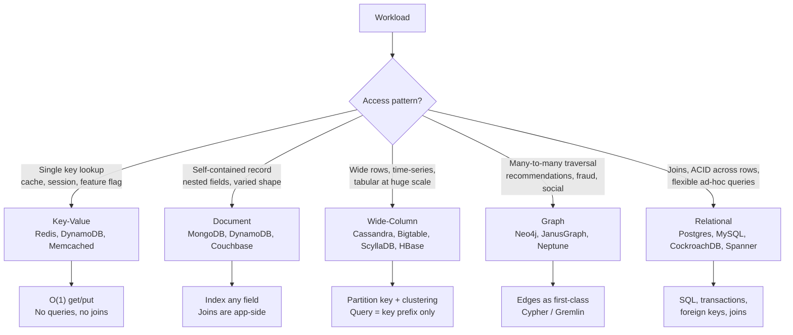
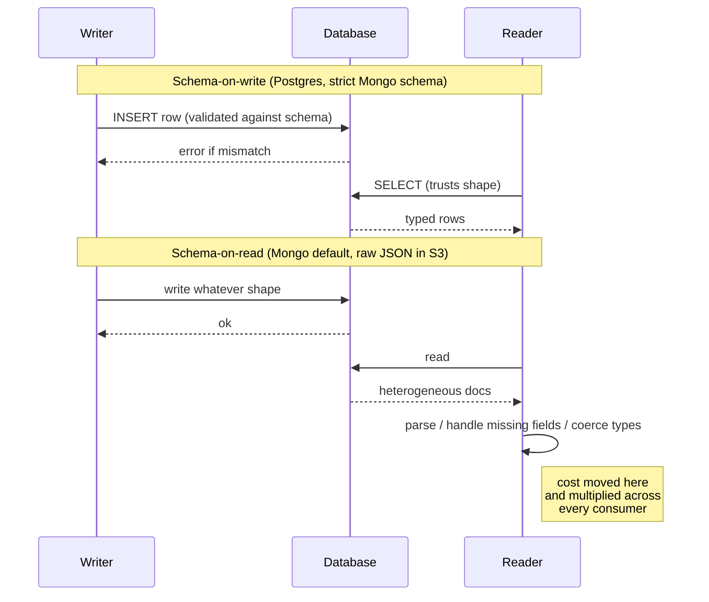
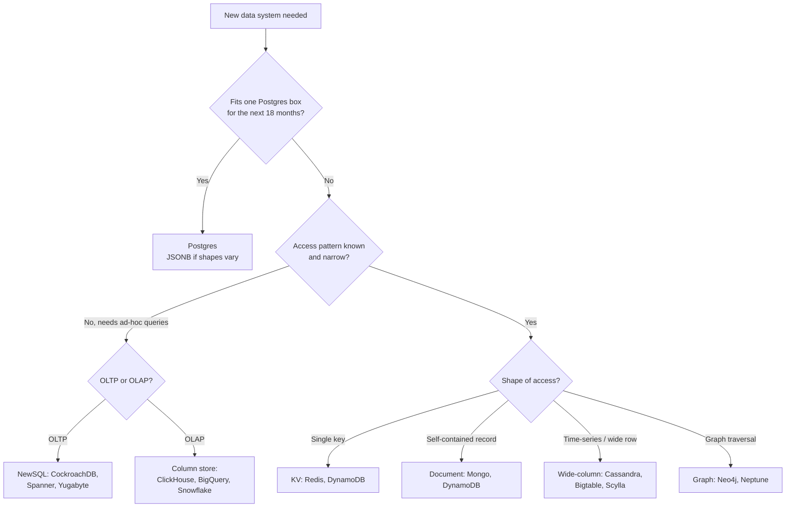

# NoSQL Overview

## Why This Exists

**Problem.** "NoSQL" is a marketing umbrella over four very different data models with very different trade-offs. Teams pick one because Hacker News said so, then discover six months in that they've reimplemented joins in application code, lost transactional integrity, and now own a distributed system instead of a database. The reverse failure is just as common: teams force a graph workload or a 200 TB time-series workload into Postgres and hit a wall they cannot tune their way out of.

**Key insight.** The relational model is not the enemy. The enemy is *data-model mismatch* — when your access pattern, scale, or shape doesn't fit the rows-and-tables-with-joins assumption. NoSQL is a set of *specialized* tools, each optimized for one access pattern. Use them when your workload genuinely matches that specialty. Otherwise pay the cost of relational once and move on.

**Reach for this when:**
- You're choosing between Postgres/MySQL and DynamoDB/Mongo/Cassandra/Neo4j and need a forcing function for the decision.
- A team is proposing "let's switch to NoSQL because schema migrations hurt" — there's usually a cheaper fix.
- You're sizing a system where the access pattern is known and narrow (single-key lookup, time-series append, graph traversal) and want to know which family fits.
- You're auditing an existing NoSQL deployment for "we're using it wrong" smells (multi-document transactions in Mongo, scatter-gather queries in Dynamo, secondary indexes everywhere in Cassandra).

**Don't reach for this when:**
- You need ACID across multiple entities and your scale fits one Postgres instance — just use Postgres. Modern Postgres handles tens of TB and tens of thousands of writes/sec on commodity hardware.
- You're doing ad-hoc analytics — that's a column-store / OLAP problem (ClickHouse, Snowflake, BigQuery, Redshift), not OLTP NoSQL.
- The motivation is "schema-less feels productive". Schema-on-read shifts the cost, it doesn't eliminate it (DDIA ch. 2, "Schema flexibility").

## Diagrams

### The four NoSQL families and what they optimize for



### Schema-on-write vs schema-on-read — where the cost lands



## The four families, concretely

### 1. Key-value (KV)

**Model.** A dictionary. `put(key, value)`, `get(key)`, `delete(key)`. Value is opaque bytes (Memcached) or a few primitive types (Redis: string, list, hash, set, sorted set, stream).

**Optimized for.** Single-key O(1) operations at very high throughput. Caches, sessions, rate-limit counters, feature flags, leaderboards (Redis sorted sets), distributed locks (with caveats — see Martijn Verburg / antirez RedLock debate).

**Examples.** Redis, Memcached, DynamoDB (in pure-key mode), RocksDB (embedded), etcd / ZooKeeper (for small coordination state, not bulk data).

```python
# Redis — typical cache-aside pattern
import redis, json

r = redis.Redis(host="cache.prod", decode_responses=True)

def get_user(user_id: int) -> dict:
    key = f"user:{user_id}"
    cached = r.get(key)
    if cached:
        return json.loads(cached)
    # Cache miss: fall back to source of truth
    user = db.fetch_user(user_id)  # Postgres, etc.
    # SETEX: write with TTL so stale data ages out.
    # NEVER cache forever without a TTL or an invalidation channel —
    # that's how you ship a 6-month-old email address to production.
    r.setex(key, 300, json.dumps(user))
    return user
```

**Don't.** Don't use a KV store as your system of record if you need queries beyond key lookup. "We'll just scan all keys" is a bug — `KEYS *` in Redis blocks the single-threaded server, and a `Scan` in DynamoDB reads the entire table at full request-unit cost.

### 2. Document

**Model.** Collection of self-contained documents (typically JSON/BSON). Each document has a primary key; fields can be indexed; nested arrays and objects are first-class.

**Optimized for.** Aggregates that are read and written as a unit — a product with its variants, a user with their preferences, an order with its line items (Eric Evans / DDD aggregate, not a normalized blob). When the natural unit of work matches the document, you avoid joins entirely.

**Examples.** MongoDB, Couchbase, DynamoDB (document mode), Firestore, RavenDB.

```javascript
// MongoDB — aggregate-shaped document
{
  _id: ObjectId("..."),
  customer_id: "cust_42",
  status: "shipped",
  created_at: ISODate("2026-05-30T10:00:00Z"),
  shipping_address: {
    line1: "1 Main St",
    city: "Seattle",
    country: "US"
  },
  items: [
    { sku: "ABC-123", qty: 2, price_cents: 1999 },
    { sku: "XYZ-999", qty: 1, price_cents: 4500 }
  ],
  total_cents: 8498
}

// Index for common access pattern: "show me this customer's recent orders"
db.orders.createIndex({ customer_id: 1, created_at: -1 })

// What goes wrong: cross-document operations.
// "Move an item from order A to order B" — there is no transaction
// across two documents in classic Mongo deployments unless you opt
// into multi-document transactions (replica set, performance cost,
// and you've now reinvented Postgres).
```

**Failure mode — joins in app code.** If you find yourself fetching documents by ID from collection A, then looping to fetch related documents from collection B, you are doing an N+1 hand-rolled join. Either denormalize (duplicate the joined fields into the outer document and accept update cost) or admit that your data model is relational.

**Failure mode — the "schema-less" lie.** Schema-on-read means every reader must defensively handle every shape ever written. Five years in, your `users` collection has fields named `email`, `Email`, `email_address`, and `contactEmail` — all in production, all in use somewhere. DDIA ch. 2 calls this honestly: schema-on-read is *implicit schema*, not "no schema". The schema lives in your application code, distributed across every service that reads it.

### 3. Wide-column

**Model.** Sparse, distributed, multi-dimensional sorted map. Bigtable's original abstraction (Chang et al., OSDI 2006): `(row_key, column_family:column_qualifier, timestamp) -> value`. Cassandra adapted this into CQL with a tabular feel, but the underlying model is still partition-key + clustering-key + sorted columns.

**Optimized for.** Time-series, event logs, IoT telemetry, large catalogs accessed by composite key — anywhere you write huge volumes and read by a known key prefix. Linear write scaling, predictable latency at TB/PB scale, multi-region active-active (Cassandra).

**Examples.** Apache Cassandra, ScyllaDB (C++ rewrite of Cassandra), Google Bigtable, Apache HBase, Amazon Keyspaces.

```sql
-- Cassandra CQL: model the table around the query, not the entity.
-- "Show me the last 100 events for a sensor in time order" is the
-- access pattern, so partition by sensor and cluster by time desc.

CREATE TABLE sensor_readings (
    sensor_id text,
    bucket_day date,           -- bound partition size; one partition per sensor-day
    ts timestamp,
    value double,
    PRIMARY KEY ((sensor_id, bucket_day), ts)
) WITH CLUSTERING ORDER BY (ts DESC);

-- Read: O(seek-to-partition) + sequential scan within partition.
SELECT ts, value
FROM sensor_readings
WHERE sensor_id = 'rack-7-temp' AND bucket_day = '2026-06-05'
LIMIT 100;
```

**The cardinal sin.** Querying without the partition key. In Cassandra this either fails outright or, with `ALLOW FILTERING`, scatter-gathers across every node — pager-duty bait at scale. Wide-column databases force you to know your access patterns in advance. If you don't, you have an OLTP problem, not a wide-column problem.

**Hot partitions.** A single Justin-Bieber-style celebrity user, a single popular sensor, a single big customer — these turn one partition into the bottleneck for the whole cluster. Bound partition size deliberately (the `bucket_day` trick above), and watch for skew with `nodetool tablestats` / equivalent.

### 4. Graph

**Model.** Nodes (vertices) and edges, both with properties. Edges are first-class — querying "friends of friends who liked X" is a constant-edge traversal, not a six-way self-join.

**Optimized for.** Workloads where relationships *are* the workload: fraud rings, recommendation graphs, knowledge graphs, social graphs, supply-chain dependency analysis, IAM policy resolution.

**Examples.** Neo4j (Cypher), JanusGraph (Gremlin), Amazon Neptune (Cypher + Gremlin + SPARQL), TigerGraph, ArangoDB (multi-model).

```cypher
// Neo4j Cypher — "Find users within 3 hops of a known fraud account
// who share a device fingerprint with them."
MATCH (fraud:User {flagged: true})-[:USED_DEVICE]->(d:Device)
MATCH (suspect:User)-[:USED_DEVICE]->(d)
WHERE suspect <> fraud
MATCH path = shortestPath((fraud)-[:TRANSACTED_WITH*..3]-(suspect))
RETURN suspect.id, length(path), d.fingerprint
ORDER BY length(path)
LIMIT 50;
```

The same query in SQL is several self-joins on a recursive CTE, gets slower with each hop, and breaks the optimizer's cardinality estimates. In a graph DB it's one index seek + bounded traversal.

**Don't reach for this when** the graph aspect is incidental (e.g., a `parent_id` foreign key one level deep). Postgres + a recursive CTE handles three-hop traversals on millions of rows just fine. Graph DBs earn their keep when traversals are deep, the graph is dense, and the query is the product.

## Trade-offs

| Benefit | Cost |
|---|---|
| KV: O(1) lookup at millions of ops/sec | No queries beyond the key; no relationships |
| Document: aggregate matches the unit of work; flexible shapes | Joins move to app code; multi-doc transactions are bolted-on or absent |
| Wide-column: linear write scaling, multi-region, PB-scale | Must model around access patterns up front; secondary indexes are weak |
| Graph: traversals are cheap and expressive | Aggregate analytics ("count all users") are awkward; sharding deep graphs is hard |
| Schema-on-read: writers don't block on schema migrations | Readers pay forever; debugging "what shape is this field today" gets expensive |
| Relational: ACID, joins, mature tooling, predictable | Vertical scaling has limits (~10s of TB / ~10s of k writes-per-sec on a single primary before you need sharding) |
| Eventual consistency: better availability and lower latency | Stale reads, lost-update anomalies; pushes correctness work into the application |
| Strong consistency (Spanner, CockroachDB): SQL semantics at scale | Latency floor from quorum/Paxos; cross-region writes are expensive |

## Common Pitfalls

- **"NoSQL = no schema."** False. Every database has a schema; in document/KV stores it lives in your application code. Validate at the edge (JSON Schema, Pydantic, Zod) or you'll be debugging field-name typos in production for years.
- **Reaching for NoSQL to dodge migrations.** A `pt-online-schema-change` or Postgres `ADD COLUMN ... DEFAULT NULL` is almost always cheaper than rewriting onto a new data model. Migrations hurt because of bad process (long locks, no shadow reads, no expand-contract) — not because of SQL.
- **Multi-document transactions in Mongo.** Available since 4.0, but they are *not* free, *not* the default, and a strong sign you've modeled the data wrong. If you regularly need them, your aggregate boundary is in the wrong place — or you should be in Postgres.
- **`Scan` in DynamoDB / `ALLOW FILTERING` in Cassandra.** Both read every partition. Both will eventually melt the table or your wallet. If you're tempted, you have an unindexed access pattern — design for it explicitly (GSI, secondary table, materialized view) or move the query to a search/analytics tier (OpenSearch, ClickHouse).
- **Hot partitions.** One celebrity user, one big tenant, one popular sensor. Symptoms: p99 spike on one node, throttling errors on Dynamo (`ProvisionedThroughputExceeded` for one partition while the table average is fine). Fix: write-sharding the key (`user_id#shard_0..N`), bucketing time, or read-replicating the hot key into a cache.
- **Eventual consistency surprises.** Read-your-writes, monotonic reads, and causal consistency are *not* given by default in Cassandra or DynamoDB. Read DDIA ch. 5 and ch. 9 before you assume "it'll be fine".
- **Picking the wrong consistency level.** Cassandra `ONE` writes are fast and lossy under failure; `QUORUM` is the usual default; `ALL` deadlocks on any node failure. Tune per-query, not globally.
- **Treating Redis as a database.** Redis is in-memory by default; persistence (RDB/AOF) is *durable-ish* but not transactional with your other writes. Use it as a cache or ephemeral state, not the system of record for money.
- **Picking graph for shallow joins.** Three-table join in Postgres is faster than spinning up Neo4j. Graph DBs win at depth, not at breadth.
- **"We'll move to Postgres later if we need to."** Migrations between data models are 6–18 month projects. Pick the right primitive on day one or accept that the rewrite is part of the roadmap.
- **Ignoring operational reality.** Cassandra repair, Mongo replica-set elections, Dynamo capacity planning, Neo4j backup-while-online — each NoSQL family has its own ops curriculum. Budget for it.

## Decision Table

| Workload | Pick | Don't pick | Why |
|---|---|---|---|
| Cache, session store, rate-limit counter | Redis / Memcached | Document or wide-column | KV is optimal; anything richer adds cost without benefit |
| Single-tenant CRUD app, < 10TB, < 5k writes/sec | Postgres | Mongo / Cassandra | Postgres handles this with one box and gives you joins + ACID |
| Multi-tenant SaaS, varied per-tenant fields, OLTP | Postgres with JSONB columns OR document DB | Wide-column | JSONB in Postgres covers most of the "flexible shape" need without losing SQL |
| IoT telemetry, 100k+ writes/sec, time-keyed reads | Cassandra / ScyllaDB / Bigtable / TimescaleDB | Mongo, Postgres | Wide-column is purpose-built for this; partition key = device, cluster key = time |
| User profile + nested preferences + activity feed | Document (Mongo) or DynamoDB | Wide-column, graph | Aggregate fits the document model; reads/writes are one round trip |
| Recommendation engine, fraud rings, social graph | Neo4j / Neptune / JanusGraph | Document, relational | Edges are the workload; traversal cost dominates |
| Global app needing low write latency in every region | DynamoDB Global Tables, Cassandra multi-DC, Spanner/Cockroach for SQL | Single-primary Postgres | Multi-master replication or external consensus is required |
| Strong consistency + horizontal scale + SQL | CockroachDB / Spanner / YugabyteDB | Mongo, Cassandra | "NewSQL" — pay latency for correctness |
| Ad-hoc analytics over events / logs | ClickHouse / BigQuery / Snowflake / DuckDB | OLTP NoSQL | Column stores are 10–100x faster for aggregates |
| Full-text search, fuzzy match, faceting | OpenSearch / Elasticsearch / Meilisearch / Postgres `tsvector` | Mongo, Cassandra | Inverted index is a different data structure |
| Embedded / single-process, < 100GB | SQLite / RocksDB / DuckDB | A clustered NoSQL | No network, no ops, no failure modes you don't already own |

## A pragmatic decision flow



## References

- Kleppmann, Martin — *Designing Data-Intensive Applications* — **ch. 2 "Data Models and Query Languages"** (relational vs document vs graph; schema-on-read vs schema-on-write), **ch. 5 "Replication"**, **ch. 6 "Partitioning"**, **ch. 9 "Consistency and Consensus"** — https://dataintensive.net/
- Chang, F. et al. — *Bigtable: A Distributed Storage System for Structured Data* (OSDI 2006) — https://research.google/pubs/bigtable-a-distributed-storage-system-for-structured-data/
- DeCandia, G. et al. — *Dynamo: Amazon's Highly Available Key-value Store* (SOSP 2007) — https://www.allthingsdistributed.com/files/amazon-dynamo-sosp2007.pdf
- Lakshman & Malik — *Cassandra: A Decentralized Structured Storage System* (LADIS 2009) — https://www.cs.cornell.edu/projects/ladis2009/papers/lakshman-ladis2009.pdf
- Corbett, J. et al. — *Spanner: Google's Globally-Distributed Database* (OSDI 2012) — https://research.google/pubs/spanner-googles-globally-distributed-database-2/
- Helland, Pat — *Life Beyond Distributed Transactions: An Apostate's Opinion* (CIDR 2007) — https://www.ics.uci.edu/~cs223/papers/cidr07p15.pdf
- Helland, Pat — *Immutability Changes Everything* (ACM Queue 2015) — https://queue.acm.org/detail.cfm?id=2884038
- Fowler, Martin — *NoSQL Distilled: A Brief Guide to the Emerging World of Polyglot Persistence* (book) and *PolyglotPersistence* — https://martinfowler.com/bliki/PolyglotPersistence.html
- Brewer, Eric — *CAP Twelve Years Later: How the "Rules" Have Changed* — https://www.infoq.com/articles/cap-twelve-years-later-how-the-rules-have-changed/
- Vogels, Werner — *Eventually Consistent* (ACM Queue / All Things Distributed) — https://www.allthingsdistributed.com/2008/12/eventually_consistent.html
- AWS Builders' Library — *Amazon DynamoDB: ten years of transformation* and *Challenges with distributed systems* — https://aws.amazon.com/builders-library/
- Sivasubramanian, S. et al. — *Amazon DynamoDB: A Scalable, Predictably Performant, and Fully Managed NoSQL Database Service* (USENIX ATC 2022) — https://www.usenix.org/conference/atc22/presentation/elhemali
- Google SRE Book — *Data Integrity: What You Read Is What You Wrote* — https://sre.google/sre-book/data-integrity/
- Bailis, Peter — *Linearizability versus Serializability* — http://www.bailis.org/blog/linearizability-versus-serializability/
- Robinson, Webber, Eifrem — *Graph Databases* (O'Reilly, 2nd ed.) — https://neo4j.com/graph-databases-book/

## See Also

- `../consistency-models/` — linearizable, sequential, causal, eventual: what your DB actually gives you
- `../replication/` — leader/follower, multi-leader, leaderless across families
- `../../performance/caching/` — Redis-as-cache patterns, cache-aside, write-through, invalidation
