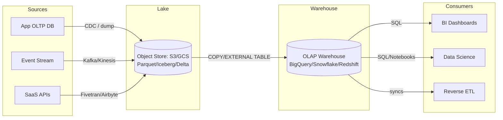
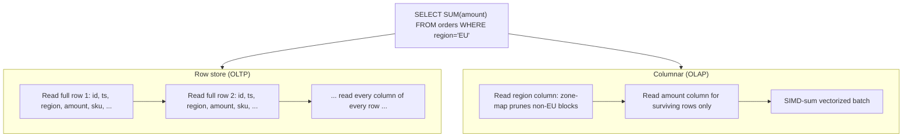
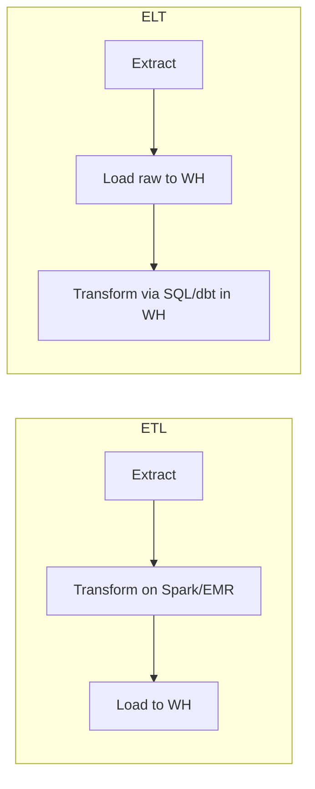

# OLAP Warehouses

## Why This Exists

**Problem.** Online Transaction Processing (OLTP) systems — Postgres, MySQL, DynamoDB — are optimized for many small writes and point reads of single rows by primary key. They store data row-by-row on disk. The moment a query asks `SELECT SUM(revenue) FROM orders WHERE order_date BETWEEN ... GROUP BY region`, the engine drags every byte of every row into memory just to read three columns out of forty. At billions of rows this is hopeless: hours of I/O, lock contention with the live application, and a finance team that gives up on dashboards.

**Key insight.** Analytical workloads have an entirely different access pattern: **few, large, scan-heavy, aggregation-shaped queries over append-mostly data**. That difference rewrites the entire stack: storage layout (columnar, not rowwise), execution model (vectorized, not tuple-at-a-time), schema design (denormalized stars, not 3NF), update model (batch ELT, not row-level CRUD), and pricing model (compute-storage separation, scan-bytes pricing). An OLAP warehouse is a database that has made all of these choices in the analytical direction.

**Reach for an OLAP warehouse when:**
- You need to scan / aggregate over hundreds of millions to trillions of rows.
- Queries touch a few columns out of many (typical analytics).
- Workload is append-heavy with periodic batch loads, not high-rate row updates.
- You need to isolate analytical load from the OLTP system serving the product.
- You want SQL with window functions, GROUPING SETS, and time-series friendliness.
- BI tools (Tableau, Looker, Superset, Metabase) need predictable sub-minute responses.

**Don't reach for it when:**
- You need single-row point reads under 10 ms — use OLTP or a KV store.
- You need high-rate row-level updates / deletes — warehouses pay heavily for those.
- Your data fits in RAM on one machine and is rarely refreshed — use DuckDB or Polars on Parquet.
- You need sub-second p99 on highly selective filters — that's a search index (Elasticsearch / OpenSearch) or a row store with the right index.
- You need true streaming materialized views — that's Materialize, RisingWave, or Flink.
- Your queries are mostly small and your data is small — an OLAP warehouse is overhead and bill shock.

## Diagrams

### Where OLAP fits in a modern data stack



### Row vs column storage on the same query



## Core engines: when each one wins

The "big four cloud" plus two open-source workhorses. Pick by access pattern, not brand affinity.

### BigQuery (Google)
- **Architecture.** Dremel descendant. Fully serverless. Storage in Capacitor (proprietary columnar) on Colossus; compute in slots that come and go per query. Shuffle in memory + spill.
- **Pricing.** On-demand: $/TB scanned (after column pruning + partition pruning). Or "Editions" with reserved slot capacity (autoscaling).
- **Wins when.** You want zero infra, bursty workloads, ad-hoc analytics, and are happy paying for scanned bytes. Excellent for event-stream-shaped data with `PARTITION BY DATE(event_time)` and `CLUSTER BY user_id`. Strong ML integration (BQML, Vertex).
- **Loses when.** Mixed predictable + bursty workloads make pricing unpredictable. UPDATE/DELETE costs full partition rewrites. No real "indexes" — your design is the index.

### Snowflake
- **Architecture.** Decoupled storage (micro-partitions in S3/GCS/Azure) + virtual warehouses (clusters of compute that you size T-shirt style XS..6XL). Multi-cluster auto-scale for concurrency.
- **Pricing.** Credits per warehouse-second; storage billed separately at near-S3 rates.
- **Wins when.** You want strong SQL ergonomics, time travel, zero-copy clones, native semi-structured (`VARIANT`), and per-team isolation via separate warehouses. Best-in-class for governance + sharing (Snowflake Marketplace).
- **Loses when.** Idle warehouses cost you (autosuspend mitigates but doesn't eliminate). Result caching is generous but invalidates aggressively. UDF performance lags BigQuery for complex Python.

### Amazon Redshift
- **Architecture.** Two flavors. **Provisioned** (RA3 nodes, managed storage on RMS backed by S3) — you pick node count and type. **Serverless** — RPU-based autoscaling. AQUA acceleration for some scans.
- **Pricing.** Provisioned: per-node-hour. Serverless: per RPU-hour with a min charge. Concurrency Scaling adds burst clusters.
- **Wins when.** You're deep in AWS, need tight VPC isolation, use Redshift Spectrum to query S3 directly, or want predictable provisioned cost. Federated queries to RDS/Aurora are real.
- **Loses when.** VACUUM and ANALYZE still matter on provisioned (managed storage helps but isn't free). Historically slower than BigQuery/Snowflake for unsorted ad-hoc workloads — RA3 + AQUA closed much of the gap but you'll feel sort key / dist key choices.

### ClickHouse
- **Architecture.** Open-source columnar OLAP, MergeTree family of table engines. Built for absurd ingestion rates (millions of rows/sec) and sub-second analytics on tens-of-billions of rows on a single shard.
- **Pricing.** Self-host (free) or ClickHouse Cloud (managed, separated compute/storage like Snowflake).
- **Wins when.** Real-time analytics with 1-5 second latency from event → queryable. Observability backends (Uber M3, Cloudflare logs, Sentry, PostHog). High-cardinality time-series with `ORDER BY (tenant_id, timestamp)` primary keys. Massive cost wins vs cloud warehouses at scale.
- **Loses when.** You need rich UPDATE/DELETE semantics — `ALTER ... UPDATE` is a mutation queue, not transactional. JOINs across large tables are notoriously trickier than Snowflake/BigQuery (right table broadcast, watch memory). SQL dialect has its own corners.

### DuckDB
- **Architecture.** Embedded (in-process) columnar OLAP engine. Single-binary, no server. Vectorized execution descended directly from MonetDB / X100 lineage. Reads Parquet / CSV / Arrow / Postgres directly without import.
- **Pricing.** Free. Runs on a laptop. MotherDuck offers a managed cloud version.
- **Wins when.** Your data fits on one fat machine (now ~10 TB feasible with NVMe and 256 GB RAM). Local interactive analytics, notebook work, pre-cloud prototyping, CI test fixtures, embedded analytics in apps. **For 1-50 GB workloads it routinely beats a cloud warehouse on cost AND latency** because there's no network round trip.
- **Loses when.** You need multi-user concurrency at scale, governance, time travel, sharing, or genuinely petabyte data. It's a single-process engine.

### The picking rule
- **Tiny (< 100 GB), single-user, ad-hoc:** DuckDB on Parquet in S3. Done.
- **Real-time observability / event analytics:** ClickHouse.
- **Mixed enterprise BI + governance + sharing:** Snowflake.
- **Already AWS-native, predictable workload:** Redshift Serverless or RA3.
- **Bursty, ad-hoc, GCP-native, ML-heavy:** BigQuery.

## Columnar storage: the foundation

Every OLAP engine above stores data **column-by-column**, not row-by-row. This single decision drives most performance properties.

```text
Row store layout (Postgres heap page):
[row1: id=1 | region=EU | amount=42 | sku=A]
[row2: id=2 | region=US | amount=17 | sku=B]
[row3: id=3 | region=EU | amount=99 | sku=A]

Columnar layout (Parquet / Capacitor / MergeTree):
id      column block:    [1, 2, 3, ...]
region  column block:    [EU, US, EU, ...]   <-- dictionary-encoded -> [0,1,0,...]
amount  column block:    [42, 17, 99, ...]   <-- delta + RLE friendly
sku     column block:    [A, B, A, ...]
```

What columnar buys you:

1. **Column pruning.** A query touching 3 of 40 columns reads ~7.5% of bytes. BigQuery on-demand pricing is literally bytes-scanned-after-pruning.
2. **Compression.** Same-type values compress 10-30x: RLE for low cardinality, dictionary for strings, delta + bit-packing for integers/timestamps, FOR (frame-of-reference) for sorted data, ZSTD/LZ4 on top.
3. **Zone maps / min-max indexes.** Each column block stores `min`, `max`, `null_count`. `WHERE order_date = '2026-06-01'` skips entire blocks whose min/max don't intersect.
4. **Vectorized execution** (next section) becomes possible because you operate on contiguous arrays of one type.

The cost: writes are far more expensive. A single-row INSERT touches every column file. That's why warehouses prefer **batch loads** and treat row-by-row updates as antipatterns.

## Vectorized execution

Classic database engines (Postgres, MySQL) use the **Volcano / iterator model**: each operator pulls one tuple at a time via `next()`. Per-tuple virtual function dispatch dominates CPU. Modern OLAP engines (Vectorwise/X100, DuckDB, ClickHouse, Snowflake, BigQuery) use **vectorized execution**: each operator processes a **batch** (e.g. 1024 or 65536 values) at a time, in tight loops the compiler can auto-vectorize into SIMD.

Pseudocode contrast:

```python
# Volcano model — high overhead per tuple
def filter_then_sum():
    total = 0
    for row in scan():        # virtual call per row
        if row.region == 'EU': # branch per row
            total += row.amount
    return total

# Vectorized model — operate on batches
def filter_then_sum_vec():
    total = 0
    for batch in scan_batched(size=4096):     # one call per 4096 rows
        mask = batch.region == 'EU'           # SIMD compare, 8-way at once
        total += batch.amount.where(mask).sum()  # SIMD add
    return total
```

The win is roughly **10-100x on raw scan/aggregate kernels**, and it composes with columnar storage: each batch is already a contiguous array of one dtype.

The other modern technique is **just-in-time (JIT) query compilation** — used by HyPer (now SAP), CockroachDB analytical paths, and parts of ClickHouse. It generates LLVM IR per query, eliminating interpreter overhead entirely. Vectorization vs JIT is now mostly converging; vectorization tends to win for ad-hoc workloads (no compilation latency), JIT can win on long-running OLAP queries.

## Schema design: star vs snowflake vs OBT

The schema you give your OLAP engine determines whether queries are 10 ms or 10 minutes.

### Star schema (Kimball)

A central **fact table** (one row per event: order, click, page-view) surrounded by **dimension tables** (denormalized: customers, products, dates, stores).

```sql
-- Fact: narrow, deep, billions of rows
CREATE TABLE fact_orders (
    order_id        BIGINT,
    order_date_key  INT,        -- FK to dim_date
    customer_key    BIGINT,     -- FK to dim_customer
    product_key     BIGINT,     -- FK to dim_product
    store_key       INT,        -- FK to dim_store
    quantity        INT,
    gross_amount    NUMERIC(12,2),
    discount_amount NUMERIC(12,2),
    net_amount      NUMERIC(12,2)
)
PARTITION BY RANGE (order_date_key)
CLUSTER BY (customer_key);

-- Dimension: wide, shallow, denormalized
CREATE TABLE dim_customer (
    customer_key       BIGINT,           -- surrogate key
    customer_id        VARCHAR,          -- natural key
    full_name          VARCHAR,
    email              VARCHAR,
    country            VARCHAR,
    region             VARCHAR,
    segment            VARCHAR,          -- denormalized from a separate segment table
    signup_date        DATE,
    is_current         BOOLEAN,          -- SCD type 2 marker
    valid_from         TIMESTAMP,
    valid_to           TIMESTAMP
);
```

**Why it's the default.** Single hop joins. The engine broadcasts small dim tables to every node, scans the big fact table once, hash-joins in memory. Star schemas are predictable, BI-tool-friendly, and play well with semantic layers like Looker/dbt/Cube.

### Snowflake schema

Same as star but dimensions are **further normalized** (e.g. `dim_product → dim_category → dim_department`). Saves storage; costs joins.

**Pick snowflake when:** dimension hierarchies are huge (millions of products with shared rare attributes) AND your engine handles many-table joins well (BigQuery, Snowflake, Redshift do; ClickHouse struggles).

**Pick star when:** unsure. It's the default for a reason.

### One Big Table (OBT) / wide event tables

Modern columnar engines + analytics engineering (dbt) push toward **denormalizing all the way**: every event row carries a copy of every dimension attribute it cares about. Joins disappear; storage grows; updates to dimensions require re-stamping the fact (or accepting historical drift, which is often what you want anyway).

**OBT wins when:** your engine has cheap columnar storage, your dimensions don't change often, your BI users are unreliable joiners, and you want maximum query simplicity. ClickHouse and BigQuery push this pattern hard.

```sql
-- OBT: every event carries denormalized context
CREATE TABLE events_orders_wide (
    event_time         TIMESTAMP,
    order_id           BIGINT,
    customer_id        VARCHAR,
    customer_country   VARCHAR,    -- denormalized
    customer_segment   VARCHAR,    -- denormalized
    product_sku        VARCHAR,
    product_category   VARCHAR,    -- denormalized
    product_department VARCHAR,    -- denormalized
    quantity           INT,
    net_amount         NUMERIC(12,2)
)
PARTITION BY DATE(event_time)
CLUSTER BY (customer_id, product_sku);
```

## Slowly changing dimensions (SCD)

Customer "Alice" lived in Germany on 2024-03-01 and moved to France on 2025-01-15. Her order from 2024 should report Germany; her order from 2025 should report France. How you handle that is the SCD problem.

| Type | What it does | When to use | Cost |
|------|-------------|-------------|------|
| **SCD 0** | Never change. Historical attributes are frozen. | Truly immutable: birth date, original signup date. | Trivial. |
| **SCD 1** | Overwrite. Lose history. | Corrections, typo fixes, data quality. | Cheapest. **Audit-hostile.** |
| **SCD 2** | New row per change with `valid_from / valid_to / is_current`. Surrogate key changes; natural key stable. | Default for any business attribute that drives reporting (region, segment, plan tier). | Storage 2-10x. Joins use date-range. |
| **SCD 3** | Add `previous_value` column. Keep current + one prior. | Cheap "what was it before this change?" lookups. | Limited history. |
| **SCD 4** | Mini-dimension: split fast-changing attrs into a separate dim. | Hot attrs (e.g. customer activity tier) on a slow dim. | More joins. |
| **SCD 6** | Hybrid 1+2+3. Both row-versioned history *and* a current-value column on every historical row. | When you want "as-of" AND "current" in one query. | Most storage; most flexibility. |

**SCD 2 join pattern:**
```sql
SELECT f.order_id, f.net_amount, c.country  -- country AS-OF the order
FROM fact_orders f
JOIN dim_customer_scd2 c
  ON f.customer_id = c.customer_id
 AND f.order_date BETWEEN c.valid_from AND c.valid_to;
```

The `BETWEEN` join is the SCD-2 tax. Most engines handle it fine if `dim_customer_scd2` is broadcast or properly clustered.

## ELT vs ETL

**ETL (classic, 1990s-2010s):** **E**xtract from source → **T**ransform on a separate compute layer (Informatica, Talend, Spark, custom Python) → **L**oad transformed data into the warehouse.

**ELT (modern, post-2015):** **E**xtract → **L**oad raw into the warehouse → **T**ransform inside the warehouse using SQL (dbt is the reference tool).



**ELT won** because:
- Cloud warehouses are now cheaper than the Spark cluster you'd run for transforms.
- Storage is so cheap that keeping raw + multiple cleaned layers is fine.
- dbt brought software engineering practices (tests, docs, lineage, version control) to SQL transforms.
- Re-running transforms when business rules change is trivial (it's just SQL, source data is right there).

**ETL still wins when:** transform logic genuinely needs Python/Java (geospatial, ML feature gen, complex parsing), or warehouse compute is more expensive than dedicated Spark for a specific job, or compliance requires PII to never land in the warehouse raw.

The dbt-style **medallion architecture** is now canonical:
- **Bronze / raw:** byte-exact copy of source. Append-only. SCD-2 at this layer if needed.
- **Silver / staging:** cleaned, typed, deduplicated, conformed dimensions.
- **Gold / marts:** business-facing facts and dimensions. Star schemas. What BI tools query.

## Cost models — the part that surprises everyone

The bill is rarely "compute hours." It's a different shape per engine. Pick a model that matches your workload.

### BigQuery (on-demand)
- **Cost driver:** bytes scanned **after partition pruning and column pruning**.
- **Cost killers:** `SELECT *` on a wide table; missing partition filter; non-clustered LIKE scans; UDF wrapped predicates that defeat pruning.
- **Cost wins:** `PARTITION BY DATE(event_time)`, `CLUSTER BY user_id`, materialized views, BI Engine reservation for hot dashboards, project-level "maximum bytes billed" guardrails.
- **War story.** A single Looker dashboard with 12 tiles all doing `WHERE event_date >= CURRENT_DATE - 30` on an unpartitioned table billed $4,800 in one afternoon. Partitioning + a 24-hour result cache cut it to $11/day.

### Snowflake
- **Cost driver:** **warehouse-seconds**. A warehouse running with 1 query and a warehouse running with 8 queries cost the same per second.
- **Cost killers:** auto-suspend set too high (60s default is fine for ad-hoc; lower for scripted loads). Oversized warehouses for small queries. Long-running idle sessions on a Large+ warehouse.
- **Cost wins:** right-size warehouses per workload (XS for ingestion sometimes beats Medium); use multi-cluster auto-scale for concurrency rather than one big warehouse; result cache + metadata cache; query acceleration service; suspend on idle aggressively.

### Redshift
- **Cost driver:** node-hours (provisioned) or RPU-hours (Serverless). Concurrency Scaling clusters add burst.
- **Cost killers:** undersized cluster causing queue waits + concurrency scaling charges; bad sort/dist keys causing data redistribution; unloaded large result sets back into S3 unnecessarily.
- **Cost wins:** Right sort key (compound vs interleaved), right dist style (KEY for join-heavy, EVEN for scans, ALL for small dims), `COPY` from S3 (parallel, fast) over `INSERT`, RA3 + managed storage to decouple.

### ClickHouse
- **Cost driver:** self-host: hardware (CPU + NVMe + RAM). Cloud: separated compute/storage similar to Snowflake.
- **Cost killers:** wrong `ORDER BY` primary key (full table scans), JOIN with the larger table on the right side (it gets broadcast), missing `PARTITION BY` (hurts retention drops, not query speed).
- **Cost wins:** ClickHouse on a single beefy box (96 vCPU, 384 GB RAM, 10 TB NVMe) routinely outperforms a 16-node cloud warehouse on event-shaped workloads — at 1/10th the cost.

### DuckDB
- **Cost driver:** the laptop you already have.
- **Cost wins:** for 1-50 GB workloads, going from "BigQuery query that scans 30 GB" to "duckdb on the parquet directly" is the difference between $0.15/query and $0.0001/query (electricity). Multiply by 10,000 dashboard refreshes/month and the math gets loud.

## When local DuckDB beats a cloud warehouse

This is the under-appreciated truth in 2026. **Cloud warehouses are economically irrational below a certain data scale.** That scale keeps moving up as laptops get fatter.

A modern dev laptop has 32-128 GB RAM, an NVMe SSD with 5 GB/s read, and 8-16 cores. A workstation has 256 GB RAM, dual NVMe at 12 GB/s combined, 64+ cores. DuckDB at full pelt scans Parquet on local NVMe at ~3-10 GB/s.

Concretely:

| Data size | DuckDB on laptop | Cloud warehouse |
|-----------|------------------|-----------------|
| < 1 GB | < 100 ms typical query | 2-5 s (network + cold start) |
| 1-10 GB | 0.5-3 s | 2-10 s |
| 10-100 GB | 5-30 s | 5-30 s (parity zone) |
| 100 GB - 1 TB | minutes (memory pressure) | 10-60 s (warehouse wins) |
| > 1 TB | not realistic single-node | warehouse mandatory |

**The 100 GB Parquet sweet spot:** if your team's analytics is ad-hoc exploration over the last N days/months of an event log that fits in a few hundred GB of Parquet on S3, the workflow:

```bash
# Read directly from S3, no import, no warehouse
duckdb -c "
  CREATE OR REPLACE VIEW events AS
    SELECT * FROM read_parquet('s3://bucket/events/dt=2026-*/**/*.parquet');
  SELECT user_id, count(*) AS evt
  FROM events
  WHERE event_type = 'checkout'
  GROUP BY 1
  ORDER BY evt DESC LIMIT 50;
"
```

… runs faster than the equivalent BigQuery on-demand query, costs the price of the S3 GETs, and works offline once cached.

**When local DuckDB stops winning:**
- Multiple concurrent users (DuckDB is single-process; MotherDuck or duckdb-server can help, but you've left the simplicity zone).
- Governance, RBAC, audit, fine-grained sharing.
- Data > working set RAM AND query is not selective enough to spill cleanly.
- Real-time ingestion at high rate.
- Compliance requirements that mandate a managed service.

## Real query patterns and antipatterns

```sql
-- ANTIPATTERN: SELECT * on a wide table — bills you for every column
SELECT *
FROM events
WHERE event_date = '2026-06-01';

-- GOOD: Project only what you need
SELECT user_id, event_type, properties.utm_source
FROM events
WHERE event_date = '2026-06-01';

-- ANTIPATTERN: Function on partitioned column — defeats partition pruning
SELECT count(*)
FROM events
WHERE CAST(event_date AS STRING) = '2026-06-01';

-- GOOD: Compare partition column to literal of its native type
SELECT count(*)
FROM events
WHERE event_date = DATE '2026-06-01';

-- ANTIPATTERN: COUNT(DISTINCT user_id) on a billion-row table without approximation
SELECT COUNT(DISTINCT user_id) FROM events WHERE event_date >= '2026-01-01';

-- GOOD: Use HLL approximation when ±1% error is fine (it almost always is for dashboards)
SELECT APPROX_COUNT_DISTINCT(user_id) FROM events WHERE event_date >= '2026-01-01';
-- BigQuery: APPROX_COUNT_DISTINCT
-- Snowflake: APPROX_COUNT_DISTINCT or HLL()
-- Redshift: APPROXIMATE COUNT(DISTINCT ...)
-- ClickHouse: uniq() / uniqHLL12()
-- DuckDB: approx_count_distinct()

-- ANTIPATTERN: SCD-2 join with cross product because of overlapping validity
SELECT f.*, c.region
FROM fact_orders f
JOIN dim_customer c ON f.customer_id = c.customer_id;  -- multiplies rows!

-- GOOD: Range-bound the join
SELECT f.*, c.region
FROM fact_orders f
JOIN dim_customer c
  ON f.customer_id = c.customer_id
 AND f.order_date >= c.valid_from
 AND f.order_date <  c.valid_to;
```

## A complete dbt-style transformation example

```sql
-- models/staging/stg_orders.sql — typed, deduped, near-raw
{{ config(materialized='view') }}
SELECT
    CAST(order_id AS BIGINT)                   AS order_id,
    CAST(customer_id AS VARCHAR)               AS customer_id,
    CAST(order_ts AS TIMESTAMP)                AS order_ts,
    DATE(order_ts)                             AS order_date,
    CAST(amount_cents AS BIGINT) / 100.0       AS amount_usd,
    _ingested_at
FROM {{ source('raw', 'orders') }}
QUALIFY ROW_NUMBER() OVER (
    PARTITION BY order_id ORDER BY _ingested_at DESC
) = 1;  -- dedupe on natural key, keep latest ingest

-- models/marts/fact_orders.sql — incremental, partitioned
{{ config(
    materialized='incremental',
    incremental_strategy='insert_overwrite',
    partition_by={'field': 'order_date', 'data_type': 'date'},
    cluster_by=['customer_id']
) }}
SELECT
    o.order_id,
    o.order_date,
    o.customer_id,
    c.customer_key,            -- SCD-2 surrogate, joined as-of order_ts
    o.amount_usd
FROM {{ ref('stg_orders') }} o
LEFT JOIN {{ ref('dim_customer_scd2') }} c
       ON o.customer_id = c.customer_id
      AND o.order_ts >= c.valid_from
      AND o.order_ts <  c.valid_to

WHERE o.order_date >= (SELECT MAX(order_date) - INTERVAL 3 DAY FROM {{ this }})
;
```

The incremental + late-arriving-data-window pattern (3 days back) is the standard fix for the "events arrive a day late" problem without reprocessing the whole table.

## Trade-offs

| Benefit | Cost |
|--------|------|
| Columnar storage gives 10-30x compression and column pruning | Row-level UPDATE/DELETE is expensive — write the whole column block |
| Vectorized execution gives 10-100x scan speedup | Complex per-row UDFs in Python lose most of the win unless vectorized themselves |
| Decoupled storage/compute (Snowflake/BigQuery/Redshift RA3) lets you scale them independently | Cross-region/cross-account data egress and concurrency limits become the real bottleneck |
| Star schemas are simple and fast | Conformed dimensions across teams require governance you usually don't have |
| SCD-2 preserves history perfectly | 2-10x storage on dimensions; every fact join is a date-range join |
| ELT is flexible and re-runnable | Raw PII can land in the warehouse before transforms; compliance review needed |
| BigQuery on-demand pricing is "no cluster to manage" | One bad query bills $1,000s; mandatory `--maximum_bytes_billed` and project quotas |
| Snowflake warehouses are easy to scale up | Idle warehouses bill if auto-suspend isn't tight; dev environments leak money |
| ClickHouse is blazing fast and cheap | JOIN ergonomics, mutation semantics, and operational tooling are weaker than commercial WHs |
| DuckDB is free, fast, local | Single-process, no concurrency, no governance — wrong tool for shared production analytics |
| OBT (one big table) eliminates joins | Storage explodes; updates to dimensions require fact rewrites or accepting drift |

## Common Pitfalls

- **`SELECT *` in BI tools.** Looker/Tableau "explore" features generate `SELECT * ... LIMIT 1000` to populate fields. On BigQuery on-demand this scans the whole table. Always restrict the dataset and add `WHERE 1=0` previews.
- **Function-wrapped partition columns.** `WHERE DATE(event_ts) = '2026-06-01'` defeats partition pruning if the table is partitioned on `event_ts` directly; either partition on `DATE(event_ts)` (BigQuery's `PARTITION BY DATE(event_ts)` does this implicitly) or filter as `event_ts >= DATE '2026-06-01' AND event_ts < DATE '2026-06-02'`.
- **VACUUM debt on Redshift provisioned.** Heavy delete/update workloads leave dead tuples; performance silently halves. Either schedule `VACUUM` during low-traffic windows or move to RA3 + managed storage where it's automated.
- **Missing CLUSTER/SORT key for the actual workload.** A `dim_customer` clustered on `customer_key` is fine for joins, useless for `WHERE email LIKE '...'` lookups. Profile real queries before picking the key.
- **SCD-2 cardinality explosions.** A dim that updates every night with a `LAST_LOGIN_AT` column will create a new row every night per user. Don't put fast-changing attrs in SCD-2 — use SCD-4 (mini-dim) or a separate fact-style table.
- **Snowflake warehouse left running over the weekend.** Auto-suspend defaults to 600 seconds but Terraform modules sometimes set it to never. Audit `SHOW WAREHOUSES` and `WAREHOUSE_METERING_HISTORY` weekly.
- **Treating the warehouse like an OLTP DB.** Per-row INSERTs from an app, foreign keys, transactional UPDATE-by-id at high rate. Every warehouse will let you, and every warehouse will punish you. Use CDC (Debezium, Fivetran) and load in batches.
- **No project-level scan caps.** A junior engineer accidentally scans 80 TB. BigQuery has `--maximum_bytes_billed` per query and project quotas — set them.
- **Ignoring result cache invalidation.** Snowflake / BigQuery cache results for 24h, but any DML on the underlying table invalidates. A nightly MERGE that touches one row per partition busts cache for everyone.
- **JOIN order in ClickHouse.** ClickHouse broadcasts the right table. Putting your billion-row fact on the right of the JOIN is OOM-by-default. Always `LEFT JOIN small_dim AS r ON big_fact.k = r.k` or use the `GLOBAL JOIN` / dictionary patterns.
- **Treating Parquet as a database.** Parquet on S3 + a query engine is great. But without a table format (Iceberg, Delta, Hudi), you have no schema evolution, no atomic writes, no snapshots, and concurrent writers will corrupt each other.
- **dbt model graph that takes 4 hours to run.** The fix is almost always (a) more incremental models, (b) fewer "select * from upstream" passthroughs, (c) materialize big intermediates as tables, and (d) a `--select state:modified+` CI strategy.

## Decision Table

### Picking an OLAP engine

| If your situation is... | Pick | Why |
|------------------------|------|-----|
| Single-user analytics on < 50 GB of Parquet | **DuckDB** | Free, faster than cloud at this size, no infra |
| Embedded analytics inside an app or notebook | **DuckDB** | In-process, zero ops |
| Real-time event analytics, sub-5s latency, observability backend | **ClickHouse** | Built for ingestion rate + low-latency scans |
| Bursty ad-hoc analytics, GCP shop, ML-heavy | **BigQuery** | Serverless, BQML, scan-bytes pricing fits bursty |
| Mixed enterprise BI + governance + sharing | **Snowflake** | Best ergonomics + Marketplace + clones |
| AWS-native, predictable workload, VPC-tight | **Redshift** | Native integration, predictable provisioned cost |
| Need streaming materialized views, < 1s freshness | **None of these — use Materialize / RisingWave** | These are batch warehouses with micro-batch at best |
| Need point reads under 10ms | **None of these — use OLTP or a KV store** | OLAP is wrong shape |

### Schema design

| If your situation is... | Choose | Why |
|------------------------|--------|-----|
| Default analytics modeling | **Star schema** | Predictable, BI-friendly, fast on every engine |
| Massive dimensional hierarchies, multi-team | Snowflake schema | Storage savings, but more joins |
| ClickHouse / event-shaped, denormalize-everything culture | **OBT** | Eliminates joins, plays to columnar compression |
| Late-arriving dim data, audit-heavy | **SCD type 2** | Preserves history; range-join cost is acceptable |
| Reference data, no audit need | SCD type 1 | Simplest |
| Hot-changing attributes on a slow dim | SCD type 4 (mini-dim) | Avoids exploding the main dim |

### ELT vs ETL

| If your situation is... | Choose | Why |
|------------------------|--------|-----|
| dbt + cloud warehouse + analytics engineers | **ELT** | Standard 2026 stack, software-engineering practices in SQL |
| PII cannot land in warehouse uncleaned | **ETL** (or in-flight masking) | Compliance |
| Transforms genuinely need Python/Java/Spark | **ETL** | Right tool for non-SQL logic |
| Streaming with sub-second freshness | Neither — use **streaming SQL** (Flink, Materialize) | Batch ELT is too slow |

## References

- Kleppmann, M. — *Designing Data-Intensive Applications* — ch. 3 "Storage and Retrieval" (column storage, LSM vs B-trees), ch. 10 "Batch Processing", ch. 11 "Stream Processing". O'Reilly 2017.
- Boncz, P., Zukowski, M., Nes, N. — *MonetDB/X100: Hyper-Pipelining Query Execution* — CIDR 2005 — https://www.cidrdb.org/cidr2005/papers/P19.pdf — origin paper of vectorized execution; DuckDB descends directly from this lineage.
- Melnik, S. et al. — *Dremel: Interactive Analysis of Web-Scale Datasets* — VLDB 2010 / Google — https://research.google/pubs/dremel-interactive-analysis-of-web-scale-datasets/ — BigQuery's foundation.
- Dageville, B. et al. — *The Snowflake Elastic Data Warehouse* — SIGMOD 2016 — https://dl.acm.org/doi/10.1145/2882903.2903741 — separated compute/storage architecture.
- Gupta, A. et al. — *Amazon Redshift and the Case for Simpler Data Warehouses* — SIGMOD 2015 — https://dl.acm.org/doi/10.1145/2723372.2742795
- Raasveldt, M., Mühleisen, H. — *DuckDB: an Embeddable Analytical Database* — SIGMOD 2019 — https://duckdb.org/pdf/SIGMOD2019-demo-duckdb.pdf
- ClickHouse — *Architecture Overview* — https://clickhouse.com/docs/en/development/architecture
- BigQuery — *Optimize query computation* and *Best practices for cost* — https://cloud.google.com/bigquery/docs/best-practices-performance-overview and https://cloud.google.com/bigquery/docs/best-practices-costs
- Snowflake — *Key Concepts and Architecture* — https://docs.snowflake.com/en/user-guide/intro-key-concepts
- Redshift — *Best practices for designing tables* — https://docs.aws.amazon.com/redshift/latest/dg/c_designing-tables-best-practices.html
- Kimball, R., Ross, M. — *The Data Warehouse Toolkit*, 3rd ed. — Wiley 2013 — canonical star schema and SCD reference.
- Inmon, W. H. — *Building the Data Warehouse*, 4th ed. — Wiley 2005 — alternative top-down "corporate information factory" school.
- Apache Parquet — *File Format* — https://parquet.apache.org/docs/file-format/
- Apache Iceberg — *Table Spec v2* — https://iceberg.apache.org/spec/
- Databricks — *Delta Lake: High-Performance ACID Table Storage over Cloud Object Stores* — VLDB 2020 — https://www.vldb.org/pvldb/vol13/p3411-armbrust.pdf
- dbt Labs — *Best Practices: How we structure our dbt projects* — https://docs.getdbt.com/best-practices/how-we-structure/1-guide-overview
- Helland, P. — *Immutability Changes Everything* — CIDR 2015 — https://www.cidrdb.org/cidr2015/Papers/CIDR15_Paper16.pdf — why append-mostly + immutability is the data warehouse mindset.
- Fowler, M. — *DataLake* — https://martinfowler.com/bliki/DataLake.html
- AWS Builders' Library — https://aws.amazon.com/builders-library/ — operational patterns useful for warehouse pipelines.
- The Morning Paper (Adrian Colyer) — search for "MonetDB", "Dremel", "Snowflake" walkthroughs — https://blog.acolyer.org/

## See Also

- `../stream-processing/` — Kafka, Flink, Materialize for sub-second freshness when batch ELT is too slow.
- `../oltp-vs-olap/` — the workload decision tree.
- `../lakehouse/` — Iceberg/Delta when storage and compute must decouple.
- `../partitioning/` — partition pruning is the #1 OLAP cost lever.
- `../indexing/` — column-store cluster keys and zone maps.
- `../../performance/cdn/` — edge caching for warehouse-fronted APIs.
- `../../performance/batching/` — micro-batch ingest patterns to amortize commit cost.
