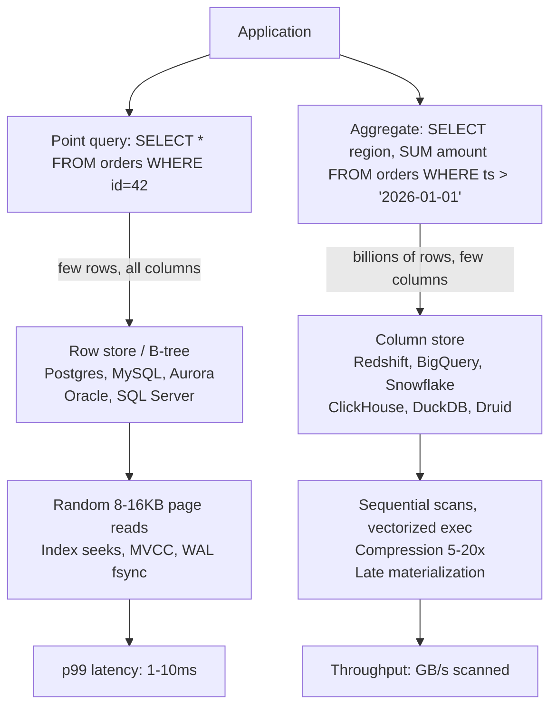
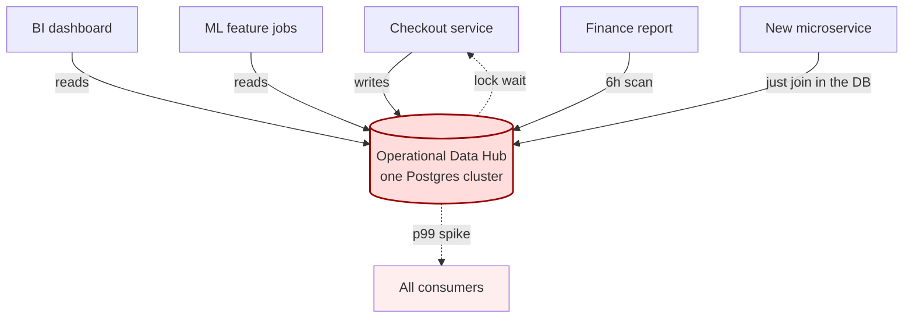
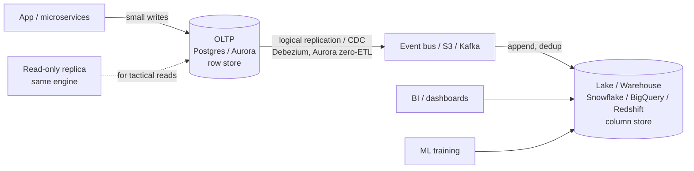

# OLTP vs OLAP

## Why This Exists

**Problem.** Every team eventually tries to run analytical queries on their transactional database. It works fine at 10k rows. It melts at 10M. The CFO's dashboard query takes a row-level lock that blocks checkout for 800ms. Or a nightly batch job scans the orders table while a deploy runs migrations, and replication lag hits 40 minutes. Or — worse — somebody builds an "operational data hub" that fans both write traffic *and* analytical queries through one cluster, and now a bad SQL query from an analyst can take down payments.

**Key insight.** OLTP and OLAP are not just "different SQL workloads." They have **opposite physics**: OLTP is *random, small, latency-sensitive, transactional* (point reads/writes by primary key, single-digit-ms p99, ACID across a few rows). OLAP is *sequential, huge, throughput-sensitive, eventually consistent* (full-table scans, aggregations over billions of rows, seconds-to-minutes is fine). Row stores optimize the first; column stores optimize the second. Trying to make one engine excel at both is a fight against the storage layer, the query planner, the cache hierarchy, and the lock manager simultaneously. HTAP systems (TiDB, SingleStore, Snowflake Unistore, Aurora zero-ETL) have made this tractable in narrow cases, but they are not a free lunch — they trade isolation, cost, or operational complexity for the convenience.

**Reach for this when:**
- Designing a new system and choosing the storage substrate.
- Diagnosing why "the database is slow" — is it the workload mix, not the engine?
- Evaluating an HTAP pitch (TiDB, SingleStore, Aurora + Redshift zero-ETL, Snowflake Unistore).
- Deciding whether to add a read replica, a CDC pipeline, or a warehouse.
- Fighting an "operational data hub" anti-pattern (one DB serving checkout + BI + ML features).

**Don't reach for this when:**
- Your data fits in RAM and your query rate is low (Postgres alone handles both shapes up to surprising scale; don't over-engineer).
- The question is "SQL vs NoSQL" — that's a different axis (consistency model, schema evolution).

## Diagrams

### Workload shapes diverge at the storage layer



### The operational data hub anti-pattern



### The healthy split: separate OLTP, replicate to OLAP



## Workload Shapes — The Numbers That Drive Everything

OLTP and OLAP differ across at least seven dimensions. The dimensions are correlated; once you know two of them, the rest fall out.

| Dimension | OLTP | OLAP |
|---|---|---|
| **Query shape** | `SELECT … WHERE pk = ?` (1-100 rows) | `SELECT agg(col) … GROUP BY …` (10⁶-10¹² rows) |
| **Columns touched** | Most/all of a row | 1-20 of hundreds |
| **Write pattern** | Many small txns/sec, point updates | Bulk append, occasional rewrite |
| **Concurrency** | 10³-10⁵ concurrent users | 10-10³ concurrent analysts/jobs |
| **Latency target** | p99 < 10 ms | p50 5s-5min OK |
| **Data volume per query** | KB | GB-TB |
| **Consistency** | Strict ACID, often serializable or RC | Snapshot / eventually consistent |
| **Working set vs total** | Fits in buffer pool | Far exceeds RAM |
| **Storage** | Row-oriented B-tree / LSM | Columnar (Parquet, ORC, proprietary) |

A point query against a row store touches one 8-16KB page per index level. A `SUM(amount)` over a year of orders against the same table reads every page that contains any order — even though it only needs the `amount` column. That's the core asymmetry.

## Row vs Columnar Storage

### Row stores (heap + B-tree)

A row store packs all columns of a row into a single page. Postgres, MySQL, Oracle, SQL Server, Aurora, DynamoDB (under the hood), CockroachDB, Spanner — all row-oriented.

```
Page 1: [id=1, user=42, ts=2026-01-01, amount=12.50, status='paid', sku='A1']
        [id=2, user=43, ts=2026-01-01, amount=8.00,  status='paid', sku='B7']
        [id=3, user=44, ts=2026-01-01, amount=99.00, status='refunded', sku='A1']
```

**Strengths:**
- Reading or updating one row is one page I/O.
- ACID is cheap: lock or version one row, write one WAL entry.
- Indexes (B-tree, hash) make point lookups O(log n).

**Weaknesses:**
- `SELECT SUM(amount)` reads every page even though `amount` is one of 30 columns. You pay 30× the I/O you "need."
- Compression is per-row, so you can't exploit column homogeneity. Typical 1.5-3× ratios.
- Vectorized execution doesn't help — you decode rows one at a time.

### Column stores

A column store packs each column into its own contiguous run. Redshift, BigQuery, Snowflake, ClickHouse, DuckDB, Druid, Pinot, Vertica, Databricks/Delta, Iceberg+Trino — all columnar.

```
column: id     [1, 2, 3, 4, 5, ...]
column: user   [42, 43, 44, 42, 45, ...]
column: ts     [2026-01-01, 2026-01-01, 2026-01-01, ...]   ← run-length encoded
column: amount [12.50, 8.00, 99.00, ...]                    ← delta/dictionary encoded
column: status [paid, paid, refunded, ...]                  ← dictionary: 1=paid, 2=refunded
```

**Strengths:**
- `SUM(amount)` reads only the `amount` column. 30× less I/O than the row store on a wide table.
- Per-column compression: dictionary, RLE, delta, Gorilla (for floats). 5-20× ratios common.
- Vectorized execution: SIMD over a batch of values per column. CPU cycles per row drop 10-100×.
- Late materialization: filter on one compressed column, only fetch other columns for surviving rows.

**Weaknesses:**
- Reading "row 42" requires assembling N column slices — N seeks instead of one.
- Single-row updates are expensive: rewriting a column file. Most column stores defer this with a row-oriented "delta store" or write-store, then merge to compressed columnar segments asynchronously.
- ACID across many rows is harder; most warehouses offer snapshot isolation, not serializable.

### Hybrid layouts: PAX, Parquet row groups, Arrow

Modern formats split the difference. Parquet stores data in **row groups** (e.g., 128MB), and within each row group the columns are stored separately. You get columnar compression and column pruning, but you can also locate a row by its row group + offset. Apache Arrow defines an in-memory columnar layout so engines can exchange batches without serialization.

```
Parquet file
├── Row group 0  (128 MB)
│   ├── column id      [encoded chunk + min=1, max=4096]
│   ├── column user    [encoded chunk + min=42, max=999]
│   └── column amount  [encoded chunk + min=0.01, max=14000]
├── Row group 1  (128 MB)
│   └── ...
└── Footer: schema, row group locations, column statistics
```

The `min`/`max` per column per row group enables **predicate pushdown** — an engine can skip whole row groups without reading their data. This is why `WHERE ts BETWEEN '2026-01-01' AND '2026-01-07'` over a year of Parquet files reads only ~1/52 of the data, *if* the files are sorted/clustered by `ts`.

## Index Strategies

Indexes are the OLTP query planner's love language. They are mostly useless for OLAP.

### OLTP: B-tree, hash, partial, covering

```sql
-- Postgres: standard B-tree. Good for equality and range.
CREATE INDEX idx_orders_user_ts ON orders (user_id, created_at DESC);

-- Covering index: include extra columns so the query never touches the heap.
CREATE INDEX idx_orders_lookup ON orders (id) INCLUDE (status, amount);

-- Partial index: only index "interesting" rows. Cheaper to maintain.
CREATE INDEX idx_orders_open ON orders (user_id) WHERE status IN ('pending','processing');

-- Expression index: lets you index a computed value.
CREATE INDEX idx_orders_lower_email ON users (lower(email));
```

Rules of thumb for OLTP indexes:
- Each index slows writes by ~1 page write per index per row inserted/updated.
- Match index column order to the query's `WHERE` + `ORDER BY` prefix. `(a, b)` serves `WHERE a=? AND b=?` and `WHERE a=?`, but **not** `WHERE b=?`.
- Watch out for "index-only scan" requirements (the visibility map in Postgres) — without `VACUUM`, your covering index falls back to a heap fetch.

### OLAP: column statistics, zone maps, sort keys, partitioning

OLAP engines mostly don't have B-tree indexes (Snowflake explicitly doesn't). What they have:

- **Zone maps / min-max statistics per chunk.** Skip blocks where the predicate can't match.
- **Sort keys / clustering keys** (Redshift `SORTKEY`, Snowflake clustering keys, BigQuery clustering, ClickHouse `ORDER BY` in `MergeTree`). Physically order data so zone maps are tight.
- **Partition pruning** — directory-level skip, e.g., `s3://bucket/orders/dt=2026-06-05/`. Critical for cost and latency.
- **Bloom filters** for high-cardinality equality (Iceberg, Parquet, Pinot, Druid).
- **Bitmap indexes** for low-cardinality columns (Druid).
- **Materialized views / projections** (ClickHouse `MATERIALIZED VIEW`, Snowflake materialized views, BigQuery materialized views) — pre-aggregated for hot dashboard queries.

```sql
-- ClickHouse: physical sort order is the most important "index"
CREATE TABLE orders (
    id UInt64,
    user_id UInt64,
    created_at DateTime,
    amount Decimal(18,2),
    status LowCardinality(String)
)
ENGINE = MergeTree
PARTITION BY toYYYYMM(created_at)        -- coarse partition: monthly files
ORDER BY (created_at, user_id);          -- sort key: enables zone-map skipping
```

```sql
-- Snowflake: clustering keys (no B-tree exists; this rewrites micro-partitions)
ALTER TABLE orders CLUSTER BY (created_at, region);
-- Snowflake auto-clusters in the background; you pay credits for the rewrites.
```

```sql
-- Redshift: pick a SORTKEY and DISTKEY at table creation
CREATE TABLE orders (
    id BIGINT,
    user_id BIGINT,
    created_at TIMESTAMP,
    amount DECIMAL(18,2),
    region VARCHAR(8)
)
DISTKEY (user_id)         -- co-locate rows by user_id across slices for joins
SORTKEY (created_at);     -- enables zone-map skip for time-range filters
```

The mental shift: in OLTP you ask "what index helps this query?" In OLAP you ask "how is this table physically laid out, and does the query's filter align with that layout?" If it doesn't, you either re-cluster, build a materialized view, or accept the full scan.

## Transactions and Isolation

OLTP without ACID is a bug factory. OLAP usually doesn't need ACID per query — it needs **a consistent snapshot of the world to query against**.

| Property | OLTP needs | OLAP needs |
|---|---|---|
| Atomicity | Yes — partial txns corrupt invariants | Per-load batch atomicity (e.g., Iceberg snapshot commit) |
| Consistency | Yes — FK, check constraints | Schema enforcement; less strict |
| Isolation | RC or SI minimum; SSI/Serializable for money | Snapshot isolation per query; readers don't block writers |
| Durability | Synchronous WAL fsync, replicated | Object store durability (S3 11 9s) sufficient |

The OLAP world re-discovered transactions through **table formats** (Iceberg, Delta, Hudi). They give you atomic commits over Parquet on object storage, schema evolution, time travel, and concurrent readers without locks — which is genuinely different from a row-store transaction manager but solves the same "don't expose half-written state" problem.

## HTAP: Trying to Have Both

HTAP (Hybrid Transactional/Analytical Processing) means **one system serves OLTP and OLAP without an ETL pipeline in between**. Gartner coined the term; the engineering problem is real.

### Why people want it
- One source of truth — no CDC pipeline to babysit.
- Real-time analytics on the freshest data (no minute/hour lag).
- Simpler ops — one system, one query language, one auth model.

### How the major HTAP systems work

**TiDB / TiFlash.** TiDB is a Spanner-like distributed SQL row store on RocksDB (TiKV). TiFlash is a separate columnar engine that subscribes to TiKV's Raft log and maintains a column-oriented copy of the same data. The TiDB optimizer routes a query to TiKV (row) or TiFlash (column) per-table. The column replicas are *learners* in the Raft group — they don't vote, but they get every committed entry. So you get consistent reads across both stores. The cost: 2× storage for HTAP-enabled tables, and TiFlash is eventually consistent within a few hundred ms.

**SingleStore (formerly MemSQL).** Universal storage: each table is a **rowstore-on-disk + columnstore segments**. Recent writes land in a row-oriented in-memory segment; background compaction moves them to compressed columnar segments. Queries read both. Single engine, single transaction manager. Trade-off: complex storage tier, real cost on memory and CPU, and the column-store side is still not as fast as a dedicated warehouse for very large scans.

**Snowflake Unistore + Hybrid Tables.** Snowflake added "hybrid tables" — row-oriented, indexed, low-latency point access — alongside its standard columnar tables. The catalog and SQL surface are unified. As of 2026 it's still positioned for "operational analytics" rather than full OLTP, and it's not a checkout-database replacement. Pricing is per-credit, which gets steep for write-heavy OLTP.

**Aurora Zero-ETL to Redshift.** Not really HTAP — it's a managed CDC pipeline. Aurora pushes change events to Redshift with sub-15s lag. You still have two systems and two query engines, but you don't write the pipeline. This is the pragmatic 80/20 for many AWS shops.

**SAP HANA, Oracle In-Memory.** Older HTAP plays. HANA stores everything in memory in both row and column form. Powerful but expensive; mostly enterprise-installed-base.

### Honest assessment

HTAP works when:
- You have an "operational analytics" workload — fresh dashboards, real-time fraud detection, in-app charts — where the analytical queries are bounded (last 24h, last 7d) and the user-facing OLTP load is moderate.
- You can pay 2-3× the storage and compute for the convenience of one system.
- Your team can't or won't run a CDC pipeline.

HTAP does **not** replace a warehouse when:
- You need to join 15 fact tables across 5 years of history. Even TiFlash and SingleStore will be slower per dollar than Snowflake/BigQuery/Redshift for that.
- Your analytical workload is unpredictable / ad-hoc. A bad query can still hurt the OLTP side, even with workload isolation.
- You need cheap cold-storage tiering (years of immutable data on S3). Warehouses and lakehouses do this; HTAP systems mostly don't.

The pattern that has held up: **most companies still run OLTP separately and replicate to OLAP via CDC.** HTAP is a useful tool for specific use cases, not a general substitute for a warehouse.

## When to Keep Them Separate

The default architecture for any non-trivial application:

```
[ App ]  →  [ OLTP DB (Postgres/Aurora/MySQL) ]  →  [ CDC: Debezium / DMS / zero-ETL ]
                                                      ↓
                                          [ Warehouse / Lake (Snowflake/BigQuery/Redshift/Iceberg) ]
                                                      ↓
                                          [ BI tools, ML pipelines, finance reports ]
```

Why this is almost always the right starting point:

1. **Blast radius.** A runaway analyst query cannot lock checkout. The warehouse can be down for an hour and customers don't notice.
2. **Cost.** OLTP storage (provisioned IOPS, replicated synchronously) costs 10-100× per GB compared to S3-backed warehouse storage. Don't keep 5 years of orders in Aurora.
3. **Scaling axes.** OLTP scales by sharding the write path or adding read replicas. OLAP scales by adding compute that reads the same storage. They want different scaling primitives.
4. **Schema flexibility.** OLAP gladly accepts wide, denormalized, slowly-evolving star schemas. OLTP wants normalized, narrow tables with strong constraints. Forcing one shape on both makes both worse.
5. **Tooling fit.** dbt, Looker, Tableau, Hex, BigQuery ML — all assume an OLAP shape. Putting them on top of a row store with no warehouse layer is a Sisyphean exercise.

The cost of separation:
- You run a CDC pipeline. Debezium + Kafka + Connect, or a managed equivalent (AWS DMS, Aurora zero-ETL, Fivetran).
- Latency from txn commit to analytical visibility: typically 30s-15min depending on stack.
- Schema drift handling: when OLTP renames a column, the pipeline must propagate.

For most teams, this cost is worth paying. **Don't try to skip the warehouse for the first few years and end up with a hub.**

## The Operational Data Hub Anti-Pattern

The "operational data hub" (or "single source of truth database") starts well-intentioned. One Postgres or Oracle cluster holds canonical state. New services join into it. BI runs on it. ML reads from it. Reports run nightly against it.

What actually happens:

1. **The hub becomes a single point of failure for everything.** A schema migration on `customers` blocks 12 services. An index rebuild during peak hours degrades all of them.
2. **Coupling through the database.** Service A reads service B's tables directly. Service B can't refactor without coordinating with A. The DB schema becomes a public API with no version contract.
3. **Workload conflict.** The 6-hour finance scan grabs share locks; the checkout service times out. Add a read replica and now you have to think about replication lag in user-visible flows. Add a *separate* read replica for analytics — and now you've started the split, you just haven't admitted it.
4. **Connection pool exhaustion.** N services × M instances × pool_size = thousands of connections. PgBouncer helps but doesn't fix architectural coupling.
5. **The warehouse you didn't build is still there — it's just running on the OLTP cluster.** Performance is bad and outages are expensive.

### How to escape it

- Stop allowing direct cross-service DB reads. Each service owns its tables. Other services call APIs.
- Start a CDC stream into a warehouse for *all* analytical workloads. Migrate dashboards off the OLTP cluster one at a time.
- For "real-time across services" needs, build an event bus (Kafka, Kinesis, EventBridge) — not a shared DB.
- For features needing data from many services, build a dedicated read store (Elasticsearch, OpenSearch, materialized via CDC). It is not allowed to be the system of record.

Pat Helland's "Data on the Outside vs. Data on the Inside" is the canonical reference: **inside-the-service data is mutable, transactional, normalized; outside-the-service data is immutable, denormalized, versioned.** A hub conflates them and pays the cost of both with the benefits of neither.

## Practical Patterns

### 1. CDC with Debezium → Kafka → Iceberg/Snowflake

```yaml
# debezium connector for Postgres → Kafka
name: orders-cdc
config:
  connector.class: io.debezium.connector.postgresql.PostgresConnector
  plugin.name: pgoutput
  database.hostname: oltp-primary.internal
  database.dbname: orders
  table.include.list: public.orders,public.order_items
  publication.autocreate.mode: filtered
  snapshot.mode: initial          # backfill once, then stream WAL
  tombstones.on.delete: true
  transforms: unwrap
  transforms.unwrap.type: io.debezium.transforms.ExtractNewRecordState
  transforms.unwrap.drop.tombstones: false
  # heartbeat keeps replication slot alive when traffic is bursty
  heartbeat.interval.ms: 10000
```

```sql
-- Snowpipe / BigQuery DTS / Redshift COPY consumes from Kafka or S3.
-- Land into a "bronze" raw layer first; transform downstream with dbt.

-- bronze: append-only, schema-on-write
CREATE TABLE bronze.orders_cdc (
    op CHAR(1),                  -- c=create, u=update, d=delete, r=read (snapshot)
    ts_ms BIGINT,                -- event time
    source_lsn STRING,
    before VARIANT,
    after  VARIANT,
    _kafka_offset BIGINT,
    _kafka_partition INT
);

-- silver: merge into a current-state table
MERGE INTO silver.orders t
USING (
  SELECT after:id::BIGINT id,
         after:user_id::BIGINT user_id,
         after:amount::DECIMAL amount,
         after:status::STRING status,
         after:updated_at::TIMESTAMP updated_at,
         op
  FROM bronze.orders_cdc
  WHERE _kafka_offset > (SELECT COALESCE(MAX(_kafka_offset),0) FROM silver.orders_watermark)
  QUALIFY ROW_NUMBER() OVER (PARTITION BY after:id ORDER BY ts_ms DESC) = 1
) s
ON t.id = s.id
WHEN MATCHED AND s.op = 'd' THEN DELETE
WHEN MATCHED AND s.updated_at >= t.updated_at THEN UPDATE SET ...
WHEN NOT MATCHED AND s.op != 'd' THEN INSERT ...;
```

### 2. The "two-store" microservice

```python
# Service writes to Postgres (system of record) and emits an event.
# Outbox pattern: write event into outbox table in the same txn.

async def place_order(user_id: int, items: list[Item]) -> Order:
    async with db.transaction() as tx:
        order = await tx.fetchrow(
            "INSERT INTO orders (user_id, total) VALUES ($1, $2) RETURNING *",
            user_id, sum(i.price for i in items),
        )
        # Outbox: same txn, eventually published by a separate relay
        await tx.execute(
            """INSERT INTO event_outbox (aggregate_id, event_type, payload, created_at)
               VALUES ($1, 'OrderPlaced', $2::jsonb, now())""",
            order["id"], json.dumps({"order_id": order["id"], "user_id": user_id, ...}),
        )
    return order

# A separate relay process (or Debezium) reads event_outbox and publishes to Kafka.
# The warehouse subscribes. No dual-write inconsistency.
```

### 3. Reading recent data fast: cache the OLTP, scan the OLAP

For "user dashboard showing last 30 days of orders":
- 0-24h: serve from OLTP (Postgres) with the `(user_id, created_at)` index.
- 1-30d: serve from a per-user materialized view in the warehouse, refreshed hourly.
- 30d+: query the warehouse on-demand with caching.

Don't try to make the warehouse serve the 0-24h case unless your warehouse has a hybrid table feature *and* you've measured the latency.

## Trade-offs

| Decision | Benefit | Cost |
|---|---|---|
| **Row store for OLTP** | Cheap point reads/writes, ACID, mature ecosystem | Wide-scan queries are slow; expensive per GB at scale |
| **Column store for OLAP** | 10-100× faster scans; 5-20× compression; vectorized exec | Bad at point reads/updates; weaker isolation; not suitable as system of record |
| **Separate OLTP and OLAP** | Blast radius isolation; cost-appropriate scaling; tool fit | Run a CDC pipeline; eventual consistency for analytics; two systems to operate |
| **HTAP (TiDB, SingleStore)** | One system; real-time analytics on fresh data; simpler ops | 2-3× storage cost; not as fast as dedicated warehouse for huge scans; vendor lock-in |
| **Aurora zero-ETL / managed CDC** | Push-button pipeline; sub-15s lag | AWS-only; limited transformation; per-row cost |
| **Operational data hub** | Apparent simplicity early on | Becomes a SPOF; couples services through schema; mixes workloads catastrophically |
| **Replicate everything via Debezium** | Open source; portable; full control | You operate Kafka + Connect + schema registry; non-trivial |
| **Materialized views in the warehouse** | Sub-second dashboards; low query cost | Refresh latency; storage cost; staleness bugs |
| **Indexes on OLTP** | Point queries in ms; range scans efficient | Each index slows writes; bloat; planner regressions |

## Common Pitfalls

- **Running BI on the production primary.** A `GROUP BY region` over `orders` takes a buffer-pool-thrashing read; checkout p99 doubles. Add a read replica at minimum. Better: stream to a warehouse.
- **"We'll add a column store extension to Postgres" (Citus, cstore, Hydra).** Often works for moderate scale but you still have one cluster's failure domain. Acceptable for early-stage; revisit at $10M ARR.
- **Believing HTAP marketing.** "Run analytics on your transactional data with no ETL!" Read the SLAs. Look at how the column replica is built and how stale it can get under load. Benchmark *your* workload, not TPC-H.
- **Direct cross-service reads of another service's tables.** You have built distributed coupling. Pay it down before it ossifies.
- **Indexing into nightmares.** Adding 12 indexes to "make all the queries fast" — now writes take 5ms, the table is 4× its data size on disk, and `VACUUM` runs all weekend. Audit indexes quarterly; drop unused ones.
- **No partition strategy on the warehouse.** A query against an unpartitioned 5TB table scans all of it. Partition by ingest date or event date; cluster by the most common filter.
- **Replication lag amnesia.** "Read your writes" against an async replica gives users back stale state. Either route to the primary for read-after-write windows, or use synchronous replication, or use causal consistency tokens.
- **Dual-writes without an outbox.** Service writes to DB, then publishes to Kafka. The publish fails. Now warehouse and DB disagree forever. Always use outbox or CDC.
- **Forgetting GDPR / right-to-be-forgotten on the warehouse.** Deletes on OLTP propagate via CDC, but if your warehouse has 7 immutable copies in different marts, a deletion request is an engineering project. Design for it up front.
- **Treating Snowflake/BigQuery as cheap because storage is cheap.** Compute (credits, slots) is the cost driver. A poorly-clustered query can cost more than running your own warehouse.
- **Overuse of `SELECT *` on column stores.** Defeats the entire compression and column-pruning advantage. Always project the columns you need.
- **Putting JSON blobs in OLTP and querying their contents from OLAP.** Works until it doesn't. Either flatten on the OLTP side or extract into typed columns during CDC.

## Decision Table

| Situation | Choose | Why |
|---|---|---|
| New transactional service, < 1TB data, < 10k QPS | Postgres / MySQL / Aurora | Mature, cheap, ACID, well-understood. Don't optimize early. |
| OLTP > 10TB or > 50k writes/sec sustained | Sharded Postgres, Aurora Limitless, Spanner, CockroachDB, Vitess | Single-node is past comfortable. Shard early enough that it's not an emergency. |
| Analytics on production data, < 100GB, low concurrency | Read replica + materialized views | Don't build a warehouse you don't need. |
| Analytics on production data, > 100GB, multiple consumers | CDC → warehouse (Snowflake, BigQuery, Redshift, Databricks) | Standard split. Costs ~$2-20K/mo entry; saves orders of magnitude in pain. |
| Real-time operational analytics (sub-second freshness) on moderate OLTP | Aurora zero-ETL to Redshift, or SingleStore, or TiDB+TiFlash | HTAP territory. Benchmark first. |
| Mixed workload, can't introduce a second system | Postgres with Citus / Hydra columnar / pg_duckdb | Compromise. Acceptable for early stage; not a long-term answer at scale. |
| Pure OLAP (logs, events, telemetry, no point updates) | ClickHouse, Druid, Pinot, BigQuery, Snowflake | Don't put this in Postgres. |
| User-facing analytical dashboard with < 100ms p99 | Druid, Pinot, ClickHouse + materialized views | Warehouses (Snowflake/BigQuery) are too slow at the tail for embedded analytics. |
| You're building a "data hub" everyone reads from | **Stop.** | Build per-service ownership and a CDC-fed warehouse instead. |
| Lakehouse over object storage | Iceberg/Delta + Trino/Spark/DuckDB/Databricks | Cheap storage, open formats, vendor-flexible. Slower than warehouses for interactive queries. |
| ML feature store | Online: Redis/DynamoDB. Offline: warehouse/lake. | Online and offline have OLTP and OLAP shapes respectively; treat as two stores synced by ID. |

## References

- Kleppmann, *Designing Data-Intensive Applications* (O'Reilly, 2017) — **ch. 3 "Storage and Retrieval"** is the definitive treatment of row vs column stores, B-trees vs LSM, and the origin of the OLTP/OLAP split. **ch. 10 "Batch Processing"** and **ch. 11 "Stream Processing"** cover the pipelines between them. — https://dataintensive.net/
- Pat Helland — "Data on the Outside vs. Data on the Inside" (CIDR 2005) — https://www.cidrdb.org/cidr2005/papers/P12.pdf
- Pat Helland — "Immutability Changes Everything" (CIDR 2015) — https://www.cidrdb.org/cidr2015/Papers/CIDR15_Paper16.pdf
- Stonebraker et al. — "C-Store: A Column-oriented DBMS" (VLDB 2005) — http://www.vldb.org/archives/website/2005/program/paper/thu/p553-stonebraker.pdf
- Abadi, Madden, Hachem — "Column-Stores vs. Row-Stores: How Different Are They Really?" (SIGMOD 2008) — https://db.csail.mit.edu/projects/cstore/abadi-sigmod08.pdf
- Lamb et al. — "The Vertica Analytic Database: C-Store 7 Years Later" (VLDB 2012) — https://vldb.org/pvldb/vol5/p1790_andrewlamb_vldb2012.pdf
- Dageville et al. — "The Snowflake Elastic Data Warehouse" (SIGMOD 2016) — https://event.cwi.nl/lsde/papers/p215-dageville-snowflake.pdf
- Melnik et al. — "Dremel: Interactive Analysis of Web-Scale Datasets" (VLDB 2010) — https://research.google/pubs/dremel-interactive-analysis-of-web-scale-datasets/
- Melnik et al. — "Dremel: A Decade of Interactive SQL Analysis at Web Scale" (VLDB 2020) — https://research.google/pubs/pub49489/
- Apache Parquet specification — https://parquet.apache.org/docs/file-format/
- Apache Iceberg — Table spec & semantics — https://iceberg.apache.org/spec/
- TiDB / TiFlash architecture — https://docs.pingcap.com/tidb/stable/tiflash-overview
- SingleStore Universal Storage — https://docs.singlestore.com/cloud/create-a-database/universal-storage/
- Snowflake Unistore / Hybrid Tables — https://docs.snowflake.com/en/user-guide/tables-hybrid
- AWS — Aurora zero-ETL integration with Redshift — https://docs.aws.amazon.com/AmazonRDS/latest/AuroraUserGuide/zero-etl.html
- AWS Builders' Library — "Avoiding overload in distributed systems by putting the smaller service in control" — https://aws.amazon.com/builders-library/avoiding-overload-in-distributed-systems-by-putting-the-smaller-service-in-control/
- Debezium — Outbox pattern — https://debezium.io/documentation/reference/stable/transformations/outbox-event-router.html
- Martin Fowler — "Polyglot Persistence" — https://martinfowler.com/bliki/PolyglotPersistence.html
- Martin Fowler — "Reporting Database" — https://martinfowler.com/bliki/ReportingDatabase.html
- Google SRE Book (Beyer et al.) — chs. on overload and cascading failures — https://sre.google/sre-book/table-of-contents/
- ClickHouse — MergeTree engine docs — https://clickhouse.com/docs/en/engines/table-engines/mergetree-family/mergetree
- Redshift — Sort keys and distribution styles — https://docs.aws.amazon.com/redshift/latest/dg/c_best-practices-sort-key.html
- Adrian Colyer / The Morning Paper — "C-Store revisited" — https://blog.acolyer.org/2015/10/26/c-store-a-column-oriented-dbms/

## See Also

- `../consistency-models/` — Linearizability, snapshot isolation, causal consistency.
- `../olap-warehouse/` — the canonical OLAP storage choice.
- `../relational/` — the canonical OLTP starting point.
- `../lakehouse/` — when you need both shapes against one storage layer.
- `../cdc/` — moving rows from OLTP to OLAP without dual-write.
- `../materialized-views/` — the cheaper middle ground when full ETL is overkill.
- `../../architecture-patterns/cqrs/` — read-side specialization at the application layer.
