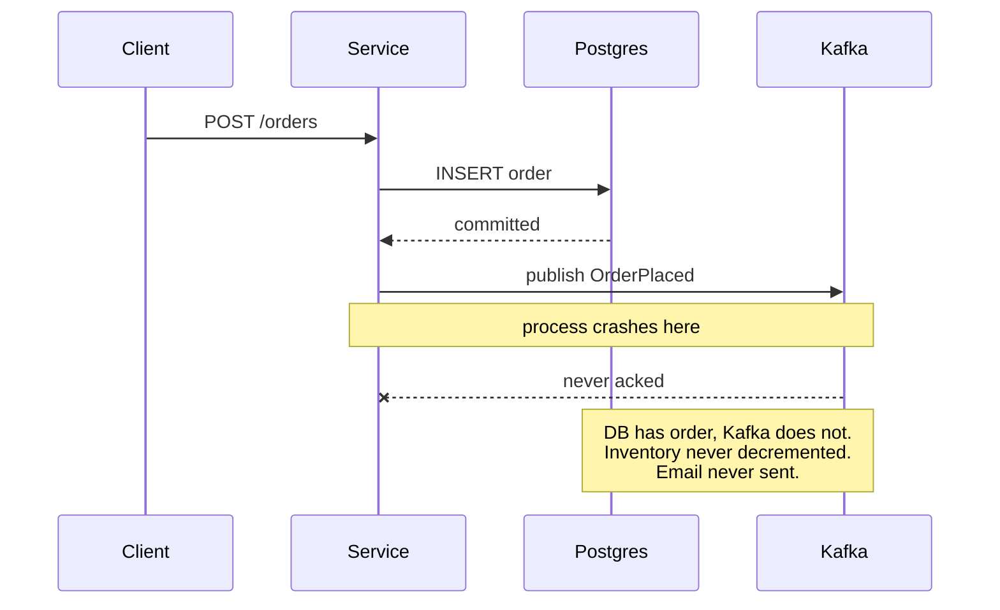
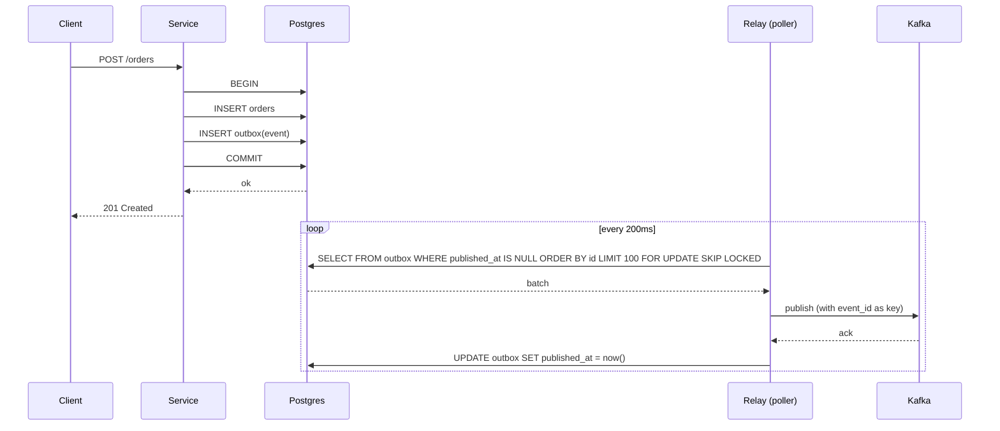
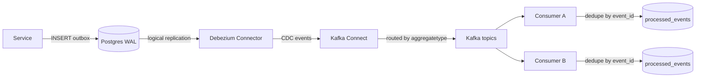
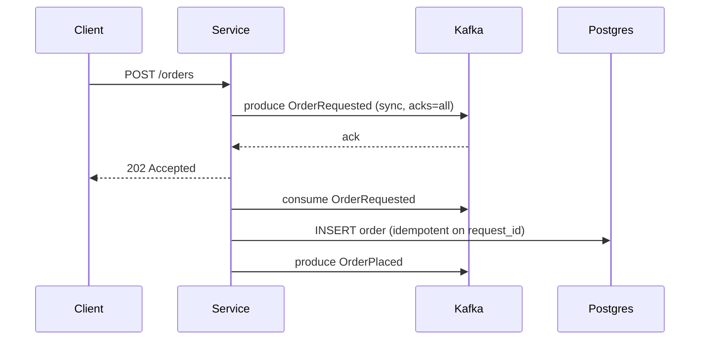

# Outbox Pattern

## Why This Exists

**Problem.** Your service handles `POST /orders`. It writes a row to `orders` and publishes `OrderPlaced` to Kafka. These are two different systems. There is no transaction that spans both. So one of these failure modes is guaranteed to happen, eventually, in production:

1. DB commit succeeds → broker publish fails (network blip, broker down, GC pause) → **order exists, downstream never knows**. Inventory not decremented, email never sent, fulfillment ghost-blind. The user sees "order placed" and waits forever.
2. Broker publish succeeds → DB commit fails (constraint violation discovered at commit, deadlock retry exhausted, replica lag tripping a guard) → **downstream acts on a phantom order**. Inventory decremented for an order that doesn't exist, payment captured against a row that was rolled back.
3. You "fix" #1 by publishing first, then writing → now #2 is the default failure mode.
4. You "fix" #2 by wrapping it in a try/catch and retrying the publish in a finally block → now you publish duplicates whenever the catch fires after a partial publish, and you still lose events when the process dies between commit and finally.

This is the **dual-write problem**. It is not solvable with retries, finally blocks, or careful ordering. It is solvable with exactly two strategies that survive crash-restart:

- **2PC / XA across DB and broker** — possible with some brokers (not Kafka), expensive, slow, blocks on coordinator failure, and most teams cannot operate it. Don't.
- **Transactional Outbox** — write the event to a table *in the same DB transaction* as the business state change, then a separate relay process reads that table and publishes to the broker. The DB commit is now your single source of truth. If the relay crashes, it resumes; if the broker is down, the relay retries; if the row is published twice, consumers dedupe by event id.

**Key insight.** You cannot atomically commit to two independent systems. So you commit to one (the DB) and treat the other (the broker) as a derived view that you reach via a retry-safe relay. The outbox table is a write-ahead log of "things I owe the world".

**Reach for this when:**
- A service owns its DB and emits domain events to Kafka / SNS / RabbitMQ / EventBridge.
- You need at-least-once delivery with exactly-once *effects* (consumer-side dedupe).
- You want the audit trail of "what we said happened" to match "what actually happened" in the DB.
- You're migrating from a synchronous HTTP fan-out ("call the email service inline") to async events and don't want to inherit the dual-write bug.

**Don't reach for this when:**
- The downstream effect can simply re-read the source DB (use **CDC / Debezium directly** off the business tables — no outbox needed; see `../cdc/`). Outbox adds a hop you don't need if your event schema is just "row changed".
- The event has no business meaning — it's a metric or a log line. Use a fire-and-forget logger. Outbox is for *facts the business cares about*.
- You have one process and one DB and no message bus. You're inventing a problem.
- Strong cross-service consistency is required (you can't tolerate even a 200ms gap). Outbox is eventually consistent. You probably want a saga + compensations, or a redesign of service boundaries.

## Diagrams

### The dual-write failure mode (what we're fixing)



### Outbox with a polling relay



### Outbox with Debezium CDC (log-based relay)



## The Outbox Table

The minimum viable schema. Every column earns its keep.

```sql
CREATE TABLE outbox (
    id              BIGSERIAL PRIMARY KEY,
    -- A stable, globally-unique id the consumer uses for idempotency.
    -- DO NOT use the BIGSERIAL id for this — it changes if you migrate, and
    -- it leaks ordering across aggregates.
    event_id        UUID        NOT NULL UNIQUE,
    -- Aggregate type drives Kafka topic routing (e.g. "order", "payment").
    aggregate_type  TEXT        NOT NULL,
    -- Aggregate id is the Kafka partition key. Same aggregate => same partition
    -- => ordered delivery for that aggregate. Critical for state-machine consumers.
    aggregate_id    TEXT        NOT NULL,
    event_type      TEXT        NOT NULL,             -- "OrderPlaced", "OrderShipped"
    payload         JSONB       NOT NULL,             -- the event body
    headers         JSONB,                            -- trace context, tenant, schema version
    created_at      TIMESTAMPTZ NOT NULL DEFAULT now(),
    published_at    TIMESTAMPTZ,                      -- NULL = unpublished
    attempts        INT         NOT NULL DEFAULT 0
);

-- Polling relay scans unpublished rows in id order, partitioned by FOR UPDATE SKIP LOCKED.
CREATE INDEX outbox_unpublished_idx
    ON outbox (id)
    WHERE published_at IS NULL;
```

A few things people get wrong:

- **`event_id` must be set by the producer**, not the broker, not the relay. It's a UUID written inside the same transaction as the business row. Consumers dedupe on it. If the relay generates it, a relay restart re-publishes with a new id and your idempotency is gone.
- **`aggregate_id` is the Kafka partition key.** If you put `event_id` (random UUID) as the key, you'll lose per-aggregate ordering and your "order shipped before order placed" bugs become someone's pager.
- **Don't include the full business row.** Include the *event*. `OrderPlaced` is not `SELECT * FROM orders`. The event is a contract; the row is an implementation detail.
- **The partial index** matters at scale. Without `WHERE published_at IS NULL`, the relay scan walks the whole table once published rows accumulate.

## Producer side: write business row + outbox row in one transaction

```python
# Python / SQLAlchemy / Postgres
from uuid import uuid4
import json

def place_order(session, customer_id: str, items: list[dict]) -> Order:
    with session.begin():  # one transaction
        order = Order(customer_id=customer_id, total=sum(i["price"] for i in items))
        session.add(order)
        session.flush()  # get order.id

        for item in items:
            session.add(OrderItem(order_id=order.id, **item))

        # The outbox write is part of the SAME transaction.
        # If anything below this throws, the order is rolled back too.
        # If the commit fails, NEITHER the order NOR the event survives.
        # If the commit succeeds, BOTH survive. That is the entire point.
        session.add(OutboxEvent(
            event_id=uuid4(),
            aggregate_type="order",
            aggregate_id=str(order.id),
            event_type="OrderPlaced",
            payload=json.dumps({
                "order_id": order.id,
                "customer_id": customer_id,
                "items": items,
                "total": order.total,
                "occurred_at": utcnow().isoformat(),
            }),
            headers=json.dumps({
                "trace_id": current_trace_id(),
                "tenant_id": current_tenant(),
                "schema_version": 2,
            }),
        ))
    return order
```

Notes:

- The HTTP handler **does not publish to Kafka**. It writes to the outbox. The handler returns success the moment the DB commit returns. Kafka publish happens later, asynchronously, by the relay.
- `occurred_at` is set at write time, not publish time. Consumers care when the event happened, not when it was relayed.
- `schema_version` in headers, not in the topic name. Topic-per-version is a maintenance disaster; consumers branch on the header.

## Relay option A: Polling worker

This is the boring, reliable option. It works on every database. It will get you to ten million events per day on Postgres without effort.

```python
# Polling relay — single instance OR multi-instance with SKIP LOCKED.
import time
from kafka import KafkaProducer

producer = KafkaProducer(
    bootstrap_servers="kafka:9092",
    acks="all",                # wait for ISR replication, do not lose events
    enable_idempotence=True,   # broker-side dedupe within a producer session
    max_in_flight_requests_per_connection=5,
    retries=10,
    linger_ms=5,
)

BATCH = 100

def relay_tick(conn):
    with conn.cursor() as cur:
        # SKIP LOCKED lets multiple relay instances run safely without coordination.
        # Without it, two relays will deadlock or double-publish.
        cur.execute("""
            SELECT id, event_id, aggregate_type, aggregate_id,
                   event_type, payload, headers
            FROM outbox
            WHERE published_at IS NULL
            ORDER BY id          -- per-aggregate ordering is preserved because
                                 -- the partition key is aggregate_id
            LIMIT %s
            FOR UPDATE SKIP LOCKED
        """, (BATCH,))
        rows = cur.fetchall()
        if not rows:
            return 0

        published_ids = []
        for row in rows:
            (id_, event_id, agg_type, agg_id, ev_type, payload, headers) = row
            try:
                future = producer.send(
                    topic=f"{agg_type}.events",
                    key=agg_id.encode(),                    # partition key
                    value=payload.encode() if isinstance(payload, str) else payload,
                    headers=[
                        ("event_id", str(event_id).encode()),
                        ("event_type", ev_type.encode()),
                        # propagate trace context so downstream spans link correctly
                        *_flatten_headers(headers),
                    ],
                )
                future.get(timeout=10)  # block per-message; for throughput, pipeline + flush
                published_ids.append(id_)
            except Exception as e:
                # Don't mark this one published. Don't abort the batch — other rows
                # are independent. Log, increment attempts, move on. The next tick
                # will retry. If a single event is poisonous, attempts climbs and
                # alerting fires on attempts > N.
                cur.execute(
                    "UPDATE outbox SET attempts = attempts + 1 WHERE id = %s",
                    (id_,),
                )
                log.exception("publish failed", id=id_, attempts="++")

        if published_ids:
            cur.execute(
                "UPDATE outbox SET published_at = now() WHERE id = ANY(%s)",
                (published_ids,),
            )
        conn.commit()
        return len(published_ids)


def run():
    conn = connect()
    while True:
        n = relay_tick(conn)
        if n == 0:
            time.sleep(0.2)   # idle backoff; under load this never sleeps
```

**Operational properties:**

- **At-least-once.** A crash between `producer.send` ack and `UPDATE outbox SET published_at` re-publishes on restart. Consumers must dedupe.
- **Per-aggregate ordering preserved.** `ORDER BY id` reads in insertion order; the Kafka partition key is `aggregate_id`, so all events for one order land on one partition in commit order.
- **Multiple relay instances are safe** because of `FOR UPDATE SKIP LOCKED`. Run two for HA. Don't run twenty — you'll just contend on the index.
- **Retention.** A separate job deletes (or archives) `outbox` rows where `published_at < now() - interval '7 days'`. Do not let this table grow unbounded; it's a queue, not a ledger. (Keep the *event log* in Kafka, with whatever retention you actually need.)

## Relay option B: Debezium / log-based CDC

For volume above ~1k events/sec sustained, or when you don't want a poller, Debezium reads the Postgres WAL and emits each `INSERT` into `outbox` as a Kafka message. No application-side relay process. You configure Debezium with the **Outbox Event Router SMT**, which is purpose-built for this pattern:

```properties
# Debezium connector for Postgres + Outbox Event Router
name=outbox-connector
connector.class=io.debezium.connector.postgresql.PostgresConnector
database.hostname=postgres
database.dbname=orders
database.server.name=orders-db
table.include.list=public.outbox
plugin.name=pgoutput

# The router turns one Debezium row event into a domain event on the right topic
transforms=outbox
transforms.outbox.type=io.debezium.transforms.outbox.EventRouter
transforms.outbox.route.by.field=aggregate_type        # column -> topic suffix
transforms.outbox.table.field.event.key=aggregate_id   # partition key
transforms.outbox.table.field.event.id=event_id        # idempotency key (header)
transforms.outbox.table.field.event.payload=payload
transforms.outbox.route.topic.replacement=${routedByValue}.events
```

Why this is better than polling at scale:

- **No poll latency.** WAL streaming pushes within milliseconds of commit.
- **No `published_at` column needed**, no UPDATEs back to the table — you can mark outbox rows as `INSERT`-only and rely on a TTL/partition-drop for cleanup. (Debezium tracks its own LSN offset.)
- **The DB doesn't get hammered with poll queries** at low throughput.

Why polling is still often the right call:

- **One fewer system.** Debezium + Kafka Connect is a stateful piece of infrastructure with its own failure modes (connector restarts replaying from old offsets, schema-change handling, snapshot mode). The polling worker is 80 lines of code.
- **No PG superuser / replication slot** required. Some managed Postgres tiers don't give you logical replication.
- **Easier to test locally** without spinning up Kafka Connect.

Use Debezium when you already run Kafka Connect for other CDC streams, or when poll latency / DB load matters. Use polling when you don't.

## Consumer side: idempotency is mandatory

The outbox guarantees **at-least-once delivery**. A relay restart, a Kafka rebalance, a consumer crash between processing and committing the offset — any of these duplicates a message. The consumer is responsible for making duplicate delivery a no-op.

**Anti-pattern: rely on broker exactly-once.** Kafka EOS (transactional producer + read_committed) gives you exactly-once *within a Kafka topology* (consume-process-produce). It does *not* extend to your database side-effects. If the consumer writes to Postgres, broker EOS does not save you.

**Pattern: dedupe table keyed on `event_id`.**

```sql
CREATE TABLE processed_events (
    consumer_name TEXT NOT NULL,            -- one consumer can dedupe independently of others
    event_id      UUID NOT NULL,
    processed_at  TIMESTAMPTZ NOT NULL DEFAULT now(),
    PRIMARY KEY (consumer_name, event_id)
);
```

```python
def handle_order_placed(session, msg):
    event_id = msg.headers["event_id"]
    payload  = json.loads(msg.value)

    with session.begin():
        # INSERT ... ON CONFLICT DO NOTHING is the dedupe primitive.
        # If this returns 0 rows affected, we've seen this event — skip the side-effect.
        result = session.execute(
            """
            INSERT INTO processed_events (consumer_name, event_id)
            VALUES (:c, :e)
            ON CONFLICT DO NOTHING
            """,
            {"c": "inventory-service", "e": event_id},
        )
        if result.rowcount == 0:
            return  # duplicate; no-op

        # Side-effect happens in the SAME transaction as the dedupe insert.
        # If this throws, the dedupe row is also rolled back, and a retry will reprocess.
        # If both commit, the event is consumed exactly once for this consumer.
        decrement_inventory(session, payload["items"])
```

The `processed_events` table has the same problem as `outbox`: it grows. Two ways to bound it:

1. **TTL by event time.** Delete rows older than the maximum tolerable replay window (e.g., 7 days). If a duplicate arrives older than that, you accept the risk. With Kafka retention configured similarly, this is fine in practice.
2. **High-watermark per partition.** Track `(topic, partition, max_offset)` and dedupe by "is this offset <= the watermark?". Smaller table, but only works if events arrive monotonically per partition (they do, in Kafka).

For most teams: option 1, with a daily delete job. Don't optimize until the table is big enough to matter.

**Effects must be idempotent on their own where possible.** Even with dedupe, prefer side-effects that are naturally idempotent: `UPDATE inventory SET stock = stock - :n WHERE order_id = :id AND not_yet_decremented` rather than blind `stock = stock - :n`. Dedupe + idempotent effect = belt and suspenders. You will need both eventually.

## Alternative: Listen-to-yourself

A variant worth knowing. Instead of a relay reading the outbox table and publishing to Kafka, the service publishes to Kafka *first* (or sends to itself), then consumes its own message and writes to its DB. The "atomic" part becomes "the message is on Kafka", and the DB write is a downstream consumer.



Trade-offs vs outbox:

- **Pro:** No outbox table. The broker is the only durable store between request and effect. Simpler if the service is greenfield and the broker is already trusted.
- **Pro:** Natural fit when the service is "stateless front end + stateful consumer".
- **Con:** The client gets `202 Accepted` instead of `201 Created`. The DB row doesn't exist yet when the response returns. Read-after-write is not free.
- **Con:** If you can't write to Kafka (broker down), the request fails. The outbox pattern degrades better — the DB write succeeds, the relay catches up later.
- **Con:** Idempotency is harder — if the producer retries on timeout, you can get duplicate `OrderRequested` events. You need a client-supplied idempotency key (you needed one anyway, but here it's load-bearing).

Listen-to-yourself is correct, but it changes the API contract. Outbox preserves the synchronous "the row exists when I return 201" contract, which is usually what HTTP callers expect.

## Trade-offs

| Benefit | Cost |
| --- | --- |
| Atomically commit business state + intent-to-publish in one DB transaction | Adds a relay process (poller or Debezium); more infra to operate |
| Survives any combination of process crash, broker outage, network partition without losing events | Eventual consistency between DB commit and downstream observation (typically <1s, can spike to minutes if relay is down) |
| Per-aggregate ordering preserved end-to-end via `aggregate_id` partition key | Cross-aggregate ordering is **not** preserved — if you need "all events globally ordered" you need a different design (single partition, single relay) and you give up throughput |
| Decouples write path latency from broker availability | Outbox table grows; needs partitioning, TTL, or archival job |
| Works on any RDBMS (Postgres, MySQL, SQL Server, Oracle); Debezium covers them all | Polling adds DB load proportional to poll rate × index size; Debezium needs replication slot privileges |
| Consumer dedupe is simple (UPSERT on `event_id`) | Every consumer must implement dedupe; "I forgot" is a recurring outage cause |
| Auditable — the outbox is the record of what was emitted | Doesn't solve cross-aggregate transactions; if `OrderPlaced` and `PaymentReserved` need to commit together across services, you need a saga |

## Common Pitfalls

- **Publishing inside the HTTP handler "as a backup" while also writing to outbox.** Now you have *two* publishes per event, both at-least-once, and consumers see double duplicates. Pick one path. The relay is the only publisher.
- **Using `BIGSERIAL id` as the idempotency key.** Auto-increment IDs are not stable across restores, schema migrations, or DB swaps. The day you fail over to a replica with a slightly different sequence value, every consumer sees fresh "events". Always generate a UUID at write time.
- **Forgetting `FOR UPDATE SKIP LOCKED` on the relay query.** With two relay instances and no skip-locked, you either deadlock (both lock the same rows) or double-publish (both read before either updates). One relay is fine until the day you do a rolling deploy.
- **No partial index, no batch limit.** Six months in, the unpublished scan is sequential against a 200M-row table because every row has `published_at` set and you never archive. Latency goes from 5ms to 5s overnight.
- **No retention on the outbox table.** It is a *queue*, not a ledger. Kafka is the ledger. Keep outbox rows long enough to recover from a relay outage (24h is generous), then delete or move to cold storage.
- **Marking the row published before the broker acked.** A relay crash in the middle and the event is lost forever. Always: send → ack → update.
- **Using `acks=1` on the producer.** Broker leader crashes after acking but before replicating. Event is gone. Use `acks=all` with `min.insync.replicas >= 2`. The latency cost is tiny and the durability win is the whole point of running Kafka.
- **Consumer dedupe via Bloom filter / Redis with no persistence.** A Redis restart and you reprocess everything from the last offset commit. Dedupe state must be at least as durable as the side-effects it gates.
- **Putting non-event data in the outbox.** "I'll just use this table for retry logic on the email service." Now you've coupled email retries to your event delivery SLO. Outbox is for domain events. Make a separate table for ad-hoc deferred work.
- **Schema evolution by overwriting the topic.** Adding a required field to `OrderPlaced` and deploying without a `schema_version` header. Old consumers see the new payload, parse fails, dead letters fill up. Version your events from day one; consumers branch on `schema_version`.
- **Polling every 10ms because "we want low latency".** You've turned the outbox into a hot table and the poll query is now a top-5 query in pg_stat_statements. Use Debezium for sub-second latency. Polling at 100-500ms is fine for most cases.
- **Trusting Kafka EOS to cover the consumer's database write.** EOS is consume-process-produce-within-Kafka exactly-once. If your consumer writes to Postgres, you still need consumer-side dedupe.

## Decision Table

| Situation | Use this | Don't use |
| --- | --- | --- |
| Service owns DB, emits domain events to Kafka, throughput < 1k/sec | **Outbox + polling relay** | Debezium (overkill); 2PC (don't) |
| Same as above, throughput > 1k/sec, sub-second latency required | **Outbox + Debezium Outbox Event Router** | Polling (won't keep up under burst); raw CDC on business tables (couples schema to consumers) |
| Downstream just needs to know "the row changed" — no rich event semantics | **Debezium CDC on business tables** (no outbox) | Outbox (extra hop for no benefit) |
| Consumer writes to its own DB and re-emits events | Outbox in the consumer too (it's a producer to its own downstream) | Hoping at-least-once doesn't bite |
| Need cross-service atomicity ("payment AND order commit together") | **Saga with compensations** + outbox per service | 2PC; trying to make outbox transactional across services |
| Throughput is "I press a button once a minute" | Outbox if you'll have many events later, otherwise just write through with retries and accept the rare loss | Outbox infra if you'll never grow into it |
| Greenfield service, broker is already a hard dependency, async API is acceptable | **Listen-to-yourself** | Outbox (the broker is already your durable log; outbox is redundant) |
| Existing synchronous API (`201 Created` with the row visible) | **Outbox** | Listen-to-yourself (changes API contract to 202) |
| Stack has no transactional DB (event-sourced, NoSQL with no multi-doc transactions) | Per-store equivalent: DynamoDB Streams, Mongo change streams, event store as source of truth | Outbox (you don't have the transaction it depends on) |
| Need strict global ordering of all events | Single partition + single relay (low throughput); or rethink the requirement | Outbox with multiple aggregates expecting global order |

## References

- Microsoft — *Transactional Outbox pattern* — https://learn.microsoft.com/en-us/azure/architecture/patterns/transactional-outbox
- Chris Richardson — *Pattern: Transactional outbox* (microservices.io) — https://microservices.io/patterns/data/transactional-outbox.html
- Gunnar Morling (Debezium) — *Reliable Microservices Data Exchange With the Outbox Pattern* — https://debezium.io/blog/2019/02/19/reliable-microservices-data-exchange-with-the-outbox-pattern/
- Debezium — *Outbox Event Router SMT* — https://debezium.io/documentation/reference/stable/transformations/outbox-event-router.html
- Confluent — *Exactly-once semantics in Kafka (KIP-98)* — https://www.confluent.io/blog/exactly-once-semantics-are-possible-heres-how-apache-kafka-does-it/
- Pat Helland — *Life beyond Distributed Transactions: An Apostate's Opinion* (CIDR 2007) — https://www.ics.uci.edu/~cs223/papers/cidr07p15.pdf — the foundational argument for why outbox-style "almost-infinite" partitioned designs win over 2PC at scale.
- Pat Helland — *Idempotence Is Not a Medical Condition* (ACM Queue) — https://queue.acm.org/detail.cfm?id=2187821
- Martin Kleppmann — *Designing Data-Intensive Applications*, ch. 11 "Stream Processing" (the dual-write problem and CDC); ch. 7 "Transactions" (why 2PC is operationally painful).
- Martin Kleppmann — *Using logs to build a solid data infrastructure (or: why dual writes are a bad idea)* — https://www.confluent.io/blog/using-logs-to-build-a-solid-data-infrastructure-or-why-dual-writes-are-a-bad-idea/
- Jay Kreps — *The Log: What every software engineer should know about real-time data's unifying abstraction* — https://engineering.linkedin.com/distributed-systems/log-what-every-software-engineer-should-know-about-real-time-datas-unifying
- AWS Builders' Library — *Reliability, constant work, and a good cup of coffee* — https://aws.amazon.com/builders-library/reliability-and-constant-work/ — companion read on durable retry-loop design.
- Vaughn Vernon — *Implementing Domain-Driven Design*, ch. 8 "Domain Events" — outbox as the canonical mechanism for publishing domain events.
- Google SRE Workbook — *Data Processing Pipelines* — https://sre.google/workbook/data-processing/

## See Also

- `../cdc/` — Change data capture: when to skip the outbox and stream the WAL directly.
- `../../architecture-patterns/saga/` — Multi-service orchestration with compensations; outbox is the per-step delivery mechanism inside a saga.
- `../../architecture-patterns/event-sourcing/` — When the event log *is* the source of truth and the outbox collapses into the event store.
- `../../communication/idempotency/` — Consumer-side dedupe patterns (event_id table, high-watermark, natural keys).
- `../../communication/message-queues/` — Where poisonous events go when retries run out.
- `../schema-evolution/` — Versioning event payloads so producers and consumers can deploy independently.
- `../../reliability/retries-backoff/` — Exponential backoff and jitter inside the relay loop.
- `../../performance/tracing/` — Propagating trace context through outbox headers so spans link across the async boundary.
