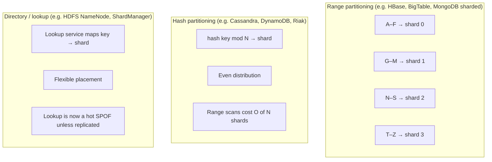
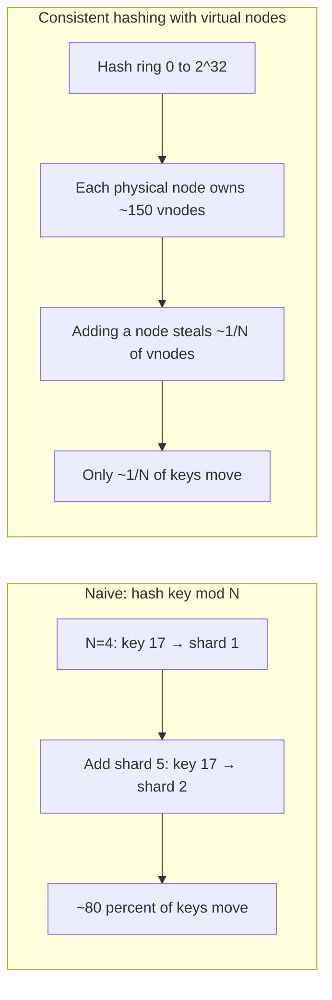
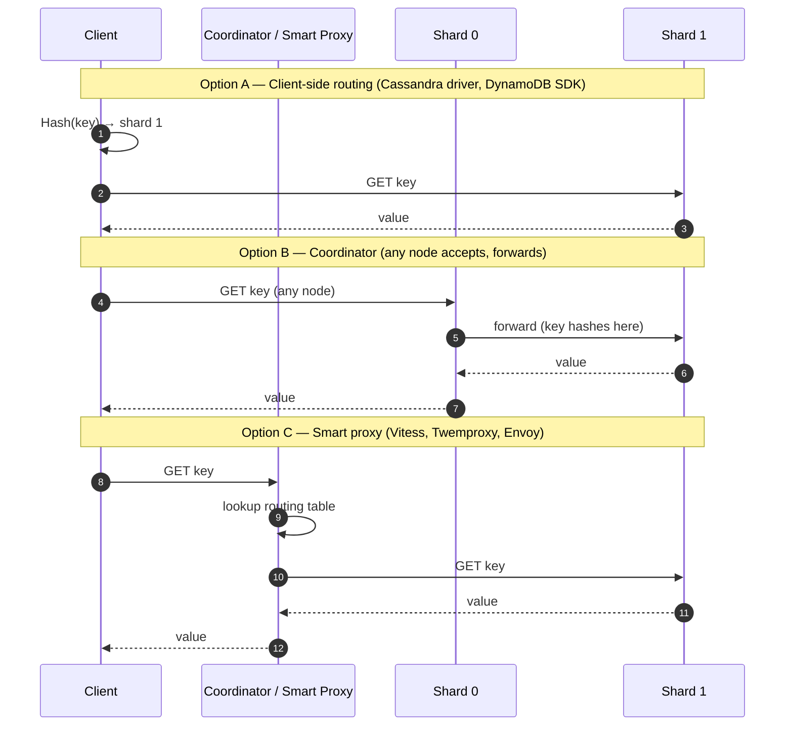
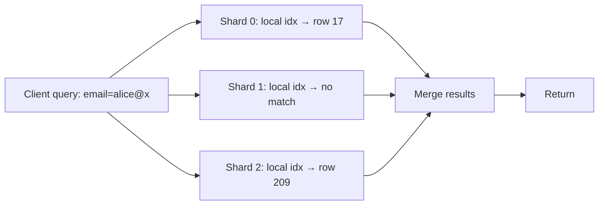

# Partitioning / Sharding

> "If your dataset doesn't fit on one machine, you have a partitioning problem. If your *load* doesn't fit on one machine, you have a *harder* partitioning problem." — paraphrasing DDIA ch. 6.

## Why This Exists

**Problem.** A single node has finite RAM, disk, IOPS, CPU, and network. Beyond a threshold (working set > RAM, writes > single-disk fsync rate, fanout > NIC bandwidth) you must split state across multiple nodes. The act of splitting introduces a *routing* problem (where does key K live?), a *rebalancing* problem (when nodes join/leave, who moves?), and a *fairness* problem (one shard gets 100x the load). Get any of those wrong and you've made things worse, not better — you've kept the bottleneck and added a network hop, a coordination layer, and a new class of bugs (cross-shard transactions, stale routing tables, scatter-gather amplification).

**Key insight.** Partitioning is *almost always* combined with replication (DDIA ch. 5). A partition is a unit of *placement*; a replica is a unit of *durability/availability*. Most production systems have N partitions × R replicas of each. Reason about them as orthogonal axes — the failure modes compose.

**Reach for this when:**
- Single-node working set > RAM and you're paging to disk (latency cliff).
- Write throughput exceeds what one primary's WAL can fsync.
- One tenant / one key family dominates load and starves the rest (multi-tenant noisy neighbor).
- You need geographic locality (EU users on EU shards for GDPR / latency).
- Cost: shard onto cheaper boxes instead of buying one giant one.

**Don't reach for this when:**
- Read-only or read-heavy and the working set fits in RAM — add read replicas first (DDIA ch. 5).
- You haven't measured. "We might need to scale" without numbers leads to premature sharding, which permanently raises every operation's complexity (cross-shard JOINs, distributed txns, schema migrations × N).
- A single fat node + caching layer (Redis / CDN) would cover you for 2 more years. Sharding is one-way; un-sharding is brutal.
- The bottleneck is one query plan, one missing index, or one N+1 — fix that first.

---

## Diagrams

### The three partitioning schemes



### Consistent hashing — what adding a node costs



### Request routing — three architectures



---

## Range partitioning

Keys are sorted; each shard owns a contiguous range. **HBase, BigTable, MongoDB (when shard key is range-based), CockroachDB, FoundationDB, Spanner** all use this.

```python
# Conceptual: range partition map
ranges = [
    ("",   "f", "shard-0"),  # keys < "f"
    ("f",  "m", "shard-1"),
    ("m",  "s", "shard-2"),
    ("s",  None, "shard-3"),  # None = +infinity
]

def route(key: str) -> str:
    for lo, hi, shard in ranges:
        if (lo == "" or key >= lo) and (hi is None or key < hi):
            return shard
    raise RuntimeError("unreachable")
```

**Pros.** Range scans are cheap — `SELECT * WHERE ts BETWEEN x AND y` hits one or two shards, not all of them. Sorted secondary indexes work naturally.

**Cons (the war story).** Pick the wrong shard key and you get a **hot tail**. Classic example: shard a time-series table by `timestamp`. Every write goes to whichever shard currently owns the "latest" range. That single shard handles 100% of write traffic; the other N–1 sit idle. Fix: prefix the key with something high-cardinality (`(sensor_id, timestamp)`) — DDIA ch. 6 calls this "compound primary key".

**Auto-splitting.** Production range-partitioned systems split a shard when it exceeds a size threshold (HBase: ~10GB region; BigTable: ~200MB tablet) and merge when it shrinks. Splits are mostly invisible to clients but cause latency blips during the split itself.

---

## Hash partitioning

Apply a hash function to the key, take mod N, route to that shard. **Memcached (classic), early Riak, Cassandra (with Murmur3), DynamoDB internally, Kafka (default partitioner)** all hash.

```python
import hashlib

def hash_partition(key: str, num_shards: int) -> int:
    # MD5 is fine here — we want distribution, not security.
    # Use a stable hash; never use Python's built-in hash() across processes
    # because PYTHONHASHSEED randomizes it — your routing will diverge.
    h = hashlib.md5(key.encode()).digest()
    return int.from_bytes(h[:8], "big") % num_shards
```

**Pros.** Even distribution for free, assuming the hash is good and keys are high-cardinality.

**Cons.** Range scans become **scatter-gather** across all N shards. Adding/removing a shard with `mod N` reshuffles ~`(N-1)/N` of all keys — catastrophic for any cache-warm system. This is what consistent hashing fixes.

### Consistent hashing

The original paper: Karger et al., "Consistent Hashing and Random Trees" (1997). Memcached's `ketama` library and Amazon's Dynamo paper (2007) made it ubiquitous.

```python
import bisect
import hashlib

class ConsistentHashRing:
    """
    Each physical node owns ~vnodes_per_node positions on a 2^32 ring.
    A key hashes to a ring position; the owner is the next node clockwise.
    Adding a node only reshuffles ~1/N of keys.
    """
    def __init__(self, nodes: list[str], vnodes_per_node: int = 150):
        self._ring: dict[int, str] = {}
        self._sorted_positions: list[int] = []
        for node in nodes:
            self._add_node(node, vnodes_per_node)

    def _hash(self, s: str) -> int:
        return int.from_bytes(hashlib.md5(s.encode()).digest()[:4], "big")

    def _add_node(self, node: str, vnodes: int) -> None:
        for i in range(vnodes):
            pos = self._hash(f"{node}#{i}")
            self._ring[pos] = node
        self._sorted_positions = sorted(self._ring.keys())

    def add_node(self, node: str, vnodes: int = 150) -> None:
        # Adding a node: only keys whose ring position falls in the
        # ranges newly owned by `node` need to migrate. ~1/N of keys.
        self._add_node(node, vnodes)

    def remove_node(self, node: str) -> None:
        self._ring = {p: n for p, n in self._ring.items() if n != node}
        self._sorted_positions = sorted(self._ring.keys())

    def route(self, key: str) -> str:
        if not self._sorted_positions:
            raise RuntimeError("empty ring")
        pos = self._hash(key)
        idx = bisect.bisect_right(self._sorted_positions, pos)
        if idx == len(self._sorted_positions):
            idx = 0  # wrap around
        return self._ring[self._sorted_positions[idx]]
```

**Why virtual nodes (vnodes)?** With one position per physical node, distribution variance is high (some nodes get 3x others). With ~150 vnodes per node, variance drops to a few percent. Cassandra defaults to 256 vnodes per node; Dynamo paper uses a similar scheme.

**What consistent hashing does NOT solve.**
1. **Hot keys.** If one *key* is hot (Beyoncé's profile), it still lives on one node. Vnodes help with hot *ranges*, not hot *items*. See "celebrity problem" below.
2. **Replica placement on small clusters.** With 3 nodes and replication factor 3, every key lives on every node anyway — the ring is moot.
3. **Rack/AZ awareness.** Plain consistent hashing might place all R replicas of a key on hosts in the same rack. Production rings (Cassandra's `NetworkTopologyStrategy`, Dynamo's preference lists) walk the ring skipping nodes already used in the same rack/AZ.

---

## Directory / lookup partitioning

A separate metadata service maps key → shard. **HDFS NameNode**, **GFS master**, **Vitess vschema**, **Facebook ShardManager**, and **MongoDB's config servers** all use this.

```python
# Pseudocode for a lookup-based router
class DirectoryRouter:
    def __init__(self, metadata_service):
        self._meta = metadata_service     # consistent / replicated KV
        self._cache = TTLCache(ttl=60)    # critical: must invalidate on splits

    def route(self, key: str) -> str:
        cached = self._cache.get(key)
        if cached:
            return cached
        # Metadata service is itself replicated (Paxos/Raft)
        # so it doesn't become a SPOF.
        shard = self._meta.lookup(key)
        self._cache.set(key, shard)
        return shard

    def on_routing_changed(self, key_range, new_shard):
        # Pub/sub or version-bump in the metadata service.
        # Stale clients hitting the old shard get a "wrong shard" error
        # and refresh.
        self._cache.invalidate(key_range)
```

**Pros.** Maximum flexibility — you can move *any* key to *any* shard, do hot-key splitting, tenant pinning, geographic placement. Vitess uses this to isolate noisy tenants.

**Cons.** The lookup service is now critical. Every request either pays a lookup hop or relies on a cache that can go stale. Stale routing → "I asked shard 3, but key K moved to shard 7 last hour" → either silent wrong-answer (catastrophic) or a redirect storm.

---

## Hot partitions and the celebrity problem

This is the failure mode that bites every shop sooner or later.

**Setup.** You hash-partitioned `users` by `user_id`. Distribution looks beautiful in load tests. Then Taylor Swift signs up and 50M followers fan out reads/writes against her row. *That row lives on one shard.* That shard's CPU pegs. Tail latency for *every* user on that shard goes to hell, even users who have nothing to do with Taylor Swift.

This is the **celebrity problem** (sometimes "hot key" or "skewed workload"). DDIA ch. 6 covers it explicitly.

### Mitigations (in order of how often they actually work)

1. **Read-side: replicate the hot key aggressively.** If the hot row is read-heavy, fan out reads to N replicas. DynamoDB Accelerator (DAX), Redis read replicas, application-side caching. Cheap and effective — does nothing for write hotness.

2. **Write-side: salt the key.** Append a random suffix `0..K-1` to the hot key, write to one of K virtual sub-keys, read from all K and merge. DynamoDB documents this pattern explicitly. Cost: every read becomes K reads.

   ```python
   # Writing a counter for a celebrity user
   def increment_counter(user_id: str, K: int = 16):
       suffix = random.randint(0, K - 1)
       key = f"{user_id}#{suffix}"
       db.atomic_add(key, 1)

   def read_counter(user_id: str, K: int = 16) -> int:
       # Now every read fans out K times. Tradeoff is explicit.
       return sum(db.get(f"{user_id}#{i}") or 0 for i in range(K))
   ```

3. **Detect and re-shard.** Auto-shard splitting (DynamoDB adaptive capacity, BigTable tablet splits) detects a hot range and physically splits it. Doesn't help with a single hot *key* — it's already the smallest unit.

4. **Application-level coalescing.** For high-frequency increments (view counts, like counts), batch in-process for N ms then write. Trades freshness for shard health.

5. **Pin the celebrity to a dedicated shard.** Directory partitioning lets you do this; hash partitioning doesn't.

**What does NOT work:** "Just add more shards." If the hotness is on one *key*, more shards leave that key on one shard. You're sharding the cold majority of your data and the hot key still melts one node.

---

## Secondary indexes: local vs global

A secondary index is "find all rows where `email = X`" when your primary partition key is `user_id`. Two implementation strategies, very different consequences.

### Local secondary indexes (a.k.a. document-partitioned)

Each shard maintains its own index *over its own rows only*. Writes are local (cheap). Reads must **scatter-gather** across all shards.

Used by: **MongoDB** (default), **Cassandra** (built-in secondary indexes), **Elasticsearch** (each shard indexes its own docs).



**Pro.** Writes touch one shard. **Con.** Read latency = max(shard latency) across N shards — tail latency amplification (see Dean & Barroso "The Tail at Scale"). One slow shard slows every secondary-index query.

### Global secondary indexes (a.k.a. term-partitioned)

The index itself is partitioned by the indexed term (e.g., partition the email index by `hash(email)`). A read is a single shard hop. A write must update *both* the primary row *and* a remote index entry.

Used by: **DynamoDB GSI**, **Riak's term-based indexes**, **search systems backed by Kafka + a separately-partitioned index**.

**Pro.** Read amplification = 1 (or 2 — index lookup, then row fetch). **Con.** Write amplification — every primary write triggers a cross-shard index write. If done synchronously it's a 2-phase commit (or you lose atomicity); DynamoDB GSIs are *eventually consistent* for exactly this reason.

### Decision

| Situation | Choose |
|---|---|
| Read-heavy on the secondary attribute, can tolerate eventual consistency | Global / term-partitioned |
| Write-heavy, OK with scatter-gather reads | Local / document-partitioned |
| Need strong consistency on secondary lookup | Avoid both — denormalize, or accept distributed txn cost |

DDIA ch. 6 ("Partitioning and Secondary Indexes") is the canonical writeup.

---

## Rebalancing

When you add or remove nodes, partitions must move. Strategies, by failure-mode footprint:

**Don't: hash mod N.** Adds a node → ~(N-1)/N of keys move. A 4→5 expansion shuffles 80% of data. Ruinous for caches; brutal for storage.

**Fixed number of partitions, far more than nodes.** Pick a high N (e.g., 1024 partitions for 10 nodes; each node owns ~100). When you add a node, move ~100 partitions to it. Number of partitions doesn't change — only ownership changes. **Riak, Elasticsearch, Couchbase** use this. Pre-size carefully — once chosen, N is hard to change.

**Dynamic partitioning.** Partitions split when too big, merge when too small. **HBase, BigTable, MongoDB (range mode), CockroachDB.** Better fit for unknown-size workloads; the splitting itself is operational complexity.

**Partitioning proportional to nodes.** Cassandra's default with vnodes — each node owns a fixed number of vnodes (~256). Adding a node steals vnodes from existing ones.

```python
# Sketch: a rebalance plan with bounded movement
def plan_rebalance(current: dict[int, str], nodes: list[str]) -> list[tuple]:
    """
    current: partition_id -> owning node
    nodes: new desired node set
    Returns moves [(partition_id, from_node, to_node)].
    Goal: minimize moves while equalizing.
    """
    target_per_node = len(current) // len(nodes)
    moves = []
    counts = {n: 0 for n in nodes}
    for pid, owner in current.items():
        if owner in counts and counts[owner] < target_per_node:
            counts[owner] += 1
        else:
            # find a node under quota
            target = min(counts, key=counts.get)
            moves.append((pid, owner, target))
            counts[target] += 1
    return moves
```

**Operational note: don't auto-rebalance on failure.** Cassandra and others learned the hard way that automatically reassigning partitions when a node looks dead causes thundering-herd rebalances during transient network partitions, often making the outage worse. Most production systems require operator confirmation for rebalance, with automatic *failover to replicas* but not automatic *re-partitioning*. (See SRE Workbook, "Managing Critical State".)

---

## Routing: client-side, coordinator, smart proxy

Once partitions exist, *some component must know where each key lives*. Three architectures:

### Client-side (driver-based)

The client library subscribes to cluster metadata and routes directly to the right node.
- **DynamoDB SDK**, **Cassandra drivers (DataStax)**, **MongoDB drivers (with shard awareness)**, **Kafka producers**.
- **Pro:** zero extra network hop, lowest latency.
- **Con:** every language gets its own driver; metadata changes propagate slowly; bug surface is in N client libraries.

### Coordinator node (any-node-accepts-and-forwards)

Any node can accept any request; if the key isn't local, it forwards. Cassandra calls this the "coordinator". Riak does this.
- **Pro:** dumb clients work fine.
- **Con:** extra hop; coordinator becomes a bottleneck under load if poorly chosen.

### Smart proxy (sidecar / fleet)

A dedicated routing tier between clients and shards: **Vitess (vtgate)**, **Twemproxy / nutcracker**, **Envoy with a Lua/WASM filter**, **ProxySQL**, **Redis Cluster proxies**.
- **Pro:** centralizes routing logic; clients are dumb; metadata changes propagate fast.
- **Con:** extra hop; proxy fleet is itself a system to operate (HA, deploys, capacity).

**The real trade-off** is *who owns the routing table*. The fewer copies of the routing table, the easier rebalancing is — but the more central the SPOF. Most large systems land on **smart proxy + ZooKeeper/etcd-backed metadata** because operating the routing fleet is easier than coordinating thousands of clients during a rebalance.

---

## Trade-offs

| Benefit | Cost |
|---|---|
| Range partitioning supports cheap range scans | Must choose shard key carefully or you get hot tails (timestamp-only is the classic mistake) |
| Hash partitioning gives near-perfect distribution | Range scans become scatter-gather; rebalancing with `mod N` is catastrophic (use consistent hashing) |
| Consistent hashing minimizes movement on resize | Doesn't fix hot *keys*, only hot *ranges*; needs vnodes to hit good balance |
| Directory partitioning is most flexible | Metadata service is critical infrastructure; stale routing is its own bug class |
| Local secondary indexes are write-cheap | Reads scatter-gather; tail latency amplifies |
| Global secondary indexes are read-cheap | Writes touch ≥2 shards; usually only eventually consistent |
| Smart proxies give clean routing & easy rebalancing | Extra hop; new fleet to run |
| Client-side routing minimizes hops | Driver bug = production outage in every language you support |
| More partitions per node (vnodes) reduces variance | More metadata, more open files, more things to monitor |
| Auto-splitting fits unknown workloads | Splits cause latency blips, complicate ops, break some assumptions about contiguous keys |

---

## Common Pitfalls

- **Sharding by `timestamp`.** Writes pile up on the latest shard. Fix: composite key `(tenant_id, timestamp)` or `(hash(id), timestamp)`.
- **Sharding by `tenant_id` alone in a multi-tenant SaaS.** Then your largest customer is one shard's problem, alone. Either subdivide large tenants or use directory partitioning to spread them.
- **Forgetting that `hash mod N` reshuffles everything.** Production caches that took hours to warm get wiped because someone added a node. Use consistent hashing or a fixed-N scheme from day one.
- **Choosing N once and never auditing.** Riak/ES/Couchbase users who picked N=64 in 2015 and have 200 nodes today are suffering — each node owns less than 0.5 partitions per shard; load isn't spreading. Pre-size for ~5–10 years of growth.
- **Cross-shard transactions sneaking in.** A `JOIN` across shards, or "transfer money from user A to user B" where they're on different shards. Either denormalize, accept eventual consistency, or pay for distributed transactions (2PC, Spanner-style — expensive). DDIA ch. 9.
- **Scatter-gather fanout amplification.** A query that hits all 100 shards has p99 = max(p99 of 100 shards). With per-shard p99 = 50ms and modest variance, the *combined* p99 is several hundred ms. (Dean & Barroso, "The Tail at Scale", CACM 2013.)
- **Single hot key.** No amount of re-partitioning fixes one celebrity. Salt or cache.
- **Ignoring rack/AZ awareness.** All R replicas land in the same AZ → AZ outage = data unavailable even though R=3.
- **Auto-rebalancing during transient partitions.** Network blip looks like node death; cluster decides to move TBs of data; real failure happens mid-rebalance. Manual confirmation, please.
- **Routing-table version skew.** Client A has v17, client B has v18. Some keys are double-routed; some are dead-routed. Use monotonically-versioned routing tables and reject stale-version requests at the shard.
- **Resharding under load.** Migrating live data while serving live traffic is one of the hardest production operations. Vitess, MongoDB, and Slack/Stripe have all written about scars. Plan for it from day one or you'll re-architect under pressure.

---

## Decision Table

| Situation | Use | Why |
|---|---|---|
| Time-series, log data, mostly recent reads | Range partition by `(source_id, time)` | Range scans cheap; source prefix prevents hot-tail |
| KV store, point reads, no range scans | Hash + consistent hashing (Cassandra/Dynamo style) | Even distribution; cheap rebalance |
| Multi-tenant SaaS, tenant-scoped queries | Directory / lookup, partition by tenant | Allows per-tenant placement, isolation, geo-pinning |
| Need SQL with joins on a key | Co-locate by that key (e.g., `user_id`); shard everything related to that user on the same shard | Avoids cross-shard joins |
| Massive read fanout on one item | Replicate that item / cache it; don't try to partition harder | One hot key isn't a partitioning problem |
| Small cluster (≤3 nodes), high replication factor | Honestly, don't shard yet — replicas already cover every node | Sharding adds complexity for ~zero distribution gain |
| Dataset of unknown growth shape | Dynamic / auto-splitting (HBase, CockroachDB style) | Avoids picking N too small or too big |
| Predictable, capped dataset | Fixed N partitions much greater than node count | Simpler ops, stable routing table |
| Read-heavy secondary lookups, OK with eventual consistency | Global secondary index (term-partitioned) | One-shard read |
| Write-heavy, occasional secondary lookups | Local secondary index (document-partitioned) | One-shard write |
| Strong consistency across shards required | Reconsider partitioning, or pay for Spanner-class distributed txns | 2PC at scale is painful — see DDIA ch. 9 |

---

## References

- Kleppmann, Martin — *Designing Data-Intensive Applications*, **ch. 6 "Partitioning"** (range/hash/secondary indexes/rebalancing/routing) and **ch. 5 "Replication"** (composes with partitioning) — https://www.oreilly.com/library/view/designing-data-intensive-applications/9781491903063/
- DeCandia et al. (Amazon) — *Dynamo: Amazon's Highly Available Key-value Store* (SOSP 2007) — origin of consistent hashing + vnodes in production — https://www.allthingsdistributed.com/files/amazon-dynamo-sosp2007.pdf
- Karger et al. — *Consistent Hashing and Random Trees: Distributed Caching Protocols for Relieving Hot Spots on the World Wide Web* (STOC 1997) — the foundational paper — https://dl.acm.org/doi/10.1145/258533.258660
- Chang et al. (Google) — *Bigtable: A Distributed Storage System for Structured Data* (OSDI 2006) — range partitioning, tablets, splits — https://research.google/pubs/bigtable-a-distributed-storage-system-for-structured-data/
- Corbett et al. (Google) — *Spanner: Google's Globally Distributed Database* (OSDI 2012) — directory-based partitioning + global txns — https://research.google/pubs/spanner-googles-globally-distributed-database-2/
- Dean, Jeff & Barroso, Luiz — *The Tail at Scale*, CACM Feb 2013 — why scatter-gather amplifies tail latency — https://research.google/pubs/the-tail-at-scale/
- AWS — *DynamoDB Developer Guide: Partition keys and best practices for designing partition keys* — https://docs.aws.amazon.com/amazondynamodb/latest/developerguide/bp-partition-key-design.html
- AWS — *DynamoDB adaptive capacity* — https://docs.aws.amazon.com/amazondynamodb/latest/developerguide/bp-partition-key-design.html#bp-partition-key-partitions-adaptive
- AWS Builders' Library — Marc Brooker, *Workload isolation using shuffle-sharding* — partitioning for multi-tenant blast-radius reduction — https://aws.amazon.com/builders-library/workload-isolation-using-shuffle-sharding/
- Cassandra docs — *Data distribution and replication* (vnodes, NetworkTopologyStrategy) — https://cassandra.apache.org/doc/latest/cassandra/architecture/dynamo.html
- Vitess — *Resharding workflow* — https://vitess.io/docs/user-guides/configuration-advanced/resharding/
- Google SRE Workbook — ch. 16 *Managing Critical State* — why automatic rebalancing on failure is dangerous — https://sre.google/workbook/managing-critical-state/
- Pat Helland — *Life Beyond Distributed Transactions: An Apostate's Opinion* — entity-keyed partitioning and the discipline it forces — https://queue.acm.org/detail.cfm?id=3025012
- Slack Engineering — *Scaling Datastores at Slack with Vitess* — production reshard war story — https://slack.engineering/scaling-datastores-at-slack-with-vitess/
- Figma Engineering — *How Figma's databases team lived to tell the scale* — practical multi-shard migration narrative — https://www.figma.com/blog/how-figmas-databases-team-lived-to-tell-the-scale/
- Discord — *How Discord Stores Trillions of Messages* (ScyllaDB, partition key design) — https://discord.com/blog/how-discord-stores-trillions-of-messages

---

## See Also

- ../replication/ — partitioning composes with replication; you almost always do both
- ../consistency-models/ — cross-shard reads, read-your-writes, monotonic reads
- ../cap-pacelc/ — partition tolerance is the **P** in CAP, but partitioning ≠ network partition
- ../distributed-transactions/ — 2PC, Saga, and why cross-shard txns hurt
- ../secondary-indexes/ — deeper dive on local vs global indexes
- ../caching/ — hot-key mitigation usually starts with a cache
- ../load-balancing/ — routing layer / smart proxies / shuffle sharding
- ../../reliability/blast-radius/ — partitioning as an isolation mechanism (cell-based architecture, shuffle sharding)
- ../../reliability/tail-latency/ — scatter-gather amplification, hedged requests
- ../streaming/kafka-partitions/ — Kafka's partition model is the same problem in a streaming shape
- ../../scaling/multi-tenant/ — tenant-aware partitioning, noisy neighbors
