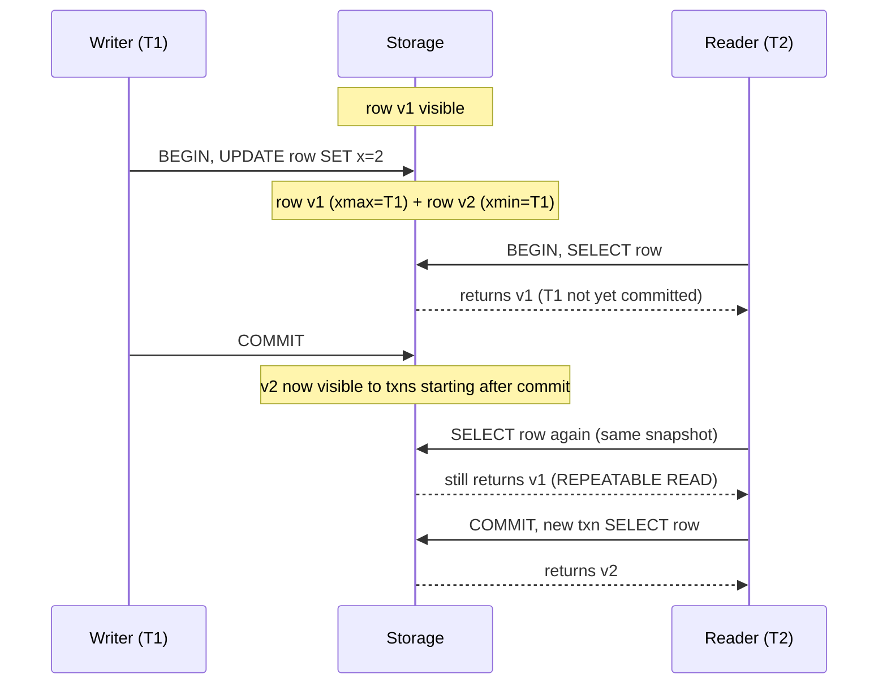
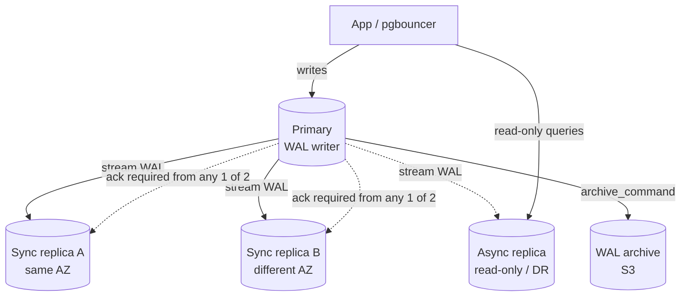
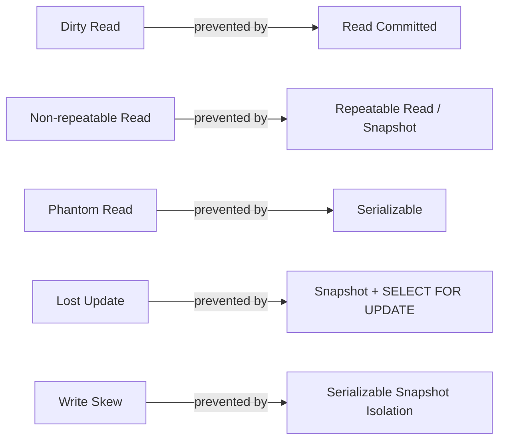

# Relational Databases (Postgres / MySQL)

## Why This Exists

**Problem.** Most application data is relational — orders have line items, users have addresses, invoices reference customers. The moment two of those things must change together (debit one account, credit another) you need **atomicity** and **isolation**, or you'll ship double-charges and missing rows. NoSQL stores let you skip schemas, but they make you reinvent transactions, joins, constraints, and consistency by hand — usually badly.

**Key insight.** A relational database is not "SQL." It's three guarantees fused into one system: (1) a **declarative query language** so the planner can pick the join order and index, (2) **ACID transactions** so multi-row writes either all happen or none happen, and (3) **constraints** (PK, FK, UNIQUE, CHECK) so invalid states are rejected at the storage layer rather than discovered in production at 3am. Discarding the relational model means re-implementing those three things in your application code — and you will get them wrong.

**Reach for this when:**
- You have entities with relationships and need to query across them (`JOIN`, aggregations).
- Multi-row writes must be atomic (transfers, order placement, inventory decrement).
- You need durable enforcement of invariants (no negative balance, no orphaned line item).
- You expect to write ad-hoc analytical queries; SQL is the lingua franca.
- You want a battle-tested HA story (streaming replication, synchronous quorum, point-in-time recovery).
- Your dataset fits on a single primary (single-digit TB is fine for both Postgres and MySQL).

**Don't reach for this when:**
- Workload is graph traversal beyond 2-3 hops (recursive CTEs work but a graph DB is faster — see DDIA ch. 2 "Graph-Like Data Models").
- Time-series at extreme cardinality (millions of distinct series) — use TimescaleDB extension, ClickHouse, or InfluxDB.
- Full-text search at scale with relevance ranking — Postgres `tsvector` is fine for <10M docs, but use OpenSearch/Elastic for serious search.
- Append-only event logs at >100k writes/sec — use Kafka or a column store.
- Embedded/edge — SQLite, not Postgres.

## Diagrams

### MVCC vs locking — what readers see during a write



### HA topology — Postgres streaming replication with sync quorum



### Anomaly map — which isolation level prevents what



## ACID, in plain terms

ACID is not marketing — each letter has operational consequences (DDIA ch. 7):

- **Atomicity** — either the whole transaction commits, or none of it does. Implemented via the WAL (write-ahead log). If the process crashes mid-`UPDATE`, recovery rolls forward committed work and undoes the rest. *This is what saves you when a retry would otherwise double-charge.*
- **Consistency** — application invariants (FK, CHECK, UNIQUE) hold before and after. The DB enforces *referential* consistency; the application owns business invariants.
- **Isolation** — concurrent transactions don't see each other's partial writes. The default level varies (Postgres: Read Committed; MySQL/InnoDB: Repeatable Read) and the defaults are weaker than most engineers assume.
- **Durability** — once `COMMIT` returns, the change survives a power loss. Requires `fsync` of the WAL. `synchronous_commit=off` trades durability for latency — know when you've turned it off.

## Isolation levels — the actual behavior, not the SQL spec

The SQL standard's isolation levels are aspirational. What you actually get depends on the engine.

| Level                  | Postgres                            | MySQL InnoDB                         | Prevents                                      |
|------------------------|-------------------------------------|--------------------------------------|-----------------------------------------------|
| Read Uncommitted       | Treated as Read Committed           | Dirty reads possible                 | Nothing useful                                |
| **Read Committed**     | Default; row-level snapshot per stmt| Available                            | Dirty reads                                   |
| **Repeatable Read**    | Snapshot isolation (SI)             | Default; SI + gap locks              | Non-repeatable reads, phantoms (MySQL via gap locks; Postgres via SI) |
| **Serializable**       | SSI (Serializable Snapshot Isolation) | 2PL via locks (more contention)    | All anomalies including write skew            |

**The trap:** "Repeatable Read" in Postgres prevents non-repeatable reads but **not write skew**. Two transactions can each read the same set, each verify "I'm OK to insert," and both commit a row that violates the invariant. This is the classic on-call doctor scheduling bug from Berenson et al. (1995).

```sql
-- Write skew: both txns see "2 doctors on call" and each lets one go off-call.
-- Result: 0 doctors on call. REPEATABLE READ does NOT catch this.
BEGIN ISOLATION LEVEL REPEATABLE READ;
SELECT count(*) FROM doctors WHERE on_call AND shift = 'monday';  -- returns 2
UPDATE doctors SET on_call = false WHERE id = 1 AND shift = 'monday';
COMMIT;

-- Use SERIALIZABLE (Postgres SSI) or SELECT ... FOR UPDATE on the predicate rows.
```

**Default-level guidance:**
- Use **Read Committed** for simple read-heavy paths. Wrap multi-statement business logic in **Repeatable Read** when you need a stable snapshot.
- Use **Serializable** for money-moving transactions where write skew matters. Expect occasional `serialization_failure` (SQLSTATE 40001) and **retry the whole transaction**. Postgres' SSI is cheap when conflicts are rare.
- Never assume "it'll be fine" — write a concurrency test (two clients, real txn, assert invariant).

## MVCC vs locking

Both Postgres and InnoDB use **MVCC** (multi-version concurrency control): each row has multiple versions tagged with the transaction IDs that created/deleted them. Readers see the version visible to their snapshot; they never block writers, and writers never block readers.

```
Postgres tuple header (simplified):
  xmin = txn that inserted this version
  xmax = txn that deleted/updated this version (0 if live)
  ctid = physical (block, offset)

A reader at snapshot S sees a tuple iff:
  xmin committed before S started AND (xmax = 0 OR xmax committed after S started OR aborted)
```

**Consequences:**
- `SELECT` never takes row locks unless you say `FOR UPDATE` / `FOR SHARE`.
- `UPDATE` is logically "delete old version + insert new version" — indexes that point to the old `ctid` need updating too (Postgres HOT updates skip this when no indexed column changed).
- Dead tuples accumulate and must be reclaimed: **VACUUM** in Postgres, **purge thread** in InnoDB.
- **Long-running transactions are toxic** — they prevent vacuum from cleaning up tuples newer than their snapshot. A reporting query left open all weekend can balloon table size and break autovacuum.

```sql
-- Postgres: find the oldest open transaction (the one blocking vacuum)
SELECT pid, now() - xact_start AS age, state, query
FROM pg_stat_activity
WHERE xact_start IS NOT NULL
ORDER BY xact_start ASC
LIMIT 5;
```

When you do need locks, prefer the narrowest:

```sql
-- Pessimistic: lock the row I'm about to update. Other txns block.
SELECT balance FROM accounts WHERE id = $1 FOR UPDATE;

-- Less contention: SHARE if you only need to prevent deletion.
SELECT * FROM users WHERE id = $1 FOR SHARE;

-- Skip-locked: classic queue pattern (claim a job without blocking).
SELECT id FROM jobs
WHERE status = 'pending'
ORDER BY created_at
FOR UPDATE SKIP LOCKED
LIMIT 1;
```

## SQL essentials you must own

You don't need to memorize the standard. You do need to know these idioms cold.

### Joins — pick the right one

```sql
-- INNER: only rows that match in both. Default; what most people want.
SELECT u.id, o.id
FROM users u
JOIN orders o ON o.user_id = u.id;

-- LEFT: keep all users, NULL for users without orders.
-- COMMON BUG: filtering on the right side in WHERE turns LEFT into INNER.
SELECT u.id, o.id
FROM users u
LEFT JOIN orders o ON o.user_id = u.id
WHERE o.status = 'paid';   -- WRONG: hides users with no orders
-- Fix: move the filter into the ON clause.
LEFT JOIN orders o ON o.user_id = u.id AND o.status = 'paid';

-- LATERAL: per-row subquery. Useful for "top N per group."
SELECT u.id, recent.id, recent.created_at
FROM users u
JOIN LATERAL (
  SELECT id, created_at FROM orders o
  WHERE o.user_id = u.id
  ORDER BY created_at DESC LIMIT 3
) recent ON true;
```

### Upsert — idempotent writes are non-negotiable

```sql
-- Postgres: ON CONFLICT
INSERT INTO sessions (id, user_id, last_seen)
VALUES ($1, $2, now())
ON CONFLICT (id) DO UPDATE
SET last_seen = EXCLUDED.last_seen
WHERE sessions.last_seen < EXCLUDED.last_seen;  -- guard against stale writes

-- MySQL: INSERT ... ON DUPLICATE KEY UPDATE
INSERT INTO sessions (id, user_id, last_seen)
VALUES (?, ?, NOW())
ON DUPLICATE KEY UPDATE last_seen = GREATEST(last_seen, VALUES(last_seen));
```

### Window functions — because GROUP BY can't do everything

```sql
-- Top order per user, with rank, without LATERAL
SELECT *
FROM (
  SELECT o.*,
         ROW_NUMBER() OVER (PARTITION BY user_id ORDER BY total DESC) AS rn
  FROM orders o
) t WHERE rn = 1;
```

### CTEs and recursion

```sql
-- Recursive: walk a tree. Cheap up to a few thousand rows;
-- if you do this on millions of rows, consider a graph DB.
WITH RECURSIVE descendants AS (
  SELECT id, parent_id, name FROM categories WHERE id = $1
  UNION ALL
  SELECT c.id, c.parent_id, c.name
  FROM categories c JOIN descendants d ON c.parent_id = d.id
)
SELECT * FROM descendants;
```

## Constraints — let the database say no

Every invariant you don't encode in the schema will eventually be violated by a buggy migration script, a hand-written backfill, or a stray retry. Constraints are not "nice to have"; they're the reason you're not using a key-value store.

```sql
CREATE TABLE accounts (
    id           BIGSERIAL PRIMARY KEY,
    owner_id    BIGINT NOT NULL REFERENCES users(id) ON DELETE RESTRICT,
    balance_cents BIGINT NOT NULL CHECK (balance_cents >= 0),
    currency     CHAR(3) NOT NULL CHECK (currency ~ '^[A-Z]{3}$'),
    created_at   TIMESTAMPTZ NOT NULL DEFAULT now(),
    UNIQUE (owner_id, currency)
);

-- Partial index: index only the rows that matter.
-- 99% of rows have status='archived'; queries hit the 1% active ones.
CREATE INDEX idx_orders_active
  ON orders (created_at DESC)
  WHERE status IN ('pending', 'processing');

-- Expression index: query by lower(email) without a sequential scan.
CREATE UNIQUE INDEX idx_users_email_lower ON users (lower(email));

-- Exclusion constraint (Postgres): no two reservations overlap for the same room.
CREATE EXTENSION IF NOT EXISTS btree_gist;
ALTER TABLE reservations
  ADD CONSTRAINT no_overlap
  EXCLUDE USING gist (
    room_id WITH =,
    tstzrange(starts_at, ends_at) WITH &&
  );
```

**Foreign keys, honestly:** Yes, they cost a lookup on write. Yes, they take a row lock on the parent on `ON DELETE RESTRICT`. They are still worth it — the alternative is silently orphaned rows that surface six months later as a billing reconciliation disaster. If FK overhead actually shows up in your profiler, it's a sign you should be using `ON DELETE NO ACTION DEFERRABLE` or batching deletes, not removing FKs.

## JSONB — the escape hatch, used responsibly

Postgres' `jsonb` (and MySQL's `JSON`) lets you store schemaless data inside a relational table. This is genuinely useful for:

- User-defined custom fields you can't model up-front.
- External webhook payloads you want to keep verbatim.
- Sparse attributes where most rows wouldn't have most columns.

It is **not** a replacement for normalization. Indexed `jsonb` is slower than typed columns, and you lose CHECK constraints inside the document.

```sql
CREATE TABLE events (
    id   BIGSERIAL PRIMARY KEY,
    kind TEXT NOT NULL,
    data JSONB NOT NULL,
    created_at TIMESTAMPTZ NOT NULL DEFAULT now()
);

-- GIN index: arbitrary key/value lookups
CREATE INDEX idx_events_data ON events USING gin (data jsonb_path_ops);

SELECT * FROM events WHERE data @> '{"user_id": 42}';
SELECT data->>'email' FROM events WHERE kind = 'signup';

-- When a JSON field becomes hot, promote it to a column:
ALTER TABLE events ADD COLUMN user_id BIGINT
  GENERATED ALWAYS AS ((data->>'user_id')::bigint) STORED;
CREATE INDEX idx_events_user ON events (user_id);
```

## Indexes — the part everyone gets wrong

The index discussion fills books (DDIA ch. 3). The 80% you need:

- **B-tree** is the default for equality + range. `WHERE x = ?`, `WHERE x BETWEEN ? AND ?`, `ORDER BY x`.
- **Composite indexes are ordered.** An index on `(a, b, c)` serves `WHERE a = ?`, `WHERE a = ? AND b = ?`, `WHERE a = ? ORDER BY b` — but **not** `WHERE b = ?` alone. Put the equality columns first, then the range column, then sort columns.
- **Covering indexes** (`INCLUDE` in Postgres ≥11) avoid heap fetches: index-only scans are dramatically faster on wide tables.
- **Partial indexes** are the sharpest tool — index only the rows you query.
- **Don't index every column.** Each index slows writes and consumes RAM. Audit with `pg_stat_user_indexes` (`idx_scan = 0` after a week → drop it).
- **`EXPLAIN (ANALYZE, BUFFERS)` is the only way to know.** Plan estimates lie; actual rows + buffers tell the truth.

```sql
EXPLAIN (ANALYZE, BUFFERS, FORMAT text)
SELECT * FROM orders WHERE user_id = 42 AND status = 'paid' ORDER BY created_at DESC LIMIT 20;
-- Look for: Seq Scan on a big table = bad. Bitmap Heap Scan with high "Rows Removed by Filter" = wrong index.
```

## HA topologies

Postgres and MySQL both stream a write-ahead log (WAL / binlog) to replicas. Pick a topology by **what failure mode you can't tolerate**.

| Topology                          | RPO        | RTO       | Notes                                                              |
|-----------------------------------|------------|-----------|--------------------------------------------------------------------|
| Single primary, async replica     | seconds    | minutes   | Cheapest. Last few seconds of writes lost on primary failure.      |
| Sync replication (1 sync replica) | 0          | minutes   | Primary blocks on commit until replica acks. Latency penalty.      |
| Sync quorum (k of n)              | 0          | minutes   | `synchronous_standby_names = 'ANY 1 (a, b)'`. Survives 1 replica down. |
| Multi-primary (Galera, BDR)       | 0          | seconds   | Write conflicts must be detected — strict schema discipline. Rare. |
| Managed (RDS, Aurora, Cloud SQL)  | varies     | seconds   | Cloud-vendor magic; read the SLA docs, not the marketing.          |

**Read replicas have replication lag.** Reading your own write from a replica returns stale data. The fix is either (1) read from primary after writes within a session, or (2) wait for `pg_last_wal_replay_lsn()` to catch up to the LSN you just wrote. AWS Builders' Library covers this in "Avoiding fallback in distributed systems."

**Failover is hard.** A naive watchdog that promotes a replica on primary failure can cause **split brain** if the primary was just slow, not dead. Use a real consensus tool (Patroni for Postgres, Orchestrator for MySQL, or a managed service). Test failover quarterly; don't discover the bug at 3am.

## Postgres vs MySQL — pick by failure mode, not religion

Both are excellent. The differences that actually matter:

| Concern                   | Postgres                                      | MySQL (InnoDB)                                  |
|---------------------------|-----------------------------------------------|--------------------------------------------------|
| Default isolation         | Read Committed                                | Repeatable Read (with gap locks)                 |
| Serializable              | True SSI; cheap when conflicts rare           | 2PL; more locking, more deadlocks                |
| MVCC vacuum               | Background VACUUM / autovacuum; tunable       | Purge thread inside InnoDB; less operator burden |
| Replication               | Logical (publications) + physical (streaming) | Statement / row / mixed binlog; GTID             |
| DDL                       | Most DDL transactional; CONCURRENTLY for indexes | Online DDL good but with caveats; many tools (pt-osc, gh-ost) |
| Extensions                | First-class (PostGIS, TimescaleDB, pgvector)  | Plugins exist but ecosystem narrower             |
| JSON                      | `jsonb` with GIN, very rich                    | `JSON` type; functional indexes via generated cols |
| Default install ergonomics| More knobs to tune (vacuum, work_mem, WAL)    | Saner defaults out of the box                    |
| Foreign-key behavior      | Strictly enforced, deferrable                 | Strictly enforced; not deferrable                |
| Window/CTE/lateral support| Excellent                                     | Good (8.0+); recursive CTE since 8.0             |
| Operational maturity      | Streaming repl, logical repl, PITR via WAL    | Mature; binlog-based PITR; group replication     |

**Choose Postgres** when you want serializable transactions, complex SQL, geospatial/vector/timeseries extensions, or you live in cloud-native land where managed Postgres is everywhere. Use it for OLTP plus moderate analytics.

**Choose MySQL** when you have an existing MySQL ecosystem, your team is already deep on it, or you need the InnoDB write-throughput characteristics for very high-row-count workloads with simple queries. Vitess + MySQL remains the proven path to horizontal scale (YouTube, Slack, GitHub).

Either way: **the wrong question is "Postgres or MySQL?"**, the right question is "what's our HA story, who runs vacuum/purge, who reads `EXPLAIN`?"

## When relational is the wrong default

DDIA ch. 2 lays out the polyglot persistence argument; the short version:

| Workload                                | Why relational struggles                              | Better fit                                  |
|-----------------------------------------|-------------------------------------------------------|---------------------------------------------|
| Graph traversals (3+ hops, variable depth) | Recursive CTEs work but planner is poor at them    | Neo4j, Neptune, or graph extensions         |
| Time-series at high cardinality (M+ series) | Index bloat; vacuum struggles                      | TimescaleDB, ClickHouse, InfluxDB, Prometheus |
| Full-text search with relevance ranking | `tsvector` works to ~10M docs; ranking is limited     | OpenSearch / Elasticsearch                  |
| OLAP scans over billions of rows        | Row store wastes I/O; columnar is 10-100x faster      | ClickHouse, Snowflake, BigQuery, DuckDB     |
| Append-only event log >100k writes/sec  | Index maintenance dominates                            | Kafka + downstream materialization          |
| Embedded / single-process               | Too much operational surface                           | SQLite, DuckDB                              |
| Schemaless rapid-prototype with no joins | Migrations feel heavy                                  | DynamoDB, Mongo (revisit when you grow up)  |

A common pattern in mature systems: **Postgres for the source of truth, plus** ClickHouse for analytics, OpenSearch for search, Redis for hot cache, S3 for blobs. The relational DB is the system of record; everything else is a derived view kept in sync via CDC (Debezium reading the WAL/binlog).

## A worked example — money transfer

Money is where ACID earns its keep. The naive version is wrong; the correct version is short.

```python
# Python with psycopg3. Real production code adds retries, metrics, idempotency keys.
import psycopg
from psycopg.errors import SerializationFailure

def transfer(conn, from_id: int, to_id: int, cents: int, idem_key: str) -> None:
    """Transfer `cents` from one account to another. Idempotent on idem_key."""
    while True:  # retry loop for serialization failures
        try:
            with conn.transaction():
                conn.execute("SET TRANSACTION ISOLATION LEVEL SERIALIZABLE")

                # Idempotency: if we've already processed this key, return.
                row = conn.execute(
                    "SELECT 1 FROM transfers WHERE idem_key = %s", (idem_key,)
                ).fetchone()
                if row:
                    return

                # Lock both accounts in a deterministic order to avoid deadlock.
                lo, hi = sorted([from_id, to_id])
                conn.execute(
                    "SELECT id, balance_cents FROM accounts "
                    "WHERE id IN (%s, %s) ORDER BY id FOR UPDATE",
                    (lo, hi),
                )

                src = conn.execute(
                    "SELECT balance_cents FROM accounts WHERE id = %s", (from_id,)
                ).fetchone()
                if src[0] < cents:
                    raise ValueError("insufficient funds")

                conn.execute(
                    "UPDATE accounts SET balance_cents = balance_cents - %s WHERE id = %s",
                    (cents, from_id),
                )
                conn.execute(
                    "UPDATE accounts SET balance_cents = balance_cents + %s WHERE id = %s",
                    (cents, to_id),
                )
                conn.execute(
                    "INSERT INTO transfers (idem_key, from_id, to_id, cents) "
                    "VALUES (%s, %s, %s, %s)",
                    (idem_key, from_id, to_id, cents),
                )
                return
        except SerializationFailure:
            # SSI detected a conflict; safe to retry the whole txn.
            continue
```

Five things to notice:
1. **Idempotency key** — without it, a network retry double-charges. The unique index on `transfers.idem_key` is the source of truth.
2. **Deterministic lock order** — locking by `id ASC` prevents the classic A→B vs B→A deadlock.
3. **`FOR UPDATE`** — pessimistic locks on the rows we're about to mutate.
4. **`SERIALIZABLE` + retry on 40001** — the only way to be fully safe under concurrent transfers; costs nothing when conflicts are rare.
5. **`CHECK (balance_cents >= 0)`** on the table — even if all the above were buggy, the database would reject a negative balance.

## Trade-offs

| Benefit                                                  | Cost                                                              |
|----------------------------------------------------------|-------------------------------------------------------------------|
| ACID transactions across rows                            | Single-primary write throughput limit; sharding is non-trivial    |
| Strong constraints (FK, CHECK, UNIQUE)                   | Migrations require care; some constraints take exclusive locks    |
| Mature SQL planner picks join order/indexes              | Plans go bad when stats stale; `ANALYZE` is operator responsibility |
| MVCC: readers don't block writers                         | Vacuum/purge debt; long-running txns prevent reclaim              |
| Streaming replication, PITR, point-in-time backups       | Replication lag; failover requires consensus or you risk split-brain |
| Rich extension ecosystem (PostGIS, pgvector, Timescale) | Each extension is more surface area to operate                    |
| JSONB for schemaless escape hatch                         | Slower than typed columns; constraints don't apply inside the doc |
| Decades of operational tooling (pgbouncer, pt-toolkit)  | Cognitive load: connection pooling, autovacuum tuning, replica routing |

## Common Pitfalls

- **Treating "Repeatable Read" as serializable.** Write skew is real and expensive. Use `SERIALIZABLE` for money paths, or `SELECT ... FOR UPDATE` on the predicate rows. (Berenson et al., "A Critique of ANSI SQL Isolation Levels," 1995.)
- **`LEFT JOIN` filtered in `WHERE`** turning into an inner join silently — move the filter into the `ON` clause.
- **`ORDER BY` without an index** — fine on 1k rows, catastrophic on 10M. Always plan-check the production-sized query.
- **Connection storms.** Postgres forks one process per connection; 5,000 idle connections eat RAM. Run **pgbouncer** (transaction pooling) in front; cap app pool sizes.
- **Long-running transactions** preventing vacuum. A reporting tool with `BEGIN` and no `COMMIT` will bloat your tables. Set `idle_in_transaction_session_timeout`.
- **Naive failover** promoting a slow primary's replica → split brain → divergent writes → manual reconciliation hell. Use Patroni / Orchestrator / managed services.
- **Migrations that take exclusive locks** during peak traffic. Use `CREATE INDEX CONCURRENTLY`, `ADD COLUMN ... NULL` (no default rewrite), `pg_repack`, `gh-ost`, `pt-online-schema-change`.
- **Trusting `SERIAL` / `AUTO_INCREMENT` for ordering across nodes.** Sequences aren't transactionally ordered with commit; use `created_at` plus a tiebreaker, or a logical sequence (LSN, GTID).
- **Storing money as `FLOAT`.** Use `NUMERIC(18,4)` or integer cents. Floats lose pennies.
- **Storing timestamps as `TIMESTAMP` without timezone.** Always `TIMESTAMPTZ` (Postgres) or store UTC and convert at the edge.
- **No backup restore drill.** Backups you've never restored aren't backups. Quarterly restore-to-staging is the minimum bar (SRE Workbook ch. 9, "Data Integrity").
- **Foreign keys with `ON DELETE CASCADE` on a hot table** — a single delete cascades into millions of rows holding locks. Prefer soft delete + async cleanup.
- **Indexing `lower(email)` but querying `email`** (or vice versa). Plan-check.
- **Assuming the dev `EXPLAIN` plan matches production.** Different stats, different cardinality, different plan. Test with a prod-sized snapshot.

## Decision Table

| Question                                                                 | Choose                                              |
|--------------------------------------------------------------------------|-----------------------------------------------------|
| Multi-row atomic writes with strong invariants?                          | Relational (Postgres or MySQL)                      |
| Money / billing / inventory?                                             | Relational, `SERIALIZABLE`, idempotency keys        |
| Schema is genuinely unknown / wildly variable per row?                   | Postgres + `jsonb`, promote hot fields to columns    |
| Need joins across 5+ tables in one query?                                | Relational, period                                  |
| Workload is graph traversal (variable-depth paths)?                      | Graph DB (Neo4j) or Postgres with recursive CTEs if shallow |
| 100k+ writes/sec append-only events?                                     | Kafka → materialize into relational for queries     |
| Time-series with millions of distinct series?                            | TimescaleDB / ClickHouse / Influx                   |
| Search with ranking, fuzzy match, faceting?                              | OpenSearch / Elastic; Postgres `tsvector` for small N |
| Read-heavy with simple key lookups, predictable pattern?                 | Relational + read replicas; or DynamoDB if scale demands |
| Embedded / single-process / mobile?                                      | SQLite                                              |
| Multi-region active-active writes?                                       | Spanner / CockroachDB / Yugabyte (not vanilla Postgres) |
| Postgres or MySQL for a greenfield OLTP?                                 | Postgres unless team experience says otherwise      |
| MySQL or Postgres for extreme write throughput on simple schema?         | MySQL + Vitess (proven path)                        |

## References

- Kleppmann, M. — *Designing Data-Intensive Applications* — ch. 2 "Data Models and Query Languages", ch. 3 "Storage and Retrieval", ch. 7 "Transactions" — https://dataintensive.net/
- Berenson, Bernstein, Gray, Melton, O'Neil, O'Neil — "A Critique of ANSI SQL Isolation Levels" (Microsoft Research, 1995) — https://www.microsoft.com/en-us/research/publication/a-critique-of-ansi-sql-isolation-levels/
- Bailis, P. et al. — "Highly Available Transactions: Virtues and Limitations" (VLDB 2014) — http://www.vldb.org/pvldb/vol7/p181-bailis.pdf
- Helland, P. — "Life Beyond Distributed Transactions" (2007/2017) — https://queue.acm.org/detail.cfm?id=3025012
- Helland, P. — "Immutability Changes Everything" (CACM 2016) — https://queue.acm.org/detail.cfm?id=2884038
- PostgreSQL Documentation — "Concurrency Control" (MVCC, isolation, locking) — https://www.postgresql.org/docs/current/mvcc.html
- PostgreSQL Documentation — "WAL & Reliability" — https://www.postgresql.org/docs/current/wal-intro.html
- PostgreSQL Documentation — "High Availability, Load Balancing, and Replication" — https://www.postgresql.org/docs/current/high-availability.html
- MySQL 8.0 Reference Manual — "InnoDB Locking and Transaction Model" — https://dev.mysql.com/doc/refman/8.0/en/innodb-locking-transaction-model.html
- MySQL 8.0 Reference Manual — "Replication" — https://dev.mysql.com/doc/refman/8.0/en/replication.html
- AWS Builders' Library — "Avoiding fallback in distributed systems" — https://aws.amazon.com/builders-library/avoiding-fallback-in-distributed-systems/
- AWS Builders' Library — "Caching challenges and strategies" — https://aws.amazon.com/builders-library/caching-challenges-and-strategies/
- Google SRE Book — ch. 26 "Data Integrity: What You Read Is What You Wrote" — https://sre.google/sre-book/data-integrity/
- Google SRE Workbook — ch. 9 "Data Processing Pipelines" — https://sre.google/workbook/data-processing/
- Ports & Grittner — "Serializable Snapshot Isolation in PostgreSQL" (VLDB 2012) — http://drkp.net/papers/ssi-vldb12.pdf
- Stonebraker, M. et al. — "The End of an Architectural Era (It's Time for a Complete Rewrite)" (VLDB 2007) — https://www.vldb.org/conf/2007/papers/industrial/p1150-stonebraker.pdf
- Use The Index, Luke! — practical index walkthrough — https://use-the-index-luke.com/

## See Also

- `../wide-column/` — Cassandra/Bigtable for high write throughput
- `../consensus/` — Raft/Paxos behind HA failover
- `../../communication/idempotency/` — idempotency keys and retry safety
