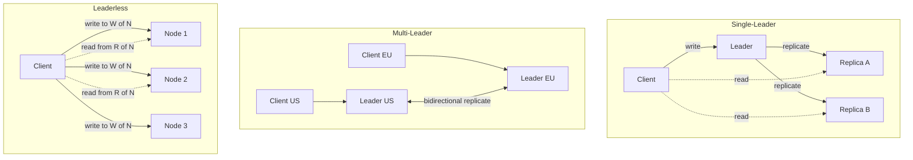
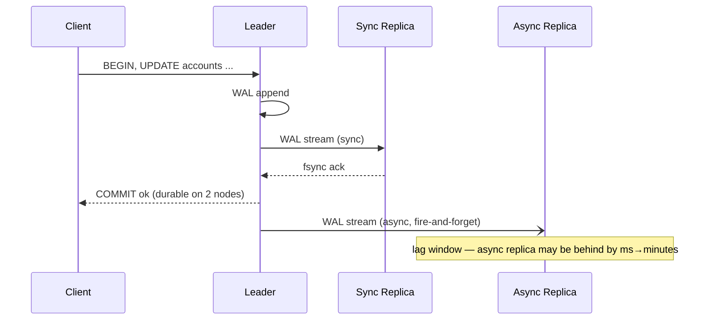
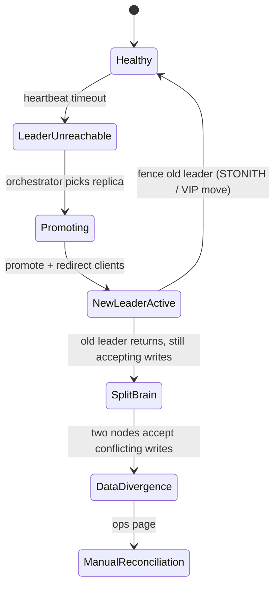
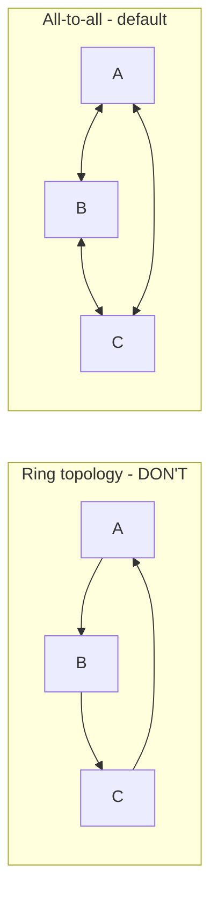

# Replication

## Why This Exists

**Problem.** A single database fails, gets saturated, or sits in the wrong region. You want copies — for fault tolerance, read throughput, and latency. The instant you have copies, you inherit the hardest problem in distributed systems: **keeping them consistent under failure**. Replication is where most distributed-systems pain originates: split-brain, lost updates, stale reads, "the dashboard shows yesterday's number," duplicate charges after failover.

**Key insight.** There are only three replication topologies — single-leader, multi-leader, leaderless — and the choice is **a contract about which failure modes you accept**, not a performance tuning knob. Single-leader trades availability for simplicity. Multi-leader trades consistency for write availability across regions. Leaderless trades familiar semantics for tunable, partition-tolerant operation. Pick the topology first, then the knobs (sync mode, quorum, conflict handler) within it.

**Reach for this when:**
- Designing the durability/availability tier of a new system.
- Diagnosing replication lag, stale reads, or "phantom" rows that appear and disappear.
- A failover went badly: data loss, duplicate primaries, "we promoted the wrong replica."
- Going multi-region and the latency budget no longer fits a single leader.
- Picking between Postgres streaming replication, Aurora, DynamoDB Global Tables, Cassandra, CockroachDB, Spanner.
- Conflict resolution is biting you (last-write-wins clobbered a user's edit).

**Don't reach for this when:**
- You actually need **partitioning/sharding** — splitting *different* data across nodes (see `../partitioning/`). Replication keeps the *same* data on multiple nodes.
- You need **distributed consensus on a single value** (config, leader election) — use a Raft/Paxos coordinator (etcd, ZooKeeper) directly; see `../consensus/`.
- You need exactly-once cross-system writes — that's a **distributed transactions / outbox** problem, not replication; see `../distributed-transactions/`.
- Single-node will do. Don't add replicas because "we might scale someday." A hot standby with WAL shipping is fine until it isn't.

---

## Diagrams

### The three topologies at a glance



### Single-leader sync vs async write path



### Failover and the split-brain risk



---

## Single-Leader Replication

**One node accepts writes; others stream the change log and serve reads.** This is Postgres streaming replication, MySQL binlog replication, MongoDB replica set, SQL Server Always On, Aurora (with a twist — storage-level replication). It's the default and you should justify *not* using it.

### How it actually works (Postgres model)

The leader writes a **Write-Ahead Log (WAL)**. Every change — insert, update, DDL — appends a record. Replicas connect, request WAL segments starting at their last replayed LSN (Log Sequence Number), and apply them.

```sql
-- On the leader: who's connected and how far behind?
SELECT
    application_name,
    client_addr,
    state,                      -- streaming, catchup, backup
    sync_state,                 -- sync, async, potential, quorum
    pg_wal_lsn_diff(pg_current_wal_lsn(), sent_lsn)   AS sent_lag_bytes,
    pg_wal_lsn_diff(pg_current_wal_lsn(), write_lsn)  AS write_lag_bytes,
    pg_wal_lsn_diff(pg_current_wal_lsn(), flush_lsn)  AS flush_lag_bytes,
    pg_wal_lsn_diff(pg_current_wal_lsn(), replay_lsn) AS replay_lag_bytes,
    write_lag, flush_lag, replay_lag
FROM pg_stat_replication;
```

The four LSNs map to four lag points: **sent → write (received) → flush (durable) → replay (visible to readers)**. `replay_lag` is what users experience. `flush_lag` is what governs durability on failover.

### Sync vs async — the real trade

```ini
# postgresql.conf on the leader
synchronous_commit = on            # off | local | remote_write | on | remote_apply
synchronous_standby_names = 'ANY 1 (replica_a, replica_b, replica_c)'
# 'ANY 1' = any one of three confirmed → quorum-style sync (added in PG 10)
# 'FIRST 2 (a, b, c)' = priority-ordered, first 2 must confirm
```

| `synchronous_commit` | Leader returns COMMIT after... | Loss on leader crash |
|---|---|---|
| `off` | WAL appended in memory | up to `wal_writer_delay` (200ms) of committed writes |
| `local` | leader fsync'd locally | nothing local; replicas may lag |
| `remote_write` | replica received WAL (not fsync'd) | committed write if replica also crashes simultaneously |
| `on` (default w/ standby) | replica fsync'd WAL | nothing — but blocks if replica is down |
| `remote_apply` | replica replayed WAL | nothing, and read-your-writes works on that replica |

**The trap:** `synchronous_commit = on` with one synchronous replica means **the leader stalls if the replica goes down**. You need ≥2 candidate sync replicas with `ANY 1` quorum, or the system trades availability for durability in an asymmetric way you didn't intend.

### Replication lag — what to measure, what to do

Three problems caused by lag, in order of how often they bite real systems:

1. **Read-your-writes (RYW).** User updates profile, navigates to profile page, sees stale data because the read hit a lagging replica.
2. **Monotonic reads.** Two consecutive reads return *older* data on the second call (different replica, behind the first).
3. **Consistent prefix.** Causally related writes appear out of order across replicas (rare in single-leader, common in sharded/multi-leader).

```python
# Pattern: route reads to the leader for a "stickiness window" after writes.
# This is what most ORMs and connection routers (PgBouncer, AWS RDS Proxy) bolt on.
import time

class ReplicationAwareRouter:
    LEADER_WINDOW_SECONDS = 5  # > p99 replication lag, < user attention span

    def __init__(self):
        self._user_last_write: dict[str, float] = {}  # in prod: Redis with TTL

    def on_write(self, user_id: str) -> None:
        self._user_last_write[user_id] = time.time()

    def pick_db(self, user_id: str) -> str:
        last = self._user_last_write.get(user_id, 0)
        if time.time() - last < self.LEADER_WINDOW_SECONDS:
            return "leader"      # read-your-writes: pin to leader
        return "replica"          # eventually consistent reads scale here
```

For stronger guarantees, pass the leader's WAL position back to the client and have the replica wait for that LSN before serving the read (Postgres `pg_wait_for_wal_lsn_replay`, MySQL GTID-based wait). This is **causal consistency via session tokens** — the same trick Spanner and Cosmos DB expose as "session consistency."

### Failover — where careers end

A failover protocol that doesn't address all four of these will eventually corrupt your data:

1. **Detection.** Heartbeat timeout — but tune it: too short flaps on GC pauses, too long extends MTTR. 10–30s is typical.
2. **Candidate selection.** Pick the replica with the highest `flush_lsn`. **Do not** pick on uptime or alphabetical name.
3. **Fencing the old leader.** STONITH (Shoot The Other Node In The Head). Reassign the VIP, revoke the security group, kill the EC2 instance. If the old leader can still accept writes after promotion, you have **split-brain**. This is the #1 cause of replication-related data loss.
4. **Client redirection.** DNS, VIP, service discovery, or proxy (HAProxy, PgBouncer, RDS Proxy, ProxySQL).

```yaml
# Patroni config — the de-facto Postgres HA orchestrator
# Patroni uses etcd/Consul/ZooKeeper for the consensus layer; that's what prevents
# split-brain. Don't roll your own failover script — you will get fencing wrong.
scope: prod-pg
namespace: /service/
name: pg-1

bootstrap:
  dcs:
    ttl: 30
    loop_wait: 10
    retry_timeout: 10
    maximum_lag_on_failover: 1048576   # bytes — refuse to promote a replica >1MB behind
    synchronous_mode: true              # at least one sync replica must ack commits
    synchronous_mode_strict: false      # don't degrade to async if no sync available
    postgresql:
      use_pg_rewind: true               # repair old leader by rewinding to divergence point
      parameters:
        synchronous_commit: "remote_apply"
        wal_level: replica
        max_wal_senders: 10
        max_replication_slots: 10

postgresql:
  data_dir: /var/lib/postgresql/data
  pg_hba:
    - host replication replicator 10.0.0.0/8 md5
```

The `maximum_lag_on_failover` knob is the explicit knob for **how much committed data you're willing to lose** during an unplanned failover. Set it deliberately. With `synchronous_mode: true` plus an async secondary, RPO ≈ 0 for planned failover and ≤ a few seconds for unplanned.

---

## Multi-Leader (Active-Active) Replication

**Two or more leaders accept writes; they replicate to each other.** Used for: multi-region active-active (CockroachDB, YugabyteDB, BDR, Cassandra-as-multi-master), offline-first apps (CouchDB, RxDB, ElectricSQL), and merging databases between corporate environments.

### Why anyone signs up for this

Single-leader across regions means writes pay a cross-region RTT (60–150ms US↔EU) on every commit. For a write-heavy workload that's untenable. Multi-leader lets every region commit locally and reconcile asynchronously. The cost: **conflicting concurrent writes**.

### Conflict resolution — the only thing that matters

Two leaders accept `UPDATE users SET name = ... WHERE id = 42` at the same wall-clock instant. When the writes meet, what wins?

**Strategy 1: Last-Write-Wins (LWW).** Compare timestamps; newer wins. Cassandra default. **Silently loses data** — the loser's write vanishes. Acceptable for telemetry, deadly for orders or balances.

```python
# LWW with Lamport timestamps — at least don't trust wall clocks
# Wall-clock LWW + clock skew = lost writes that can't be recovered.
@dataclass
class LWWRegister:
    value: Any
    ts: tuple[int, str]   # (logical clock, node id) — node id breaks ties

    def merge(self, other: "LWWRegister") -> "LWWRegister":
        return self if self.ts >= other.ts else other
```

**Strategy 2: Application-level merge.** Replication system surfaces both versions; your code decides. Riak does this with **siblings**; CouchDB exposes conflicts as multiple revisions. Right answer for shopping carts (union the items), wrong answer for "the user just saw one value and clicked a button based on it."

**Strategy 3: CRDTs (Conflict-free Replicated Data Types).** Mathematical structures whose merge is associative, commutative, idempotent — *concurrent updates always converge to the same state without coordination*. Real CRDTs in production: counters (Riak PN-Counter), sets (G-Set, OR-Set), maps (Automerge, Yjs for collaborative editing).

```python
# OR-Set (Observed-Remove Set) — adds and removes commute correctly.
# A naive set has a problem: if you concurrently add(x) and remove(x),
# which wins? OR-Set tags each add with a unique id; remove only removes
# the ids the remover has *observed*. Concurrent add wins.
class ORSet:
    def __init__(self):
        self.adds: set[tuple[Any, str]] = set()    # (element, unique tag)
        self.tombstones: set[tuple[Any, str]] = set()

    def add(self, x, node_id):
        tag = f"{node_id}:{uuid4()}"
        self.adds.add((x, tag))

    def remove(self, x):
        # Only removes (element, tag) pairs we've already seen — concurrent
        # adds with newer tags survive.
        for elt, tag in list(self.adds):
            if elt == x:
                self.tombstones.add((elt, tag))

    def values(self):
        return {x for (x, tag) in self.adds if (x, tag) not in self.tombstones}

    def merge(self, other: "ORSet") -> "ORSet":
        out = ORSet()
        out.adds = self.adds | other.adds
        out.tombstones = self.tombstones | other.tombstones
        return out
```

**Strategy 4: Avoid conflicts by partitioning the write space.** Each region owns specific user IDs / tenant IDs / shard ranges. Writes outside your region forward to the owner. This is what most "multi-leader" production systems actually do — they're really single-leader-per-shard with cross-region replicas. Examples: Vitess, Citus, DynamoDB Global Tables (per-item LWW with last-writer-wins per attribute, but apps shard writes regionally).

### Topology: don't build a ring



**Ring/star topologies have a single point of failure** — one node down breaks the chain. All-to-all is what MySQL Group Replication, Postgres BDR, and CockroachDB use. The cost is O(N²) connections; fine up to ~10 nodes, painful past that.

---

## Leaderless Replication (Dynamo-style)

**No leader. Clients (or a coordinator) write to multiple replicas in parallel; reads query multiple replicas and reconcile.** Cassandra, Riak, ScyllaDB, Voldemort, original Amazon Dynamo paper.

### The quorum math

Given replication factor **N**, write quorum **W**, read quorum **R**:

- **W + R > N** ⇒ every read overlaps with the latest write quorum ⇒ **strong-ish consistency** (still subject to clock skew, sloppy quorums, and partition edge cases).
- **W + R ≤ N** ⇒ reads may miss recent writes ⇒ eventual consistency.

Common settings for `N = 3`:

| W | R | Property | Use case |
|---|---|---|---|
| 3 | 1 | Read-optimized strong | Read-heavy with rare writes |
| 1 | 3 | Write-optimized strong | Telemetry ingest, audit logs |
| 2 | 2 | Balanced strong (W+R=4>3) | General purpose default |
| 1 | 1 | Eventual, fastest | Caches, idempotent counters |
| 3 | 3 | All-replicas — refuses writes if any node down | Don't do this |

```cql
-- Cassandra: consistency is per-query, not per-table.
-- LOCAL_QUORUM = quorum within the local datacenter (avoids cross-region RTT)
-- EACH_QUORUM = quorum in EVERY datacenter (multi-region strong)
INSERT INTO orders (id, customer, amount) VALUES (?, ?, ?)
    USING CONSISTENCY LOCAL_QUORUM;

SELECT * FROM orders WHERE id = ?
    USING CONSISTENCY LOCAL_QUORUM;
```

### Anti-entropy: read repair and hinted handoff

Quorums alone don't keep replicas in sync. Two background mechanisms do:

1. **Read repair.** When a read sees divergent values across replicas, the coordinator writes the latest value back to the stale replicas. Cheap, runs on the read path, only fixes data that gets read.
2. **Hinted handoff.** When a write target is down, the coordinator stores a "hint" and replays it when the target returns. Bounded by hint TTL — past TTL, the hint is dropped and you rely on full anti-entropy (Merkle-tree repair, e.g. Cassandra `nodetool repair`).
3. **Active anti-entropy / Merkle tree repair.** Periodic background sync that detects and fixes drift on cold data. **Must be scheduled** — silent corruption otherwise.

### Sloppy quorums and the consistency lie

Dynamo-style systems implement **sloppy quorums by default**: if the "home" replicas for a key are unavailable, the write goes to *any* W reachable nodes, with hinted handoff for later replay. This means **W+R>N does not guarantee strong consistency under partition** — your write went to nodes that aren't even in the read quorum's home set.

Riak exposes this as `pw` (primary write) vs `w` (any write). Cassandra's `LOCAL_QUORUM` plus a DC partition can serve stale reads. **Read the docs for the exact knobs; the defaults trade consistency for availability.**

```python
# Pseudocode: leaderless write with sloppy quorum
def write(key, value, n=3, w=2):
    home_replicas = ring.replicas_for(key, n)
    targets = [r for r in home_replicas if r.alive]
    fallbacks = ring.next_alive(n - len(targets), exclude=home_replicas)
    targets += fallbacks  # sloppy: fallbacks aren't in the read set!

    acks = parallel_send(targets, value, timeout=W_TIMEOUT)
    if len(acks) < w:
        raise WriteFailure("quorum not reached")

    # Schedule hinted handoff for fallback nodes to replay to home replicas later
    for fb in fallbacks:
        schedule_hint_replay(fb, home_replicas)
    return ok
```

---

## Trade-offs

| Benefit | Cost |
|---|---|
| Single-leader: simple semantics, easy mental model, mature tooling (Patroni, Orchestrator) | Single point of write failure; cross-region writes pay full RTT; failover window of seconds-to-minutes; sync replication couples leader availability to replica availability |
| Single-leader async: fast commits, replicas can scale reads | RPO > 0 — committed-on-leader writes can be lost on crash; replication lag breaks read-your-writes |
| Single-leader sync: zero data loss on planned failover | Leader stalls if sync replica is unreachable (use `ANY n` quorum, not single named replica) |
| Multi-leader: low-latency local writes in every region; survives region outage | Conflict resolution is your problem; LWW silently loses data; CRDT design constrains your data model; debugging "why does this row keep flipping" is brutal |
| Leaderless: highly available, no failover ceremony, tunable per query | Quorum math doesn't give you what you think under partition (sloppy quorum); requires anti-entropy ops discipline; secondary indexes and transactions are weak/absent |
| All replication: more read capacity, geographic distribution | Replication lag; doubled-to-N×'d storage cost; lag monitoring and alerting must be part of your operational baseline |
| All replication: durability via redundancy | Replication is **not a backup** — `DELETE FROM users` replicates faithfully; you still need PITR backups |

---

## Common Pitfalls

- **Treating replicas as backups.** A logical corruption — bad migration, accidental `UPDATE` without `WHERE` — replicates instantly to every replica. Backups are independent (PITR, snapshots, off-cluster). Replication is for availability, backups are for recovery from logical errors. They are not substitutes.

- **Async sync surprise.** `synchronous_commit = on` in Postgres with a single named sync replica means a replica outage halts the leader. Use `ANY n (...)` quorum syntax, or accept the asymmetric availability.

- **Failover without fencing.** Promoting a new leader without killing the old one's network/VIP/role causes split-brain. **Always fence first.** Patroni, RDS, Aurora, Cloud SQL all do this; hand-rolled scripts often don't.

- **Falling-back-to-async during incidents.** Some HA tools auto-degrade `synchronous_mode` to async to maintain availability when sync replicas die. This silently changes your durability contract during the worst possible moment. Use `synchronous_mode_strict` or equivalent if RPO=0 is non-negotiable.

- **Read-your-writes broken after introducing a read replica.** Devs assume read-after-write consistency from a single DB; the moment you add a replica, this breaks. Either pin recent-writers to the leader, use causal tokens, or document loudly.

- **Trusting wall-clock timestamps for LWW conflict resolution.** A 30-second clock skew between two leaders means one region's writes get clobbered by the other's stale-but-future-timestamped writes. Use logical clocks (Lamport, Hybrid Logical Clocks) — Cassandra, CockroachDB, MongoDB all do.

- **Quorum thinking under sloppy quorum.** Dynamo-style systems' default behavior under partition violates the W+R>N guarantee. Strict quorum (Riak `pw`, Cassandra `EACH_QUORUM`) is opt-in.

- **Skipping `nodetool repair` (or equivalent).** Cassandra/Scylla require periodic anti-entropy repair, especially before `gc_grace_seconds` to prevent zombie tombstones (deleted data resurrecting). Skipping repair means silent data corruption builds up over months.

- **Cross-region replica used as a hot region.** People put a read replica in `us-west` and have `us-west` clients read from it. Lag is now visible to users — and they're usually the users least tolerant of staleness. Either replicate writes too, or accept that the replica is for DR, not for serving traffic.

- **Logical replication ≠ physical replication.** Postgres logical replication (publish/subscribe) is for selective replication, schema flexibility, version-mixed pairs. It does **not** replicate DDL, sequences, large objects, or truncates — by default. People use it for HA and discover what it doesn't replicate during a cutover.


- **Replication slots eating disk.** Postgres replication slots prevent WAL recycling until replicas consume them. A disconnected replica with an active slot fills the leader's disk and crashes the cluster. Always set `max_slot_wal_keep_size` (PG 13+) as a safety net.

---

## Decision Table

| Situation | Choose | Why not the others |
|---|---|---|
| OLTP web app, single region, <10k writes/s | **Single-leader async** + 1–2 read replicas + PITR backups | Multi-leader is overkill; leaderless gives up SQL features you'll want |
| Financial ledger, must not lose committed writes | **Single-leader with sync quorum** (`ANY 1` of 2+ replicas) | Async loses RPO; multi-leader has conflict semantics you can't reason about for money |
| Multi-region, write latency budget < cross-region RTT | **Multi-leader** with per-region shard ownership, OR **CockroachDB/Spanner** (paxos-per-range) | Single-leader pays RTT on every write; leaderless with EACH_QUORUM does too |
| Mobile/offline-first app | **Multi-leader (CRDT)** — CouchDB/PouchDB, Automerge, Yjs | No leader exists when offline; LWW eats user edits |
| Time-series ingest, high write throughput, OK with eventual reads | **Leaderless** (Cassandra, Scylla) with W=1, R=ALL or W=QUORUM, R=QUORUM | Single-leader bottlenecks on write; multi-leader conflict handling unnecessary |
| Globally consistent reads across regions, willing to pay for it | **Spanner / CockroachDB / YugabyteDB** (paxos-per-range, true-time or HLC) | Multi-leader can't give you globally serializable; leaderless can't either |
| Read-heavy, tolerates staleness | Single-leader + many async replicas | Multi-leader/leaderless solve a write problem you don't have |
| Active-active across two datacenters with low conflict rate (e.g. partitioned-by-tenant) | **Multi-leader** (BDR, MySQL GR, Vitess) | Single-leader implies a "primary" datacenter — DR cutover is harder |
| Need failover in <30s, automated | **Patroni / RDS Multi-AZ / Aurora / Cloud SQL HA** | Manual failover is too slow; rolling your own gets fencing wrong |
| Need 99.999% write availability, willing to give up linearizability | **Leaderless** (Riak, Cassandra) — no failover ceremony | Single-leader has a failover window; multi-leader has split-brain risk during partition |

---

## References

- Kleppmann, Martin — *Designing Data-Intensive Applications*, **ch. 5 "Replication"** (single-leader, multi-leader, leaderless, lag, quorum, conflict resolution). The canonical reference. Also ch. 9 "Consistency and Consensus" for linearizability/causality interactions.
- DeCandia et al. — *Dynamo: Amazon's Highly Available Key-value Store* (SOSP 2007) — https://www.allthingsdistributed.com/files/amazon-dynamo-sosp2007.pdf
- Lakshman & Malik — *Cassandra: A Decentralized Structured Storage System* — https://www.cs.cornell.edu/projects/ladis2009/papers/lakshman-ladis2009.pdf
- Shapiro et al. — *A Comprehensive Study of Convergent and Commutative Replicated Data Types* (INRIA RR-7506, 2011) — https://hal.inria.fr/inria-00555588/document
- Corbett et al. — *Spanner: Google's Globally-Distributed Database* (OSDI 2012) — https://research.google/pubs/pub39966/
- PostgreSQL Documentation — *High Availability, Load Balancing, and Replication* — https://www.postgresql.org/docs/current/high-availability.html
- PostgreSQL Documentation — *Synchronous Replication* — https://www.postgresql.org/docs/current/warm-standby.html#SYNCHRONOUS-REPLICATION
- Patroni Documentation — *Replication modes* — https://patroni.readthedocs.io/en/latest/replication_modes.html
- Apache Cassandra — *Tunable Consistency* — https://cassandra.apache.org/doc/latest/cassandra/architecture/dynamo.html
- Riak Docs — *Replication and Eventual Consistency* — https://docs.riak.com/riak/kv/latest/learn/concepts/replication/
- AWS Builders' Library — *Caching challenges and strategies* (replication-adjacent staleness reasoning) — https://aws.amazon.com/builders-library/caching-challenges-and-strategies/
- AWS Builders' Library — *Amazon's approach to high-availability deployment* — https://aws.amazon.com/builders-library/
- Google SRE Book — *Managing Critical State: Distributed Consensus for Reliability*, ch. 23 — https://sre.google/sre-book/managing-critical-state/
- Pat Helland — *Life Beyond Distributed Transactions: An Apostate's Opinion* — https://queue.acm.org/detail.cfm?id=3025012
- Pat Helland — *Immutability Changes Everything* — https://queue.acm.org/detail.cfm?id=2884038
- Brewer, Eric — *CAP Twelve Years Later: How the "Rules" Have Changed* — https://www.infoq.com/articles/cap-twelve-years-later-how-the-rules-have-changed/
- Kleppmann, Martin — *Please stop calling databases CP or AP* (blog) — https://martin.kleppmann.com/2015/05/11/please-stop-calling-databases-cp-or-ap.html
- Jepsen — analyses of replication correctness in real systems (Cassandra, MongoDB, Aurora, CockroachDB, etc.) — https://jepsen.io/analyses
- Adrian Colyer / The Morning Paper — *CRDTs: Consistency without concurrency control* — https://blog.acolyer.org/2015/05/06/crdts-consistency-without-concurrency-control/

---

## See Also

- `../partitioning/` — sharding the same data across nodes (orthogonal to replication; almost always combined)
- `../consensus/` — Raft/Paxos for the coordination layer underneath HA orchestrators (Patroni's etcd, Aurora's underlying log)
- `../distributed-transactions/` — distributed transactions, 2PC, sagas; what replication is *not*
- `../consistency-models/` — linearizability, causal, eventual; the formal vocabulary for what each topology gives you
- `../cap-pacelc/` — the trade-off framework (and why CAP alone is too coarse to design with)
- `../cdc/` — using the replication log (WAL/binlog) as an event stream for downstream systems
- `../../performance/caching/` — replicas as a cache tier; staleness is replication lag in disguise
