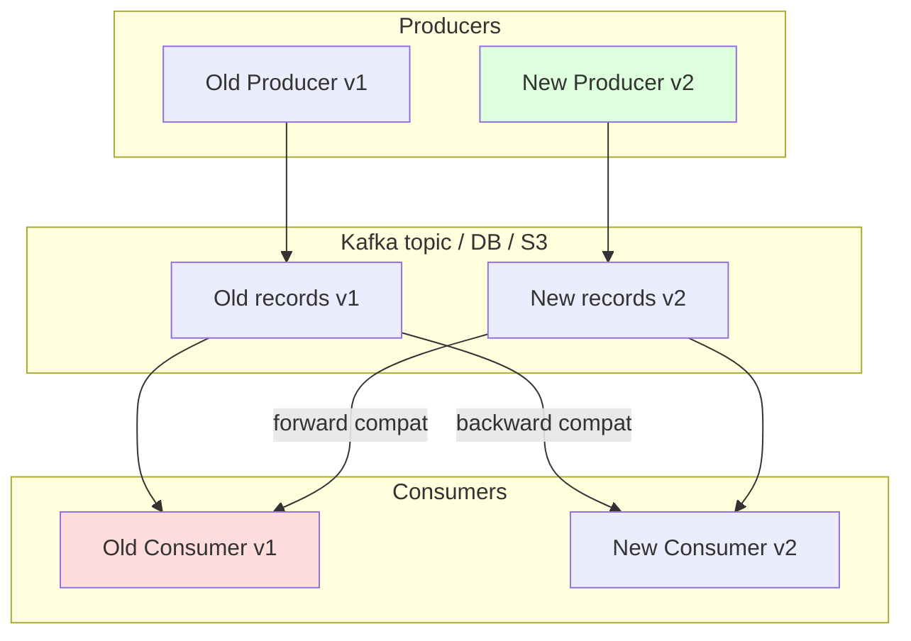
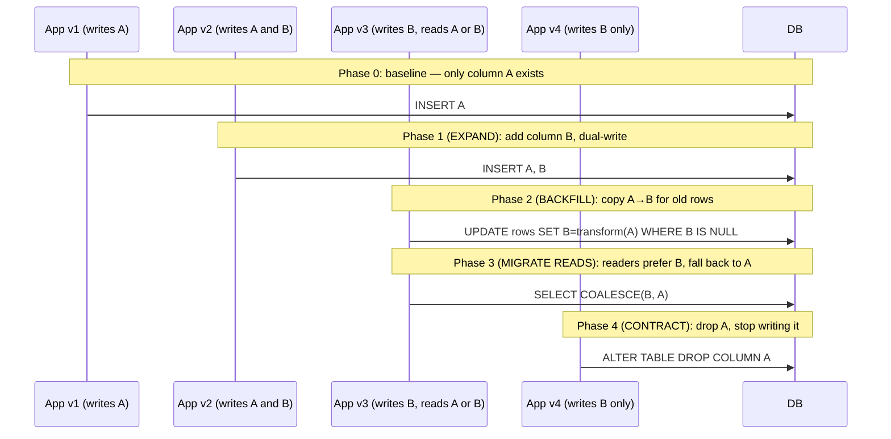
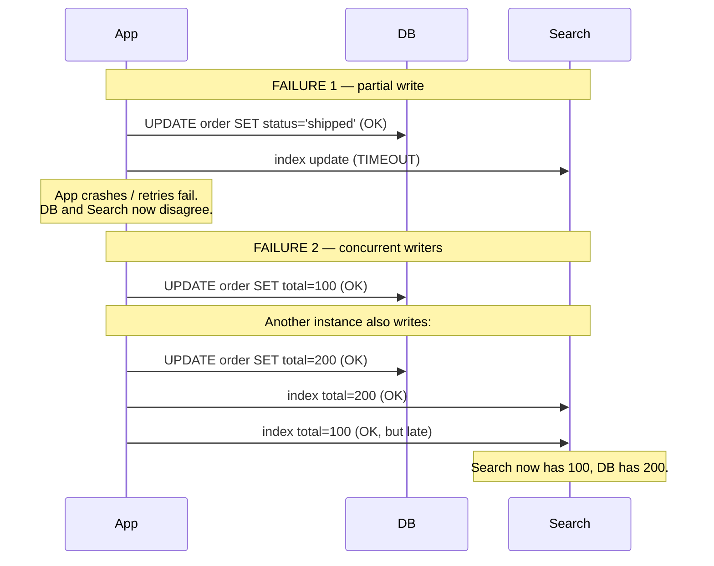

# Schema Evolution

## Why This Exists

**The problem.** Code and data have different lifetimes. You can deploy a new application version in minutes; the records it produced last year still sit in S3, Kafka topics, MySQL tables, and DynamoDB items. Worse, during a rolling deploy, **old code and new code run simultaneously** against the same data store. The moment you change a schema, you have a four-way compatibility matrix: old writers, new writers, old readers, new readers — and every combination must work.

This is the central thesis of **DDIA chapter 4 ("Encoding and Evolution")**: in any system that survives more than one deploy, schema changes must be **rolling-upgrade safe**. There is no "stop the world and migrate" in a real production system above a few thousand QPS.

**Key insight.** Compatibility is a directional property, not a binary one:

- **Backward compatibility** — *new code can read old data*. This is the easy direction; readers default missing fields and ignore unknown ones.
- **Forward compatibility** — *old code can read new data*. This is the hard direction and the one that breaks during canary deploys: the v2 producer ships first, the v1 consumer can't parse the new field.
- **Full compatibility** — both directions hold. Required when you can't control deploy order (e.g. mobile clients, third-party consumers).

The encoding format dictates which compatibility you get for free. Avro, Protobuf, and JSON Schema all support evolution but with **very different rules**. Picking the wrong format means every schema change becomes a coordinated multi-team release.

**Reach for this when:**
- Adding/removing/renaming a field in a Kafka event, gRPC message, or REST payload.
- Running an `ALTER TABLE` on a production OLTP database with non-trivial traffic.
- Splitting a column, changing a type, or moving data between two stores.
- Designing a new event-driven system and choosing a serialization format.
- Debugging "consumer group lag spike after deploy" or "deserialization error in DLQ".

**Don't reach for this when:**
- The schema is internal to a single process and never crosses a network or persistence boundary — just refactor the struct.
- You control all readers and writers and can stop-the-world deploy (small batch jobs, dev tools).
- You're choosing between SQL vs NoSQL — that's a data-modeling question, not an evolution question.

## Diagrams

The four-quadrant compatibility matrix during a rolling deploy:



The expand/contract migration over time — the only safe way to rename or retype a field:



## Compatibility Rules by Format

The rules below are **not interchangeable**. Confusing Protobuf rules with Avro rules is one of the most common production schema-evolution bugs.

### Avro

Avro is the **schema-registry-native** format. Every record is written with a writer schema and read with a reader schema; the registry resolves them. Avro shines for analytics pipelines (Kafka + Confluent Schema Registry, Hadoop, Spark).

**Rules for full compatibility (both backward and forward):**

| Change | Backward | Forward | Notes |
|---|---|---|---|
| Add a field with default | Yes | Yes | The default value is the cornerstone — required. |
| Add a field without default | No | Yes | Old readers can't construct a value. Ban this. |
| Remove a field with default | Yes | No | New readers default it; old writers may still emit it. |
| Remove a field without default | No | No | Forbidden in any rolling deploy. |
| Rename via aliases | Yes | Yes | Use the `aliases` field — the only safe rename. |
| Change int → long | Yes | No | Promotion is one-way. |
| Change required → optional (union with null) | Yes | No | Forward-incompatible. |
| Reorder fields | Yes | Yes | Avro matches by name, not position. |

```json
{
  "type": "record",
  "name": "Order",
  "namespace": "com.shop.events",
  "fields": [
    {"name": "order_id", "type": "string"},
    {"name": "amount_cents", "type": "long"},
    {
      "name": "currency",
      "type": "string",
      "default": "USD",
      "doc": "Added in v2 — default makes this backward AND forward compatible."
    },
    {
      "name": "customer_email",
      "aliases": ["email"],
      "type": ["null", "string"],
      "default": null,
      "doc": "Renamed from 'email' in v3. Aliases let old writers' field name resolve correctly."
    }
  ]
}
```

Configure the registry in `FULL_TRANSITIVE` mode if you cannot control consumer deploy order:

```bash
curl -X PUT http://schema-registry:8081/config/orders-value \
  -H "Content-Type: application/vnd.schemaregistry.v1+json" \
  -d '{"compatibility": "FULL_TRANSITIVE"}'
```

`FULL_TRANSITIVE` means the new schema must be compatible with **every** historical version, not just the previous one. This is what you want for long-lived Kafka topics where consumers may lag by days.

### Protobuf

Protobuf is wire-format-stable: every field has a numeric tag, and unknown tags are preserved (proto3) or skipped (proto2). The format favors **append-only evolution**.

**Rules:**

- Fields are identified by **tag number**, never by name. Renaming a field is free; reusing a tag is **catastrophic**.
- Never reuse a removed tag. Use `reserved` to enforce this at compile time.
- All proto3 scalar fields are implicitly optional with zero-value defaults — you cannot distinguish "set to 0" from "not set" without `optional` (re-added in proto3.15) or wrapper types.
- Changing tag types (int32 ↔ int64, sint32 ↔ sint64) is mostly safe; int32 ↔ uint32 is **not** (negative values get reinterpreted).
- Adding/removing a field from a `oneof` is a wire-incompatible change.

```proto
syntax = "proto3";
package com.shop.events.v1;

message Order {
  string order_id = 1;
  int64 amount_cents = 2;

  // Removed in v3 — never reuse tag 3 or name 'email'.
  reserved 3;
  reserved "email";

  // Added in v2. Old consumers will see zero-value "" for missing currency.
  // If you need to distinguish "unset" from "USD", use 'optional' or a wrapper.
  string currency = 4;

  // Use 'optional' when zero-value ambiguity matters (proto3.15+).
  optional string customer_email = 5;
}
```

### JSON Schema

JSON Schema is dominant for HTTP APIs (OpenAPI references it) and for the increasing number of "JSON in Kafka" deployments. It's the **least opinionated** about evolution — which means **you** must enforce the rules.

- Adding an optional field (not in `required`) is backward-compatible.
- Adding a required field is breaking. Period.
- Tightening a constraint (`maxLength`, `pattern`, `enum` removal) is breaking even if the field name doesn't change.
- Loosening a constraint (adding to `enum`, raising `maxLength`) is forward-incompatible — old validators will reject new values.
- `additionalProperties: false` makes the schema rigid; flipping it to `true` is one-way.

A robust JSON Schema convention for evolvable events:

```json
{
  "$schema": "https://json-schema.org/draft/2020-12/schema",
  "$id": "https://schemas.shop.com/events/order/v2.json",
  "type": "object",
  "required": ["order_id", "amount_cents", "schema_version"],
  "additionalProperties": true,
  "properties": {
    "schema_version": {"const": 2},
    "order_id": {"type": "string", "format": "uuid"},
    "amount_cents": {"type": "integer", "minimum": 0},
    "currency": {"type": "string", "default": "USD", "pattern": "^[A-Z]{3}$"},
    "customer_email": {"type": ["string", "null"], "format": "email"}
  }
}
```

Two non-obvious rules:

1. **`additionalProperties: true`** is the JSON-Schema equivalent of Protobuf's "preserve unknown fields". Old consumers must not crash on new fields they don't recognize. Default to `true` for events, `false` only for tightly-controlled internal contracts.
2. **Embed `schema_version`** in the payload. JSON Schema has no wire-format equivalent of Avro's writer-schema ID; the version field is the only reliable way for a consumer to dispatch.

## The Expand/Contract Pattern (Parallel Change)

This is the canonical migration pattern for any change that isn't strictly additive. Martin Fowler calls it **Parallel Change**; the database community calls it **expand/contract**. Either way, it's six phases — never fewer.

```sql
-- Goal: rename column `email` to `customer_email` AND change it from VARCHAR(255) to TEXT.
-- This is a TYPE-AND-NAME change, the worst kind. We must not lose writes during the migration.

-- ============================================================
-- PHASE 1: EXPAND — add the new column. No reads or writes yet.
-- ============================================================
ALTER TABLE customers ADD COLUMN customer_email TEXT;
-- For Postgres 11+ this is metadata-only and instant.
-- For MySQL, use pt-online-schema-change or gh-ost (see "Online Schema Changes" below).

-- ============================================================
-- PHASE 2: DUAL-WRITE — application writes both columns.
-- Deploy app v2 here. v1 still writes only 'email' and that's fine.
-- ============================================================
-- App code (pseudo-Python):
--   def save(c):
--       db.execute("UPDATE customers SET email = %s, customer_email = %s WHERE id = %s",
--                  c.email, c.email, c.id)

-- ============================================================
-- PHASE 3: BACKFILL — copy historical rows in chunks.
-- Never `UPDATE customers SET customer_email = email` in one transaction;
-- it locks the table and bloats WAL/redo log.
-- ============================================================
DO $$
DECLARE last_id BIGINT := 0;
BEGIN
  LOOP
    WITH batch AS (
      SELECT id FROM customers
      WHERE id > last_id AND customer_email IS NULL
      ORDER BY id LIMIT 5000
    )
    UPDATE customers c
       SET customer_email = c.email
      FROM batch b
     WHERE c.id = b.id;
    GET DIAGNOSTICS last_id = ROW_COUNT;
    EXIT WHEN last_id = 0;
    PERFORM pg_sleep(0.1);  -- Throttle to avoid replication lag.
  END LOOP;
END $$;

-- ============================================================
-- PHASE 4: MIGRATE READS — readers prefer new column, fall back to old.
-- Deploy app v3 here.
-- ============================================================
-- SELECT COALESCE(customer_email, email) FROM customers WHERE id = $1;

-- ============================================================
-- PHASE 5: STOP DUAL-WRITE — only after ALL readers are on v3.
-- Wait at least one full deploy cycle + canary bake time.
-- Deploy app v4: writes only customer_email.
-- ============================================================

-- ============================================================
-- PHASE 6: CONTRACT — drop the old column.
-- WAIT 1+ days. This is irreversible without a restore.
-- ============================================================
ALTER TABLE customers DROP COLUMN email;
```

The temptation to skip phases is enormous. **Don't.** Every skipped phase trades a few hours of dev time for a multi-hour outage when something goes wrong. The pattern works because at every step, **rollback is a single deploy**, not a data restore.

## Online Schema Changes for OLTP

A naive `ALTER TABLE` on a busy MySQL or Postgres table holds an **ACCESS EXCLUSIVE / metadata lock**, blocking all queries. The three industrial-strength tools:

| Tool | Database | Mechanism | When to use |
|---|---|---|---|
| `pt-online-schema-change` (Percona) | MySQL | Creates shadow table, copies rows in chunks, syncs writes via triggers, atomic rename | Default choice for MySQL; mature, predictable |
| `gh-ost` (GitHub) | MySQL | Reads binlog instead of triggers; "triggerless" | Heavy-write workloads where triggers would cause lock contention; throttles via replication lag |
| `pg_repack` | Postgres | Creates shadow table, replays via trigger queue, atomic swap | Removing bloat or running a non-instant ALTER on Postgres < 11 |

Modern Postgres (11+) has made many ALTERs metadata-only:

| Operation | Postgres < 11 | Postgres 11+ |
|---|---|---|
| `ADD COLUMN` (no default) | Instant | Instant |
| `ADD COLUMN ... DEFAULT <const>` | Full table rewrite | **Instant** (default stored in catalog) |
| `ADD COLUMN ... DEFAULT <volatile>` | Full table rewrite | Full table rewrite |
| `DROP COLUMN` | Instant (logical only) | Instant |
| `ALTER COLUMN TYPE` (compatible) | Full rewrite | Full rewrite (use `pg_repack` or expand/contract) |
| `CREATE INDEX` | Locks writes | Use `CREATE INDEX CONCURRENTLY` |

A safe `gh-ost` invocation for a production rename:

```bash
gh-ost \
  --max-load='Threads_running=25' \
  --critical-load='Threads_running=1000' \
  --chunk-size=1000 \
  --max-lag-millis=1500 \
  --user="ghost" \
  --host=mysql-replica.internal \
  --database="shop" \
  --table="customers" \
  --alter="ADD COLUMN customer_email TEXT" \
  --switch-to-rbr \
  --allow-on-master \
  --cut-over=default \
  --exact-rowcount \
  --concurrent-rowcount \
  --default-retries=120 \
  --postpone-cut-over-flag-file=/tmp/ghost.postpone \
  --execute
```

Two flags that have saved many production databases:

- `--max-lag-millis` — `gh-ost` throttles when replication lag exceeds this. Without it, a long migration silently breaks read-replica freshness.
- `--postpone-cut-over-flag-file` — finishes the row copy but waits for a human to remove the flag before the atomic rename. Use this to schedule the lock-taking step for a low-traffic window.

## The Dual-Write Problem

Whenever you write to two systems (DB + cache, DB + search index, primary table + projection table, two databases), **you cannot atomically write to both**. The classic failure modes:



**The only correct solutions** are well-known and all involve a single source of truth:

1. **Outbox pattern.** Write the change and an outbox row in the same DB transaction. A separate process tails the outbox (or DB CDC log) and publishes to Kafka / search / cache. Order is preserved by the log; the DB is the single source of truth.
2. **Change Data Capture (CDC).** Run Debezium / AWS DMS / Postgres logical replication against the WAL. Downstream systems are derived; if they fall over, replay from the log. This is what DDIA chapter 11 ("Stream Processing") calls "the database inside out".
3. **Single-leader writes with idempotent followers.** All writes go through one service that produces an event stream; downstream stores subscribe and apply idempotently. Failure modes shrink to "downstream is stale", which is recoverable.

What **does not** work, despite many production systems trying:

- "Just retry the second write." — doesn't help if the app crashes between writes.
- "Use distributed transactions / 2PC across DB and Kafka." — Kafka doesn't support XA; even where 2PC works (Postgres + Postgres), it adds a coordinator failure mode that's worse than the original problem.
- "Write to a queue first, then to DB." — now the queue is your source of truth and you've inverted the problem. Sometimes correct, but be honest about it.

A minimal outbox in Postgres + an idempotent relay:

```sql
-- One table, two transactional writes.
BEGIN;
  UPDATE orders SET status = 'shipped' WHERE id = $1;
  INSERT INTO outbox (id, aggregate_id, event_type, payload, created_at)
  VALUES (gen_random_uuid(), $1, 'OrderShipped',
          jsonb_build_object('order_id', $1, 'shipped_at', now()),
          now());
COMMIT;
```

```python
# Relay: at-least-once delivery to Kafka. Downstream MUST be idempotent.
def relay():
    while True:
        with conn.transaction():
            rows = conn.execute("""
                SELECT id, payload FROM outbox
                WHERE published_at IS NULL
                ORDER BY created_at
                LIMIT 500
                FOR UPDATE SKIP LOCKED
            """).fetchall()
            for row in rows:
                # Use row.id as the Kafka message key + idempotency key.
                # Producer must be idempotent (enable.idempotence=true).
                producer.send("orders.events", key=row.id, value=row.payload)
            producer.flush()
            conn.execute("UPDATE outbox SET published_at = now() WHERE id = ANY(%s)",
                         [r.id for r in rows])
```

The pattern's correctness rests on three properties: (1) the outbox row and the business write are in the same DB transaction, (2) `FOR UPDATE SKIP LOCKED` lets multiple relay workers run safely, (3) Kafka idempotent producer + consumer dedup-by-id closes the at-least-once → effectively-once gap.

## Trade-offs

| Benefit | Cost |
|---|---|
| Avro + Schema Registry catches incompatible changes at CI time | Requires registry infra; debugging without the schema is painful (binary blob) |
| Protobuf is the most wire-efficient and language-neutral | Tag-number discipline must be human-enforced; no built-in registry |
| JSON Schema works with any HTTP stack | Compatibility rules are advisory only; you must build the enforcement |
| Expand/contract guarantees rollback at every phase | Drags simple renames into multi-week, multi-deploy projects |
| Online schema change tools avoid downtime | Doubles disk I/O and storage during the migration; can fall behind on hot tables |
| Outbox pattern eliminates dual-write inconsistency | Adds a relay process and at-least-once semantics that downstream must handle |
| `FULL_TRANSITIVE` compatibility lets consumers lag for days | Severely restricts what schema changes you can make over time |
| Embedding `schema_version` in JSON payloads is foolproof | Couples the payload to a versioning scheme; harder to migrate later |

## Common Pitfalls

- **Adding a required field to an Avro schema with no default** — passes a naive registry check, breaks every consumer that tries to read old records. Always add fields with defaults, even if "every record will have this going forward".
- **Reusing a Protobuf tag number after removing a field** — old data with the old field still exists; the new field of a different type will be misinterpreted. Always `reserved` removed tags by both number AND name.
- **Renaming a column in one deploy.** This is the textbook example of skipping expand/contract. The moment v2 is rolled out and v1 is still running, v1 starts erroring out on every write. The "fix" is usually a panicked rollback that creates an even worse split-brain.
- **Backfilling in a single transaction.** A `UPDATE customers SET customer_email = email` on a 50M-row table holds a lock for the duration of the update, generates 50M-row WAL, and explodes replication lag. Always chunk + throttle.
- **`ALTER TABLE ... ADD COLUMN ... DEFAULT now()` on Postgres < 11** — `now()` is volatile, so this rewrites the entire table. Use a constant default + a separate backfill, or upgrade Postgres.
- **Trusting `pt-online-schema-change` on a table with foreign keys** — the tool has well-documented FK edge cases (`--alter-foreign-keys-method`); read the docs, test in staging, never `auto`.
- **`gh-ost` cut-over during peak load.** Even though gh-ost is non-blocking during the copy, the cut-over briefly takes a metadata lock. Use `--postpone-cut-over-flag-file` and trigger the cut-over in a low-traffic window.
- **Dual-writing to DB + Elasticsearch with two clients in app code** — when ES is down, you choose between dropping writes (data loss) and blocking writes (availability loss). Outbox-then-relay is the only sane path.
- **Removing a `oneof` member in Protobuf** — silently changes wire encoding. Equivalent to changing field types.
- **Schema-registry compatibility set to `BACKWARD` only** — protects new consumers from old data, but a v2 producer can ship a record that crashes a still-running v1 consumer during the deploy. Use `FULL` or `FULL_TRANSITIVE` for any topic with independent producers and consumers.
- **JSON `"additionalProperties": false`** then adding a field — every existing strict validator now rejects new payloads. Default to `true` for events.
- **Using a database trigger to "keep two columns in sync" forever.** Triggers are fine for the duration of an expand/contract, terrible as permanent infrastructure — they hide writes, complicate replication, and break under bulk loads.

## Decision Table

| Situation | Use this | Not this | Why |
|---|---|---|---|
| Kafka topic, multiple teams produce/consume | Avro + Schema Registry, `FULL_TRANSITIVE` | JSON without versioning | Registry catches breaking changes at CI; `FULL_TRANSITIVE` survives long consumer lag |
| gRPC microservice contract | Protobuf with strict tag discipline + `reserved` | Protobuf without `reserved`, JSON-RPC | Wire format is tag-stable; gRPC tooling is Protobuf-first |
| Public REST API | JSON Schema with `additionalProperties: true`, versioned URL/header | Avro/Protobuf | Browsers and 3rd-party clients can't be forced onto binary formats |
| Internal event between two services you own | Protobuf, `FULL` compatibility | Avro registry overhead | Lighter ops if you already use gRPC |
| Adding a non-nullable column to a hot OLTP table | Add nullable + backfill in chunks + set NOT NULL after | `ALTER TABLE ADD COLUMN x NOT NULL DEFAULT y` | Avoids long lock + WAL explosion |
| Renaming a column on a production table | Expand/contract over multiple deploys | `ALTER TABLE RENAME COLUMN` | Old code keeps running during rolling deploy |
| Changing column type (VARCHAR → TEXT) on MySQL | gh-ost or pt-osc | `ALTER TABLE ... MODIFY` | Native ALTER takes metadata lock and rewrites table |
| Need DB write + Kafka publish to be atomic | Outbox pattern + CDC relay | Two clients in app code | Outbox is the only at-least-once-correct pattern without 2PC |
| Need DB + search index in sync | Debezium/CDC → search | Dual-write from app | Same reason; CDC makes search a derived view |
| Schema change in a small batch job (no live traffic) | Just do the ALTER | Expand/contract | Don't pay the complexity if you control the world |
| Mobile clients in the field for years | JSON + version field + server-side translation | Strict Avro/Protobuf | You can't force a client upgrade; server must speak old + new |

## References

- Martin Kleppmann — *Designing Data-Intensive Applications*, **chapter 4 ("Encoding and Evolution")** and **chapter 11 ("Stream Processing", outbox/CDC)** — https://dataintensive.net/
- Confluent — *Schema Evolution and Compatibility* — https://docs.confluent.io/platform/current/schema-registry/avro.html
- Apache Avro — *Schema Resolution rules* — https://avro.apache.org/docs/1.11.1/specification/#schema-resolution
- Google — *Protocol Buffers — Updating A Message Type* — https://protobuf.dev/programming-guides/proto3/#updating
- JSON Schema — *Compatibility and Versioning* — https://json-schema.org/learn/getting-started-step-by-step
- Martin Fowler — *Parallel Change* — https://martinfowler.com/bliki/ParallelChange.html
- Martin Fowler — *Evolutionary Database Design* — https://martinfowler.com/articles/evodb.html
- Percona — *pt-online-schema-change* — https://docs.percona.com/percona-toolkit/pt-online-schema-change.html
- GitHub — *gh-ost: GitHub's online schema migration for MySQL* — https://github.com/github/gh-ost
- GitHub Engineering — *gh-ost: GitHub's online migration tool for MySQL* — https://github.blog/2016-08-01-gh-ost-github-s-online-migration-tool-for-mysql/
- `pg_repack` — https://reorg.github.io/pg_repack/
- PostgreSQL — *ALTER TABLE locking* — https://www.postgresql.org/docs/current/sql-altertable.html
- Chris Richardson — *Pattern: Transactional Outbox* — https://microservices.io/patterns/data/transactional-outbox.html
- Debezium — *Outbox Event Router* — https://debezium.io/documentation/reference/stable/transformations/outbox-event-router.html
- Pat Helland — *Immutability Changes Everything* (CIDR 2015) — https://www.cidrdb.org/cidr2015/Papers/CIDR15_Paper16.pdf
- Pat Helland — *Data on the Outside Versus Data on the Inside* (CIDR 2005) — https://www.cidrdb.org/cidr2005/papers/P12.pdf
- Adrian Colyer — *The morning paper on schema evolution and CDC* — https://blog.acolyer.org/
- Google SRE Workbook — *Data Processing Pipelines* — https://sre.google/workbook/data-processing/
- AWS Builders' Library — *Avoiding insurmountable queue backlogs* — https://aws.amazon.com/builders-library/avoiding-insurmountable-queue-backlogs/
- AWS Database Blog — *Best practices for migrating with minimal downtime* — https://aws.amazon.com/blogs/database/

## See Also

- `../../architecture-patterns/event-driven/` — Outbox, CDC, and the broader log-as-source-of-truth thesis.
- `../oltp-vs-olap/` — Why schema constraints differ between transactional and analytical stores.
- `../../communication/idempotency/` — Required to make at-least-once outbox delivery effectively-once.
- `../../communication/api-versioning/` — The HTTP-API analog of schema evolution: URL, header, and content-negotiation strategies.
