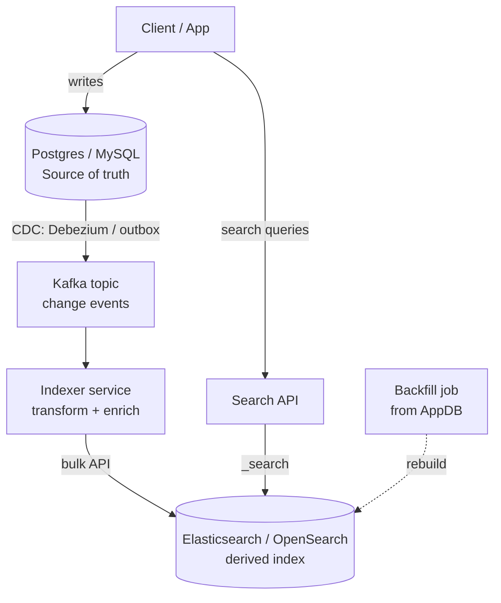
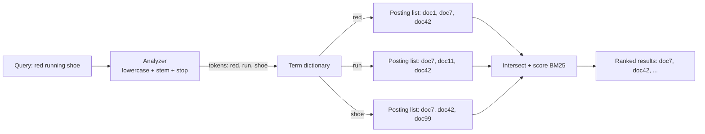
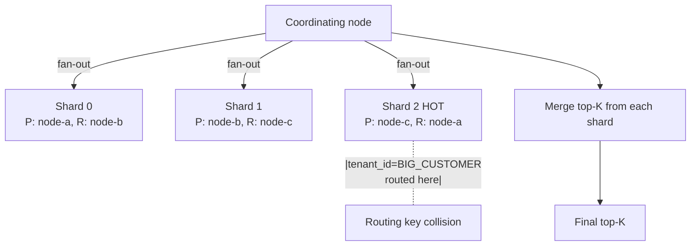

# Search Engines

## Why This Exists

**Problem.** Relational databases find rows by exact key. Users type `"red running shoes size 10"` and expect the system to rank by relevance, ignore stop-words, fold case, stem `running → run`, allow typos, and return facets (`Brand: Nike (42)`, `Size: 10 (87)`) — all in under 100ms over millions of documents. `LIKE '%shoe%'` cannot do this. A `B-tree` index on `name` cannot do this. You need an **inverted index** with linguistic analysis and a relevance ranker.

**Key insight.** A search engine is a **derived, eventually-consistent index** over your authoritative data. It optimises for *read-mostly, recall-and-rank* workloads by inverting the storage: instead of `doc_id → terms`, it stores `term → posting_list[doc_id, position, freq]`. Everything else — analyzers, scoring, faceting, sharding — exists to make that inverted index fast, multilingual, and operable.

**Reach for this when:**
- Users need **full-text search**: relevance ranking, stemming, fuzzy matching, phrase queries, autocomplete.
- You need **faceted navigation**: aggregate counts grouped by category/brand/price-bucket.
- You need **log/event analytics** at scale (Elasticsearch + Kibana, OpenSearch + OpenSearch Dashboards).
- You need **vector search** for semantic retrieval (ES 8.x, OpenSearch 2.x, Meilisearch, Vespa).
- You need **geo-search**: "restaurants within 2km, sorted by rating".

**Don't reach for this when:**
- You need **strong consistency, transactions, joins**, or are processing money. Use Postgres / MySQL / a transactional store. Search engines are *not* databases — see "Pitfalls" below.
- You need **exact key lookup** at very low latency. Use Redis or a KV store.
- Your data fits comfortably in Postgres and `pg_trgm` + `tsvector` covers your needs. The operational cost of an ES cluster is non-trivial; don't take it on for 50k rows.
- You're tempted to make ES the **system of record**. Almost always wrong. The index should be rebuildable from the source DB.

## Diagrams

### Architecture: search as a derived index



The arrows that matter: writes go to the **source of truth** first. CDC or an outbox pushes changes into Kafka. The indexer transforms and bulk-writes to ES. **The reindex arrow is the safety net** — if ES corrupts, lags, or you change the mapping, you can always rebuild from the DB.

### Inverted index lookup



### Shard topology and the hot-shard problem



Every search query fans out to every shard. The slowest shard sets the response latency (tail amplification). One bad routing key, one oversized tenant, one shard with too many segments — and your p99 doubles.

## Core Concepts

### Inverted index — the data structure that makes this work

A **forward index** is what a database has: `doc_id → {field: value}`. To find docs containing "shoe" you must scan every doc.

An **inverted index** flips it: `term → posting_list`. Each posting stores `(doc_id, term_frequency, positions[])`. To find "shoe" you do one dictionary lookup. To find `"red shoe"` (a phrase), you intersect the posting lists for `red` and `shoe`, then check that `position(shoe) == position(red) + 1` in the same doc.

Lucene (the engine inside Elasticsearch, OpenSearch, and Solr) stores postings on disk in **immutable segments**. Writes append to a new segment; deletes are tombstones; segments merge in the background. This is why:
- Search engines are **near-real-time**, not real-time. The default `refresh_interval` is 1s — your write isn't searchable until refresh.
- Updates are **delete + insert**, not in-place. Heavy updates cause segment churn and merge pressure.
- A `force_merge` to 1 segment makes reads fast but is expensive and locks indices; **never do this on a write-active index**.

### Analyzers, tokenizers, filters — where most relevance bugs live

An **analyzer** is a pipeline: `char_filters → tokenizer → token_filters`. It runs at *both* index time and query time. **Mismatch between the two is the #1 cause of "why doesn't this match?"**

```json
PUT /products
{
  "settings": {
    "analysis": {
      "analyzer": {
        "product_en": {
          "type": "custom",
          "char_filter": ["html_strip"],
          "tokenizer": "standard",
          "filter": [
            "lowercase",
            "asciifolding",
            "english_stop",
            "english_stemmer",
            "synonym_graph_en"
          ]
        }
      },
      "filter": {
        "english_stop":     { "type": "stop", "stopwords": "_english_" },
        "english_stemmer":  { "type": "stemmer", "language": "english" },
        "synonym_graph_en": {
          "type": "synonym_graph",
          "synonyms": ["sneaker, trainer, kicks => sneaker"]
        }
      }
    }
  },
  "mappings": {
    "properties": {
      "title":    { "type": "text", "analyzer": "product_en" },
      "title_kw": { "type": "keyword" },          // for sorting / faceting / exact match
      "brand":    { "type": "keyword" },
      "price":    { "type": "scaled_float", "scaling_factor": 100 },
      "tags":     { "type": "keyword" },
      "created":  { "type": "date" },
      "embedding":{ "type": "dense_vector", "dims": 768, "index": true, "similarity": "cosine" }
    }
  }
}
```

Use the **`_analyze` API** to debug what an analyzer actually produces. Don't guess.

```bash
curl -XPOST 'localhost:9200/products/_analyze' -H 'content-type: application/json' -d '
{
  "analyzer": "product_en",
  "text": "Running Sneakers (Red) <b>Sale!</b>"
}'
# → tokens: [run, sneaker, red, sale]
```

The hardest analyzer bugs:
- **Stemming over-collapses**: `university` and `universal` both stem to `univers` with a Porter stemmer. Use a less aggressive stemmer (`light_english`) for product catalogs.
- **Synonyms at query-time vs index-time**: query-time is more flexible (you can change synonyms without reindex) but breaks phrase queries on multi-word synonyms unless you use `synonym_graph`.
- **CJK / multi-byte text**: the `standard` tokenizer splits on whitespace and is wrong for Chinese / Japanese / Thai. Use `icu_analyzer`, `kuromoji` (JP), `smartcn` (zh-CN), or a SentencePiece-based plugin.

### Relevance: TF-IDF and BM25

For decades the standard score was **TF-IDF**:

```
score(q, d) = Σ_t∈q  tf(t, d) · idf(t)
tf(t, d)   = freq(t, d) / |d|        # term frequency normalised by doc length
idf(t)     = log(N / df(t))          # rarer terms count more
```

TF-IDF rewards docs that mention the query terms a lot, but it grows linearly in `tf` — a doc with the word "shoe" 1000 times scored 100x a doc with 10 mentions. That's wrong.

**BM25** (Robertson & Zaragoza, 2009) fixes this with two parameters and a saturation curve. It is the default in Lucene 6+ (so ES 5+, OpenSearch all, Solr 6+):

```
score(q, d) = Σ_t∈q  idf(t) · ( tf(t,d) · (k1 + 1) ) / ( tf(t,d) + k1 · (1 - b + b · |d|/avgdl) )
```

- `k1` (default 1.2): saturation — extra term occurrences past `k1` count for less.
- `b`  (default 0.75): length normalisation — penalty for long docs.
- `idf` uses `log(1 + (N - df + 0.5) / (df + 0.5))` (smoothed).

**Tuning hints (DDIA ch. 3 covers TF-IDF / BM25 in passing; full treatment in *Introduction to Information Retrieval* by Manning et al.):**
- News articles / long docs → lower `b` (e.g. 0.3) so length doesn't dominate.
- Short titles / product names → raise `b` toward 1.0 so 2-word matches in a 3-word title score high.
- Tech docs with code → `k1` around 0.6 reduces noise from repeated identifiers.

Don't tune by gut. **A/B test against click-through and conversion**, or use offline NDCG@10 against judged pairs.

### Querying — match, multi_match, function_score, hybrid

```json
GET /products/_search
{
  "query": {
    "function_score": {
      "query": {
        "multi_match": {
          "query": "red running shoes",
          "type":  "best_fields",       // or cross_fields, phrase, bool_prefix
          "fields": ["title^3", "brand^2", "description"],
          "fuzziness": "AUTO",
          "operator": "and",
          "minimum_should_match": "75%"
        }
      },
      "functions": [
        { "filter": { "term": { "in_stock": true } }, "weight": 2.0 },
        { "field_value_factor": { "field": "popularity", "modifier": "log1p", "factor": 0.5 } },
        { "gauss": { "created": { "origin": "now", "scale": "30d", "decay": 0.5 } } }
      ],
      "score_mode": "sum",
      "boost_mode": "multiply"
    }
  },
  "aggs": {
    "by_brand": { "terms": { "field": "brand", "size": 20 } },
    "price_buckets": {
      "range": {
        "field": "price",
        "ranges": [{"to": 50}, {"from": 50, "to": 150}, {"from": 150}]
      }
    }
  },
  "size": 24,
  "from": 0,
  "track_total_hits": 1000
}
```

Things to know:
- `^3` = field boost; relative, not absolute. Multiplies the BM25 score for that field.
- `track_total_hits` defaults to 10,000 in ES 7+. If you need an exact count, set higher — but the cost grows.
- **Deep pagination is a trap**: `from: 10000` makes every shard sort the top-10024 and the coordinator picks 10000–10024. Use `search_after` with a tiebreaker sort (e.g. `_score`, `_id`) instead. PIT (point-in-time) gives a consistent snapshot.

### Hybrid search (BM25 + vectors) — the 2024+ default

For semantic retrieval, store a `dense_vector` field (computed by an embedding model) and combine BM25 + kNN:

```json
GET /products/_search
{
  "knn": {
    "field": "embedding",
    "query_vector_builder": {
      "text_embedding": {
        "model_id": "sentence-transformers__all-minilm-l6-v2",
        "model_text": "comfortable shoes for running a marathon"
      }
    },
    "k": 50,
    "num_candidates": 200
  },
  "query": {
    "match": { "title": "running marathon" }
  },
  "rank": { "rrf": { "rank_window_size": 100, "rank_constant": 60 } }
}
```

`rrf` is **Reciprocal Rank Fusion** (Cormack et al., 2009) — adds `1/(k + rank)` across rankers. It's parameter-light and surprisingly hard to beat. ES 8.8+, OpenSearch 2.12+ ship it natively.

## Indexing pipelines: source of truth, derived index, the rebuild button

The single most important architectural decision: **the search index is derived, not authoritative**. You write to Postgres (or DynamoDB, or whatever); a downstream pipeline projects rows into ES.

```python
# Outbox pattern in the application
def create_product(p: Product) -> None:
    with db.transaction() as tx:                                   # ATOMIC
        tx.execute("INSERT INTO products (...) VALUES (...)", p)
        tx.execute(
            """INSERT INTO outbox (aggregate_id, event_type, payload, created_at)
               VALUES (%s, %s, %s::jsonb, now())""",
            (p.id, "ProductCreated", json.dumps(p.to_dict())),
        )
    # Outbox poller publishes to Kafka after commit. Even if the app crashes
    # right here, the row is durable and will be published on retry.
```

```python
# Indexer service
from elasticsearch.helpers import bulk

def index_batch(events: list[Event]) -> None:
    actions = []
    for ev in events:
        if ev.type in ("ProductCreated", "ProductUpdated"):
            actions.append({
                "_op_type":      "index",
                "_index":        f"products-{INDEX_VERSION}",
                "_id":           ev.aggregate_id,
                "_source":       transform(ev.payload),
                "version":       ev.sequence,           # external versioning
                "version_type":  "external_gte",        # idempotent re-delivery
            })
        elif ev.type == "ProductDeleted":
            actions.append({
                "_op_type": "delete",
                "_index":   f"products-{INDEX_VERSION}",
                "_id":      ev.aggregate_id,
            })

    success, errors = bulk(es, actions, raise_on_error=False, request_timeout=60)
    for err in errors:
        if err.get("index", {}).get("status") in (409,):    # version conflict — older event
            continue                                         # safe to drop
        log_and_alert(err)
```

`version_type: external_gte` is the trick that makes idempotency work: if a re-delivered event has a stale sequence, ES rejects it (HTTP 409) and you move on. **Never use ES-generated `_version` for ordering — it's local to the shard and meaningless across reprocessing.**

### Zero-downtime reindex with aliases

```bash
# 1. Create the new index with the new mapping
PUT /products-v3
{ "mappings": { ... new schema ... } }

# 2. Reindex from old to new (server-side; bulk; can be sliced & parallel)
POST /_reindex?wait_for_completion=false&slices=auto
{ "source": { "index": "products-v2" }, "dest": { "index": "products-v3" } }

# 3. Catch up tail — replay events with timestamp > reindex_started_at

# 4. Atomic swap via the alias
POST /_aliases
{
  "actions": [
    { "remove": { "index": "products-v2", "alias": "products" } },
    { "add":    { "index": "products-v3", "alias": "products", "is_write_index": true } }
  ]
}

# 5. Keep v2 around for 24h, then DELETE /products-v2
```

Application code reads/writes only the **alias** `products`. The cluster never sees a moment where the alias is unmapped. This is non-negotiable for any production index — bake it in from day 1, not after the first painful reindex.

## Engine comparison: ES vs OpenSearch vs Solr vs Meilisearch vs Vespa

| Engine | Built on | Strengths | Weak spots | License |
|---|---|---|---|---|
| **Elasticsearch** | Lucene | Mature ecosystem, ML/vector built-in, Kibana, log analytics scale | License changed to Elastic License 2.0 / SSPL (2021); commercial features paywalled | ELv2 / SSPL |
| **OpenSearch** | Lucene (ES 7.10 fork) | Apache 2.0, AWS-backed, feature parity catching up, k-NN strong | Slightly behind ES on some ML features; some plugin/API drift | Apache 2.0 |
| **Solr** | Lucene | Battle-tested, strong faceting, SolrCloud + ZK, deep customisation | Smaller community, less polished ops, lagging on vector | Apache 2.0 |
| **Meilisearch** | Custom (Rust) | Sub-50ms typo-tolerant search, dead simple to run, great DX for product search | Not for log analytics, less customizable scoring, smaller scale ceiling | MIT |
| **Typesense** | Custom (C++) | Similar niche to Meilisearch, geo + vector | Same scale ceiling, smaller ecosystem | GPL-3.0 |
| **Vespa** | Custom (Java/C++ — Yahoo origin) | Tensor + structured + vector ranking in one; serves recsys at scale | Steep learning curve, smaller community | Apache 2.0 |
| **Postgres `tsvector` / `pg_trgm`** | Postgres | One database, transactional, no separate cluster | No BM25 (until `pg_search`/ParadeDB), weaker analyzers, no faceting at scale | PostgreSQL |
| **Postgres + `pg_search` (ParadeDB)** | Postgres + Tantivy | BM25 inside Postgres, transactional | Newer, scale ceiling unproven | PostgreSQL/AGPL |

**For 95% of teams: pick OpenSearch or Elasticsearch.** Same Lucene engine, same query DSL (mostly). Pick ES if you want managed Elastic Cloud + their ML stack. Pick OpenSearch if you're on AWS or want pure Apache 2.0. Don't agonise.

## Trade-offs

| Benefit | Cost |
|---|---|
| Sub-100ms full-text relevance over millions of docs | Eventual consistency; refresh interval (default 1s) means writes aren't immediately visible |
| Rich analyzer pipeline → multilingual, fuzzy, stemmed search | Index-time vs query-time analyzer mismatch is the #1 cause of mystery bugs |
| Horizontal scale via sharding | Shard count is **fixed at index creation** — wrong choice means full reindex |
| BM25 + vectors + facets in one query | Operationally heavier than a database; needs JVM tuning, heap sizing, OS file cache, segment merge tuning |
| Aggregations / facets on every field | "Mapping explosion": dynamic mappings on user-controlled keys can create millions of fields and OOM the cluster |
| Point-in-time reindex via aliases | Requires disciplined alias use from day 1; retrofitting is painful |
| Replicas for HA + read scale | Replicas double storage and write amplification |
| Vector search for semantic retrieval | Vectors balloon index size; quantization (int8, BBQ) trades recall for memory |
| Lucene segments + immutable storage = fast reads | Updates = delete-and-reinsert; high update rate causes merge pressure and CPU burn |
| ES is a great log/event store at petabyte scale | ES is **NOT** a database. No transactions, no joins, no strong consistency. Lose this fight and you'll lose data. |

## Common Pitfalls

### 1. Treating ES as the source of truth
The **single most expensive mistake** in this space. Symptoms when this fails:
- A node disk corrupts mid-write; a primary shard is lost; the replica had stale data; you discover documents are gone with no way to recover.
- A bad mapping change forces a full reindex; you have nothing to reindex *from*.
- A bug double-deletes; the events that caused the deletion are gone.

**Rule:** writes flow `App → DB → CDC → ES`. The DB is durable and replayable. ES is rebuildable in minutes-to-hours from the DB. The only legitimate "ES is source of truth" cases are observability/log ingestion where the upstream is genuinely ephemeral (and even then, S3 + Snapshot Lifecycle Mgmt is the durable backing).

### 2. Mapping explosion
Dynamic mapping is enabled by default. If you index `{"attributes": {"<user_supplied_key>": "value"}}`, every new key becomes a new field. A few hundred million docs with high-cardinality keys → cluster state in the GBs → slow cluster updates → red cluster.

**Fix:**
```json
"settings": { "index.mapping.total_fields.limit": 2000 },
"mappings": {
  "dynamic": "strict",                      // or "false" — never "true" in prod
  "properties": {
    "attributes": {
      "type": "flattened"                   // single Lucene field, no per-key mapping
    }
  }
}
```

### 3. Hot shards
Shards are routed by `hash(_id) % num_primary_shards` (or `routing` if specified). One huge tenant on a custom routing key → that shard is 10× others → query latency tracks the slow shard.

**Detection:** `_cat/shards?v` and look at `docs` and `store.size`. Variance > 2× is a warning.

**Fix:** rethink routing. For multi-tenant, route small tenants by `tenant_id`, but **don't co-route large tenants** — let them spread by `_id`. Or split: one index for whales, one for everyone else, queried via an alias.

### 4. Shard count chosen wrong, locked in forever
You can't change the primary shard count without reindexing. Rules of thumb (ES docs, "Size your shards"):
- Aim for shards in the **10–50 GB** range. Smaller wastes overhead; larger slows recovery.
- Total shards per node ≤ 20 × heap-GB (so a 30 GB heap node ≤ 600 shards, soft cap).
- For time-series, use **rollover + ILM** with a shard size target, not a fixed count.

### 5. Refresh interval and over-frequent refreshes
Default `refresh_interval: 1s` means every index creates a tiny segment per second per shard → merge storm under heavy write load. For bulk loads:
```json
PUT /products/_settings { "refresh_interval": "30s", "number_of_replicas": 0 }
```
After load: restore replicas and a sane refresh.

### 6. Heap > 32 GB or < 8 GB
JVM compressed oops cap out around 30.5 GB; setting heap to 64 GB makes pointers larger and *worse*. Standard guidance: heap = `min(50% of RAM, ~30 GB)`. The other 50% is for the OS file cache, which Lucene depends on heavily.

### 7. Using `_id` as a sequential key
Sequential IDs route to the same shard for long stretches → hot shard during write bursts. Use UUID/ULID, or set explicit routing.

### 8. Version skew during rolling upgrade
ES/OS does not support arbitrary multi-version clusters. You must follow the supported upgrade matrix (one major hop, sometimes a transition release). Mid-upgrade clusters are fragile — **disable shard allocation** during node restarts:
```json
PUT _cluster/settings { "persistent": { "cluster.routing.allocation.enable": "primaries" } }
```

### 9. Synonyms break phrase queries
`["sneaker, trainer => sneaker"]` with a basic `synonym` filter at query time + `match_phrase` produces wrong token positions, dropping legit matches. Use **`synonym_graph`** + the `match_phrase` -aware analysis chain. Test with `_analyze` and `explain`.

### 10. Deep pagination
`from + size` past 10k is rejected by default (`index.max_result_window`). Raising it doesn't fix the underlying cost. Use `search_after` with a tiebreaker, or PIT for consistent snapshots.

### 11. Reindexing without snapshotting first
Always take a snapshot to S3 (or shared FS) **before** a reindex, mapping change, or major upgrade. SLM (Snapshot Lifecycle Management) is your backup tier.

### 12. Aggregations that OOM the coordinator
A `terms` aggregation with `size: 10000` over a high-cardinality field fans out to every shard, returns 10k from each, and the coordinator merges. Use `composite` aggregations for paginated bucketing, or pre-aggregate via rollups.

### 13. Vector index built without quantization on a tight memory budget
A 768-dim float32 vector = 3 KB. 100M docs → 300 GB just for vectors, RAM-resident for HNSW. Use **int8** or **BBQ (binary quantization)** in ES 8.12+ / equivalent in OS. Test recall; quantization is not free.

### 14. "We'll just turn off replicas to save money"
`number_of_replicas: 0` means a single node failure = data loss for the shards on that node. For any data you care about, replicas ≥ 1 in prod. (The reindex-from-DB rebuild plan is the ultimate backstop, not a substitute for replicas.)

### 15. Forgetting `keyword` sub-fields
You can't sort, aggregate, or do exact-match on a `text` field. The convention:
```json
"title": {
  "type": "text",
  "fields": { "kw": { "type": "keyword", "ignore_above": 256 } }
}
```
Then sort on `title.kw`, search on `title`.

## Decision Table

| Question | Use this | Not this | Why |
|---|---|---|---|
| Postgres has 5M rows, search needs typo-tolerance + facets | `pg_trgm` + `tsvector` first; consider Meilisearch if UX demands instant typo correction | Standing up an ES cluster | Operational cost dominates at this scale |
| 500M product catalog, multilingual, facets, semantic search | Elasticsearch or OpenSearch | Postgres FTS, Meilisearch | Vector + BM25 + facets + scale all in one |
| Sub-50ms instant-search on a product catalog up to ~1B docs | Meilisearch / Typesense | Elasticsearch | Better DX, latency profile tuned for product search |
| Log/event analytics at TB+/day | OpenSearch / Elasticsearch + ILM | Solr, Meilisearch | Time-series tooling, rollover, hot/warm/cold tiers |
| Fully Apache 2.0 stack required (license-sensitive) | OpenSearch, Solr | Elasticsearch (ELv2/SSPL) | License compatibility |
| Existing JVM shop with deep Solr expertise | Solr | Switching to ES for novelty | Don't break what works |
| Recsys/ranking with rich tensor scoring | Vespa | ES function_score | Vespa's ranking expressions go further |
| You're tempted to make ES the source of truth | Postgres (or whatever) is source of truth; ES is derived | ES as primary store | See pitfall #1 |
| Search is blocking a release and you have 1 sprint | Hosted Elastic Cloud / OpenSearch Service / Algolia | Self-managing a new cluster | Buy time; migrate later if needed |

## References

- Manning, Raghavan, Schütze — *Introduction to Information Retrieval* (Cambridge, 2008) — https://nlp.stanford.edu/IR-book/ — definitive textbook on inverted indexes, BM25, evaluation.
- Robertson & Zaragoza — *The Probabilistic Relevance Framework: BM25 and Beyond* (2009) — https://www.staff.city.ac.uk/~sbrp622/papers/foundations_bm25_review.pdf — the BM25 reference.
- Kleppmann — *Designing Data-Intensive Applications* — ch. 3 "Storage and Retrieval" (full-text search, term dictionaries) and ch. 11 "Stream Processing" (CDC / derived indexes).
- Elasticsearch official docs — https://www.elastic.co/guide/en/elasticsearch/reference/current/index.html
- Elasticsearch — "Size your shards" — https://www.elastic.co/guide/en/elasticsearch/reference/current/size-your-shards.html
- Elasticsearch — "Tune for indexing speed" — https://www.elastic.co/guide/en/elasticsearch/reference/current/tune-for-indexing-speed.html
- OpenSearch documentation — https://opensearch.org/docs/latest/
- Apache Solr Reference Guide — https://solr.apache.org/guide/
- Lucene docs (the engine inside all three) — https://lucene.apache.org/core/documentation.html
- Meilisearch documentation — https://www.meilisearch.com/docs
- Vespa documentation — https://docs.vespa.ai/
- Cormack, Clarke, Büttcher — *Reciprocal Rank Fusion outperforms Condorcet and individual Rank Learning Methods* (SIGIR 2009) — https://plg.uwaterloo.ca/~gvcormac/cormacksigir09-rrf.pdf
- Debezium — change data capture — https://debezium.io/documentation/
- Pat Helland — *Data on the Outside vs. Data on the Inside* (CIDR 2005) — https://www.cidrdb.org/cidr2005/papers/P12.pdf — frames why derived indexes are "outside data".
- Adrian Colyer — *The Morning Paper* on BM25 and IR — https://blog.acolyer.org/
- AWS Builders' Library — *Caching challenges and strategies* — https://aws.amazon.com/builders-library/caching-challenges-and-strategies/ — many operational lessons transfer to derived indexes.
- Google SRE Book — ch. 22 "Addressing Cascading Failures" — https://sre.google/sre-book/addressing-cascading-failures/ — read before tuning your search cluster's circuit breakers.
- Elastic — *A new way to BM25: BBQ vectors* — https://www.elastic.co/search-labs/blog/better-binary-quantization-lucene-elasticsearch — recent vector quantization work.

## See Also

- `../../performance/caching/` — read-side companion; share design philosophy (derived, eventually consistent).
- `../stream-processing/` — Kafka topics that carry change events to indexers.
- `../../performance/tail-latency/` — fan-out queries and the slowest-shard problem.
