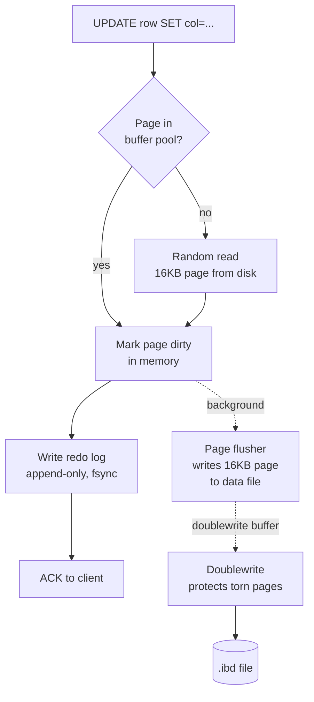
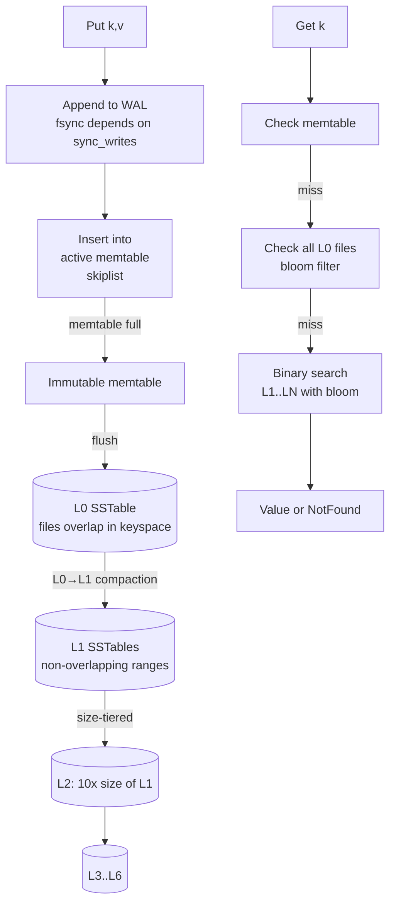
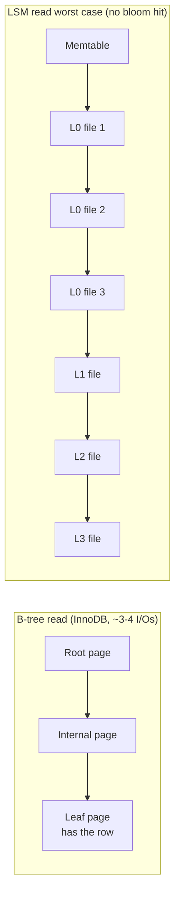

# Storage Engines

## Why This Exists

**Problem.** Every database has a storage engine underneath: the layer that turns logical rows/documents into bytes on disk and back. The engine decides your write amplification, your read amplification, your space amplification, your tail latency, and how much RAM you need per byte of data. Most "the database is slow" outages are storage-engine outages in disguise: a buffer pool that's too small, a compaction backlog, a B-tree that's fragmented, a cache that's churning. If you don't understand the engine, you can't tune it, and you can't pick the right one.

**Key insight.** There are essentially **two families**: update-in-place B-trees (InnoDB, WiredTiger's default, BoltDB, LMDB) and log-structured merge-trees (RocksDB, MyRocks, Cassandra, ScyllaDB, LevelDB, WiredTiger LSM mode, HBase). They make opposite trade-offs:

- **B-tree**: low read amp, low space amp, **high write amp** (every update rewrites a 16KB page even for a 100-byte change), random I/O, in-place updates need WAL + crash recovery.
- **LSM**: low write amp on the hot path (append-only), **high read amp** (must check memtable + multiple SSTable levels), high space amp during compaction, sequential I/O, compaction is a background tax you pay forever.

The right choice depends on your workload's read/write ratio, value size, working-set fit in RAM, and whether you can tolerate compaction tail latency.

**Reach for this when:**
- Choosing MySQL InnoDB vs MyRocks, MongoDB WiredTiger row-store vs LSM, Postgres heap vs Citus columnar.
- Diagnosing a database that's "fine on small data, falls over at 1TB" — almost always engine-level.
- Buffer-pool hit rate < 99%, compaction lagging, IOPS pegged, page splits in metrics.
- Sizing RAM for a database (working set vs total data vs index size).
- Picking between RocksDB tuning options (level vs universal compaction, bloom filters, block cache size).

**Don't reach for this when:**

- The database is healthy at your current scale and the slow query is fixable with an index, not an engine swap.
- You're choosing between *vendors* (Postgres vs MySQL vs MongoDB) on the basis of operational maturity, ecosystem, and team familiarity — not on storage-engine internals.
- Workload is sub-100GB and fits comfortably in RAM — most engine differences disappear at that scale; pick whatever's simplest to operate.
- You're designing the schema or query patterns; that's an indexing-and-data-model problem, not a storage-engine problem (see [../indexing/](../indexing/) and [../partitioning/](../partitioning/)).
- You haven't measured: USE-method or RED-method numbers must show the engine is the bottleneck before swapping it. See [../../performance/profiling/](../../performance/profiling/).

---

## Diagrams

### B-tree (InnoDB) update path



### LSM (RocksDB) write & compaction



### Read amp visualization



---

## The Three Amplifications (the only metrics that matter)

Every storage engine is graded on three numbers. Memorize these.

| Metric | Definition | B-tree typical | LSM typical |
|---|---|---|---|
| **Write amplification** | Bytes written to disk per logical byte written by user | 10–30x (page rewrites + WAL + doublewrite) | 5–20x (WAL + memtable flush + N levels of compaction). Tunable. |
| **Read amplification** | I/Os per logical read | 3–5 (tree height) | 5–20 worst case (memtable + L0 + L1..LN). Bloom filters cut this. |
| **Space amplification** | Bytes on disk per logical byte of data | 1.1–1.3x (some fragmentation) | 1.1x (level) to 2x+ (universal/tiered, transient during compaction) |

**Mark Callaghan's rule of thumb (Facebook MySQL/MyRocks team):**
> "B-trees minimize read & space amp at the cost of write amp. LSMs minimize write amp at the cost of read & space amp. Pick the one whose costs you can afford."

A 100-byte row update on InnoDB rewrites 16KB. That's **160x write amp at the page level**, before WAL, before doublewrite, before binlog. On a write-heavy workload with small rows, this is why MyRocks at Facebook reduced storage 2x and write I/O 10x for the same data.

---

## InnoDB — page-oriented B+tree with buffer pool

The default MySQL engine since 5.5. Clustered index on primary key (rows live in leaf pages of the PK B+tree). Secondary indexes store PK as the pointer.

### Architecture in one paragraph

InnoDB stores everything in **16KB pages** organized as a B+tree per index. The **buffer pool** is an in-memory LRU of pages — your most important tuning knob. Writes go to a redo log (WAL) for durability, then dirty pages flush to disk in the background. The **doublewrite buffer** protects against torn pages (16KB page > 4KB filesystem block = partial-write risk on crash). The **change buffer** batches secondary-index updates for non-unique indexes when their pages aren't in the buffer pool.

### Critical tuning levers

```ini
# my.cnf — what actually matters for InnoDB

# THE knob. Set to 70-80% of system RAM on a dedicated DB host.
# Hit ratio < 99% means you're doing random reads from disk on hot data.
innodb_buffer_pool_size = 96G

# Split into instances to reduce mutex contention. 1 per 1GB, cap at 64.
innodb_buffer_pool_instances = 16

# Redo log. Larger = fewer checkpoint flushes = better write throughput,
# but longer crash recovery. 25% of buffer pool is a starting point.
innodb_log_file_size = 4G
innodb_log_files_in_group = 2

# Durability vs throughput. 1 = ACID (fsync per commit).
# 2 = fsync per second (lose <1s on OS crash, fine for most).
# 0 = lose <1s on MySQL crash. Don't use unless you know why.
innodb_flush_log_at_trx_commit = 1

# O_DIRECT bypasses OS page cache (which double-caches with buffer pool).
# Always set this on Linux for dedicated DB hosts.
innodb_flush_method = O_DIRECT

# I/O capacity. Set to 50-75% of your storage's sustained random IOPS.
# Too low = compaction/flushing falls behind. Too high = wastes IOPS.
innodb_io_capacity = 2000
innodb_io_capacity_max = 4000

# Adaptive flushing — let InnoDB pace dirty page flushing.
innodb_adaptive_flushing = ON
innodb_max_dirty_pages_pct = 75
```

### Reading buffer pool health

```sql
-- Hit ratio. Want > 99.9% on OLTP. < 99% = you need more RAM or a smaller working set.
SELECT
  (1 - (SELECT VARIABLE_VALUE FROM performance_schema.global_status
        WHERE VARIABLE_NAME='Innodb_buffer_pool_reads')
      / (SELECT VARIABLE_VALUE FROM performance_schema.global_status
        WHERE VARIABLE_NAME='Innodb_buffer_pool_read_requests')) * 100 AS hit_pct;

-- Dirty pages. Steady-state should be well under innodb_max_dirty_pages_pct.
-- Climbing = flusher can't keep up = bump innodb_io_capacity.
SHOW ENGINE INNODB STATUS\G

-- Pages read/written per second (look for sustained spikes during writes).
SELECT * FROM performance_schema.global_status
WHERE VARIABLE_NAME LIKE 'Innodb_pages_%';
```

### When InnoDB shines

- **Read-heavy OLTP** with working set fitting in RAM — buffer pool gives you in-memory speed.
- **Range scans on PK** — clustered index keeps related rows physically adjacent.
- **Strong consistency + foreign keys + transactions** with multi-statement complexity.
- Workload where reads dominate writes 10:1 or more.

### When InnoDB hurts

- **Write-heavy with small rows.** 100-byte UPDATE → 16KB page rewrite. Disk fills with dirty page churn.
- **Wide secondary indexes on a write-heavy table.** Each insert touches every index's B-tree.
- **Working set > RAM.** Random reads from disk dominate; tail latency explodes.
- **Sequential bulk loads.** Page splits fragment the tree; you'll need `OPTIMIZE TABLE` later.

---

## RocksDB / MyRocks — LSM-tree, log-structured

RocksDB is a Facebook fork of LevelDB optimized for SSDs. **MyRocks** is RocksDB plugged into MySQL as a storage engine, replacing InnoDB. Used by Facebook, LinkedIn, Yahoo for write-heavy workloads where InnoDB's space and write amp were unsustainable.

### Architecture

Writes append to a WAL and an in-memory **memtable** (skiplist by default). When the memtable fills, it becomes immutable and a new one starts; a background thread **flushes** the immutable memtable to a sorted file on disk (SSTable) at L0. **Compaction** merges L0 files into L1 (non-overlapping ranges), L1 into L2 (typically 10x larger), and so on down to L6 or so. Reads check memtable, then immutable memtable, then each L0 file (they overlap), then binary-search L1..LN. **Bloom filters** per SSTable make reads fast for keys that don't exist.

### Two compaction styles

| Style | What it does | Write amp | Space amp | When to use |
|---|---|---|---|---|
| **Leveled** (default) | L_n is 10x L_{n-1}; non-overlapping in each level except L0 | High (10–25x) | Low (~1.1x) | Read-heavy LSM, space-constrained |
| **Universal / size-tiered** | Merge files of similar size, no level structure | Low (~5x) | High (up to 2x transiently) | Write-heavy, plenty of disk |

Cassandra uses **size-tiered** by default (cheaper writes, worse space) and **leveled** for read-heavy column families. RocksDB defaults to leveled.

### Critical tuning levers

```cpp
// RocksDB Options — the knobs that actually move the needle.
rocksdb::Options options;

// Block cache: like InnoDB buffer pool, caches uncompressed (or compressed) blocks.
// Size to ~25–50% of RAM if engine is dedicated; less if app shares RAM.
auto cache = rocksdb::NewLRUCache(32ULL * 1024 * 1024 * 1024); // 32GB
rocksdb::BlockBasedTableOptions table_options;
table_options.block_cache = cache;

// Bloom filter — turns most missing-key reads into 1 cache lookup.
// 10 bits/key = ~1% false positive rate. Costs ~1.25 bytes/key in RAM/SSTable.
table_options.filter_policy.reset(rocksdb::NewBloomFilterPolicy(10, false));

// Pin L0 and top-level index/filter blocks in cache so reads don't evict them.
table_options.pin_l0_filter_and_index_blocks_in_cache = true;
table_options.cache_index_and_filter_blocks = true;

options.table_factory.reset(rocksdb::NewBlockBasedTableFactory(table_options));

// Memtable size — bigger = fewer L0 files = less read amp, but slower recovery
// and more RAM. 64–256 MB is common.
options.write_buffer_size = 128 * 1024 * 1024;
options.max_write_buffer_number = 4; // up to 4 memtables before write stalls

// Compaction parallelism — needs to keep up with write rate.
options.max_background_jobs = 8; // splits between flush and compaction

// L0 trigger — too many L0 files = slow reads (must check each).
// Too few = frequent L0->L1 compactions = write amp.
options.level0_file_num_compaction_trigger = 4;
options.level0_slowdown_writes_trigger = 20;  // throttle writes
options.level0_stop_writes_trigger = 36;       // halt writes (back-pressure)

// Compression. LZ4 for hot levels (fast), Zstd for cold (better ratio).
options.compression_per_level = {
    rocksdb::kNoCompression,        // L0 — speed matters
    rocksdb::kNoCompression,        // L1
    rocksdb::kLZ4Compression,       // L2
    rocksdb::kLZ4Compression,
    rocksdb::kZSTD,                 // L4+ — cold, compress hard
    rocksdb::kZSTD,
    rocksdb::kZSTD,
};
```

### Watching compaction health

```bash
# Compaction stats — the most important RocksDB diagnostic.
# Look for:
#  - Pending compaction bytes climbing → falling behind, will stall writes.
#  - W-Amp column — total write amp per level. Sum should be 10–30x.
#  - Stall: Y → you're write-stalling, the engine is back-pressuring writers.
ldb --db=/var/lib/mysql/.rocksdb dump_stats

# Or in MyRocks:
SHOW ENGINE ROCKSDB STATUS\G
```

### When MyRocks/RocksDB shines

- **Write-heavy OLTP** with small values (sessions, counters, time-series, secondary indexes).
- **Space-constrained.** MyRocks reduced Facebook's UDB storage 2x vs compressed InnoDB.
- **SSD wear matters.** Lower write amp = longer SSD life.
- **Pure-key-value or PK-only access patterns** — bloom filters keep reads fast.

### When RocksDB hurts

- **Range scans across many keys.** Must merge from memtable + L0 + LN — slower than B-tree leaf scan.
- **Workloads with lots of updates/deletes to the same keys.** Tombstones accumulate; reads must skip past them until compaction.
- **Tail-latency-sensitive workloads.** Compaction = periodic I/O storms = p99 spikes. Use rate limiters and dedicated compaction threads.
- **Operationally complex.** Tuning has 100+ knobs. Most teams misconfigure on first deploy.

---

## WiredTiger — MongoDB's default

Since MongoDB 3.2 (2015). Default is a **B+tree row store** with prefix compression and snappy block compression. Has an LSM mode but it's rarely used in practice.

### Architecture

Pages are variable-size (default ~32KB on disk, decompressed in cache). The **WiredTiger cache** is a unified in-memory page cache (default 50% of RAM minus 1GB, capped). Updates use **MVCC** — each modification creates a new version chained off the page; the **eviction thread** reconciles versions and writes pages back. WAL is per-collection. Snappy compression by default; zstd available.

### Critical tuning levers

```yaml
# /etc/mongod.conf
storage:
  wiredTiger:
    engineConfig:
      # THE knob. Defaults to 50% of (RAM - 1GB). On a dedicated host
      # with 64GB RAM, that's ~31.5GB. Bump to ~50% of RAM if mongod is alone.
      # Don't exceed 80% — OS needs page cache for WAL/journal.
      cacheSizeGB: 32

      # Eviction trigger — at 80% dirty, foreground eviction kicks in
      # (app threads do eviction work; latency spikes). Default is fine;
      # raise journal commit interval if you see eviction stalls.
      journalCompressor: snappy

    collectionConfig:
      blockCompressor: snappy   # snappy = fast, ~50% ratio
                                # zstd = ~70% ratio, more CPU
                                # zlib = ~70% ratio, much more CPU (legacy)

    indexConfig:
      prefixCompression: true   # massive win for indexes with shared prefixes
```

### Watching cache health

```javascript
// In mongo shell
db.serverStatus().wiredTiger.cache

// Numbers that matter:
//   "bytes currently in the cache"           — should be under cacheSizeGB
//   "tracked dirty bytes in the cache"       — > 20% of cache = write pressure
//   "pages evicted by application threads"   — non-zero = foreground eviction
//                                             = your queries are doing eviction work
//   "pages read into cache"                  — high rate = cache too small
//                                              = working set doesn't fit
```

### When WiredTiger shines

- **MongoDB.** It's the default. Works well for typical document workloads.
- **Read-heavy with diverse documents** — prefix-compressed indexes save RAM.
- **Compressible data** (logs, JSON with redundant keys) — 2–4x storage savings.

### When WiredTiger hurts

- **Cache pressure with large documents.** Each document update can dirty a whole page.
- **Sustained high write volume.** Eviction can fall behind; you'll see foreground eviction stalls in p99 latency.
- **Wide secondary indexes.** Each one is a full B+tree update on every write.

---

## Cassandra's storage engine — LSM with eventual consistency

Conceptually similar to RocksDB but built into the database, not a pluggable engine. Per-table choice of compaction strategy is a major operational lever.

### Compaction strategies

| Strategy | Use case | Characteristics |
|---|---|---|
| **STCS** (size-tiered, default) | Write-heavy, time-series with TTL | Low write amp, high space amp (up to 2x), worse read amp |
| **LCS** (leveled) | Read-heavy, small to medium tables | Higher write amp, low space amp, predictable read latency |
| **TWCS** (time-window) | Pure time-series, append-only | Buckets data into time windows; old windows become read-only; perfect for TTL |
| **UCS** (unified, 5.0+) | Tunable middle ground | Replaces STCS+LCS with a continuum |

```cql
-- Time-series table optimized for retention + read efficiency
CREATE TABLE metrics (
    metric_id text,
    bucket timestamp,
    ts timestamp,
    value double,
    PRIMARY KEY ((metric_id, bucket), ts)
) WITH compaction = {
    'class': 'TimeWindowCompactionStrategy',
    'compaction_window_unit': 'DAYS',
    'compaction_window_size': 1
} AND default_time_to_live = 2592000   -- 30 days
  AND gc_grace_seconds = 3600;          -- TTL'd data, lower than default 10 days

-- Read-heavy reference table → leveled
CREATE TABLE accounts (
    account_id uuid PRIMARY KEY,
    name text,
    tier text
) WITH compaction = {'class': 'LeveledCompactionStrategy'};
```

### The tombstone trap

Cassandra deletes by writing **tombstones** (markers). They persist until compaction merges them away — and only after `gc_grace_seconds` (default 10 days, to allow hinted handoff). If you delete or TTL data faster than compaction can clean up, **reads start scanning thousands of tombstones**, latency explodes, and you may hit `TombstoneOverwhelmingException`.

```cql
-- Symptom: "Read 10000 live rows and 50000 tombstone cells" warning in system.log
-- Fix: appropriate compaction strategy (TWCS for TTL data) + sane gc_grace_seconds
--      + don't model your data as a queue (high churn antipattern)
```

---

## LSM vs B-tree — the canonical decision

```
Workload axis →

Mostly reads, working set in RAM     │ Mostly writes, write amp matters
                                     │
B-tree wins                          │ LSM wins
- InnoDB                             │ - RocksDB / MyRocks
- WiredTiger row                     │ - Cassandra
- Postgres heap+B-tree               │ - HBase
- LMDB / BoltDB                      │ - WiredTiger LSM mode

  ←———————————————————————————————————————————————————————→
                  (read-heavy)            (write-heavy)
```

### Rough quantitative guide

For a 1KB row, sequentially-loaded workload, on a modern NVMe SSD:

| Engine | Write amp | Read amp (cold) | Space ratio | Tail latency |
|---|---|---|---|---|
| InnoDB (compressed) | ~30x | 3–4 I/Os | 1.3x | Stable |
| InnoDB (uncompressed) | ~15x | 3–4 I/Os | 1.0x | Stable |
| MyRocks (lz4) | ~5x | 3–8 I/Os | 0.4x | Compaction spikes |
| WiredTiger (snappy) | ~10x | 3–4 I/Os | 0.5x | Eviction spikes |
| Cassandra STCS | ~5x | up to 10 I/Os | ~1.5x | Compaction spikes |

(Numbers are illustrative, from Mark Callaghan's benchmarks and the LSM survey papers — actual numbers depend heavily on workload.)

---

## Trade-offs

| Benefit | Cost |
|---|---|
| **B-tree: predictable read latency** (always ~tree-height I/Os) | High write amp; doublewrite buffer overhead; page splits cause fragmentation |
| **B-tree: in-place updates** (no compaction tax) | Random I/O pattern; concurrent updates contend on hot pages |
| **LSM: low write amp** on small updates | Read amp grows with number of levels; compaction is forever |
| **LSM: sequential I/O** (great for HDDs and SSD endurance) | Compaction storms cause periodic p99 latency spikes |
| **LSM: high compression ratios** (sorted data compresses well) | Bloom filters and block cache must be sized correctly or reads collapse |
| **LSM: cheap deletes** (just write a tombstone) | Tombstones accumulate; can dominate reads if not compacted away |
| **Buffer pool / block cache: in-memory speed** for hot data | RAM is the most expensive resource; sizing is critical |
| **WAL durability**: survive crashes | fsync is the single biggest commit-latency cost; group commit helps |

---

## Common Pitfalls

- **Buffer pool too small.** The single most common production issue. Hit rate dropping from 99.9% to 99% can mean 100x more disk reads. Size to your working set, not your data set.
- **Double-caching with OS page cache.** On Linux, if you don't set `O_DIRECT` (InnoDB) or use direct I/O, you cache the same pages twice (OS + buffer pool). Wastes RAM, hurts hit ratio.
- **Compaction falling behind.** Pending compaction bytes climbing → eventually write stalls → app sees latency spikes or errors. Symptom: L0 file count growing, no longer steady-state. Fix: more compaction threads, lower write rate, or scale out.
- **Tuning `innodb_io_capacity` blindly.** Set to your storage's *sustained* random IOPS (run `fio` to measure), not the marketing number. Spinning rust is ~200, SATA SSD ~10K, NVMe 100K+.
- **Storing large blobs in the row.** InnoDB stores values >half-page size off-page; lots of off-page reads → 2x I/Os per row. Store blobs in S3/object storage; keep references in the DB.
- **Wide secondary indexes on a write-heavy LSM table.** Every secondary index in MyRocks is a separate column family with its own compaction. Cost compounds.
- **`gc_grace_seconds` too high on a high-churn Cassandra table.** Tombstones pile up; reads scan thousands of them; eventually `TombstoneOverwhelmingException`.
- **Forgetting that LSM compaction needs free space.** Universal/size-tiered compaction can transiently double on-disk usage. Don't run a 95%-full disk.
- **WiredTiger cache > 80% of RAM.** Starves OS page cache, journal commits get slow, foreground eviction kicks in.
- **`OPTIMIZE TABLE` on a huge InnoDB table during peak.** Locks the table, rewrites the entire file. Use `pt-online-schema-change` or `gh-ost` instead.
- **Assuming SSD = no write amp problem.** SSDs have their own internal write amplification (FTL garbage collection). Engine write amp × SSD write amp = real wear. MyRocks at FB cut this from ~50x to ~5x effective.
- **Disabling fsync for "performance".** Until you crash. Then you discover what the WAL actually protected.

---

## Decision Table

| Situation | Engine | Why |
|---|---|---|
| OLTP, working set fits in RAM, 100:1 read/write, transactions | **InnoDB** | Predictable reads, mature, ACID, ecosystem |
| OLTP, write-heavy, small rows, working set > RAM | **MyRocks / RocksDB** | Lower write amp, better compression |
| Document store, mixed workload, schema flexibility | **WiredTiger** (Mongo default) | Default of Mongo; row B-tree with compression |
| Wide-column, write-heavy, multi-DC, eventually consistent | **Cassandra** | Built-in LSM + replication; tunable per-table compaction |
| Pure key-value cache, ephemeral, in-memory | **Redis / Memcached** | Not a storage engine question — see [../../performance/caching/](../../performance/caching/) |
| Embedded KV inside an app (e.g. service-local state) | **RocksDB / LMDB** | Embeddable, no server. LMDB for read-heavy, RocksDB for write-heavy |
| Time-series with high ingest, TTL retention | **Cassandra TWCS / InfluxDB / TimescaleDB** | Time-windowed compaction matches the workload |
| Analytics, columnar scans, batch loads | **Parquet + DuckDB / ClickHouse / Citus columnar** | Different family entirely — see [../olap-warehouse/](../olap-warehouse/) |
| Append-only event log, immutable | **Kafka / Pulsar log segments** | Specialized log; not a general engine — see [../stream-processing/](../stream-processing/) |
| You're on RDS / Aurora and don't pick the engine | **InnoDB (Aurora) / Aurora's distributed storage** | Aurora separates compute from storage; tuning shifts to instance class & storage IOPS |

---

## References

- Kleppmann — *Designing Data-Intensive Applications*, **ch. 3 "Storage and Retrieval"** — the canonical comparison of B-trees and LSM-trees, write/read amp introduction.
- O'Neil et al. — *The Log-Structured Merge-Tree (LSM-Tree)* (1996) — original paper — https://www.cs.umb.edu/~poneil/lsmtree.pdf
- Mark Callaghan — *Read, write & space amplification - B-Tree vs LSM* — http://smalldatum.blogspot.com/2015/11/read-write-space-amplification-b-tree.html
- Mark Callaghan — *MyRocks at Facebook* talks/posts — http://smalldatum.blogspot.com/ (extensive, ongoing series)
- RocksDB Wiki — *RocksDB Tuning Guide* — https://github.com/facebook/rocksdb/wiki/RocksDB-Tuning-Guide
- RocksDB Wiki — *Leveled Compaction* — https://github.com/facebook/rocksdb/wiki/Leveled-Compaction
- RocksDB Wiki — *Universal Compaction* — https://github.com/facebook/rocksdb/wiki/Universal-Compaction
- MySQL Reference Manual — *InnoDB Buffer Pool* — https://dev.mysql.com/doc/refman/8.0/en/innodb-buffer-pool.html
- MySQL Reference Manual — *InnoDB Architecture* — https://dev.mysql.com/doc/refman/8.0/en/innodb-architecture.html
- MongoDB Manual — *WiredTiger Storage Engine* — https://www.mongodb.com/docs/manual/core/wiredtiger/
- Apache Cassandra Docs — *Compaction Strategies* — https://cassandra.apache.org/doc/latest/cassandra/operating/compaction/
- Luo & Carey — *LSM-based Storage Techniques: A Survey* (VLDB Journal, 2020) — https://arxiv.org/abs/1812.07527 — the definitive academic survey
- Dong et al. — *Optimizing Space Amplification in RocksDB* (CIDR 2017) — https://www.cidrdb.org/cidr2017/papers/p82-dong-cidr17.pdf
- Adrian Colyer / The Morning Paper — *LSM-tree* coverage — https://blog.acolyer.org/2014/11/26/the-log-structured-merge-tree-lsm-tree/
- AWS Builders' Library — *Amazon Aurora storage architecture* — https://aws.amazon.com/builders-library/ (Aurora-specific separation of compute and storage)
- Pat Helland — *Immutability Changes Everything* (CIDR 2015) — https://www.cidrdb.org/cidr2015/Papers/CIDR15_Paper16.pdf — context for why LSM and append-only design wins on modern hardware

---

## See Also

- [../../performance/caching/](../../performance/caching/) — application-level cache vs buffer pool
- [../stream-processing/](../stream-processing/) — Kafka/Pulsar log-structured storage
- [../replication/](../replication/) — engine choice constrains replication options (statement vs row-based, physical vs logical)
- [../partitioning/](../partitioning/) — when one engine instance can't keep up
- [../../reliability/capacity-planning/](../../reliability/capacity-planning/) — sizing buffer pool / cache from working-set estimates
