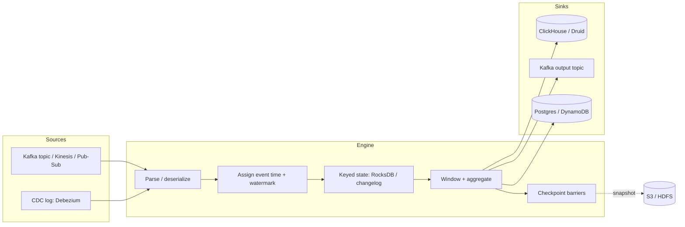
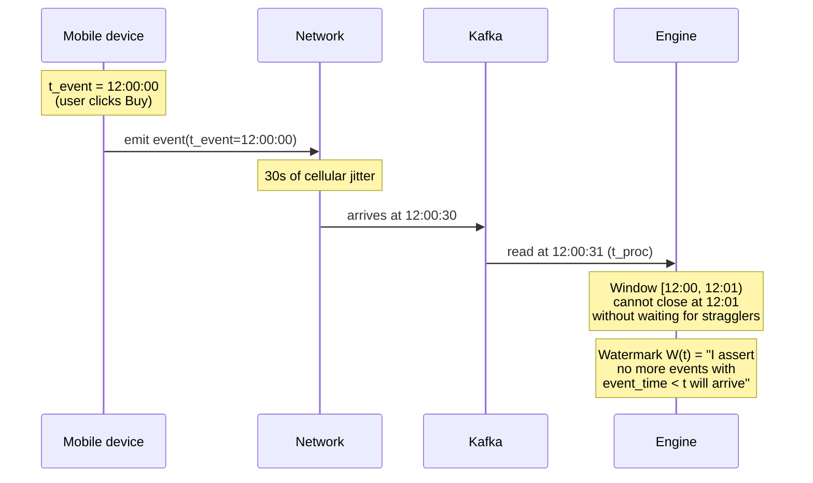
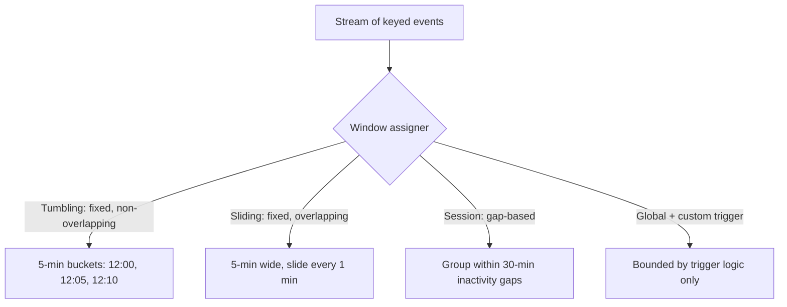

# Stream Processing

## Why This Exists

**Problem.** Batch jobs run on yesterday's data. By the time you notice fraud, the money is gone. By the time you notice the funnel dropped, the campaign is over. You need to compute aggregates, joins, and detections continuously over an unbounded sequence of events arriving out of order, possibly delayed by hours, with operators that may crash mid-flight — and you need the answer to be **correct**, not "roughly right after a few minutes."

**Key insight.** A stream is just a *table that hasn't been fully observed yet*. Stream processing is the discipline of computing deterministic answers over that table while bounding **state size**, **latency**, and **the blast radius of operator failure**. The hard parts aren't the operators (`map`, `filter`, `join`) — they're (1) **time** (event vs processing vs ingestion), (2) **completeness** (when can I emit a window?), (3) **state** (where does it live, who owns it after a crash?), and (4) **end-to-end semantics** (the engine's "exactly-once" is meaningless if your sink is non-idempotent).

**Reach for this when:**
- You need answers within seconds-to-minutes of an event happening (fraud, alerting, real-time pricing, leaderboards, IoT).
- Aggregations span time windows (5-min p99 latency, hourly revenue, 24-hour active users).
- You need stateful joins of two infinite streams or a stream against a slowly-changing table.
- The data is high-volume enough that re-running batch every minute is wasteful or impossible.

**Don't reach for this when:**
- A nightly batch job in Spark / Snowflake / BigQuery would do (cheaper, easier, fewer correctness landmines).
- You only need pub/sub fan-out without aggregation — use the message broker directly (Kafka, SQS, Pub/Sub).
- Your dataset fits in RAM and a cron job + Postgres is sufficient.
- You can't articulate why your business needs sub-minute freshness. "Real-time" without a latency SLO is cargo cult.

## Diagrams

### The four engines, conceptually



### Event time vs processing time, and why watermarks exist



## Core Concepts

### 1. Three notions of time

| Time | Definition | Used for |
|---|---|---|
| **Event time** | Timestamp embedded in the record by the producer (when the thing actually happened). | Correctness. The only one that gives reproducible results across reprocessing. |
| **Ingestion time** | When the broker received it. | Cheap proxy when producers can't be trusted with clocks. |
| **Processing time** | Wall clock on the operator when the record is handled. | Operational metrics, throttling, low-latency rough-cuts. |

If you key your business logic on **processing time**, your output is **non-deterministic**: replay the same Kafka topic and you'll get different aggregates because operator scheduling differs. This is the single most common rookie mistake. DDIA ch. 11 ("Stream Processing", §"Reasoning About Time") spells this out at length.

### 2. Watermarks

A watermark `W(t)` is a heuristic assertion: *"I do not expect any more events with event time < t."* It is the engine's way of trading **completeness** against **latency**.

- **Monotonic** — never goes backwards.
- **Heuristic** — can be wrong. Late events arrive after the watermark passes them. The framework gives you knobs: drop them, route to a side output, or trigger a window re-fire.
- Generated **per partition / per source**, then combined with `min()` across upstream operators (slowest source dominates — one stalled Kafka partition can freeze your entire job).

```java
// Flink — bounded out-of-orderness watermark, the 90% case
WatermarkStrategy.<Event>forBoundedOutOfOrderness(Duration.ofSeconds(30))
    .withTimestampAssigner((event, recordTs) -> event.getEventTimeMillis())
    .withIdleness(Duration.ofMinutes(1)); // critical: don't let an idle
                                          // partition stall the global watermark
```

### 3. Windowing



| Window | When | State cost | Pitfall |
|---|---|---|---|
| **Tumbling** | "Hourly revenue", "1-min request count" | O(keys × open windows) — bounded | Boundary effects: an event 1ms after midnight lands in tomorrow. |
| **Sliding** | Smoothed metrics: rolling 5-min p99 every 30s | O(keys × overlap_factor). 5-min wide / 30s slide = 10× the state of tumbling. | State explosion if you make it too granular. |
| **Session** | User behaviour: clicks within 30 min of inactivity | Unbounded per key until gap closes. A bot key can hold state for days. | TTL session state aggressively. Cap session length. |
| **Custom (trigger)** | Beam-style early/late firings | You design the trade-off. | You also debug it. |

### 4. State

Every non-trivial streaming job is **stateful**: window contents, join buffers, dedup tables, ML feature stores. The engine must answer:

1. **Where does state live?** Heap (fast, GC pressure, bounded by RAM) vs embedded RocksDB on local disk (Flink, Kafka Streams — large state, off-heap, slower).
2. **How does it survive failure?** Periodic snapshots to durable storage (Flink checkpoints to S3) or a changelog topic (Kafka Streams writes every state mutation to a compacted Kafka topic).
3. **How is it partitioned?** Keyed state is co-located with the key's partition. Repartitioning (`keyBy`) shuffles state — expensive; avoid changing keys.

### 5. Exactly-once is a system property, not an engine property

The engines say "exactly-once." What they mean is **exactly-once for the part of the pipeline they own** (source offsets + internal state + sink commits, atomically). End-to-end exactly-once requires:

- **Replayable source** with offsets you can rewind (Kafka, Kinesis, Pulsar).
- **Engine checkpoint** that snapshots state + source offsets atomically (Flink barrier alignment, Kafka Streams transactions, Spark Structured Streaming WAL + checkpoint dir).
- **Idempotent or transactional sink.** Either:
  - Sink is keyed and `UPSERT` is safe (Postgres `ON CONFLICT`, DynamoDB conditional write).
  - Sink supports two-phase commit and the engine drives it (Flink's `TwoPhaseCommitSinkFunction`, Kafka transactional producer).

If your sink is `INSERT INTO log_table` with no dedup key, your "exactly-once" Flink job will produce duplicates after every failure. You bought the wrong abstraction.

## Code: real patterns

### Flink — sessionized user activity with late events to a side output

```java
public class UserSessionJob {
  public static void main(String[] args) throws Exception {
    StreamExecutionEnvironment env = StreamExecutionEnvironment.getExecutionEnvironment();
    env.enableCheckpointing(60_000); // 60s — tune to recovery RTO
    env.getCheckpointConfig().setCheckpointingMode(CheckpointingMode.EXACTLY_ONCE);
    env.getCheckpointConfig().setMinPauseBetweenCheckpoints(30_000);

    OutputTag<ClickEvent> lateTag = new OutputTag<ClickEvent>("late-clicks") {};

    DataStream<ClickEvent> clicks = env.fromSource(
        KafkaSource.<ClickEvent>builder()
            .setBootstrapServers("kafka:9092")
            .setTopics("clicks")
            .setStartingOffsets(OffsetsInitializer.committedOffsets(OffsetResetStrategy.EARLIEST))
            .setDeserializer(new ClickDeserializer())
            .build(),
        WatermarkStrategy.<ClickEvent>forBoundedOutOfOrderness(Duration.ofSeconds(30))
            .withTimestampAssigner((e, ts) -> e.eventTimeMillis())
            .withIdleness(Duration.ofMinutes(2)),
        "clicks-source"
    );

    SingleOutputStreamOperator<Session> sessions = clicks
        .keyBy(ClickEvent::userId)
        .window(EventTimeSessionWindows.withGap(Time.minutes(30)))
        .sideOutputLateData(lateTag)
        .allowedLateness(Time.minutes(5)) // buffer state 5 extra min for stragglers
        .aggregate(new SessionAggregator(), new SessionEnricher());

    // Healthy stream → analytics
    sessions.sinkTo(new SessionUpsertSink()); // idempotent UPSERT keyed by sessionId

    // Late stream → audit topic, never silently dropped
    sessions.getSideOutput(lateTag)
        .sinkTo(KafkaSink.<ClickEvent>builder()
            .setBootstrapServers("kafka:9092")
            .setRecordSerializer(KafkaRecordSerializationSchema.builder()
                .setTopic("clicks.late")
                .setValueSerializationSchema(new ClickSerializer()).build())
            .setDeliveryGuarantee(DeliveryGuarantee.EXACTLY_ONCE)
            .setTransactionalIdPrefix("late-clicks-")
            .build());

    env.execute("user-sessions");
  }
}
```

What this gets right:
- **Idleness** prevents one quiet partition from freezing the global watermark.
- **`allowedLateness`** trades 5 min of extra state for fewer false-final emissions.
- **Side output** for late data — *never* silently drop. Auditing late events is how you discover producer clock skew.
- **Idempotent sink keyed by `sessionId`** — exactly-once survives sink retries.

### Kafka Streams — exactly-once aggregation with a changelog-backed store

```java
StreamsConfig config = new StreamsConfig(Map.of(
    StreamsConfig.APPLICATION_ID_CONFIG, "fraud-counters-v3", // changing this resets state
    StreamsConfig.BOOTSTRAP_SERVERS_CONFIG, "kafka:9092",
    StreamsConfig.PROCESSING_GUARANTEE_CONFIG, StreamsConfig.EXACTLY_ONCE_V2, // KIP-447
    StreamsConfig.COMMIT_INTERVAL_MS_CONFIG, 100,  // tune: lower = lower latency, more overhead
    StreamsConfig.NUM_STANDBY_REPLICAS_CONFIG, 1   // hot replicas for faster failover
));

StreamsBuilder builder = new StreamsBuilder();

KStream<String, Tx> txns = builder.stream("transactions",
    Consumed.with(Serdes.String(), txSerde)
            .withTimestampExtractor(new TxEventTimeExtractor()));

// 5-minute tumbling counts of distinct merchants per card, suppress until window closes
KTable<Windowed<String>, Long> distinctMerchants = txns
    .groupByKey()
    .windowedBy(TimeWindows.ofSizeAndGrace(Duration.ofMinutes(5), Duration.ofMinutes(1)))
    .aggregate(
        HashSet<String>::new,
        (k, tx, set) -> { set.add(tx.merchantId()); return set; },
        Materialized.<String, HashSet<String>, WindowStore<Bytes, byte[]>>
            as("merchant-set-store")
            .withRetention(Duration.ofHours(24))   // bounds RocksDB + changelog
    )
    .mapValues(HashSet::size);

distinctMerchants
    .suppress(Suppressed.untilWindowCloses(Suppressed.BufferConfig.unbounded())) // emit once, after watermark
    .toStream()
    .filter((win, count) -> count > 10)  // potential card-testing
    .to("fraud.alerts");

new KafkaStreams(builder.build(), config).start();
```

Notes:
- `EXACTLY_ONCE_V2` requires Kafka 2.5+ brokers and uses a single producer per task (vs per-partition pre-V2 — far less overhead).
- `suppress(untilWindowCloses)` emits exactly once per window. Without it, Kafka Streams emits an update on **every record** (good for low-latency dashboards, terrible for alerting).
- `withRetention` is **state TTL** — without it, RocksDB grows forever and your changelog topic with it.

### Spark Structured Streaming — at-least-once with idempotent sink

```python
from pyspark.sql import SparkSession
from pyspark.sql.functions import window, col, count, expr

spark = SparkSession.builder.appName("page-views").getOrCreate()

events = (spark.readStream
    .format("kafka")
    .option("kafka.bootstrap.servers", "kafka:9092")
    .option("subscribe", "page_views")
    .option("startingOffsets", "earliest")
    .load()
    .selectExpr("CAST(value AS STRING) as raw")
    .selectExpr("from_json(raw, 'user_id STRING, page STRING, ts TIMESTAMP') as e")
    .select("e.*"))

# Watermark = "drop state for any window whose end is more than 10 min behind max event time"
agg = (events
    .withWatermark("ts", "10 minutes")
    .groupBy(window(col("ts"), "5 minutes"), col("page"))
    .agg(count("*").alias("views")))

# foreachBatch + idempotent sink = effectively exactly-once
def upsert(batch_df, batch_id):
    # Postgres MERGE on (window_start, page) — duplicate batch retries are no-ops.
    batch_df.write \
        .format("jdbc") \
        .option("url", "jdbc:postgresql://...") \
        .option("dbtable", "stage_batch") \
        .mode("overwrite").save()
    # then run UPSERT FROM stage_batch in a single transaction

(agg.writeStream
    .outputMode("update")          # only changed rows emitted
    .foreachBatch(upsert)
    .option("checkpointLocation", "s3://ckpt/page-views/v1/")  # NEVER share across jobs
    .trigger(processingTime="30 seconds")
    .start()
    .awaitTermination())
```

Spark's micro-batch model trades latency (seconds, not millis) for simpler operational properties: no streaming state to corrupt, easy retry, the same code shape as batch. Use `Trigger.AvailableNow` for backfills.

### Beam — same code, two runners

```python
import apache_beam as beam
from apache_beam.transforms.window import FixedWindows
from apache_beam.transforms.trigger import AfterWatermark, AfterProcessingTime, AccumulationMode

with beam.Pipeline(options=opts) as p:
    (p
     | "Read" >> beam.io.ReadFromPubSub(topic="projects/x/topics/clicks")
     | "Parse" >> beam.Map(parse_click)
     | "Timestamp" >> beam.Map(lambda c: beam.window.TimestampedValue(c, c.event_time))
     | "Window" >> beam.WindowInto(
         FixedWindows(60),                 # 60-sec tumbling
         trigger=AfterWatermark(
             early=AfterProcessingTime(10), # speculative every 10s of proc time
             late=AfterCount(1)),           # one re-fire per late record
         accumulation_mode=AccumulationMode.ACCUMULATING,
         allowed_lateness=300)              # 5 min late tolerance
     | "Count" >> beam.combiners.Count.PerElement()
     | "Write" >> beam.io.WriteToBigQuery(
         table="proj.ds.clicks_per_min",
         write_disposition=beam.io.BigQueryDisposition.WRITE_APPEND,
         insert_retry_strategy="RETRY_ON_TRANSIENT_ERROR"))
```

Beam's value is the **portability layer** — the same pipeline runs on Flink, Spark, Dataflow. The cost is lowest-common-denominator semantics; runner-specific optimizations (Flink's RocksDB tuning, Dataflow's autoscaler) leak through `--runner` flags and pipeline options.

## Operational concerns

### Backpressure

When a downstream operator can't keep up, the engine must slow the source. Flink uses **credit-based flow control** between operators; Kafka Streams relies on consumer pause/resume. Symptoms of backpressure:
- Consumer lag growing monotonically on the source topic.
- Watermark stops advancing (which stalls all event-time windows downstream).
- Checkpoint duration climbs into minutes; eventually checkpoints time out and the job restarts in a loop.

Diagnose by reading the **back-pressure** metric per operator (Flink Web UI shows it as a red bar). The bottleneck is the operator **immediately downstream** of the busy one.

### Checkpointing tuning

| Knob | Effect |
|---|---|
| Checkpoint interval | Shorter = lower recovery RTO, higher overhead. 30–60s is typical for medium-state jobs. |
| Min pause between | Prevents checkpoints from stacking up when one is slow. Set to ~half of interval. |
| Timeout | If a checkpoint takes longer than this, fail and try again. Don't set tighter than your slowest expected sink commit. |
| Incremental (RocksDB) | Snapshot only changed SST files. Order of magnitude smaller for large state. |
| Unaligned (Flink 1.11+) | Skip barrier alignment under backpressure — much faster checkpoints, slightly more state to recover. |

### State size: the silent killer

A "small" job can balloon state in days:
- Session windows on a key with no inactivity gap (bot, stuck device).
- Stream-stream joins with `INTERVAL '7 DAYS' PRECEDING`.
- Dedup state with no TTL (you remember every event ID forever).
- Wide partition skew — one key gets 90% of traffic, one task host runs out of disk.

Cap everything: window grace, state TTL, key TTL, side-output for outliers.

## Trade-offs

| Benefit | Cost |
|---|---|
| Sub-second freshness on aggregates and joins. | Operational complexity: checkpoints, watermarks, RocksDB tuning, recovery drills. Streaming jobs fail in subtler ways than cron jobs. |
| Exactly-once semantics (with cooperating sinks). | Throughput overhead 10–30% for transactional commits; latency floor of one commit interval. |
| Stateful processing colocated with data — no per-event DB lookup. | State backups are large, slow, and become the recovery bottleneck. Plan capacity for 2–3× peak state. |
| Event-time correctness despite out-of-order arrival. | Watermarks are heuristics; you must design for late data (drop / re-fire / side-output). No silver bullet. |
| Same engine handles small jobs and TB-scale (Flink, Spark). | Ramp-up cost is real — a team needs months before they can debug a checkpoint timeout in production. |
| Beam: write once, run on Flink/Dataflow/Spark. | Lowest-common-denominator API; you lose runner-specific knobs that you'll eventually need. |

## Common Pitfalls

- **Mixing event time and processing time.** A `groupBy(processingTime window)` job that "looked fine in dev" silently changes results when the cluster reschedules. Always commit to event time for business correctness; reserve processing time for SLO/health metrics.
- **No idleness on watermark generators.** A single Kafka partition with no traffic stalls the global watermark — windows never close, state grows, alerts never fire. Always set `withIdleness(...)`.
- **Believing engine "exactly-once" without inspecting the sink.** Flink's exactly-once into Elasticsearch with default settings is at-least-once. Read the connector docs; verify with chaos testing (kill TaskManager mid-checkpoint, count duplicates).
- **Sharing checkpoint directories across jobs or versions.** Two jobs with the same `checkpointLocation` will silently corrupt each other. Always version: `s3://ckpt/job-name/v3/`.
- **No state TTL on session windows.** A bot user with steady 5 sec/min activity holds session state forever. Cap session length; emit a partial result and reset.
- **Reusing keys post-rekey.** `keyBy(userId)` then `keyBy(merchantId)` shuffles state across the cluster. Two `keyBy`s in a row is a network-bandwidth cliff.
- **Skewed keys.** 99.9% of traffic on one key crushes one task. Pre-aggregate with a salt: `keyBy((userId, hash(eventId) % 16))`, then re-aggregate by `userId`.
- **Trigger storms.** A sliding 1-hour window with a 1-second slide produces 3600 panes per key per hour. State and downstream load both 3600× a tumbling equivalent.
- **Confusing output modes in Spark.** `complete` recomputes the whole table per batch — fine for small dashboards, fatal at scale. `update` only emits changed rows. `append` only after watermark passes.
- **Schema evolution between deploys.** Adding a non-nullable field to a state class breaks restore. Use Avro/Protobuf with schema evolution rules; test deserialization of old state in CI.
- **Forgetting that producers are part of the pipeline.** Mobile clients with skewed clocks blow up event-time correctness. Either trust ingest time or include client clock-skew detection in the data.

## Decision Table

| Use | When | Skip when |
|---|---|---|
| **Kafka Streams** | You're already on Kafka, the JVM, and want a *library* (no separate cluster). State < 100GB per task. EOS-V2 is sufficient. | You need cross-source connectors beyond Kafka, or you want a unified batch+stream API. |
| **Flink** | True streaming-first workloads, very large state, complex event-time logic, sub-second latency, you have ops capacity for a stateful cluster. Industry reference for low-latency exactly-once. | Team has no JVM operations expertise; workloads where micro-batch is fine. |
| **Spark Structured Streaming** | Your shop already runs Spark for batch; you want one engine, one API, one cluster. Latency requirement is seconds-to-minutes. | You need millisecond latency or fine-grained event-time triggers. |
| **Beam (Dataflow runner)** | You're on GCP and want a managed autoscaling streaming engine without ops burden. Or you genuinely want runner portability. | Self-hosting Beam-on-Flink — you pay portability cost and ops cost. |
| **Materialize / RisingWave / ksqlDB** | The whole job is "expressible as SQL over Kafka topics" and the team thinks in SQL. | Complex stateful logic, ML feature pipelines, anything needing custom serializers. |
| **A nightly batch job** | Latency tolerance ≥ a few hours. Data volume manageable. Team is small. | The business actually needs sub-minute freshness *and* will pay for the operational cost. |
| **No streaming engine, just consumer + DB** | Single-key counters, simple per-event side effects, no windowing. | Aggregations across keys, joins, anything stateful at scale. |

## References

- Kleppmann — *Designing Data-Intensive Applications* — ch. 11 "Stream Processing" (especially §"Reasoning About Time" and §"Fault Tolerance")  — https://dataintensive.net/
- Akidau, Chernyak, Lax — *Streaming Systems* (O'Reilly, 2018) — the canonical reference for the Beam model, watermarks, triggers — https://www.oreilly.com/library/view/streaming-systems/9781491983867/
- Wampler — *Fast Data Architectures for Streaming Applications* (O'Reilly, 2nd ed.) — https://www.oreilly.com/library/view/fast-data-architectures/9781492048879/
- Akidau et al. — *The Dataflow Model: A Practical Approach to Balancing Correctness, Latency, and Cost in Massive-Scale, Unbounded, Out-of-Order Data Processing* (VLDB 2015) — https://research.google/pubs/pub43864/
- Carbone et al. — *Lightweight Asynchronous Snapshots for Distributed Dataflows* (Chandy-Lamport variant; Flink's checkpointing algorithm) — https://arxiv.org/abs/1506.08603
- Apache Flink docs — *Stateful Stream Processing* — https://nightlies.apache.org/flink/flink-docs-stable/docs/concepts/stateful-stream-processing/
- Apache Flink docs — *Event Time and Watermarks* — https://nightlies.apache.org/flink/flink-docs-stable/docs/concepts/time/
- Confluent — *Kafka Streams Developer Guide* — https://docs.confluent.io/platform/current/streams/developer-guide/index.html
- Apache Kafka — KIP-447: *Producer scalability for exactly-once semantics* — https://cwiki.apache.org/confluence/display/KAFKA/KIP-447%3A+Producer+scalability+for+exactly+once+semantics
- Apache Spark — *Structured Streaming Programming Guide* — https://spark.apache.org/docs/latest/structured-streaming-programming-guide.html
- Apache Beam — *Programming Guide* (windows, watermarks, triggers) — https://beam.apache.org/documentation/programming-guide/
- Apache Beam — *Streaming 101 / 102* (Akidau, O'Reilly Radar; foundational for the time/window vocabulary) — https://www.oreilly.com/radar/the-world-beyond-batch-streaming-101/
- Helland — *Immutability Changes Everything* (CIDR 2015) — why event logs make stream processing tractable — https://www.cidrdb.org/cidr2015/Papers/CIDR15_Paper16.pdf
- AWS Builders' Library — *Caching challenges and strategies* (state-management patterns transfer to stream state) — https://aws.amazon.com/builders-library/caching-challenges-and-strategies/
- Google SRE Workbook — ch. *Data Processing Pipelines* — https://sre.google/workbook/data-processing/
- Confluent — *Exactly-Once Semantics Are Possible: Here's How Apache Kafka Does It* (Wang, 2017) — https://www.confluent.io/blog/exactly-once-semantics-are-possible-heres-how-apache-kafka-does-it/

## See Also

- `../../communication/message-queues/` — broker semantics, delivery guarantees at the transport layer
- `../../architecture-patterns/event-sourcing/` — using the log as the system of record; CQRS patterns
- `../cdc/` — turning an OLTP database into a stream source via Debezium
- `../time-series-db/` — when the workload is "metrics over time" specifically
- `../../communication/idempotency/` — idempotent sink design, the missing half of exactly-once
- `../../communication/backpressure/` — flow control patterns at the system level
- `../../performance/tracing/` — tracing events across a streaming pipeline
