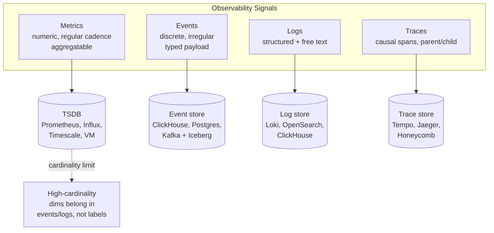
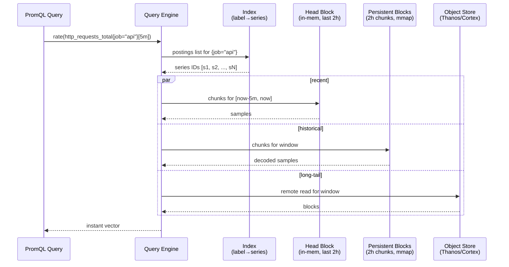
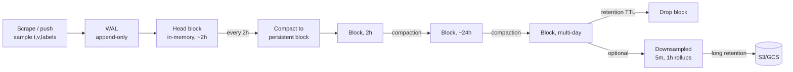
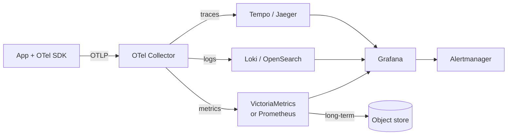

# Time-Series Databases

## Why This Exists

**Problem.** Time-series workloads have a peculiar shape: append-heavy writes (often 100k–10M points/sec), almost-never updates, queries that sweep ranges by timestamp + tags, and data that loses value as it ages. General-purpose OLTP databases (Postgres, MySQL) handle this badly past a certain scale: B-tree indexes bloat, table scans dominate, vacuum can't keep up, and a `WHERE ts BETWEEN ... AND ...` over a billion rows takes minutes. People then "fix" it with manual partitioning and wake up two years later maintaining a half-built TSDB.

**Key insight.** Time is the dominant dimension. Storage layouts that **co-locate points by (series, time)** and apply **delta-of-delta + Gorilla-style compression** to floats reduce on-disk size by 10–30× versus row-oriented storage, and cut hot-path I/O proportionally. Queries are almost always "this series (or set of series) over this time window" — so the access pattern is a 2D scan that columnar/chunked layouts serve directly.

**Reach for this when:**
- You're ingesting metrics/events at >50k points/sec sustained, or expect to within a year.
- Queries are dominated by `time BETWEEN x AND y` plus tag filters and aggregations (`avg`, `rate`, `percentile`).
- Data has natural retention (drop after 30/90/365 days) and you want it cheap to drop.
- You need downsampling (raw 10s → 1m → 1h → 1d) for long-term trend storage.
- Cardinality is bounded and known (hosts × pods × routes × statuses, not user_id × session_id).

**Don't reach for this when:**
- Workload is OLTP — frequent point updates, multi-row transactions, foreign keys, joins to dimensional data.
- Cardinality is unbounded per-user (e.g., `user_id` as a label across 100M users → series explosion).
- You need full-text search or arbitrary secondary indexes — that's Elasticsearch / OpenSearch territory.
- The data is logs with structured fields and free-text bodies — use Loki, OpenSearch, or ClickHouse.
- The data is distributed traces — use Tempo, Jaeger, or a tracing-aware backend, not a metrics TSDB.
- You only have a few thousand points/day — a Postgres table with a BRIN index on `ts` is fine. Don't operationalize complexity you don't need.

## Diagrams

The three signal types and their ideal stores:



Read path inside a TSDB (Prometheus-style):



How a write lands and ages out:



## Storage Internals: Why TSDBs Beat a B-Tree

Three techniques do most of the work. Knowing them tells you why your queries are slow.

**1. Time-partitioned chunks (a.k.a. hypertables, blocks).** Storage is sliced by time window — Prometheus uses 2-hour blocks, TimescaleDB uses configurable chunk_time_interval (default 7 days), InfluxDB uses shards (default 7 days for infinite retention, 1h for short). Queries with a time predicate prune entire chunks before reading any data. The B-tree on `ts` you'd build in vanilla Postgres degenerates as the table grows; chunked storage stays fast because each chunk is small and bounded.

**2. Columnar / chunked encoding.** Inside a chunk, samples for a given series are stored together as `(timestamps[], values[])` arrays. Timestamps compress with **delta-of-delta** (regular cadence → most deltas are zero or tiny), and floats compress with **Gorilla XOR encoding** (Facebook, VLDB 2015) — typically 1.37 bytes per float64 for slowly-changing metrics, vs 16 bytes raw for `(ts, val)`. Column layout also enables vectorized scans. ClickHouse, VictoriaMetrics, and InfluxDB IOx (Apache Arrow / Parquet) take this further with full columnar files.

**3. Inverted index on labels.** A series is identified by its full label set: `http_requests_total{method="GET",route="/checkout",status="200",pod="api-7f9-x2"}`. The TSDB hashes this to a series ID, and maintains posting lists `label=value → [series IDs]` so PromQL filters become set intersections. **This index is the cardinality cliff** — every unique label combination is a new series, a new posting list entry, and memory cost.

```python
# What "high cardinality" actually means.
# Each line below is the same metric, but each unique label set = new series.

http_requests_total{method="GET", status="200"}              # 1 series
http_requests_total{method="GET", status="500"}              # +1
http_requests_total{method="GET", status="200", pod="api-1"} # +1 per pod
# ... × 200 pods × 50 routes × 6 statuses × 3 methods = 180,000 series
# Add user_id as a label across 1M users → 1M × prior = catastrophe.

# Rule of thumb (Prometheus, single instance): keep total active series < 5M.
# Past ~10M, head block memory + index becomes the bottleneck before disk.
```

## The Big Four — Choose Deliberately

### Prometheus

**Model.** Pull-based, single-binary, single-node. Scrapes HTTP `/metrics` endpoints on an interval. Stores locally in TSDB blocks. PromQL is the query language; almost every other tool has copied it.

**Strengths.** Operational simplicity. Service discovery is first-class (Kubernetes, Consul, EC2). Alerting via Alertmanager. The data model and PromQL are the de-facto industry standard.

**Weaknesses.** Single node — no native clustering, HA via run-two-instances + dedupe. Limited long-term storage (local disk only) — needs Thanos, Cortex, Mimir, or remote_write to a backend for >30d retention at scale. Cardinality limits hit hard around 5–10M active series.

```yaml
# prometheus.yml — recording rule that pre-aggregates an expensive query.
# This is how you keep dashboards fast: aggregate at write time, query the rollup.
groups:
  - name: api_slo
    interval: 30s
    rules:
      - record: job:http_request_duration_seconds:rate5m
        expr: |
          sum by (job, route, status_class) (
            rate(http_request_duration_seconds_count[5m])
          )
      # Pre-compute p99 per service so dashboards don't recompute it every refresh.
      - record: job:http_request_duration_seconds:p99_5m
        expr: |
          histogram_quantile(0.99,
            sum by (job, route, le) (rate(http_request_duration_seconds_bucket[5m]))
          )
```

```promql
# Common patterns. Memorize these — they cover 80% of dashboards.

# 1. Per-second rate over 5m. ALWAYS use rate() on counters, never raw values.
rate(http_requests_total{job="api"}[5m])

# 2. Error ratio. Note: numerator and denominator must be label-compatible.
sum by (job) (rate(http_requests_total{status=~"5.."}[5m]))
  /
sum by (job) (rate(http_requests_total[5m]))

# 3. Histogram quantile. The bucket le="..." labels are required.
histogram_quantile(0.99,
  sum by (le, job) (rate(http_request_duration_seconds_bucket[5m]))
)

# 4. Anti-pattern: rate() of a gauge. rate() is for monotonic counters.
# For gauges use deriv() or just the gauge value directly.
```

### InfluxDB

**Model.** Push-based, designed originally for IoT and DevOps. Two major versions to be aware of: **InfluxDB 1.x/2.x** (TSM engine, Flux or InfluxQL) and **InfluxDB 3.x / IOx** (Apache Arrow + Parquet + DataFusion, SQL-first). They are effectively different products with the same brand.

**Strengths (3.x).** Unlimited cardinality is the headline pitch — Parquet + columnar means tag explosions don't blow up an in-memory inverted index the way 1.x/2.x did. SQL via DataFusion. Object-storage-native.

**Weaknesses.** 1.x/2.x had real cardinality limits (similar to Prometheus). Migration story between major versions has been painful. Smaller community than Prometheus. Open-source vs Enterprise feature gating shifts.

```sql
-- InfluxDB 3.x — SQL-style. "Tags" are indexed dimensions, "fields" are values.
SELECT
  date_bin('1 minute', time, TIMESTAMP '1970-01-01') AS minute,
  host,
  avg(usage_user) AS avg_user
FROM cpu
WHERE time >= now() - INTERVAL '1 hour'
  AND region = 'us-east-1'
GROUP BY minute, host
ORDER BY minute;
```

### TimescaleDB

**Model.** Postgres extension. A "hypertable" is a regular Postgres table that's automatically partitioned by time (and optionally by a space dimension like tenant_id) into "chunks". You write SQL. You join to your dimension tables. You use Postgres tooling.

**Strengths.** It's Postgres — full SQL, joins, foreign keys, JSONB, PostGIS, your existing ORM, your existing backup tooling, your existing IAM. "Continuous aggregates" are materialized views that incrementally refresh — the cleanest downsampling story of the four. Compression policies turn old chunks into columnar storage in-place.

**Weaknesses.** Single Postgres node still has Postgres write limits — typically ~1M points/sec on a beefy box, well below VictoriaMetrics or ClickHouse. Multi-node Timescale exists but is operationally heavier. Compressed chunks are read-mostly — late-arriving data into compressed regions is slow.

```sql
-- 1. Create a hypertable. Under the hood this is a parent table + child chunks.
CREATE TABLE metrics (
  time        TIMESTAMPTZ NOT NULL,
  device_id   TEXT NOT NULL,
  metric_name TEXT NOT NULL,
  value       DOUBLE PRECISION
);
SELECT create_hypertable('metrics', 'time', chunk_time_interval => INTERVAL '1 day');

-- 2. Index for typical access pattern: (device_id, time DESC).
-- The DESC matters — most queries want recent data.
CREATE INDEX ON metrics (device_id, time DESC);

-- 3. Continuous aggregate: pre-roll 1m → 1h. Refreshes incrementally.
CREATE MATERIALIZED VIEW metrics_1h
WITH (timescaledb.continuous) AS
SELECT
  time_bucket('1 hour', time) AS bucket,
  device_id,
  metric_name,
  avg(value)    AS avg_value,
  max(value)    AS max_value,
  percentile_cont(0.99) WITHIN GROUP (ORDER BY value) AS p99_value
FROM metrics
GROUP BY 1, 2, 3;

SELECT add_continuous_aggregate_policy('metrics_1h',
  start_offset => INTERVAL '3 hours',
  end_offset   => INTERVAL '1 hour',
  schedule_interval => INTERVAL '30 minutes');

-- 4. Compression policy: compress chunks older than 7 days. ~10-20x size reduction.
ALTER TABLE metrics SET (
  timescaledb.compress,
  timescaledb.compress_segmentby = 'device_id',
  timescaledb.compress_orderby   = 'time DESC'
);
SELECT add_compression_policy('metrics', INTERVAL '7 days');

-- 5. Retention policy: drop chunks older than 90 days. Drop is metadata-only — fast.
SELECT add_retention_policy('metrics', INTERVAL '90 days');
```

### VictoriaMetrics

**Model.** Prometheus-compatible (PromQL → MetricsQL, mostly a superset; remote_write ingestion). Single-binary or clustered. Aggressive engineering for low memory + high ingest.

**Strengths.** 5–10× lower memory than Prometheus for the same workload in published benchmarks. MetricsQL adds genuinely useful operators Prometheus lacks (`keep_last_value`, `histogram_over_time`, `quantiles_over_time`). Cluster mode scales to billions of active series. Very fast query engine.

**Weaknesses.** Smaller ecosystem than Prometheus. MetricsQL is mostly compatible but edge cases differ. Open-source cluster version exists but enterprise features (downsampling, multi-tenant, backups via vmbackup) sit on a license boundary that's worth checking.

```yaml
# VictoriaMetrics single-node, with stream aggregation (downsampling at write time).
# This avoids the cardinality of raw-pod metrics ever entering long-term storage.
# stream-aggregation.config:
- match: 'http_requests_total'
  interval: 1m
  outputs: [total, rate_sum]
  by: [job, route, status]
  # Drops the high-cardinality `pod`, `instance` labels at the aggregation boundary.
```

## Cardinality Control — The #1 Operational Skill

Cardinality is the silent killer. Every TSDB outage post-mortem you'll read mentions it. Treat label values as a budget you spend, not a free dimension.

```python
# Decision rules for what belongs as a label vs a field/event.
# Apply these BEFORE writing instrumentation, not after the OOM.

LABEL_OK = {
    # Bounded, low-cardinality, semantically grouping
    "job", "service", "environment", "region", "az",
    "method",           # GET/POST/... ~ 7
    "status_code",      # ~50 distinct
    "route",            # bounded by code, NOT by user input
}

LABEL_NEVER = {
    # Unbounded — turns metrics into events
    "user_id", "session_id", "request_id", "trace_id",
    "email", "ip_address",          # PII + unbounded
    "url",                          # query strings = infinite
    "error_message",                # contains stack traces, IDs
    "timestamp_string",             # please no
}

# If you need to slice by these, you want EVENTS (ClickHouse, Honeycomb)
# or TRACES (Tempo, Jaeger), not METRICS.
```

```promql
# Diagnose cardinality on Prometheus. Run these regularly.

# Top 20 metric names by series count.
topk(20, count by (__name__) ({__name__=~".+"}))

# Top labels by distinct value count for a specific metric.
count(count by (route) (http_requests_total))

# Total active series.
prometheus_tsdb_head_series

# Rate of series creation (churn). Sustained churn is as bad as raw count —
# every churned series stays in the index until the block is dropped.
rate(prometheus_tsdb_head_series_created_total[5m])
```

**Mitigations, in order of preference:**

1. **Drop the label.** Most "we need to slice by X" turns out to be "we asked for it once". Push X into logs/traces.
2. **Bucket the label.** Instead of `latency_ms`, use histogram buckets (`le="10","50","100",...`). Instead of `customer_id`, use `customer_tier` (free/pro/enterprise — 3 values).
3. **Relabel at scrape time.** Drop labels with `metric_relabel_configs` before they hit storage.
4. **Aggregate at write time.** VictoriaMetrics stream aggregation, Prometheus recording rules with `sum without(pod, instance)`, then drop the raw via remote_write filtering.
5. **Move the metric to events.** If you genuinely need per-user dimensions, you have an event problem, not a metric problem.

## Downsampling and Retention — Don't Hand-Roll This

Resolution decays with age. A typical policy:

| Age           | Resolution | Rationale                                    |
|---------------|------------|----------------------------------------------|
| 0–24h         | raw (10s)  | Live debugging, alert evaluation             |
| 1d–7d         | 1m         | Recent dashboards, postmortems               |
| 7d–90d        | 5m         | Capacity trends, weekly seasonality          |
| 90d–2y        | 1h         | Annual planning, SLO trend lines             |
| 2y+           | drop or 1d | Cost — most signal value is gone             |

```sql
-- TimescaleDB stack: continuous aggregates + retention. The cleanest model.
-- Each higher rollup reads from the layer below, not from raw.

CREATE MATERIALIZED VIEW metrics_5m WITH (timescaledb.continuous) AS
  SELECT time_bucket('5 minutes', time) AS bucket, device_id,
         avg(value) AS avg_v, max(value) AS max_v
  FROM metrics GROUP BY 1, 2;

CREATE MATERIALIZED VIEW metrics_1h WITH (timescaledb.continuous) AS
  SELECT time_bucket('1 hour', bucket) AS bucket, device_id,
         avg(avg_v) AS avg_v, max(max_v) AS max_v
  FROM metrics_5m GROUP BY 1, 2;

-- Different retention per layer.
SELECT add_retention_policy('metrics',     INTERVAL '7 days');
SELECT add_retention_policy('metrics_5m',  INTERVAL '90 days');
SELECT add_retention_policy('metrics_1h',  INTERVAL '2 years');
```

```yaml
# Thanos / Cortex / Mimir handle this via "compactor" downsampling levels:
# raw → 5m → 1h, written as separate blocks in object storage.
# Queries at long ranges automatically read the coarser blocks.
compactor:
  retention:
    raw: 30d
    "5m": 180d
    "1h": 5y
```

**Watch out:** downsampling is **lossy** for percentiles. You cannot average p99 across 1h windows to get a p99 of the day — that's mathematically wrong. Store the full histogram (`_bucket` series) and re-aggregate at query time, or accept that long-range percentiles are approximations. This is the most common subtle bug in long-term metrics.

## Metrics vs Events vs Traces

Conflating these is the most expensive design mistake. They answer different questions.

| Signal     | Question it answers                          | Cardinality budget | Aggregation        |
|------------|----------------------------------------------|--------------------|--------------------|
| **Metrics**| "Is the system healthy? How is it trending?" | Low (hundreds of label combos)| Pre-aggregated counters/gauges/histograms |
| **Events** | "What exactly happened to this entity?"      | High (per-request OK)         | Aggregate at query time |
| **Logs**   | "What did the code print? What failed?"      | Unbounded text                | Search + filter |
| **Traces** | "Where did time go in this request?"         | Per-request, sampled          | Per-trace path + service map |

**Rule of thumb (Charity Majors / Honeycomb school):** if you need to ask "for what value of X did Y happen?", you want events, not metrics. Metrics tell you *that* p99 spiked; events tell you *whose* requests caused it.

```python
# The same incident, viewed three ways:

# Metric (Prometheus): aggregate counter, pre-bucketed
http_request_duration_seconds_bucket{le="1.0", route="/checkout"} 12_343
# → "p99 is 1.2s on /checkout right now"

# Event (ClickHouse, Honeycomb): one row per request, all dimensions
{ts: 1717000000, route: "/checkout", user_id: "u_8821", duration_ms: 4231,
 status: 500, build: "v2.34.1", region: "use1", db_query_count: 47}
# → "all 4s+ requests were user_id u_8821, hitting build v2.34.1, in use1"

# Trace (Tempo, Jaeger): causal tree of spans
checkout_handler [4231ms]
  └─ db.query("SELECT * FROM cart") [3892ms]   ← here's where time went
        └─ pg_lock_wait [3850ms]
# → "the bottleneck is a Postgres lock during cart load"
```

## Production Wiring — A Reference Stack



OTel Collector decouples instrumentation from backend choice — you can swap Prometheus for VictoriaMetrics without touching app code. Always run a collector layer; do not point apps directly at the TSDB.

```yaml
# otel-collector-config.yaml — minimal viable config.
receivers:
  otlp:
    protocols:
      grpc: {endpoint: 0.0.0.0:4317}
      http: {endpoint: 0.0.0.0:4318}

processors:
  batch:
    timeout: 10s
    send_batch_size: 10000
  # Drop high-cardinality labels BEFORE they hit storage.
  attributes/drop_pii:
    actions:
      - {key: user.email,  action: delete}
      - {key: http.url,    action: delete}    # keep http.route instead
      - {key: client.ip,   action: delete}
  memory_limiter:
    check_interval: 1s
    limit_mib: 1500

exporters:
  prometheusremotewrite:
    endpoint: http://victoriametrics:8428/api/v1/write
    resource_to_telemetry_conversion: {enabled: true}

service:
  pipelines:
    metrics:
      receivers:  [otlp]
      processors: [memory_limiter, attributes/drop_pii, batch]
      exporters:  [prometheusremotewrite]
```

## Trade-offs

| Benefit                                                 | Cost / What you give up                                                            |
|---------------------------------------------------------|-------------------------------------------------------------------------------------|
| 10–30× compression vs row-store                         | Append-mostly model — updates and deletes are slow or unsupported                  |
| Sub-second range scans over billions of points          | Cardinality cliff — one bad label can OOM the whole instance                       |
| Built-in retention/downsampling                         | Lossy aggregation — long-range percentiles become approximations                   |
| PromQL/MetricsQL: powerful for time-shaped queries      | No joins, weak relational ops — you can't ask "join metrics with users table"      |
| Pull model (Prometheus) gives free service health check | Doesn't fit batch jobs, serverless, short-lived workloads — need pushgateway shim  |
| Push model (Influx, OTel) fits any topology             | You own backpressure, retries, batching at the client                              |
| Single-binary deployment (Prom, VM)                     | Single-node ceiling — HA is run-two-and-dedupe, not real clustering                |
| Postgres-native (Timescale)                             | Inherits Postgres write ceiling (~1M pts/sec on big iron)                          |
| Object-storage tier (Thanos, Mimir, Influx 3.x)         | Cold-query latency goes from ms to seconds; complex caching layer to operate       |
| Recording rules / continuous aggregates speed dashboards| Schema coupling — change a label, rebuild the rollup; storage cost for the rollups |

## Common Pitfalls

- **Putting `user_id` as a metric label.** Classic. The dashboard works for a week with 100 test users, then prod ships and the head block OOMs. If you need per-user data, that's events. Always.
- **`rate()` on a gauge in Prometheus.** `rate()` assumes a monotonic counter and treats decreases as resets. Use `deriv()` for gauges or just plot the gauge.
- **Averaging percentiles across windows.** Mathematically meaningless. Either compute the percentile from the underlying histogram at query time, or store the histogram itself.
- **Letting clocks drift.** Out-of-order writes past the head block are rejected by Prometheus and slow in Timescale (compressed chunks). NTP everywhere; assert clock skew in alerts.
- **Scraping `/metrics` from a load balancer.** You'll alternate between hosts on each scrape, so each "host" series is incoherent. Scrape pods/instances directly via service discovery.
- **Building dashboards on raw counters.** A graph of `http_requests_total` is meaningless — it grows forever, restarts on deploy. Always wrap in `rate()` or `increase()`.
- **No retention policy on day one.** Disks fill silently, then ingestion fails, then alerting goes dark, then you find out from customers. Set retention before first write.
- **Using a TSDB for billing-grade counters.** TSDBs lose data on restart (head block before WAL replay), drop on out-of-order, sample on scrape. **Billing must be event-sourced** — Kafka + a transactional store. Metrics are observability, not accounting.
- **Re-using the same label name with different cardinalities across services.** `pod` in one job is bounded; `pod` in a serverless one churns hourly. The TSDB sees one global label namespace — high churn from one source pollutes everyone's index.
- **Forgetting that recording rules cost ingest.** Each rule evaluation produces new series. A poorly-aggregated rule can double your active series.
- **Querying `[1d]` ranges over 5s-resolution data without downsampling.** That's 17,280 points per series × thousands of series, computed on the fly, every dashboard refresh.
- **Treating Prometheus HA as "real" HA.** Two Prometheis scrape the same targets independently — they will *not* agree to the sample. Dedup happens at the query layer (Thanos Querier, Promxy) or at remote_write fan-in. Plan for it.

## Decision Table

| If you need...                                              | Use                              | Don't use                          |
|-------------------------------------------------------------|----------------------------------|-------------------------------------|
| Kubernetes-native, alerting-centric, <10M series            | **Prometheus** + Alertmanager    | InfluxDB 1.x (cardinality), Timescale (writes) |
| Same as above but RAM-tight or 10–100M series               | **VictoriaMetrics**              | Prometheus single-node              |
| Long-term (years), object-storage-backed, multi-tenant      | **Mimir / Thanos / Cortex**      | Local-disk Prometheus               |
| You already run Postgres, want SQL + joins, <1M pts/sec     | **TimescaleDB**                  | Prometheus (no joins)               |
| Unbounded cardinality, SQL, columnar, IoT                   | **InfluxDB 3.x** or **ClickHouse**| Prometheus, InfluxDB 1.x/2.x       |
| Per-request, high-cardinality, "what value of X" queries    | **ClickHouse / Honeycomb / events** | Any TSDB                          |
| Distributed traces                                          | **Tempo / Jaeger**               | Any TSDB                            |
| Logs                                                        | **Loki / OpenSearch / ClickHouse**| Any TSDB                           |
| Billing, audit, exact counts                                | **Postgres + Kafka + ledger**    | Any TSDB                            |
| <10k points/sec, simple analytics                           | **Postgres with BRIN on `ts`**   | Don't over-engineer                 |
| AWS-native managed                                          | **Amazon Managed Prometheus** or **Timestream** | Roll your own at small scale |

## References

- Tobias Pfeiffer et al. — *Gorilla: A Fast, Scalable, In-Memory Time Series Database (Facebook, VLDB 2015)* — http://www.vldb.org/pvldb/vol8/p1816-teller.pdf
- Prometheus team — *Prometheus Storage / TSDB internals* — https://prometheus.io/docs/prometheus/latest/storage/
- Björn Rabenstein, Julius Volz — *Prometheus: A Next-Generation Monitoring System* (SREcon EU 2015) — https://www.usenix.org/conference/srecon15europe/program/presentation/rabenstein
- Fabian Reinartz — *Writing a Time Series Database from Scratch* — https://fabxc.org/tsdb/
- TimescaleDB — *Hypertables, chunks, continuous aggregates, compression docs* — https://docs.timescale.com/
- VictoriaMetrics — *Architecture and FAQ* — https://docs.victoriametrics.com/
- InfluxData — *InfluxDB 3.0 Storage Engine (IOx) — Apache Arrow + Parquet + DataFusion* — https://www.influxdata.com/blog/influxdb-3-0-system-architecture/
- Google SRE Workbook — *Ch. 4: Monitoring* — https://sre.google/workbook/monitoring/
- Google SRE Book — *Ch. 6: Monitoring Distributed Systems* — https://sre.google/sre-book/monitoring-distributed-systems/
- AWS Builders' Library — *Instrumenting distributed systems for operational visibility* — https://aws.amazon.com/builders-library/instrumenting-distributed-systems-for-operational-visibility/
- Charity Majors — *Observability: A 3-Year Retrospective (events vs metrics)* — https://www.honeycomb.io/blog/observability-3-year-retrospective
- Brendan Gregg — *USE Method* — https://www.brendangregg.com/usemethod.html
- Tom Wilkie — *RED Method* — https://thenewstack.io/monitoring-microservices-red-method/
- OpenTelemetry — *Specification: metrics data model* — https://opentelemetry.io/docs/specs/otel/metrics/data-model/
- DDIA (Kleppmann) — Ch. 3 *Storage and Retrieval* (LSM trees, SSTables — applicable to TSDB write paths) and Ch. 11 *Stream Processing*
- Pat Helland — *Immutability Changes Everything* — https://queue.acm.org/detail.cfm?id=2884038

## See Also

- `../../performance/tracing/` — when you need causal request paths, not aggregates
- `../olap-warehouse/` — when long-retention analytical queries beat time-series engines.
- `../partitioning/` — time-based partition pruning is what makes TS DBs fast.
- `../indexing/` — inverted indexes on tags/labels for high-cardinality series.
- `../../performance/use-red-methods/` — RED/USE metric collection patterns.
- `../../reliability/observability/` — Prometheus/M3/VictoriaMetrics in production.
- `../stream-processing/` — Kafka -> downsampling -> TS DB ingest pipelines.
