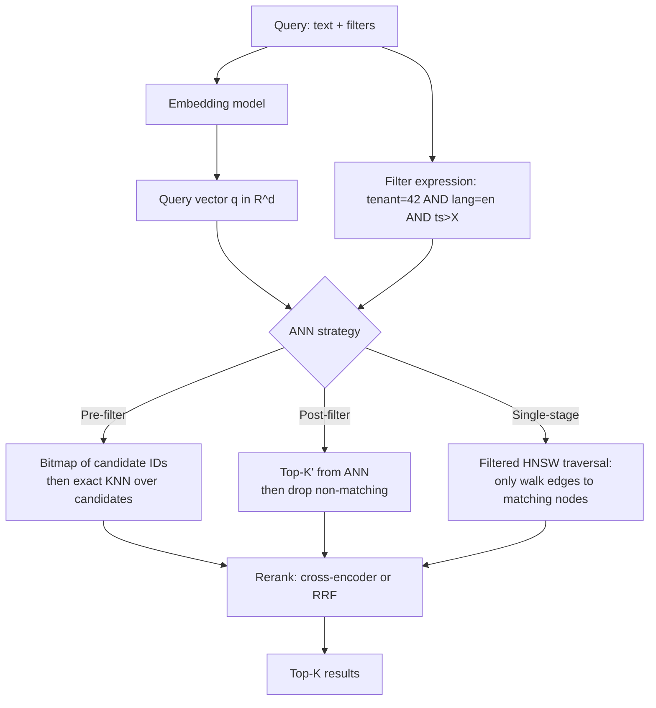
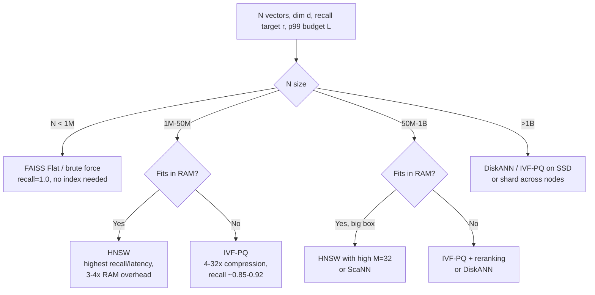

# Vector Databases

## Why This Exists

**Problem.** You have N million embeddings (768d, 1536d, 3072d…) and need top-K nearest neighbors in <100ms p99 with recall ≥ 0.9 — while *also* filtering by tenant, language, recency, ACL, and a half dozen other predicates that change per query. Brute-force cosine over 50M vectors is O(N·d) and costs ~30s/query on a single core. You need an **approximate nearest neighbor (ANN)** index, but every index trades recall, latency, build time, memory, and update cost differently.

**Key insight.** Vector databases are not magic — they are **specialized indexes** (HNSW, IVF-PQ, ScaNN, DiskANN) wrapped in a query engine that fuses ANN with metadata filtering. The interesting choices are:

1. **Index family** (graph vs partition vs quantization) — determines recall/latency/memory curve.
2. **Pre-filter vs post-filter vs single-stage filter** — determines correctness under high-selectivity predicates.
3. **Where the index lives** (in your OLTP DB vs a dedicated service) — determines operational and consistency cost.

Most teams don't need a dedicated vector DB. **pgvector with HNSW handles tens of millions of vectors fine** if your workload fits Postgres. The need for Pinecone/Qdrant/Milvus emerges at 100M+ vectors, multi-tenant isolation at scale, or when you need GPU-accelerated indexing/search.

**Reach for this when:**
- Building RAG, semantic search, recommendations, dedup, anomaly detection, or any retrieval over learned representations.
- ANN recall is below your eval target and you need to tune `M`, `efConstruction`, `efSearch`, `nprobe`, or `pq_m`.
- Choosing between embedding-in-Postgres vs a dedicated vector store.
- Hybrid search (BM25 + vector, or vector + structured filters) returns wrong/missing results.
- ANN p99 latency or memory blew up after data grew.

**Don't reach for this when:**
- You have <1M vectors and brute force in NumPy / FAISS-Flat takes <50ms — **just do that**. ANN is overhead until scale demands it.
- The retrieval problem is actually keyword-shaped (exact product codes, SKUs, error codes) — use BM25/Elasticsearch/Postgres FTS.
- Embeddings change daily for the entire corpus — your bottleneck is the **embedding pipeline**, not the index.
- You think "vector DB" means "magic semantic layer." It doesn't. Garbage embeddings produce garbage retrieval at any scale.

## Diagrams

### Anatomy of an ANN query with metadata filtering



### Index family decision



## Distance Metrics

The metric must match how the embedding model was trained. **Mismatch silently degrades recall by 20-40%.**

| Metric          | Formula                                 | When to use                                                                                          |
|-----------------|-----------------------------------------|------------------------------------------------------------------------------------------------------|
| **Cosine**      | `1 - (a·b) / (‖a‖·‖b‖)`                 | OpenAI text-embedding-3, BGE, E5, most sentence-transformers. Length-invariant.                      |
| **Dot product** | `-(a·b)`                                | When vectors are already L2-normalized (then dot = cosine, faster). Some BERT variants.              |
| **L2 / Euclidean** | `√Σ(aᵢ-bᵢ)²`                         | Image embeddings (CLIP image side), some legacy models. Sensitive to magnitude.                      |
| **Inner product (IP)** | `-a·b` (un-normalized)            | Recommendation models trained with dot-product objectives (e.g., two-tower retrieval).               |

```python
# If your model docs say "use cosine" and you've L2-normalized at write time,
# dot product gives identical ranking and is ~20% faster on most indexes.
import numpy as np

def normalize(v: np.ndarray) -> np.ndarray:
    n = np.linalg.norm(v, axis=-1, keepdims=True)
    return v / np.clip(n, 1e-12, None)  # avoid div-by-zero on empty strings

# Pre-normalize once on write. Then use IP (inner product) at query time.
embeddings = normalize(model.encode(docs))  # store these
```

## ANN Index Families

### HNSW (Hierarchical Navigable Small World)

Multi-layer graph; each layer is a navigable small-world graph with progressively fewer nodes. Search greedily descends from top to bottom. **Default choice when data fits in RAM.**

Key parameters:
- `M` (16-64): max connections per node. Higher = better recall, more memory (linear).
- `efConstruction` (100-500): candidate list size at build. Higher = better graph, slower build.
- `efSearch` (M to 500): runtime candidate list. **Tune this per query** — most levers live here.

```sql
-- pgvector HNSW (requires pgvector >= 0.5.0)
CREATE INDEX docs_embedding_hnsw_idx
  ON docs USING hnsw (embedding vector_cosine_ops)
  WITH (m = 16, ef_construction = 200);

-- Per-query knob
SET hnsw.ef_search = 100;  -- raise to ~200-400 if recall < target
SELECT id, content
FROM docs
WHERE tenant_id = $1
ORDER BY embedding <=> $2  -- <=> is cosine distance
LIMIT 20;
```

**HNSW gotchas:**
- Memory ≈ `(d * 4 bytes + M * 8 bytes * 1.5) * N`. A 768d corpus with 10M vectors and M=16 needs ~32 GB just for the index.
- Build is single-threaded per index in many implementations (pgvector parallelizes since 0.6, but it's still I/O heavy).
- **Updates degrade graph quality over time** — long-running indexes with heavy churn need periodic rebuilds.
- HNSW does not support efficient deletes well. pgvector tombstones; Qdrant uses a vacuum-style optimizer.

### IVF (Inverted File Index)

Cluster vectors into `nlist` Voronoi cells via k-means. At query time, search the `nprobe` closest cells only.

- `nlist`: typically `√N` to `4√N`. 1M vectors → ~1k-4k cells.
- `nprobe`: 1-50. Higher = better recall, linear cost. Critical recall lever.

```sql
-- pgvector IVFFlat
CREATE INDEX docs_embedding_ivf_idx
  ON docs USING ivfflat (embedding vector_cosine_ops)
  WITH (lists = 1000);  -- ~sqrt(N) for N=1M

SET ivfflat.probes = 10;  -- recall lever; 10 = covers most relevant cells for 1k lists
```

**IVF vs HNSW tradeoff:** IVF builds faster, uses less memory, but recall plateaus lower. IVFFlat at 10M vectors with `nprobe=20` typically hits recall@10 ≈ 0.85-0.90; HNSW with `efSearch=100` hits 0.95+. **For pgvector, prefer HNSW unless build time or RAM forces IVF.**

### IVF-PQ (Product Quantization)

Each vector gets split into `m` sub-vectors; each sub-vector is quantized to one of 256 (`nbits=8`) centroids. A 768d float32 vector (3072 bytes) compresses to 96 bytes (32x). Distance becomes a sum of precomputed sub-distance tables.

```python
# FAISS IVF-PQ — the canonical setup for billion-scale
import faiss

d = 768
nlist = 4096            # ~4*sqrt(N) for N~1M; tune up for larger N
m = 96                  # PQ subquantizers; d must be divisible by m (768/96=8)
nbits = 8               # 8 bits/subvector → 256 centroids/subspace

quantizer = faiss.IndexFlatIP(d)              # coarse quantizer for IVF
index = faiss.IndexIVFPQ(quantizer, d, nlist, m, nbits)
index.train(training_sample)                  # need >= ~30*nlist vectors to train well
index.add(corpus)
index.nprobe = 32

# IVF-PQ recall is bounded by quantization error.
# Mitigation: re-rank top ~200 candidates with exact float distances.
D, I = index.search(query, k=200)
exact = float_corpus[I[0]] @ query.T          # exact rerank
top_k = I[0][np.argsort(-exact)[:10]]
```

**When to reach for IVF-PQ:**
- 100M+ vectors and RAM is the constraint.
- You can tolerate recall@10 of 0.85-0.92 *before* reranking.
- You have a reranker (cross-encoder or exact-distance rescore) for the final top-K.

### ScaNN (Google)

Hybrid: IVF-style partitioning + anisotropic vector quantization (AVQ). AVQ minimizes quantization error in the *direction of high-similarity pairs*, so it preserves ranking better than vanilla PQ at the same compression. Used internally for Google search retrieval. Available as an open-source library and inside Vertex AI Matching Engine.

### DiskANN

Graph index designed for SSD residency. Stores the graph + raw vectors on disk; only a small in-memory cache. Good when N > 1B and you cannot afford RAM. Used by Milvus and Azure Cognitive Search. Trade-off: SSD IOPS becomes the bottleneck — tune `search_list_size` to balance latency vs disk reads.

## Hybrid Search: Vector + Filters

The hard problem in production. Three strategies, three failure modes:

### 1. Post-filter (naive, broken under high selectivity)

```python
# Get top-1000 from ANN, then filter. WRONG when filter is very selective.
candidates = index.search(q, k=1000)
results = [c for c in candidates if c.tenant_id == 42][:10]
# If tenant 42 owns 0.1% of vectors, you'll get ~1 result instead of 10.
```

### 2. Pre-filter with bitmap

```python
# Build candidate set first, then ANN search restricted to it.
# Qdrant, Weaviate, Milvus all support this via payload indexes.
candidate_ids = payload_index.lookup(tenant_id=42)  # bitmap of N_match IDs
# Then either: brute-force over candidates (good when N_match is small)
#         or:  filtered HNSW traversal (good when N_match is large)
```

Qdrant's docs are explicit about this: it picks pre-filter automatically when filter selectivity drops below a threshold (configurable). Above the threshold, it does single-stage filtered HNSW.

### 3. Single-stage filtered HNSW

The graph traversal **only follows edges to nodes matching the filter**. Requires the graph to remain navigable under the filter — Qdrant adds extra edges at index build time for known-popular filters; Weaviate and recent pgvector versions do similar tricks.

```python
# Qdrant — single API for hybrid
from qdrant_client import QdrantClient
from qdrant_client.models import Filter, FieldCondition, MatchValue, SearchParams

client.search(
    collection_name="docs",
    query_vector=q.tolist(),
    query_filter=Filter(must=[
        FieldCondition(key="tenant_id", match=MatchValue(value=42)),
        FieldCondition(key="lang", match=MatchValue(value="en")),
    ]),
    search_params=SearchParams(hnsw_ef=128, exact=False),
    limit=20,
)
```

### BM25 + vector fusion (lexical + semantic)

Pure semantic search misses exact matches (product codes, names, error strings). Pure BM25 misses paraphrases. Fuse them with **Reciprocal Rank Fusion (RRF)**:

```python
def rrf(rankings: list[list[str]], k: int = 60) -> list[tuple[str, float]]:
    """Rankings is a list of ranked-ID lists from each retriever.
    k=60 is the original paper default; raising k flattens the curve."""
    scores: dict[str, float] = {}
    for ranking in rankings:
        for rank, doc_id in enumerate(ranking):
            scores[doc_id] = scores.get(doc_id, 0.0) + 1.0 / (k + rank + 1)
    return sorted(scores.items(), key=lambda x: -x[1])

# Use case: query Postgres FTS and pgvector in parallel, fuse top-50 each.
fused = rrf([bm25_top50, vector_top50])[:20]
```

Weaviate has hybrid search built in (`alpha` parameter blends BM25 and vector). Elasticsearch 8.x added native hybrid via RRF. For pgvector, you implement RRF in app code over a `UNION` query.

## When pgvector beats a dedicated vector DB

This is the question every team asks. The honest answer:

**Use pgvector when:**
- Your existing system of record is Postgres and the vector data has tight relational/transactional ties.
- N < ~50M vectors *and* you can fit the HNSW index in RAM (rule of thumb: ~5 GB per 1M 768d vectors at M=16).
- You need ACID guarantees joining vectors with rows (e.g., delete a user → delete their embeddings atomically).
- Your team's operational competence is Postgres, not a new distributed system.
- Filters are highly selective and align with existing Postgres B-tree/GIN indexes.

**Outgrow pgvector when any of these become true:**
- You hit 100M+ vectors and HNSW build time crosses your RPO.
- You need GPU-accelerated indexing (Milvus + RAFT, or Pinecone managed).
- You need horizontal sharding of the vector index across nodes (pgvector + Citus exists but is rough at scale).
- You need sub-10ms p99 ANN latency at >1k QPS — dedicated vector engines have tighter loops and zero-copy paths.
- You have multi-tenant isolation requirements that map cleanly to collections/namespaces (Pinecone, Qdrant collections).
- You need ANN over images/audio at billion scale — consider Milvus or Vespa.

**Concrete failure mode:** A team I've seen tried pgvector at 200M vectors with IVFFlat. Build took 14 hours, recall was 0.78, and the index didn't fit on the primary's RAM, so every query hit disk. They moved to Qdrant on the same hardware footprint and got recall 0.95 at 5ms p99. The right move at that scale.

**Concrete success mode:** A 30M-doc internal RAG system on pgvector with HNSW (M=24, efConstruction=400). p95 = 35ms, recall@10 ≈ 0.94 measured on a 5k-query gold set. Total infra: one db.r6g.4xlarge replica. They considered Pinecone; the proposal was rejected because Postgres already held the source-of-truth documents and ACID delete-cascade mattered.

## Cost Models (rough, 2024-2025)

| Option                    | Cost shape                                                | When it bites                                               |
|---------------------------|-----------------------------------------------------------|-------------------------------------------------------------|
| **pgvector self-hosted**  | EC2 + EBS. ~$0.20/GB-month storage; CPU-bound queries.    | Hidden cost is engineer time on backups, replication, vacuum. |
| **RDS / Aurora pgvector** | RDS pricing + storage. ~2-3x EC2 baseline.                | I/O charges add up on heavy ANN workloads.                  |
| **Pinecone**              | Per-pod-hour. p1.x1 ~$70/mo per pod; capacity = ~1M vectors per pod. | Bill scales linearly with corpus size *and* replicas. Multi-tenant isolation requires namespaces — not separate billing. |
| **Qdrant Cloud**          | Per-cluster-hour, RAM-driven. Cheaper than Pinecone at equivalent scale. | You're responsible for capacity planning.                   |
| **Weaviate Cloud**        | Per-cluster, with serverless option.                     | Hybrid search and modules add cost overhead.                |
| **Milvus (Zilliz Cloud)** | Per-CU-hour, separates compute from storage.             | Cold collections still incur storage cost; cold-start latency on first query. |
| **Chroma**                | Open source; embed in app or self-host.                  | Operational maturity is the cost — don't run it for production-critical at scale yet. |

**Rule of thumb cost comparison at 50M vectors, 768d, 100 QPS:**
- pgvector on r6g.4xlarge replica: ~$700/mo all-in.
- Qdrant Cloud equivalent: ~$1500-2500/mo.
- Pinecone (50 p1.x1 pods + replicas): ~$5000+/mo.

The premium for managed vector DBs buys you operational simplicity, sharding, and feature velocity (filters, hybrid, MMR, ACL). Pay it when those matter; don't pay it for a 5M-doc internal tool.

## Production Patterns

### Index build offline, swap atomically

```python
# Don't rebuild HNSW in-place under live traffic. Build a new index, then swap.
# Pattern: write to two collections during cutover; switch reads via feature flag.
new_collection = f"docs_v{int(time.time())}"
client.create_collection(new_collection, vectors_config=...)
client.upload_collection(new_collection, vectors=batch, payload=meta)
# Validate recall on a holdout query set BEFORE switching reads
assert eval_recall_at_10(new_collection, gold_set) >= 0.92
flip_alias("docs_live", new_collection)
client.delete_collection(old_collection)
```

### Reranking pipeline

ANN gives you candidates; a cross-encoder gives you the order. Even at 50ms reranking budget, top-K quality often jumps 10-20 points NDCG.

```python
# 1. ANN: cheap, ~5ms, top-100
candidates = vector_db.search(query_emb, k=100, filters=...)

# 2. Cross-encoder rerank: ~30ms for 100 pairs on a single GPU
pairs = [(query_text, doc.text) for doc in candidates]
scores = cross_encoder.predict(pairs)  # e.g., bge-reranker-base, ms-marco-MiniLM
ranked = [c for _, c in sorted(zip(scores, candidates), reverse=True)]

# 3. Optional: MMR (Maximum Marginal Relevance) for diversity
final = mmr(ranked, lambda_mult=0.7, k=10)
```

### Recall measurement (the part most teams skip)

```python
# Build a gold set: ~500-2000 (query, relevant_doc_ids) pairs from real users.
# Run it weekly. Alert if recall@10 drops > 2 points.
def recall_at_k(retrieved: list[list[str]], gold: list[set[str]], k: int) -> float:
    hits = sum(len(set(r[:k]) & g) > 0 for r, g in zip(retrieved, gold))
    return hits / len(gold)

# Without this, you have no idea if your index changes regress quality.
```

## Trade-offs

| Benefit                                       | Cost                                                                 |
|-----------------------------------------------|----------------------------------------------------------------------|
| HNSW: highest recall/latency efficiency        | 3-4x RAM vs raw vectors; slow build; hard to delete                  |
| IVF-PQ: 32x compression, billion-scale         | Recall ceiling ~0.90 without rerank; needs training set              |
| Pre-filter hybrid: correct on selective filters | Needs payload indexes; planner can pick wrong strategy               |
| pgvector: ACID, no new system                  | Single-node ceiling; HNSW build single-threaded historically         |
| Pinecone: zero ops, fast time to first query   | Per-pod billing scales fast; vendor lock-in on filter syntax         |
| Qdrant: best filter integration in OSS         | You operate it; smaller ecosystem than Postgres                      |
| Reranking: +10-20 NDCG points                  | +30-100ms latency; needs GPU for high QPS                            |
| Cosine over normalized dot product             | Negligible quality difference, ~20% slower at query                  |

## Common Pitfalls

- **Distance metric mismatch.** Model trained with cosine, index built with L2. Recall silently halves. **Always check the model card.**
- **Forgetting to L2-normalize.** OpenAI embeddings come pre-normalized; many open-source models do not. Mixing pre/post-norm in the same index destroys ranking.
- **Single shared index for multi-tenant data.** A query for tenant A walks the graph through tenant B's vectors, leaks via timing, and post-filter drops correct results. Use **namespaces/collections per tenant** or rely on a vector DB with proper filtered HNSW.
- **`efSearch` set once and forgotten.** Recall target is per-query type; one-shot factoid queries can use lower `ef` than long analytical queries.
- **No recall eval.** "It seems to work" is not a measurement. Build a 500+ query gold set with relevance judgments before launch.
- **Embedding model upgrades without reindex.** New model produces vectors in a different space. You must reindex everything; mixing old and new embeddings destroys retrieval.
- **Top-K too small for downstream LLM.** RAG with K=3 misses recall. Try K=20-50, then rerank to top-5.
- **Ignoring chunking.** A 50-page PDF as one embedding is mush. Recursive 500-token chunks with 50-token overlap is the boring-but-correct default.
- **HNSW under heavy churn.** Delete-heavy workloads bloat the graph with tombstones. Schedule rebuilds (Qdrant has an optimizer; pgvector requires REINDEX or new index swap).
- **IVF training on biased sample.** Train on a sample that misses entire clusters → those queries become recall holes. Sample uniformly at random from production.
- **Pre-filter on unindexed payload field.** Filter scan dominates ANN time. Always index payload fields used in filters.
- **Pinecone "namespace" assumed to mean isolated index.** Namespaces share the underlying pod; one tenant's load can affect another's tail latency. Use separate indexes for hard isolation.

## Decision Table

| Situation                                                    | Use                                                | Don't use                                       |
|--------------------------------------------------------------|----------------------------------------------------|-------------------------------------------------|
| <1M vectors, latency lax                                     | FAISS Flat in-process or pgvector no index         | Pinecone (overkill)                             |
| 1-50M vectors, Postgres-shaped data, strong filters          | **pgvector HNSW**                                  | Pinecone (cost), Chroma (maturity)              |
| 50-500M vectors, need ops simplicity, $$ available           | Pinecone or Qdrant Cloud                           | pgvector (ceiling), self-hosted Milvus (ops)    |
| Billion+ vectors, GPU available                              | Milvus with RAFT, or Vespa                         | pgvector, Chroma                                |
| Heavy filtered hybrid search, OSS preference                 | Qdrant or Weaviate                                 | pgvector pre-0.7                                |
| Lexical-heavy domain (codes, IDs, names)                     | Elasticsearch + RRF with vectors                   | Pure vector search                              |
| Tight RAM, can tolerate ~0.88 recall + rerank                | IVF-PQ (FAISS, Milvus)                             | HNSW at full precision                          |
| Frequent full re-embed (model upgrades monthly)              | Anything with cheap rebuild + alias swap (Qdrant, Weaviate) | Anything where rebuild needs days       |
| Strict transactional guarantees with relational data         | pgvector                                           | All managed vector DBs                          |
| Image/audio embedding store at scale                         | Milvus, Vespa                                      | pgvector (RAM ceiling)                          |
| Prototype / notebook                                         | Chroma or FAISS                                    | Pinecone (cost), pgvector (setup)               |

## References

- Malkov & Yashunin — *Efficient and robust approximate nearest neighbor search using HNSW graphs* (2016) — https://arxiv.org/abs/1603.09320
- Jégou, Douze, Schmid — *Product Quantization for Nearest Neighbor Search* (2011) — https://hal.inria.fr/inria-00514462v2/document
- Guo et al. (Google) — *Accelerating Large-Scale Inference with Anisotropic Vector Quantization* (ScaNN, 2020) — https://arxiv.org/abs/1908.10396
- Subramanya et al. (Microsoft) — *DiskANN: Fast Accurate Billion-point Nearest Neighbor Search on a Single Node* (2019) — https://www.microsoft.com/en-us/research/publication/diskann-fast-accurate-billion-point-nearest-neighbor-search-on-a-single-node/
- Johnson, Douze, Jégou — *Billion-scale similarity search with GPUs* (FAISS paper, 2017) — https://arxiv.org/abs/1702.08734
- Cormack, Clarke, Büttcher — *Reciprocal Rank Fusion outperforms Condorcet and individual Rank Learning Methods* (2009) — https://plg.uwaterloo.ca/~gvcormac/cormacksigir09-rrf.pdf
- pgvector docs — https://github.com/pgvector/pgvector
- Qdrant — Filtrable HNSW design — https://qdrant.tech/articles/filtrable-hnsw/
- Weaviate — Hybrid search — https://weaviate.io/developers/weaviate/search/hybrid
- Pinecone — Architecture overview — https://www.pinecone.io/learn/series/faiss/
- Milvus — Knowhere & RAFT integration — https://milvus.io/docs
- ann-benchmarks.com — reproducible ANN benchmarks across libraries — https://ann-benchmarks.com/
- Kleppmann — *Designing Data-Intensive Applications* — ch. 3 (storage & retrieval) for index trade-offs context.
- Google SRE Workbook — ch. 4 (SLO engineering) — https://sre.google/workbook/implementing-slos/ — for setting recall and latency SLOs.
- AWS Builders' Library — *Caching challenges and strategies* — https://aws.amazon.com/builders-library/caching-challenges-and-strategies/ — relevant for query result caching atop ANN.
- Lewis et al. — *Retrieval-Augmented Generation for Knowledge-Intensive NLP Tasks* (RAG paper, 2020) — https://arxiv.org/abs/2005.11401
- Karpukhin et al. — *Dense Passage Retrieval for Open-Domain QA* (DPR, 2020) — https://arxiv.org/abs/2004.04906

## See Also

- `../../performance/caching/` — caching ANN results by query embedding hash for hot queries.
- `../partitioning/` — when single-node vector indexes hit the ceiling.
- `../../security/multi-tenancy/` — namespace vs collection isolation in shared vector stores.
- `../search-engine/` — hybrid BM25 + vector ranking with reciprocal rank fusion.
- `../indexing/` — IVF/HNSW/PQ trade-offs in detail.
- `../../interview-templates/recommendation-system/` — production embedding-store integration.
- `../../performance/batching/` — embed and upsert batches to amortize the index update cost.
