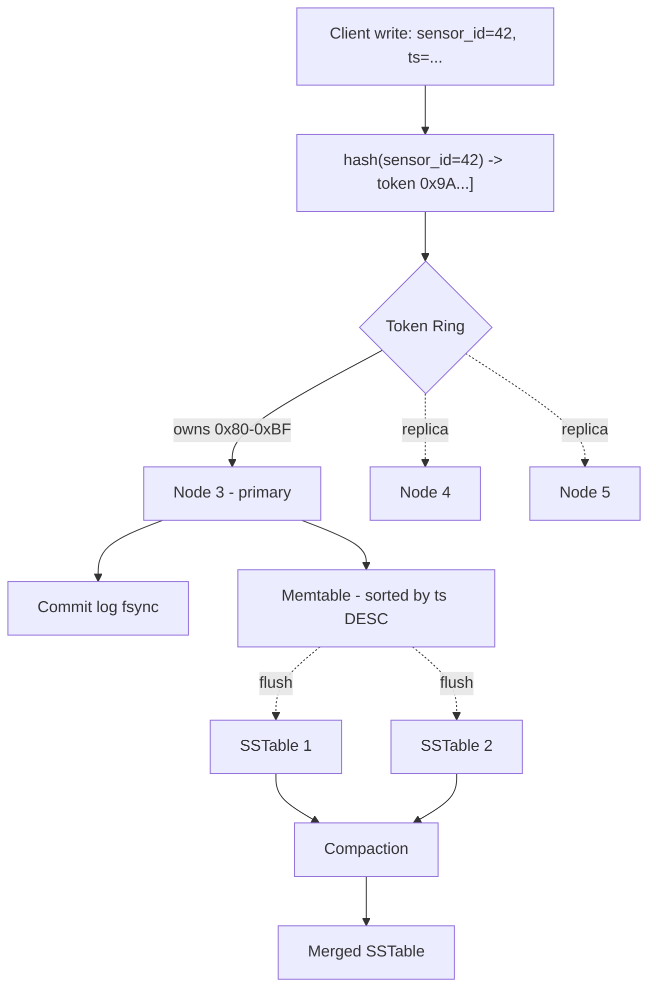
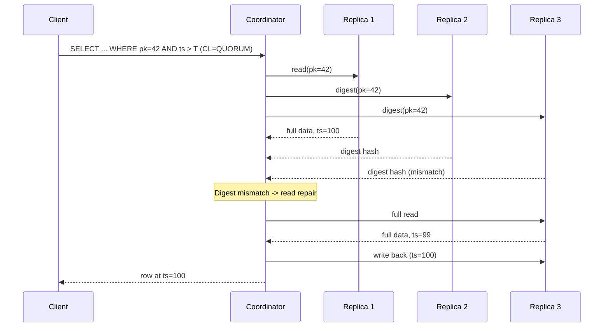
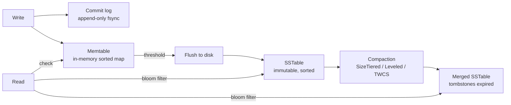

# Wide-Column Stores

## Why This Exists

**Problem.** Relational databases assume the disk is fast, the schema is fixed, and joins are cheap. At write rates above ~50k/sec sustained, with rows that always arrive append-only (sensor readings, audit events, page views, message feeds), Postgres/MySQL hit a wall: B-tree page splits thrash, vacuum can't keep up, replicas lag, and you can't scale writes by adding read replicas. Sharding manually re-introduces every distributed-systems problem you were avoiding.

**Key insight.** If your access pattern is "give me the last N events for this entity, ordered by time" — and you know the entity ID at query time — you don't need a B-tree, you don't need joins, and you don't need a single leader. You need a **distributed sorted map**: hash the entity to a node (partition key), sort on disk by time (clustering key), replicate N ways, let any replica accept writes (Dynamo-style) or coordinate through a single tablet server (Bigtable-style). Writes go to a commit log + memtable (O(1) amortized), reads scan a contiguous slice.

That is the **wide-column** model: a two-level key — `(partition_key, clustering_key) → cell map` — sharded by hash of the partition key, sorted by clustering key inside the partition. Cassandra, ScyllaDB (C++ rewrite of Cassandra), HBase (open-source Bigtable), and Google Cloud Bigtable all implement variations of this.

### Reach for this when

- **Write-heavy time-series**: IoT telemetry, metrics, financial ticks, clickstream — millions of writes/sec, queries always scoped to a known entity + time range.
- **Audit logs, event logs, message feeds**: append-only, queried by `(user_id, since=timestamp)`.
- **Predictable scale**: you can add nodes linearly and writes/reads scale near-linearly. Operations stay O(1) regardless of dataset size.
- **Multi-region active-active**: Cassandra/Scylla handle this natively with `LOCAL_QUORUM` + cross-DC replication; no leader election to babysit.
- **High availability over consistency**: AP system — a partition won't take you down, you tune consistency per query.
- **Known query patterns at design time**: you can enumerate the questions you'll ask before you create the table.

### Don't reach for this when

- **You need joins, GROUP BY, or ad-hoc queries.** Use Postgres, BigQuery, or a search index. Wide-column has no query planner.
- **You need strong ACID across multiple rows.** Lightweight transactions (LWT) exist but are 4× slower and not multi-row. Use Spanner, CockroachDB, or Postgres.
- **Your data is small (< 100 GB) and writes are < 10k/sec.** A managed Postgres handles this with a fraction of the operational cost.
- **Access patterns are unknown or changing weekly.** You'll rewrite the schema each time. Use a document store or relational DB until patterns stabilize.
- **You need rich secondary indexes.** Cassandra secondary indexes are local-per-node and scatter-gather — they're a footgun. Materialized views help but bring their own consistency caveats.

## Diagrams

### Partition + clustering key model



### Read path with tunable consistency (RF=3, CL=QUORUM)



### Cassandra/Scylla LSM write path



## Core Modeling Patterns

The cardinal rule: **model your tables to your queries, not your entities.** You denormalize. You write the same data into multiple tables. You pay for storage to get O(1) reads.

### Pattern 1: Time-series by device (the canonical wide-column workload)

```cql
-- Cassandra / ScyllaDB CQL
-- One partition per (device, day-bucket). TWCS compaction. Default TTL 30 days.
CREATE TABLE telemetry.readings (
    device_id   uuid,
    bucket_day  date,           -- partition key part 2 — caps partition size
    ts          timestamp,      -- clustering key — sorted DESC for "recent first"
    metric      text,
    value       double,
    PRIMARY KEY ((device_id, bucket_day), ts, metric)
) WITH CLUSTERING ORDER BY (ts DESC, metric ASC)
  AND default_time_to_live = 2592000  -- 30 days, expires automatically
  AND compaction = {
      'class': 'TimeWindowCompactionStrategy',
      'compaction_window_unit': 'DAYS',
      'compaction_window_size': 1
  };

-- Query: last hour of readings for a device. Single partition, single disk seek.
SELECT ts, metric, value
FROM telemetry.readings
WHERE device_id = 7f3a... AND bucket_day = '2026-06-05'
  AND ts > '2026-06-05 09:00:00'
LIMIT 1000;
```

**Why the bucket?** Without `bucket_day`, every reading for a device since forever lives in one partition. After a year that's gigabytes in a single partition — Cassandra warns at 100MB, fails badly past 1GB (compaction stalls, repair times explode, JVM heap pressure). The bucket caps partition size and makes TWCS effective: each daily SSTable becomes immutable and gets dropped wholesale at TTL expiry — no tombstones written, no compaction churn.

### Pattern 2: User feed (latest-N pattern)

```cql
CREATE TABLE social.user_feed (
    user_id     uuid,
    posted_at   timeuuid,       -- timeuuid sorts by time and dedupes
    post_id     uuid,
    author_id   uuid,
    content     text,
    PRIMARY KEY (user_id, posted_at)
) WITH CLUSTERING ORDER BY (posted_at DESC);

-- Query is always: my feed, latest N
SELECT * FROM social.user_feed WHERE user_id = ? LIMIT 50;
```

For fan-out-on-write feeds (Twitter-style), every post by author A writes one row into each follower's feed table. That's expensive (N writes per post for N followers) but it makes reads O(1). Most production systems hybridize: fan-out on write for normal users, fan-out on read (pull from author timelines) for celebrities.

### Pattern 3: Audit log keyed by entity

```cql
CREATE TABLE audit.events (
    entity_type   text,
    entity_id     uuid,
    event_time    timestamp,
    event_id      uuid,         -- tiebreaker for same-millisecond events
    actor_id      uuid,
    action        text,
    payload       text,         -- JSON blob
    PRIMARY KEY ((entity_type, entity_id), event_time, event_id)
) WITH CLUSTERING ORDER BY (event_time DESC, event_id ASC);
```

Reading "everything that happened to order 12345" is a single partition read. There's no global "all audit events ever" query — that's a separate analytics export to S3/BigQuery, not an operational query.

### Pattern 4: Bigtable / HBase row-key design

Bigtable and HBase don't have a separate partition vs. clustering key — they have a single **row key** that is a flat byte string, lexicographically sorted across the entire keyspace. Tablets (Bigtable) / regions (HBase) split on row-key ranges.

```python
# Bigtable Python client
from google.cloud import bigtable
from google.cloud.bigtable import row_filters

client = bigtable.Client(project="my-proj", admin=False)
table = client.instance("metrics").table("readings")

# Row key: reverse-timestamp suffix to put latest first per device
# Reverse ts so newest sorts first within a device prefix.
def row_key(device_id: str, ts_ms: int) -> bytes:
    reverse_ts = (2**63 - 1) - ts_ms
    return f"{device_id}#{reverse_ts:020d}".encode()

# Range scan: latest 100 readings for device 'abc-123'
prefix = b"abc-123#"
rows = table.read_rows(
    start_key=prefix,
    end_key=prefix + b"\xff",
    limit=100,
    filter_=row_filters.CellsColumnLimitFilter(1),  # latest cell only
)
for row in rows:
    print(row.row_key, row.cells)
```

**Hotspotting in Bigtable.** If your row key is a monotonic timestamp (`2026-06-05T...`), every write hits the last tablet. Same for sequential IDs. Solution: prefix with a hash bucket or the entity ID. Google's Bigtable docs call this "field-promotion" and "salting".

```python
# Bad — sequential row keys cause hot tablet
row_key = f"{ts}#{event_id}"
# Good — entity prefix distributes writes across tablets
row_key = f"{user_id}#{ts}#{event_id}"
# Acceptable when you don't have a natural prefix — explicit salting
salt = hashlib.md5(event_id.encode()).hexdigest()[:2]
row_key = f"{salt}#{ts}#{event_id}"
```

### Pattern 5: Tunable consistency in Cassandra

Cassandra/Scylla replication factor (RF) is per-keyspace. Consistency level (CL) is per-statement. The rule for **strong consistency** is `R + W > N` where N is RF.

```python
from cassandra.cluster import Cluster
from cassandra.query import SimpleStatement
from cassandra import ConsistencyLevel

cluster = Cluster(["n1", "n2", "n3"])
session = cluster.connect("telemetry")

# RF=3 keyspace. Use QUORUM (2) on both reads and writes -> R+W=4 > 3, strongly consistent.
stmt = SimpleStatement(
    "INSERT INTO readings (device_id, bucket_day, ts, metric, value) VALUES (?, ?, ?, ?, ?)",
    consistency_level=ConsistencyLevel.QUORUM,
)
session.execute(stmt, (device_id, bucket_day, ts, "temp", 22.4))

# Hot path read where staleness is OK -> ONE for lower latency
read_stmt = SimpleStatement(
    "SELECT * FROM readings WHERE device_id = ? AND bucket_day = ? LIMIT 100",
    consistency_level=ConsistencyLevel.ONE,
)

# Multi-DC: prefer LOCAL_QUORUM to avoid cross-region latency on the hot path.
# Cross-region replication still happens asynchronously.
mdc_stmt = SimpleStatement(
    "SELECT * FROM readings WHERE device_id = ?",
    consistency_level=ConsistencyLevel.LOCAL_QUORUM,
)
```

| CL | Latency | Behavior |
|----|---------|----------|
| `ONE` | lowest | one replica acks. Reads can be stale. |
| `LOCAL_ONE` | low | one replica in local DC. Cross-DC ack async. |
| `QUORUM` | medium | majority of all replicas across all DCs ack. |
| `LOCAL_QUORUM` | medium | majority within local DC. Standard production setting. |
| `EACH_QUORUM` | high | majority in *every* DC. Strong global consistency, vulnerable to DC failure. |
| `ALL` | highest | every replica. One node down = unavailable. Avoid. |

### Pattern 6: Lightweight transactions (compare-and-set)

When you genuinely need linearizable single-partition operations (uniqueness, counters with no double-count), Cassandra has Paxos-based LWT:

```cql
-- Reserve a username — fails if it already exists
INSERT INTO users (username, user_id, created_at)
VALUES ('alice', 7f3a..., toTimestamp(now()))
IF NOT EXISTS;

-- Conditional update
UPDATE accounts SET balance = 90 WHERE id = ?
IF balance = 100;
```

LWT does 4 round trips (prepare, propose, commit, replay). It's roughly 4× slower than a normal write. Use sparingly — for the unique constraint, the idempotency key, the counter increment that must not double-count. Not for every write.

## Trade-offs

| Benefit | Cost |
|---------|------|
| Linear scaling of writes by adding nodes | No joins, no GROUP BY, no ad-hoc queries — every query needs a table designed for it |
| Predictable single-partition reads at any data scale | Must enumerate query patterns at schema-design time |
| Append-only LSM writes are O(1) amortized; no B-tree page splits | Compaction consumes 30–50% of disk I/O budget; tombstones haunt deletes |
| Tunable consistency per statement | Easy to misconfigure (`ONE` everywhere) and silently lose linearizability |
| Multi-DC active-active out of the box (Cassandra/Scylla) | Conflict resolution is last-write-wins by timestamp — clock skew = data loss |
| Per-cell TTL, automatic expiry | TTL deletes still write tombstones; without TWCS, tombstones build up |
| Column-family flexibility (sparse rows, schema-on-read for some columns) | Wide partitions degrade silently — monitoring is non-optional |
| HA: any replica can serve reads/writes (Cassandra/Scylla) | Repair is mandatory and operationally expensive (Reaper, weekly schedule) |
| Bigtable / HBase: strong consistency per row, range scans | Single-master tablet model — split storms during traffic spikes |

## Common Pitfalls

- **Unbounded partitions.** Modeling `PRIMARY KEY (user_id, event_time)` with no time bucket. After a year, "active" users have 100M+ rows in one partition; queries time out, repair stalls, the JVM thrashes. **Fix: always cap partitions with a time bucket or hash bucket.** Target: 100k rows or 100MB max.
- **Reading without the partition key.** `SELECT * FROM table WHERE clustering_col = ?` does an `ALLOW FILTERING` scatter-gather across the entire cluster. It works in dev with 3 rows. It melts production. **Either include the partition key in `WHERE`, or build a second table keyed by the column you're filtering on.**
- **Tombstones from delete-heavy workloads.** Cassandra never deletes in place — a `DELETE` writes a tombstone (0-byte marker). At read time, the coordinator must scan past tombstones to find live data. The famous error: `"Read X live rows and Y tombstone cells for query ... (see tombstone_warn_threshold)"`. **Common cause: queues built on Cassandra (delete-after-process). Don't. Use Kafka, SQS, RabbitMQ.**
- **Counter columns + retries.** Counter writes are not idempotent. A timeout retry can double-count. **For exact counts, use LWT or atomic increment in another store.**
- **Secondary indexes.** Local secondary indexes scatter-gather to every node. They're a debugging tool, not a production query path. **Build a denormalized table or use Materialized Views (with caveats — see CASSANDRA-13959).**
- **Last-write-wins clock skew.** Two clients write the same cell within 1ms — whichever has a higher clock wins. With NTP drift across regions, you can lose writes. **Use server-side timestamps (`USING TIMESTAMP`) only when you understand the implications. Idempotency is your friend.**
- **`ONE` reads with `ONE` writes assuming consistency.** R+W = 2, N = 3 — not strongly consistent. You can read your own write back as missing. **Use `QUORUM`/`LOCAL_QUORUM` for read-after-write semantics.**
- **Hotspotting in Bigtable / HBase from monotonic row keys.** Sequential keys (timestamps, auto-increment IDs) hammer one tablet. **Salt the key, or prefix with the entity ID.**
- **Repair never runs.** Anti-entropy repair is required to fix replica divergence (hint timeouts, dropped mutations). Many teams skip it until they get a phantom-row bug six months in. **Run Cassandra Reaper. Schedule weekly subrange repairs.**
- **Running joins in app code that should have been a single denormalized table.** "I'll just do two queries and join in Python" — congrats, you've reinvented N+1, except now it's distributed. **Pre-join into a write-time denormalized table.**
- **Underestimating compaction cost.** SizeTieredCompaction can temporarily double disk usage. LeveledCompaction does 10× more I/O for write-heavy. TWCS is great for time-series but breaks if you do out-of-window updates. **Match compaction strategy to access pattern.**
- **JVM heap tuning for Cassandra.** Default heap settings are wrong for almost every production cluster. ScyllaDB sidesteps this by being C++ with shard-per-core threading. **If you're hitting GC pauses on Cassandra, evaluate Scylla.**

## Decision Table

| Scenario | Use | Don't use | Why |
|----------|-----|-----------|-----|
| Time-series ingest, 100k+ writes/sec, queried by entity+range | Cassandra / Scylla / Bigtable | Postgres timeseries extensions | Linear write scale, TWCS auto-expiry, no vacuum |
| Audit log, queried by entity | Wide-column | Elasticsearch | Index amplification of ES dies on write rate; wide-column is cheaper |
| Need joins or analytics queries | Postgres / BigQuery / ClickHouse | Wide-column | No query planner, no joins |
| User profile / settings (read-heavy, small data) | Postgres / DynamoDB | Cassandra | Operational overhead of Cassandra not justified |
| Multi-region active-active writes | Cassandra / Scylla | Postgres + read replicas | Single-leader = manual failover and data loss windows |
| Single-region, < 10TB, < 50k writes/sec | Postgres | Cassandra | Operational simplicity wins |
| Strong cross-row ACID transactions | Spanner / CockroachDB / Postgres | Cassandra | LWT is single-partition only |
| Mostly KV, < 4KB values, single-region | DynamoDB / Redis / RocksDB | Cassandra | Cassandra is overkill below ~10 nodes worth of load |
| Big analytical scans over historical data | BigQuery / Snowflake / Iceberg | Cassandra | Wide-column is OLTP-shaped; full scans are slow |
| HBase ecosystem (Hadoop, HDFS already deployed) | HBase | Cassandra | Reuse existing infra |
| GCP-managed, no ops team | Bigtable | Cassandra | Bigtable is fully managed; Cassandra ops is real work |
| Open-source, on-prem, multi-cloud | Cassandra / Scylla | Bigtable | Bigtable is GCP-only |
| Latency-sensitive, single-digit-ms p99 | ScyllaDB | Cassandra | Shard-per-core, no JVM, ~10× throughput |
| Counter-heavy workload | Redis / DynamoDB | Cassandra | Cassandra counters have correctness traps on retry |
| Need rich secondary indexes / search | Elasticsearch + KV / Postgres | Cassandra | Cassandra 2i is local; MVs have edge cases |

## References

- Lakshman & Malik — *Cassandra: A Decentralized Structured Storage System* (2009) — https://www.cs.cornell.edu/projects/ladis2009/papers/lakshman-ladis2009.pdf
- DeCandia et al. — *Dynamo: Amazon's Highly Available Key-value Store* (2007, SOSP) — https://www.allthingsdistributed.com/files/amazon-dynamo-sosp2007.pdf
- Chang et al. — *Bigtable: A Distributed Storage System for Structured Data* (2006, OSDI) — https://research.google/pubs/bigtable-a-distributed-storage-system-for-structured-data/
- O'Neil et al. — *The Log-Structured Merge-Tree (LSM-Tree)* (1996) — https://www.cs.umb.edu/~poneil/lsmtree.pdf
- Apache Cassandra — Architecture overview — https://cassandra.apache.org/doc/latest/cassandra/architecture/overview.html
- Apache Cassandra — Data modeling guide — https://cassandra.apache.org/doc/latest/cassandra/data_modeling/intro.html
- ScyllaDB — University courses on data modeling — https://university.scylladb.com/courses/data-modeling/
- ScyllaDB — Architecture: shard-per-core — https://www.scylladb.com/product/technology/shard-per-core-architecture/
- Google Cloud — Bigtable schema design for time series — https://cloud.google.com/bigtable/docs/schema-design-time-series
- Google Cloud — Bigtable: avoiding hot spots — https://cloud.google.com/bigtable/docs/schema-design#row-keys
- Apache HBase — Reference Guide — https://hbase.apache.org/book.html
- Kleppmann — *Designing Data-Intensive Applications* (O'Reilly, 2017) — chapters 3 (Storage and Retrieval, LSM trees), 5 (Replication, leaderless), 6 (Partitioning), 9 (Linearizability and Quorums)
- Beyer et al. — *Site Reliability Engineering* — chapter 24 (Distributing Periodic Scheduling) and chapter 26 (Data Integrity) — https://sre.google/sre-book/table-of-contents/
- AWS Builders' Library — *Amazon's approach to high-availability deployment* — https://aws.amazon.com/builders-library/
- Pat Helland — *Life beyond Distributed Transactions* — https://queue.acm.org/detail.cfm?id=3025012
- Cassandra anti-patterns (queues, secondary indexes, large partitions) — https://docs.datastax.com/en/dse-planning/docs/anti-patterns.html
- The Last Pickle — *Tombstones, deleting and TTLs* — http://thelastpickle.com/blog/2016/07/27/about-deletes-and-tombstones.html
- Cassandra Reaper — anti-entropy repair scheduler — http://cassandra-reaper.io/
- Time-Window Compaction Strategy (TWCS) — https://cassandra.apache.org/doc/latest/cassandra/operating/compaction/twcs.html
- Werner Vogels — *Eventually Consistent* — https://www.allthingsdistributed.com/2008/12/eventually_consistent.html

## See Also

- `../relational/` — when joins, transactions, and ad-hoc queries matter more than write scale
- `../key-value/` — Redis, DynamoDB KV, RocksDB; simpler than wide-column when you don't need range scans
- `../time-series-db/` — InfluxDB, TimescaleDB, Prometheus; purpose-built when wide-column is overkill
- `../consistency-models/` — linearizability, causal, eventual; the formal model behind R+W>N
- `../../architecture-patterns/cqrs/` — wide-column for the read-side projections of CQRS systems
- `../../architecture-patterns/event-sourcing/` — wide-column as the event store substrate
