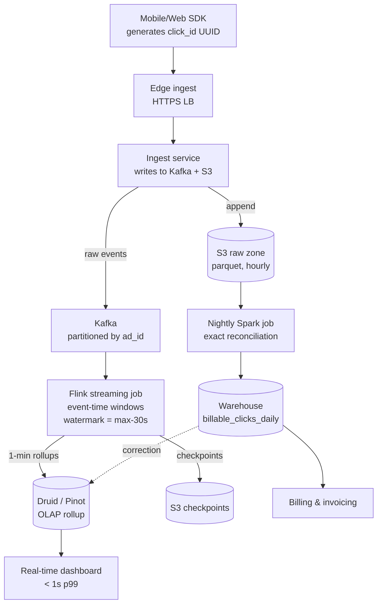
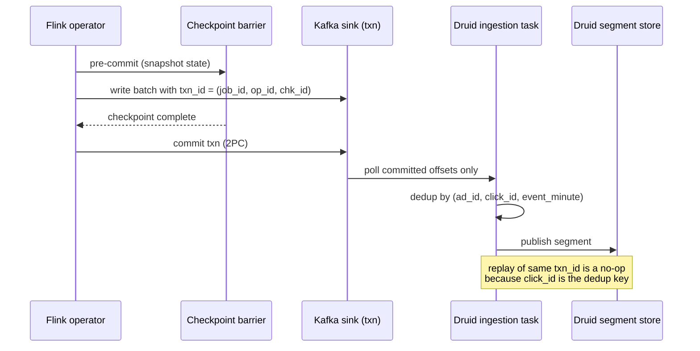
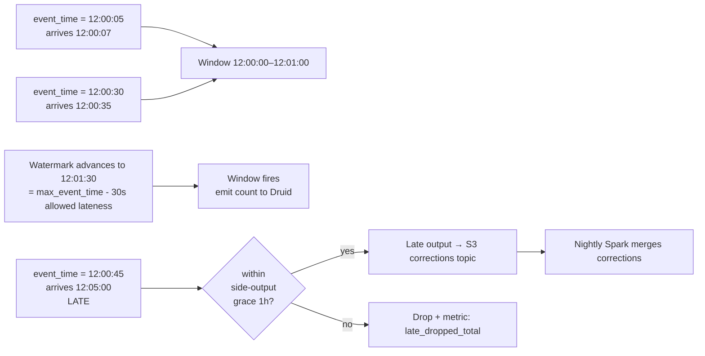

# Ad Click Aggregation

## Why This Exists

**Problem.** Ad networks ingest tens of billions of click events per day. Advertisers are billed from these counts. A 0.1% error means seven-figure revenue swings; a 1-minute outage in the billing path is a regulatory and trust issue. The system must answer two very different questions on the same data:

1. **Real-time** ("clicks for campaign X in the last 5 minutes") — sub-second freshness, low cardinality slices, dashboards.
2. **Batch / accounting** ("exact billable clicks for ad_id Y between 2026-06-04 00:00 and 23:59 UTC") — must reconcile to the penny, must tolerate late events, must be auditable.

Naively running both on a single stream pipeline gets you neither: stream-only loses replayability and exactness; batch-only loses freshness.

**Key insight.** The interviewer is testing whether you understand three independent axes and can hold them in your head at once:

- **Delivery semantics** at every hop (producer → bus → processor → sink). Exactly-once is a property of *write-with-deduplication*, never of "the message bus alone."
- **Time semantics** — event-time vs processing-time, and how watermarks bound how-late-is-late.
- **Storage tiers** — raw (S3, immutable, source-of-truth), hot stream state (RocksDB / Flink state), and the OLAP rollup that powers queries.

If you confuse these axes, you ship a system that double-bills on every Flink job restart.

**Reach for this when:**
- You're designing any high-volume event counter where money depends on the count (ads, payments, fraud signals, usage metering).
- You need both sub-minute freshness *and* end-of-day exact totals.
- Late events arrive hours after their event-time and must still land in the correct bucket.

**Don't reach for this when:**
- Approximate counts are fine and event-time doesn't matter (use HyperLogLog over a Kafka stream and stop).
- Cardinality is low enough to fit in a single Postgres table with `INSERT ... ON CONFLICT` (you don't need Druid for 100 events/sec).
- Pure batch is acceptable (e.g. nightly billing for low-traffic SaaS) — just run Spark on S3.

---

## Diagrams

### High-level pipeline (Kappa-style with batch reconciliation)



### Exactly-once write to OLAP via idempotent dedup key



### Watermark + late event handling



---

## The Interview Template

When the prompt is "design ad click aggregation," walk the panel through this order. Skipping steps signals you don't know what matters.

### 1. Clarify scope (2 minutes, do not skip)

Ask, don't assume. The right answer changes by an order of magnitude based on these:

| Question | Why it matters |
|---|---|
| QPS at peak? Avg? | 50K vs 5M qps changes everything (sharding, codec choice, $$). |
| Freshness SLO? | "1 second" forces streaming. "5 minutes" lets you micro-batch. |
| Exactness SLO? | "Exact for billing" forces dedup + reconciliation. "±1%" lets you HLL. |
| Query patterns? | Top-N campaigns? Per-user? Funnel? Druid vs Pinot vs ClickHouse choice. |
| Retention? | 90 days hot, 7 years cold is typical for ads. Drives storage tiering. |
| Multi-region? | Active-active vs failover; per-region Kafka or global? |

For the rest of this doc assume: **1M peak qps, 200K avg, sub-second dashboard freshness, exact for billing, 13-month hot retention, 7-year cold, single ingest region with global query.**

### 2. Back-of-envelope

```
peak_qps         = 1,000,000 clicks/sec
avg_qps          = 200,000 clicks/sec
events/day       = 200_000 * 86_400 ≈ 17.3 B/day
event_size_avg   = 400 B (JSON)  → 200 B (protobuf compact)
ingest_bw_peak   = 1M * 400 B = 400 MB/s
                                 = 3.2 Gbps  (per region, before replication)
raw_s3_per_day   = 17.3B * 200 B ≈ 3.5 TB/day raw, ~700 GB zstd parquet
rollup_per_day   = 1-min granularity * ~10M ad_ids active * dimensions
                 ≈ 50–200 GB/day after Druid roll-up
```

These numbers drive every downstream decision: 3.2 Gbps means you need ≥30 Kafka brokers with proper batching, not three.

### 3. Pick a topology: Lambda vs Kappa

**Lambda (Nathan Marz, 2011).** Two pipelines: streaming (fast, approximate, recent window) and batch (slow, exact, full history). Query layer merges them.

- Pro: Batch layer is dead simple to reason about (Spark over S3 partitions). Easy to fix bugs by re-running.
- Con: Two codebases for the same logic; subtle skew between them is the #1 source of "why does the dashboard say 1.04M and the invoice say 1.05M?" tickets.

**Kappa (Jay Kreps, 2014).** One pipeline (streaming). Reprocess by replaying the log from the start. Batch is just "streaming with a long window."

- Pro: One codebase. Replayable.
- Con: Stream engine state explodes for very long replays. Backfilling 13 months of state on Flink/Kafka Streams is operationally painful.

**What to actually build for ads (recommended hybrid).**
- Streaming pipeline (Flink) for the dashboard and 1-min/5-min rollups → Druid.
- Batch reconciliation pipeline (Spark over S3 raw) runs nightly → warehouse `billable_clicks_daily`. **This is the source of truth for billing.** The streaming layer is "best-effort fresh"; the batch layer is "correct."
- Surface both in the dashboard with a "preliminary" badge until reconciliation runs.

This is what Druid's own design papers and the Yahoo / LinkedIn Pinot writeups converge on. See refs.

### 4. Ingest

```python
# Edge ingest service. Stateless. Auto-scales on a fleet behind ALB.
# The two non-obvious decisions are (a) generating the dedup key here,
# not at the SDK, and (b) writing to S3 raw BEFORE acking.

import time, uuid
from kafka import KafkaProducer

producer = KafkaProducer(
    bootstrap_servers=BROKERS,
    acks="all",                 # wait for ISR commit; trades latency for durability
    enable_idempotence=True,    # KIP-98: producer-side dedup on retries
    compression_type="zstd",
    linger_ms=5,                # batch up to 5ms — huge throughput win, tiny lat cost
    max_in_flight_requests_per_connection=5,
)

def handle_click(req):
    # click_id MUST be assigned server-side. SDKs lie / replay / are tampered with.
    # ad_id + user_id + ts_ms is NOT unique enough — fast double-clicks collide.
    click_id = str(uuid.uuid4())

    event = {
        "click_id": click_id,
        "ad_id": req.ad_id,
        "campaign_id": req.campaign_id,
        "user_id_hash": sha256(req.user_id_or_anon)[:16],
        "event_ts_ms": req.client_ts_ms,        # event-time, from SDK
        "ingest_ts_ms": int(time.time() * 1000), # processing-time, server clock
        "ip": req.ip,
        "ua_hash": sha256(req.user_agent)[:16],
        "geo": req.geo_from_ip,
    }

    # 1) Append to S3 raw zone first (via Firehose / direct S3 with batching).
    #    This is the immutable source of truth. If Kafka is down for 6 hours,
    #    the batch reconciliation still works.
    firehose.put_record(stream="clicks-raw", data=encode(event))

    # 2) Then publish to Kafka for the streaming layer.
    #    Partition KEY = ad_id so all clicks for an ad land in the same partition,
    #    enabling local windowed aggregation in Flink without shuffles.
    producer.send("clicks", key=event["ad_id"].encode(), value=encode(event))

    return 204  # ack only after both writes are queued
```

Why partition by `ad_id` not `user_id`: the dominant query is "clicks per ad per minute," and you want all events for one ad on one partition so the windowed aggregator is local. The hot-key risk (one viral ad melts one broker) is mitigated by salting the top 0.1% of ad_ids — see Pitfalls.

### 5. Stream processing: Flink with exactly-once

The spine. Flink's exactly-once guarantee is the combination of:

1. **Aligned checkpoints (Chandy–Lamport)** — periodic distributed snapshots of all operator state.
2. **Two-phase commit sinks (TwoPhaseCommitSinkFunction)** — pre-commit on barrier, commit on checkpoint complete.
3. **Idempotent or transactional sinks** — Kafka transactions (KIP-98/129) or upserts keyed by a dedup key.

Read together: on failure, Flink rewinds to the last successful checkpoint and replays. Sinks must either roll back uncommitted writes (Kafka txn) or be safe to overwrite (idempotent upsert). If your sink is "append to a counter," exactly-once is impossible — *that's the trap*.

```java
// Flink job sketch — Java because the Flink Java API is the canonical surface
// and Java types make the watermark semantics unambiguous.

StreamExecutionEnvironment env = StreamExecutionEnvironment.getExecutionEnvironment();

// 1) Checkpoint config — exactly-once requires aligned barriers + 2PC sink.
env.enableCheckpointing(60_000, CheckpointingMode.EXACTLY_ONCE);
env.getCheckpointConfig().setMinPauseBetweenCheckpoints(30_000);
env.getCheckpointConfig().setCheckpointTimeout(300_000);
env.getCheckpointConfig().setTolerableCheckpointFailureNumber(3);
// 60s is a balance: longer = bigger replay on crash; shorter = more I/O overhead.

// 2) Source with event-time watermark.
KafkaSource<Click> source = KafkaSource.<Click>builder()
    .setBootstrapServers(BROKERS)
    .setTopics("clicks")
    .setGroupId("agg-flink-v3")
    .setStartingOffsets(OffsetsInitializer.committedOffsets(OffsetResetStrategy.EARLIEST))
    .setValueOnlyDeserializer(new ClickDeserializer())
    .build();

WatermarkStrategy<Click> wm = WatermarkStrategy
    // Bounded out-of-orderness = how late a "normal" event can be.
    // Set this to your p99.9 SDK→ingest delay. For mobile ads, 30s is reasonable.
    .<Click>forBoundedOutOfOrderness(Duration.ofSeconds(30))
    .withTimestampAssigner((c, ts) -> c.eventTsMs)
    // Idle source detection — without this, a quiet Kafka partition stalls watermarks
    // for the whole job and downstream windows never fire.
    .withIdleness(Duration.ofMinutes(1));

DataStream<Click> clicks = env.fromSource(source, wm, "kafka-clicks");

// 3) Dedup BEFORE aggregation. This is the exactly-once cornerstone for the
//    end-to-end pipeline (covers SDK retries, edge ingest retries, Kafka
//    producer retries that slipped past idempotence, and replay after restart).
DataStream<Click> deduped = clicks
    .keyBy(c -> c.clickId)
    .process(new DedupFunction(Duration.ofHours(2))); // RocksDB-backed seen set

// 4) Windowed aggregation, keyed by (ad_id, minute).
DataStream<MinuteRollup> rollups = deduped
    .keyBy(c -> c.adId)
    .window(TumblingEventTimeWindows.of(Time.minutes(1)))
    // allowedLateness lets the window stay open for late events;
    // events later than this go to the side output.
    .allowedLateness(Time.minutes(5))
    .sideOutputLateData(LATE_TAG)
    .aggregate(new ClickCountAggregator(), new WindowMetadataPF());

// 5) Sink to Druid via Kafka with transactions — Druid's Kafka Indexing
//    Service consumes only committed offsets, so Flink's 2PC + Druid's
//    segment-publish-by-offset = end-to-end exactly-once *as long as* the
//    rollup row's primary key (ad_id, minute) makes re-publish idempotent.
KafkaSink<MinuteRollup> sink = KafkaSink.<MinuteRollup>builder()
    .setBootstrapServers(BROKERS)
    .setRecordSerializer(new RollupSerializer("clicks-rollup-1m"))
    .setDeliveryGuarantee(DeliveryGuarantee.EXACTLY_ONCE)
    .setTransactionalIdPrefix("agg-flink-v3-")
    // CRITICAL: must be > Druid's transaction.timeout.ms reading config,
    // and < Kafka broker's transaction.max.timeout.ms (default 15min).
    .setProperty("transaction.timeout.ms", "600000")
    .build();

rollups.sinkTo(sink);

// 6) Late events: write to S3 corrections topic for batch reconciliation to
//    pick up. NEVER silently drop — every late event is potential lost revenue.
DataStream<Click> lateStream = ((SingleOutputStreamOperator<MinuteRollup>) rollups)
    .getSideOutput(LATE_TAG);
lateStream.sinkTo(s3LateSink());

env.execute("click-aggregator-v3");
```

The DedupFunction:

```java
public class DedupFunction extends KeyedProcessFunction<String, Click, Click> {
    private final long ttlMs;
    // ValueState because the key IS click_id — we just need a tombstone.
    private transient ValueState<Boolean> seen;

    public DedupFunction(Duration ttl) { this.ttlMs = ttl.toMillis(); }

    @Override
    public void open(Configuration cfg) {
        StateTtlConfig ttlConfig = StateTtlConfig
            .newBuilder(Time.milliseconds(ttlMs))
            .setUpdateType(StateTtlConfig.UpdateType.OnCreateAndWrite)
            .cleanupInRocksdbCompactFilter(1000)
            .build();

        ValueStateDescriptor<Boolean> desc =
            new ValueStateDescriptor<>("seen-click-ids", Boolean.class);
        desc.enableTimeToLive(ttlConfig);
        seen = getRuntimeContext().getState(desc);
    }

    @Override
    public void processElement(Click c, Context ctx, Collector<Click> out)
            throws Exception {
        if (seen.value() == null) {
            seen.update(true);
            out.collect(c);
        }
        // else: duplicate — drop silently, but emit a metric.
    }
}
```

Two non-obvious points:

1. **TTL on the dedup state must exceed your max replay window.** If you can replay 2 hours of Kafka, TTL must be > 2h. Otherwise restart-then-replay forgets dedup keys and double-counts.
2. **RocksDB state size matters.** At 1M qps with 2h TTL, the dedup state is ~7B keys × ~50B = 350 GB per Flink TM. Plan disk + checkpoint storage accordingly. This is why click_id is a bare UUID, not a 256-byte URL.

### 6. OLAP rollup: Druid (or Pinot, or ClickHouse)

Druid's pitch for this exact workload: pre-aggregated time-series facts with low-latency slice/dice across high-cardinality dimensions. Its native Kafka Indexing Service consumes from committed offsets, and segments are published atomically — replay produces the same segment, idempotent at the segment-id level.

Schema:

```json
{
  "type": "kafka",
  "spec": {
    "dataSchema": {
      "dataSource": "click_rollup_1m",
      "timestampSpec": { "column": "minute_ts", "format": "iso" },
      "dimensionsSpec": {
        "dimensions": ["ad_id", "campaign_id", "geo", "device_type"]
      },
      "metricsSpec": [
        { "name": "clicks", "type": "longSum", "fieldName": "clicks" },
        { "name": "uniq_users", "type": "thetaSketch", "fieldName": "user_id_hash" }
      ],
      "granularitySpec": {
        "type": "uniform",
        "segmentGranularity": "HOUR",
        "queryGranularity": "MINUTE",
        "rollup": true
      }
    },
    "ioConfig": {
      "topic": "clicks-rollup-1m",
      "consumerProperties": { "bootstrap.servers": "..." },
      "taskCount": 8,
      "replicas": 2,
      "useEarliestOffset": false
    },
    "tuningConfig": { "type": "kafka", "maxRowsInMemory": 1000000 }
  }
}
```

Why thetaSketch for `uniq_users`: HLL union is O(1) and lets dashboards say "unique users for campaign X across 30 days" without storing user_ids. Pat Helland's "Immutability Changes Everything" is the right mental model — the rollup is a derived fact, the raw S3 events are the truth.

### 7. Reconciliation (the part candidates skip)

Run this nightly. It's the actual billing source.

```sql
-- Spark SQL on raw S3 parquet, partitioned by date_hour and ad_id_bucket.
-- Idempotent: writes to billable_clicks_daily with INSERT OVERWRITE PARTITION.

INSERT OVERWRITE TABLE billable_clicks_daily PARTITION (event_date = '2026-06-04')
SELECT
    ad_id,
    campaign_id,
    advertiser_id,
    COUNT(DISTINCT click_id) AS billable_clicks,
    -- Exclude clicks that fraud scoring flagged after-the-fact.
    COUNT(DISTINCT CASE WHEN fraud_score < 0.5 THEN click_id END) AS valid_clicks,
    SUM(CASE WHEN fraud_score < 0.5 THEN bid_price_micros END) / 1e6 AS revenue_usd
FROM raw_clicks
LEFT JOIN fraud_scores USING (click_id)
WHERE event_date = '2026-06-04'
GROUP BY ad_id, campaign_id, advertiser_id;

-- Then compare to the streaming rollup and emit a divergence metric.
-- Anything > 0.05% triggers an oncall page.
```

The critical rules:
- **Re-running the job for the same date produces the same output.** That's why `INSERT OVERWRITE PARTITION` and `COUNT(DISTINCT click_id)` are non-negotiable.
- **Late events arriving after streaming closed its window** are still in S3 raw, so the nightly job catches them automatically. No special "late path" code in batch.
- **Fraud scores join here, not in stream.** Fraud models run on a 4-hour delay; you don't want the streaming dashboard to flicker as scores update.

---

## Trade-offs

| Benefit | Cost |
|---|---|
| Lambda gives correct nightly totals + fast preliminary | Two codebases drift; reconciliation alerts will page you |
| Kappa (single pipeline) is operationally simpler | 13-month replay on stream state is brutal; backfills take days |
| Exactly-once via Flink 2PC + Kafka txn | ~10–20% throughput hit vs at-least-once; longer checkpoints |
| Idempotent upsert by (ad_id, minute) at OLAP sink | Forces upsert-capable store (Druid, Pinot, ClickHouse ReplacingMT) — rules out plain append-only stores |
| Dedup by click_id in stream | RocksDB state grows to hundreds of GB; checkpoint cost rises |
| Bounded watermark (30s) keeps windows fresh | Late events go to side output; need batch path to recover them |
| Partition Kafka by ad_id (no shuffle in Flink) | Hot ads create skew; must salt top-N keys |
| Druid pre-rollup at minute granularity | Loses sub-minute queryability; if PM later wants "clicks in last 10s," you re-design |
| S3 raw zone as source of truth | Storage cost (~$25/TB/month × 700 GB/day × 13 mo ≈ $7K/mo just hot raw) |
| Server-side click_id assignment | One extra UUID per request; loses any client-side dedup if SDK retries before getting response |

---

## Common Pitfalls

- **"Kafka is exactly-once."** No. Kafka producer idempotence (KIP-98) handles producer retries within one session. Kafka transactions (KIP-129) bundle multi-partition writes atomically. Neither gives you end-to-end exactly-once on its own — the *consumer* must commit offsets in the same transaction as its side effects, or the side effects must be idempotent. This is the #1 misunderstanding in interviews.

- **Dedup state TTL < replay window.** Job crashes, gets replayed from a Kafka offset 4 hours back, but dedup state TTL was 2 hours. Result: every event in the [4h, 2h) window is re-counted. Set TTL ≥ max replay window + safety margin (we use 6h for a 2h replay budget).

- **Watermark stalls on idle partitions.** A Kafka partition with no traffic for 5 minutes pins the watermark for the whole job — no windows fire, dashboard freezes. Fix: `WatermarkStrategy.withIdleness(Duration.ofMinutes(1))`.

- **Hot-key skew on viral ads.** Super Bowl ad gets 100K qps on one Kafka partition while others sit at 1K qps. One Flink TM melts. Mitigations: pre-aggregate with random salt on the top-0.1% of ad_ids (`ad_id || rand(0, 16)`), then re-key for final aggregation; or use Kafka Streams' `KGroupedStream` with a custom partitioner that hash-fans hot keys.

- **Clock skew on the SDK.** `event_ts_ms` from a phone with a wrong clock can be a year in the future or past. Cap watermark advance with a "reasonable bound" — reject events with `|event_ts - server_now| > 7 days` at ingest, and clamp event_ts to server_now + 5min for everything else. Otherwise one phone with a bad clock advances watermark to 2027 and closes every window.

- **Druid segment publish failures during backpressure.** When OLAP store falls behind, Flink's Kafka sink keeps producing, the rollup topic grows, Druid's ingestion task lags by hours. The dashboard doesn't say "stale" — it says "low traffic" because the data hasn't landed. Fix: lag SLO alarm on `kafka_lag{topic="clicks-rollup-1m"} > 5min`, and surface a "data freshness" timestamp on the dashboard.

- **Counting impressions and clicks in the same pipeline.** Tempting but wrong. Impression volume is 100× click volume; impressions don't need exact dedup (no money attaches to a single impression). Run them in separate Flink jobs sized differently.

- **Using `event_time = ingest_ts`.** Defeats the whole point of watermarks. The 6-hour-late mobile click that comes in over WiFi when the user gets home will be bucketed into the wrong day. Ad networks have lost lawsuits over this.

- **Forgetting that fraud scoring is async.** A click is "valid" only after fraud says so, and fraud takes hours. Don't invoice off the streaming rollup; invoice off the reconciled batch table that has fraud_score joined.

- **2PC sink transaction.timeout.ms misconfigured.** If Flink's checkpoint takes longer than `transaction.timeout.ms`, Kafka aborts the transaction and you lose data. If it's longer than `transaction.max.timeout.ms` on the broker, the producer fails to start. Tune all three: checkpoint interval < transaction.timeout < transaction.max.timeout.

- **No raw zone.** Skipping S3 raw "to save money" means a Flink bug silently drops 0.5% of events for a week and you can never recover. The raw zone is your insurance policy. Always write it. It is cheap.

---

## Decision Table

| Situation | Choose | Why |
|---|---|---|
| Need both fresh dashboard + exact billing | Hybrid Lambda (Flink + nightly Spark) | Stream layer for freshness, batch layer for exactness, raw zone as ground truth |
| Pure freshness, ±1% OK, no billing | Kappa (Flink only) | Simpler, no batch path needed |
| <10K qps, low cardinality | Postgres + `INSERT ... ON CONFLICT` | Don't reach for Druid; you'll regret the ops cost |
| Sub-second p99 query latency, slice/dice | Druid or Pinot | Both built exactly for this; Druid stronger on ingest, Pinot on star-tree |
| Need ad-hoc SQL more than dashboards | ClickHouse with ReplacingMergeTree | Looser real-time guarantees but unmatched query flexibility |
| Exactly-once required | Flink + Kafka txn + idempotent OLAP upsert | Only combo that's actually end-to-end EOS |
| At-least-once + dedup downstream | Kafka Streams + idempotent sink | Lower ops; "EOS lite" — fine if dedup key exists |
| Late events up to hours | Watermark + side output + batch reconcile | Window allowedLateness alone is not enough |
| Late events up to days | Skip streaming for that metric, batch only | Streaming state for multi-day windows is not worth it |
| Multi-region active-active | Per-region Kafka, MirrorMaker 2 to global, dedup on click_id | Avoids cross-region write latency on hot path |
| Single-region OK | One Kafka cluster, Druid in same AZ-cluster | Don't pay multi-region tax until you need it |
| Counting unique users | Theta sketches in Druid (or HLL) | Exact distinct count over billions is cost-prohibitive |
| Counting clicks (must be exact) | Long sum on deduped events | Exact is mandatory for $$$ |

---

## References

- Kreps, Jay — *Questioning the Lambda Architecture* — https://www.oreilly.com/radar/questioning-the-lambda-architecture/
- Marz, Nathan — *How to beat the CAP theorem (Lambda Architecture)* — http://nathanmarz.com/blog/how-to-beat-the-cap-theorem.html
- Apache Flink — *Stateful Stream Processing & Exactly-Once Semantics* — https://nightlies.apache.org/flink/flink-docs-stable/docs/concepts/stateful-stream-processing/
- Apache Flink — *End-to-End Exactly-Once Processing in Apache Flink* — https://flink.apache.org/2018/02/28/an-overview-of-end-to-end-exactly-once-processing-in-apache-flink-with-apache-kafka-too/
- Carbone, P. et al. — *Lightweight Asynchronous Snapshots for Distributed Dataflows* (the Chandy–Lamport paper Flink uses) — https://arxiv.org/abs/1506.08603
- Apache Druid — *Design* docs — https://druid.apache.org/docs/latest/design/
- Apache Druid blog — *Real-time Exactly-once Ingestion with Kafka* — https://druid.apache.org/blog/2017/08/16/druid-0-10-1.html
- Yang, F. et al. — *Druid: A Real-time Analytical Data Store* (SIGMOD 2014) — https://static.druid.io/docs/druid.pdf
- Apache Pinot — *Architecture* — https://docs.pinot.apache.org/basics/architecture
- Confluent / Kafka — *KIP-98: Exactly Once Delivery and Transactional Messaging* — https://cwiki.apache.org/confluence/display/KAFKA/KIP-98+-+Exactly+Once+Delivery+and+Transactional+Messaging
- Confluent — *Transactions in Apache Kafka* — https://www.confluent.io/blog/transactions-apache-kafka/
- Akidau, T. et al. — *The Dataflow Model* (VLDB 2015) — https://research.google/pubs/pub43864/ — the canonical paper on event-time, watermarks, triggers
- Akidau, T. — *Streaming 101 / 102* (O'Reilly) — https://www.oreilly.com/radar/the-world-beyond-batch-streaming-101/
- Kleppmann, Martin — *Designing Data-Intensive Applications* — ch. 11 "Stream Processing", ch. 10 "Batch Processing", ch. 12 "The Future of Data Systems"
- Helland, Pat — *Immutability Changes Everything* (CIDR 2015) — https://queue.acm.org/detail.cfm?id=2884038
- Helland, Pat — *Idempotence Is Not a Medical Condition* — https://queue.acm.org/detail.cfm?id=2187821
- Wampler, Dean — *Fast Data Architectures for Streaming Applications* (O'Reilly, free) — https://www.oreilly.com/library/view/fast-data-architectures/9781492048992/
- Xu, Alex — *System Design Interview Vol. 2*, ch. "Ad Click Event Aggregation"
- Google SRE Workbook — *Data Processing Pipelines* — https://sre.google/workbook/data-processing/
- AWS Builders' Library — *Avoiding fallback in distributed systems* — https://aws.amazon.com/builders-library/avoiding-fallback-in-distributed-systems/

---

## See Also

- `../../communication/message-queues/` — Kafka partitioning, consumer group rebalance, KIP-98 internals
- `../../data-systems/stream-processing/` — Flink checkpointing deep-dive, watermarks, state backends
- `../../communication/idempotency/` — End-to-end EOS patterns beyond ads
- `../../reliability/rate-limiting/` — Edge ingest protection
- `../distributed-counter/` — Lower-tier alternative when exact + multi-region not required
- `../../performance/back-of-envelope/` — Capacity math discipline
