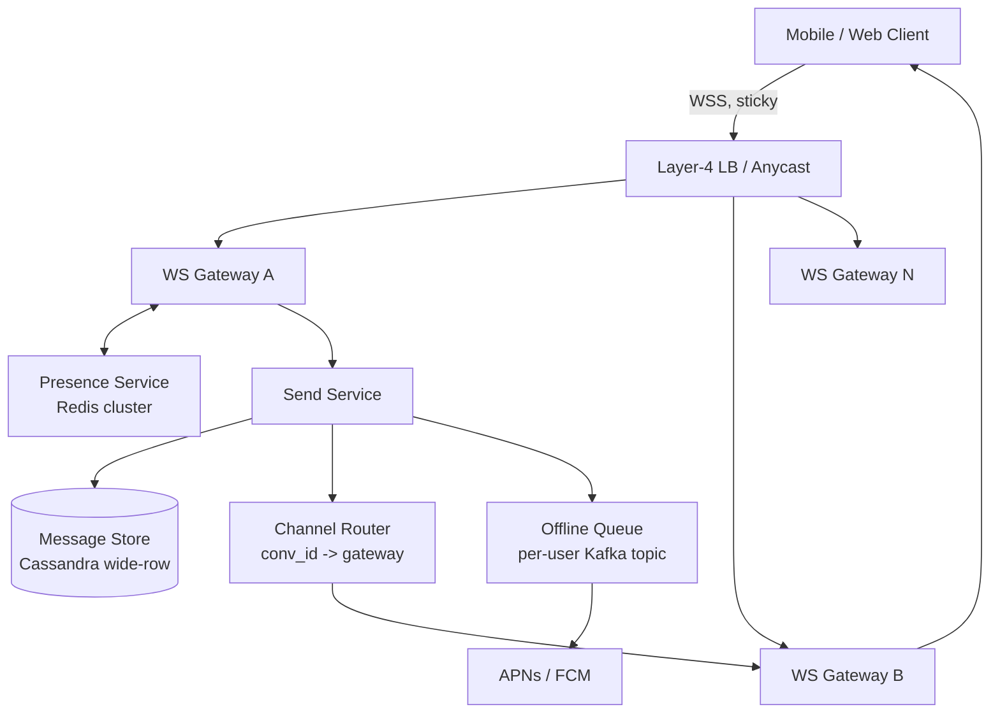
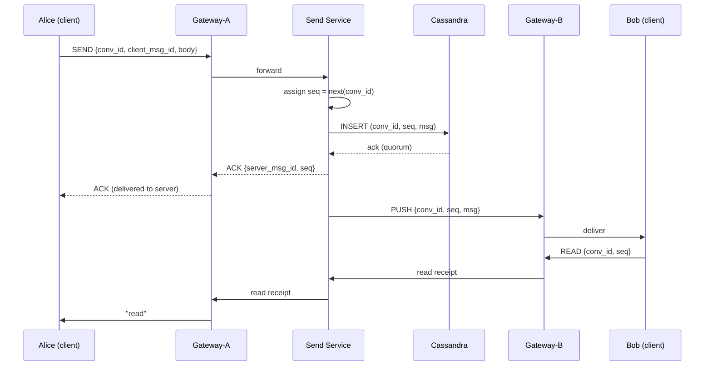
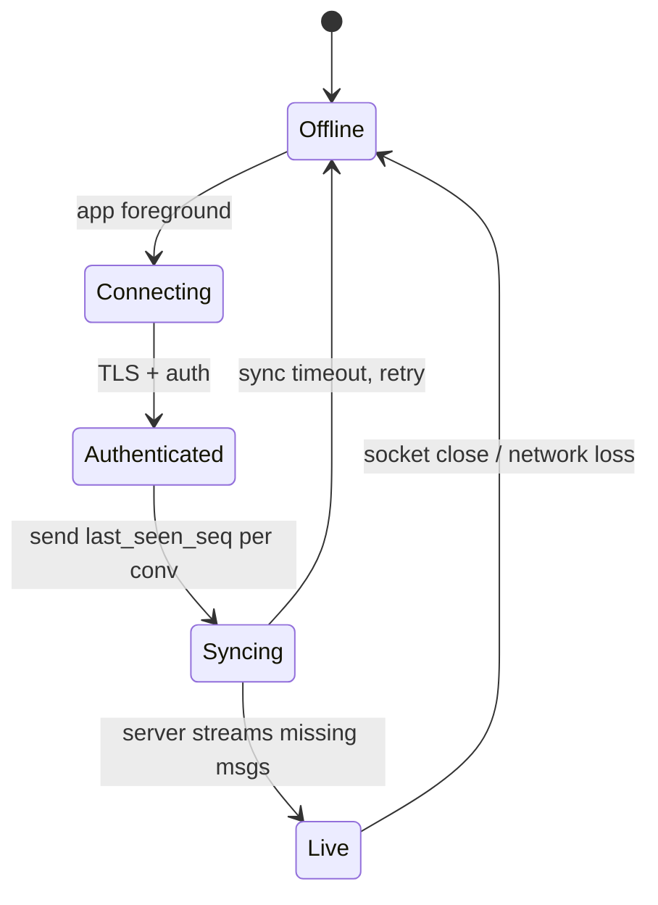
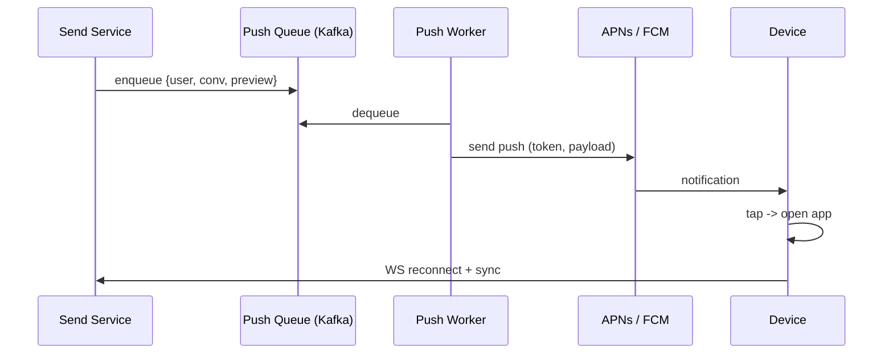

# Chat System (WhatsApp / Slack / Messenger)

## Why This Exists

**Problem.** Naive chat is trivial: clients POST to a server, server fans out. It breaks the moment you have (a) more connections than one box can hold, (b) users on flaky mobile networks who go offline mid-conversation, (c) two messages sent "at the same time" from two clients into one group, (d) a reader who joins the channel and wants the last 200 messages without scanning a billion-row table, and (e) regulators or users who want messages the server itself can't read.

**Key insight.** A chat system is **four loosely-coupled subsystems** glued by a gateway:

1. **Connection tier** (long-lived WebSocket / MQTT) — stateful, fronts the rest.
2. **Routing / presence** — "where is user U right now? which gateway holds their socket?"
3. **Message store** — durable per-conversation log, optimized for `(conversation_id, ts) → recent N`.
4. **Delivery** — push to online sockets, queue for offline, ack/retry, dedupe.

Most "design WhatsApp" interview failures happen because the candidate jams 1–4 into one box, or stores messages in a row-per-message table indexed by `user_id` and then has to do a `JOIN` on every conversation read.

**Reach for this when:**
- You're given an interview prompt: WhatsApp, Slack, Messenger, Discord, Telegram, group chat, DM, "1B users".
- Real workloads: 100M+ DAU, average user in 5–50 conversations, p99 message-delivery latency target < 500ms.
- Mixed online/offline: mobile users disconnect every few minutes; messages must still arrive.
- You need ordering guarantees per conversation but global ordering is too expensive.

**Don't reach for this when:**
- You need a **request/response** API — chat is push-driven; if every interaction is "user clicks, server replies", you want REST + caching, not WebSockets.
- You need **strict global total order** across all conversations (financial ledger, multi-key transactions) — see `../../data-systems/distributed-transactions/`.
- You're building a **pub/sub topic broker** (Kafka, SNS) — chat needs per-user inbox semantics, not topic broadcast.

---

## Diagrams

### High-level architecture



### Message send sequence (1:1, both online)



### Offline → online catch-up



---

## The Connection Tier (WebSocket Gateways)

**One process, many sockets.** A modern Linux box with tuned `net.core.somaxconn`, `fs.file-max`, and `net.ipv4.tcp_max_syn_backlog` can hold **500K–2M concurrent idle WebSocket connections** (WhatsApp's 2012 talk: 2M/box on FreeBSD + Erlang). The constraint is rarely CPU — it's memory per socket (~10–40 KB) and the userland connection-tracking table.

**Stateful, but boring.** The gateway should do *as little as possible*:

```python
# pseudo-code, async/await — Python asyncio, Go goroutines, or Erlang processes all work
class Gateway:
    def __init__(self):
        self.sockets: dict[user_id, WebSocket] = {}    # local only

    async def on_connect(self, ws, user_id, device_id):
        self.sockets[(user_id, device_id)] = ws
        # Tell presence service: "I (gateway-A) hold this user"
        await presence.register(user_id, device_id, gateway_id=MY_ID, ttl=60)
        # Start heartbeat; renew TTL every 30s
        asyncio.create_task(self._heartbeat(user_id, device_id))

    async def on_message(self, ws, frame):
        # Validate, hand to send service, return immediately.
        # DO NOT do business logic here.
        await send_service.handle(frame)

    async def on_disconnect(self, user_id, device_id):
        del self.sockets[(user_id, device_id)]
        await presence.unregister(user_id, device_id, gateway_id=MY_ID)

    async def deliver(self, user_id, device_id, payload):
        ws = self.sockets.get((user_id, device_id))
        if ws and not ws.closed:
            await ws.send(payload)        # may raise; caller retries
        else:
            raise NotConnectedHere()      # routing changed; presence is stale
```

**Why "do little"?** The gateway is the only stateful tier. The longer you hold work there, the more you lose on a redeploy. A gateway crash should drop sockets but not lose messages — clients reconnect and re-sync from `last_seen_seq`.

**Sticky LB or anycast?** Plain L4 + DNS is fine. Don't try to route a *specific user* to a *specific gateway* via DNS — let the user land anywhere, and use the **presence service** to find them. Stickiness only matters within a connection (TCP), which the L4 LB handles.

**Heartbeats and zombies.** Every chat system fights **half-open connections**: the client's network died but the server hasn't noticed. Two layers of defense:
- **TCP keepalive** (kernel-level, slow — 2 hours by default; tune to ~60s).
- **App-level ping/pong** every 20–30s. If 2 pings missed, kill the socket.

WhatsApp's 2014 Erlang post specifically called out reducing the cost of these heartbeats — at 450M users, a 30s heartbeat is ~15M pings/sec. Batch them, use binary frames, don't JSON-encode.

---

## Presence

Presence is **"is U online, and on which gateway?"** It looks trivial; it's the most-requested feature that breaks at scale.

**Naive approach (don't):** every client publishes "online" to a `presence` Kafka topic, every other client subscribes. With N users in 50 conversations averaging 100 contacts each, you do `N × 100` fanout per state change. At 100M users, this is the entire datacenter.

**Pragmatic approach:**
1. **Store presence in Redis** with a TTL (e.g. 60s). Gateway renews on heartbeat. If Redis loses the key, user is offline.
2. **Don't push presence proactively** to all contacts. Instead, **push only to people watching a conversation** (chat window open) and update lazily.
3. **Last-seen** is a separate field updated on disconnect, denormalized into the user's profile row.

```python
# Redis schema
# presence:{user_id} -> hash {device_id: gateway_id}, EXPIRE 60s on each renew
# last_seen:{user_id} -> unix_ts (set on disconnect)

async def is_online(user_id) -> bool:
    return await redis.exists(f"presence:{user_id}")

async def gateway_for(user_id, device_id) -> str | None:
    return await redis.hget(f"presence:{user_id}", device_id)
```

**Slack's wrinkle.** Slack's "active in channel" presence is per-team and aggregated. Their 2017 engineering blog covered the move from a per-user push model to a **lazy pull** model: the client asks "who's active in this channel?" only when it renders the member list. This cut presence traffic by ~95%.

**WhatsApp's wrinkle.** "Last seen" and "online" are user-controlled privacy settings. The presence read-path enforces ACLs *before* returning the timestamp. Don't bake "always returns online" into the gateway.

---

## Message Ordering — The Hard Problem

Two messages arrive at two different gateways at "the same time" for one conversation. Which one is first?

### Three viable schemes

**1. Server-assigned monotonic sequence per conversation (recommended).**

A single coordinator per `conversation_id` increments a counter. Same conversation = same coordinator (consistent hashing). Different conversations are independent.

```python
# Send service — sharded by hash(conversation_id)
async def assign_seq(conv_id) -> int:
    # In-memory counter persisted to Cassandra periodically
    # OR a single Cassandra LWT (lightweight transaction) — simpler but slower
    return counters[conv_id].next()
```

This gives **per-conversation total order**, which is what users actually perceive. Across conversations, you make no guarantees — and no user cares.

**2. Lamport timestamps.**

Each client maintains a logical clock. On send: `lamport = max(local, last_seen_server) + 1`. The server breaks ties by `(lamport, sender_id)`. Used in some P2P / mesh systems, but on a centralized server it's strictly inferior to a server sequence — same complexity, weaker guarantees.

**3. Hybrid Logical Clocks (HLC).**

Wall-clock + logical counter. Useful when you have multi-region writes and want approximate ordering across regions without a global coordinator. Messenger and some Discord paths use variants. Cost: ordering across regions is "eventual" — a late arrival from another region may slot *before* a message you already showed.

### Client-side de-dup

Clients send a `client_msg_id` (UUID generated on the device). Server treats `(sender_id, client_msg_id)` as the idempotency key — a retry from a flaky network does **not** create a duplicate row. Without this, your "tap to send, network blip, tap again" UX produces double messages, and users will roast you.

```sql
-- Conceptual; in Cassandra you'd model differently. See message store below.
INSERT INTO messages (conv_id, seq, sender, client_msg_id, body, ts)
VALUES (?, ?, ?, ?, ?, ?)
IF NOT EXISTS;  -- LWT to enforce idempotency on (conv_id, sender, client_msg_id)
```

In practice you avoid the LWT by checking a Bloom filter / Redis-backed dedup index keyed on `(sender_id, client_msg_id)` with a 24h TTL. LWTs in Cassandra are expensive (Paxos round trip).

---

## The Message Store — Cassandra Wide Rows

This is the single biggest design choice and the one most candidates fumble.

**Read pattern:** "Give me the last 50 messages in conversation C, oldest first within that page, and let me page backwards."

**Write pattern:** Append. Always append. Edits and deletes are tombstones, not in-place mutations.

**The wrong way: `messages(id, conv_id, ts, body)` indexed on `conv_id`.**
At 1B+ messages, the secondary index on `conv_id` becomes the bottleneck. Reads do a B-tree lookup → random IO across pages → page cache misses. Discord ran this on MongoDB until ~2017 and described the failure mode in their **"How Discord Stores Billions of Messages"** post: at scale, even with the right index, paging the last N messages of a hot channel was unpredictably slow.

**The right way: Cassandra wide-row (one row per conversation, columns are messages).**

```cql
-- Cassandra / ScyllaDB
CREATE TABLE messages (
    conv_id        uuid,
    bucket         int,         -- time bucket: e.g. days-since-epoch / 30
    seq            bigint,      -- per-conversation server sequence
    msg_id         timeuuid,
    sender_id      uuid,
    body           blob,        -- ciphertext if E2EE
    edited_at      timestamp,
    PRIMARY KEY ((conv_id, bucket), seq)
) WITH CLUSTERING ORDER BY (seq DESC);
```

Why this works:
- **Partition key = `(conv_id, bucket)`.** All messages for one conversation in one time-bucket live on the same node (and its replicas). A "last 50 messages" read = single-partition slice = ~one disk seek.
- **`bucket` prevents unbounded partitions.** Cassandra hates partitions > ~100 MB. For a 5-message-per-day group, the bucket is years; for a 1M-message-per-day Slack channel, it's hours. Tune empirically.
- **Clustering on `seq DESC`** means newest messages are at the start of the partition — the common query is fast.

**Discord's variant.** Discord moved to Cassandra (and later ScyllaDB) with a similar schema, bucketing on Snowflake ID time. Their 2017 post detailed the partition-size war: they capped partitions at ~100 MB by tuning bucket size per channel based on message rate.

**Pagination.** "Older messages" = `WHERE conv_id=? AND bucket<=? AND seq < ? LIMIT 50`. Crossing a bucket boundary is one extra read; cache it.

**Replication.** `RF=3`, write `LOCAL_QUORUM`, read `LOCAL_QUORUM`. Loss of one replica = no impact. Cross-region replication is async (`NetworkTopologyStrategy`).

---

## Offline Delivery

A user is offline. Three concurrent challenges:

1. The user comes back from 3 days off — they need to know **what they missed**, ordered, deduped.
2. Notifications must still arrive (push notification via APNs / FCM).
3. The store can't grow unbounded with undelivered messages.

### Pull-based catch-up (the WhatsApp/Signal model)

**Don't** maintain a per-user inbox queue with every undelivered message. At 100M users × 50 conversations × N messages/day, the inbox queue dwarfs the message store and is mostly redundant.

**Do** track per-(user, conversation) `last_seen_seq`. On reconnect, the client tells the server "I have up to seq=X in conv C". The server reads from the message store: `WHERE conv_id=C AND seq>X LIMIT 200`. Done.

```python
async def sync_user(user_id, last_seen: dict[conv_id, int]):
    convs = await get_user_conversations(user_id)
    for c in convs:
        last = last_seen.get(c.id, 0)
        # Bounded read; client paginates if more
        msgs = await message_store.read(c.id, after_seq=last, limit=200)
        if msgs:
            yield {"conv_id": c.id, "msgs": msgs, "more": len(msgs) == 200}
```

The conversation list itself sits in a small `user_conversations(user_id, conv_id, last_msg_seq, last_msg_ts)` table — tiny, hot, cacheable.

### Push notifications (out-of-band)

For *mobile* clients with the app backgrounded, the OS kills the WebSocket. You need APNs (iOS) / FCM (Android) to wake the device.



**Critical:** the push payload should NOT contain the full message body if E2E encrypted — APNs/FCM see plaintext. Send "you have a new message"; client opens connection, pulls real ciphertext, decrypts.

### Retention

WhatsApp deletes messages from the server **once delivered to all recipients** (verified for E2E). This is a load-bearing privacy property and a cost optimization. Slack retains messages indefinitely (or per workspace policy) because that's the product. Pick the model that matches your product, but pick *deliberately* — silent retention surprises everyone.

---

## End-to-End Encryption (Signal Protocol)

Used by WhatsApp, Signal, Messenger (Secret Conversations, now expanding), Google RCS. The Signal Double Ratchet provides:

- **Forward secrecy**: compromising today's key doesn't decrypt yesterday's messages.
- **Post-compromise security** (a.k.a. "future secrecy"): after a compromise, future messages re-randomize and the attacker is locked out.
- **Asynchronous delivery**: Bob can be offline when Alice sends the first message.

### Cryptographic moving parts

1. **Identity keys** (long-term Curve25519 keypair per device). Published to server.
2. **Signed prekeys** (medium-term, rotated weekly).
3. **One-time prekeys** (consumed once, refilled by client).
4. **X3DH key agreement** (Alice fetches Bob's prekey bundle, derives a shared secret without Bob being online).
5. **Double Ratchet** thereafter — every message advances both a Diffie-Hellman ratchet (on each round-trip) and a symmetric chain (per message).

```python
# Conceptual — DO NOT implement crypto yourself, use libsignal.
session = signal.x3dh_init(
    my_identity_key,
    bob_identity_key,
    bob_signed_prekey,
    bob_one_time_prekey,
)
ciphertext = session.encrypt(plaintext)   # advances ratchet
# server stores ciphertext; never sees plaintext
```

### Server's role under E2EE

The server is a **dumb postbox**:
- Stores ciphertext in the message store.
- Stores prekey bundles, hands them out for X3DH.
- Routes and orders messages.
- Cannot read content. Cannot search content. Cannot do server-side spam classification on content.

This last point is where Slack and Messenger diverge from WhatsApp/Signal:
- **WhatsApp / Signal**: E2EE by default. No server-side message search.
- **Slack**: Not E2EE; messages encrypted in transit (TLS) and at rest, but Slack holds the keys. Enables server-side search, eDiscovery, compliance scans. This is a *product* decision for enterprise compliance, not a technical limitation.

### Group E2EE

Pairwise Double Ratchet for a 256-person group is `O(N²)` keys per message. Signal's **Sender Keys** protocol amortizes: each sender derives a symmetric chain key, distributes it pairwise *once*, then encrypts subsequent group messages with it. Adds/removes trigger key rotation. Reduces per-message work to `O(1)`.

WhatsApp's 2016 white paper ("WhatsApp Encryption Overview") is the canonical source.

### Multi-device

Same user, multiple devices = each device has its own identity key, treated as a separate participant in every conversation. Sending a message to a contact = encrypt N times (once per recipient device). WhatsApp moved from "phone is the master" to true multi-device in 2021; the architecture diagram is essentially a fanout per device.

---

## Trade-offs

| Benefit | Cost |
|---|---|
| Stateful WebSocket gateways → low latency, server push | Operational pain on deploys; need careful drain / migration |
| Per-conversation server sequence → simple, perceptually correct ordering | No global ordering; cross-conv timeline reconstruction is hard |
| Cassandra wide-row → constant-time tail reads regardless of total size | Schema is rigid; hard to add secondary access patterns later |
| Pull-based offline sync → no per-user inbox queue | Reconnect storm after partition: clients all hit the store |
| E2EE → strong privacy, regulatory wins | No server-side search, spam classification, eDiscovery |
| Sender Keys for groups → O(1) per message | Member churn triggers key rotation; complicates large team channels |
| Push notifications via APNs/FCM | Adds per-vendor failure modes; payload size limits; must avoid leaking content under E2EE |
| Bucketed partitions | Bucket-boundary reads are 2 partitions; tuning bucket size is per-conversation |

---

## Common Pitfalls

- **Storing messages in a row-per-message RDBMS table indexed by `user_id`.** Falls over at ~10M messages. The Discord-on-MongoDB story is the public version of this; many startups replay it privately.
- **One global sequence number for all messages.** Looks elegant on a whiteboard, becomes the system bottleneck. Per-conversation is what users perceive anyway.
- **Trusting client clocks for ordering.** A user with a wrong system clock can place messages 10 years in the past or future. Always re-stamp with server time and use server sequence for ordering.
- **Heartbeats too aggressive.** 5-second heartbeats on 100M sockets is 20M req/s of pure overhead. 30s app-level + tuned TCP keepalive is the sweet spot.
- **Push payload contains full message under E2EE.** Now Apple and Google can read everything. Push payload should be a wake-up only.
- **No idempotency key on send.** A user retries on a network blip → duplicate messages → angry support tickets.
- **Stale presence after gateway crash.** Gateway dies, sockets gone, but Redis still has `presence:{user_id} -> gateway_A` for 60s. Either keep TTL low, OR have gateway-A's neighbors detect the crash and proactively evict (gossip / k8s pod death watcher).
- **No bucket on the message partition key.** A hot channel (ChatGPT release announcement at 1M msgs/hr) creates a 10 GB Cassandra partition. The whole node hates you.
- **Treating read-receipts and typing indicators as messages.** They generate 5–20× the volume of actual messages and don't need durability. Send them on a separate, in-memory pub/sub channel (Redis, NATS) and never write them to Cassandra.
- **Group fanout via DB JOIN at send time.** "Send to group of 200" → JOIN `group_members` → 200 INSERTs. Instead, the *write* is one row to the conversation; the *read* is per-user and pulls from the shared partition. Group fanout happens only for delivery (push to online sockets, push notification queue), not for storage.
- **Forgetting that mobile networks are TCP-hostile.** Cellular hand-offs kill long-lived sockets. Reconnect must be < 1s and silent; if your reconnect logic shows a "Disconnected" banner every 30s, users will stop using the app.

---

## Decision Table

| Question | Choose A | Choose B |
|---|---|---|
| Need server-side search? | Slack-style (server holds keys, plaintext indexable) | WhatsApp-style E2EE — but lose search |
| 1:1 + small groups (< 256) | Pairwise Double Ratchet works | Sender Keys for groups |
| Massive channels (10K+ members, public) | Don't E2EE — Slack/Discord-style server-known content | E2EE here is theoretically possible (MLS) but operationally hard |
| Strict global ordering? | Single-coordinator queue (Kafka, single partition) — slow | Per-conversation seq — fast, "good enough" |
| Eventual cross-region writes OK? | Hybrid Logical Clocks | Single-region coordinator per conversation |
| Storage: tail-read heavy, low edits | Cassandra/ScyllaDB wide row | Postgres + partitioning works up to ~100M msgs |
| Storage: complex queries (search, analytics) | Postgres + read replicas + Elasticsearch sidecar | Cassandra alone won't do it |
| Mobile-first | MQTT or custom binary over TCP, plus FCM/APNs | Plain WebSocket fine for web/desktop |
| Web-first (Slack desktop) | WebSocket + JSON | MQTT overkill |
| Need eDiscovery / compliance hold | Server-known keys, audit log of admin reads | E2EE blocks compliance; legally risky for enterprise |
| Throughput: < 1K msg/s | Single Postgres + Redis pub/sub fine | Cassandra is overkill |
| Throughput: > 100K msg/s sustained | Cassandra + sharded gateway + Kafka for fanout | Single-DB design will collapse |

---

## References

- WhatsApp engineering — "1 million is so 2011" (Rick Reed at Erlang Factory) — https://www.erlang-factory.com/upload/presentations/558/efsf2012-whatsapp-scaling.pdf
- WhatsApp engineering — "The WhatsApp Architecture Facebook Bought For $19 Billion" (High Scalability) — http://highscalability.com/blog/2014/2/26/the-whatsapp-architecture-facebook-bought-for-19-billion.html
- WhatsApp — "WhatsApp Encryption Overview" white paper (2016, updated) — https://www.whatsapp.com/security/WhatsApp-Security-Whitepaper.pdf
- Signal — "The Double Ratchet Algorithm" (Perrin & Marlinspike) — https://signal.org/docs/specifications/doubleratchet/
- Signal — "X3DH Key Agreement Protocol" — https://signal.org/docs/specifications/x3dh/
- Discord engineering — "How Discord Stores Billions of Messages" (2017) — https://discord.com/blog/how-discord-stores-billions-of-messages
- Discord engineering — "How Discord Stores Trillions of Messages" (ScyllaDB, 2023) — https://discord.com/blog/how-discord-stores-trillions-of-messages
- Slack engineering — "Flannel: an application-level edge cache to make Slack scale" — https://slack.engineering/flannel-an-application-level-edge-cache-to-make-slack-scale/
- Slack engineering — "Real World Concurrency Bugs in Go" (gateway lessons) — https://slack.engineering/
- Facebook Messenger — "Building Mobile-First Infrastructure for Messenger" — https://engineering.fb.com/2014/10/15/production-engineering/building-mobile-first-infrastructure-for-messenger/
- Lamport — "Time, Clocks, and the Ordering of Events in a Distributed System" (CACM 1978) — https://lamport.azurewebsites.net/pubs/time-clocks.pdf
- Kulkarni et al. — "Logical Physical Clocks and Consistent Snapshots in Globally Distributed Databases" (HLC paper) — https://cse.buffalo.edu/tech-reports/2014-04.pdf
- DDIA — Kleppmann, ch. 5 (Replication), ch. 6 (Partitioning), ch. 11 (Stream Processing) — Designing Data-Intensive Applications, O'Reilly 2017
- Google SRE Book — ch. 22 ("Addressing Cascading Failures") — https://sre.google/sre-book/addressing-cascading-failures/
- AWS Builders' Library — "Avoiding fallback in distributed systems" — https://aws.amazon.com/builders-library/avoiding-fallback-in-distributed-systems/
- AWS Builders' Library — "Caching challenges and strategies" — https://aws.amazon.com/builders-library/caching-challenges-and-strategies/
- Xu & Lam — System Design Interview Vol. 1, ch. 12 ("Design a Chat System") — Byte Code LLC, 2020
- IETF MLS (Messaging Layer Security) — RFC 9420 — https://datatracker.ietf.org/doc/rfc9420/
- Cassandra docs — "Data modeling: time series" — https://cassandra.apache.org/doc/latest/cassandra/data_modeling/

---

## See Also

- `../url-shortener/` — simpler stateful service, contrasts with chat's connection tier
- `../newsfeed/` — fanout-on-write vs fanout-on-read, related to group message delivery
- `../notification-system/` — APNs/FCM, push pipelines, retry semantics
- `../rate-limiter/` — protect gateway from reconnect storms and message floods
- `../distributed-cache/` — Redis patterns used here for presence
- `../../data-systems/search-engine/` — what you'd add for Slack-style server-side search
- `../../data-systems/distributed-transactions/` — when you actually do need cross-conversation atomicity
- `../../data-systems/wide-column/` — wide-row patterns deeper dive
- `../../communication/websockets/` — WebSocket protocol, framing, scaling
- `../../security/encryption-in-transit/` — Signal protocol implementation notes
- `../../reliability/graceful-degradation/` — what happens when the message store is slow
