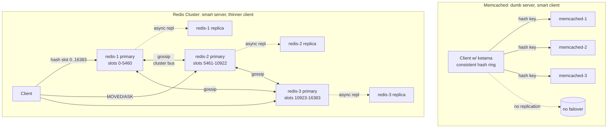
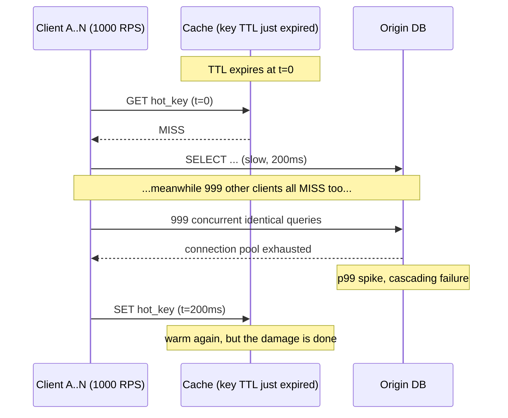
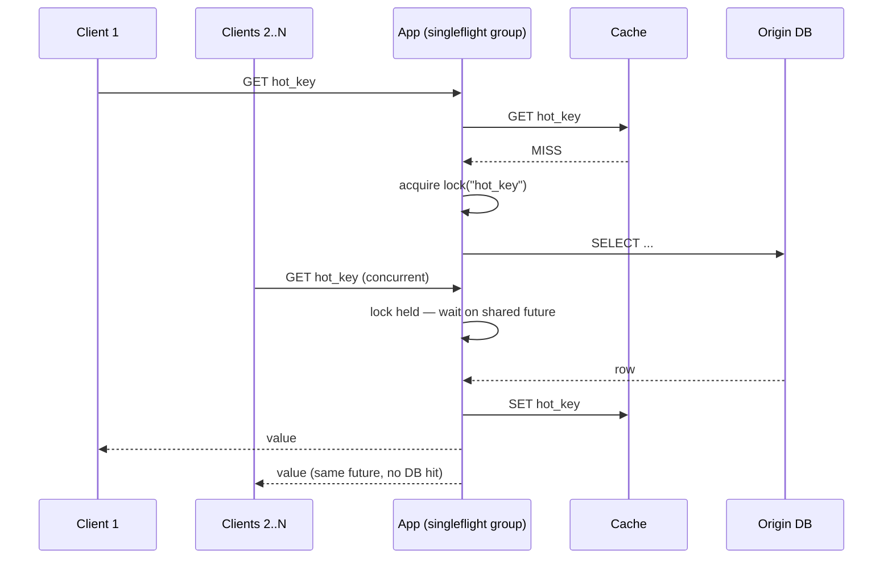

# Distributed Cache (Memcached / Redis Cluster)

## Why This Exists

**Problem.** A single database can't sustain millions of point reads per second at low p99. You put a cache in front of it. As soon as you have more than one cache node, you inherit a distributed-systems problem: how to *route* a key to a node, what happens when a node *dies*, what happens when the *fleet resizes*, and what happens when a *hot key* or a *deploy* slams every cache miss into the database simultaneously.

**Key insight.** A distributed cache is not "a faster database." It's a **lossy, optional, best-effort** layer whose correctness model is **eventual** and whose failure mode must be **bounded blast radius**. The two foundational decisions are (1) the **partitioning function** that maps key → node and (2) the **stampede protection** that keeps a cache miss from becoming a denial-of-service against the origin.

**Reach for this when:**
- Read:write ratio is **>10:1** and reads are repetitive (user profiles, product detail, session, feature flags, rate-limit counters).
- Origin latency or cost is the bottleneck (RDS reads, S3 metadata lookups, expensive joins, ML feature lookups).
- You can tolerate **bounded staleness** (seconds to minutes) for the cached object.
- A single cache node's RAM cannot hold the working set, so you must shard.

**Don't reach for this when:**
- You need **read-after-write consistency** for the cached field (use the DB or a strongly consistent KV like DynamoDB transactions).
- The working set fits in one box's RAM — run a single replicated Redis primary + replica and stop. Sharding doubles your operational surface.
- The data is **per-request unique** (every key is read once) — caching just adds a hop.
- You need **range scans, secondary indexes, or transactions across keys** — that's a database, not a cache.

---

## Diagrams

### Topology: Memcached (client-side sharding) vs Redis Cluster (server-side sharding)



### Cache stampede after a popular key expires



### Singleflight / request coalescing fix



---

## Core: Consistent Hashing

Naive `node = hash(key) % N` is catastrophic when `N` changes — adding or removing one node remaps **(N-1)/N** of the keyspace, causing a full cache miss storm. Consistent hashing (Karger et al., 1997) maps both keys and nodes onto a ring; a key goes to the next node clockwise. Adding/removing one node only remaps **1/N** of keys.

**Virtual nodes (vnodes) are not optional.** A handful of vnodes per physical node (typically 100–200) smooths the imbalance you'd otherwise get from random placement on the ring. Memcached clients use **ketama** (libketama) which puts ~160 points per server.

```python
# Minimal consistent hash ring (ketama-style). Real clients use this in C.
import bisect
import hashlib

class HashRing:
    def __init__(self, nodes, vnodes_per_node=160):
        self.ring = {}            # hash -> node
        self.sorted_keys = []
        for node in nodes:
            self._add(node, vnodes_per_node)

    def _hash(self, key: str) -> int:
        # ketama uses md5; first 4 bytes -> uint32. Cheap and well-distributed.
        return int.from_bytes(hashlib.md5(key.encode()).digest()[:4], "big")

    def _add(self, node: str, vnodes: int):
        for i in range(vnodes):
            h = self._hash(f"{node}#{i}")
            self.ring[h] = node
            bisect.insort(self.sorted_keys, h)

    def get(self, key: str) -> str:
        if not self.ring:
            raise RuntimeError("empty ring")
        h = self._hash(key)
        # next clockwise node; wrap to 0 if past end
        idx = bisect.bisect(self.sorted_keys, h) % len(self.sorted_keys)
        return self.ring[self.sorted_keys[idx]]

    def remove(self, node: str, vnodes: int = 160):
        for i in range(vnodes):
            h = self._hash(f"{node}#{i}")
            self.ring.pop(h, None)
            self.sorted_keys.remove(h)
```

**Why this matters in an interview.** When the interviewer asks "what happens when a cache node dies?", the answer is: with mod-N, your DB sees a 90% miss spike; with consistent hashing + 160 vnodes, ~1/N of keys remap to neighboring nodes and the DB sees a proportional but bounded miss rate. **Pair this with stampede protection or the bounded miss rate still kills you on hot keys.**

### Redis Cluster's variant: hash slots (not a ring)

Redis Cluster does **not** use a hash ring. It uses a fixed **16,384 hash slot** space: `slot = CRC16(key) mod 16384`. Slots are assigned to primaries; resharding moves slots, not individual keys. A client that hits the wrong primary gets a `MOVED <slot> <ip:port>` redirect (permanent reassignment) or `ASK` redirect (slot is mid-migration). Smart clients cache the slot map and avoid the extra hop.

**Hash tags** force multiple keys onto the same slot for multi-key commands: `{user:42}:profile` and `{user:42}:cart` both hash on `user:42`. Without hash tags, `MGET` / `MSET` / `MULTI` across keys on different slots fail with `CROSSSLOT`.

---

## Core: Eviction Policies

When the cache is full, something must go. Redis exposes the policy via `maxmemory-policy`:

| Policy | Behavior | When to use |
|---|---|---|
| `noeviction` | Return errors on writes | You'd rather drop writes than evict (rare; rate-limit counters where eviction = correctness bug) |
| `allkeys-lru` | Evict least-recently-used across **all** keys | General-purpose cache; **default choice** |
| `allkeys-lfu` | Evict least-frequently-used (Redis 4.0+, uses Morris counters) | Workloads with stable hot set + cold long-tail bursts; resists scan pollution |
| `volatile-lru` | LRU but only among keys with a TTL | Mixed cache + persistent data in same instance (don't do this — separate them) |
| `volatile-ttl` | Evict the key with the soonest expiry | Rare; you want short-lived stuff out first |
| `allkeys-random` | Random | Almost never |

**Memcached** uses a **segmented LRU** by slab class. Each slab class holds objects of similar size, and each slab maintains its own LRU list — split across HOT, WARM, and COLD generations since Memcached 1.5. This avoids LRU lock contention and is more scan-resistant than a naive single LRU.

**Why LRU is not always right.** A linear scan over a one-time dataset (a backup job, a `KEYS *` from a script) will evict your entire hot set under pure LRU. **LFU** (Redis `allkeys-lfu`) survives this because the scan keys are touched once and never reach high frequency. The Redis LFU counter uses a logarithmic Morris counter with decay (`lfu-decay-time`) so cold keys eventually lose their privilege.

```ini
# redis.conf — recommended defaults for a general-purpose cache
maxmemory 8gb
maxmemory-policy allkeys-lfu
lfu-log-factor 10        # higher = slower counter growth (more selective)
lfu-decay-time 1         # decay 1 unit per minute of inactivity
maxmemory-samples 10     # sample size for approximate eviction (default 5; 10 ≈ true LRU)
```

Redis eviction is **approximate**, not exact — it samples `maxmemory-samples` random keys and evicts the worst from the sample. Increasing the sample size approaches true LRU/LFU at CPU cost. Most teams leave it at 5–10.

---

## Core: Cache Stampede Prevention

A cache stampede ("dogpile") happens when a popular key expires and **N concurrent clients all miss simultaneously**, each issuing the same expensive origin query. The DB sees `N × cost` and frequently dies.

There are four well-known mitigations, in order of operational simplicity:

### 1. Singleflight / request coalescing (in-process)

Inside a single app process, ensure only one in-flight fill per key. Go's `golang.org/x/sync/singleflight` is the canonical implementation; equivalents exist in every language.

```go
import "golang.org/x/sync/singleflight"

var sf singleflight.Group

func GetUser(ctx context.Context, id string) (*User, error) {
    if u, ok := cache.Get(id); ok {
        return u.(*User), nil
    }
    // Only one goroutine per id will execute the fn; others wait and share the result.
    v, err, _ := sf.Do("user:"+id, func() (any, error) {
        u, err := db.LoadUser(ctx, id)
        if err != nil {
            return nil, err
        }
        cache.Set(id, u, 5*time.Minute)
        return u, nil
    })
    if err != nil {
        return nil, err
    }
    return v.(*User), nil
}
```

This handles the per-process case but doesn't help when 200 app servers all miss simultaneously. For that you need a **distributed lock** (`SET key NX PX`) or probabilistic expiration.

### 2. Distributed lock with stale-while-revalidate

```python
def get_with_lock(key, ttl, fetch):
    val = redis.get(key)
    if val is not None:
        return val
    # Acquire a short-lived lock; if we lose the race, serve stale or wait.
    lock = redis.set(f"lock:{key}", "1", nx=True, px=10_000)  # 10s lock
    if not lock:
        # Someone else is filling. Serve stale value if we have one,
        # else briefly back off and retry the GET.
        stale = redis.get(f"stale:{key}")
        if stale is not None:
            return stale
        time.sleep(0.05)
        return redis.get(key)  # they should be done by now
    try:
        val = fetch()
        pipe = redis.pipeline()
        pipe.set(key, val, ex=ttl)
        pipe.set(f"stale:{key}", val, ex=ttl * 2)  # stale fallback
        pipe.execute()
        return val
    finally:
        redis.delete(f"lock:{key}")
```

Lock-with-stale-fallback is the classic pattern. **Always set a lock TTL** — a process that crashes mid-fill must not hold the lock forever.

### 3. Probabilistic early expiration (XFetch)

From Vattani et al., "Optimal Probabilistic Cache Stampede Prevention" (VLDB 2015). Each reader, when fetching a value with TTL `delta`, *probabilistically* recomputes early based on how recent the value is and how expensive it was to compute. The key property: **as TTL approaches, recompute probability rises smoothly**, so exactly one (in expectation) recomputes before expiry — no thundering herd at the boundary.

```python
import math, random, time

def xfetch(key, ttl, fetch, beta=1.0):
    """beta > 1 = recompute earlier (more aggressive)."""
    blob = redis.hgetall(key)
    if blob:
        delta = float(blob[b"compute_ms"]) / 1000.0
        expiry = float(blob[b"expiry"])
        now = time.time()
        # XFetch decision: recompute if now - delta*beta*ln(rand) >= expiry
        if now - delta * beta * math.log(random.random()) < expiry:
            return blob[b"value"]
    # Either missing or probabilistically chosen to refresh
    t0 = time.time()
    val = fetch()
    delta = time.time() - t0
    redis.hset(key, mapping={
        "value": val,
        "expiry": time.time() + ttl,
        "compute_ms": delta * 1000,
    })
    redis.expire(key, ttl * 2)  # absolute backstop
    return val
```

XFetch is elegant because **it has no lock and no extra round-trips** — it just makes the read path occasionally do a refresh. It's underused; reach for it on hot keys with expensive recomputation.

### 4. Asynchronous refresh / refresh-ahead

Background job refreshes hot keys before TTL. Works well for a small known hot set (homepage carousel, top-N feeds). Doesn't generalize to a long tail.

### 5. TTL jitter (always do this)

Never set a fixed TTL on a batch of keys. After a deploy that warms 100k keys at 12:00:00 with `ttl=600`, **all 100k expire at 12:10:00**. Add `±10%` jitter:

```python
ttl = base_ttl + random.randint(-base_ttl // 10, base_ttl // 10)
```

This is the cheapest stampede mitigation in existence and the most-forgotten.

---

## Core: Replication & Failover

### Memcached: no replication

Memcached has **no built-in replication or persistence**. A node loss = those keys are gone. The design assumption is: cache misses are recoverable, so don't pay the latency / consistency / operational tax of replication. If you need HA, run two parallel Memcached fleets and write to both (dual-write at the client). This is what Facebook's `mcrouter` does.

### Redis Cluster: async primary-replica

Each Redis Cluster shard has 1 primary and (usually) 1–2 replicas. Replication is **asynchronous**; a primary acks the write before the replica receives it. On primary failure, replicas elect a new primary via the cluster bus (gossip protocol over a separate port, typically 16379).

**Failure modes you must understand:**

1. **Lost writes on failover.** A write acked by the old primary may not have replicated before the failover. Redis is **AP** in the CAP sense — it favors availability over consistency. If you cannot tolerate lost writes, **do not use Redis as your source of truth.** Use it as a cache.

2. **Split brain on partition.** With `cluster-node-timeout=15000` (default), a partitioned primary keeps accepting writes for up to 15s before it realizes it's been replaced. Set `min-replicas-to-write 1` and `min-replicas-max-lag 10` to refuse writes when no replica is reachable.

3. **Replica lag during resharding.** Slot migration copies keys synchronously, but client traffic during migration sees `ASK` redirects; misbehaving clients add latency.

### Hashring vs gossip

| Aspect | Consistent hash ring (Memcached + ketama, Cassandra-style) | Gossip + slot map (Redis Cluster) |
|---|---|---|
| **Where state lives** | Client (or a separate config service) | Every server, propagated via gossip |
| **Membership change** | Reconfigure clients (fleet rolling restart, or push config) | Cluster rebalances slots; clients learn via `MOVED` |
| **Failure detection** | External (TCP probe, health check) | Built-in (`PING`/`PONG` over cluster bus) |
| **Operational complexity** | Lower per-node, higher per-client | Higher per-node, lower per-client |
| **Scale ceiling** | Tens of thousands of servers (Cassandra has run this) | Redis docs recommend **≤1000 nodes** per cluster |

**Gossip cost.** Every node periodically pings a few peers and exchanges a digest of cluster state. At high node counts the gossip traffic itself becomes a problem; this is why Redis caps cluster size at ~1000 and why Cassandra's gossip uses anti-entropy + Phi failure detector to keep traffic bounded.

---

## Cluster Mode: Redis vs Memcached

Use this table verbatim in an interview:

| Capability | Memcached | Redis Cluster |
|---|---|---|
| **Data model** | Opaque blobs (string keys, byte-array values) | Strings, hashes, lists, sets, sorted sets, streams, HLL, bitmaps |
| **Sharding** | Client-side (ketama consistent hash) | Server-side (16,384 slots, gossip) |
| **Replication** | None (run dual fleets if you need HA, e.g. mcrouter) | Async primary→replica, automatic failover |
| **Persistence** | None (memory only) | Optional RDB snapshots + AOF |
| **Multi-key ops** | Pipeline only; no atomicity across keys | `MULTI`/`EXEC` and Lua scripts; cross-slot ops require **hash tags** |
| **Eviction** | Slab-class segmented LRU (HOT/WARM/COLD) | `allkeys-lru`, `allkeys-lfu`, etc. (configurable) |
| **Threading** | Multi-threaded (one event loop per worker) | Single-threaded core (Redis 6+ has multi-threaded I/O for net only) |
| **Per-node throughput** | ~1M ops/sec on big boxes (multi-core) | ~100–200k ops/sec per primary (single-threaded core) |
| **Memory overhead** | ~50 bytes/key | ~90 bytes/key (richer metadata) |
| **Atomic counters / rate limiting** | `incr`/`decr` only | Lua scripts, sorted-set rate limit, token bucket |
| **Pub/sub, streams** | No | Yes |
| **Best for** | Pure read-through cache for opaque blobs at huge throughput | Cache + light operational data + atomic ops + leaderboards + queues |

**Rule of thumb.** If your cache value is "the result of a slow SQL query" and you don't need anything else, Memcached is simpler, faster per-byte, and has a smaller failure surface. If you need atomic counters, sorted sets (rate limit, leaderboard), pub/sub, or you're already running Redis, Redis Cluster pays for itself.

---

## Trade-offs

| Benefit | Cost |
|---|---|
| **Lower read p99** (sub-ms cache hit vs 5–50ms DB) | **New consistency model** — stale reads are now possible; every cached field needs a documented staleness budget |
| **DB protected from read load** | **Cold-start brown-outs** — losing the cache fleet now causes a thundering herd against the DB. You need warm-up plans |
| **Independent scaling** of read capacity | **Two systems to operate** — capacity, deploy, monitoring, on-call runbooks for cache as well as DB |
| **Consistent hashing minimizes remap on resize** | **Hot keys still concentrate on one shard** — you need request coalescing or key-splitting for hot-keyed workloads |
| **Redis Cluster gives automatic failover** | **Async replication = potential lost writes on failover.** Cache only. Not a database. |
| **Memcached is dead-simple, multi-threaded, very fast** | **No replication, no persistence, no atomic multi-key ops.** Can't double as anything else. |
| **TTLs let you ignore invalidation** | **Bounded staleness ≠ no staleness.** Some workflows (admin override, password change) need explicit invalidation, and "DELETE the key" doesn't cover read replicas / multi-region |
| **`allkeys-lfu` resists scan pollution** | **Slower to adapt** to genuine workload shifts; new hot keys take time to accumulate frequency |

---

## Common Pitfalls

- **No TTL jitter.** A deploy warms 100k keys at the same instant; 10 minutes later they all expire simultaneously and the DB melts. Always add ±10% random jitter.
- **Caching negative results without thought.** You cache `user_not_found` for 5 minutes; user signs up and is told "user not found" until TTL expires. Either cache negatives with very short TTL (seconds) or invalidate on the write path.
- **Mixing cache and source-of-truth in the same Redis.** Now you can't use `allkeys-lru` (it'll evict your real data), and a Redis crash is a data loss event, not just a cache miss event. **Run separate clusters.**
- **`KEYS *` in production.** O(N) blocking scan, freezes a single-threaded Redis primary for seconds. Use `SCAN`. (Memcached has no equivalent — count yourself lucky.)
- **Hot key on a single shard.** A celebrity user's profile pins to one slot and saturates one primary's NIC. Mitigations: (1) replicate the hot key across N nodes via key-splitting (`user:42:r1`..`user:42:rN` and pick randomly on read), (2) front with an L1 in-process LRU.
- **Cache stampede from a single popular expiry.** Covered above. Use singleflight + jitter + (optionally) XFetch.
- **Multi-key ops that span slots.** `MGET a b c` works only if all three keys hash to the same slot. Use hash tags `{user:42}:a` `{user:42}:b` `{user:42}:c` to colocate intentionally.
- **Cluster too big.** Past ~1000 Redis Cluster nodes, gossip cost dominates. Shard the *application* into independent smaller clusters before this hurts.
- **Forgetting `min-replicas-to-write`.** Default Redis Cluster will happily accept writes against a primary that's been partitioned from all replicas, then lose them on failover.
- **Trusting `EXPIRE` for security-critical invalidation.** Session revocation, password change, permission revoke — must invalidate explicitly via `DEL`. TTL is not a revocation mechanism.
- **`maxmemory` set too high vs box RAM.** Redis copy-on-write during `BGSAVE` can briefly double memory. If `maxmemory` ≈ box RAM, you OOM-kill at every snapshot. Leave headroom (typical: `maxmemory` ≤ 50% of box RAM if persistence enabled).
- **Client connection pool sized wrong.** Each app pod opens N connections to *every* cluster node. With 100 pods × 100 connections × 30 nodes, that's 300k file descriptors per cluster. Tune pool size + use cluster-aware clients (Lettuce, Jedis cluster, redis-py-cluster, go-redis) that share connections per node.

---

## Decision Table

| Scenario | Choice | Why |
|---|---|---|
| Pure read-through cache, opaque blobs, very high QPS, no HA needs | **Memcached** | Multi-threaded, simple, smallest per-key overhead |
| Read-through cache + atomic counters / rate limiting / leaderboards | **Redis Cluster** | Rich data structures + Lua atomicity in one system |
| Working set fits in one box's RAM | **Single Redis primary + replica (no cluster)** | Cluster mode is operational overhead you don't need yet |
| Need read-after-write consistency on the cached field | **Don't cache, or use write-through with strong invalidation** | Async replication + TTL = stale reads |
| Multi-AZ, must survive AZ failure with bounded RPO | **Redis Cluster with replicas pinned to other AZs** + `min-replicas-to-write 1` | AP system, but you can bound the data-loss window |
| Multi-region active-active cache | **Per-region cluster, fill from per-region origin** | Cross-region replication of cache is rarely worth the complexity; let each region warm independently |
| Hot key concentrated on one shard | **Key splitting / fanout replicas at app layer** + L1 in-process LRU | Cluster mode can't fix hot-shard NIC saturation |
| Cache must survive process crash without cold-start | **Redis with AOF (`appendfsync everysec`)** | Memcached can't; Redis can, at the cost of write latency variance |
| Working set is "long tail, mostly cold, rare scans" | **`allkeys-lfu`** | Resists scan pollution better than LRU |
| Working set is "recency = relevance" (session, recent activity) | **`allkeys-lru`** | Matches access pattern |
| You need transactions across multiple keys | **Redis with hash tags + `MULTI`/`EXEC` or Lua** | Cross-slot transactions are impossible in Cluster; tag-colocate the keys |
| Cache fleet at thousands of nodes | **Multiple smaller Redis Clusters** (or Memcached + mcrouter) | Single Redis Cluster gossip caps near 1000 nodes |

---

## References

- Karger, Lehman, Leighton, et al. — *Consistent Hashing and Random Trees: Distributed Caching Protocols for Relieving Hot Spots on the World Wide Web* (STOC 1997) — https://dl.acm.org/doi/10.1145/258533.258660
- Vattani, Chierichetti, Lowenstein — *Optimal Probabilistic Cache Stampede Prevention* (VLDB 2015) — https://www.vldb.org/pvldb/vol8/p886-vattani.pdf
- DeCandia et al. — *Dynamo: Amazon's Highly Available Key-value Store* (SOSP 2007), §4.2 partitioning, §4.3 replication — https://www.allthingsdistributed.com/files/amazon-dynamo-sosp2007.pdf
- Nishtala et al. — *Scaling Memcache at Facebook* (NSDI 2013) — https://www.usenix.org/system/files/conference/nsdi13/nsdi13-final170_update.pdf
- Redis — *Redis Cluster Specification* — https://redis.io/docs/latest/operate/oss_and_stack/reference/cluster-spec/
- Redis — *Scale with Redis Cluster (tutorial)* — https://redis.io/docs/latest/operate/oss_and_stack/management/scaling/
- Redis — *Key eviction* (`maxmemory-policy`, LFU details) — https://redis.io/docs/latest/operate/oss_and_stack/management/config/#eviction-policies
- Redis — *Replication* (async, `min-replicas-to-write`) — https://redis.io/docs/latest/operate/oss_and_stack/management/replication/
- Memcached wiki — *ConfiguringServer / SegmentedLRU* — https://github.com/memcached/memcached/wiki/ConfiguringServer
- Memcached wiki — *NewLRU* (HOT/WARM/COLD generations) — https://github.com/memcached/memcached/wiki/ReleaseNotes150
- Facebook Engineering — *Mcrouter: A memcached protocol router* — https://engineering.fb.com/2014/09/15/web/introducing-mcrouter-a-memcached-protocol-router-for-scaling-memcached-deployments/
- Kleppmann — *Designing Data-Intensive Applications* — ch. 5 (Replication), ch. 6 (Partitioning, esp. consistent hashing & rebalancing)
- Beyer et al. — *Site Reliability Engineering*, ch. 22 *Addressing Cascading Failures* — https://sre.google/sre-book/addressing-cascading-failures/
- Beyer et al. — *Site Reliability Engineering*, ch. 24 *Distributed Periodic Scheduling* (TTL jitter rationale) — https://sre.google/sre-book/distributed-periodic-scheduling/
- AWS Builders' Library — Marc Brooker — *Caching challenges and strategies* — https://aws.amazon.com/builders-library/caching-challenges-and-strategies/
- AWS Builders' Library — *Avoiding fallback in distributed systems* (relevant to cache-fallback antipatterns) — https://aws.amazon.com/builders-library/avoiding-fallback-in-distributed-systems/
- Xu — *System Design Interview Vol. 1*, ch. 5 *Design a consistent hashing data structure*
- Xu — *System Design Interview Vol. 2*, ch. on distributed cache
- Bradfield CS / Adrian Colyer — *the morning paper* — coverage of the XFetch paper — https://blog.acolyer.org/2015/08/19/optimal-probabilistic-cache-stampede-prevention/
- Salvatore Sanfilippo (antirez) — *Redis Cluster: a quick walk through* — http://antirez.com/news/79

---

## See Also

- `../rate-limiter/` — Redis sorted sets / token buckets as a canonical rate-limiter substrate
- `../url-shortener/` — read-heavy KV is the textbook cache use case
- `../newsfeed/` — fan-out-on-read with Redis sorted sets; hot-key mitigations
- `../../data-systems/partitioning/` — partitioning ideas overlap; same hashing math applies
- `../../performance/cdn/` — caching at the edge; same stampede & TTL-jitter principles, different tier
- `../../communication/message-queues/` — Redis Streams when you've already paid the Redis tax
- `../../reliability/circuit-breaker/` — what to do when the cache itself is down
- `../../reliability/bulkheads/` — protect the origin DB from cache-miss storms
- `../../data-systems/consistency-models/` — the consistency model you inherit by caching
