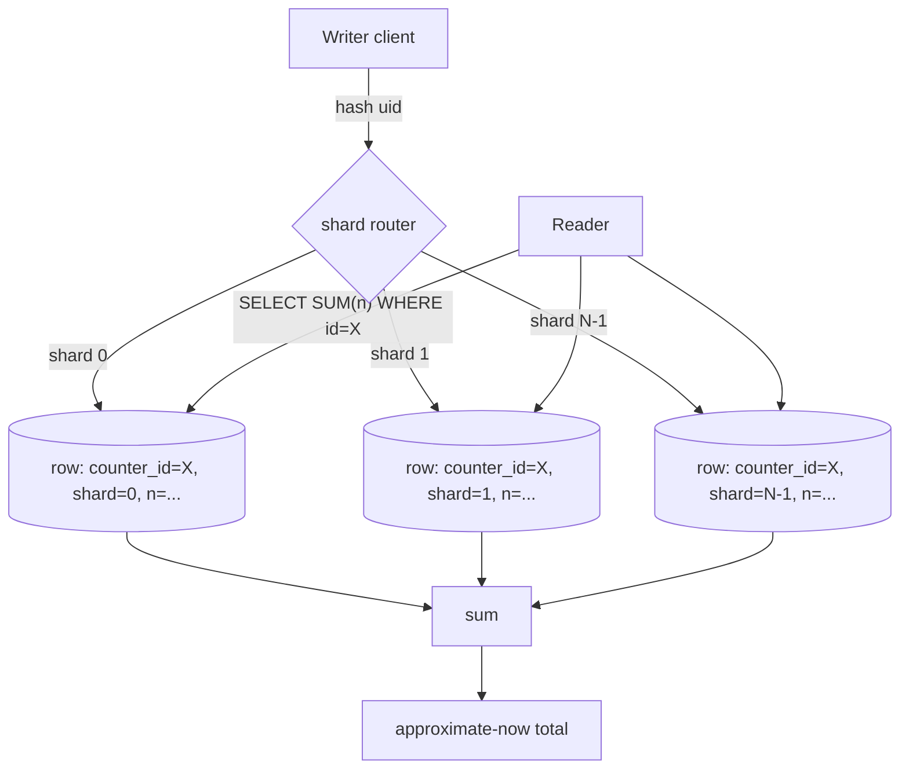
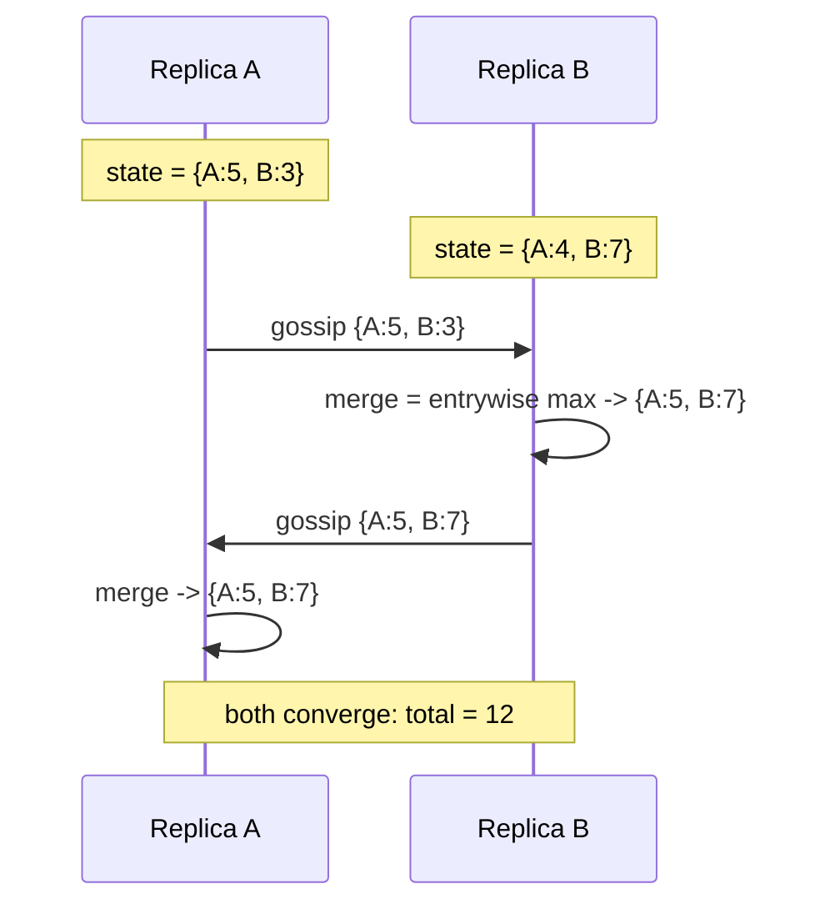
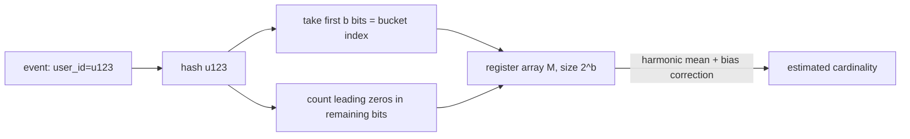
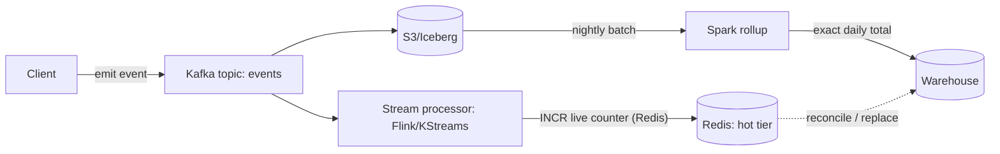

# Distributed Counter

## Why This Exists

**Problem.** A single integer column under `INCREMENT WHERE id = X` does not scale. At ~5–10k writes/sec to one row you saturate the row lock, the leader replica's WAL fsync, or the Redis single-thread event loop. Beyond that, every retry under timeout creates **double-count risk**, every shard hot-spots the partition that owns the key, and every "exact" count across regions costs a synchronous quorum write.

**Key insight.** Counting is a *commutative, associative* operation. You almost never need a globally-consistent integer at write time — you need a value that **converges** to the right answer when read. Once you accept that, the problem decomposes into three orthogonal choices:

1. **How do you split the write load?** (sharding, CRDTs)
2. **Do you need exact or approximate?** (HyperLogLog vs sum-of-shards)
3. **When/where do you reconcile?** (read-time fan-out, background rollup, gossip)

**Reach for this when:**
- View counts, like counts, ad impressions, vote tallies, rate-limit counters at >1k writes/sec/key.
- Geo-distributed counting where cross-region sync writes would blow your latency budget.
- Unique-visitor / unique-IP / cardinality metrics where you can tolerate ~1–2% error.
- Multi-master systems (active-active) where two regions both increment and you need to merge without a coordinator.

**Don't reach for this when:**
- You need **exact, transactional** counts (financial ledger balances, inventory of last unit, anti-fraud "this card has been used N times today" with strict cap). Use a ledger + monotonic stream of events; derive the count from the log.
- Write rate is genuinely low (<100/sec). A single Postgres row with `UPDATE … SET n = n + 1` is fine. **Don't pre-shard a problem you don't have.**
- You need the count to be the source of truth for billing or compliance. Counts are derived; events are durable.

---

## Diagrams

### Sharded counter: write path scatters, read path gathers



### G-Counter merge across two replicas



### HyperLogLog estimate-distinct flow



---

## Pattern 1 — Sharded counter (the workhorse)

**Idea:** split one logical counter into N physical sub-counters. Writes pick a shard (random or by hashed user-id); reads sum across shards. This is the App Engine pattern, and it is what 90% of "high-write counter" systems actually do.

```python
# Postgres-flavored sharded counter. N shards per logical counter.
# At write time, pick a shard at random; at read time, SUM all shards.

import random
import psycopg

NUM_SHARDS = 64  # tune to (peak_writes_per_sec_per_key / safe_writes_per_row_per_sec)

def increment(conn, counter_id: str, delta: int = 1) -> None:
    shard = random.randint(0, NUM_SHARDS - 1)
    # UPSERT — first write to (counter_id, shard) creates the row.
    conn.execute(
        """
        INSERT INTO counter_shards (counter_id, shard, n)
        VALUES (%s, %s, %s)
        ON CONFLICT (counter_id, shard) DO UPDATE SET n = counter_shards.n + EXCLUDED.n
        """,
        (counter_id, shard, delta),
    )

def read(conn, counter_id: str) -> int:
    # Stale-by-replication-lag, but eventually consistent.
    row = conn.execute(
        "SELECT COALESCE(SUM(n), 0) FROM counter_shards WHERE counter_id = %s",
        (counter_id,),
    ).fetchone()
    return int(row[0])
```

**Why random shard, not hash(user_id)?**
- Random spreads load uniformly even if your traffic is bimodal (1% of users do 90% of clicks). Hash(user_id) preserves shard affinity, which is useful only if you also want **at-most-once-per-user** semantics — and that requires a separate dedupe table, not the counter itself.

**How many shards?**
- Rule of thumb: `N = ceil(peak_QPS_for_hottest_key / safe_QPS_per_row)`. For Postgres on a modern NVMe, `safe_QPS_per_row ≈ 2k–5k` before lock-wait dominates. For Redis `INCR`, ~50k–100k. Don't go above N=256 unless you've measured — read-time fan-out becomes the bottleneck.

**Read amplification:** a `SUM` over 64 rows is 64× the index lookups. If reads >> writes, cache the sum in a separate row with a TTL of seconds.

### Cassandra counters — why they're a footgun

Cassandra has a native `counter` type that uses a CRDT-ish PN-Counter under the hood. **It works**, but:
- Counter writes are **not idempotent** at the protocol level. A timeout means "I don't know if it was applied" — retrying may double-count. There is no client-side dedupe.
- They cannot be mixed with non-counter columns in the same table.
- Read-before-write happens internally on every increment, which destroys throughput on hot partitions.

If you need counters in Cassandra, prefer **append a row per event** + periodic rollup, not the counter type. See DDIA ch. 5 ("Replication") on the merge problem.

---

## Pattern 2 — CRDTs: G-Counter and PN-Counter

A **CRDT** (Conflict-free Replicated Data Type) is a data structure with a merge operation that is *commutative, associative, and idempotent*. Replicas can apply updates in any order, gossip state, and **always converge** to the same value with no coordinator. This is the math behind Riak, DynamoDB Streams aggregates, Redis Enterprise's Active-Active, and Roshi.

### G-Counter (grow-only)

State per replica is a **vector** indexed by replica-id, holding the count contributed *by that replica*.

```python
# Grow-only counter. Each replica only increments its OWN slot.
# Merge = entrywise max. Total = sum of vector.

class GCounter:
    def __init__(self, replica_id: str):
        self.replica_id = replica_id
        self.vec: dict[str, int] = {}  # replica_id -> count

    def inc(self, n: int = 1) -> None:
        if n < 0:
            raise ValueError("G-Counter only grows; use PN-Counter for decrements")
        self.vec[self.replica_id] = self.vec.get(self.replica_id, 0) + n

    def value(self) -> int:
        return sum(self.vec.values())

    def merge(self, other: "GCounter") -> None:
        # Entrywise max: if A saw {A:5, B:3} and B saw {A:4, B:7},
        # merge yields {A:5, B:7}. Idempotent — re-merging changes nothing.
        keys = set(self.vec) | set(other.vec)
        self.vec = {k: max(self.vec.get(k, 0), other.vec.get(k, 0)) for k in keys}
```

**Why max-merge works.** Each replica is monotonically non-decreasing in its own slot. Other replicas' slots are observations of that monotonic sequence — taking max never loses information. This is a **state-based CRDT** (CvRDT) per Shapiro et al. 2011.

### PN-Counter (positive-negative)

To support decrements, track two G-Counters: one for positive contributions, one for negative.

```python
class PNCounter:
    def __init__(self, replica_id: str):
        self.p = GCounter(replica_id)
        self.n = GCounter(replica_id)

    def inc(self, k: int = 1) -> None:
        if k >= 0:
            self.p.inc(k)
        else:
            self.n.inc(-k)

    def value(self) -> int:
        return self.p.value() - self.n.value()

    def merge(self, other: "PNCounter") -> None:
        self.p.merge(other.p)
        self.n.merge(other.n)
```

**Why two halves?** You can't subtract from a G-Counter without losing the monotonic invariant — concurrent decrements would race. Splitting `value = P − N` keeps each half monotonic.

**Memory cost.** State grows O(replicas). With ephemeral writers (mobile clients), you must assign stable replica-IDs to *servers*, not clients, or your vector explodes. Akka Distributed Data, Redis CRDTs, and Riak all do this.

### Anti-pattern: "I'll just use a CRDT for everything"

CRDTs converge but they don't tell you *when*. If a user sees a like-count of 42 then refreshes and sees 41, the CRDT is correct (the second read hit a less-up-to-date replica) but the user is confused. **CRDTs require UI/UX that tolerates monotone-ish but non-strictly-monotonic reads.**

---

## Pattern 3 — HyperLogLog for approximate distinct count

**The question being answered:** "How many *unique* users hit `/article/123` today?" — not total hits, **unique** hits.

Naive: store every user-id in a set. Memory = O(n) per article. For 10M unique visitors × 100k articles, this is your entire RAM bill.

**HyperLogLog** (Flajolet et al. 2007) estimates cardinality of a multiset in **O(2^b) space** — typically 12–16 KB for ~1% standard error, regardless of true cardinality. The trick: hash each element, look at the **position of the leftmost 1-bit** in the hash. The maximum leading-zeros observed across all elements is correlated with `log2(cardinality)`. To reduce variance, split the hash into `b` "register" bits (bucket index) and the remaining bits (where you count leading zeros), then take the harmonic mean across registers.

```python
# Toy HLL — pedagogical only. In prod use redis-py or datasketches.
import hashlib
import math

class HyperLogLog:
    def __init__(self, b: int = 14):  # 2^14 = 16384 registers, ~0.81% error
        self.b = b
        self.m = 1 << b
        self.registers = [0] * self.m

    def _hash(self, x: bytes) -> int:
        return int.from_bytes(hashlib.blake2b(x, digest_size=8).digest(), "big")

    def add(self, x: bytes) -> None:
        h = self._hash(x)
        idx = h >> (64 - self.b)               # top b bits = register index
        w = (h << self.b) & ((1 << 64) - 1)    # remaining bits
        # rho = position of leftmost 1, 1-indexed; for all-zero w, rho = 64-b+1
        rho = (64 - self.b - w.bit_length() + 1) if w else (64 - self.b + 1)
        if rho > self.registers[idx]:
            self.registers[idx] = rho

    def count(self) -> int:
        # Harmonic mean estimator with bias correction (constants per Flajolet 2007)
        alpha = {16: 0.673, 32: 0.697, 64: 0.709}.get(self.m, 0.7213 / (1 + 1.079 / self.m))
        z = sum(2.0 ** -r for r in self.registers)
        e = alpha * self.m * self.m / z
        # Small-range correction
        if e <= 2.5 * self.m:
            zeros = self.registers.count(0)
            if zeros:
                e = self.m * math.log(self.m / zeros)
        return int(e)

    def merge(self, other: "HyperLogLog") -> None:
        # HLL is a CRDT! Merge = entrywise max of registers.
        assert self.m == other.m
        self.registers = [max(a, b) for a, b in zip(self.registers, other.registers)]
```

**HLL is a CRDT.** Two HLLs over disjoint sets, merged, give you the cardinality of the union — with the same error bound. This is why Redis exposes `PFMERGE`: you can shard HLLs across servers, merge cheaply, and get a global unique count.

### Redis HLL in practice

```bash
# Add 5 visitors to today's unique-visitor counter for article 123
PFADD article:123:uniques:2026-06-05 user_42 user_99 user_42 user_7 user_1001
# Read estimated cardinality (constant time, ~12KB memory)
PFCOUNT article:123:uniques:2026-06-05
# 4   (user_42 deduped; estimate, not exact)

# Shard by region: each region keeps its own HLL, merge for global
PFADD article:123:uniques:2026-06-05:us  user_a user_b
PFADD article:123:uniques:2026-06-05:eu  user_b user_c
PFCOUNT article:123:uniques:2026-06-05:us article:123:uniques:2026-06-05:eu
# 3   (PFCOUNT with multiple keys merges on the fly)

PFMERGE article:123:uniques:2026-06-05:global \
        article:123:uniques:2026-06-05:us \
        article:123:uniques:2026-06-05:eu
```

**Memory:** Redis dense HLL is exactly 12,304 bytes regardless of cardinality. Sparse encoding (small sets) is even smaller.

**Error:** ~0.81% standard error at default precision (b=14). For a true cardinality of 1,000,000 you'll typically read 992,000–1,008,000.

**What HLL cannot do:**
- Tell you *which* elements are in the set (no membership query — use a Bloom filter for that, accepting a different error type).
- Delete elements (no `PFREM`). To "expire" an HLL, key it by time-window and let it TTL.
- Give exact counts. If your boss demands "exactly how many unique visitors", switch to a Bloom-filter-fronted Redis Set or a Spark `approx_count_distinct → count_distinct` pipeline.

---

## Pattern 4 — Lambda / kappa hybrid: stream + rollup

For audit-grade "approximately right now, exactly right by tomorrow":



The stream layer gives sub-second freshness with possible duplicates (from at-least-once delivery). The batch layer gives exactness by replaying the immutable log with deduplication on event-id. The dashboards read **hot** for "now" and **warehouse** for yesterday and earlier.

This is the dominant pattern at YouTube view counts (per Google's published descriptions), Twitter's Like service (Manhattan + stream), and Netflix's title-watch counters.

---

## Trade-offs

| Benefit | Cost |
|---|---|
| Sharded counter scales linearly in writes | Read-time SUM fan-out: O(N) per read; need sum-cache if reads ≫ writes |
| CRDTs converge with no coordinator | State size grows O(replicas); replicas must have stable IDs |
| HLL gives ~constant memory regardless of cardinality | ~1% error; no membership query; cannot delete |
| Redis `INCR` is single-shard atomic and fast (~100k QPS/core) | Single-key hot-spot; a 200k-QPS celebrity post will pin one CPU |
| Eventual consistency lets you ack writes locally | Two clients may read different values for seconds; UX must tolerate it |
| Stream + batch (lambda) gives audit-grade exactness | Two pipelines to maintain; reconciliation logic is non-trivial |
| Cassandra counter type "just works" | Non-idempotent retries → silent double-counts; mixing with non-counter columns banned |
| Pre-aggregating per-minute counts in writers | Loses per-event granularity; can't recompute slices later |

---

## Common Pitfalls

- **Treating retry-on-timeout as safe.** A timed-out `INCR` may have applied. If your client retries blindly, you double-count. Fix: idempotency key per event; dedupe on (event_id) before applying; or use an append-only event log and derive the count.

- **Hot-key on the celebrity post.** Justin Bieber posts; one Redis shard does 500k QPS; p99 spikes; everyone else's keys on that shard suffer. Fix: detect the hot key (heavy-hitter sketch) and **automatically pre-shard it** to N sub-keys. Reads sum across the N. (Same idea as App Engine's sharded counters, applied dynamically.)

- **Forgetting that `SUM` over shards is also a hot path.** With 256 shards and 10k reads/sec, you've created 2.56M lookups/sec. Cache the sum in a TTL'd row; let writes invalidate or just live with seconds-stale reads.

- **CRDT replica-ID per client.** Mobile users come and go; if each phone gets its own slot in a G-Counter, your state vector explodes to millions of entries. Fix: replica IDs belong to *servers*, not clients. Clients send increments to servers; servers carry the CRDT state.

- **HLL precision creep.** Someone "improves" HLL precision from b=14 to b=18 (256k registers, 256 KB per key). With 10M keys that's 2.5 TB. Default b=14 is almost always right.

- **Mixing exact and approximate in the same dashboard.** "Total views: 1,234,567 — Unique viewers: ~1,200,000". Users will math: "ratio is 1.03". They'll be wrong on edge cases. Always **label HLL-derived metrics as approximate** or round them to 3 sig figs.

- **Counters as the source of truth.** A counter is a *projection* of an event stream. If the counter is wrong, you must be able to recompute it. **Always keep the underlying events** (Kafka, S3, event-sourced DB) for at least the time window you might need to recompute.

- **Cross-region sync writes for a counter.** Someone insists on "exact global count" and writes a synchronous quorum across regions. p99 goes from 5ms to 250ms. The counter is now your most expensive write. Use CRDTs + per-region counters + async gossip.

- **Forgetting clock-skew in time-bucketed counters.** If you key by `today's date` and a writer's clock is 30 minutes ahead, you increment tomorrow's bucket. Use server-side timestamps and accept events into "today" only if event-time falls in `[now − ε, now + ε]`.

---

## Decision Table

| You need… | Use this | Why |
|---|---|---|
| Exact total, low write rate (<100/sec) | Single row, `UPDATE … SET n = n + 1` | Don't pre-shard. Postgres handles it. |
| Exact total, high write rate (>1k/sec/key) | Sharded counter (N rows, SUM on read) | Spreads write contention; reads are still cheap. |
| High writes + multi-region active-active | PN-Counter CRDT, async gossip | No coordinator; converges; tolerates partition. |
| Approximate distinct count | HyperLogLog (Redis HLL) | ~12KB regardless of N; mergeable across shards. |
| Top-K most-frequent items | Count-Min Sketch + heap | HLL doesn't track frequencies. |
| "Has user X been seen?" membership | Bloom filter / Cuckoo filter | HLL can't answer membership. |
| Audit-grade with sub-second freshness | Lambda: stream INCR + nightly batch reconcile | Hot tier for now, batch for truth. |
| Sliding-window rate-limit counter | Redis sorted-set or fixed-window INCR with TTL | Window semantics, not just totals. |
| "Inventory of last 1 unit" / financial balance | Event-sourced ledger + transactional read | Counters are projections, not truth. Don't approximate money. |
| Counter must survive Cassandra retry storms | Append-only events table + periodic rollup | Cassandra `counter` type is non-idempotent under retry. |

---

## References

- Flajolet, Fusy, Gandouet, Meunier — *HyperLogLog: the analysis of a near-optimal cardinality estimation algorithm* — http://algo.inria.fr/flajolet/Publications/FlFuGaMe07.pdf
- Heule, Nunkesser, Hall (Google) — *HyperLogLog in Practice* (EDBT 2013) — https://research.google/pubs/hyperloglog-in-practice-algorithmic-engineering-of-a-state-of-the-art-cardinality-estimation-algorithm/
- Shapiro, Preguiça, Baquero, Zawirski — *A comprehensive study of Convergent and Commutative Replicated Data Types* (INRIA RR-7506, 2011) — https://hal.inria.fr/inria-00555588/document
- Shapiro et al. — *Conflict-free Replicated Data Types* (SSS 2011) — https://pages.lip6.fr/Marc.Shapiro/papers/RR-7687.pdf
- Redis — *HyperLogLog commands* — https://redis.io/docs/latest/commands/pfadd/ and https://redis.io/docs/latest/develop/data-types/probabilistic/hyperloglogs/
- Salvatore Sanfilippo (antirez) — *Redis new data structure: the HyperLogLog* — http://antirez.com/news/75
- Google App Engine — *Sharding counters* (canonical pattern, archived) — https://cloud.google.com/appengine/docs/legacy/standard/python/datastore/transactions
- DynamoDB Developer Guide — *Best practices for managing many-to-many relationships and counters* — https://docs.aws.amazon.com/amazondynamodb/latest/developerguide/best-practices.html
- Riak — *Data Types: Counters* — https://docs.riak.com/riak/kv/latest/developing/data-types/counters/
- Roshi (SoundCloud) — *A CRDT-based stream index* — https://github.com/soundcloud/roshi
- Kleppmann — *Designing Data-Intensive Applications*, ch. 5 (Replication), ch. 9 (Consistency & Consensus)
- Pat Helland — *Life beyond Distributed Transactions* — https://queue.acm.org/detail.cfm?id=3025012
- Martin Kleppmann — *A Critique of the CAP Theorem* — https://arxiv.org/abs/1509.05393
- AWS Builders' Library — *Avoiding overload in distributed systems by putting the smaller service in control* — https://aws.amazon.com/builders-library/avoiding-overload-in-distributed-systems-by-putting-the-smaller-service-in-control/
- Cormode, Muthukrishnan — *An Improved Data Stream Summary: The Count-Min Sketch* — http://dimacs.rutgers.edu/~graham/pubs/papers/cm-full.pdf
- Xu — *System Design Interview Vol. 2*, ch. on "Distributed counter" and "Top-K"
- Google SRE Workbook — ch. 9 "Incident Response" (for thinking about counter accuracy under partial failure) — https://sre.google/workbook/incident-response/

---

## See Also

- `../rate-limiter/` — token bucket and sliding-window counters share sharding and Redis patterns; rate-limiters are counters with a threshold.
- `../url-shortener/` — click-tracking is a counter problem; same trade-offs apply.
- `../newsfeed/` — like/comment/share counts on posts use sharded counters with hot-key auto-detection.
- `../../data-systems/stream-processing/` — lambda architecture for stream + batch reconciliation.
- `../../data-systems/key-value/` — INCR semantics, HLL commands, single-thread implications.
- `../../data-systems/wide-column/` — why Cassandra counters are a footgun and what to use instead.
- `../../data-systems/consistency-models/` — what "converges" means and how to communicate it to PMs.
- `../../data-systems/crdts/` — deeper treatment of state-based vs operation-based CRDTs.
- `../../data-systems/partitioning/` — general sharding strategies; counters are a special case where random shard beats hash.
- `../../data-systems/bloom-filter/` — set-membership cousin of HyperLogLog; the right tool when the question is "have we seen X?" rather than "how many distinct X?"
- `../../data-systems/data-skew/` — celebrity-counter hot-shard mitigation; salting and randomized-shard counters as a special case
