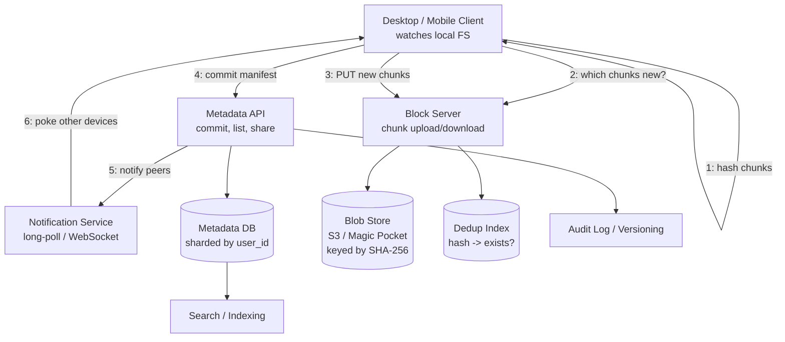
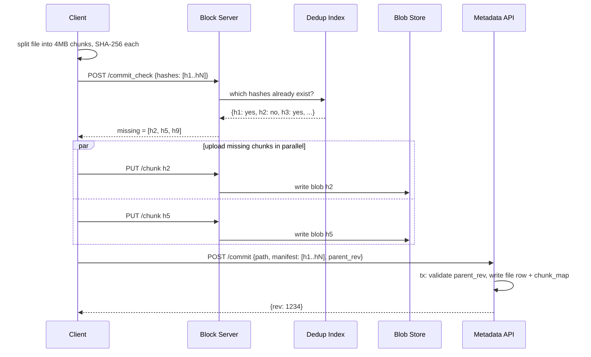
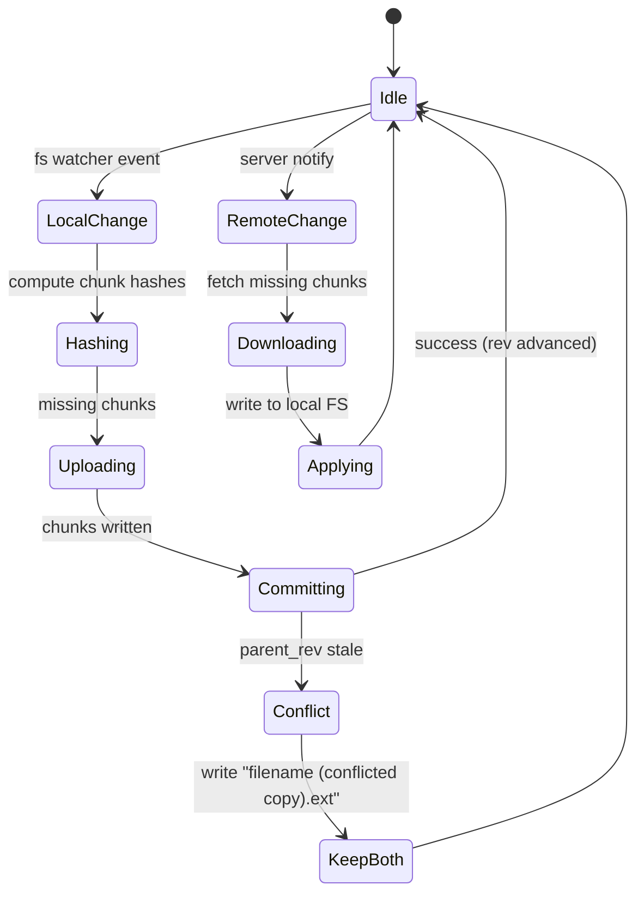

# Distributed File Storage (Dropbox / Google Drive)

## Why This Exists

**Problem.** A user drops a 5 GB Final Cut Pro export into their Dropbox folder. They expect: (1) it appears on their phone in seconds, (2) editing one frame doesn't re-upload 5 GB, (3) if their laptop dies mid-upload, resuming Just Works, (4) if their spouse edits the same file on another laptop while offline, neither edit silently disappears. Meanwhile the company storing it wants to pay for **one** copy across millions of users who all downloaded the same Taylor Swift MP3.

**Key insight.** A "file storage" service is really **two services glued together**: a **content-addressable blob store** (immutable chunks keyed by hash, dedup-friendly, cheap object storage) and a **metadata service** (mutable file tree, ACLs, sync state — the hard, hot, expensive part). The interview almost always lives in the metadata layer. Dropbox's Magic Pocket post and "Scaling to exabytes" make this split explicit: blob storage is a solved problem at S3/GCS; the engineering investment is in metadata, sync, and conflict resolution.

**Reach for this when** the prompt mentions: Dropbox, Google Drive, OneDrive, iCloud Drive, Box, "design a file sync service", "upload large files with resume", "deduplicate user uploads", "share folders with permissions", "offline edits with sync".

**Don't reach for this when** the prompt is really:
- **Block storage** (EBS) — different consistency model, single-attach.
- **Backup** (Time Machine, Backblaze) — append-only, no two-way sync, no conflict resolution.
- **CDN** — read-heavy, no mutation, no per-user namespace.

## Diagrams

### High-level architecture



### Upload a large file (chunked + dedup)



### Sync state machine on the client



## Interview Walkthrough

### 1. Clarify scope (90 seconds, do not skip)

Ask, in this order:
1. **Read/write ratio?** Drive is roughly 1:1 commits-to-reads per active file but **100:1 listing-to-mutation** on the metadata side. Browsing folders dominates.
2. **Single-user scope or shared folders?** Shared folders change everything (fan-out on notify, ACL checks on every read, multi-writer conflict resolution).
3. **Max file size?** Dropbox caps individual files at 2 TB; Drive at 5 TB. This forces resumable, chunked uploads — you cannot stream a 2 TB PUT.
4. **Offline?** If yes, you're committing to a CRDT-ish merge story for the file tree (renames especially).
5. **Versioning / undelete?** Pushes you toward immutable chunks + version chain in metadata.
6. **End-to-end encryption?** Kills server-side dedup across users (more on this in pitfalls).

### 2. Back-of-envelope (memorize these numbers)

- **Users:** 700 M registered, ~50 M DAU (Dropbox-scale).
- **Avg user storage:** ~2 GB free tier, 50 GB paid average → call it **~10 GB/user blended** = 500 PB raw.
- **Dedup savings:** historically Dropbox reported ~30% cross-user dedup, ~50% intra-user (versions, copies). Net stored ≈ 250 PB.
- **Metadata rows:** avg ~1000 files/user × 50 M DAU = 50 B file rows, **far more chunk rows** (~5–50× depending on chunk size).
- **Notification fan-out:** avg 3 devices/user → every commit produces ~3 notifies. Shared folder with 50 collaborators → 50× fan-out.
- **Hot path QPS:** if 50 M DAU each makes 100 metadata reads/day → ~60 K QPS sustained, 5–10× peak. **Metadata is the hot service**, not blob.

### 3. Data model — the load-bearing decisions

```sql
-- USERS / NAMESPACES (a "namespace" = a personal root or a shared folder)
CREATE TABLE namespaces (
  ns_id        BIGINT PRIMARY KEY,
  owner_uid    BIGINT NOT NULL,
  kind         ENUM('personal', 'shared'),
  created_at   TIMESTAMP
);

-- FILE TREE — one row per logical file (or folder), versioned via rev chain
CREATE TABLE files (
  ns_id        BIGINT NOT NULL,
  path_hash    BINARY(16) NOT NULL,  -- hash of normalized path within ns
  path         VARCHAR(4096) NOT NULL,
  parent_hash  BINARY(16),           -- folder containing this file
  is_dir       BOOLEAN,
  rev          BIGINT NOT NULL,      -- monotonic per (ns_id, path_hash)
  size         BIGINT,
  manifest_id  BIGINT,               -- FK -> manifests; NULL for dirs
  modified_at  TIMESTAMP,
  modified_by  BIGINT,
  deleted      BOOLEAN DEFAULT FALSE,
  PRIMARY KEY (ns_id, path_hash, rev)
);
CREATE INDEX ON files (ns_id, parent_hash, deleted);  -- folder listing

-- MANIFEST: ordered list of chunks that make up a file version
CREATE TABLE manifests (
  manifest_id  BIGSERIAL PRIMARY KEY,
  ns_id        BIGINT NOT NULL,
  total_size   BIGINT NOT NULL
);
CREATE TABLE manifest_chunks (
  manifest_id  BIGINT NOT NULL,
  seq          INT NOT NULL,
  chunk_hash   BINARY(32) NOT NULL,  -- SHA-256
  chunk_size   INT NOT NULL,
  PRIMARY KEY (manifest_id, seq)
);

-- DEDUP INDEX: does this content exist anywhere? (per-shard or global)
CREATE TABLE chunks (
  chunk_hash   BINARY(32) PRIMARY KEY,
  blob_locator VARCHAR(256) NOT NULL,  -- e.g. "magic-pocket://zone-a/cell-7/0xab..."
  ref_count    BIGINT NOT NULL,        -- for GC; or use mark-and-sweep instead
  created_at   TIMESTAMP
);

-- ACL on shared folders
CREATE TABLE memberships (
  ns_id    BIGINT,
  uid      BIGINT,
  role     ENUM('viewer','editor','owner'),
  PRIMARY KEY (ns_id, uid)
);

-- DEVICE STATE: each device tracks the last rev it saw per namespace
CREATE TABLE device_cursors (
  device_id  BIGINT,
  ns_id      BIGINT,
  last_rev   BIGINT,
  PRIMARY KEY (device_id, ns_id)
);
```

**Sharding key.** Shard `files`, `manifests`, `device_cursors` by **`ns_id`** (Dropbox calls this the "namespace" — a personal root or a shared folder). This keeps a folder listing on one shard, keeps share-folder commits transactional, and lets you migrate hot users by moving their namespace. Sharding by `uid` instead breaks shared folders across shards.

Shard `chunks` (the dedup index) **separately by `chunk_hash`**. It's a different access pattern (random reads, write-once) and orders of magnitude smaller in row count than `manifest_chunks`.

### 4. Chunking — the heart of the upload path

#### Fixed-size chunking (what Dropbox does)

Dropbox uses **4 MB fixed-size chunks**, hashed with SHA-256. Pros: trivial to implement, predictable parallelism, easy to range-request on download. Con: a 1-byte insertion at the start of a file invalidates **every** chunk boundary downstream — zero dedup against the previous version.

```python
CHUNK_SIZE = 4 * 1024 * 1024  # 4 MiB

def chunk_file_fixed(path):
    chunks = []
    with open(path, 'rb') as f:
        while True:
            buf = f.read(CHUNK_SIZE)
            if not buf:
                break
            h = hashlib.sha256(buf).digest()
            chunks.append((h, len(buf), buf))
    return chunks
```

Why is this still good enough for Dropbox? Because the dominant case is **whole-file writes** (Office saves, Photoshop "Save As", video re-export). The app rewrites the entire file; chunking would re-upload everything regardless. Cross-user dedup (everyone has the same `IMG_1234.JPG`) is the win, not delta-sync.

#### Content-defined chunking (rolling hash, what rsync / Restic / borg do)

When you genuinely care about **incremental sync** (a 1 GB log file that grows by 100 MB/day, a VM disk image, a database dump), use a **rolling hash** to find chunk boundaries based on content, so insertions only invalidate a local window.

```python
# Buzhash / Rabin-Karp style rolling hash boundary detection
WINDOW = 64
TARGET = 1 << 20      # ~1 MiB average chunk
MASK   = TARGET - 1
MIN_CHUNK = 256 * 1024
MAX_CHUNK = 4 * 1024 * 1024

def chunk_file_cdc(path):
    chunks, buf = [], bytearray()
    h = RollingHash(window=WINDOW)
    with open(path, 'rb') as f:
        while (b := f.read(1)):
            buf.append(b[0])
            h.update(b[0])
            # cut when low bits of hash hit zero AND respect min/max bounds
            cut = (len(buf) >= MIN_CHUNK and (h.value & MASK) == 0) \
                  or len(buf) >= MAX_CHUNK
            if cut:
                chunks.append(emit(buf))
                buf.clear(); h.reset()
    if buf:
        chunks.append(emit(buf))
    return chunks
```

**Why this works:** a single byte inserted shifts content. Without rolling hash, every fixed boundary moves. With rolling hash, the boundary "re-syncs" within ~one chunk, so only the chunks straddling the edit change. Restic, borgbackup, rsync, and Apple's CloudKit asset sync all use variants of this.

**Cost:** CPU on the client (~200–500 MB/s on modern hardware with FastCDC), and chunk sizes vary, which makes range-reads less predictable.

**Decision rule for the interview:**
- File-sync product with mostly whole-file writes (Dropbox, iCloud Drive) → **fixed chunks** + cross-user dedup is enough.
- Backup product, version control, or rsync replacement → **content-defined chunking** is worth the complexity.

### 5. Deduplication — and its three sharp edges

```python
# The dedup-aware upload flow
def upload(file_path, namespace_id, parent_rev):
    chunks = chunk_file_fixed(file_path)
    hashes = [h for (h, _, _) in chunks]

    # 1. Ask server which we already have. Cheap (single round-trip, hashes only).
    missing = post('/commit_check', {'hashes': hashes})['missing']

    # 2. Upload only what's new, in parallel.
    upload_in_parallel([(h, data) for (h, _, data) in chunks if h in set(missing)])

    # 3. Commit the manifest (the *list of hashes*) atomically.
    return post('/commit', {
        'path': file_path,
        'namespace_id': namespace_id,
        'parent_rev': parent_rev,         # optimistic concurrency control
        'manifest': hashes,
        'sizes':    [s for (_, s, _) in chunks],
    })
```

**Three sharp edges:**

1. **Trust boundary.** A malicious client can claim "I already have chunk `h`" without ever uploading it, then later read it back — leaking another user's data. **Fix:** require **proof of possession** before granting read access to a deduped chunk. Either (a) only dedup *within* a user's namespace (safer, less savings), or (b) require the client to upload the chunk anyway on first reference for a user (Dropbox's approach historically: cross-user dedup at *storage* layer, but per-user upload required for ACL purposes).

2. **Garbage collection is hard.** Reference counts race with concurrent uploads (you decrement to 0, then a new commit references that hash before you delete the blob). Either (a) use **mark-and-sweep** with a grace period (Magic Pocket does this) and never delete a blob younger than N days, or (b) use a **monotonic ref-count** with tombstone records and delete only after the tombstone outlives all readers. Never trust an in-place ref count on a hot table.

3. **End-to-end encryption kills cross-user dedup.** If each user encrypts with their own key, identical plaintexts produce different ciphertexts. **Convergent encryption** (key = hash of plaintext) restores dedup but enables *confirmation-of-file* attacks: an attacker who guesses your file content can verify it. This is why iCloud Advanced Data Protection and end-to-end-encrypted Drive *do not* dedup across users.

### 6. The metadata commit — where transactions matter

The commit is the **only** strongly-consistent operation in the system. Everything else (chunk uploads, notify, indexing) is eventually consistent.

```python
# Server-side, runs in a single DB transaction on the namespace's shard.
def commit(uid, ns_id, path, parent_rev, manifest_hashes, sizes):
    with txn(shard=shard_for(ns_id)):
        # 1. ACL check
        require_role(uid, ns_id, in_={'editor', 'owner'})

        # 2. Optimistic concurrency: confirm parent_rev is still HEAD
        head = select_head_rev(ns_id, path_hash(path))
        if head is not None and head.rev != parent_rev:
            raise Conflict(server_rev=head.rev)   # client decides: merge / keep-both

        # 3. Verify all referenced chunks exist (defense in depth)
        present = select_existing_chunks(manifest_hashes)
        if present != set(manifest_hashes):
            raise MissingChunks(manifest_hashes - present)

        # 4. Insert the new manifest + new file row
        manifest_id = insert_manifest(ns_id, sum(sizes))
        insert_manifest_chunks(manifest_id, manifest_hashes, sizes)
        new_rev = head.rev + 1 if head else 1
        insert_file_row(ns_id, path_hash(path), path, new_rev, manifest_id)

        # 5. Bump chunk ref counts (or write provenance rows for mark-and-sweep)
        bump_refs(manifest_hashes)

        # 6. Append to the per-namespace changelog (for sync notify)
        append_changelog(ns_id, op='write', path=path, rev=new_rev, by=uid)

    # 7. AFTER commit, fan out — best-effort, idempotent, retried.
    enqueue_notify(ns_id, new_rev)
    return new_rev
```

Two things to defend in interview:

- **Why a per-namespace changelog?** Because the sync engine pulls "give me everything since rev N" — a single ordered append per namespace gives clients a clean cursor. Dropbox calls these `cursors` in the API.
- **Why optimistic concurrency, not locking?** Because users go offline. You can't hold a lock across a flight. Optimistic + conflict-on-commit + keep-both fallback is the only model that survives offline edits.

### 7. Sync engine — pull, push, notify

The client runs three loops, isolated from each other:

```python
# Loop 1: local watcher → upload queue
def local_loop():
    for event in fs_watcher():            # fsevents / inotify / ReadDirectoryChangesW
        debounce(event, 500ms)            # editors do many writes per save
        if is_temp_file(event.path):      # ignore .swp, ~$file.docx, .DS_Store
            continue
        enqueue_upload(event.path)

# Loop 2: long-poll server for remote changes
def remote_loop():
    cursor = load_cursor()
    while True:
        # Long-poll: server holds connection for up to 90s, returns when changed
        changes = post('/longpoll', {'cursor': cursor, 'timeout': 90})
        if changes:
            for ns_id in changes['namespaces']:
                pull_changes(ns_id)
        cursor = changes['cursor']
        save_cursor(cursor)

# Loop 3: pull changes for a namespace
def pull_changes(ns_id):
    last = device_cursor(ns_id)
    delta = get(f'/list_folder/continue?cursor={last}')
    for entry in delta['entries']:
        if entry.deleted:
            apply_delete(entry.path)
        else:
            missing = [h for h in entry.manifest if not have_locally(h)]
            download_chunks(missing)
            assemble_locally(entry.path, entry.manifest)
    save_device_cursor(ns_id, delta['cursor'])
```

**Notification.** Long-polling (held HTTP request) is the workhorse. It avoids the cost of full WebSocket state at scale (Dropbox had ~hundreds of millions of clients) and degrades gracefully through corporate proxies. The trade-off vs WebSocket is per-event latency (~tens of ms more), which is fine for a sync product. See Dropbox's "How we built our notification system" engineering post.

**Backpressure.** The notify service must **not** push the full delta — only "namespace X changed, come fetch." Otherwise a 50-collaborator shared folder with a 1 GB commit fan-outs 50 GB of notify payload. Notify is a **cache invalidation**, not a delivery mechanism.

### 8. Conflict resolution — the unglamorous truth

Dropbox does **not** auto-merge file contents. It does **keep-both**: when client A and client B both commit changes from the same `parent_rev`, the second commit gets renamed to `filename (Alice's conflicted copy 2024-03-14).ext`. This is intentional:

- **Generic file content cannot be merged safely** without knowing the format. Merging two Word docs is not a 3-way text merge.
- **Showing the user both versions** lets them resolve in their app of choice.
- **It's deterministic and recoverable** — no data loss.

```python
def on_commit_conflict(local_path, server_rev, my_changes):
    # Server rejected our commit because someone else committed first.
    # 1. Rename our local file to "filename (conflicted copy <date>).ext"
    conflict_path = make_conflict_name(local_path, user_name(), now())
    os.rename(local_path, conflict_path)

    # 2. Pull the server's version into the original path
    pull_file(local_path)

    # 3. Re-upload our renamed copy as a *new* file (no conflict — new path)
    enqueue_upload(conflict_path)
```

**Folder-level conflicts** (rename + edit, delete + edit, double-rename) are nastier. Best practice:
- **Delete-vs-edit:** the edit wins (resurrect the file). Deleting a file someone else is actively editing is rarely intentional.
- **Rename-vs-rename:** keep both names — create a copy under each. Document this; users will ask.
- **Move into deleted folder:** recreate the parent folder; it's cheap insurance.

Google Drive has a different model: **the file is the source of truth, paths are advisory.** A file lives at a stable file ID; "moving" only changes its parent. Two users moving the same file to two different parents → the file ends up in *both* folders (multi-parent), or the last writer wins (depending on Drive's configuration). This avoids most rename conflicts but breaks the POSIX mental model.

### 9. Storage layer (Magic Pocket — Dropbox's exabyte-scale blob store)

Most interview answers should say "use S3" and move on. If asked to go deeper:

- **Erasure coding** (e.g., 6+3 Reed-Solomon) instead of 3× replication: ~1.5× overhead vs 3×, same durability. Magic Pocket uses RS-style codes across zones.
- **Cells/zones:** group ~50–100 racks; chunks placed deterministically (consistent hashing on chunk_hash) so reads find the cell without a lookup.
- **Cold tier:** chunks not accessed in N days move to higher-density, slower hardware. Read latency for cold chunks is ~seconds, fine for "open my 2018 photos."
- **No deletes inline:** mark for deletion, sweep async, ~7 day grace.

Don't reinvent this in the interview. Just say "we use an internal blob service, S3-compatible, erasure-coded across AZs" and pivot back to metadata.

## Trade-offs

| Benefit | Cost |
|---|---|
| Fixed-size chunking (simple, predictable) | No incremental dedup on inserts; re-uploads whole file on append |
| Content-defined chunking (incremental dedup) | CPU on client; variable chunk size; harder range reads |
| Cross-user dedup (~30% savings) | Confirmation-of-file attack surface; complicates E2EE |
| Per-user dedup only (safer) | Less storage savings; doesn't help with viral files |
| Long-polling for notify | Slightly higher latency than WebSocket | Survives corporate proxies; lower per-conn state |
| Optimistic concurrency on commit | Conflicts surface as user-visible "(conflicted copy)" files |
| Keep-both on conflict (no auto-merge) | Users see clutter | No data loss; format-agnostic |
| Sharding by namespace | Hot shared folders concentrate load on one shard | Folder listings are single-shard, transactional |
| Sharding by user_id instead | Even load distribution | Shared folders span shards, kill transactionality |
| Strong metadata consistency (single shard txn) | Limits throughput per namespace | Sync engine doesn't see torn states |
| Eventual notify / search / audit | Brief lag before search reflects writes | Decouples hot path from analytics |
| Erasure coding (1.5× overhead) | More CPU on read; reconstruction cost on failure | ~50% storage savings vs 3× replication |
| Resumable chunked upload | Client and server keep upload state | Survives flaky networks; mandatory at >100 MB |

## Common Pitfalls

- **"Just upload the whole file, S3 is cheap."** S3 PUT caps at 5 GB single-object, multipart at 5 TB. Without chunking, a 4 GB upload that fails at 99% restarts from zero. Worse, you have no dedup. This answer fails the interview.
- **Sharding by `user_id`.** Looks fine until shared folders show up: a single commit now needs a 2-phase commit across shards. Shard by **namespace**.
- **Dedup index in the same DB as file metadata.** Different access patterns (hash lookups vs path lookups), different growth rate (chunks dwarf files). Separate them.
- **Trusting the client's "I already have this chunk" claim.** Without proof-of-possession or per-user upload-on-first-reference, you have a cross-user data leak.
- **Reference counting chunks naively.** Race between "decrement to 0" and "new commit references hash." Use mark-and-sweep with a grace window.
- **No conflict semantics for offline edits.** "Last write wins" loses user data. Keep-both, always.
- **Hashing temp files / editor swap files.** Watch loops upload `~$report.docx`, `.report.docx.swp`, `.DS_Store`, `Thumbs.db`. Maintain an explicit ignore list; without it you'll upload a million junk chunks per day.
- **Long-poll without idle timeout.** Stale connections pile up behind corporate NATs. 90s timeout is the industry default.
- **Push full deltas via notify.** Notify is invalidation. Push payloads cause O(file_size × collaborators) fan-out.
- **Search index synchronously updated on commit.** Adds latency, makes commits fail when ES is degraded. Async with at-least-once.
- **Per-keystroke uploads.** Office and Adobe apps issue dozens of small writes per save. Debounce 500ms–2s; coalesce into one chunked upload.
- **No path normalization.** `Folder/file.txt` vs `folder/file.txt` vs `Folder/file.txt ` (trailing space) — case folding, Unicode NFC normalization, and trim are mandatory before path-hashing. Cross-platform users will hit this on day one (macOS NFD vs Linux NFC for filenames with accents).
- **Forgetting clock skew.** Don't use client wall-clock for ordering. Use server-assigned monotonic `rev` per namespace.
- **Treating "rename" as delete+create.** Doing so loses version history and re-uploads chunks. Renames are metadata-only operations on the file row.
- **No quota enforcement at commit time.** Quota checks against eventually-consistent storage usage let users blow past limits. Reserve at upload-check, finalize at commit, reconcile async.

## Decision Table

| Situation | Choose | Reason |
|---|---|---|
| Consumer file sync, mostly whole-file writes (Dropbox, iCloud Drive) | Fixed-size 4 MB chunks + cross-user dedup | Cross-user dedup dominates the savings; CDC complexity unjustified |
| Backup product (Restic, borg, Time Machine cloud) | Content-defined chunking (FastCDC / Buzhash) | Append/insert workloads need delta-sync; per-user store anyway |
| End-to-end encrypted product (E2EE Drive, Proton Drive) | Per-user dedup only OR no dedup | Cross-user dedup either leaks (CFA) or requires convergent encryption + threat model acceptance |
| Shared workspace product (Drive, Box) | Shard by namespace (folder), file-ID-based moves | Avoids cross-shard txns on shared-folder commits; survives multi-parent moves |
| Strict POSIX semantics required | Don't build this — use a NAS / EFS | Sync engines are eventually consistent for performance; don't fake POSIX |
| Read-mostly, immutable, public assets | Use a CDN-fronted object store | No sync engine, no per-user namespace, no conflict resolution needed |
| Single-writer, append-only logs | Use a log service (Kafka) or object store | A sync engine is overkill; conflict model doesn't fit |
| Collaborative document body (Google Docs, Figma) | CRDT or OT service, separate from file metadata | Drive stores a *pointer*; the doc body is its own service. See `../../data-systems/crdts/` |
| Notifications: small fleet (<10 K connected) | WebSocket | Simpler client; lower latency |
| Notifications: huge fleet (millions) behind corporate proxies | HTTP long-poll | Lower per-connection state; traverses proxies |
| Conflict resolution policy | Keep-both, never auto-merge generic files | Format-agnostic; deterministic; no data loss |
| Versioning retention | 30 days for free, 180 days for paid, immutable chunks underneath | Cheap due to dedup; user expectation; legal hold optional |

## References

- Dropbox Engineering — *Inside the Magic Pocket* — https://dropbox.tech/infrastructure/inside-the-magic-pocket
- Dropbox Engineering — *Scaling to Exabytes and Beyond* — https://dropbox.tech/infrastructure/scaling-to-exabytes-and-beyond
- Dropbox Engineering — *Streaming File Synchronization* (Nucleus) — https://dropbox.tech/infrastructure/streaming-file-synchronization
- Dropbox Engineering — *Rewriting the heart of our sync engine* — https://dropbox.tech/infrastructure/rewriting-the-heart-of-our-sync-engine
- Dropbox Engineering — *How we migrated Dropbox from Nginx to Envoy* (notify path) — https://dropbox.tech/infrastructure/how-we-migrated-dropbox-from-nginx-to-envoy
- Drago, Mellia, Munafò — *Inside Dropbox: Understanding Personal Cloud Storage Services* (IMC 2012) — https://conferences.sigcomm.org/imc/2012/papers/imc169-dragoA.pdf
- Tridgell — *The rsync algorithm* (rolling-hash origin) — https://rsync.samba.org/tech_report/
- Xia et al. — *FastCDC: A Fast and Efficient Content-Defined Chunking Approach* (USENIX ATC 2016) — https://www.usenix.org/conference/atc16/technical-sessions/presentation/xia
- Restic — *Design and chunking* — https://restic.readthedocs.io/en/stable/100_references.html#design
- AWS — *Amazon S3 multipart upload best practices* — https://docs.aws.amazon.com/AmazonS3/latest/userguide/mpuoverview.html
- Google — *Drive API change feed and cursors* — https://developers.google.com/drive/api/guides/manage-changes
- DDIA ch. 5 — *Replication* (sync vs async, conflict resolution).
- DDIA ch. 7 — *Transactions* (optimistic concurrency, snapshot isolation).
- DDIA ch. 9 — *Consistency and Consensus* (linearizability boundary, why metadata commits are the only strict-serializable op).
- *System Design Interview Vol. 1* (Alex Xu) — chapter on Google Drive / file sync.
- Stoica et al. — *Chord* (consistent hashing, useful background for chunk placement).
- Patrick O'Neil — *The Log-Structured Merge-Tree* (relevant if metadata DB is RocksDB-backed).

## See Also

- `../notification-system/` — long-poll vs WebSocket vs SSE trade-offs at scale.
- `../search-typeahead/` — how to index file names and contents asynchronously off the commit path.
- `../rate-limiter/` — protect the metadata API from a runaway client doing per-keystroke commits.
- `../../data-systems/consensus/` — needed inside the metadata shard for txn ordering if you go multi-master.
- `../../communication/idempotency/` — every chunk PUT and every commit must be idempotent under retry.
- `../../architecture-patterns/event-sourcing/` — the per-namespace changelog is event-sourced; useful framing.
