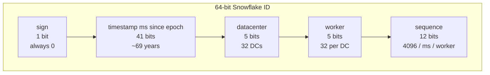
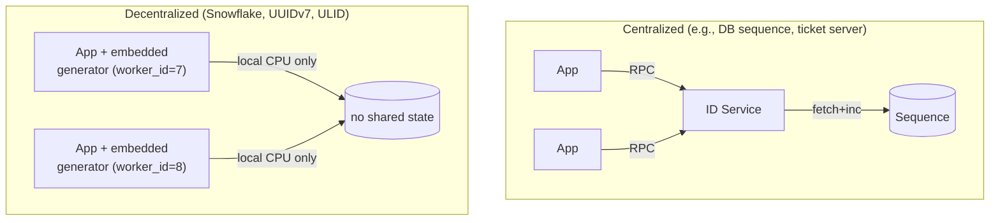
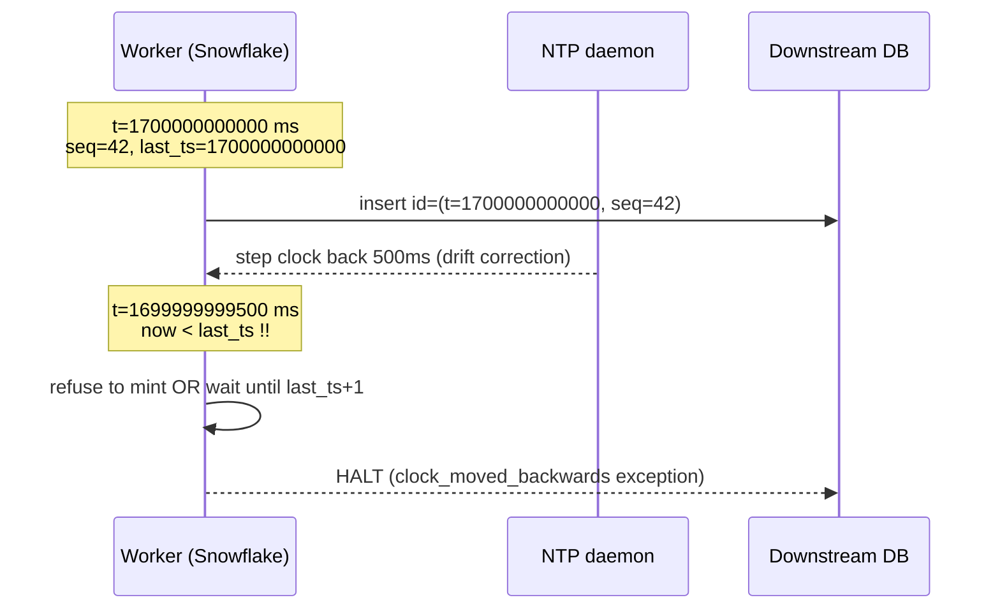

# Distributed ID Generator

## Why This Exists

**Problem.** A monolithic database can lean on `AUTO_INCREMENT` / `SERIAL` / a single sequence and call it a day. The moment you shard, run multi-region, or want to mint IDs *before* hitting the database (so the client can reference its own write before commit), a single counter becomes a bottleneck — or worse, a single point of failure. UUIDv4 looks tempting, but its randomness destroys B-tree locality and bloats indexes by 2-3× on write-heavy tables.

**Key insight.** A "good" distributed ID is a tuple of **(time, machine identity, intra-millisecond counter)** packed into 64 or 128 bits. Time gives you sortability and rough-locality in indexes. Machine identity gives you collision-freedom without coordination. The counter handles bursts within the same tick. Every well-known scheme — Snowflake, ULID, UUIDv7, Sonyflake, KSUID — is a variation on those three fields.

**Reach for this when:**
- You're sharding a relational DB and need globally-unique primary keys minted client-side.
- You want IDs that are roughly time-sortable so range scans, pagination, and TTL cleanup work.
- You need to mint IDs offline / on the client / before a network round-trip.
- An interview prompt asks you to design Twitter, Instagram, TinyURL, a chat system, or any append-only log.

**Don't reach for this when:**
- You have a single primary database and writes fit on one box — use `BIGSERIAL` and stop.
- The IDs are user-facing secrets (session tokens, password reset links). Use `crypto/rand` and don't leak structure.
- You need *strict* total ordering across nodes — that requires consensus (Raft, Spanner TrueTime), not a Snowflake-style scheme.
- The IDs must be short and human-typeable (coupon codes, room codes). Use a base32 nanoid against a collision-checked table.

---

## Diagrams

### Snowflake 64-bit layout



### Centralized vs decentralized generation



### Clock skew failure mode



---

## The contenders, in one table

| Scheme | Size | Time-sortable | Coordination needed | Random bits | Library/spec |
|---|---|---|---|---|---|
| **UUIDv4** | 128 bits | No | None | 122 | RFC 4122 |
| **UUIDv7** | 128 bits | Yes (ms precision) | None | 74 | RFC 9562 (May 2024) |
| **Snowflake** | 64 bits | Yes (ms precision) | Worker ID assignment | 0 | Twitter (archived) |
| **Sonyflake** | 64 bits | Yes (10ms precision) | Worker ID via etcd/IP | 0 | Sony OSS |
| **ULID** | 128 bits | Yes (ms precision) | None | 80 | ulid spec |
| **KSUID** | 160 bits | Yes (sec precision) | None | 128 | Segment OSS |
| **MongoDB ObjectId** | 96 bits | Yes (sec precision) | None | 40 (machine+pid) | MongoDB spec |
| **Instagram-style** | 64 bits | Yes (ms precision) | DB shard ID = logical | 0 | Postgres `nextval` per shard |
| **Centralized ticket** (Flickr) | 64 bits | Yes | Two MySQL boxes (HA) | 0 | Flickr blog post |

---

## UUIDv4 — the random fallback

128 bits, 122 random. Collision-free for all practical purposes (after ~2.71 quintillion IDs you have a 50% chance — birthday bound).

**Why people pick it:** zero infrastructure, no coordination.

**Why it bites in production:**
1. **Index fragmentation.** Random inserts into a B-tree primary key cause page splits everywhere. Throughput on a write-heavy InnoDB table can drop 2-4× vs sequential keys, and the index grows ~30-40% larger because pages don't fill.
2. **Cache misses.** Hot recent rows aren't co-located — every write touches a cold leaf page.
3. **Not sortable.** You need a separate `created_at` column for time queries, and you can't paginate by ID.

```python
# Don't use this as a primary key on a write-heavy table.
import uuid
id = uuid.uuid4()  # e.g. '7c1a3f2e-4b9d-4e1c-8f6a-1d2e3f4a5b6c'
```

If you must use UUIDv4 in MySQL, store as `BINARY(16)` and consider `UUID_TO_BIN(uuid, 1)` (8.0+) which swaps the time-low and time-hi fields to make UUIDv1 sequential — but that's a v1 trick, not v4.

---

## UUIDv7 — the modern default for new systems

Standardized May 2024 in **RFC 9562**. Layout:

```
| 48-bit unix_ts_ms | 4-bit ver=7 | 12-bit rand_a | 2-bit var | 62-bit rand_b |
```

48 bits of millisecond timestamp (good through year 10889), 74 bits of randomness. Lexicographically sortable. Drop-in replacement for UUIDv4 columns — same `UUID` type in Postgres, same 16 bytes.

```go
// Go - github.com/google/uuid v1.6.0+
import "github.com/google/uuid"

id, err := uuid.NewV7()
// 0190f5a4-7b3c-7e8f-a1b2-c3d4e5f6a7b8
//          ^---- version 7 nibble
```

```python
# Python 3.13+ stdlib, or `uuid7` package on older versions
from uuid import uuid7
id = uuid7()
```

**When UUIDv7 wins over Snowflake:**
- You don't want to assign worker IDs.
- 128 bits is fine (Postgres `uuid`, Cassandra `timeuuid`, DynamoDB string).
- You don't need a compact 64-bit key for cross-system joins.

**When Snowflake still wins:**
- Storage and bandwidth matter (8 bytes vs 16 bytes × billions of rows).
- You want explicit "this came from worker N in DC M" traceability for debugging.

---

## Twitter Snowflake — the canonical 64-bit design

**Original repo:** https://github.com/twitter-archive/snowflake (archived 2017, frozen at 2010 Scala impl). Twitter has since moved to a successor but the bit layout became the de-facto standard.

### Bit layout (64 bits, signed long so high bit is 0)

```
0 | 41-bit timestamp_ms | 5-bit datacenter_id | 5-bit worker_id | 12-bit sequence |
1 | 41                  | 5                   | 5               | 12              | = 64
```

- **41 bits of ms-timestamp** offset from a custom epoch (Twitter used `1288834974657` = Nov 4 2010). 2^41 ms ≈ 69.7 years from epoch.
- **10 bits of machine ID** (5+5): 1024 unique workers. Most teams just use one flat 10-bit field.
- **12 bits of sequence**: 4096 IDs per worker per ms = ~4M IDs/sec/worker.

### Reference implementation (Go)

```go
package snowflake

import (
    "errors"
    "sync"
    "time"
)

const (
    epochMs       int64 = 1288834974657 // Twitter's epoch; pick your own
    workerIDBits  uint8 = 10
    sequenceBits  uint8 = 12
    maxWorkerID   int64 = -1 ^ (-1 << workerIDBits) // 1023
    maxSequence   int64 = -1 ^ (-1 << sequenceBits) // 4095
    workerShift   uint8 = sequenceBits
    timestampShift uint8 = sequenceBits + workerIDBits
)

type Generator struct {
    mu        sync.Mutex
    workerID  int64
    lastMs    int64
    sequence  int64
}

func New(workerID int64) (*Generator, error) {
    if workerID < 0 || workerID > maxWorkerID {
        return nil, errors.New("worker ID out of range")
    }
    return &Generator{workerID: workerID}, nil
}

func (g *Generator) Next() (int64, error) {
    g.mu.Lock()
    defer g.mu.Unlock()

    now := time.Now().UnixMilli()

    // Critical: detect clock going backwards. NTP slew should never do this,
    // but step adjustments, VM pause/resume, and bad ops can.
    if now < g.lastMs {
        // Two strategies — pick one and document it:
        //   (a) HARD FAIL: return error, page the operator. Safer.
        //   (b) WAIT: spin until now >= lastMs. OK for small drift, dangerous for large.
        return 0, errors.New("clock moved backwards; refusing to mint ID")
    }

    if now == g.lastMs {
        g.sequence = (g.sequence + 1) & maxSequence
        if g.sequence == 0 {
            // Sequence exhausted this ms — busy-wait for next ms.
            for now <= g.lastMs {
                now = time.Now().UnixMilli()
            }
        }
    } else {
        g.sequence = 0
    }
    g.lastMs = now

    id := ((now - epochMs) << timestampShift) |
        (g.workerID << workerShift) |
        g.sequence
    return id, nil
}
```

### What this code gets right (and what tutorial blog posts get wrong)

1. **Mutex around the entire critical section** — the read-modify-write of `(lastMs, sequence)` must be atomic. A common bug: using `atomic.AddInt64` on `sequence` separately from `lastMs`, which races on the ms boundary.
2. **Hard fail on clock-backwards** instead of silently producing a non-monotonic ID. Logging and paging is correct: an unbounded wait can DoS your service if NTP stepped you back hours.
3. **Spin-wait when sequence overflows** within a ms — almost never happens, but if it does, the alternative (returning a duplicated ID) is catastrophic.
4. **Custom epoch** — using Unix epoch `0` wastes 40 bits on dates before your service existed. Pick the day you launched.

---

## Sonyflake — Sony's variation

https://github.com/sony/sonyflake — a Snowflake variant tuned for "lots of nodes, lower per-node throughput":

```
| 1-bit unused | 39-bit time (10ms units) | 8-bit sequence | 16-bit machine_id |
```

- **10ms ticks** instead of 1ms → 174-year lifetime from epoch.
- **256 IDs per 10ms per machine** = 25,600 IDs/sec/machine (much less than Snowflake's 4M).
- **65,536 machines** vs 1024 — useful if you autoscale to thousands of pods.
- Default machine ID derivation uses the lower 16 bits of the host's private IP.

Reach for Sonyflake when you have many low-throughput workers (e.g., per-pod IDs in a large k8s deployment) and don't need ms precision. Stay with Snowflake when you have fewer, hotter workers.

---

## Discord — Snowflake with a 2015 epoch

Discord uses Snowflake-shaped 64-bit IDs everywhere (channel IDs, message IDs, user IDs). Their epoch is `1420070400000` (Jan 1 2015) and the layout is documented at https://discord.com/developers/docs/reference#snowflakes:

```
| 42-bit timestamp_ms | 5-bit worker_id | 5-bit process_id | 12-bit increment |
```

The trick they exploit: because IDs are time-sortable, they can do range queries like "messages between IDs X and Y" without a separate `created_at` index, and they can cheaply derive the creation time from any ID by extracting the timestamp bits.

---

## ULID — the lexicographically-sortable string

128 bits, encoded as a 26-character Crockford-base32 string (no `I`, `L`, `O`, `U` to avoid ambiguity):

```
| 48-bit timestamp_ms | 80-bit randomness |
```

- Same time precision as UUIDv7 but `26` chars vs `36`.
- Sortable as a string (B-tree friendly when stored as `text` / `varchar`).
- Spec: https://github.com/ulid/spec

```typescript
import { ulid } from 'ulid'

const id = ulid()
// '01ARZ3NDEKTSV4RRFFQ69G5FAV'
//  ^----- 10 chars timestamp ----^^---- 16 chars randomness ----^
```

ULID has lost ground to UUIDv7 in 2024-2026 because UUIDv7 gives you the same time-sortability with the standard `UUID` column type. Use ULID when you specifically want the compact 26-char string form (e.g., URL slugs).

---

## Instagram's hybrid (Postgres sharding)

https://instagram-engineering.com/sharding-ids-at-instagram-1cf5a71e5a5c — a beautiful pragmatic design that's worth knowing for interviews:

```
| 41-bit timestamp_ms | 13-bit logical_shard_id | 10-bit per-shard sequence |
```

The cleverness: the **shard ID is in the ID itself**. Given a `media_id`, you know which Postgres shard owns that row without any lookup table. They generate IDs via a Postgres `CREATE OR REPLACE FUNCTION next_id()` that uses a sequence per shard:

```sql
CREATE OR REPLACE FUNCTION insta5.next_id(OUT result bigint) AS $$
DECLARE
    our_epoch bigint := 1314220021721;
    seq_id bigint;
    now_millis bigint;
    shard_id int := 5;
BEGIN
    SELECT nextval('insta5.table_id_seq') % 1024 INTO seq_id;
    SELECT FLOOR(EXTRACT(EPOCH FROM clock_timestamp()) * 1000) INTO now_millis;
    result := (now_millis - our_epoch) << 23;
    result := result | (shard_id << 10);
    result := result | (seq_id);
END;
$$ LANGUAGE PLPGSQL;
```

This is centralized *per shard* — there's still a single sequence per Postgres instance — but completely decentralized across the fleet. Excellent fit when your sharding strategy is already by user ID modulo N.

---

## Flickr's ticket server — the dirt-simple option

Cal Henderson's 2010 post: https://code.flickr.net/2010/02/08/ticket-servers-distributed-unique-primary-keys-on-the-cheap/

Two MySQL boxes, each with a single-row table, `REPLACE INTO ... ; SELECT LAST_INSERT_ID()`. One uses odd numbers (`auto_increment_offset=1, auto_increment_increment=2`), the other even. Round-robin between them with a load balancer. If one dies you're still minting IDs (just only odds or only evens).

Why this still shows up in 2026: it's *trivially correct*. No clock skew, no worker ID assignment, no sequence overflow math. The cost is one network round trip per ID and a hard ceiling at the throughput of two MySQL boxes (~50-100k/sec, plenty for most apps). For an interview answer, naming this as the "small-scale option before reaching for Snowflake" shows operational taste.

---

## Clock skew, NTP, and why this is the actual hard part

Snowflake-family schemes assume **monotonically non-decreasing wall-clock time**. NTP violates this in two ways:

1. **Slew (default for `chronyd` / `ntpd` with small offsets):** the clock is *speeded up or slowed down* gradually. Time still moves forward; this is safe for ID generation.
2. **Step (forced for offsets > ~128ms, or via `ntpdate`, or after `systemd-timesyncd` restart):** the clock *jumps*, possibly backwards. This breaks Snowflake.

Other backwards-time sources:
- **VM live migration / pause-resume** — the guest clock can drift seconds.
- **Container restart** without `--init` and with a borked `CLOCK_REALTIME`.
- **Leap seconds** (the 2012 / 2015 / 2016 events caused outages at Reddit, LinkedIn, and Cloudflare). Linux's "leap smear" mitigates this; AWS, Google, and Facebook all smear leap seconds across 24 hours. https://aws.amazon.com/blogs/aws/look-before-you-leap-the-coming-leap-second-and-aws/

### Mitigations, in order of preference

1. **Configure NTP to slew, not step.** `chronyd` with `makestep 1.0 3` only steps in the first 3 polls after boot, then slews forever after. After boot, run a sanity check before accepting traffic: clock must be within 50ms of NTP source.
2. **Hard-fail on clock-backwards.** As shown in the Go code above. Page the on-call. Better to refuse a few seconds of writes than to silently mint duplicate IDs.
3. **Use `CLOCK_MONOTONIC` to *gate* but not to *generate*.** You can't stamp a Snowflake from `CLOCK_MONOTONIC` (it's not unix time), but you can use it to detect that wall-clock moved backwards relative to monotonic time.
4. **Hold open a margin** — Sonyflake's 10ms granularity is partly motivated by this; small NTP slews don't push you backwards across a 10ms tick.
5. **Persist `last_ts` across restart.** Write `last_ts` to disk every N IDs, refuse to start if `now() < persisted_last_ts + safety_margin`. Twitter Snowflake did this via ZooKeeper.

---

## Worker ID assignment — the operational pain point

Snowflake gives you 1024 worker slots, but who assigns them? Three patterns:

### 1. Static config (worst at scale)
`WORKER_ID=7` in env. Fine for 10 machines, breaks the day someone copies the config and you get a duplicate. **Require a startup self-check that this worker ID isn't already taken** (heartbeat to ZooKeeper / etcd / a DB row).

### 2. ZooKeeper / etcd lease (Twitter's original)
On startup, walk the worker ID space and grab the first free ephemeral znode. On crash, the znode disappears and another instance can claim it.

### 3. Derive from IP / hostname (Sonyflake default)
`worker_id = (private_ip_lower_16_bits)`. Works in IPv4 networks where the lower bits are unique within a VPC. Falls apart in IPv6 / overlay networks where many pods share an IP.

### 4. DB-assigned (most boring, most reliable)
Single SQL row: `INSERT INTO workers VALUES (now(), hostname()) RETURNING worker_id`. Worker IDs are an `AUTO_INCREMENT` column modulo 1024. Document a "decommission" runbook for when you blow past 1024.

**For interviews:** name etcd/ZooKeeper as the "Twitter way" but mention DB-assigned as the boring-and-correct alternative. Both are valid; the trade-off is operational complexity vs. blast radius.

---

## Trade-offs

| Benefit | Cost |
|---|---|
| **Time-sortable** (Snowflake / UUIDv7 / ULID) → great B-tree locality, free pagination by ID, easy TTL cleanup | Leaks creation-time of every record. Don't use as a public ID for anything sensitive (e.g., user account IDs) — see Lanyrd / Hacker News exposing user counts via sequential IDs |
| **64-bit IDs** (Snowflake) → half the storage and index size of UUIDs at billions-of-rows scale | Only 1024 workers, only 4096 IDs/ms/worker, only 69 years from epoch. Will outgrow some hyperscalers |
| **128-bit IDs** (UUIDv7) → no worker ID coordination, near-infinite namespace | 2× the storage; can't fit in `BIGINT` columns; harder to log/copy-paste |
| **Decentralized** (Snowflake/UUIDv7/ULID) → no RPC per ID, mints offline | Clock dependency; coordination cost moves to worker-ID assignment |
| **Centralized** (Flickr ticket / Postgres sequence) → no clock dependency, trivial correctness | Network round-trip latency on every mint; SPOF unless you HA the ticket server |
| **Random suffix** (UUIDv4/v7, ULID) → can't predict the next ID; resists enumeration attacks | Random bits = no compactness; v4 destroys index locality |
| **Pre-DB minting** (any decentralized scheme) → client knows ID before insert; can build URLs and references optimistically | Must trust client-generated IDs; need server-side validation that ID timestamp is sane |
| **Hard-fail on clock skew** → never mints duplicates | Service refuses writes for the duration of the skew; pages on-call |

---

## Common Pitfalls

- **Using UUIDv4 as a clustered primary key in MySQL/InnoDB.** Index fragmentation can tank insert throughput by 3-4×. Move UUIDs to a secondary index with an `AUTO_INCREMENT` clustered key, or migrate to UUIDv7.
- **Storing UUIDs as `VARCHAR(36)`.** 36 bytes vs 16 bytes (`BINARY(16)` / Postgres `uuid`). Multiplies your index size and slows comparisons.
- **Forgetting the custom epoch.** Using Unix epoch 0 in Snowflake wastes 40+ bits on dates before your company existed and burns through the 41-bit timestamp window decades earlier than necessary.
- **Silently waiting on clock-backwards.** A 30-minute NTP step (e.g., from a hypervisor restoring an old snapshot) will hang your service for 30 minutes if you naively spin-wait. Fail fast and page.
- **Sharing worker IDs across blue/green deploys.** New pods come up with the same `WORKER_ID` env var as the old pods that haven't fully drained. Result: duplicate IDs in the wild. Use lease-based assignment that survives blue/green.
- **Using `time.time()` in Python.** Returns a float; granularity drops below ms after a few decades from epoch. Use `time.time_ns() // 1_000_000`.
- **Not testing the sequence-rollover path.** Most bugs in homemade Snowflake impls are in the "sequence == 4096, must wait for next ms" branch. Write a test that mints 5000 IDs in a tight loop with a fixed clock.
- **Letting client clocks generate IDs.** A mobile app with a wrong clock will inject IDs from 1970 or 2099 into your DB. Always re-stamp on the server, or constrain to `now ± 5 min`.
- **Assuming snowflake IDs are secret.** They leak (a) creation time, (b) worker/DC, (c) approximate volume since the last ID you saw. Don't use them as URL tokens for sensitive resources.
- **Leap seconds.** Plan for them. Either run on a leap-smear-aware NTP source (Google, AWS, Facebook all publish smear servers) or test your code against `23:59:60`.

---

## Decision Table

| If you need... | Use | Why |
|---|---|---|
| Brand-new system, Postgres-backed, no constraints | **UUIDv7** | RFC standard, drop-in for v4, time-sortable, no coordination |
| 64-bit primary key on a sharded MySQL fleet at >100k writes/sec | **Snowflake** | Half the bytes, well-trodden path, time-sortable |
| Many pods (1000+), low throughput each, run in k8s | **Sonyflake** | 16-bit machine ID, IP-derived, 174-year lifetime |
| Postgres-only, sharded, want shard ID embedded in PK | **Instagram-style** (Postgres function) | Per-shard sequence + shard ID in ID itself |
| Small scale (<10k IDs/sec), want zero clock dependency | **Flickr ticket server** | Boring, correct, two MySQL boxes |
| Public-facing ID for URLs, want compact string | **ULID** or **NanoID** | 26-char base32 vs 36-char UUID |
| Strict total order across nodes (financial ledger) | **Spanner / CockroachDB / Calvin** | Snowflake-class IDs are partially ordered, not totally ordered |
| User-facing secret token (session, reset link) | **`crypto/rand` 32 bytes**, base64-encoded | IDs ≠ secrets; don't conflate |
| Need to mint offline on mobile and reconcile later | **UUIDv7** + server-side resolution | 128 bits gives you collision safety with no worker ID infra |
| Replacing a `BIGSERIAL` and you don't actually shard yet | **`BIGSERIAL`** | Don't over-engineer. Reach for distributed IDs when you're sharding, not before |

---

## Interview cheat-sheet (60-second answer)

> "I'd use a 64-bit Snowflake-style ID: 41 bits of ms-timestamp from a custom epoch, 10 bits of worker ID assigned via etcd lease at startup, and 12 bits of intra-ms sequence. That gives 4M IDs/sec/worker, 1024 workers, 69 years of lifetime, and lexicographic time-sortability for free. Worker ID assignment is the operational risk — I'd use etcd for that. Clock skew is the correctness risk — I'd configure chronyd to slew not step, and hard-fail on `now() < last_ts` rather than silently spinning. If we're greenfield and don't need the 64-bit compactness, UUIDv7 (RFC 9562) is the modern alternative — same time-sortability, no worker-ID coordination, drops into existing UUID columns. For very small scale, the Flickr two-MySQL ticket server is the boring-correct answer. The thing I would *not* do is use UUIDv4 as a clustered primary key on a write-heavy table — index fragmentation will kill us."

---

## References

- **Twitter Snowflake (archived)** — original 2010 announcement and source — https://github.com/twitter-archive/snowflake
- **Twitter Engineering — "Announcing Snowflake" (2010)** — https://blog.twitter.com/engineering/en_us/a/2010/announcing-snowflake (occasionally moves; search "Twitter Snowflake announcement 2010")
- **RFC 9562 — Universally Unique IDentifiers (UUIDs)** — defines UUIDv6, v7, v8 — https://www.rfc-editor.org/rfc/rfc9562.html
- **RFC 4122 — original UUID spec (v1, v3, v4, v5)** — https://www.rfc-editor.org/rfc/rfc4122
- **Sonyflake** — https://github.com/sony/sonyflake
- **ULID specification** — https://github.com/ulid/spec
- **KSUID (Segment)** — https://github.com/segmentio/ksuid
- **Discord developer docs — Snowflakes** — https://discord.com/developers/docs/reference#snowflakes
- **Instagram Engineering — "Sharding & IDs at Instagram"** — https://instagram-engineering.com/sharding-ids-at-instagram-1cf5a71e5a5c
- **Flickr — "Ticket Servers: Distributed Unique Primary Keys on the Cheap" (Cal Henderson, 2010)** — https://code.flickr.net/2010/02/08/ticket-servers-distributed-unique-primary-keys-on-the-cheap/
- **MongoDB ObjectId spec** — https://www.mongodb.com/docs/manual/reference/method/ObjectId/
- **AWS — Look Before You Leap: Leap Seconds and AWS** — https://aws.amazon.com/blogs/aws/look-before-you-leap-the-coming-leap-second-and-aws/
- **Google — "Time, technology and leaping seconds"** — https://cloud.google.com/blog/products/gcp/leap-second-handling-on-google-cloud
- **DDIA (Kleppmann, 2017)** — Ch. 8 "The Trouble with Distributed Systems", §"Unreliable Clocks"; Ch. 9 §"Ordering and Causality" — for the theory of why time-based IDs are partial-not-total orders
- **Google SRE Book — Ch. 24 "Distributed Periodic Scheduling with Cron"** — https://sre.google/sre-book/distributed-periodic-scheduling/ — adjacent treatment of clock-skew handling
- **Pat Helland — "Identity by Any Other Name"** — https://queue.acm.org/detail.cfm?id=3098967 — philosophy of identity in distributed systems
- **System Design Interview, Vol. 1 (Alex Xu)** — Ch. 7 "Design a Unique ID Generator in Distributed Systems" — closest published "interview answer" walkthrough

---

## See Also

- [../../data-systems/consensus/](../../data-systems/consensus/) — etcd/ZooKeeper-based worker ID assignment
- [../../data-systems/partitioning/](../../data-systems/partitioning/) — when IDs encode shard hints (Snowflake datacenter+worker bits).
- [../../data-systems/relational/](../../data-systems/relational/) — DB-sequence vs application-side ID generation tradeoffs.
- [../url-shortener/](../url-shortener/) — short-ID design under collision constraints.
- [../leaderboard/](../leaderboard/) — when monotonic IDs double as approximate timestamps for ranking.
- [../../performance/back-of-envelope/](../../performance/back-of-envelope/) — sizing the ID space to stay collision-safe at projected QPS.
