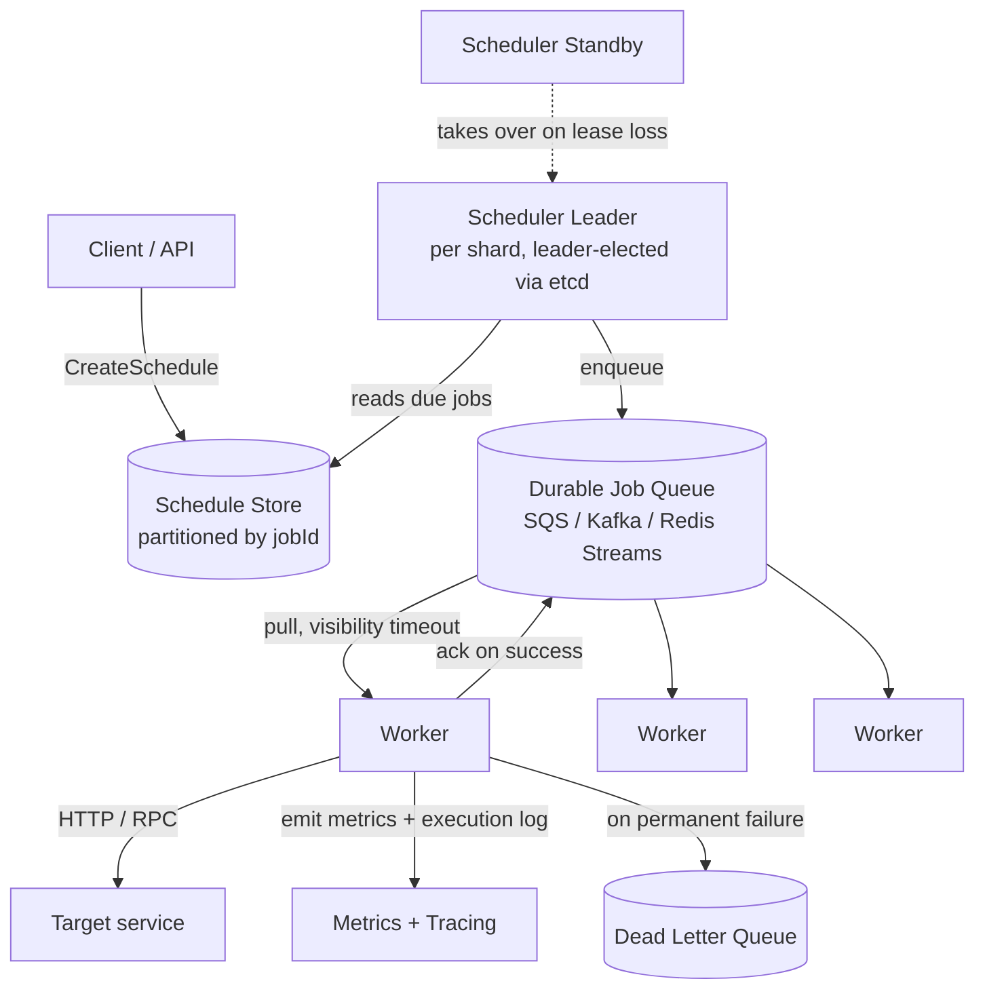
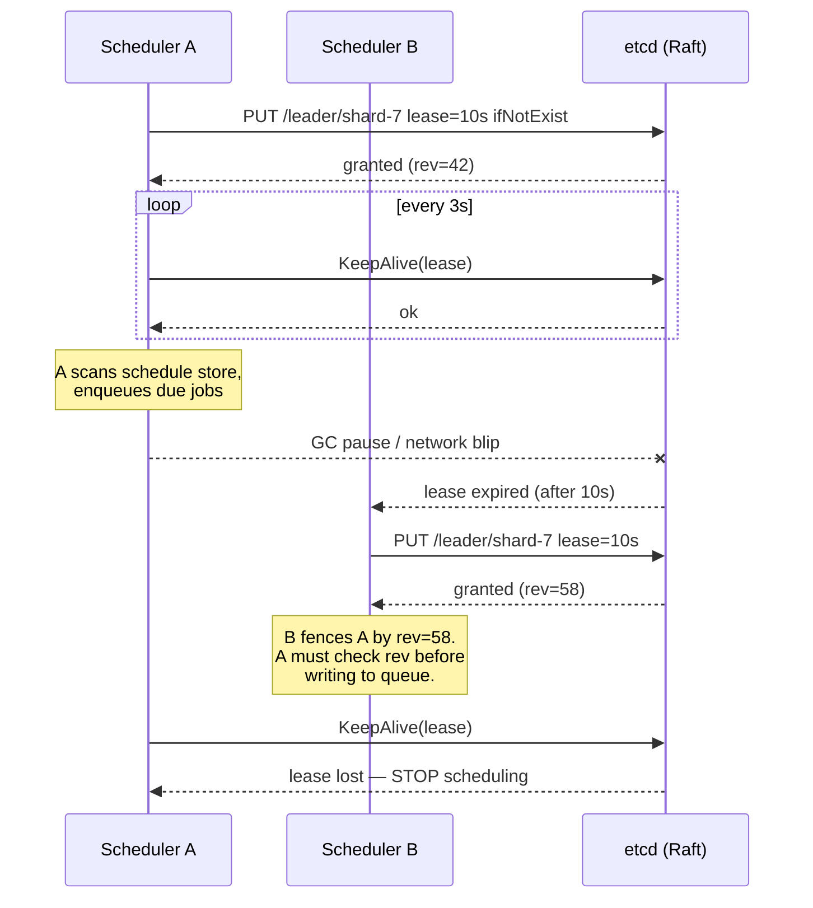
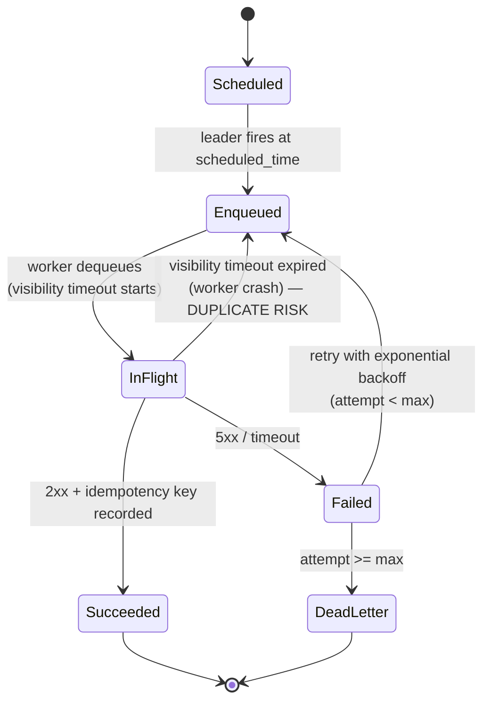

# Distributed Job Scheduler / Cron

## Why This Exists

**Problem.** A single-host `cron` is a SPOF, doesn't scale past one box, has no retry semantics, no observability, and no way to coordinate across a fleet. Once you need to fire millions of jobs/day across a multi-AZ deployment — billing runs, ETL DAGs, scheduled emails, certificate rotations, retries of failed webhooks — you need a real distributed scheduler.

**Key insight.** A distributed scheduler is two coupled problems: (1) **deciding when** a job should fire (the scheduling/timing tier), and (2) **making sure it actually runs exactly the intended number of times despite failures** (the execution/durability tier). Most interview answers conflate them. Keep them separate. The scheduling tier is small, leader-elected, and writes intent to a durable queue. The execution tier is a stateless worker pool that pulls from the queue and runs idempotent units. Failure of either tier must not lose or duplicate work — and since true exactly-once is impossible across a network partition, you choose **at-least-once + idempotent jobs** unless you can afford a 2PC or a transactional outbox.

**Reach for this when**
- Designing a cron-as-a-service (Airflow, Temporal, Quartz, AWS EventBridge Scheduler, Cloudflare Cron Triggers).
- Designing a workflow engine where steps need durable retries and timers (saga, billing, account lifecycle).
- Asked to "scale cron to 100M schedules" — the answer is partitioning + leader-per-shard, not one giant leader.
- Replacing brittle in-process scheduled tasks (`@Scheduled` in Spring, `setInterval` in Node) for a multi-instance service.

**Don't reach for this when**
- You have a single instance and < ~1k jobs — use OS cron or `@Scheduled`. Distributed schedulers add weeks of operational cost.
- You need streaming / event-driven processing — use Kafka + consumers, not a scheduler. Schedulers fire on time; streams fire on data.
- You need long-running stateful workflows with branching/compensation — use a workflow engine (Temporal, Step Functions). A scheduler fires steps; a workflow engine *orchestrates* them. They're related but not identical.

## Diagrams

High-level architecture — separating timing tier from execution tier:



Leader election + lease lifecycle (etcd-style):



Job execution state machine — at-least-once with idempotency:



## Core Design

### 1. Data model

Two stores. Keep them separate; their access patterns differ.

```sql
-- Schedule store: durable source of truth for "when".
-- Sharded by hash(job_id) into N partitions. One leader per shard.
CREATE TABLE schedules (
  job_id          UUID PRIMARY KEY,
  owner_account   TEXT NOT NULL,
  cron_expr       TEXT,                    -- "0 */5 * * *" or NULL for one-shot
  next_fire_at    TIMESTAMPTZ NOT NULL,    -- precomputed; index this
  payload         JSONB NOT NULL,
  target_url      TEXT NOT NULL,
  max_retries     INT NOT NULL DEFAULT 5,
  shard_id        INT NOT NULL,            -- hash(job_id) % NUM_SHARDS
  state           TEXT NOT NULL,           -- ACTIVE | PAUSED | DELETED
  version         BIGINT NOT NULL          -- optimistic concurrency
);
CREATE INDEX schedules_due_idx ON schedules (shard_id, next_fire_at)
  WHERE state = 'ACTIVE';

-- Execution log: append-only history. Used for idempotency + audit + UI.
CREATE TABLE executions (
  execution_id    UUID PRIMARY KEY,         -- = idempotency key sent to worker
  job_id          UUID NOT NULL,
  scheduled_for   TIMESTAMPTZ NOT NULL,
  attempt         INT NOT NULL,
  state           TEXT NOT NULL,            -- ENQUEUED | IN_FLIGHT | SUCCEEDED | FAILED | DEAD
  enqueued_at     TIMESTAMPTZ,
  completed_at    TIMESTAMPTZ,
  error           TEXT,
  UNIQUE (job_id, scheduled_for, attempt)   -- prevents leader double-enqueue
);
```

Why a `UNIQUE (job_id, scheduled_for, attempt)`? It's the **fence** that prevents a deposed leader from enqueueing the same firing twice. The leader must `INSERT ... ON CONFLICT DO NOTHING` *before* publishing to the queue. If the insert says "already exists", another leader already enqueued it — drop on the floor.

### 2. The scheduling tier (leader per shard)

Pseudocode for one scheduler-leader instance, one shard:

```python
# Runs on every scheduler node. Only the leader for a shard does work.
async def run_shard(shard_id: int):
    while True:
        # Acquire / refresh lease in etcd. fencing_token = etcd revision.
        lease = await etcd.acquire_leader(f"/leader/shard-{shard_id}", ttl=10)
        if not lease.is_held():
            await asyncio.sleep(1)
            continue

        # Tick at fixed cadence. 1s is typical for sub-minute SLAs.
        # DO NOT sleep until next_fire_at — clocks drift, and you'd miss
        # newly-inserted jobs scheduled for "now".
        async for tick in clock.every(1.0):
            if not lease.is_held():
                break  # lost leadership, stop NOW

            now = clock.now()
            # Pull a bounded batch. next_fire_at <= now + small_lookahead
            due = await db.query("""
                SELECT job_id, next_fire_at, payload, target_url, cron_expr,
                       max_retries, version
                FROM schedules
                WHERE shard_id = $1
                  AND state = 'ACTIVE'
                  AND next_fire_at <= $2
                ORDER BY next_fire_at
                LIMIT 1000
            """, shard_id, now)

            for job in due:
                # Compute next firing FIRST. We commit the advance + the
                # execution row in one transaction — that's the durability
                # boundary. The queue publish happens AFTER commit.
                next_at = compute_next_fire(job.cron_expr, job.next_fire_at)
                exec_id = uuid_v7()  # time-ordered, useful for idempotency

                async with db.transaction() as tx:
                    # Optimistic concurrency on `version` — rejects writes
                    # from a stale leader whose lease expired but who
                    # hasn't noticed yet.
                    rows = await tx.execute("""
                        UPDATE schedules
                        SET next_fire_at = $1, version = version + 1
                        WHERE job_id = $2 AND version = $3
                    """, next_at, job.job_id, job.version)
                    if rows == 0:
                        continue  # someone else won the race; safe.

                    # The fence: if a partition healed and an old leader
                    # tries the same firing, this UNIQUE constraint kills it.
                    await tx.execute("""
                        INSERT INTO executions
                          (execution_id, job_id, scheduled_for, attempt, state, enqueued_at)
                        VALUES ($1, $2, $3, 0, 'ENQUEUED', $4)
                        ON CONFLICT (job_id, scheduled_for, attempt) DO NOTHING
                    """, exec_id, job.job_id, job.next_fire_at, now)

                # Publish AFTER commit. If we crash here, the next leader
                # tick will see ENQUEUED in executions but no queue msg —
                # a recovery sweep republishes. Worse to publish-then-crash:
                # commit-first guarantees a single durable record exists.
                await queue.publish(
                    body={
                        "execution_id": exec_id,
                        "job_id": job.job_id,
                        "payload": job.payload,
                        "target_url": job.target_url,
                        "scheduled_for": job.next_fire_at.isoformat(),
                        "max_retries": job.max_retries,
                    },
                    # Idempotency key for the broker (SQS dedup, Kafka producer)
                    dedupe_key=str(exec_id),
                )
```

Two non-obvious moves here:

1. **Update `next_fire_at` *before* publishing.** Otherwise a crash between publish and update produces a re-fire of the same `scheduled_for` at the next tick.
2. **Optimistic version on `schedules`.** A partitioned-away leader (still convinced it's leader) cannot mutate the schedule because its `version` is stale.

### 3. Recovery sweep

A second loop scans for `executions` rows in state `ENQUEUED` older than ~30s with no queue-side ack. Republish them with the same `execution_id`. Idempotency keys make this safe.

```python
async def recovery_sweep(shard_id: int):
    while leader.is_held():
        stuck = await db.query("""
            SELECT execution_id, job_id, scheduled_for, attempt, ...
            FROM executions
            WHERE state = 'ENQUEUED'
              AND enqueued_at < now() - interval '30 seconds'
              AND job_id IN (SELECT job_id FROM schedules WHERE shard_id = $1)
        """, shard_id)
        for row in stuck:
            await queue.publish(..., dedupe_key=str(row.execution_id))
        await asyncio.sleep(5)
```

### 4. The execution tier — idempotent worker

```python
async def worker_loop():
    async for msg in queue.consume(visibility_timeout=300):
        ctx = trace.start_span("execute_job", attributes={
            "job_id": msg.job_id,
            "execution_id": msg.execution_id,
            "attempt": msg.attempt,
        })

        # Mark IN_FLIGHT, but only if we're the first to grab it.
        # If state is already SUCCEEDED, someone else finished — ack and skip.
        state = await db.fetch_state(msg.execution_id)
        if state == "SUCCEEDED":
            await msg.ack()
            ctx.set_attribute("dedup", True)
            continue

        await db.update_execution(msg.execution_id, state="IN_FLIGHT")

        try:
            # The downstream MUST treat msg.execution_id as an idempotency
            # key. If it doesn't, you cannot have safe at-least-once.
            await http.post(
                msg.target_url,
                json=msg.payload,
                headers={"Idempotency-Key": msg.execution_id},
                timeout=30,
            )
            await db.update_execution(msg.execution_id, state="SUCCEEDED")
            await msg.ack()
        except RetryableError as e:
            if msg.attempt + 1 >= msg.max_retries:
                await db.update_execution(msg.execution_id, state="DEAD", error=str(e))
                await dlq.publish(msg)
                await msg.ack()  # remove from main queue
            else:
                # Exponential backoff with full jitter (AWS Architecture Blog)
                # delay = random_between(0, base * 2^attempt), capped at cap.
                base, cap = 1.0, 600.0
                delay = random.uniform(0, min(cap, base * (2 ** msg.attempt)))
                await queue.publish(
                    {**msg.body, "attempt": msg.attempt + 1},
                    delay_seconds=delay,
                    dedupe_key=f"{msg.execution_id}:r{msg.attempt+1}",
                )
                await msg.ack()
        except FatalError as e:
            await db.update_execution(msg.execution_id, state="DEAD", error=str(e))
            await dlq.publish(msg)
            await msg.ack()
```

### 5. At-least-once vs exactly-once

You **cannot** have exactly-once delivery across a network — this is a consequence of the Two Generals problem and is restated by Kafka's docs and Temporal's design notes. What you can have:

| Property                           | How to get it                                                                                              |
|------------------------------------|------------------------------------------------------------------------------------------------------------|
| **At-most-once**                   | Fire-and-forget, no retries. Loses jobs on crash. Almost never what you want.                              |
| **At-least-once**                  | Retry on ack timeout / failure. Default. Requires idempotent receiver.                                     |
| **Effectively-once**               | At-least-once + idempotency key on the receiver (dedup table, conditional write, upsert).                  |
| **Exactly-once (transactional)**   | Two-phase commit between queue and DB, OR Kafka transactions, OR Temporal-style durable workflow history. |

For a scheduler, **at-least-once + idempotent jobs** is the right default. Push exactly-once requirements down to specific job types that justify the cost (billing, payments). The scheduler hands the worker an `execution_id`; the worker forwards it as an `Idempotency-Key` header (Stripe convention); the downstream stores `(idempotency_key, response)` and replays the response on retry.

### 6. Leader election — etcd vs ZooKeeper vs DB row-lock

| Mechanism              | How                                                                  | When to pick                                              |
|------------------------|----------------------------------------------------------------------|-----------------------------------------------------------|
| **etcd lease**         | `PUT key lease=ttl ifNotExist`, `KeepAlive` heartbeat, watch on lock | Modern Go/Cloud-native stack; Kubernetes already has etcd |
| **ZooKeeper ephemeral**| Sequential ephemeral znode + watch on predecessor                    | JVM ecosystem; existing ZK (Kafka < 4, HBase, Solr)       |
| **Redis Redlock**      | Multi-master redlock algorithm                                       | Avoid. Martin Kleppmann documented the safety issues.     |
| **Postgres advisory**  | `pg_try_advisory_lock(shard_id)` + heartbeat                         | Small fleet, already have PG, want zero new infra         |
| **Consul session**     | Session + KV with `acquire`                                          | Existing HashiCorp stack                                  |

**Fencing token discipline.** Whichever you pick, every write the leader makes downstream must carry a monotonically-increasing token (etcd `mod_revision`, ZK `czxid`, PG `txid_current()`). The execution log's optimistic-concurrency check is your fence. Without fencing, a paused leader resuming after a 30s GC pause will happily double-publish.

### 7. Sharding and scale

One leader globally caps you at the leader's throughput (~5–50k jobs/s in practice, bounded by your DB). To scale horizontally:

- **Hash partition by `job_id`** into `N` shards (start with N=64 or N=128; choose a power of 2 to make later resharding tractable).
- **One leader-election key per shard** (`/leader/shard-0` through `/leader/shard-N-1`).
- A scheduler node holds leases for many shards. Rebalance via consistent hashing on the scheduler-node ring.

Keep partition count **fixed** in V1. Resharding online is a project. If you need elasticity, use a virtual-shard scheme: 1024 logical shards mapped to `M` physical scheduler nodes via consistent hashing. Now you only move the *mapping*, not the data.

### 8. Thundering herd at midnight

Cron expressions like `0 0 * * *` cause every job in the system to fire at the same instant. Three mitigations, all production-tested:

1. **Spread inside a window.** Add `±N seconds` jitter to `next_fire_at` if the user didn't ask for sub-minute precision. Document this.
2. **Token-bucket rate limit at the worker fan-out** — protects downstream services. Per-account and per-target-host buckets.
3. **Stagger by deterministic hash.** `next_fire_at += hash(job_id) % spread_window`. Stable across firings, so the same job always fires at the same offset.

### 9. Observability — what to actually measure

- **Schedule freshness**: `now() - max(next_fire_at)` for each shard. If a leader hangs, this grows. Alert at > 30s.
- **Firing latency p99**: time between `scheduled_for` and `enqueued_at`. SLO target: p99 < 1s for a healthy scheduler.
- **Execution latency p99**: `enqueued_at` → `completed_at`. Different number; combines queue depth + worker capacity + downstream latency.
- **Duplicate-firing rate**: count of `execution_id` collisions on the receiver's idempotency table. Should be near zero in steady state; spikes during failovers.
- **DLQ rate** per job-type. Page on any non-zero rate for billing / payment job types.
- **Leader churn**: leadership transitions per shard per hour. > 1/hr means flapping — fix lease TTL or GC pauses.

Tracing: propagate the trace context into the queue message and into the downstream HTTP call. Stripe's idempotency-key + request_id pattern gives you end-to-end correlation.

## Trade-offs

| Choice                                     | Benefit                                                                 | Cost                                                                                              |
|--------------------------------------------|-------------------------------------------------------------------------|---------------------------------------------------------------------------------------------------|
| At-least-once + idempotency                | Simple, robust, scales horizontally                                     | Every receiver must implement idempotency. Bugs in receiver = duplicates in production.           |
| Exactly-once via 2PC / Kafka transactions  | Zero duplicates                                                         | Latency, throughput hit; participants must support 2PC; worse failure modes when broker partitions|
| One leader globally                        | Simple ordering guarantees; trivial to reason about                     | Caps throughput; single failure domain; long failover                                             |
| Leader-per-shard                           | Horizontal scale; failure isolated to one shard                         | Resharding is hard; cross-shard fairness must be implemented; more leader-election keys to monitor|
| Pull-based queue (SQS, Redis Streams)      | Workers self-balance; backpressure for free                             | Polling cost; per-message visibility timeout tuning                                               |
| Push-based dispatch (gRPC to workers)      | Lower fire latency                                                      | Scheduler must track worker liveness; failure modes more complex                                  |
| Tick-driven (1s scan loop)                 | Robust to clock drift, late inserts                                     | Constant DB load even at idle; bounded by index scan latency                                      |
| Timer-wheel (delay-queue) in memory        | Sub-millisecond firing; no DB scan                                      | Loses timers on crash unless backed by WAL; tricky to scale across nodes                          |
| etcd / ZK leader election                  | Strongly consistent leadership; well-understood failure modes           | Operational burden of running a coordination service; lease TTL vs GC pause is a real footgun     |
| Postgres advisory locks for leadership     | Zero new infra                                                          | DB becomes the SPOF for scheduling; no native fencing tokens; lock can be held across PG failover |
| Redis Redlock                              | Cheap, fast                                                             | Documented safety issues (Kleppmann); avoid for correctness-critical leadership                   |
| Cron expressions as the user-facing API    | Universal, familiar                                                     | Footguns: timezone handling, DST, leap seconds, `0 0 * * *` thundering herd                       |

## Common Pitfalls

- **No fencing on leader writes.** Classic GC-pause-causes-double-fire. Lease expired in etcd, new leader took over, old leader woke up from a 30s pause and published anyway. Fix: every downstream write carries a fencing token (the lease revision) and the receiver rejects stale tokens. Or use a `UNIQUE` constraint on `(job_id, scheduled_for, attempt)` as the fence. Reference: Kleppmann's "How to do distributed locking" post.
- **Sleeping until `next_fire_at`** instead of ticking. A new job inserted with `next_fire_at = now()` won't fire until your sleep ends. Always tick at fixed cadence and pull due jobs.
- **Computing `next_fire_at` from `now()` instead of from the previous `scheduled_for`.** Causes drift after every late firing — your "every 5 minutes" job slowly slides to "every 5 minutes 200ms".
- **Storing cron expressions without a timezone.** UTC vs America/Los_Angeles, DST transitions, the "spring-forward" hour where 02:30 doesn't exist — every cron-as-a-service has been bitten. Store IANA tz alongside the expression. Document behavior at DST boundaries.
- **Thundering herd at top-of-hour.** See section 8. Measured this firsthand: a cron service for 50M users firing daily summaries at 09:00 UTC took down the email API. Spread within the minute, document it.
- **Treating queue ack as "the job ran".** The ack only means "the worker processed it" — which could be "the worker handed it to the downstream and got a 504, but we already acked". Acks come *after* downstream success.
- **Worker idempotency that compares `payload` instead of `execution_id`.** Two retries with the same `execution_id` but slightly different timestamps in the payload will both run. Always key on the explicit idempotency key.
- **Visibility timeout shorter than job runtime.** Worker is still running, queue redelivers, two workers run the same job. Either pick a generous timeout or have the worker periodically extend it (SQS `ChangeMessageVisibility`).
- **Retrying a poisoned job forever.** Always cap attempts and route to DLQ. Always page on DLQ growth.
- **Treating "scheduler crashed" as a bigger deal than "downstream crashed".** Most outages are downstream. Build your retry, backoff, and circuit-breaker logic for downstream-mostly. The scheduler itself, once leader-elected, is rarely the cause.
- **Not separating `payload` from `state`.** If the payload contains "the user's current email address", the *scheduled* job will use the email-at-schedule-time, not email-at-fire-time. Sometimes that's wrong (rotated address). Sometimes that's right (legal-record events). Pick deliberately.
- **Skipping the recovery sweep.** The window between "DB commit" and "queue publish" is small but not zero. Without a sweep that republishes `ENQUEUED` rows missing from the queue, you will silently lose jobs.

## Decision Table

| If you need...                                                                  | Reach for                                                       |
|---------------------------------------------------------------------------------|-----------------------------------------------------------------|
| Cron-style time-based firing, simple jobs                                       | Scheduler with at-least-once + idempotent workers (this doc)    |
| Long-running stateful workflows with retries, branching, compensation, signals  | Temporal / Cadence / AWS Step Functions                         |
| Data-pipeline DAGs with dependencies between tasks                              | Airflow, Dagster, Prefect                                       |
| Tens of thousands of in-process scheduled tasks on one host                     | Quartz Scheduler (JVM) — but you still need leader election     |
| Cloud-native, fully managed, low-volume                                         | AWS EventBridge Scheduler, GCP Cloud Scheduler, Cloudflare Cron |
| Event-driven, fired by data arrival not by time                                 | Kafka + consumer groups; not a scheduler                        |
| One-shot delayed messages (e.g. "remind me in 24h"), no recurrence              | SQS delay queue / Kafka delayed-topic / Redis ZSET timer        |
| Sub-millisecond timer precision                                                 | In-process timer wheel (Netty HashedWheelTimer); accept volatility |
| Strict exactly-once for billing / payments                                      | Idempotency keys end-to-end + transactional outbox pattern      |
| Petabyte-scale background batch jobs                                            | A workflow engine on top of YARN/Kubernetes, not cron           |

## References

- Kleppmann, Martin — *Designing Data-Intensive Applications* — ch. 8 "The Trouble with Distributed Systems", ch. 9 "Consistency and Consensus" (leader election, fencing tokens, lease vs lock semantics).
- Kleppmann, Martin — "How to do distributed locking" — https://martin.kleppmann.com/2016/02/08/how-to-do-distributed-locking.html
- Burns, Brendan & Oppenheimer, David et al. — "Design patterns for container-based distributed systems" (USENIX HotCloud 2016) — https://research.google/pubs/pub45406/
- Google SRE Book — "Distributed Periodic Scheduling with Cron" (chapter 24) — https://sre.google/sre-book/distributed-periodic-scheduling/  *(authoritative; Google's internal cron service)*
- Google SRE Workbook — "Non-Abstract Large System Design" — https://sre.google/workbook/non-abstract-design/
- AWS Architecture Blog — "Exponential Backoff And Jitter" (Marc Brooker) — https://aws.amazon.com/blogs/architecture/exponential-backoff-and-jitter/
- AWS Builders' Library — "Timeouts, retries, and backoff with jitter" (Marc Brooker) — https://aws.amazon.com/builders-library/timeouts-retries-and-backoff-with-jitter/
- AWS Builders' Library — "Avoiding insurmountable queue backlogs" — https://aws.amazon.com/builders-library/avoiding-insurmountable-queue-backlogs/
- AWS Builders' Library — "Reliability, constant work, and a good cup of coffee" — https://aws.amazon.com/builders-library/reliability-and-constant-work/
- Stripe — "Designing robust and predictable APIs with idempotency" — https://stripe.com/blog/idempotency
- Temporal — "Why Temporal? It's not a scheduler, it's a workflow engine" — https://docs.temporal.io/temporal  *(and contrast with Cadence's original design paper from Uber)*
- Apache Airflow docs — "Scheduler" — https://airflow.apache.org/docs/apache-airflow/stable/core-concepts/scheduler.html
- Quartz Scheduler — "Configuring Clustering with JDBC-JobStore" — http://www.quartz-scheduler.org/documentation/quartz-2.3.0/configuration/ConfigJDBCJobStoreClustering.html
- etcd docs — "Concurrency: Lease, Lock, Election" — https://etcd.io/docs/v3.5/learning/api/#lease-api
- Apache ZooKeeper — "Recipes: Leader Election" — https://zookeeper.apache.org/doc/current/recipes.html#sc_leaderElection
- Lamport, Leslie — "The Part-Time Parliament" (Paxos) — https://lamport.azurewebsites.net/pubs/lamport-paxos.pdf
- Ongaro & Ousterhout — "In Search of an Understandable Consensus Algorithm" (Raft) — https://raft.github.io/raft.pdf
- Helland, Pat — "Idempotence Is Not a Medical Condition" — https://queue.acm.org/detail.cfm?id=2187821
- Helland, Pat — "Life Beyond Distributed Transactions" — https://queue.acm.org/detail.cfm?id=3025012
- Cloudflare — "How we built Cron Triggers" — https://blog.cloudflare.com/cron-triggers-on-cloudflare-workers/
- Uber Engineering — "Cherami: Uber Engineering's Durable & Scalable Task Queue" — https://www.uber.com/blog/cherami-message-queue-system/
- Slack Engineering — "Scaling Slack's Job Queue" — https://slack.engineering/scaling-slacks-job-queue/
- Xu, Alex — *System Design Interview Vol. 2*, ch. "Distributed Job Scheduler" / "Notification System" (interview-shaped framing).

## See Also

- `../../communication/message-queues/` — durable queues, visibility timeouts, DLQs (the substrate this scheduler sits on).
- `../../data-systems/consensus/` — etcd, ZooKeeper, Raft details and fencing-token discipline.
- `../../communication/idempotency/` — Stripe-style idempotency, dedup tables, transactional-outbox pattern.
- `../../reliability/rate-limiting/` — token bucket and leaky bucket for protecting downstream services from scheduled fan-out.
- `../../reliability/circuit-breaker/` — for the worker → downstream call.
- `../../architecture-patterns/saga/` — multi-step transactional workflows often kicked off by scheduled triggers.
