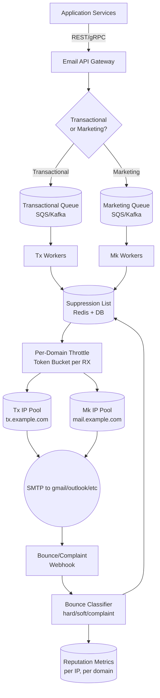
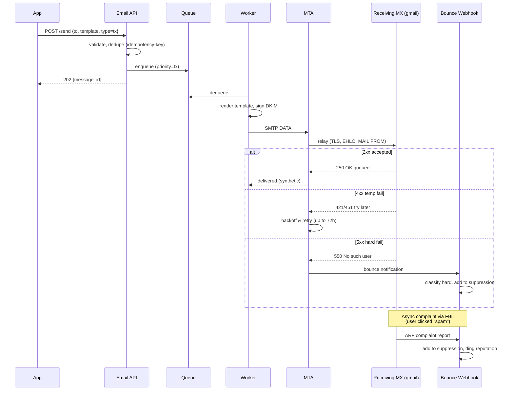
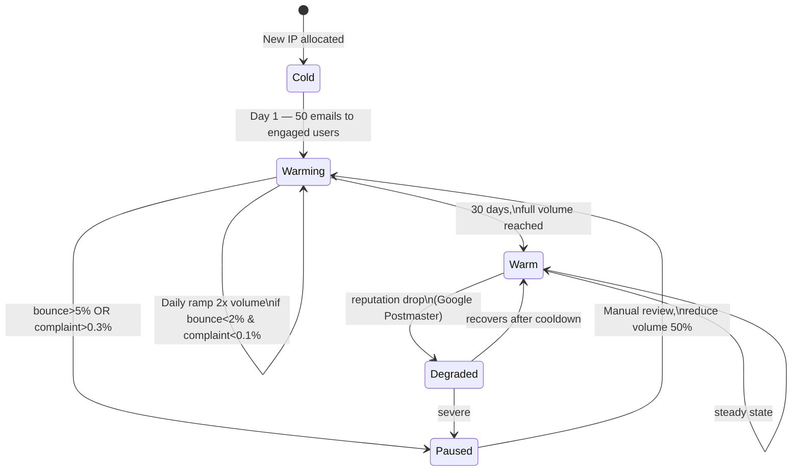

# Email Service

## Why This Exists

**Problem.** Sending email "works" until it doesn't. A single misconfigured SPF record, one spammy marketing blast on a shared IP, or a missing bounce handler can drop your delivery rate from 99% to 60% overnight — and Gmail/Outlook give you no warning, no error, just the silent treatment. Email is a **reputation system disguised as a protocol**. The protocol (SMTP) is 1982-old and trivial; the reputation game (IP warming, domain alignment, complaint rates, throttle curves per receiving domain) is what actually determines whether your password reset arrives.

**Key insight.** Treat email like a **two-tier delivery system with strict isolation**:
- **Transactional** (password resets, receipts, 2FA) — small volume, high urgency, must arrive, must never be blocked by a marketing screw-up.
- **Marketing** (newsletters, promos, drips) — large volume, latency-tolerant, allowed to fail individual recipients gracefully.

Mix them on the same IP / domain / queue and one campaign's spam complaints will tank your password resets. **Separate IPs, separate sending domains (or subdomains), separate suppression-list policies, separate throttle budgets.** This is the single most important architectural decision in an email platform — Postmark built an entire business on the premise that transactional senders should never share a pipe with marketing senders.

**Reach for this when.**
- You're designing or scaling a notification / email service (interview, real system, or migration off SES/SendGrid).
- Deliverability has degraded and you don't know if it's auth, reputation, content, or throttle.
- You need to onboard a new sending IP without torching reputation.
- You're separating a monolith's "send email" calls into a dedicated service.

**Don't reach for this when.**
- You send <100 emails/day to known recipients — just use SES/Postmark/Resend directly with their defaults.
- You need real-time push (use APNs/FCM, not email).
- You need guaranteed delivery in seconds — SMTP is best-effort with retries, not a low-latency RPC.
- You're building a mail server (MTA) itself — that's a different beast (Postfix, Haraka, OpenSMTPD); this skill is about **using** an MTA/ESP at scale.

## Diagrams

### High-level architecture



### Send path with bounce handling



### IP warming state machine



## SMTP — what you actually need to know

SMTP (RFC 5321) is the wire protocol. You almost never speak it directly — you use an ESP API (SES, SendGrid, Postmark, Resend) or a library that wraps an MTA. But understanding the response codes is non-negotiable because they drive your retry and suppression logic.

```text
S: 220 mx.gmail.com ESMTP ready
C: EHLO sender.example.com
S: 250-mx.gmail.com at your service
S: 250-SIZE 157286400
S: 250-STARTTLS
S: 250 SMTPUTF8
C: STARTTLS
... TLS handshake ...
C: MAIL FROM:<bounces+abc123@tx.example.com>      # <-- Return-Path / envelope sender
S: 250 OK
C: RCPT TO:<alice@gmail.com>
S: 250 OK                                          # or 550 No such user
C: DATA
C: From: "Acme" <noreply@example.com>             # <-- header From (what user sees)
C: To: alice@gmail.com
C: Subject: Reset your password
C: DKIM-Signature: v=1; a=rsa-sha256; d=example.com; s=tx2026; ...
C: ...body...
C: .
S: 250 OK queued as XYZ
C: QUIT
```

**Response code semantics — drive retry/suppression logic from these:**

| Code class | Meaning | Action |
|---|---|---|
| 2xx | Accepted by receiver | Mark delivered (note: delivered ≠ inboxed; could still be spam-foldered) |
| 4xx | Temporary failure (greylist, throttle, mailbox full) | Retry with exponential backoff up to ~72h |
| 5xx | Permanent failure | Suppress recipient, do not retry |
| 550 5.1.1 | No such user | Hard bounce — suppress |
| 550 5.7.1 | Blocked by policy / spam | Often a reputation problem, not the recipient |
| 421 4.7.0 | Try again later (rate limit) | Throttle harder, slow down |
| 552 5.2.2 | Mailbox full | Soft bounce — retry, but track count |

The **enhanced status codes** (RFC 3463 — e.g. `5.1.1`, `4.2.2`) are what you classify on, not the bare 3-digit codes. A 550 with subcode `5.7.x` is a policy/auth issue (your problem); `5.1.x` is a recipient issue.

## Authentication: SPF, DKIM, DMARC

If you ship one thing right, ship this. Without alignment, Gmail and Outlook will quarantine or reject — and starting Feb 2024, Gmail rejects bulk senders missing DMARC outright.

### SPF — "which IPs are allowed to send mail FROM @example.com?"

DNS TXT record on the **envelope sender domain** (the `MAIL FROM`, also called Return-Path):

```dns
example.com.  IN  TXT  "v=spf1 include:_spf.google.com include:amazonses.com ip4:198.51.100.0/24 ~all"
```

- `include:` chains other SPF records (max 10 lookups per RFC 7208 — exceeding causes `permerror` and silent failure).
- `~all` = softfail (mark suspicious), `-all` = hardfail (reject). Use `-all` once you're confident.
- SPF authenticates the **envelope sender**, not the visible `From:` header. This is why DKIM exists.

### DKIM — "is this message cryptographically signed by the claimed sender?"

The MTA signs outbound headers + body with a private key; the public key is published in DNS:

```dns
tx2026._domainkey.example.com.  IN  TXT  "v=DKIM1; k=rsa; p=MIIBIjANBgkqhki..."
```

```text
DKIM-Signature: v=1; a=rsa-sha256; c=relaxed/relaxed;
    d=example.com; s=tx2026;
    h=from:to:subject:date:message-id;
    bh=...body-hash...;
    b=...signature...;
```

- `s=` selector lets you rotate keys without DNS coordination (`tx2026`, `tx2027`, …).
- Use **2048-bit keys**. 1024 is deprecated.
- Sign the headers users see (`From`, `Subject`, `Date`, `Message-ID`, `To`) so spoofing the visible `From:` breaks the signature.
- **Rotate selectors quarterly**; revoke old keys by removing the DNS TXT.

### DMARC — "what should receivers do when SPF/DKIM fail, and where do they report?"

Policy on the **header-From domain** (aligned with what the user sees):

```dns
_dmarc.example.com.  IN  TXT  "v=DMARC1; p=reject; rua=mailto:dmarc-agg@example.com; ruf=mailto:dmarc-fail@example.com; adkim=s; aspf=s; pct=100; fo=1"
```

- `p=none` → monitor only (start here).
- `p=quarantine` → spam folder.
- `p=reject` → bounce. **This is the goal**, but only after weeks of `none` reports prove no legit traffic fails.
- `adkim=s` / `aspf=s` = strict alignment (subdomains don't satisfy).
- `rua=` aggregate reports (XML, daily) — parse these or use Dmarcian/Postmark's free tools.
- `pct=` lets you ramp gradually: `p=quarantine; pct=10` quarantines 10% of failures.

**Alignment is the trick.** SPF passes when `MAIL FROM` domain matches `From:` domain. DKIM passes when the `d=` tag matches `From:` domain. DMARC requires **at least one** to pass AND align. This is why ESPs offer "custom return-path" / "custom DKIM domain" — without them you can't align, and you depend on the ESP's domain reputation.

## Bounces: hard vs soft, and the suppression list

```python
from enum import Enum
from dataclasses import dataclass
from datetime import datetime, timedelta

class BounceType(Enum):
    HARD = "hard"            # permanent — suppress immediately
    SOFT = "soft"            # transient — retry, suppress after N
    COMPLAINT = "complaint"  # user marked as spam — suppress immediately
    BLOCK = "block"          # receiver blocked us (reputation) — alarm, NOT suppress
    AUTO_REPLY = "auto_reply" # OOO — ignore

@dataclass
class BounceEvent:
    recipient: str
    smtp_code: str          # e.g. "5.1.1"
    diagnostic: str         # raw text from MTA
    received_at: datetime
    sending_ip: str
    sending_domain: str
    message_id: str

def classify(bounce: BounceEvent) -> BounceType:
    code = bounce.smtp_code
    diag = bounce.diagnostic.lower()

    # Complaint feedback loop (ARF report) — caller marks these explicitly
    if "feedback-type: abuse" in diag:
        return BounceType.COMPLAINT

    # 5.x.x = permanent
    if code.startswith("5."):
        # 5.7.x is policy — often OUR reputation, not recipient validity
        if code.startswith("5.7"):
            # Blocklisted, DMARC fail, content filter
            if any(s in diag for s in ["blocked", "spamhaus", "blacklist", "policy"]):
                return BounceType.BLOCK   # alarm, do NOT permanently suppress
        # 5.1.x recipient doesn't exist
        if code.startswith("5.1"):
            return BounceType.HARD
        # 5.2.2 mailbox full — technically permanent but often transient
        if code == "5.2.2":
            return BounceType.SOFT
        return BounceType.HARD

    # 4.x.x = transient
    if code.startswith("4."):
        if "vacation" in diag or "out of office" in diag:
            return BounceType.AUTO_REPLY
        return BounceType.SOFT

    return BounceType.SOFT  # unknown → safer to retry

# Suppression rules
SOFT_BOUNCE_THRESHOLD = 5     # 5 soft bounces in 14 days → suppress
SOFT_BOUNCE_WINDOW = timedelta(days=14)
SUPPRESSION_TTL = {
    BounceType.HARD: None,            # permanent
    BounceType.COMPLAINT: None,       # permanent (CAN-SPAM/GDPR)
    BounceType.SOFT: timedelta(days=30),  # retry-able after cooldown
}
```

**Two things people get wrong here:**

1. **Treating 5.7.x reputation blocks as hard bounces.** Suppressing every recipient on a domain that just rate-limited you means you'll never recover. Track these separately — a `BLOCK` is a signal about *your IP/domain*, not the recipient.
2. **Not separating suppression scope.** A user who bounced from your marketing list shouldn't be blocked from receiving a password reset. Maintain **per-stream suppression** for soft/complaint, and only the hard "user doesn't exist" suppression should be global.

```python
# Per-stream suppression check before send
def should_send(recipient: str, stream: str) -> bool:
    # Global hard bounces & GDPR opt-outs apply to ALL streams
    if redis.sismember("suppress:global:hard", recipient):
        return False
    if redis.sismember("suppress:global:gdpr", recipient):
        return False
    # Per-stream complaints & soft bounces
    if redis.sismember(f"suppress:{stream}:complaint", recipient):
        return False
    if redis.sismember(f"suppress:{stream}:soft", recipient):
        return False
    return True
```

## Per-domain throttling

Gmail will rate-limit you at ~3600/hour from a cold IP, ~50k/hour warm. Outlook is stingier. Yahoo is moody. You **must** throttle per receiving domain or you'll get 421s that snowball into reputation damage.

```python
import time
import redis

# Token bucket per (sending_ip, receiving_domain)
class DomainThrottle:
    """
    Per-(IP, RX-domain) token bucket. Limits are tuned per receiver
    based on observed 421 responses + Postmaster Tools data.
    """
    def __init__(self, r: redis.Redis):
        self.r = r
        # Conservative defaults; bump after warm-up
        self.limits = {
            "gmail.com":     (100, 60),    # 100 msgs / 60s per IP
            "googlemail.com":(100, 60),
            "yahoo.com":     (50,  60),
            "outlook.com":   (75,  60),
            "hotmail.com":   (75,  60),
            "_default":      (200, 60),
        }

    def acquire(self, sending_ip: str, rx_domain: str) -> bool:
        cap, window = self.limits.get(rx_domain, self.limits["_default"])
        key = f"throttle:{sending_ip}:{rx_domain}"
        # Atomic increment-and-check via Lua
        lua = """
        local n = redis.call('INCR', KEYS[1])
        if n == 1 then redis.call('EXPIRE', KEYS[1], ARGV[2]) end
        if n > tonumber(ARGV[1]) then return 0 end
        return 1
        """
        return bool(self.r.eval(lua, 1, key, cap, window))

# In the worker: if acquire() returns False, requeue with delay,
# don't bash on it — that's how you get 421'd into oblivion.
```

**Adapt the limits dynamically.** When you see `421 4.7.0 Try again later`, halve the cap for that (IP, domain) pair for the next hour. When clean for 6 hours, ramp 1.5x. Production systems read **Google Postmaster Tools** and **Microsoft SNDS** APIs to get per-domain reputation feedback and tune limits.

## Warming a new IP

Sending 1M emails from a fresh IP on day one is the fastest way to get permanently blocked. Mailbox providers grade by:
- **Volume curve** (sudden spikes = spammer signal).
- **Engagement** (opens, clicks, replies — they observe these somehow).
- **Complaint rate** (must stay <0.1% sustained).
- **Bounce rate** (must stay <2%; >5% = serious problem).

The AWS SES warm-up plan and SendGrid's plan converge on the same shape:

| Day | Daily volume | Audience | Notes |
|---|---|---|---|
| 1 | 50 | Most engaged users (opened in last 30 days) | Tx only, no marketing |
| 2 | 100 | Same | |
| 3 | 500 | Same | |
| 4 | 1,000 | Engaged 60-day | |
| 7 | 5,000 | Engaged 90-day | |
| 14 | 20,000 | Add unengaged but valid | |
| 21 | 100,000 | Full active list | Marketing OK if separate IP |
| 30 | Full | Everything | Full warm |

Doubling daily is aggressive; 1.5x is safer. **Never** mix marketing into the warm-up — burn the IP on transactional first because it has near-zero complaint rate.

```python
def warmup_cap(day: int, target: int) -> int:
    """Approximate SES/SendGrid warm-up curve."""
    if day < 1: return 0
    if day == 1: return 50
    # Roughly 1.7x per day, capped at target by ~day 30
    cap = int(50 * (1.7 ** (day - 1)))
    return min(cap, target)
```

If you exceed your cap, the receiving MTA starts throwing 421s and you're effectively rate-limiting yourself the painful way. Better to throttle on egress and let the warm-up complete cleanly.

## Transactional vs marketing: separate everything

This is the single most-tested topic in email-system interviews and the one most teams get wrong in production.

| Concern | Transactional | Marketing |
|---|---|---|
| **Sending domain** | `tx.example.com` | `mail.example.com` |
| **IP pool** | Dedicated, small (2-4 IPs) | Larger pool, can be shared |
| **Queue priority** | High; SLO p99 < 30s | Low; SLO p99 < 1h |
| **Suppression scope** | Only honor hard-bounce + GDPR | Also honor unsubscribe + complaints + soft-bounce thresholds |
| **Unsubscribe link** | Optional (and risky for password resets) | **Required** (CAN-SPAM, RFC 8058 one-click) |
| **List-Unsubscribe header** | No | Yes (`List-Unsubscribe: <https://...>, <mailto:unsub@...>`) |
| **Volume pattern** | Bursty per user, smooth aggregate | Massive spike at campaign send |
| **DMARC failure** | Page on-call | Email marketing ops |

If you only have one ESP account, at minimum:
- Use **separate verified subdomains** so reputations are scored independently.
- Use **separate API keys** so you can detect the source of a problem.
- If your ESP supports it (SES, SendGrid, Postmark), use **dedicated IP pools** for transactional.

Postmark goes further: they refuse marketing senders on their transactional infrastructure entirely. That's the architectural lesson.

## API design

```python
# Idempotent send endpoint
POST /v1/messages
Headers:
  Authorization: Bearer <key>
  Idempotency-Key: <uuid>      # dedupe retries within 24h
Body:
{
  "stream": "transactional",   # or "marketing-newsletter"
  "to": "alice@example.com",
  "from": "Acme <noreply@example.com>",
  "reply_to": "support@example.com",
  "template_id": "password-reset-v3",
  "template_data": { "name": "Alice", "reset_url": "..." },
  "headers": { "X-Tag": "auth" },
  "metadata": { "user_id": "u_123" }   # for analytics, not sent
}

→ 202 Accepted
{
  "message_id": "msg_01HX...",
  "status": "queued"
}
```

**Why idempotency matters.** Your caller will retry on a 5xx. Without an idempotency key, retries become duplicate emails — and password-reset spam is a security incident waiting to happen. Store keys in Redis with 24h TTL.

**Webhooks for delivery events.** Push (don't poll) the lifecycle: `queued → sent → delivered → opened → clicked → bounced/complained`. Sign webhooks with HMAC, include a replay-protection timestamp, and document at-least-once delivery so consumers idempotently handle them.

## Observability — the metrics that matter

```text
# Per stream, per IP, per receiving domain — aggregate over 1h, 24h, 7d
delivery_rate     = delivered / accepted
hard_bounce_rate  = hard_bounces / accepted    # alarm > 2%
soft_bounce_rate  = soft_bounces / accepted
complaint_rate    = complaints / delivered     # alarm > 0.1%, page > 0.3%
block_rate        = 5.7.x_responses / accepted # alarm > 0.5% — reputation dropping
open_rate         = (engagement signal, marketing only)
inbox_placement   = (third-party seed test, e.g. GlockApps)
```

Pull **Google Postmaster Tools** daily for per-IP reputation (Bad/Low/Medium/High), spam rate, IP reputation, domain reputation, feedback loop volume. Microsoft **SNDS** gives equivalent data for outlook.com/hotmail.com.

Dashboard the **delta**, not the absolute. A reputation score going `High → Medium` in a day is a fire even if Medium is "fine".

## Trade-offs

| Benefit | Cost |
|---|---|
| Separate tx/marketing IPs protect critical mail | 2x infra cost, 2x DNS records, 2x warm-up effort |
| Dedicated IPs give reputation control | Must warm them; <50k/month probably better on shared |
| `p=reject` DMARC blocks all spoofing | Forwarding (mailing lists) can break alignment — must ARC-sign or accept failures |
| Aggressive suppression protects sender reputation | False positives lock real users out of password resets |
| Per-domain throttling avoids 421 storms | Adds latency for high-volume sends; needs feedback loop tuning |
| Webhook-driven event pipeline scales | At-least-once delivery means consumers must dedupe |
| Self-hosted MTA (Postfix/Haraka) gives full control | You now own deliverability — most teams shouldn't |
| ESP (SES/SendGrid/Postmark) outsources reputation | Vendor lock-in; outages cascade; pricing scales with volume |
| One-click List-Unsubscribe (RFC 8058) reduces complaints | Must implement the POST endpoint correctly or Gmail ignores it |
| Engagement-based send (skip unengaged) | Requires open/click tracking (privacy + Apple MPP confounds opens) |

## Common Pitfalls

- **Using your primary domain for marketing.** One bad campaign tanks your transactional reputation forever. Always send marketing from a subdomain.
- **Forgetting to align DKIM with the visible From.** Your ESP signs with `d=sendgrid.net` and DMARC fails because `From: noreply@example.com`. Configure custom DKIM signing.
- **SPF over-includes.** Chaining three ESPs' includes blows past the 10-DNS-lookup limit, returning `permerror` — which receivers treat as **fail**. Use `flattening` services or consolidate.
- **Setting DMARC `p=reject` on day one.** You will block your own legit forwarded mail (mailing lists, alumni-style forwarders). Start `p=none`, watch RUA reports for weeks, then ramp.
- **Treating soft bounces like hard bounces.** Suppressing on a single 4xx kills deliverability to anyone with a temporarily full mailbox or a server hiccup.
- **One global suppression list.** A user who unsubscribed from your marketing list still legally must get transactional mail (receipts, security alerts). Keep scopes separate.
- **Warming with marketing content.** Marketing has 10-100x the complaint rate of transactional. Warm with password resets and receipts, not promo blasts.
- **Ignoring 5.7.x responses.** These are reputation blocks, not invalid recipients. Suppressing the recipient hides the real problem (your IP/domain is in trouble).
- **Not handling the feedback loop (FBL).** When a user clicks "spam" in Gmail/Outlook, you only learn about it if you've registered for ARF complaint reports. Without this, complaint rate looks like 0 right up until you're blocklisted.
- **Plaintext-only or HTML-only emails.** Modern receivers expect both `text/plain` and `text/html` in `multipart/alternative`. Missing one is a spam signal.
- **No Message-ID, no Date, or duplicate Message-IDs.** Trivial to mess up with custom MTAs; immediate spam-folder.
- **Tracking pixel + click-tracking on transactional.** Apple Mail Privacy Protection pre-fetches everything (so opens are noise), and rewriting links in password-reset URLs has bitten many teams when the rewriter URL gets flagged.
- **Sending from `noreply@`.** Replies bounce; receivers' engagement filters notice. Use a real (or auto-responder) reply-to.
- **No `List-Unsubscribe-Post: List-Unsubscribe=One-Click`.** Required by Gmail's Feb 2024 bulk-sender rules. Without it, you fail the 5000+/day threshold.
- **Inline CSS skipped, web fonts loaded.** Outlook 2016+ ignores `<style>`, web fonts blocked. Use a tested email template framework (MJML).

## Decision Table

| Situation | Use |
|---|---|
| <100 emails/day, no marketing | Postmark or Resend with default settings — don't overengineer |
| Heavy transactional + heavy marketing | Two ESPs OR one ESP with **separate dedicated IP pools** + subdomains |
| AWS-native stack, willing to manage reputation | SES — cheapest at scale, but no opinions about deliverability |
| Want a vendor that refuses bad senders for you | Postmark (transactional) — best transactional deliverability brand |
| Marketing-heavy, need template builder + segmentation | SendGrid Marketing / Customer.io / Iterable (separate from tx) |
| Compliance requires data residency in EU | Mailjet, OVH, or self-host Postfix in-region |
| Need to send from customer domains (white-label SaaS) | Multi-tenant DKIM (sub-selector per customer) + per-tenant SPF include |
| Sending <1k/day per IP | Use a **shared IP** pool; dedicated IPs need volume to build reputation |
| Sending >100k/day | Move to **dedicated IPs**, control your own reputation |
| Forgot-password fails DMARC | Custom return-path + custom DKIM signing on ESP, alignment fixed |
| Newsletters going to Gmail spam, transactional fine | Reputation problem on marketing IP/domain; warm a fresh subdomain, prune unengaged |
| Outage at primary ESP | Pre-configure secondary ESP with DNS records ready (warmed shadow IPs) |
| Self-host vs ESP | ESP unless you have a deliverability team. Reputation is a full-time job. |

## References

- RFC 5321 — Simple Mail Transfer Protocol — https://datatracker.ietf.org/doc/html/rfc5321
- RFC 6376 — DomainKeys Identified Mail (DKIM) Signatures — https://datatracker.ietf.org/doc/html/rfc6376
- RFC 7208 — Sender Policy Framework (SPF) — https://datatracker.ietf.org/doc/html/rfc7208
- RFC 7489 — Domain-based Message Authentication, Reporting, and Conformance (DMARC) — https://datatracker.ietf.org/doc/html/rfc7489
- RFC 8058 — One-Click List-Unsubscribe — https://datatracker.ietf.org/doc/html/rfc8058
- RFC 5965 — An Extensible Format for Email Feedback Reports (ARF) — https://datatracker.ietf.org/doc/html/rfc5965
- RFC 3463 — Enhanced Mail System Status Codes — https://datatracker.ietf.org/doc/html/rfc3463
- Postmark — Transactional vs Marketing Email — https://postmarkapp.com/guides/transactional-email-best-practices
- Postmark — Why a Bad SPF Record Can Kill Your Deliverability — https://postmarkapp.com/blog/explaining-spf
- Postmark — A Practical Guide to DMARC — https://postmarkapp.com/support/article/892-a-practical-guide-to-dmarc
- SendGrid — How to Warm Up an IP Address — https://sendgrid.com/en-us/blog/warming-up-an-ip-address
- SendGrid — Email Deliverability 101 — https://sendgrid.com/en-us/resource/email-deliverability-101
- AWS SES — Dedicated IP Warm-up — https://docs.aws.amazon.com/ses/latest/dg/dedicated-ip-warming.html
- AWS SES — Manage Bounces and Complaints — https://docs.aws.amazon.com/ses/latest/dg/send-email-concepts-deliverability.html
- Google — Email sender guidelines (Feb 2024 bulk sender requirements) — https://support.google.com/mail/answer/81126
- Google Postmaster Tools — https://postmaster.google.com/
- Microsoft SNDS — https://sendersupport.olc.protection.outlook.com/snds/
- M3AAWG — Sender Best Common Practices — https://www.m3aawg.org/sites/default/files/m3aawg_senders_bcp_ver3-2015-02.pdf
- Xu/Lam — System Design Interview Vol 2, ch. "Design a Notification System" / email deep-dive
- Kleppmann — Designing Data-Intensive Applications, ch. 11 (Stream Processing) — for the queue + event-driven backbone
- AWS Builders' Library — https://aws.amazon.com/builders-library/ (queue patterns, throttling)

## See Also

- ../notification-system/ — the higher-level multi-channel notification design (push/SMS/email fan-out)
- ../rate-limiter/ — token bucket and sliding window patterns for per-domain throttling
- ../url-shortener/ — link rewriting for click-tracking in marketing email
- ../webhooks/ — designing the bounce/complaint webhook receiver with HMAC + idempotency
- ../../distributed-systems/idempotency/ — idempotency keys for the send API
- ../../distributed-systems/at-least-once-delivery/ — semantics for the delivery event pipeline
- ../../reliability/circuit-breaker/ — failing fast when the ESP is degraded
- ../../reliability/dead-letter-queue/ — where unsendable messages go to die (and be inspected)
- ../../security/dns-security/ — DNSSEC + protecting your SPF/DKIM/DMARC records
- ../../data-stores/redis-patterns/ — token buckets and suppression-set storage
