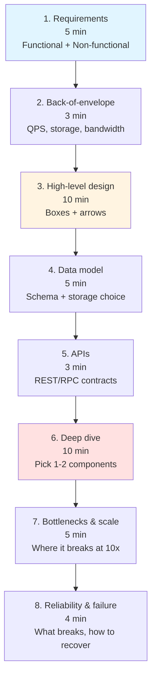
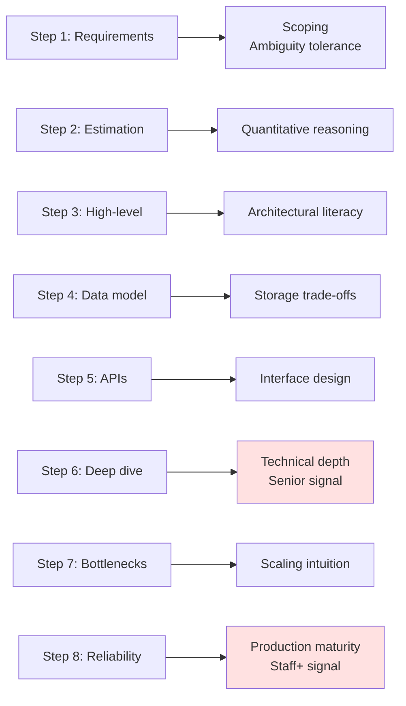
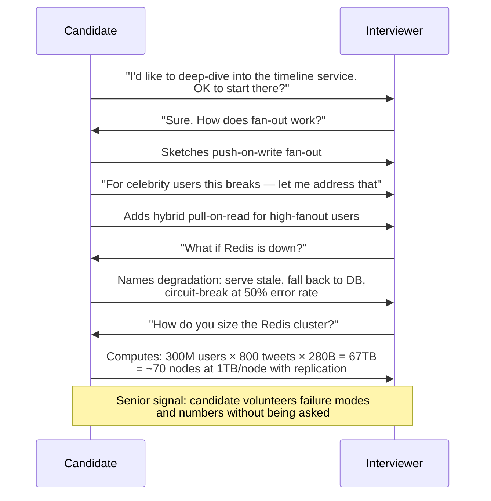

# System Design Interview Framework

## Why This Exists

**Problem.** System design interviews are 45–60 minutes of open-ended ambiguity. Most candidates fail not because they lack technical depth, but because they (a) start drawing boxes before clarifying scope, (b) over-spend on parts the interviewer doesn't care about, (c) never surface a single non-functional requirement, and (d) cannot articulate trade-offs when challenged. A staff-level engineer who is brilliant at their day job can score "no hire" because they treated the interview like a whiteboard puzzle instead of a structured design conversation.

**Key insight.** The interviewer is not grading the *artifact* on the whiteboard. They are grading your *process* — specifically, whether you behave like the senior engineer who will eventually own a real design doc. That means: scoping the problem, computing back-of-envelope numbers, picking a defensible high-level architecture, knowing where it will break, and articulating what you would change at 10x scale. The 8-step framework exists to externalize that process so you don't drift, and so the interviewer can clearly check off the signals they need.

**Reach for this when.**
- You are preparing for L5–L7 / SDE-II–Principal / Senior+ system design loops at FAANG-tier companies.
- You have ~45–60 minutes and an open-ended prompt ("Design X").
- You need a repeatable structure that survives interviewer interruptions and rabbit-hole questions.
- You're coaching a junior engineer who can build anything but freezes when asked to *design* it.

**Don't reach for this when.**
- The interview is explicitly a *coding* round or a *behavioral* round — apply the wrong framework, lose the signal.
- The prompt is a narrow deep-dive ("walk me through how you'd shard this Postgres table") — skip estimation/APIs and go straight to the deep-dive section.
- You're <30 minutes — collapse to the 4-step short form (requirements → high-level → one deep dive → wrap).

---

## Diagrams

### The 8 steps and their typical time budget (45-min interview)



The shaded steps (1, 3, 6) are where interviewers extract the strongest signal. Underspending on these = no-hire risk.

### How interviewer signals map to steps



### The conversational loop inside Step 6 (deep dive)



---

## The 8 Steps in Detail

### Step 1 — Requirements (5 minutes, **never skip**)

Split into **functional** (what it does) and **non-functional** (how well it does it). Most candidates name 3 functional requirements and zero non-functional, and lose the round here.

**Functional requirements — the prompt to ask:**
> "Before I design, can I scope this? Are we building [feature A], [feature B], [feature C]? Anything I should *not* worry about — auth, payments, mobile clients, internationalization?"

**Non-functional requirements — the four that matter:**

| NFR | Question to ask | Why it matters |
|---|---|---|
| **Scale** | "DAU? Read:write ratio? Peak QPS?" | Drives everything downstream |
| **Latency** | "p50, p99 budgets? Sync vs async OK?" | Decides cache layer, fan-out model |
| **Consistency** | "Is eventual consistency OK? How stale is too stale?" | Decides replication, leader election |
| **Availability** | "Three nines? Four? Multi-region?" | Decides redundancy, failover |

Common omissions that get marked down: durability (can we lose data?), security/PII (multi-tenant?), cost ceiling (is this a $10M or $10B service?), regulatory (GDPR, HIPAA, residency).

**Pseudocode-style requirements capture (write this on the board):**

```
FUNCTIONAL:
  - Post tweet (text ≤ 280 chars, optional media)
  - View home timeline (chronological + ranked)
  - Follow/unfollow user
  OUT OF SCOPE: DMs, ads, search, trends

NON-FUNCTIONAL:
  - 300M DAU, 600M MAU
  - Read:write = 100:1 (heavy read)
  - Timeline read p99 < 200ms
  - Tweet post p99 < 500ms (async fan-out OK)
  - Eventual consistency OK for timeline (≤ 5s stale)
  - 99.99% availability for read path
  - Durability: zero tweet loss after ack
```

### Step 2 — Back-of-envelope estimation (3 minutes)

Three numbers, every time: **QPS**, **storage**, **bandwidth**. Round aggressively. Use powers of 10. Show your arithmetic.

**Reusable constants (memorize):**

```
1 day        ≈ 10^5 seconds (86,400, round to 100k)
1 month      ≈ 2.5 × 10^6 seconds
1 year       ≈ 3 × 10^7 seconds

1 char       = 1 byte (ASCII), 2-4 bytes (UTF-8)
1 tweet text = ~300 bytes (with metadata)
1 photo      = ~200 KB (compressed)
1 video      = ~5 MB (short clip, compressed)

L1 cache     = 0.5 ns
L2 cache     = 7 ns
RAM access   = 100 ns
SSD random   = 100 µs
SSD seq read = 1 GB/s
HDD seek     = 10 ms
1-Gbps NIC   = 125 MB/s
Cross-DC RTT = 50-150 ms
```
(Source: Jeff Dean's "Numbers Everyone Should Know" — see References.)

**Worked example: Twitter-scale**

```
Users:        300M DAU
Tweets/day:   300M × 0.5 = 150M tweets/day
Write QPS:    150M / 10^5 = 1,500 QPS avg
Peak write:   1,500 × 5 = 7,500 QPS (5x peak factor)

Reads:        each user views timeline 10x/day = 3B reads/day
Read QPS:     3B / 10^5 = 30,000 QPS avg
Peak read:    150,000 QPS

Storage/day:  150M × 300 B = 45 GB/day text
              + 30M × 200 KB = 6 TB/day media (20% have media)
Storage/yr:   ~2.2 PB total (mostly media → blob store)

Bandwidth out: 150K QPS × 10 KB (timeline page) = 1.5 GB/s
              = ~12 Gbps egress
```

State assumptions out loud. The interviewer will correct numbers they care about; this is a *feature* — it shows they're engaged.

### Step 3 — High-level design (10 minutes)

Boxes and arrows. Aim for ~5–10 components on the board. Resist the urge to draw 30 boxes.

**The canonical "starter kit" for a read-heavy web service:**

```
[Client]
    ↓ HTTPS
[CDN] (static assets)
    ↓
[Load Balancer] (L7, e.g. ALB / nginx)
    ↓
[API Gateway] (auth, rate limit)
    ↓
[Stateless App Servers] (horizontally scaled)
    ↓ ↓ ↓
[Cache]  [Primary DB]  [Async Queue → Workers]
                            ↓
                       [Object Store / Blob]
```

Talk through the request flow end-to-end *once*. Then immediately call out what's missing for *this specific* problem.

**Decision points to verbalize at this step:**

```python
# Choose synchronous vs asynchronous boundaries
def post_tweet(user_id, text):
    # SYNC path: must succeed before user sees confirmation
    tweet_id = db.insert_tweet(user_id, text)         # durable write
    cache.set(f"tweet:{tweet_id}", text, ttl=3600)    # populate read cache

    # ASYNC path: eventual consistency for fan-out
    queue.publish("tweet.posted", {
        "tweet_id": tweet_id,
        "user_id": user_id,
    })
    return tweet_id  # return fast, fan-out happens behind the scenes

# Why: timeline fan-out can take seconds for users with millions of followers.
# Blocking the post on fan-out would push p99 from 500ms to 30s+.
```

### Step 4 — Data model (5 minutes)

Two questions decide most of this:

1. **Access pattern?** (read by ID? range scan? secondary lookup? full-text?)
2. **Consistency requirement?** (strong? eventual? read-your-writes?)

Pick storage *because of* the access pattern, not because you like the technology.

| Access pattern | Default choice | Why |
|---|---|---|
| Key-value, low latency | Redis / DynamoDB / Memcached | O(1), in-mem |
| Relational, joins, transactions | PostgreSQL / MySQL / Aurora | ACID, mature |
| Document, flexible schema | MongoDB / DynamoDB | Schema flexibility |
| Wide-column, time-series, append-heavy | Cassandra / ScyllaDB / BigTable | Write throughput |
| Full-text search | Elasticsearch / OpenSearch | Inverted index |
| Graph traversal | Neo4j / Neptune | Native graph |
| Analytics / OLAP | Snowflake / Redshift / ClickHouse | Columnar |
| Blob (images, video) | S3 / GCS | Cheap, durable |

**Schema sketch for the Twitter example:**

```sql
-- Postgres for the source-of-truth tweet store
CREATE TABLE tweets (
    tweet_id     BIGINT PRIMARY KEY,        -- Snowflake-style ID, sortable by time
    user_id      BIGINT NOT NULL,
    text         VARCHAR(280) NOT NULL,
    media_url    TEXT,                       -- pointer to S3
    created_at   TIMESTAMPTZ NOT NULL DEFAULT NOW(),
    INDEX idx_user_created (user_id, created_at DESC)  -- user profile reads
);

-- Sharded by user_id (consistent hashing) for write distribution
-- 300M users → ~1000 shards × 300K users/shard
```

```python
# Redis for the home timeline cache (per-user materialized list)
# Key:   timeline:{user_id}
# Value: sorted set of tweet_ids, scored by created_at
# TTL:   24h (cold users fall back to DB)

# Why Redis sorted set?
#   - O(log N) range query for "give me tweets [0..50]"
#   - O(log N) insert when fan-out writes a new tweet
#   - Bounded size: ZREMRANGEBYRANK timeline:{uid} 0 -801  (cap at 800)
```

### Step 5 — APIs (3 minutes)

REST / gRPC / GraphQL — pick one and be consistent. Show 2–4 representative endpoints. Include auth, pagination, error semantics.

```
POST /v1/tweets
  Auth: Bearer <jwt>
  Body: { "text": "...", "media_id": "uuid?" }
  → 201 { "tweet_id": "snowflake-id" }
  → 400 (validation), 401 (auth), 429 (rate limit)

GET /v1/users/{user_id}/timeline?cursor=<opaque>&limit=50
  → 200 { "tweets": [...], "next_cursor": "..." }
  Cursor pagination — NOT offset-based.
  Why: offset breaks under concurrent inserts (skipped/dup items).

POST /v1/users/{user_id}/follow
  → 204
  Idempotent: re-following is a no-op, not an error.

DELETE /v1/tweets/{tweet_id}
  → 204
  Authorization: caller must own the tweet (403 otherwise).
```

**Always volunteer:** rate limiting strategy (token bucket per user), idempotency keys for non-GET (`Idempotency-Key` header for retry safety), versioning (`/v1/`), and pagination strategy (cursor not offset).

### Step 6 — Deep dive (10 minutes — **the senior signal lives here**)

The interviewer will steer this, but **propose first**. Pick the 1–2 components where the interesting trade-offs live.

For Twitter: **fan-out**. For Uber: **matching/dispatch**. For chat: **delivery + ordering**. For payments: **idempotency + double-charge prevention**. For search: **indexing pipeline**.

**Worked deep-dive: timeline fan-out — push vs pull vs hybrid**

```python
# PUSH (fan-out on write): when user posts, immediately copy tweet
# into every follower's timeline cache.
def post_tweet_push(user_id, text):
    tweet_id = db.insert_tweet(user_id, text)
    followers = db.get_followers(user_id)         # could be 100M for celebs!
    for fid in followers:
        redis.zadd(f"timeline:{fid}", {tweet_id: now()})
    # Cost: O(F) writes per post. Breaks at celebrity scale.
    # Read cost: O(1) — just read the precomputed list.

# PULL (fan-out on read): timeline is computed lazily by merging tweets
# from everyone the user follows.
def get_timeline_pull(user_id):
    followees = db.get_followees(user_id)         # could be 5000
    tweets = []
    for fid in followees:
        tweets.extend(db.get_recent_tweets(fid, limit=50))
    return sorted(tweets, key=lambda t: t.created_at, reverse=True)[:50]
    # Cost: O(N) DB queries per read. Bad for active users.
    # Write cost: O(1) — just insert the tweet.

# HYBRID: push for normal users (<10K followers), pull for celebrities.
CELEBRITY_THRESHOLD = 10_000

def post_tweet_hybrid(user_id, text):
    tweet_id = db.insert_tweet(user_id, text)
    if get_follower_count(user_id) < CELEBRITY_THRESHOLD:
        # Push to all followers
        enqueue_fanout(tweet_id, user_id)
    # else: do nothing, will be merged at read time

def get_timeline_hybrid(user_id):
    base = redis.zrevrange(f"timeline:{user_id}", 0, 50)
    celeb_followees = get_celeb_followees(user_id)   # <100 typically
    celeb_tweets = []
    for fid in celeb_followees:
        celeb_tweets.extend(get_recent_tweets(fid, limit=20))
    return merge_sorted(base, celeb_tweets)[:50]
```

Trade-off you must articulate out loud:

> "Push optimizes read latency at the cost of write amplification. For Justin Bieber with 100M followers, a single tweet means 100M Redis writes — minutes of work. Pull avoids that but makes reads O(followees), which is bad for the 99% of users who aren't celebrities. Hybrid gets the best of both: cheap reads for normal traffic, bounded write cost when celebrities post. The wrinkle is the threshold — set it too low and you defeat the cache; too high and celebrity posts crush write throughput."

That last sentence is the staff-level signal.

### Step 7 — Bottlenecks & scaling (5 minutes)

Walk through the design and name what fails first at 10x. Be specific: which component, which dimension, what symptom.

```
At 10x scale (3B DAU, 1.5M peak read QPS):

1. Single-leader Postgres → write ceiling ~10K QPS per node
   → Shard by user_id (consistent hashing, ~1000 shards)
   → Cross-shard queries (e.g. "who follows X") need fan-out

2. Redis cache → 67TB working set
   → Cluster with consistent hashing across ~70 nodes
   → Hot key problem: celebrity tweets get 100K QPS on one node
   → Mitigation: client-side replicated reads, request coalescing

3. Fan-out queue → millions of msg/sec
   → Kafka with partition-by-tweet_id
   → Partition count ≥ peak msg/sec / per-partition throughput

4. CDN → media bandwidth
   → Multi-CDN (Cloudflare + Fastly) for redundancy + geographic coverage

5. Cross-region latency → 100ms+ for global users
   → Read replicas per region
   → Writes still go to primary region (or active-active with conflict resolution)
```

### Step 8 — Reliability & failure modes (4 minutes)

This is where staff+ candidates separate. Name 3–5 specific failure modes and the mitigation.

| Failure | Symptom | Mitigation |
|---|---|---|
| Cache cold start / mass eviction | DB CPU spikes, p99 explodes | Request coalescing, async warm-up, two-tier cache (local LRU + Redis) |
| Hot shard (celebrity user) | Single Redis node at 100% CPU | Hash-suffix the key, replicate hot keys, read from replicas |
| Async queue backlog | Timeline goes stale, fan-out lag minutes | Backpressure, per-user priority queues, SLO alarm on lag |
| Region failover | 30s of dropped writes during DNS flip | Multi-region active-active, write to local region, async replicate |
| Database leader failure | Write outage 10–60s | Auto-failover (Patroni / RDS Multi-AZ), client-side retry with idempotency |
| Cascading failure / retry storm | One slow service takes down the fleet | Circuit breaker, exponential backoff with jitter, load shedding |
| Poison message in queue | Consumer crash loop | DLQ after N retries, alarm on DLQ depth |

**Always volunteer monitoring:** "I'd track p50/p99/p999 latency per endpoint, error rate, queue depth, cache hit ratio, and DB connection pool saturation. Alarms at 3-sigma deviation from baseline." (See `../../reliability/slo-sli-sla/`.)

---

## How Interviewers Grade

Interviewers (at least at Amazon, Google, Meta, and Stripe) typically score on a rubric of **4–6 dimensions**. The framework maps to them roughly as follows:

| Dimension | What they're looking for | Steps that surface it |
|---|---|---|
| **Problem solving / ambiguity** | Asks scoping questions, doesn't dive in blind | 1, 2 |
| **Technical breadth** | Names the right components for the right reasons | 3, 4 |
| **Technical depth** | Goes 3 levels deep on at least one component | 6 |
| **Communication** | Verbalizes trade-offs, draws clearly, takes feedback | All |
| **Quantitative reasoning** | Numbers, not vibes | 2, 7 |
| **Production maturity** | Talks about failure modes without prompting | 8 |

**No-hire signals to avoid:**

- Started drawing before asking a single question.
- Never wrote a single number on the board.
- Could not name a *why* for any technology choice ("I'd use Kafka because… everyone uses Kafka").
- Defensive when challenged ("but my design is fine!"). Senior engineers update on new info.
- Ran out of time at step 3 because they over-engineered the load balancer section.
- Drew a database with no thought to sharding, then waved hands when asked.

**Hire signals to hit:**

- Volunteered a non-functional requirement the interviewer didn't ask for.
- Said "I'm going to defer X to step 6, let me finish the high-level first" — shows time management.
- Computed two numbers, looked at them, and *changed* the design ("oh, that's 50TB, we can't fit in Redis, let me rethink").
- Named a failure mode unprompted ("if Redis is down, here's what degrades").
- Articulated a trade-off as a *trade-off*, not a winner ("push optimizes reads at the cost of writes; here's why I'd still pick it").
- Answered "what would you change at 10x?" without panic.

---

## Time Allocation

### Standard 45-minute slot

```
0:00–0:05   Step 1: Requirements
0:05–0:08   Step 2: Estimation
0:08–0:18   Step 3: High-level design
0:18–0:23   Step 4: Data model
0:23–0:26   Step 5: APIs
0:26–0:36   Step 6: Deep dive
0:36–0:41   Step 7: Bottlenecks
0:41–0:45   Step 8: Reliability + Q&A
```

### 60-minute slot — expand step 6 to 18 minutes and add a second deep-dive

### 30-minute mini round — collapse to 4 phases

```
0:00–0:05   Requirements + estimation (combined)
0:05–0:15   High-level design + data model
0:15–0:25   One deep dive
0:25–0:30   Bottlenecks + Q&A
```

### Recovery rules when behind on time

- **Behind at minute 20?** Skip step 5 (APIs) entirely — the interviewer can infer them. Compress step 4 to "I'd use Cassandra for tweets because of write throughput, here's the partition key."
- **Behind at minute 35?** Pick *one* bottleneck and *one* failure mode. Don't try to enumerate all five.
- **Ahead of schedule?** Add a second deep dive, or volunteer a topic ("we haven't talked about how I'd test this — want me to?").

---

## Trade-offs

| Benefit | Cost |
|---|---|
| Structure prevents rambling and missed signals | Can feel mechanical if recited rigidly |
| Forces non-functional requirements to the surface | 5 minutes of "questions" can frustrate impatient interviewers |
| Time-boxed steps prevent rabbit holes | Need to practice transitions to keep it conversational |
| Estimation step demonstrates quantitative rigor | Wrong numbers (off by 10x) damage credibility worse than no numbers |
| Deep dive leaves room for senior signal | If you pick the wrong component to deep-dive, you waste the most valuable 10 minutes |
| Failure-mode discussion separates staff from senior | Easy to over-engineer reliability for a problem that doesn't need it |

---

## Common Pitfalls

- **Skipping non-functional requirements.** Most common no-hire cause. If you don't say "p99 < 200ms" or "300M DAU", you have no grounding for any later decision. The interviewer cannot distinguish your design from a 100-user toy app.
- **Over-spending on step 3.** Drawing 25 boxes with elaborate auth flow, observability sidecars, service mesh — at minute 30 you haven't picked a database yet. Keep step 3 to 5–10 boxes.
- **Picking technology before computing scale.** Saying "I'll use Cassandra" before you've estimated write QPS is backwards. The number drives the choice, not the brand.
- **Hand-waving the data model.** "I'd just use a relational DB" is not an answer. Show the schema, show the partition key, show the index, show why.
- **Ignoring the read:write ratio.** Twitter is 100:1 read-heavy. Stripe is 1:1 with consistency requirements. Slack is bursty. The ratio determines caching, replication, and consistency choices.
- **One-way trade-off statements.** "Eventual consistency is better" is wrong. "Eventual consistency is acceptable here because the user can tolerate a 5s lag in their timeline; for payments I would not accept it" is right.
- **Defending the first design when challenged.** When the interviewer says "what about hot keys?", they're not attacking — they're feeding you the prompt for the deep dive. Update your design visibly.
- **Forgetting the cap on Redis sorted sets.** A common bug: timeline cache grows unbounded as users post. Always cap (`ZREMRANGEBYRANK ... 0 -801` to keep newest 800).
- **Confusing replication with sharding.** Replication = same data on N nodes (read scale, availability). Sharding = different data on N nodes (write scale, capacity). You need *both* at scale; saying "I'll just replicate" doesn't solve write throughput.
- **Drawing a single Postgres box at 1M QPS without comment.** Implausible without sharding/replicas. Always state the assumption ("assuming 16 read replicas + 8 shards").
- **Ignoring multi-tenancy / noisy neighbor.** If the prompt is a SaaS service, ask about tenant isolation. One greedy customer should not crash the others.
- **Over-engineering reliability for a non-critical service.** A photo-filter service does not need 5 nines. Match reliability to requirement; don't reflexively reach for active-active multi-region.
- **No retry/idempotency story on writes.** "What if the network blips?" is the most common follow-up. Have an answer ready: idempotency keys, exactly-once semantics caveats, dedup window.

---

## Decision Table

| Situation | Use the 8-step framework | Use a different approach |
|---|---|---|
| 45–60 min "design X" interview | **Yes — this is what it's for** | — |
| 30 min mini-round | Use the collapsed 4-step | — |
| Targeted deep-dive ("how would you shard this?") | Skip steps 1–5, jump to step 6 | Pure deep-dive Q&A |
| Behavioral round | — | STAR / SBI framework |
| Coding round | — | LeetCode / problem-decomposition |
| Real production design doc | Steps 1, 2, 7, 8 are still useful inputs | Use full RFC template (problem, goals, non-goals, alternatives, risks, rollout) |
| Whiteboarding with a junior to teach them | Use it explicitly, narrate why each step | Pair-programming flow |
| Architecture review for an existing system | — | Working backwards from incidents / SLO breaches |
| <10 minutes to whiteboard quickly with a colleague | Ad-hoc, just step 3 | C4 model sketch |
| Interviewer is hostile / off-script | Stick to the framework, it's your anchor | — |
| Interviewer says "skip the basics" | Compress steps 1–5 to 5 minutes total, expand 6–8 | — |

---

## References

**Primary books / canonical sources:**

- Kleppmann, Martin — *Designing Data-Intensive Applications* (O'Reilly, 2017). Especially ch. 1 (reliability, scalability, maintainability), ch. 5 (replication), ch. 6 (partitioning), ch. 9 (consistency and consensus). The textbook for everything in steps 4, 7, 8.
- Xu, Alex — *System Design Interview, Vol. 1 & 2* (ByteByteGo). The canonical interview-prep books; case studies for Twitter, Uber, chat, search.
- Beyer, Jones, Petoff, Murphy (eds.) — *Site Reliability Engineering* — https://sre.google/sre-book/table-of-contents/ — ch. 3 (Embracing Risk, SLOs), ch. 22 (Cascading Failures), ch. 25 (Data Processing Pipelines) feed step 8.
- Beyer, Murphy, Rensin, Kawahara, Thorne (eds.) — *The Site Reliability Workbook* — https://sre.google/workbook/table-of-contents/ — ch. 2 (Implementing SLOs), ch. 5 (Alerting on SLOs).
- Adkins, Beyer, Blankinship, Lewandowski, Oprea, Stubblefield — *Building Secure and Reliable Systems* — https://sre.google/books/building-secure-reliable-systems/

**Numbers / estimation:**

- Dean, Jeff — *"Numbers Everyone Should Know"* — https://static.googleusercontent.com/media/research.google.com/en//people/jeff/stanford-295-talk.pdf — slide deck, latency constants used in step 2.
- Colin Scott — *"Latency Numbers Every Programmer Should Know"* — https://colin-scott.github.io/personal_website/research/interactive_latency.html — interactive version with year-over-year scaling.

**Patterns / architecture:**

- AWS Builders' Library — https://aws.amazon.com/builders-library/ — especially "Timeouts, retries, and backoff with jitter", "Avoiding fallback in distributed systems", "Caching challenges and strategies", "Implementing health checks", "Going faster with continuous delivery".
- Fowler, Martin — *Patterns of Enterprise Application Architecture* — https://martinfowler.com/eaaCatalog/ — interface and data-source patterns underpin steps 4, 5.
- Helland, Pat — *"Life Beyond Distributed Transactions: An Apostate's Opinion"* (CIDR 2007) — https://queue.acm.org/detail.cfm?id=3025012 — foundational on partitioning and idempotency.
- Helland, Pat — *"Immutability Changes Everything"* (CACM 2016) — https://cacm.acm.org/magazines/2016/1/195724-immutability-changes-everything/fulltext

**Scaling case studies (real-world precedents for the deep-dive section):**

- Twitter Engineering — *"The Infrastructure Behind Twitter: Scale"* — https://blog.twitter.com/engineering/en_us/topics/infrastructure/2017/the-infrastructure-behind-twitter-scale
- Discord Engineering — *"How Discord Stores Trillions of Messages"* — https://discord.com/blog/how-discord-stores-trillions-of-messages
- Netflix Tech Blog — https://netflixtechblog.com/ — fan-out, regional failover, chaos engineering archives.
- Uber Engineering — *"Project Mezzanine: The Great Migration"* — https://www.uber.com/blog/mezzanine-migration/

**Interview-specific:**

- Donne Martin — *system-design-primer* — https://github.com/donnemartin/system-design-primer — comprehensive prep repo.
- ByteByteGo — https://bytebytego.com/ — Alex Xu's video/blog companion.
- Pramp / Interviewing.io — https://interviewing.io/ — mock interview practice with recordings.

---

## See Also

- `../../performance/back-of-envelope/` — deep dive on capacity math (step 2 expanded).
- `../../data-systems/partitioning/` — depth for the data-model and bottleneck steps.
- `../../performance/caching/` — depth for the deep-dive when the prompt is read-heavy.
- `../../interview-templates/newsfeed/` — depth for timeline / feed fan-out deep-dives.
- `../../reliability/circuit-breaker/` — depth for the failure-modes step.
- `../../reliability/retries-backoff/` — depth for the failure-modes step.
- `../../reliability/slo-sli-sla/` — what to volunteer when discussing reliability.
- `../../data-systems/SKILL.md` — decision tree for step 4 (storage selection).
- `../../communication/rest/`, `../../communication/grpc/` — depth for step 5.
