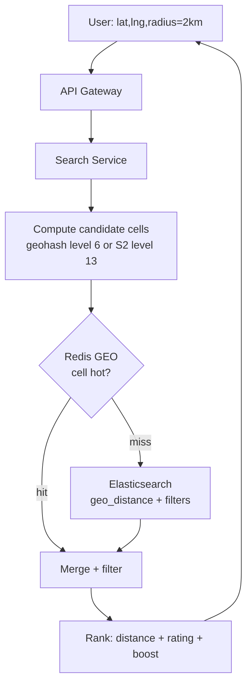
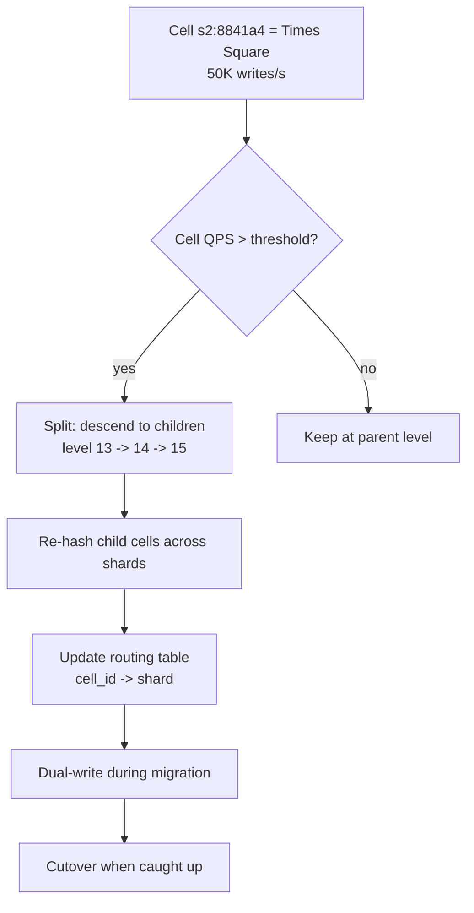
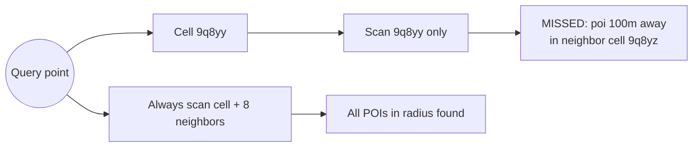

# Geo-Spatial Search (Yelp / Nearby Places)

## Why This Exists

**Problem.** Given a user at `(lat, lng)`, return the top-K points of interest within radius R (or just top-K nearest), filtered by category/rating/open-now, sorted by distance, in <100ms p99 — over a corpus of 50M+ documents that updates continuously (driver locations, listing availability, business hours).

A naive `WHERE haversine(lat, lng, ?, ?) < R` is O(N) per query and pegs the database. The real engineering problem is **mapping 2D space onto a 1D index** so a B-tree or LSM can serve range scans, while preserving locality and handling the curse of hot regions (Manhattan has 1000× the density of Wyoming).

**Key insight.** Every production geo system picks one of three strategies for the spatial index:

1. **Space-filling curves** (Geohash, S2) — recursively subdivide the globe into cells, encode each as a sortable string/integer. Cheap to shard, breaks down at cell boundaries.
2. **Tree structures** (R-tree, k-d tree, Quadtree) — bounding-box hierarchy. Great for arbitrary polygons; harder to shard.
3. **Inverted indices over discrete cells** (Elasticsearch geo_grid, Lucene BKD trees) — hybrid; uses tree internally but exposes range/aggregation APIs.

The right answer in an interview is almost always: **geohash or S2 for sharded primary lookup, R-tree (PostGIS GiST) for complex polygon queries, Redis GEO for ephemeral high-write driver locations.** Then you talk about the hot-region problem.

**Reach for this when.**
- "Find X near me" with R < 100km and >100 QPS.
- Driver dispatch, ride matching, delivery ETAs.
- Geofencing (is user inside polygon?).
- Map tile rendering, clustering.

**Don't reach for this when.**
- You have <10K points — just scan in memory, sort by haversine.
- You need exact shortest-path routing — that's a graph problem (OSRM, Valhalla, GraphHopper), not a search problem.
- All queries are global or country-level — a regular B-tree on `(country, city)` is fine.
- Latency budget is >1s and corpus is small — a managed service like Algolia Places or Mapbox is cheaper than building this.

## Diagrams

### Query path: nearby restaurants



### Hot-region rebalancing



### Geohash boundary problem



## Core Building Blocks

### 1. Geohash — the simple, sharding-friendly choice

A geohash interleaves the bits of `(lat, lng)` and base32-encodes the result. Each character adds 5 bits of precision and shrinks the cell by ~32×.

| Length | Cell width × height (mid-latitudes) | Use case |
|--------|--------------------------------------|----------|
| 4      | ~39 km × 19 km                       | City-level |
| 5      | ~4.9 km × 4.9 km                     | Neighborhood |
| 6      | ~1.2 km × 0.6 km                     | "Near me" default |
| 7      | ~150 m × 150 m                       | Block-level |
| 8      | ~38 m × 19 m                         | Building-level |

```python
# python-geohash or pygeohash
import geohash2

# Encode a POI
h = geohash2.encode(40.758, -73.985, precision=6)  # "dr5ru7"

# Find candidate cells for a 2km radius query
def candidate_cells(lat: float, lng: float, radius_m: float, precision: int = 6) -> set[str]:
    """Return geohash + all 8 neighbors. CRUCIAL: query point near cell edge
    means a POI 50m away can sit in a different geohash. Skipping neighbors
    is the #1 geohash bug in production."""
    center = geohash2.encode(lat, lng, precision)
    return {center} | set(geohash2.neighbors(center))

# DynamoDB / Cassandra schema
# PK = geohash6, SK = poi_id
# Query: BatchGet on 9 partition keys, then haversine-filter the results
```

**The boundary bug.** Two points 10m apart can have entirely different geohash prefixes if they straddle a cell boundary (e.g. across the equator the first character changes). **Always query the cell plus its 8 neighbors,** then filter by exact haversine distance. For radius > cell size, walk further out — at radius 10km with precision 6, you need a 17×17 grid of cells. Drop precision to 5 instead.

### 2. S2 — Google's industrial-strength choice

S2 projects the sphere onto an inscribed cube, then uses a Hilbert curve to assign each cell a 64-bit integer ID. Properties geohash lacks:

- **Roughly equal-area cells** at every level (geohash cells distort badly near the poles).
- **Hierarchical containment** — `parent.contains(child)` is bitwise, no string ops.
- **Efficient region cover** — `S2RegionCoverer` returns a minimal set of cells covering a circle/polygon at a target precision, mixing levels intelligently.
- **Hilbert ordering preserves locality better than Z-order** (geohash is essentially Z-order/Morton).

```python
# pip install s2sphere (port of Google's C++ s2geometry)
import s2sphere as s2

def s2_cells_for_radius(lat: float, lng: float, radius_m: float) -> list[int]:
    """Cover a query circle with S2 cells at mixed levels.
    Returns up to ~8 cells (configurable) — far fewer than geohash neighbor scan."""
    region = s2.Cap.from_axis_angle(
        s2.LatLng.from_degrees(lat, lng).to_point(),
        s2.Angle.from_degrees(radius_m / 6_371_000 * (180 / 3.14159))
    )
    coverer = s2.RegionCoverer()
    coverer.min_level = 10   # ~10km cells
    coverer.max_level = 15   # ~300m cells
    coverer.max_cells = 8
    cells = coverer.get_covering(region)
    return [c.id() for c in cells]

# Each S2CellId is a uint64 — a single integer range scan per cell.
# WHERE s2_cell_id BETWEEN cell.range_min() AND cell.range_max()
```

**S2 is what Google Maps, Foursquare, Pokémon Go, and Uber's H3 predecessor use.** The library handles spherical geometry correctly (geodesics, not flat-earth approximations) — critical for queries spanning continents or near the poles.

**See also:** Uber's H3 (hexagonal hierarchical index) — better than S2 for adjacency-uniform applications (every neighbor is equidistant) but worse for arbitrary polygon coverage. Pick H3 if you do a lot of "expand outward by N rings"; pick S2 if you do a lot of polygon containment.

### 3. R-tree — for polygons and PostGIS

R-trees store **bounding boxes** in a balanced tree. Each internal node holds the MBR (minimum bounding rectangle) of its children. Queries traverse only the nodes whose MBR intersects the search region.

PostGIS uses **GiST (Generalized Search Tree) with R-tree-over-GiST** as the default, plus **SP-GiST** (a quadtree variant) for point-only indices.

```sql
-- PostGIS schema for restaurants
CREATE EXTENSION postgis;

CREATE TABLE places (
    id           BIGSERIAL PRIMARY KEY,
    name         TEXT NOT NULL,
    category     TEXT NOT NULL,
    rating       REAL,
    -- geography(Point, 4326) handles spherical math correctly.
    -- geometry is 30-50% faster but gives flat-earth answers; use for city-scale only.
    location     GEOGRAPHY(POINT, 4326) NOT NULL
);

-- The index. Without this, every query is a seq scan.
CREATE INDEX places_loc_gist ON places USING GIST (location);
CREATE INDEX places_cat_idx ON places (category);

-- Nearby query, K=20 nearest within 2km, category filter
SELECT id, name, rating,
       ST_Distance(location, ST_MakePoint(-73.985, 40.758)::geography) AS dist_m
FROM places
WHERE category = 'restaurant'
  -- ST_DWithin uses the GIST index; ST_Distance < N does NOT (post-filter only).
  AND ST_DWithin(location, ST_MakePoint(-73.985, 40.758)::geography, 2000)
ORDER BY location <-> ST_MakePoint(-73.985, 40.758)::geography  -- KNN operator
LIMIT 20;
```

**The `ST_DWithin` vs `ST_Distance < N` trap.** `ST_DWithin` is sargable — the planner pushes it into the GiST index. `ST_Distance(a,b) < 2000` is not — Postgres computes distance for every row first. This single substitution can turn a 10s query into 5ms.

**The `<->` KNN operator** uses the GiST index to traverse in distance order — far faster than `ORDER BY ST_Distance(...)` over a `WHERE ST_DWithin` result set when K is small.

### 4. Elasticsearch geo — when you need full-text + geo + filters

```json
PUT /places
{
  "mappings": {
    "properties": {
      "name":     { "type": "text" },
      "category": { "type": "keyword" },
      "rating":   { "type": "float" },
      "location": { "type": "geo_point" }
    }
  }
}

POST /places/_search
{
  "size": 20,
  "query": {
    "bool": {
      "filter": [
        { "term": { "category": "restaurant" } },
        { "range": { "rating": { "gte": 4.0 } } },
        { "geo_distance": {
            "distance": "2km",
            "location": { "lat": 40.758, "lon": -73.985 }
        }}
      ]
    }
  },
  "sort": [
    { "_geo_distance": {
        "location": { "lat": 40.758, "lon": -73.985 },
        "order": "asc",
        "unit": "m",
        "distance_type": "arc"   // "plane" is faster but wrong over 200km
    }}
  ]
}
```

ES uses **BKD trees** (block k-d trees, Lucene's geo index) under the hood — disk-resident, segment-merged, and amortizes well across high-cardinality multi-dimensional data. For arbitrary polygon search use `geo_shape` (slower but correct). For density heatmaps use the `geohash_grid` or `geotile_grid` aggregation.

### 5. Redis GEO — for high-write driver locations

Redis GEO commands (`GEOADD`, `GEOSEARCH`, `GEORADIUS`) are built on **sorted sets**, where the score is a 52-bit interleaved geohash. Keep one sorted set per "world" (city, region) — typical pattern is `geo:drivers:nyc`.

```python
import redis
r = redis.Redis()

# Driver heartbeats every 4s — overwrites the score.
r.geoadd("geo:drivers:nyc", (-73.985, 40.758, "driver-7421"))

# Find 10 closest available drivers within 3km
nearby = r.geosearch(
    "geo:drivers:nyc",
    longitude=-73.985, latitude=40.758,
    unit="m", radius=3000,
    sort="ASC", count=10,
    withcoord=True, withdist=True
)
# Returns [(driver_id, dist_m, (lng, lat)), ...]
```

**Why Redis GEO and not PostGIS for live driver locations:**
- 50K drivers × 1 write per 4s = 12.5K writes/s. PostGIS GiST index updates are heavy under that load (every update rebalances the tree).
- Redis is in-memory — sub-ms ops.
- Loss of state on crash is acceptable; drivers re-register in seconds.

**What Redis GEO is bad at:** complex filters (you can't ask "drivers within 3km whose rating >= 4.7 and accept SUVs" without a second filter pass), polygons, pagination beyond a few thousand results.

### Hybrid architecture (the interview-winning answer)

```python
def find_nearby_restaurants(lat, lng, radius_m, category, rating_min):
    """
    Three-tier strategy:
    1. Hot path: Redis cache keyed by (geohash6, category, rating_bucket)
       for the top 1000 cells (the ones that 90% of queries hit).
    2. Warm path: Elasticsearch — handles arbitrary filters + ranking + text.
    3. Source of truth: PostGIS — used by ETL to build ES index, plus
       analytical queries (heatmaps, polygon membership).
    """
    cache_key = f"near:{geohash(lat,lng,6)}:{category}:r{int(rating_min)}"
    if cached := redis.get(cache_key):
        return rerank_by_distance(cached, lat, lng)

    results = es.search(...)            # ES geo_distance
    redis.setex(cache_key, 60, results) # 60s TTL — POIs don't move
    return results
```

## Algorithms

### Range query (radius search)

```python
def radius_search_geohash(lat, lng, radius_m, db):
    """
    Steps:
      1. Compute query geohash at precision matching radius.
      2. Expand to neighbors (ring of 8) — handles boundary.
      3. Range scan each cell's prefix.
      4. Filter by exact haversine distance.
      5. Sort, limit.
    """
    precision = pick_precision(radius_m)  # radius=2km -> precision 5 or 6
    cells = expand_neighbors(geohash(lat, lng, precision))
    candidates = []
    for cell in cells:
        # Range scan: all keys starting with cell prefix
        candidates.extend(db.scan_prefix(f"poi:{cell}"))
    # Post-filter — neighbor expansion is a superset
    return sorted(
        (c for c in candidates if haversine(lat, lng, c.lat, c.lng) <= radius_m),
        key=lambda c: c.dist
    )[:LIMIT]

def pick_precision(radius_m):
    # Heuristic: pick precision so query fits in ~9 cells.
    if radius_m < 500:    return 7
    if radius_m < 2_000:  return 6
    if radius_m < 20_000: return 5
    if radius_m < 100_000: return 4
    return 3
```

### KNN (k-nearest neighbors)

For Postgres: use the `<->` operator with a GiST index — it traverses the tree in best-first order, pruning nodes whose MBR is farther than the current Kth result.

For an in-memory R-tree (e.g. `rtree` Python lib, `boost::geometry::index::rtree`), use the **branch-and-bound KNN** algorithm:

```python
import heapq

def knn(rtree, query_point, k):
    """Best-first traversal. Yields (distance, item) in ascending order.
    Equivalent to PostGIS <->."""
    pq = [(0, rtree.root)]
    found = []
    while pq and len(found) < k:
        d, node = heapq.heappop(pq)
        if node.is_leaf:
            heapq.heappush(found, (d, node.item))
        else:
            for child in node.children:
                heapq.heappush(pq, (mindist(query_point, child.mbr), child))
    return [heapq.heappop(found) for _ in range(min(k, len(found)))]
```

For S2/geohash without a tree: do a **ring expansion** — query the center cell, then ring 1, ring 2, ... until you have K results plus a margin (a few cells more, since cell boundaries don't match distance perfectly).

## Hot-Region Rebalancing

The core production problem: a uniform sharding scheme (hash by geohash5) puts Times Square, Shibuya, and a Wyoming mountainside on three different shards — but Times Square gets 1000× more traffic. That shard saturates, the others idle.

### Strategy 1: hierarchical splitting

Start every cell at a coarse level (e.g. S2 level 10, ~10km cells). Monitor QPS per cell. When a cell exceeds threshold (say 5K QPS), **split** it: descend to its 4 children (S2) or 32 children (geohash) at the next level, redistribute the data, update the routing table.

```python
# Routing table is just (cell_id, level) -> shard
# Stored in Zookeeper / etcd / Consul, watched by all clients.
{
  ("8841a4",     13): "shard-7",   # Manhattan general — split
  ("8841a4c001", 15): "shard-12",  # Times Square — its own shard
  ("8841a4c002", 15): "shard-13",  # Madison Sq — its own shard
  ("8841a4c003", 15): "shard-14",  # ...
  ("8841a4d",    14): "shard-7",   # rest of Manhattan stays at parent level
}
```

This is essentially what **HBase region splits**, **DynamoDB adaptive capacity**, and **Cassandra's vnodes** do for hash-range shards — applied to geometry instead.

### Strategy 2: power of two choices + replication

Replicate hot cells to N shards. Reads pick a shard via random or load-aware hashing. Writes fan out to all replicas. Trade write amplification for read scalability — appropriate for read-heavy workloads (POIs change rarely).

### Strategy 3: time-bucketed shards (for driver-location workloads)

Append `floor(now / 60s)` to the cell key. Each minute writes go to a new bucket; old buckets TTL out. Spreads load across keys without coordination. Used in Uber's earlier dispatch architecture before they moved to **Ringpop + H3**.

### Detection — what to alert on

- p99 latency per cell, sliced by cell_id at multiple levels.
- Shard CPU / memory imbalance ratio (max / min) > 3.
- Cache hit rate on hot cells dropping (signal that working set exceeds cache size).
- DynamoDB throttle events / Redis `latencystats` percentiles.

## Trade-offs

| Benefit | Cost |
|--------|------|
| Geohash: trivial to shard, prefix-sortable, works on any KV store | Boundary bug forces 9-cell scan; cells distort near poles; Z-order locality is worse than Hilbert |
| S2: equal-area, hierarchical, polygon-aware, Google-grade | More complex (uint64 IDs vs strings); fewer language ports; harder to debug visually |
| R-tree / PostGIS: arbitrary polygons, exact distance, single SQL query | Hard to shard (R-tree is a tree, not a hash); GiST writes are O(log n) and rebalance under churn; ACID overhead |
| Elasticsearch geo: full-text + geo + filters + aggregations in one query | Eventual consistency from primary; index size 2-3× source; cluster ops pain (split-brain, hot shards) |
| Redis GEO: sub-ms writes for live locations | In-memory cost; no complex filters; single-region; data lost on flush unless persistence is on (which slows writes) |
| Hot-cell splitting | Routing table grows; data migration during splits; double-write window risks duplicates |
| Replication of hot cells | Write amplification ×N; staleness windows |
| Caching at cell granularity | Stale POIs (acceptable: hours); cache stampede on cold cell + viral event |

## Common Pitfalls

- **Forgetting the geohash boundary expansion.** Query returns near-empty results for points 10m from a cell edge. War story: Yelp's first geo index missed up to 30% of nearby places; users in the East Village got results for the West Village.
- **Using `ST_Distance(a,b) < N` instead of `ST_DWithin(a,b,N)`.** The former post-filters; the latter pushes into the GiST index. 1000× difference at 10M rows.
- **Mixing `geometry` and `geography` in PostGIS** without understanding. `geometry` does flat-earth math — fast, wrong over distances >100km, broken near poles and date line. `geography` does spherical math — correct, ~30% slower. **Default to geography unless you've benchmarked otherwise.**
- **Storing as `(lat, lng)` columns and computing haversine in WHERE.** No index can help. Always store as a real spatial type and index it.
- **Lat/lng order confusion.** GeoJSON / PostGIS `ST_MakePoint` expect `(lng, lat)`. Most other libraries expect `(lat, lng)`. Get this wrong and your "Brooklyn" queries return Antarctica.
- **Using a single Redis instance for all driver locations** — Times Square saturates the connection. Shard by city (`geo:drivers:nyc`, `geo:drivers:sf`) at minimum; for big cities shard by geohash4 within the city.
- **Refreshing driver location with `GEOADD` every second** — fine for 10K drivers, painful at 1M. Batch with pipelining; back off when driver is stationary.
- **Pre-computing top-K for every cell** as a "smart cache" — sounds good, falls apart when filters are dynamic (rating ≥ 4.5 + open-now + delivers-now). Cache per filter combo explodes the keyspace.
- **Sorting by `_geo_distance` with `distance_type: plane`** in Elasticsearch on continental queries. `plane` skips the spherical correction; results are wrong by km for cross-state queries. Use `arc` for anything > 50km.
- **Forgetting the international date line.** A radius query at lng=179.9 with radius 200km should include lng=-179.9 results. Most libraries handle this; some custom geohash code does not. Test with Fiji.
- **Not deduplicating across cells.** A POI directly on a boundary may live in two cells (some geohash libs assign it to both). Dedupe by ID after merging.
- **Using `geo_shape` in Elasticsearch when `geo_point` would do.** `geo_shape` is 5-10× slower for points. Use `geo_point` for restaurants, `geo_shape` for delivery zones.

## Decision Table

| Need | Use |
|------|-----|
| Sharded primary index over 100M+ static POIs | Geohash5 or S2 level 10–13 in DynamoDB / Cassandra / sharded MySQL |
| Single-region < 50M POIs, complex filters, polygons | PostGIS with GiST + KNN `<->` operator |
| Search box + filters + ranking + autocomplete | Elasticsearch `geo_point` + `geo_distance` + `bool` filter |
| 10K–10M live driver / vehicle locations, sub-ms writes | Redis GEO sharded by city or geohash4 |
| Polygon containment (geofence zones, delivery areas) | PostGIS `geometry(Polygon)` with GiST, or S2 `Polygon.contains()` |
| Heatmap / density aggregation | ES `geotile_grid` agg or ClickHouse with H3/S2 cell function |
| Routing / shortest path | Not this — use OSRM / Valhalla / Google Directions |
| <10K POIs, low QPS | In-memory list, haversine sort. Don't over-engineer. |
| Global + sphere correctness mandatory (poles, date line) | S2 + geography type. Geohash + geometry will lie to you. |
| Fast adjacency in N rings | Uber H3 (hexagons → uniform neighbors) |
| Time-series of moving objects (trajectory queries) | TimescaleDB + PostGIS, or specialized: MobilityDB |

## Capacity Math (back-of-envelope for the interview)

- **Storage.** 50M POIs × (id 8B + s2_cell 8B + lat/lng 16B + name 50B + category 16B + rating 4B + payload 200B) ≈ 15 GB. Tiny. Fits in RAM on one big box.
- **Index.** PostGIS GiST is ~25% of table size. Lucene BKD is ~30%. S2 cell B-tree is 3× smaller (just int64s).
- **QPS.** Yelp-scale: 100M users × 5 nearby queries/day / 86400s ≈ 5800 QPS avg, 30K peak. One PostGIS box (32 cores, NVMe) handles 2-5K QPS at p99 50ms; cluster of 8 with read replicas handles peak. ES cluster of 6 nodes equivalent.
- **Live drivers.** 1M drivers × 1 update / 4s = 250K writes/s. Single Redis Cluster with 32 shards (~8K writes/s/shard) easily.

## References

- Sharma, A. — *Geohashing: Designing the algorithm for nearest neighbor search* — https://www.factual.com/blog/how-geohashes-work
- Niemeyer, G. — *Geohash — original specification* — https://en.wikipedia.org/wiki/Geohash
- Google — *S2 Geometry Library* (the canonical reference) — https://s2geometry.io/
- Google — *S2 Cells overview* — https://s2geometry.io/devguide/s2cell_hierarchy
- Uber Engineering — *H3: Uber's Hexagonal Hierarchical Spatial Index* — https://www.uber.com/blog/h3/
- Uber Engineering — *Building a Better Dispatch System with Ringpop* — https://www.uber.com/blog/ringpop-open-source-nodejs-library/
- Guttman, A. (1984) — *R-Trees: A Dynamic Index Structure for Spatial Searching* — https://dl.acm.org/doi/10.1145/602259.602266
- Hellerstein, J. et al. — *Generalized Search Trees for Database Systems (GiST)* — https://dsf.berkeley.edu/papers/UCB-MS-jmh.pdf
- PostGIS Documentation — *Spatial Indexing* — https://postgis.net/docs/using_postgis_dbmanagement.html#idm2706
- PostGIS Documentation — *ST_DWithin* — https://postgis.net/docs/ST_DWithin.html
- Elasticsearch — *Geo queries* — https://www.elastic.co/guide/en/elasticsearch/reference/current/geo-queries.html
- Elasticsearch — *BKD trees in Lucene* (McCandless) — https://www.elastic.co/blog/lucene-points-6-0
- Redis — *Geospatial commands* — https://redis.io/docs/data-types/geospatial/
- Foursquare Engineering — *Building a Geocoder* — https://medium.com/foursquare-direct/improving-our-place-search-with-the-foursquare-geocoder-bd9b9e9ec00a
- Hadjieleftheriou, M. — *Spatial Indexing Survey* (libspatialindex docs) — https://libspatialindex.org/
- Kleppmann, M. — *Designing Data-Intensive Applications*, ch. 3 — multi-dimensional indexes and geospatial data (R-trees, space-filling curves)
- Xu, A. — *System Design Interview Vol. 1*, ch. 8 — *Design Nearby Friends* / *Design a Proximity Service*
- Google SRE Workbook — ch. 11 — *Managing Load* (relevant to hot-region rebalancing) — https://sre.google/workbook/managing-load/
- AWS Builders' Library — *Caching challenges and strategies* — https://aws.amazon.com/builders-library/caching-challenges-and-strategies/

## See Also

- `../url-shortener/` — base62 encoding patterns parallel geohash base32; same KV-store sharding playbook.
- `../rate-limiter/` — token bucket per cell as a hot-region throttle.
- `../newsfeed/` — fan-out vs fan-in trade-off mirrors hot-cell read replication.
