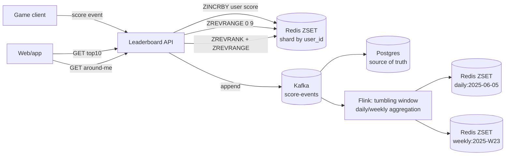
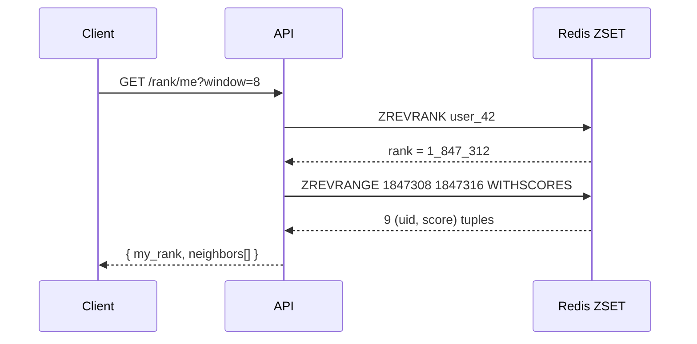
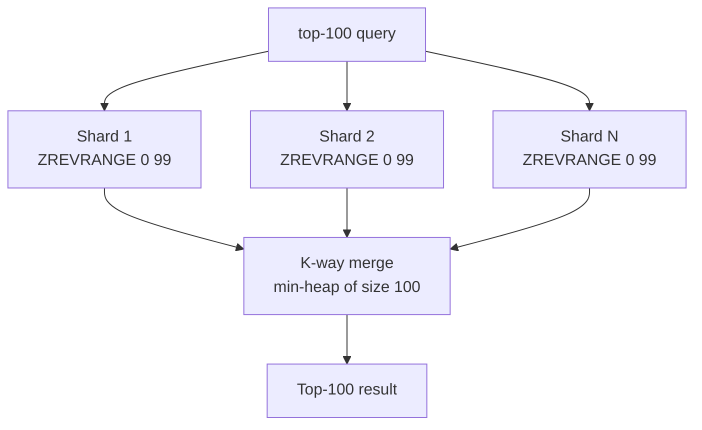

# Leaderboard

## Why This Exists

**Problem.** A leaderboard looks trivial — `ORDER BY score DESC LIMIT 10` — until you have 50M users, 100K writes/sec during a tournament finale, and a product manager asking for "show me my rank and 5 players above and below me" with a p99 < 50ms. SQL `ORDER BY ... OFFSET` is **O(N log N)** per query and crushes the database. A naive in-memory list re-sorts on every write. A B-tree index on `score` works for top-K but rank-of-user requires a count of rows with `score > X`, which is a full index scan.

**Key insight.** Leaderboards are the **canonical use case for an order-statistic tree**. Redis sorted sets (`ZSET`) implement this via a **skip list + hash map**, giving you `O(log N)` for insert, update, rank, range-by-rank, and range-by-score — all in the same data structure. Most production leaderboards (Twitch, Riot, Discord, mobile games) are sorted sets behind a thin service layer. The interesting design work is **what you put around the ZSET**: time windows, sharding, write batching, persistence, and tie-breaking.

**Reach for this when:**
- You need top-K **and** rank-of-user **and** "around me" queries on the same data.
- Score updates are frequent (≥ 1K/sec) and writes must be visible in seconds.
- You can tolerate **eventual consistency on score** (e.g., score reflects the last few seconds of activity, not strictly the last write).
- The leaderboard fits in memory per shard (≤ ~50M entries per ZSET is the practical comfort zone).

**Don't reach for this when:**
- The leaderboard is small (< 10K entries) and queried infrequently — a SQL index is fine and gives you transactions.
- You need **strong consistency** between a transactional update (e.g., paying for a power-up) and the resulting score change. Use the database as the source of truth and project to Redis.
- You need **rich querying** beyond rank (filter by region, game mode, friends-only) — sorted sets only sort on one dimension. You'll either fan out to many ZSETs or use a search engine (Elasticsearch) or columnar store.
- The "score" is actually a **derived metric** that requires recomputation (e.g., MMR with decay). Compute in a stream processor, materialize into the ZSET.

## Diagrams

### Read/write path



### Rank query "around me"



### Sharded leaderboard merge for top-K



## Core: Redis sorted sets

A Redis sorted set stores `(member, score)` pairs sorted by score. Internally it is a **skip list** (for ordered traversal) plus a **hash table** (for `O(1)` member→score lookup). The combination gives:

| Operation | Complexity | Command |
|---|---|---|
| Add or update score | `O(log N)` | `ZADD key score member` |
| Increment score | `O(log N)` | `ZINCRBY key delta member` |
| Get score for member | `O(1)` | `ZSCORE key member` |
| Rank of member (asc) | `O(log N)` | `ZRANK key member` |
| Rank of member (desc) | `O(log N)` | `ZREVRANK key member` |
| Range by rank (top-K) | `O(log N + K)` | `ZREVRANGE key 0 K-1 WITHSCORES` |
| Range by score | `O(log N + K)` | `ZRANGEBYSCORE key min max` |
| Cardinality | `O(1)` | `ZCARD key` |
| Remove | `O(log N)` | `ZREM key member` |

Source: [Redis sorted set commands](https://redis.io/docs/latest/commands/?group=sorted-set) and the [data types intro](https://redis.io/docs/latest/develop/data-types/sorted-sets/).

### Minimal Python service

```python
# leaderboard.py — production-ish skeleton
import time
from typing import Iterable
import redis

r = redis.Redis(host="redis-leaderboard.prod", decode_responses=True)
KEY_ALL_TIME = "lb:global:alltime"

def submit_score(user_id: str, delta: float) -> float:
    """Atomically increment user's score. Returns new score.

    ZINCRBY is O(log N) and atomic — no read-modify-write race.
    """
    return r.zincrby(KEY_ALL_TIME, delta, user_id)

def top_k(k: int = 10) -> list[tuple[str, float]]:
    """Top-K players by score (descending)."""
    # WITHSCORES returns [member, score, member, score, ...] — redis-py flattens to tuples.
    return r.zrevrange(KEY_ALL_TIME, 0, k - 1, withscores=True)

def get_rank(user_id: str) -> int | None:
    """1-indexed rank or None if user has no score yet."""
    raw = r.zrevrank(KEY_ALL_TIME, user_id)
    return None if raw is None else raw + 1

def around_me(user_id: str, window: int = 5) -> dict:
    """Return user's rank plus `window` neighbors above and below.

    Two round-trips. Pipeline if latency matters.
    """
    pipe = r.pipeline(transaction=False)
    pipe.zrevrank(KEY_ALL_TIME, user_id)
    pipe.zscore(KEY_ALL_TIME, user_id)
    rank, score = pipe.execute()
    if rank is None:
        return {"rank": None, "score": None, "neighbors": []}
    start = max(0, rank - window)
    stop = rank + window
    neighbors = r.zrevrange(KEY_ALL_TIME, start, stop, withscores=True)
    return {"rank": rank + 1, "score": score, "neighbors": neighbors}
```

### Tie-breaking: encode a tiebreaker into the score

Redis sorted sets allow only one numeric score. When two players tie, `ZREVRANGE` falls back to **lexicographic order of member name**, which is almost never what you want (Anna outranks Zoe forever). Pack a deterministic tiebreaker into the score:

```python
# Score: integer points * 10^10 - timestamp_ms (lower ts wins ties — first to reach score ranks higher).
# IEEE 754 doubles have 52 bits of mantissa => ~15-16 significant decimal digits.
# Keep total bits within that budget or precision rounds away your tiebreaker.

MAX_TS_MS = 10**13  # year 2286, 13 digits

def packed_score(points: int, ts_ms: int) -> float:
    # points takes the high bits; ts_ms shifts ranking among ties.
    # Subtraction means earlier timestamp -> higher packed score.
    return points * MAX_TS_MS + (MAX_TS_MS - ts_ms)

# Then: ZADD key packed_score(points, ts) member
```

Be brutally honest about precision. `points * 10^13` overflows 16 digits if points exceeds ~999. Use `ZADD ... GT` to only update when score increases, and store the human-readable score separately if needed.

## Per-time-window leaderboards

Most products want **daily**, **weekly**, **monthly**, and **all-time** boards simultaneously. Two strategies:

### Strategy 1: Bucket key per window (recommended)

```python
from datetime import datetime, timezone

def daily_key(ts: datetime) -> str:
    # ISO date in UTC. Use the player's timezone only if the product strictly demands it.
    return f"lb:daily:{ts.strftime('%Y-%m-%d')}"

def weekly_key(ts: datetime) -> str:
    iso_year, iso_week, _ = ts.isocalendar()
    return f"lb:weekly:{iso_year}-W{iso_week:02d}"

def submit(user_id: str, points: float, ts: datetime | None = None):
    ts = ts or datetime.now(timezone.utc)
    pipe = r.pipeline(transaction=False)
    pipe.zincrby("lb:alltime", points, user_id)
    pipe.zincrby(daily_key(ts), points, user_id)
    pipe.zincrby(weekly_key(ts), points, user_id)
    # TTL each window key so expired boards GC themselves.
    # 8 days for daily covers late writes + viewing.
    pipe.expire(daily_key(ts), 8 * 24 * 3600, nx=True)  # NX: only set if no TTL.
    pipe.expire(weekly_key(ts), 35 * 24 * 3600, nx=True)
    pipe.execute()
```

**Why TTL with NX:** `EXPIRE ... NX` sets a TTL only if the key doesn't already have one. Without `NX`, every write resets the TTL and keys never expire. Since Redis 7.0, `EXPIRE` accepts `NX|XX|GT|LT` flags ([EXPIRE docs](https://redis.io/docs/latest/commands/expire/)).

**Why 8 days for "daily":** Late events, reconciliation jobs, and end-of-day viewers all need a buffer. Don't expire on the dot of midnight or you'll get angry users staring at empty boards.

### Strategy 2: Single ZSET with windowed score

Keep one ZSET per leaderboard but compute the score so that old contributions decay or are filterable. Doable with `ZRANGEBYSCORE` if your score includes a timestamp, but you lose the additive `ZINCRBY` property. Almost never the right call — prefer Strategy 1.

### Reset semantics

When a window rolls over (Monday 00:00 UTC for weekly), do **nothing destructive**. The new window is a new key. The old key still answers historical queries until its TTL fires. If a product manager asks for "all-time leaderboards reset annually", that's a separate `lb:season:2025` key that you swap to via a feature flag at the rollover. Never `FLUSHDB` or `DEL` a live leaderboard.

## "Around me" queries

The pattern is **rank-then-range**:

```python
def around_me_pipelined(user_id: str, window: int = 8) -> dict:
    """Single round-trip via Lua to avoid a TOCTOU window between rank and range."""
    LUA = """
    local rank = redis.call('ZREVRANK', KEYS[1], ARGV[1])
    if rank == false then return nil end
    local score = redis.call('ZSCORE', KEYS[1], ARGV[1])
    local window = tonumber(ARGV[2])
    local lo = math.max(0, rank - window)
    local hi = rank + window
    local neighbors = redis.call('ZREVRANGE', KEYS[1], lo, hi, 'WITHSCORES')
    return {rank, score, neighbors}
    """
    script = r.register_script(LUA)
    result = script(keys=[KEY_ALL_TIME], args=[user_id, window])
    if result is None:
        return {"rank": None}
    rank, score, neighbors = result
    # neighbors is flat [m, s, m, s, ...]
    pairs = list(zip(neighbors[0::2], map(float, neighbors[1::2])))
    return {"rank": rank + 1, "score": float(score), "neighbors": pairs}
```

**Why Lua:** Between the `ZREVRANK` and the `ZREVRANGE`, another client's `ZADD` could shift ranks. For a leaderboard "around me" view this is mostly cosmetic, but Lua scripts run atomically on the Redis main thread ([EVAL docs](https://redis.io/docs/latest/commands/eval/)). Keep Lua short — long scripts block all other commands.

## Sharded leaderboards

A single ZSET handles ~10-50M members comfortably on a beefy box (> 64 GB RAM, single-threaded Redis). Past that, or when write throughput exceeds ~100K ops/sec on one node, you shard.

### Sharding strategies

**By user_id hash (most common).** Each shard holds an independent ZSET. Reads have to **scatter-gather**:

```python
import heapq
from concurrent.futures import ThreadPoolExecutor

NUM_SHARDS = 16
shards = [redis.Redis(host=f"lb-shard-{i}.prod") for i in range(NUM_SHARDS)]

def shard_for(user_id: str) -> redis.Redis:
    # Use a stable hash. Python's hash() is randomized per process — DO NOT use it.
    import hashlib
    h = int(hashlib.blake2b(user_id.encode(), digest_size=8).hexdigest(), 16)
    return shards[h % NUM_SHARDS]

def submit_sharded(user_id: str, delta: float):
    shard_for(user_id).zincrby("lb:alltime", delta, user_id)

def get_rank_sharded(user_id: str, score: float) -> int:
    """Approximate rank: count members with higher score across all shards.
    Uses ZCOUNT which is O(log N) per shard.
    """
    def count_higher(shard):
        # +inf as upper bound; (score as exclusive lower bound.
        return shard.zcount("lb:alltime", f"({score}", "+inf")
    with ThreadPoolExecutor(max_workers=NUM_SHARDS) as ex:
        higher = sum(ex.map(count_higher, shards))
    return higher + 1

def top_k_sharded(k: int = 100) -> list[tuple[str, float]]:
    """Each shard returns its top K; merge with a heap to pick global top K.
    Correct because the global top K must come from the union of per-shard top Ks.
    """
    def shard_topk(shard):
        return shard.zrevrange("lb:alltime", 0, k - 1, withscores=True)
    with ThreadPoolExecutor(max_workers=NUM_SHARDS) as ex:
        per_shard = list(ex.map(shard_topk, shards))
    merged = heapq.nlargest(k, (item for shard in per_shard for item in shard), key=lambda x: x[1])
    return merged
```

**Cost.** Top-K becomes `O(NUM_SHARDS * (log N + K))` reads in parallel. Rank-of-user becomes a fan-out `ZCOUNT` across all shards — bounded but expensive. "Around me" is harder still: you need to find users with similar scores across shards. In practice many shipping leaderboards **approximate** "around me" with the user's own shard plus a small correction, accepting that the displayed neighbors may not be globally exact.

**By score range (rare).** Shard 0 holds scores 0–1000, shard 1 holds 1000–10000, etc. Top-K is local to one shard but updates may move a user across shards (expensive). Avoid unless score distribution is extremely stable.

### Redis Cluster vs. application sharding

[Redis Cluster](https://redis.io/docs/latest/operate/oss_and_stack/management/scaling/) shards by **hash slot** of the key. If your leaderboard is one key, Cluster doesn't help — the whole ZSET lives on one master. To shard a logical leaderboard with Cluster, suffix the key with a hash tag: `lb:alltime:{shard0}`, `lb:alltime:{shard1}`, etc. The `{shard0}` braces force that key into a specific slot. Application logic still does the routing and merge.

## Persistence and durability

Redis is **not** the source of truth. A `BGSAVE` happens periodically, `appendonly yes` (AOF) buffers writes, but a process crash can lose seconds of data ([Redis persistence](https://redis.io/docs/latest/operate/oss_and_stack/management/persistence/)).

Production pattern:

1. Write the score event to **Kafka** (or DynamoDB Streams, Kinesis) first — that's your durable log.
2. A consumer applies the event to Redis via `ZINCRBY`.
3. A second consumer writes to Postgres / DynamoDB for analytics and rebuilds.
4. On Redis disaster, replay from Kafka into a fresh ZSET. For a 50M-user board this rebuild is minutes, not hours, because ZADD is fast and you can pipeline.

If you skip Kafka and write to Redis from the API directly, **at minimum** enable AOF with `appendfsync everysec` and replicate to a hot standby. Accept that you can lose ~1 second of writes on master failure.

## Hot keys and write storms

A single ZSET key is a single Redis main-thread operation. During a tournament finale, a viral event, or a bot raid you can saturate that thread. Mitigations:

- **Write coalescing.** Buffer increments in the API layer for 100 ms, then `ZINCRBY` the sum. Reduces Redis ops by 10–100x for hot users; adds 100 ms of staleness.
- **Lua-batched writes.** A single `EVAL` can apply N increments atomically, reducing round-trips.
- **Pre-shard the hot key.** `lb:alltime:0`..`lb:alltime:15`, hash user to shard. Read = fan out + merge (see sharded section).
- **Read replicas.** All reads (top-K, rank, around-me) hit a replica via `READONLY`. Writes hit master. Replicas lag by ~ms but the leaderboard is eventually consistent anyway.
- **Cache top-K.** The top-100 changes infrequently relative to read traffic. Cache the result in a local CDN/edge layer with a 1-second TTL. A million top-10 reads/sec collapses to one Redis call per second.

## Trade-offs

| Benefit | Cost |
|---|---|
| Sorted-set ops are `O(log N)` for everything you need | Single-threaded Redis: hot key = single CPU bottleneck |
| Score updates are atomic via `ZINCRBY`, no locks | One numeric score only — multi-dimensional sorting needs separate ZSETs |
| Top-K, rank, around-me share one structure | Memory cost is high: ~50–80 bytes per member (skip list + hash overhead) |
| Per-window keys give clean reset semantics | N writes per event (one per window) — amplifies write cost |
| Redis pipelining and Lua keep round-trips minimal | Lua scripts block all other commands; long scripts hurt p99 |
| Sharding scales writes linearly | Rank/around-me become approximate or expensive across shards |
| TTL on window keys gives free GC | TTL eviction pauses can spike latency when many keys expire at once |
| Replicas serve reads cheaply | Replication lag means rank of recent updates is briefly stale |

## Common Pitfalls

- **Forgetting tie-breaking.** Two users with score 1000 are ordered by member name. Players notice. Pack a timestamp tiebreaker into the score.
- **Floating-point precision loss.** Scores are 64-bit doubles. `points * 10^13 + ts_ms` overflows mantissa precision once points exceed ~999. Use integer scoring with explicit bit budget.
- **Resetting TTL on every write.** `EXPIRE key 86400` without `NX` resets the TTL each `ZINCRBY`. Daily leaderboards then never expire and Redis OOMs after a month. Use `EXPIRE key 86400 NX`.
- **Using `KEYS lb:*` to enumerate boards.** `KEYS` is `O(N)` over the entire keyspace and blocks Redis. Use `SCAN` or maintain an index set of leaderboard keys.
- **`ZRANGE` with a giant range.** `ZRANGE key 0 -1` on a 10M-member board returns 10M entries in one reply, blowing up the client and the network. Always paginate.
- **Single-shard hot key during traffic spikes.** A celebrity event, a launch, or a bot driving one user's score creates a single-key bottleneck even on a cluster. Pre-shard hot keys or coalesce writes.
- **Treating Redis as the source of truth.** A `redis-server` SIGKILL can lose seconds of writes. Always have a durable log (Kafka, DDB Stream) you can replay from.
- **Storing PII as the member.** Members should be opaque user IDs. Storing emails or display names locks you in and leaks data on dump.
- **Forgetting clock skew on time windows.** If your API servers and Redis disagree on UTC, daily keys split at the wrong boundary. Generate window keys in one place (the API, not the client).
- **Around-me window straddling the bottom.** If user is ranked 5 from the bottom and window is 10, `ZREVRANGE rank-10 rank+10` returns past the end. Redis tolerates this gracefully but your client logic must handle short responses.
- **Ranking deleted users.** If a user is banned, `ZREM` them from all windows. Otherwise rank queries skip them in display but the rank counts still include them, leading to "rank 47 of 100" when there are visibly only 99 entries.
- **Reading from replicas without `WAIT`.** A user submits a score and immediately reads their rank — replica may not have it yet. Either read from master for self-rank, or use [`WAIT`](https://redis.io/docs/latest/commands/wait/) for a few replicas to ack.

## Decision Table

| Situation | Use this | Don't use |
|---|---|---|
| ≤ 10K entries, infrequent reads | Postgres `ORDER BY score DESC LIMIT k` with an index | Redis (operational overhead unjustified) |
| 1M–50M entries, top-K + rank + around-me | Single Redis ZSET with replicas | SQL (rank scans are too slow) |
| > 50M entries or > 100K writes/sec | Sharded ZSETs (app-level or Cluster hash tags) | Single ZSET (CPU bottleneck) |
| Need exact global rank across 200M users | Pre-aggregate in a stream processor; serve from materialized view | Fan-out `ZCOUNT` (latency unbounded under load) |
| Strong consistency between payment and rank | DB as source of truth, project to Redis async | Redis-first (write loss on crash) |
| Per-window (daily/weekly/monthly) | Bucket-key per window with `EXPIRE … NX` | Single key with windowed score |
| Filter by region or game mode | One ZSET per (mode, region) tuple | Single global ZSET with client-side filter |
| Friends-only leaderboard | `ZINTERSTORE` of friends-set with global ZSET (small N) | Iterating `ZSCORE` per friend (fine ≤ 500 friends) |
| Multi-DC global leaderboard | Active-active with CRDT counters or per-DC ZSETs merged at read | Sync replication across regions (latency kills writes) |
| "Approximately top-K" at massive scale | Count-Min Sketch + heavy hitters + ZSET for verification | Exact top-K across 1B users |

## References

- Redis — Sorted Sets data type — https://redis.io/docs/latest/develop/data-types/sorted-sets/
- Redis — `ZADD` command (with `GT`, `LT`, `NX`, `XX`, `CH`, `INCR` flags) — https://redis.io/docs/latest/commands/zadd/
- Redis — `ZINCRBY` — https://redis.io/docs/latest/commands/zincrby/
- Redis — `ZRANGE` / `ZREVRANGE` — https://redis.io/docs/latest/commands/zrange/
- Redis — `ZRANK` / `ZREVRANK` — https://redis.io/docs/latest/commands/zrank/
- Redis — `EXPIRE` (with `NX|XX|GT|LT`) — https://redis.io/docs/latest/commands/expire/
- Redis — `EVAL` (Lua scripting) — https://redis.io/docs/latest/commands/eval/
- Redis — Persistence (RDB + AOF) — https://redis.io/docs/latest/operate/oss_and_stack/management/persistence/
- Redis — Cluster scaling and hash tags — https://redis.io/docs/latest/operate/oss_and_stack/management/scaling/
- William Pugh — "Skip Lists: A Probabilistic Alternative to Balanced Trees" (CACM 1990) — https://15721.courses.cs.cmu.edu/spring2018/papers/08-oltpindexes1/pugh-skiplists-cacm1990.pdf
- Salvatore Sanfilippo — "Why Redis uses skip lists" (antirez blog) — http://antirez.com/news/19
- DDIA (Kleppmann) — ch. 3 "Storage and Retrieval" (B-trees vs LSM, indexed lookup costs); ch. 5 "Replication" (read-your-writes); ch. 11 "Stream Processing" (windowed aggregates for daily/weekly boards)
- Alex Xu — *System Design Interview Vol. 2*, ch. 3 "Design a Real-Time Leaderboard"
- Discord Engineering — "How Discord Stores Trillions of Messages" (sharding + hot key patterns) — https://discord.com/blog/how-discord-stores-trillions-of-messages
- AWS Builders' Library — "Caching challenges and strategies" (cache stampedes, TTL jitter) — https://aws.amazon.com/builders-library/caching-challenges-and-strategies/
- Riot Games Engineering — "Determinism in League of Legends: Implementation" (deterministic scoring inputs) — https://technology.riotgames.com/news/determinism-league-legends-implementation
- Twitter Engineering — "Improving the Performance of our JavaScript Inbox" (referenced for write-coalescing patterns)
- Google SRE Workbook — ch. 3 "SLO Engineering Case Studies" (latency budgets for read-heavy services) — https://sre.google/workbook/slo-engineering-case-studies/

## See Also

- `../../performance/caching/` — cache stampede prevention and TTL jitter for top-K caching
- `../../reliability/rate-limiting/` — token-bucket and sliding-window counters that share Redis primitives
- `../newsfeed/` — fan-out-on-write vs fan-out-on-read, similar hot-key issues
- `../url-shortener/` — another canonical interview problem with hot-key + sharding patterns
- `../distributed-counter/` — sharded-counter and CRDT counter approaches for write-heavy ranks.
- `../../data-systems/key-value/` — Redis ZSET internals (skiplists, ZADD/ZRANGEBYSCORE).
- `../../data-systems/partitioning/` — geo-/segment-sharding when one ZSET no longer fits.
- `../../performance/hot-path-optimization/` — when a single hot bucket pegs one Redis shard.
