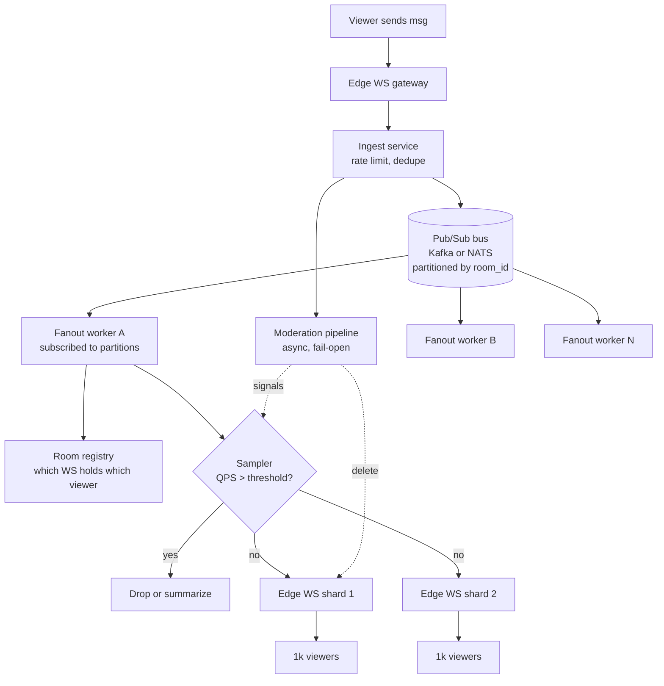
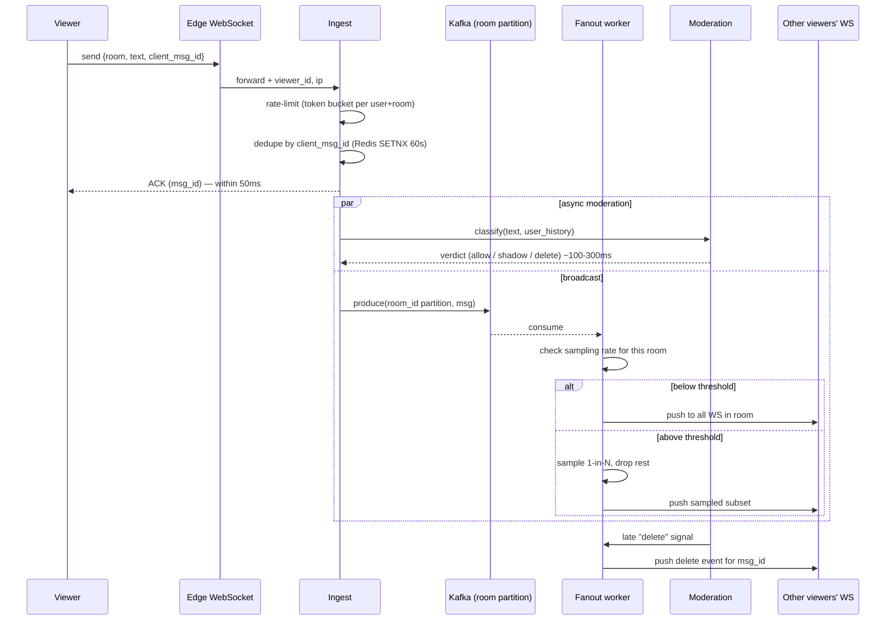
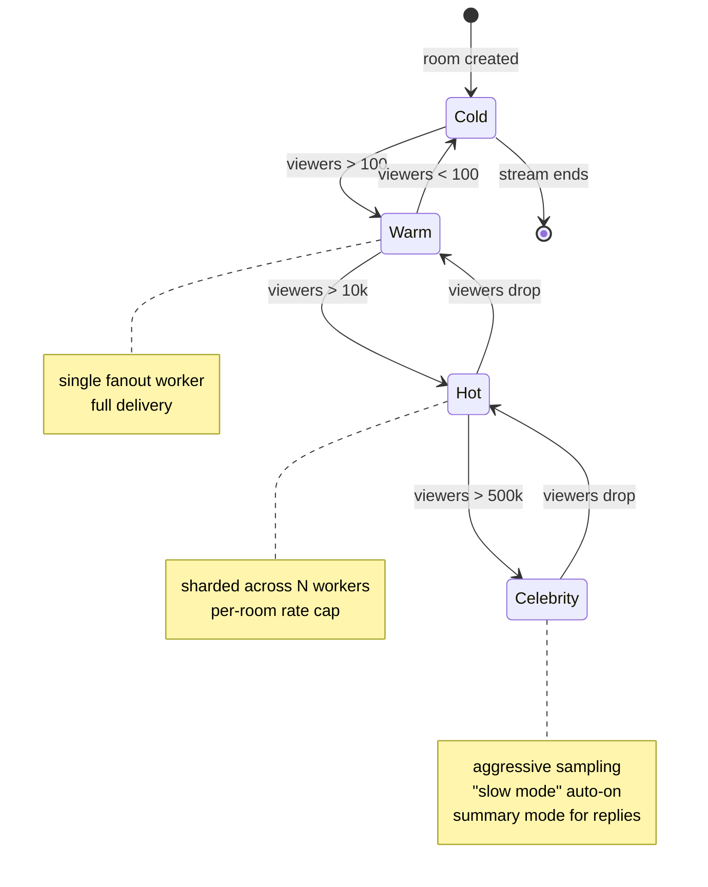
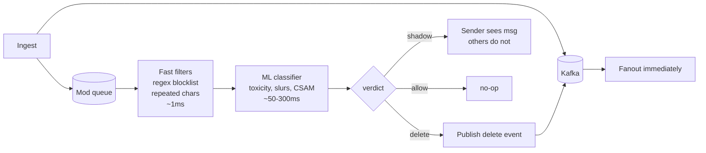

# Live Comments / Livestream Chat

## Why This Exists

**Problem.** A livestream chat looks trivial — users post short text messages, everyone in the room sees them. The trap: the room is not 50 people. It's a Ninja Fortnite stream with **635k concurrent viewers**, a Kpop concert with **2M**, or a Super Bowl halftime livestream pushing **40M**. Every message any viewer sends must fan out to every other viewer in roughly the same room within ~1–2 seconds, while a moderation pipeline filters slurs, spam, and CSAM in-band, and the system must degrade gracefully (sample, throttle, summarize) rather than fall over.

**Key insight.** Livestream chat is **fanout-bounded, not ingress-bounded**. If 1M viewers each send 1 msg/min and you fanout to all 1M, you're emitting **1M × 1M / 60 ≈ 16.6B msg/sec** at the edge — physically impossible. Every production system (Twitch, YouTube, TikTok, Discord, Slack) solves this with the **same three levers**: (1) shard rooms across many servers and never let one room live on one box, (2) **sample / throttle visible messages** above a threshold (you literally drop chat on the floor on celebrity streams — the user never knows), and (3) keep the **moderation pipeline async and out of the hot path** so a slow classifier can't block delivery.

**Reach for this when** — designing livestream chat, live sports comments, Twitch-like overlays, TikTok Live, IG Live, YouTube Live, Discord stage channels, Twitter Spaces text, Clubhouse-like chat tracks, or any **broadcast-fanout** ephemeral message system where read:write ratio is N:1 and N can be millions.

**Don't reach for this when** — you need durable 1:1 messaging (use [../chat-system/](../chat-system/) — DMs, group chats, read receipts, message history), durable pub/sub between services (use Kafka topics directly), or low-fanout collaborative editing (CRDTs / OT, not chat). Livestream chat is **ephemeral, lossy, and broadcast-shaped** — different beast.

---

## Diagrams

### High-level fanout architecture



### Send-path sequence with backpressure



### Room sharding state diagram



---

## The Math (do this on the whiteboard first)

Always derive these numbers in the interview before drawing boxes:

```
Concurrent viewers (CCV):       V         e.g. 1,000,000
Senders (% who type):           s = 5%    typical 1–10%
Avg msgs/sender/min:            r = 2
Send QPS (ingress):             V*s*r/60  ≈ 1,667 msg/s
Fanout amplification:           V         each msg fanned to V viewers
Naive fanout QPS (egress):      V*V*s*r/60 ≈ 1.67B msg/s   <-- impossible
With sampling to 50 visible/s:  50 * V    = 50M msg/s      <-- still huge
With per-shard fanout (1k/shard, 1k shards): 50 * 1k * 1k = 50M msg/s
  spread across 1k shards = 50k msg/s per shard            <-- tractable
```

**Two non-negotiable conclusions** fall out of this math:

1. **You will sample.** Above ~100 visible msg/sec a human cannot read chat anyway — Twitch caps the *visible rate*, not the *send rate*. Beyond that, dropping messages is not a degradation, it's the design.
2. **You will shard rooms across many fanout servers.** A single celebrity room cannot live on one box. Twitch's IRC-derived chat backend ([Twitch engineering blog, 2016](https://blog.twitch.tv/en/2016/06/16/down-the-rabbit-hole-with-tmi-7e4ce7eecb33/)) splits a single room across many "edge" servers, each holding a subset of viewers, and uses a backbone to relay between edges.

---

## Core Designs and Trade-offs

There is no single right architecture. The right one depends on **fanout factor**, **delivery semantics needed**, and **whether you can drop**. Three canonical designs:

### Design A — Redis Pub/Sub (simplest, fine up to ~10k CCV/room)

```python
# producer (ingest service)
import redis, json, uuid, time

r = redis.Redis(host="redis-chat.prod", decode_responses=True)

def send_message(room_id: str, user_id: str, text: str, client_msg_id: str) -> dict:
    # 1) dedupe by client_msg_id (NX = only set if not exists)
    dedupe_key = f"dedupe:{user_id}:{client_msg_id}"
    if not r.set(dedupe_key, "1", nx=True, ex=60):
        return {"status": "dup", "msg_id": r.get(f"dedupe_msgid:{user_id}:{client_msg_id}")}

    # 2) rate limit: token bucket per (user, room) — 5 msg / 10s
    bucket = f"rl:{user_id}:{room_id}"
    cnt = r.incr(bucket)
    if cnt == 1:
        r.expire(bucket, 10)
    if cnt > 5:
        return {"status": "rate_limited"}

    msg_id = str(uuid.uuid7())  # time-ordered, helps clients dedupe
    msg = {"id": msg_id, "u": user_id, "t": text, "ts": time.time()}
    # 3) publish — Redis Pub/Sub is fire-and-forget (no persistence!)
    r.publish(f"room:{room_id}", json.dumps(msg))
    return {"status": "ok", "msg_id": msg_id}

# subscriber (fanout worker)
def fanout_worker():
    p = r.pubsub(ignore_subscribe_messages=True)
    p.psubscribe("room:*")
    for raw in p.listen():
        room = raw["channel"].split(":", 1)[1]
        msg = json.loads(raw["data"])
        # local registry: which WS connections are in this room on THIS box?
        for ws in local_room_index.get(room, []):
            try:
                ws.send_nowait(msg)  # never block fanout
            except QueueFull:
                metrics.inc("ws.dropped")
                # do NOT retry — better to drop than head-of-line block the room
```

**Sharp edges:** Redis Pub/Sub has **no replay, no consumer group semantics, no backpressure** — if a subscriber is slow, Redis will eventually drop it (`client-output-buffer-limit pubsub`). It's fine for ephemeral chat where dropping is acceptable, but **never** use it for anything that needs durability. ([Redis Pub/Sub docs](https://redis.io/docs/latest/develop/interact/pubsub/))

### Design B — Kafka with room-id partitioning (durable, replay, mid-scale)

```yaml
# kafka topic config — one topic for ALL rooms, partitioned by room_id
topic: live-chat
partitions: 1024            # bound by largest expected room count active simultaneously
replication-factor: 3
min.insync.replicas: 2
retention.ms: 3600000       # 1h — long enough for replay on reconnect, short enough to be cheap
compression.type: zstd
max.message.bytes: 4096     # chat messages are tiny; reject anything larger upstream
# producer side
acks: 1                     # NOT all — for chat, leader-only is fine, latency matters
linger.ms: 5                # micro-batch
batch.size: 65536
```

```go
// fanout worker, Go — consumes a slice of partitions
func (w *Worker) Run(ctx context.Context) error {
    for {
        msgs, err := w.consumer.FetchMessages(ctx, 100)
        if err != nil { return err }
        for _, m := range msgs {
            roomID := string(m.Key)
            // local index of viewers connected to THIS fanout box for THIS room
            // (room registry tells edge gateway which fanout box owns which room slice)
            conns := w.registry.LocalConns(roomID)
            if w.shouldSample(roomID, len(conns)) {
                continue // dropped by sampler — see below
            }
            for _, c := range conns {
                select {
                case c.outbound <- m.Value:
                default:
                    // outbound buffer full — slow client. Drop, don't block.
                    metrics.SlowClient.Inc()
                }
            }
        }
        w.consumer.CommitMessages(ctx, msgs...)
    }
}
```

**Why Kafka for chat at all?** Two reasons: (1) **moderation replay** — when a slur classifier improves, you can replay the last hour and retroactively delete; (2) **fanout worker recovery** — a worker that crashes can resume from offset, viewers reconnecting can request "messages since msg_id" and you serve them from Kafka rather than a separate store. The Kafka log *is* the recent message store. ([Kafka: a Distributed Messaging System for Log Processing — Kreps et al., LinkedIn](https://notes.stephenholiday.com/Kafka.pdf))

**Trap:** a single Kafka partition is single-consumer within a group. If your celebrity room's `room_id` hashes to one partition and that partition's leader is on one broker, you've reintroduced the hot-spot problem. Mitigations: (a) **sub-partition celebrity rooms** by `(room_id, shard_n)` for the top 0.1% of rooms, (b) use a separate Kafka cluster for "hot" rooms, (c) move celebrity rooms to a different system entirely (next design).

### Design C — Tree-fanout / IRC-style edge mesh (Twitch, mass scale)

For rooms with hundreds of thousands to millions of viewers, neither Redis nor Kafka can fan out fast enough on its own. The pattern Twitch uses (TMI — Twitch Messaging Interface) and similar to Discord's Elixir-based fanout: **edge servers form a tree or mesh per room, and each edge holds ~1k–10k viewer connections**.

```
                       ingest
                          |
                  ┌───────┴───────┐
                room-router (consistent hash on room_id)
                  │
            ┌─────┴─────┐
         backbone-1  backbone-2     ... per-room "spine"
          /  |  \      /  |  \
        edge edge edge edge edge edge   ... ~1k viewers each
        |    |    |    |    |    |
       WS   WS   WS   WS   WS   WS

For a 1M-viewer room: 1000 edges × 1000 viewers = 1M
Each edge receives the message ONCE from the backbone, fans out 1000× locally.
```

A celebrity message at 100 msg/s × 1000 edges = 100k pkt/s on the backbone, **not** 100M. The fanout amplification happens at the edge in the kernel TCP stack, not over the network between services.

**This is the only design that works at "Super Bowl halftime + Coachella + Champions League final" scale.** It's also the most operationally complex — you're running your own pub/sub overlay network. Don't reach for it unless the scale truly demands it; in interviews mention it as the answer to "what if 10M viewers".

---

## Sampling, Throttling, and "Slow Mode"

Above ~50–100 visible msg/sec, no human can read chat. Every major platform throttles:

| Mechanism | Trigger | Effect |
|---|---|---|
| **Slow mode** (Twitch) | Mod-enabled or auto on hot rooms | Each user can send at most 1 msg / N seconds (3, 10, 30, 120) |
| **Followers-only** / **Subs-only** | Anti-spam during raids | Drops sender pool to a fraction |
| **Reservoir sampling** at fanout | room QPS > threshold | Only K msg/sec are broadcast; others silently dropped |
| **Hash-bucket sampling** | room QPS > threshold | Each viewer sees a deterministic 1/N subset (so they see *some* coherent thread) |
| **Top-K / "highlighted" mode** | room QPS very high | ML scores messages; only top-N by engagement shown |

```python
# token-bucket sampler — per room, in fanout worker
class RoomSampler:
    def __init__(self, max_visible_qps: int = 50):
        self.max = max_visible_qps
        self.tokens = max_visible_qps
        self.last_refill = time.monotonic()

    def allow(self) -> bool:
        now = time.monotonic()
        elapsed = now - self.last_refill
        self.tokens = min(self.max, self.tokens + elapsed * self.max)
        self.last_refill = now
        if self.tokens >= 1:
            self.tokens -= 1
            return True
        return False  # drop — viewer never sees this msg, AND THAT IS FINE
```

**Crucial design decision:** sampling is **per room at fanout**, not per sender at ingress. You still want to *accept* and *moderate* and *log* every message (for analytics, rewards, ban evidence) — you just don't broadcast all of them. This is invisible to the user posting the message; they see their own message via local echo.

---

## Moderation Pipeline

Moderation is the part juniors get wrong in interviews. It must be **async and fail-open**, not synchronous and fail-closed, otherwise a 200ms classifier latency adds 200ms to chat delivery for every message.



**Tiers, in order:**

1. **Blocklist regex / hashed slur list** — sub-millisecond, runs inline at ingest, drops obvious garbage before it ever hits the bus. ~1% of traffic.
2. **Per-user reputation / shadow-ban check** — Redis lookup, ~1ms. Shadow-banned users see their own messages but no one else does.
3. **Async ML classification** — 50–300ms. Runs out of band. If verdict is "delete", publishes a `{type: delete, msg_id: X}` event on the same bus, fanout workers forward it, clients remove the message from their UI. Users see the slur for ~300ms, then it disappears. This is **acceptable** and is how every production chat works — the alternative (block all messages on the slowest classifier) ruins the product.
4. **Human moderation** — async, hours-to-minutes latency, drives bans and training data.
5. **Replay-based retro-moderation** — when a classifier improves, replay last hour from Kafka, emit `delete` events for newly-flagged messages.

YouTube's [Trust & Safety post on live chat moderation](https://blog.youtube/inside-youtube/inside-responsibility-whats-next-on-our-misinfo-efforts/) and Twitch's [AutoMod overview](https://safety.twitch.tv/s/article/Product-AutoMod) both describe this multi-tier async approach.

---

## Reconnect, Replay, and Delivery Semantics

Livestream chat is **at-most-once for individual messages, eventually-consistent for the chat history on reconnect**. This is the right trade — guaranteeing exactly-once delivery to 1M viewers is wildly expensive and the user does not care about a missed "lol".

**On reconnect:** client sends `last_msg_id`. Edge gateway asks: is `last_msg_id` within Kafka retention (e.g. 1h)? If yes, replay from that offset (sampled — never replay 50k messages, give them last 200). If no, send "you missed too much, here's the live tail."

```python
def on_reconnect(viewer_id: str, room_id: str, last_msg_id: str | None) -> list[dict]:
    if last_msg_id is None:
        return tail(room_id, n=50)
    if not within_retention(last_msg_id):
        return tail(room_id, n=50)
    msgs = replay_from(room_id, last_msg_id, max_n=200)
    if len(msgs) == 200:
        # cap hit — they were gone too long; don't dump 10k messages on them
        msgs.append({"type": "system", "text": "...messages truncated..."})
    return msgs
```

**Idempotency on send:** the client supplies `client_msg_id` (UUID generated at compose time). Server dedupes against Redis SETNX with 60s TTL. If a sender's network blips and they retry, the second send is a no-op and returns the original `msg_id`. This is the same pattern as [Stripe's idempotency keys](https://stripe.com/docs/api/idempotent_requests).

---

## Trade-offs

| Benefit | Cost |
|---|---|
| Sampling above threshold makes mass scale tractable | Some users send messages that no one ever reads — must hide this UX-wise via local echo |
| Async moderation keeps p99 fanout < 1s | Slurs visible for 100–300ms before retro-delete; need monitoring on classifier latency |
| Kafka retention enables replay & retro-mod | Storage cost + careful PII / GDPR — tombstone semantics not free; don't retain forever |
| Tree-fanout edge mesh handles celebrity scale | High operational cost — you're running an overlay network; only Twitch/YouTube/TikTok-tier teams should attempt |
| Redis Pub/Sub is dirt simple, ~1ms latency | No durability, no replay, slow consumers get dropped — fine for ephemeral chat ONLY |
| Per-room shard with consistent hash isolates hot rooms | Re-sharding a celebrity room mid-stream is painful; pre-warm by viewer count thresholds |
| Fail-open moderation keeps chat fast | Adversarial users exploit the gap — counter with rep system + rate limiting + shadow ban |
| Ephemeral / lossy by design | Cannot use for compliance-critical conversations (legal, medical, financial advice contexts) |

---

## Common Pitfalls

- **Synchronous moderation in the hot path.** A 200ms toxicity classifier adds 200ms to every message. Do it async, fail-open, retro-delete.
- **One Kafka partition per room.** A celebrity room hashes to one partition, one broker, one disk. You melt that broker. Sub-partition the top-N rooms or move them to a separate cluster.
- **Redis Pub/Sub for "important" messages.** Pub/Sub has no durability. If a subscriber lags past `client-output-buffer-limit`, Redis drops it silently. Use Streams or Kafka if you can't lose data.
- **Forgetting fanout amplification math.** Junior designs say "we put it on Kafka" without realizing 1M viewers × 100 msg/s = 100M egress msg/s, which Kafka can't egress to 1M consumers as one consumer group anyway. Fanout happens at the *edge*, not the bus.
- **Not sampling.** Some interviewers will push back: "but I want all messages delivered." Push back harder: a human cannot read 500 msg/s. Twitch, YouTube, TikTok all sample. Show them the math.
- **Replaying 50,000 messages on reconnect.** A user reconnects after a 30-min DC during a celebrity stream. Don't dump 50k messages. Cap at 200 with a "truncated" marker.
- **WebSocket connection storm on stream start.** A scheduled celebrity stream draws 500k connections in 30 seconds. Use jittered reconnects on the client, accept-queue tuning on the LB, and DNS round-robin or anycast across many edge IPs. ([CloudFlare on the thundering herd of WebSockets](https://blog.cloudflare.com/the-thundering-herd-of-websockets/))
- **Backpressure that blocks.** A slow client must not block the fanout worker. Bounded outbound queue per WS connection; on overflow, drop and increment `ws.dropped` metric. Never `block`/`await` on a slow client in fanout.
- **Storing chat in a primary OLTP DB.** Live chat at scale will saturate any OLTP DB you point it at. Use append-only logs (Kafka) for recent + a cold store (S3/HDFS) for archive. Don't write every message to Postgres.
- **PII / right-to-be-forgotten.** GDPR requires deleting a user's messages on request. Tombstones in Kafka topics + an external "deletion log" your consumers honor. Plan it day one.
- **Treating banned-user check as a database call per message.** Use a Bloom filter or in-memory per-room ban set updated via the bus.
- **Letting one bot saturate ingress.** Per-user token-bucket rate limiting before you even hit Kafka. Spam waves at celebrity events are 80% bots.
- **No load-shedding plan.** When you're at 110% of capacity, you reject new connections at the LB layer (with a "try again in 30s" event), you don't accept and crash. ([SRE Workbook ch. 22 — Managing Load](https://sre.google/workbook/managing-load/))

---

## Decision Table

| If you need… | Use | Not |
|---|---|---|
| Ephemeral chat, ≤10k CCV/room, no replay | **Redis Pub/Sub** | Kafka (operational overkill) |
| Ephemeral chat, 10k–500k CCV/room, replay on reconnect, retro-moderation | **Kafka partitioned by room_id, sub-partition for hot rooms** | Redis Pub/Sub (no replay), RabbitMQ (fanout tops out) |
| Mass scale ≥ 500k CCV/room, celebrity events | **Tree-fanout edge mesh + Kafka backbone** (Twitch TMI / Discord-style) | Naive fanout from a single broker — math doesn't work |
| Durable 1:1 messaging with read receipts, edits, history | **DM / chat-system design** (see [../chat-system/](../chat-system/)) | Pub/sub broadcast pattern |
| In-broker pub/sub between services (not user-facing) | **Kafka or NATS JetStream** | Redis Pub/Sub for anything important |
| Lossless guaranteed delivery to every viewer | **Don't.** This product cannot exist at scale. Negotiate the requirement | Trying to make broadcast at-least-once to 1M consumers — it's economically irrational |
| Text + emotes + emoji + slow-mode + sub-only | **Kafka + per-room policy engine + sampler** | Hardcoded rules in fanout worker (need hot config reload) |
| Strong moderation, gov / kids product | **Sync pre-mod for high-risk classifier tier; queued release** | Async-only fanout (you ship slurs for 300ms) |
| Replay last hour of chat to viewers who joined late | **Kafka retention + tail API + capped replay** | DB scan, S3 lookup (latency too high) |
| Cross-region viewers with low latency | **Per-region edge mesh + cross-region Kafka MirrorMaker for moderation events** | Single global cluster (light-speed RTT kills it) |

---

## References

- **Twitch Engineering — Down the Rabbit Hole with TMI** — describes the IRC-derived chat backbone, edge servers, and fanout topology — https://blog.twitch.tv/en/2016/06/16/down-the-rabbit-hole-with-tmi-7e4ce7eecb33/
- **Twitch Engineering — How Twitch Built a Massive Live Streaming Platform** — capacity engineering and scale numbers — https://blog.twitch.tv/en/tags/engineering/
- **YouTube — Inside YouTube on Live Chat & Moderation** — multi-tier moderation pipeline — https://blog.youtube/inside-youtube/
- **Discord Engineering — How Discord Stores Billions of Messages** — partitioning, hot shards, lessons applicable to fanout — https://discord.com/blog/how-discord-stores-billions-of-messages
- **Discord Engineering — How Discord Handles Two and a Half Million Concurrent Voice Users using WebRTC** — fanout / Elixir process model — https://discord.com/blog/how-discord-handles-two-and-half-million-concurrent-voice-users-using-webrtc
- **Slack Engineering — Real-Time Messaging Architecture** — WebSocket gateways, presence, fanout patterns — https://slack.engineering/
- **Kreps, Narkhede, Rao — Kafka: a Distributed Messaging System for Log Processing** (LinkedIn / NetDB 2011) — https://notes.stephenholiday.com/Kafka.pdf
- **Redis — Pub/Sub documentation** — explicit "messages may be lost" semantics — https://redis.io/docs/latest/develop/interact/pubsub/
- **NATS — JetStream and core Pub/Sub** — alternate broker model with built-in fanout — https://docs.nats.io/
- **Cloudflare Blog — The Thundering Herd of WebSockets** — connection storms on stream start — https://blog.cloudflare.com/
- **DDIA (Kleppmann)** — ch. 11 "Stream Processing" (log-based vs. AMQP-style messaging), ch. 6 "Partitioning" (hot keys / skewed workloads) — Designing Data-Intensive Applications, O'Reilly 2017
- **Site Reliability Engineering Workbook — ch. 22 Managing Load** — load shedding and degradation — https://sre.google/workbook/managing-load/
- **Site Reliability Engineering — ch. 21 Handling Overload** — https://sre.google/sre-book/handling-overload/
- **AWS Builders' Library — Caching Challenges and Strategies** — applicable to per-room metadata caches — https://aws.amazon.com/builders-library/caching-challenges-and-strategies/
- **AWS Builders' Library — Using Load Shedding to Avoid Overload** — https://aws.amazon.com/builders-library/using-load-shedding-to-avoid-overload/
- **Stripe — Designing Robust and Predictable APIs with Idempotency** — client_msg_id pattern — https://stripe.com/blog/idempotency
- **Twitch Safety — AutoMod product overview** — async ML moderation tiering — https://safety.twitch.tv/s/article/Product-AutoMod
- **System Design Interview vol. 2 (Alex Xu / Sahn Lam)** — "Design a Notification System" and "Design a Real-Time Gaming Leaderboard" chapters share fanout patterns
- **Pat Helland — Life Beyond Distributed Transactions** — at-most-once vs at-least-once semantic trade-offs — https://queue.acm.org/detail.cfm?id=3025012

---

## See Also

- [../chat-system/](../chat-system/) — durable 1:1 / group DM (different problem: persistence, read receipts, edits)
- [../notification-system/](../notification-system/) — push notification fanout (different shape: out-of-band, mobile-first)
- [../newsfeed/](../newsfeed/) — pull vs. push fanout for follower graphs (related fanout math)
- [../rate-limiter/](../rate-limiter/) — token bucket internals used in ingest path
- [../../communication/websockets/](../../communication/websockets/) — edge connection management, sticky-routing, reconnect
- [../../communication/kafka-patterns/](../../communication/kafka-patterns/) — partition design, retention, MirrorMaker
- [../../communication/pub-sub/](../../communication/pub-sub/) — generic fanout patterns at the broker layer
- [../../reliability/load-shedding/](../../reliability/load-shedding/) — graceful degradation at capacity
- [../../communication/backpressure/](../../communication/backpressure/) — bounded queues, drop policy, slow consumers
- [../../data-systems/key-value/](../../data-systems/key-value/) — SETNX, token bucket, dedupe TTL
- [../../data-systems/bloom-filter/](../../data-systems/bloom-filter/) — banned-user / per-room ban-set Bloom that replaces a per-message DB call
