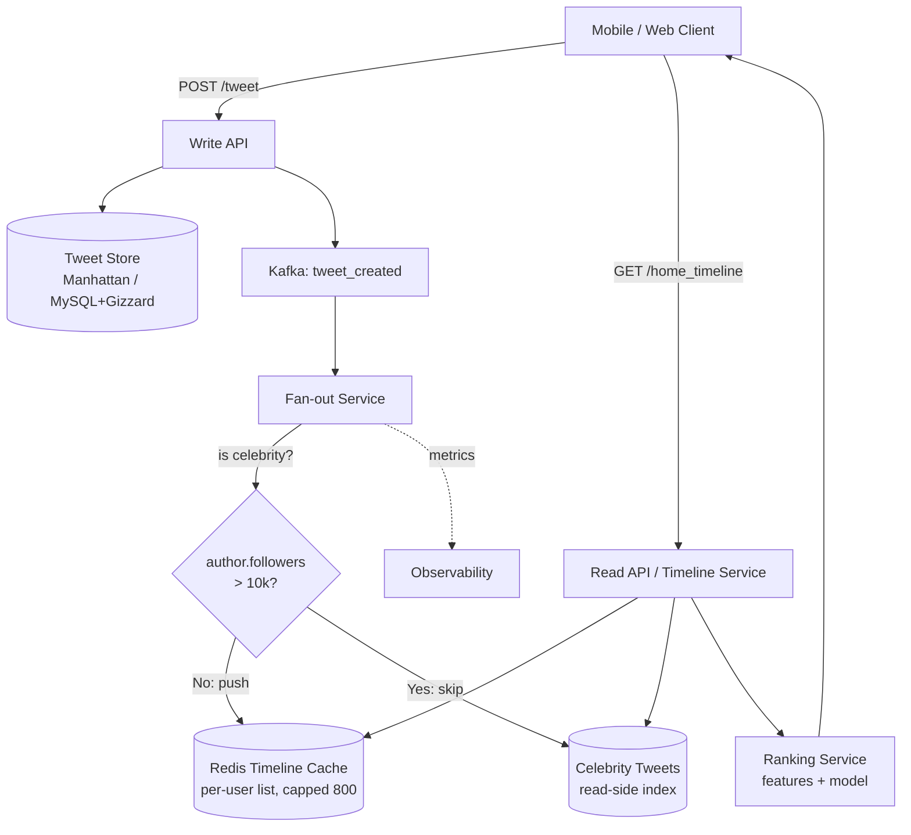
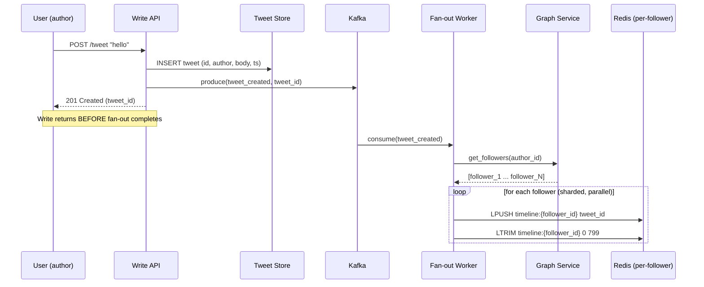
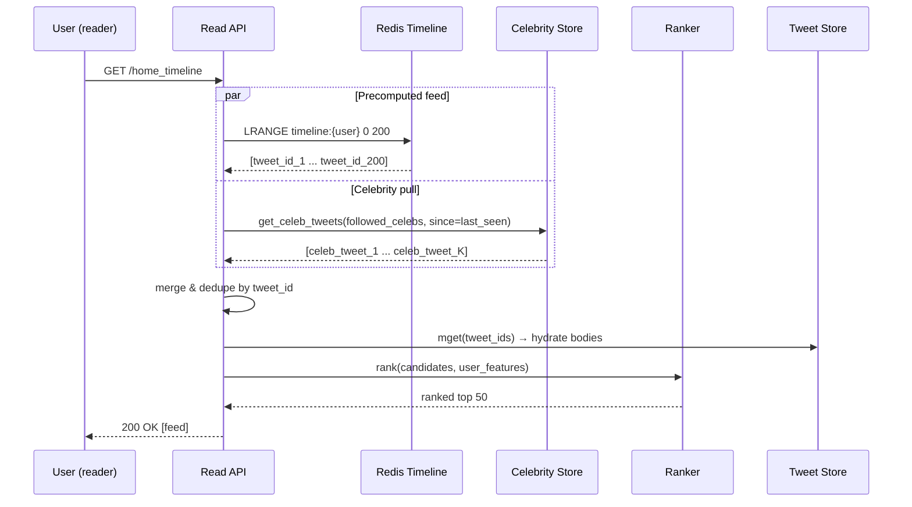

# Newsfeed (Twitter / Facebook)

## Why This Exists

**Problem.** A social product has N users (10M–500M+ DAU). Each user follows F others (median ~200, p99 ~5,000, max ~100M for Cristiano Ronaldo). Each posts P items/day (median ~0, p99 ~10). When user U opens the app, they expect their home timeline within ~200ms p99, sorted by some mix of recency and engagement, with infinite scroll. **The naive query — "SELECT posts WHERE author IN (followees) ORDER BY created_at DESC LIMIT 50" — does not survive contact with celebrities or fan-in skew.**

**Key insight.** You cannot pick one delivery model. You must **push** for normal users (so reads are O(1) Redis lookups) and **pull** for celebrities (so a single Justin Bieber tweet doesn't write 100M cache entries and saturate the fan-out fleet for hours). The whole architecture turns on this asymmetry. Twitter learned this the hard way and documented it in their "Real-Time Delivery Architecture at Twitter" and "The Infrastructure Behind Twitter" posts.

**Reach for this when:**
- The interviewer says "Twitter feed", "Facebook news feed", "Instagram home", "TikTok For You", "LinkedIn feed", or any home/timeline screen with follow semantics.
- Read traffic dwarfs write traffic by 100:1 or more (typical social ratio).
- You have a clear power-law distribution of fan-out (most users <1k followers, a tail of celebrities with 10M+).
- Latency budget for feed read is <200ms p99 and you cannot run a multi-table join at request time.

**Don't reach for this when:**
- It's a chronological-only feed with bounded fan-out (e.g. Slack DM list, GitHub notifications) — a simple paginated DB query suffices.
- It's a global feed (everyone sees the same posts, e.g. Hacker News, Reddit /r/all) — you precompute one ranked list, not N.
- It's a chat product — that's `messaging-system` (different consistency model: per-conversation ordering, read receipts, presence).
- The product hasn't launched yet and you're optimizing for 100 users — build the pull model and instrument it. Fan-out is premature until you have measured fan-in skew.

---

## Diagrams

### High-level architecture (hybrid push/pull)



### Write path: fan-out on write (push)



### Read path: hybrid merge



---

## The three delivery models

### Model 1: Fan-out on read (pull)

At write time, you do nothing special — just persist the tweet. At read time, for each followee, you fetch their recent tweets, merge-sort, and return the top N.

```python
# Pull model — naive but useful as a baseline
def get_home_timeline_pull(user_id: int, limit: int = 50) -> list[Tweet]:
    followees = graph.get_followees(user_id)  # could be 5,000+
    # Heap-merge K sorted streams
    streams = [tweet_store.get_user_tweets(f, limit=limit) for f in followees]
    return heapq.merge(*streams, key=lambda t: -t.created_at)[:limit]
```

**Why it's tempting:** writes are O(1), no cache to keep coherent, deletes/edits propagate instantly, follow/unfollow takes effect immediately.

**Why it dies under load:** if the median user follows 200 people and reads their feed 10× per session, you're doing 2,000 fan-in queries per session. At 100M DAU × 10 sessions × 2,000 = **2×10^12 queries/day** against the tweet store. The tweet store cannot serve that. You'd need an absurd number of read replicas, and tail latency would still be terrible because you wait for the slowest of 200 shards.

**Use it for:** the celebrity tail (where push is more expensive than pull) and as a fallback when the cache is cold.

### Model 2: Fan-out on write (push)

At write time, the author's followers are looked up and the tweet ID is appended to each follower's precomputed timeline (in Redis or similar). At read time, you do one Redis `LRANGE` and you're done.

```python
# Push model — what Twitter calls "Timeline Service"
def on_tweet_created(tweet: Tweet) -> None:
    followers = graph.get_followers(tweet.author_id)  # could be 100M for a celeb
    for shard in chunk(followers, size=1000):
        # Parallelize across fan-out workers
        for follower_id in shard:
            redis.lpush(f"timeline:{follower_id}", tweet.id)
            redis.ltrim(f"timeline:{follower_id}", 0, 799)  # keep last 800

def get_home_timeline_push(user_id: int, limit: int = 50) -> list[int]:
    return redis.lrange(f"timeline:{user_id}", 0, limit - 1)
```

**Why it works for ~99% of users:** reads are O(1). The cost is paid by the writer at write time, which is fine because writes are rare relative to reads (Twitter's read:write ratio is ~1000:1 across the system; the home-timeline read is even more skewed).

**Why pure push dies on celebrities:** when @taylorswift13 (95M followers) tweets, you need to write ~95M Redis entries. Even with a 10k-worker fan-out fleet doing 50k writes/sec each, that's **190 seconds of work** for one tweet — and during that window, half her followers see the tweet and half don't. Worse, if she tweets a thread of 5, you have 950M fan-out operations queued, and any unrelated user's tweet behind hers in the Kafka partition is delayed minutes. This is **the celebrity problem** and it is not a minor concern — it determined Twitter's entire architecture.

### Model 3: Hybrid (the answer)

Push for non-celebrities, pull for celebrities, merge at read time.

```python
CELEBRITY_THRESHOLD = 10_000  # followers; tune empirically

def on_tweet_created(tweet: Tweet) -> None:
    if graph.follower_count(tweet.author_id) >= CELEBRITY_THRESHOLD:
        # Don't fan out. Reader pulls from celeb_store on read.
        celeb_store.append(tweet.author_id, tweet)
        return
    # Normal user: push to followers' precomputed timelines
    followers = graph.get_followers(tweet.author_id)
    fanout_queue.enqueue_batches(tweet.id, followers, batch_size=1000)

def get_home_timeline(user_id: int, limit: int = 50) -> list[Tweet]:
    # 1. Precomputed feed from non-celebrity followees (push side)
    push_ids = redis.lrange(f"timeline:{user_id}", 0, 200)

    # 2. Celebrity followees the user follows — pull their recent tweets
    celebs_followed = graph.get_celeb_followees(user_id)  # cached, small set
    pull_tweets = celeb_store.get_recent(celebs_followed, since=last_visit(user_id))

    # 3. Merge, dedupe, hydrate, rank
    candidates = merge_dedupe(push_ids, [t.id for t in pull_tweets])
    tweets = tweet_store.mget(candidates)
    return ranker.rank(tweets, user_id)[:limit]
```

This is **fan-out on write for the body, fan-out on read for the head** of the power-law distribution. Twitter's "Real-Time Delivery Architecture" post describes exactly this split (they refer to the in-memory timeline as the "redis timeline cache").

**Threshold tuning.** The break-even point depends on read frequency vs follower count. Roughly: push is cheaper when `followers × push_cost < reads_per_window × pull_cost_per_celeb`. In practice teams pick a threshold (1k–100k followers) and adjust based on Redis memory and fan-out latency SLOs. Some systems make the threshold per-user (a celebrity who tweets every minute is more expensive to push than one who tweets weekly).

---

## Storage layout

### Tweet store (source of truth)

```sql
-- Sharded by tweet_id (snowflake: 41-bit timestamp + 10-bit machine + 12-bit seq)
-- This means range scans by time on a user's tweets are localized to recent shards.
CREATE TABLE tweets (
  id              BIGINT PRIMARY KEY,    -- snowflake; sortable by time
  author_id       BIGINT NOT NULL,
  body            VARBINARY(280) NOT NULL,
  reply_to_id     BIGINT,
  created_at      BIGINT NOT NULL,        -- ms epoch; redundant with snowflake but indexed
  is_deleted      TINYINT DEFAULT 0
) PARTITION BY HASH(id);

CREATE INDEX idx_author_time ON tweets(author_id, created_at DESC);
```

Twitter built **Manhattan** for this (a multi-tenant, eventually-consistent KV store) and earlier used **Gizzard**-sharded MySQL with **Snowflake** IDs. The snowflake ID is load-bearing: it lets you derive timestamps from IDs (no separate lookup) and gives you globally-sortable keys with no coordination.

### Timeline cache (Redis)

```
KEY:   timeline:{user_id}
TYPE:  LIST of tweet_id (8 bytes each)
SIZE:  capped at 800 entries (≈6.4 KB per user)
TTL:   30 days, refreshed on read
```

Capping is essential: at 100M active users × 800 entries × 8 bytes = ~640 GB just for IDs. Real entries carry more metadata (timestamp, author hint) — budget for 10–50 KB per user. Use Redis Cluster sharded by `user_id` with replication factor 2.

**Why a list of IDs and not full tweets?** Hydration is cheap (one mget to the tweet store, which is itself heavily cached). Storing bodies in every follower's timeline would 100×–1000× the memory footprint and make deletes/edits a nightmare.

### Graph service

`get_followers(user_id)` and `get_followees(user_id)` must be fast. Twitter built **FlockDB** for this, then evolved it. Facebook uses **TAO**. The core requirements:
- Cached follower list per user (heavy hitters in memory, others in a sharded KV).
- Reverse index (`followees`) for the read path's celebrity merge.
- Celebrity flag pre-computed and refreshed nightly (cheap to denormalize).

---

## Ranking

A pure chronological feed is what you ship in week one of the interview. A real product ranks. Modern ranking is a **two-stage funnel**:

```python
def rank(candidates: list[Tweet], user_id: int) -> list[Tweet]:
    # Stage 1: candidate generation already happened (push + pull merge gave us ~500 tweets)

    # Stage 2: lightweight ranker — narrow 500 → ~150
    # Linear model on cheap features: recency decay, author affinity, prior CTR.
    light_scored = [(t, light_score(t, user_id)) for t in candidates]
    top150 = heapq.nlargest(150, light_scored, key=lambda x: x[1])

    # Stage 3: heavy ranker — DNN or GBDT on rich features
    # Features: user×author embedding similarity, tweet text/image embedding,
    # historical engagement on similar content, time of day, device, etc.
    features = feature_store.get_batch(user_id, [t.id for t, _ in top150])
    heavy_scored = ranking_model.predict(features)  # batch GPU inference

    # Stage 4: business rules
    #   - dedupe near-duplicates (same article shared 5x)
    #   - inject ads at fixed positions (every 6th slot)
    #   - demote/boost based on safety classifiers
    #   - diversity constraint (no more than 3 tweets from same author in top 20)
    return apply_business_rules(heavy_scored)
```

**Recency decay** is universal: `score *= exp(-age_hours / half_life)` where half-life is hours-to-days. **Engagement signals** are click-through rate, dwell time, like, reply, retweet, quote, mute, block, "see fewer like this". The challenge with engagement signals is the **feedback loop** — if you only show high-engagement content, you starve new content of impressions and the model can't learn whether it would have engaged users.

**Cold start.** New users have no signal. Strategies:
- **Onboarding follows:** ask new users to pick interests / follow suggested accounts so push has something to deliver.
- **Popularity-based fallback:** show globally trending content for the user's region/language until N engagement events accumulate.
- **Item cold start (new tweet):** can't use historical CTR. Use content embeddings (text, image) and exploration budget (epsilon-greedy: 5% of slots go to under-explored items).

---

## The celebrity problem (deep dive)

This is the single most-asked follow-up in Twitter newsfeed interviews. Be ready.

### The pathology

Imagine three pure-push scenarios:
1. **Burst write amplification.** @Cristiano (640M followers) tweets. Pure push = 640M Redis ops. At 100k ops/sec/worker, you need 6,400 worker-seconds. Even with 1,000 workers in parallel, that's ~6 seconds of wall clock — **per tweet**. Fans see the tweet inconsistently across that window.
2. **Head-of-line blocking.** The fan-out queue is partitioned by author. All of Cristiano's tweets sit in one Kafka partition. While his thread of 10 tweets fans out, the next normal user behind him in that partition waits.
3. **Reciprocal celebrities.** If you push, then when @elonmusk replies to @taylorswift, both their follower sets get fan-out — 100M+ writes for a single reply. Reply-storms become DoS vectors.

### The fix: pull for celebrities

```python
def is_celebrity(user_id: int) -> bool:
    # Hot path: use a Bloom filter or small in-memory set of celebrity user_ids,
    # refreshed every few minutes. Avoids hitting graph service on every write.
    return celebrity_set.contains(user_id)

def on_tweet_created(tweet: Tweet) -> None:
    if is_celebrity(tweet.author_id):
        # Just append to the celeb's own tweet list. Readers will pull on demand.
        return
    enqueue_fanout(tweet)
```

On read, the user's home timeline service computes:
1. The list of celebrities the user follows (small set — most users follow <50 celebrities; cached per user).
2. Recent tweets from each celebrity (cached per celebrity — one cache entry per celebrity, not per follower).
3. Merge with the user's push timeline.

The celebrity's recent-tweets cache is shared by all their followers, so you read it once per celebrity per read-burst (use request coalescing / single-flight). This turns N×M (celebs × followers) writes into M (followers) reads against ~N small caches.

### Edge cases that bite

- **The crossover user** — someone with exactly 9,999 followers gets pushed; they hit 10,001 followers, get reclassified as celebrity. Their tweet posted 1 second after reclassification skips fan-out, but their tweet 1 second before is still being fanned out. Without care, followers see a gap. **Fix:** dual-write during reclassification windows; or only flip celebrity status nightly with a stable cutoff.
- **The new follow** — Alice follows Bob (a normal user). Bob's old tweets are not in Alice's push timeline. Either backfill (push Bob's last 50 tweets to Alice on follow), or rely on pull-on-read for the first read after a follow. Twitter does the former with an explicit backfill job.
- **Mute/block/unfollow** — these need to filter the push timeline at read time. Either store filter lists in Redis adjacent to the timeline, or apply at the ranker stage.
- **Deletes/edits** — when a tweet is deleted, you do *not* try to scrub it from 100M Redis lists. You mark it deleted in the tweet store and filter at read-time hydration. The cost is a small read overhead; the alternative is a deletion fan-out as expensive as the original.

---

## Multi-region

Social products are global. Two patterns dominate:

### Active-active with regional ownership

Each region (US-EAST, EU-WEST, AP-SOUTH) owns the writes for its region's users. Cross-region reads go to the home region or a stale local replica.

- **Tweet store:** sharded by snowflake ID; primary in author's home region, async replication to other regions for reads.
- **Timeline cache:** local to each region. The fan-out service in region R must, when fanning out a tweet, write to **every region's** Redis timeline for that follower's home region. This usually means: produce one Kafka event per follower-region, regional fan-out workers consume their slice.
- **Graph service:** replicated everywhere; writes go to home region, local async replicas serve reads.

### Failure modes

- **Cross-region replication lag** — a US user posts; an EU follower reads ~200ms later, before the tweet has propagated. Fix with regional read-after-write tracking (sticky to home region for N seconds after a write) or just accept the small lag (most users won't notice).
- **Region failover** — when EU goes down, EU users' reads route to US. The US Redis cluster doesn't have their precomputed timelines. Either keep cold replicas of timelines in standby regions (expensive) or accept temporary degradation to pull-mode for failed-over users.

DDIA ch. 5 (Replication) and ch. 9 (Consistency and Consensus) cover the trade-offs in depth.

---

## Trade-offs

| Benefit | Cost |
|---|---|
| Push gives O(1) reads — feed loads in 10ms | Write amplification — one tweet = N Redis writes |
| Pull gives O(1) writes — no fan-out infra | Read amplification — feed assembly is K-way merge over followee shards |
| Hybrid balances both | Two code paths to maintain; threshold tuning is empirical |
| Redis precomputed timelines = sub-100ms p99 | Memory cost: ~10–50 KB × DAU × replicas |
| Capping timeline length (e.g. 800) bounds memory | Heavy users hit the cap; need fallback to historical scan for "deep" scrolls |
| Snowflake IDs sortable by time | Couples ID generation to clock — clock skew causes ordering anomalies |
| Async fan-out doesn't block writes | Some followers see the tweet before others — eventual consistency on the timeline |
| Celebrity pull avoids write storms | Read path complexity; merge dedup logic; per-celeb cache hot keys |
| Two-stage ranker (light → heavy) keeps p99 down | More moving parts; offline/online feature skew is a real problem |
| Multi-region active-active = low latency globally | Cross-region replication lag, per-region cache warming, region failover gaps |

---

## Common Pitfalls

- **Pure push, no celebrity logic.** Works fine in week one with 10k users. Then a B-list influencer joins and your fan-out queue is permanently 6 hours behind. Build the celebrity branch from day one, even if the threshold is "infinity" initially.
- **Storing tweet bodies in every timeline cache entry.** Multiplies memory by 50×. Store IDs, hydrate at read time. The hydration step is cheap because the tweet store is sharded by ID and heavily cached.
- **Forgetting to cap timeline length.** Without `LTRIM`, a user who follows 5,000 active accounts grows to GB-scale Redis entries. Pick a cap (300–800) and a fallback for deeper scrolls (paginate against the tweet store directly, scoped to followees).
- **Synchronous fan-out.** If your write API blocks until fan-out completes, your write latency is now O(followers). Always async via a queue. The user got `201 Created` when the tweet hit durable storage; followers see it eventually.
- **Treating follow as instantaneous.** When Alice follows Bob, her timeline lacks Bob's history. If you don't backfill, the product feels broken. Either backfill last 50 tweets synchronously on follow, or do a pull-on-read merge for the first read after follow.
- **Not deduplicating on read.** Bob retweets Carol; Carol's tweet is already in your push timeline; Bob's retweet brings it again; pull merge from a celebrity Carol follows brings it a third time. Dedupe by tweet ID after merge.
- **Hot keys in celebrity cache.** When @taylorswift tweets, all 95M followers may try to read her recent-tweets cache in the next 60 seconds. Use request coalescing / single-flight per host, multiple cache replicas, and possibly client-side caching with short TTLs.
- **Ignoring the deletion path.** Building delete fan-out as a mirror of write fan-out doubles your write load. Mark deleted, filter on hydration, and let TTLs clean up the timeline cache lazily.
- **Ranking offline ≠ ranking online.** Your offline AUC is great; online metrics drop. Cause: feature skew (training features computed differently from serving features), or you trained on logged-policy data without correction (you're optimizing for what you already showed). Use a feature store with consistent computation and exploration budget for off-policy correction.
- **Underestimating cold start.** A new user lands on an empty feed and bounces. Have a strong popularity-based fallback (regional/language-trending) for accounts with <N engagement events.
- **Forgetting safety/integrity.** Spam, harassment, CSAM, election interference. The ranker is also where you demote/remove content. Skipping this in the design = product can't ship.
- **Snowflake ID clock drift.** If a server's clock jumps backward, snowflake IDs collide or sort incorrectly. Use NTP with strict bounds and refuse to issue IDs when the clock is out of sync (Twitter's snowflake does this).

---

## Decision Table

| If... | Then use... | Why |
|---|---|---|
| Users have bounded fan-out (<1k followers, no celebrities) | **Pure push (fan-out on write)** | Reads are O(1); write cost is bounded; no merge complexity |
| Authors have unbounded fan-out (celebrities, public figures, brands with millions of followers) | **Hybrid: push for normal + pull for celebs** | Push for celebs causes write storms; pull is O(reads) which is bounded per-reader |
| Read:write ratio is low (e.g. ~1:1) | **Pull (fan-out on read)** | Push only pays off when reads >> writes |
| Followee graph is small per user (<100), tweets per author are sparse | **Pull is fine** | K-way merge over 100 sparse streams is manageable |
| Strict read-your-writes for the author's own tweet on their own home timeline | Special-case: insert into own timeline synchronously on write | Async fan-out is fine for *followers'* timelines but the author expects to see their own tweet immediately |
| Feed is global (everyone sees the same thing — Hacker News, Reddit /r/popular) | **One precomputed ranked list, served from CDN/cache** | No per-user fan-out at all; fan-out is N=1 |
| Feed must be strictly chronological with no ranking | **Hybrid push/pull, skip ranker stage** | Same delivery, simpler read path |
| Feed needs ML ranking with sub-200ms p99 | **Hybrid + two-stage ranker (light → heavy)** | Heavy ranker on 500 candidates blows latency budget; light ranker narrows first |
| Multi-region, low latency required | **Regional Redis caches + per-region fan-out workers; tweet store async-replicated** | Cross-region writes on the read path are too slow |
| Users frequently change who they follow | Push + on-follow backfill (last 50 tweets) | Pure push without backfill = empty feed after follow churn |
| You're building MVP, no scale data yet | **Pull, instrument fan-in.** Build push later | Don't optimize for celebrities you don't have yet. Measure first. |

---

## References

- Twitter Engineering — *The Infrastructure Behind Twitter: Scale* — https://blog.twitter.com/engineering/en_us/topics/infrastructure/2017/the-infrastructure-behind-twitter-scale
- Twitter Engineering — *Timelines at Scale* (QCon talk by Raffi Krikorian, slides + video) — https://www.infoq.com/presentations/Twitter-Timeline-Scalability/
- Twitter Engineering — *Real-Time Delivery Architecture at Twitter* — https://www.infoq.com/presentations/Real-Time-Delivery-Twitter/
- Twitter Engineering — *Manhattan, our real-time, multi-tenant distributed database* — https://blog.twitter.com/engineering/en_us/a/2014/manhattan-our-real-time-multi-tenant-distributed-database-for-twitter-scale
- Twitter Engineering — *Announcing Snowflake* (distributed unique ID generation) — https://blog.twitter.com/engineering/en_us/a/2010/announcing-snowflake
- Facebook Engineering — *TAO: Facebook's Distributed Data Store for the Social Graph* (USENIX ATC 2013) — https://www.usenix.org/conference/atc13/technical-sessions/presentation/bronson
- Facebook Engineering — *Scaling Memcache at Facebook* (NSDI 2013) — https://www.usenix.org/conference/nsdi13/technical-sessions/presentation/nishtala
- Instagram Engineering — *Powering Instagram's Feed* — https://instagram-engineering.com/
- LinkedIn Engineering — *Feed Architecture at LinkedIn* — https://engineering.linkedin.com/blog/topic/feed
- Kleppmann, M. — *Designing Data-Intensive Applications* — ch. 5 (Replication), ch. 6 (Partitioning), ch. 11 (Stream Processing). The "Twitter timeline" case study lives in ch. 1, p. 11–12.
- Xu, A. — *System Design Interview, Vol. 1*, ch. 11 "Design a News Feed System". (Companion: vol. 2 ch. 4 "Distributed Message Queue" for the fan-out queue layer.)
- Beyer, B. et al. — *Site Reliability Engineering* — ch. 22 "Addressing Cascading Failures" (relevant to fan-out queue saturation) — https://sre.google/sre-book/addressing-cascading-failures/
- AWS Builders' Library — *Avoiding fallback in distributed systems* (informs the celeb-cache fallback design) — https://aws.amazon.com/builders-library/avoiding-fallback-in-distributed-systems/
- Pat Helland — *Life beyond Distributed Transactions: an Apostate's Opinion* (informs the eventual-consistency model on timelines) — https://queue.acm.org/detail.cfm?id=3025012
- Adrian Colyer — *the morning paper: TAO* — https://blog.acolyer.org/2015/03/02/tao-facebooks-distributed-data-store-for-the-social-graph/

---

## See Also

- `../url-shortener/` — covers snowflake-style ID generation in more depth.
- `../rate-limiter/` — protect the write API and the celebrity-cache read path from abuse.
- `../../data-systems/key-value/` — Redis Cluster sharding, hot key mitigation, capped lists with `LTRIM`.
- `../../data-systems/bloom-filter/` — celebrity-user Bloom on the hot path so non-celebrity writes skip the special branch entirely
- `../../data-systems/data-skew/` — celebrity fanout is point-skew; salting / isolated-replication patterns apply directly
