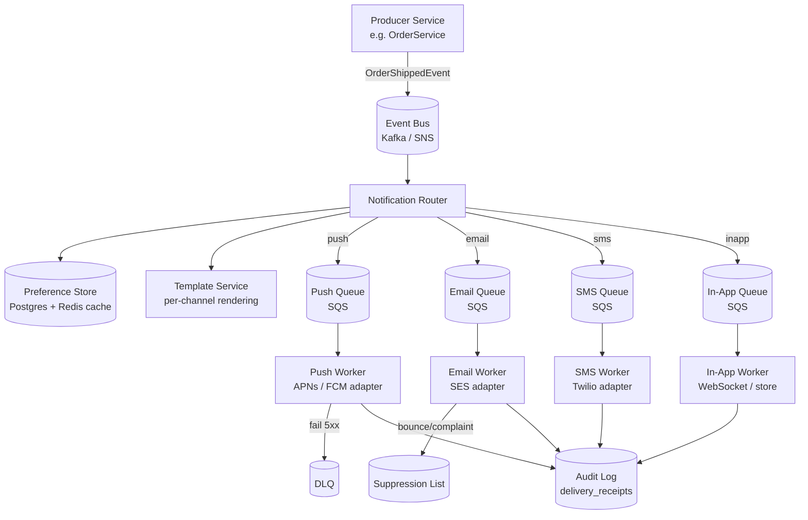
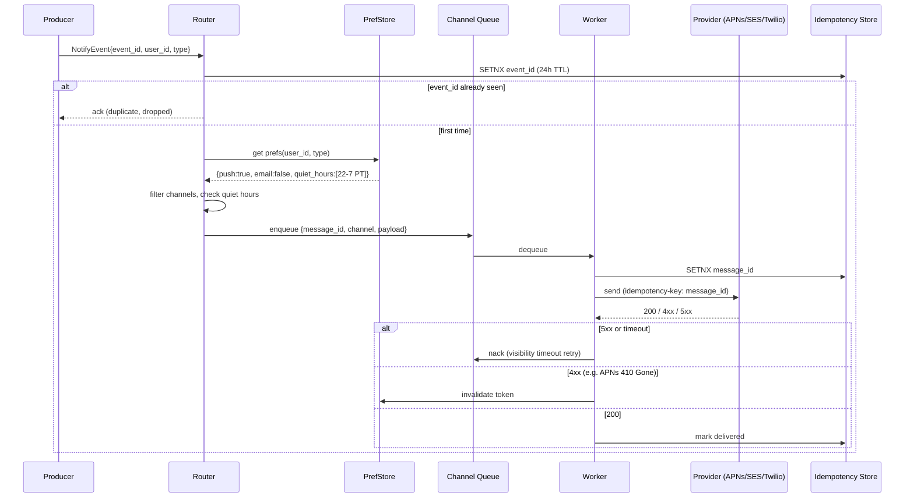

# Notification System

## Why This Exists

**Problem.** A naive notification service is "POST to FCM/APNs/Twilio/SES in a for-loop from the request handler." That works for 100 users and explodes at 10M: APNs token churn, SMS carrier rate limits, SES bounce thresholds, FCM batch quotas, retries that double-charge, and a 3 AM PagerDuty when the email queue backs up because Gmail throttled you. Worse, the **same logical event** (e.g. "order shipped") needs to go to push *and* email *and* in-app, each with different formatting, retry semantics, and failure modes — and the user might have muted email but not push, or set quiet hours from 22:00–07:00 in their local timezone.

**Key insight.** A notification system is not a "send" service — it's a **fan-out + per-channel-pipeline + idempotency** problem. The producing service publishes a logical event ("OrderShipped for user 42"); a routing layer expands it into channel-specific messages based on user preferences; each channel has its own queue, rate limiter, retry policy, and provider adapter. The router NEVER calls APNs/SES/Twilio directly — it always goes through a queue, because providers are an external dependency that *will* fail and you need backpressure plus replay.

**Reach for this when**
- You're designing a system-design interview answer for "design Twitter notifications", "design a Slack notification service", "design a Doordash order-status notifier".
- You need cross-channel delivery (push + email + SMS) with user-controlled preferences and quiet hours.
- You're hitting provider rate limits, dedupe bugs, or "user got 7 push notifications for one event."
- You need auditable delivery (compliance, GDPR DSAR, "did we send X to user Y at time Z?").

**Don't reach for this when**
- You only need transactional email for password reset → just call SES/SendGrid directly with an idempotency key. No queue, no preference store.
- You're sending in-app only (no external providers) → a pub/sub fan-out + WebSocket gateway is enough; this skill is overkill.
- You need real-time presence ("user is typing") → that's a presence/WebSocket problem, not a notification problem.
- You have <10K DAU and one channel — the queue + adapter + preference store overhead is wasted complexity.

## Diagrams

### High-level architecture



### Send-path sequence with idempotency



## Core Components

### 1. Event model — what producers publish

Producers publish **logical events**, not channel-specific messages. The router decides channels.

```python
# events.py
from dataclasses import dataclass
from datetime import datetime
from typing import Any
from uuid import UUID

@dataclass(frozen=True)
class NotificationEvent:
    event_id: UUID                  # idempotency key from producer; MUST be stable
    user_id: str                    # logical recipient
    event_type: str                 # "order.shipped", "auth.suspicious_login"
    occurred_at: datetime           # event time (NOT send time)
    severity: str                   # "transactional" | "promotional" | "critical"
    payload: dict[str, Any]         # template variables: {"order_id": "abc", "eta": "..."}
    locale_hint: str | None = None  # producer can override user's stored locale
```

**Why event_id matters.** If the producer retries (Kafka redelivery, network blip), the same event_id flows in. The router uses it as the idempotency key — without it, you get the "user received 4 copies of one shipment notification" bug that every notification system hits in its first month.

**Why severity matters.** Quiet hours and preference toggles apply to `promotional` and sometimes `transactional`, but `critical` (e.g. account compromise, 2FA codes) MUST bypass quiet hours and most preferences. Encode this at the event layer or you'll regret it.

### 2. Preference store

User preferences are read on every notification — make them fast (Redis cache in front of Postgres) and **versioned** (preferences change; in-flight messages should respect the version at enqueue time, not delivery time).

```sql
-- Postgres schema
CREATE TABLE user_channels (
    user_id       TEXT NOT NULL,
    channel       TEXT NOT NULL,         -- 'push' | 'email' | 'sms' | 'inapp'
    address       TEXT NOT NULL,         -- device_token | email | E.164 phone
    verified_at   TIMESTAMPTZ,           -- email/sms must be verified
    disabled_at   TIMESTAMPTZ,           -- soft delete; keeps audit trail
    PRIMARY KEY (user_id, channel, address)
);

CREATE TABLE notification_prefs (
    user_id        TEXT NOT NULL,
    event_type     TEXT NOT NULL,        -- 'order.shipped', '*' for default
    channel        TEXT NOT NULL,
    enabled        BOOLEAN NOT NULL DEFAULT TRUE,
    PRIMARY KEY (user_id, event_type, channel)
);

CREATE TABLE quiet_hours (
    user_id    TEXT PRIMARY KEY,
    timezone   TEXT NOT NULL,            -- IANA tz, e.g. 'America/Los_Angeles'
    start_min  SMALLINT NOT NULL,        -- minutes from midnight, local time
    end_min    SMALLINT NOT NULL
);

CREATE TABLE suppression_list (
    address       TEXT NOT NULL,
    channel       TEXT NOT NULL,
    reason        TEXT NOT NULL,         -- 'hard_bounce' | 'complaint' | 'unsubscribe' | 'invalid_token'
    suppressed_at TIMESTAMPTZ NOT NULL,
    PRIMARY KEY (address, channel)
);
```

**Suppression list is non-negotiable.** SES will pause your sending account if your bounce rate exceeds 5% or complaint rate exceeds 0.1%. Twilio carriers will block your sender ID. APNs will return `BadDeviceToken` and eventually rate-limit you. Every channel adapter MUST check suppression before sending and add to suppression on hard failure.

### 3. Router — fan-out and filtering

```python
# router.py
from datetime import datetime
import zoneinfo

class NotificationRouter:
    def __init__(self, prefs, idem, queues, suppression):
        self.prefs = prefs
        self.idem = idem
        self.queues = queues  # dict[channel] -> Queue
        self.suppression = suppression

    async def route(self, event: NotificationEvent) -> None:
        # 1. Idempotency: drop if event_id already routed (24h window).
        # SETNX returns False if key existed — atomic dedupe.
        if not await self.idem.setnx(f"evt:{event.event_id}", "1", ttl=86400):
            return  # duplicate; producer retried

        # 2. Resolve channels for this user + event type.
        channels = await self.prefs.resolve_channels(event.user_id, event.event_type)
        # channels = [{'channel':'push','address':'fcm_tok_xxx'}, ...]

        # 3. Apply quiet hours (transactional/promotional only; critical bypasses).
        if event.severity != "critical":
            if await self._in_quiet_hours(event.user_id, event.occurred_at):
                if event.severity == "promotional":
                    return  # drop entirely
                # transactional: defer to end of quiet hours
                await self._enqueue_deferred(event, channels)
                return

        # 4. Filter suppressed addresses.
        channels = [c for c in channels
                    if not await self.suppression.is_suppressed(c['address'], c['channel'])]

        # 5. Per-channel enqueue. Each queue has its own SLA/retry.
        for c in channels:
            msg_id = f"{event.event_id}:{c['channel']}:{c['address']}"
            await self.queues[c['channel']].send({
                'message_id': msg_id,            # idempotency key for the worker
                'event_id': str(event.event_id),
                'user_id': event.user_id,
                'channel': c['channel'],
                'address': c['address'],
                'event_type': event.event_type,
                'severity': event.severity,
                'payload': event.payload,
                'occurred_at': event.occurred_at.isoformat(),
            })

    async def _in_quiet_hours(self, user_id: str, when: datetime) -> bool:
        qh = await self.prefs.get_quiet_hours(user_id)
        if not qh:
            return False
        local = when.astimezone(zoneinfo.ZoneInfo(qh.timezone))
        mins = local.hour * 60 + local.minute
        if qh.start_min <= qh.end_min:
            return qh.start_min <= mins < qh.end_min
        # crosses midnight (e.g. 22:00 -> 07:00)
        return mins >= qh.start_min or mins < qh.end_min
```

**`message_id` shape.** `{event_id}:{channel}:{address}` makes it deterministic — two routers processing the same redelivered event compute the same message_id, so the worker's idempotency check kills the duplicate. This is the single most important detail in the whole design.

### 4. Channel workers — per-provider adapters

Each channel runs as a separate worker pool. They share the worker skeleton but differ in error classification and provider call.

```python
# worker.py — APNs example
class ApnsWorker:
    def __init__(self, apns_client, idem, suppression, audit, queue):
        self.apns = apns_client
        self.idem = idem
        self.suppression = suppression
        self.audit = audit
        self.queue = queue

    async def process(self, msg: dict) -> None:
        # Worker-level idempotency. Even if SQS redelivers (visibility timeout
        # expired while we were mid-call), we won't double-send.
        sent_key = f"sent:{msg['message_id']}"
        if not await self.idem.setnx(sent_key, "1", ttl=7 * 86400):
            await self.queue.ack(msg)
            return  # already sent; ack and move on

        try:
            # APNs accepts apns-id as idempotency key (RFC 6920-style UUID).
            # If we resend with same apns-id within 1h, APNs dedupes server-side.
            resp = await self.apns.send(
                token=msg['address'],
                payload=self._render(msg),
                apns_id=msg['message_id'][:36],   # must be UUID-shaped
                priority=10 if msg['severity'] == 'critical' else 5,
                topic="com.example.app",
            )
            await self.audit.record(msg, status='delivered', provider_id=resp.apns_id)
            await self.queue.ack(msg)

        except ApnsBadDeviceToken:
            # Token invalid — never retry. Suppress it permanently.
            await self.suppression.add(msg['address'], 'push', reason='invalid_token')
            await self.audit.record(msg, status='permanent_failure', error='BadDeviceToken')
            await self.queue.ack(msg)  # ack so it doesn't redeliver

        except ApnsUnregistered:
            # 410 Gone — user uninstalled the app. Suppress.
            await self.suppression.add(msg['address'], 'push', reason='unregistered')
            await self.queue.ack(msg)

        except (ApnsServerError, asyncio.TimeoutError) as e:
            # 5xx or network — transient. Don't ack; SQS will redeliver after
            # visibility timeout. Backoff via the queue's redelivery policy.
            await self.idem.delete(sent_key)  # allow retry
            attempts = msg.get('_attempts', 0) + 1
            if attempts >= 6:  # ~ 1m + 2m + 4m + 8m + 16m + 32m ≈ 1h
                await self.audit.record(msg, status='exhausted', error=str(e))
                await self.queue.send_to_dlq(msg)
                await self.queue.ack(msg)
            else:
                await self.queue.nack(msg, visibility_timeout=2 ** attempts * 30)
```

**Error taxonomy is the hard part.** Every provider classifies errors differently. Encode them as **permanent vs transient vs rate-limited** in the adapter, not at the queue layer:

| Provider | Permanent (suppress) | Transient (retry) | Rate-limited (slow down) |
|----------|---------------------|-------------------|--------------------------|
| APNs (HTTP/2) | `BadDeviceToken`, `Unregistered` (410), `DeviceTokenNotForTopic` | `InternalServerError` (500), `ServiceUnavailable` (503), connection reset | `TooManyRequests` (429) |
| FCM v1 | `UNREGISTERED`, `INVALID_ARGUMENT` (token format) | `UNAVAILABLE`, `INTERNAL` | `QUOTA_EXCEEDED`, `RESOURCE_EXHAUSTED` |
| SES | bounce notification (async, via SNS) | `Throttling`, 5xx | `SendingPausedException`, `MaxSendingRateExceeded` |
| Twilio SMS | error codes 21610 (unsubscribe), 21614 (invalid number), 30003 (unreachable handset, sometimes) | 30001 (queue overflow), 5xx | 20429 (rate limit) |

### 5. Retry with exponential backoff + jitter

Naive `2^attempts` retry causes a thundering herd when a provider recovers from outage. Use **decorrelated jitter** (AWS recommendation):

```python
import random

def decorrelated_jitter_backoff(prev_delay: float, base: float = 1.0, cap: float = 1800.0) -> float:
    """
    AWS Architecture Blog: 'Exponential Backoff And Jitter'.
    Decorrelates retry storms — each client picks a different delay
    in [base, prev_delay * 3], capped at `cap` seconds.
    """
    return min(cap, random.uniform(base, prev_delay * 3))

# Usage in worker:
# attempt 1 fails -> delay ≈ uniform(1, 3) seconds
# attempt 2 fails -> delay ≈ uniform(1, 9)
# attempt 3 fails -> delay ≈ uniform(1, 27)
# ... up to 30 minutes cap
```

For SQS specifically, set this as the `VisibilityTimeout` on `ChangeMessageVisibility` after a failed receive, then let the message redeliver after the timeout expires. **Do NOT sleep in the worker** — that occupies the consumer slot and starves other messages.

### 6. Quiet hours — defer vs drop

```python
# Quiet hours decision matrix (encode in router):
#
# severity        | in quiet hours -> action
# ----------------+--------------------------
# critical        | send immediately (2FA, security alerts)
# transactional   | defer until end_of_quiet_hours
# promotional     | drop (don't even queue)
#
# "Defer" = enqueue with a delay = (end_of_quiet_hours_local - now).
# Use SQS DelaySeconds (max 15 min per message) or a delayed-message
# topic like Redis sorted-set scheduler for longer deferrals.
```

OneSignal's docs on [Intelligent Delivery](https://documentation.onesignal.com/docs/intelligent-delivery) describe a related but different feature: instead of fixed quiet hours, they learn each user's typical app-open time and deliver near it. For an interview, mention this as an evolution beyond static quiet hours.

### 7. Rate limiting per provider

You have two budgets:

1. **Per-provider account budget** (e.g. SES: 14 send/sec on a new account, growing with reputation; Twilio: 1 msg/sec per long-code number unless toll-free or short-code; FCM: 600K req/min per project).
2. **Per-recipient throttle** (don't send the same user 50 push notifications in 10 minutes even if events fire that fast).

Implement both as **token buckets in Redis**:

```lua
-- Atomic token-bucket check via Redis Lua
-- KEYS[1] = bucket key, ARGV[1] = capacity, ARGV[2] = refill_per_sec, ARGV[3] = now_ms
local bucket = redis.call('HMGET', KEYS[1], 'tokens', 'ts')
local tokens = tonumber(bucket[1]) or tonumber(ARGV[1])
local last_ts = tonumber(bucket[2]) or tonumber(ARGV[3])
local elapsed_s = (tonumber(ARGV[3]) - last_ts) / 1000.0
tokens = math.min(tonumber(ARGV[1]), tokens + elapsed_s * tonumber(ARGV[2]))
if tokens < 1 then
    redis.call('HMSET', KEYS[1], 'tokens', tokens, 'ts', ARGV[3])
    return 0  -- denied
end
tokens = tokens - 1
redis.call('HMSET', KEYS[1], 'tokens', tokens, 'ts', ARGV[3])
redis.call('EXPIRE', KEYS[1], 3600)
return 1  -- allowed
```

If denied, the worker re-queues with backoff. Don't drop on rate-limit — that's a delivery failure, not a permanent one.

### 8. Audit log / delivery receipts

Every send attempt must produce an audit record. This serves three masters:
- **Compliance** (GDPR DSAR: "what notifications did you send me?").
- **Debugging** ("why didn't user X get the alert?").
- **Reputation analytics** (bounce rate, open rate per template).

```sql
CREATE TABLE delivery_receipts (
    message_id   TEXT NOT NULL,
    event_id     TEXT NOT NULL,
    user_id      TEXT NOT NULL,
    channel      TEXT NOT NULL,
    status       TEXT NOT NULL,        -- 'queued' | 'delivered' | 'bounced' | 'complained' | 'opened' | 'clicked' | 'failed'
    provider_id  TEXT,                 -- e.g. SES Message-Id, Twilio SID
    error_code   TEXT,
    occurred_at  TIMESTAMPTZ NOT NULL,
    PRIMARY KEY (message_id, status, occurred_at)
) PARTITION BY RANGE (occurred_at);    -- monthly partitions; drop after retention window
```

For SES specifically, configure SNS notifications for bounces/complaints/deliveries — SES doesn't return delivery status synchronously, only "accepted for delivery." The SNS callback feeds back into `delivery_receipts` and `suppression_list`.

## Trade-offs

| Decision | Benefit | Cost |
|----------|---------|------|
| Per-channel queues vs one queue with channel field | Isolated backpressure (SMS spike doesn't starve push); per-channel scaling; per-channel DLQ | More infra; more dashboards; cross-channel ordering harder |
| Idempotency key at producer level (`event_id`) | True end-to-end dedupe; survives router restarts | Producer must guarantee stable IDs; harder to retrofit |
| Sync send from request handler vs queue | Simpler; instant feedback ("email sent!") | Couples request latency to provider latency; provider outage = your outage |
| Postgres preference store + Redis cache | Durable + fast reads; familiar | Cache invalidation on pref change is a real bug source |
| Versioned preferences (read at enqueue) | Consistent: in-flight messages use the prefs that existed when the event fired | Storage overhead; harder to "stop sending immediately" — need a separate kill switch |
| Quiet-hours = drop promotional | User-friendly; reduces spam | Engagement metrics drop; product team will push back |
| Quiet-hours = defer transactional | User gets the message eventually | Stale information ("your order shipped 8 hours ago") |
| Provider-side idempotency (APNs `apns-id`, Twilio `Idempotency-Key`) | Server-side dedupe across retries | Window is finite (APNs ~1h); doesn't cover all providers |
| Aggregation/digest (batch 10 events into one notification) | Less spam; better UX | Latency; complex windowing logic; dedup vs digest tension |
| In-app as a separate channel with its own store | Source of truth for "notification center" UI; offline-friendly | Now you maintain a feed + read/unread state machine |

## Common Pitfalls

- **Forgetting `event_id` end-to-end.** The producer retries, the router has no idempotency check, and the user gets duplicate notifications. Push the idempotency key all the way from the originating system. If you can't (legacy producer), synthesize one from `(user_id, event_type, occurred_at_truncated_to_minute)` — imperfect but better than nothing.
- **Treating APNs `BadDeviceToken` as transient.** It's permanent. Retrying it consumes your APNs quota and never succeeds. Suppress immediately.
- **Sending email without DKIM/SPF/DMARC aligned.** Gmail and Yahoo bounce-rate thresholds dropped in 2024; misconfigured auth = silent delivery to spam. This is a deliverability problem, not a code problem, but the system design must include "verify sending domain configured."
- **Computing quiet hours in UTC.** A user sets quiet hours 22:00–07:00, you check `event.occurred_at.hour`, and Pacific Time users get woken at 5 AM. Always convert to user's local timezone first.
- **One Redis for everything.** Idempotency keys + rate limits + caches all in one cluster — one slow command tanks all three. Separate by purpose, or at minimum use logical DBs and monitor each independently.
- **Worker that does `await provider.send(); await queue.ack()`.** If the provider call succeeds but the ack fails (network blip), SQS redelivers and you double-send. Order: write idempotency marker → send → ack. Or: send → write delivery receipt with provider_id → ack, and on redelivery skip if receipt exists.
- **Unbounded fan-out.** A "broadcast to all 50M users" event hits the router and OOMs it. Implement bulk events as a separate ingest path that batches into the queue with chunking, not as 50M individual `route()` calls.
- **Treating SES "send accepted" as "delivered."** SES returns 200 the moment it accepts the message; bounces/complaints arrive minutes later via SNS. If your audit log marks `delivered` on the synchronous response, your delivery metrics lie.
- **Ignoring carrier filtering on SMS.** US carriers (T-Mobile especially) silently drop SMS that look promotional from unverified senders (10DLC). Twilio's 30007 error is the obvious case; the silent drops are worse — high "delivered" rate, low actual reach.
- **No kill switch.** A bad template ("Hi {{first_name}}, your account has been compromised — reply STOP to ...") goes out to 5M users before someone notices. You need a per-template, per-event-type pause that bypasses the queue.
- **Letting DLQ rot.** DLQ has 200K messages from 6 months ago. Either auto-expire after N days, or staff a triage rotation. An unwatched DLQ is just `/dev/null` with extra steps.

## Decision Table

| Situation | Choice | Why |
|-----------|--------|-----|
| <100K notifications/day, single channel | Direct synchronous call to provider with idempotency key | No queue ROI; provider SLAs cover you |
| Multi-channel, transactional + promotional, >1M/day | Full pipeline: event bus → router → per-channel queues → workers | This skill |
| Need delivery within 100ms (e.g. live chat) | Skip queue for in-app channel; WebSocket directly. Other channels still go through queue | Queue adds 10–500ms; not acceptable for real-time UI |
| Need ordering (notification 1 must arrive before notification 2) | Single per-user partition (Kafka partition by user_id) | SQS standard doesn't preserve order; FIFO has 300 msg/sec/group cap |
| Highly regulated (HIPAA, PCI) | Add field-level encryption on payload, audit immutability, retention policy | DDIA ch. 12 on derived data; encrypt PII at rest |
| You only need email | SES + SNS feedback loop + suppression list | Don't build queues for one channel until volume justifies |
| You need digest ("3 new messages in last hour") | Add aggregation worker that consumes from a delay queue and emits batched events | Keeps the rest of the pipeline simple |
| Carrier issues on SMS in specific country | Use a regional provider (MessageBird, Sinch) for that region; route via channel adapter | Twilio/Vonage have variable carrier reach; one provider is rarely enough globally |
| You need to "recall" a sent notification | You can't (SMS/email are gone). For push: send a silent push to clear the prior one. For in-app: delete from store. | Set product expectations correctly |

## References

- Kleppmann, Martin — *Designing Data-Intensive Applications* (O'Reilly 2017), ch. 11 "Stream Processing" (event-driven fan-out, idempotent consumers) and ch. 8 "Trouble with Distributed Systems" (retry semantics) — https://dataintensive.net/
- Google SRE — *Site Reliability Engineering*, ch. 22 "Addressing Cascading Failures" — https://sre.google/sre-book/addressing-cascading-failures/
- Google SRE — *The Site Reliability Workbook*, ch. 8 "On-Call" and ch. 9 "Incident Response" (notification UX for ops) — https://sre.google/workbook/table-of-contents/
- AWS Architecture Blog — "Exponential Backoff And Jitter" (Marc Brooker) — https://aws.amazon.com/blogs/architecture/exponential-backoff-and-jitter/
- AWS Builders' Library — "Timeouts, retries, and backoff with jitter" — https://aws.amazon.com/builders-library/timeouts-retries-and-backoff-with-jitter/
- AWS Builders' Library — "Avoiding insurmountable queue backlogs" — https://aws.amazon.com/builders-library/avoiding-insurmountable-queue-backlogs/
- Apple — *Sending Notification Requests to APNs* (HTTP/2 protocol, `apns-id`, error codes) — https://developer.apple.com/documentation/usernotifications/sending-notification-requests-to-apns
- Apple — *Handling Notification Responses from APNs* — https://developer.apple.com/documentation/usernotifications/handling-notification-responses-from-apns
- Google — *Firebase Cloud Messaging HTTP v1 API* — https://firebase.google.com/docs/cloud-messaging/send-message
- Google — *FCM error codes reference* — https://firebase.google.com/docs/cloud-messaging/manage-tokens
- AWS — *Amazon SES Developer Guide: Managing your sending reputation* — https://docs.aws.amazon.com/ses/latest/dg/monitor-sender-reputation.html
- AWS — *Amazon SES: Bounce and complaint notifications via SNS* — https://docs.aws.amazon.com/ses/latest/dg/notification-contents.html
- Twilio — *Best practices for retrying failed SMS* — https://www.twilio.com/docs/usage/requests-to-twilio (rate limits & idempotency)
- Twilio Blog — *How to set up an SMS retry strategy* — https://www.twilio.com/en-us/blog/sms-retries-best-practices
- Twilio — *Error and warning dictionary* (21610, 30003, 30007, 20429) — https://www.twilio.com/docs/api/errors
- OneSignal Documentation — *Intelligent Delivery* (per-user delivery time optimization) — https://documentation.onesignal.com/docs/intelligent-delivery
- OneSignal Blog — *Push notification delivery best practices* — https://onesignal.com/blog/push-notification-delivery/
- Xu, Alex — *System Design Interview Vol. 1*, ch. 10 "Design a Notification System" — https://www.systeminterview.com/
- Helland, Pat — *Idempotence Is Not a Medical Condition* (CACM, 2012) — https://cacm.acm.org/magazines/2012/5/148042-idempotence-is-not-a-medical-condition/
- RFC 7644 — *System for Cross-domain Identity Management: Protocol* (preference/profile semantics, useful patterns) — https://datatracker.ietf.org/doc/html/rfc7644
- M3AAWG — *Sender Best Common Practices* (deliverability, list hygiene) — https://www.m3aawg.org/sites/default/files/m3aawg-senders-bcp-ver3-2015-02.pdf
- IETF — *RFC 8058: Signaling One-Click Functionality for List Email Headers* (one-click unsubscribe; required by Gmail since Feb 2024) — https://datatracker.ietf.org/doc/html/rfc8058

## See Also

- `../../communication/message-queues/` — SQS/Kafka semantics, visibility timeouts, DLQ patterns
- `../rate-limiter/` — token bucket, leaky bucket, distributed rate limiting in Redis
- `../../communication/idempotency/` — idempotency key design, dedup windows, exactly-once illusions
- `../url-shortener/` — similar fan-out + storage trade-offs at smaller scope
- `../newsfeed/` — fan-out-on-write vs fan-out-on-read; related to in-app notification feed
- `../chat-system/` — overlaps on WebSocket gateway and presence for in-app channel
- `../../architecture-patterns/event-driven/` — event bus design, event schemas, schema evolution
- `../../performance/tracing/` — trace an event from producer through router → queue → worker → provider
- `../../security/encryption-at-rest/` — encrypting notification payloads, scrubbing logs
