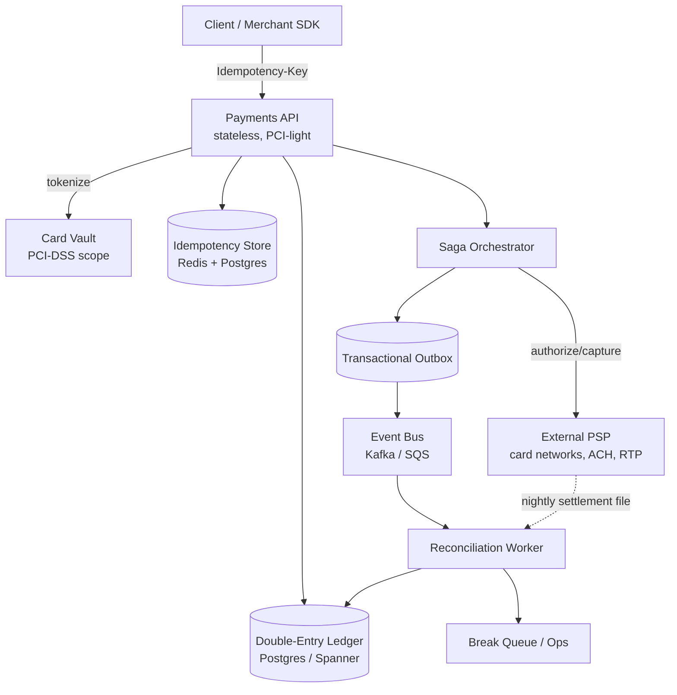
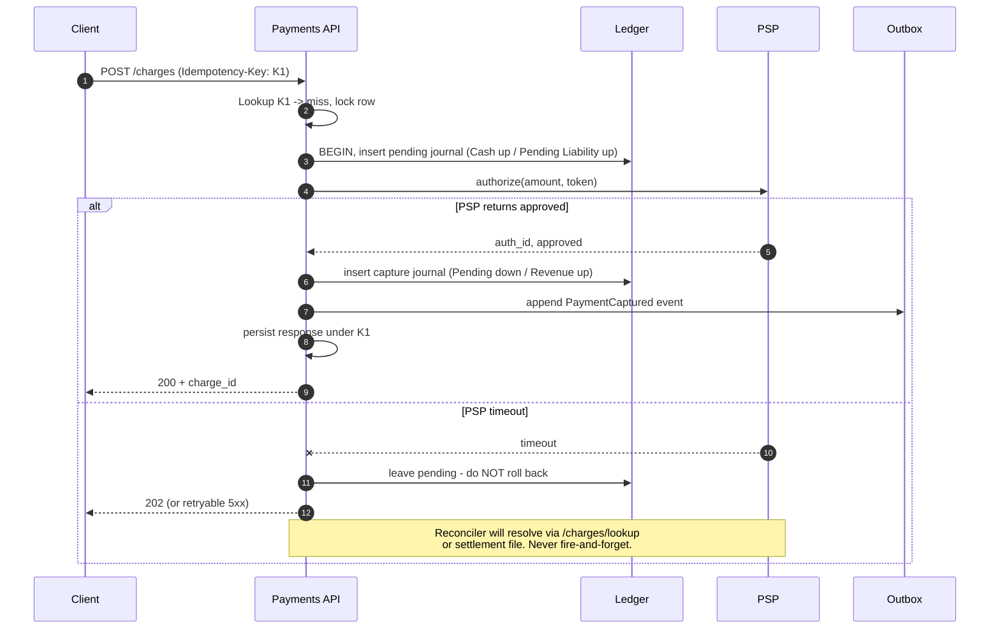
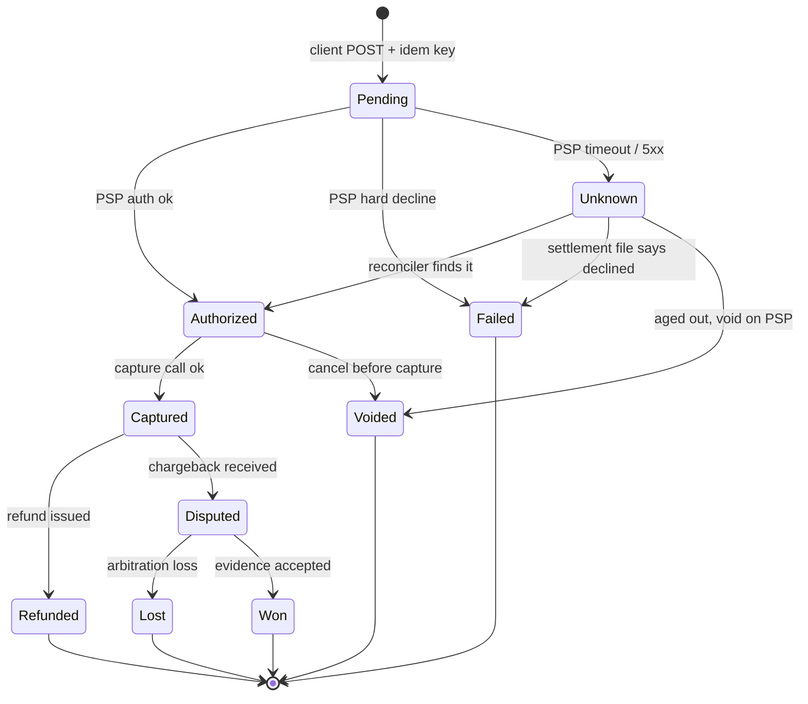

# Payment System

## Why This Exists

**Problem.** Payments are the canonical distributed-systems hard mode: every operation touches money, every retry can double-charge, every failure is visible to a regulator, and "eventually consistent" is a euphemism for "we lost a transaction." Most candidates blow this interview by treating it like an e-commerce CRUD app — they sketch `POST /charge` against a `payments` table and move on. A real payment system is a **double-entry ledger fronted by an idempotent API, glued to external networks via sagas, with reconciliation as a first-class background process.**

**Key insight.** Money is not data. You cannot UPDATE a balance. You cannot DELETE a charge. Every state change is an immutable, append-only journal entry, and the "balance" is a derived view. Once you internalize that, the rest of the design — idempotency keys, sagas, reconciliation, refund flows, PCI scope — falls out naturally. The Stripe engineering blog ("Online migrations at scale", "Designing robust and predictable APIs with idempotency") and Square's payment-platform talks are the canonical references; both companies converged on the same shape because the domain forces it.

**Reach for this when:**
- The interview prompt mentions money movement, wallets, payouts, refunds, marketplaces, subscriptions, or PSP integration.
- You're designing anything where a duplicated side effect costs real dollars (gift-card issuance, in-app credits, ad spend).
- Existing system has reconciliation breaks, "ghost" charges, or auditors asking why two services disagree.

**Don't reach for this when:**
- The system tracks units that are cheap to mint (likes, views, follower counts) — full ledger is overkill.
- You're really designing a checkout *funnel* (UX, A/B, fraud signals) — that's a different skill.

---

## Diagrams

### High-level component layout



### Authorize-then-capture saga (the unhappy path is the point)



### State machine of a single payment



---

## Core Design

### 1. Idempotency keys (Stripe-style)

The single most-asked sub-question. Memorize this.

**Contract.** Client generates a UUID per logical operation, passes it in `Idempotency-Key` header. Server guarantees: same key + same request body → same response, exactly one side effect, regardless of how many times the client retries (network blips, mobile backgrounding, load-balancer 502).

```python
# Idempotency middleware. This is the abstract of stripe.com/blog/idempotency.
# Three states matter: NEW, IN_FLIGHT, COMPLETED.

import hashlib, json, time
from dataclasses import dataclass
from typing import Optional

@dataclass
class IdemRecord:
    key: str
    request_hash: str       # SHA-256 of canonicalized body
    state: str              # 'in_flight' | 'completed'
    response_code: Optional[int]
    response_body: Optional[bytes]
    locked_at: Optional[float]
    created_at: float

LOCK_TTL_SECONDS = 30  # max time we expect a charge to take end-to-end

def handle_charge(req, db):
    key = req.headers["Idempotency-Key"]
    body = canonical_json(req.body)              # sort keys, strip whitespace
    body_hash = hashlib.sha256(body).hexdigest()

    # Atomic INSERT ... ON CONFLICT — must be a single SQL statement.
    row = db.execute("""
        INSERT INTO idempotency_keys (key, request_hash, state, locked_at, created_at)
        VALUES (%s, %s, 'in_flight', now(), now())
        ON CONFLICT (key) DO UPDATE
            SET locked_at = CASE
                WHEN idempotency_keys.state = 'completed' THEN idempotency_keys.locked_at
                WHEN idempotency_keys.locked_at < now() - interval '30 seconds'
                    THEN now()      -- recover from crashed worker
                ELSE idempotency_keys.locked_at
            END
        RETURNING *, (xmax = 0) AS inserted
    """, (key, body_hash)).fetchone()

    if not row.inserted:
        # Same key existed.
        if row.request_hash != body_hash:
            # CRITICAL: same key, different body = client bug. Reject hard.
            return 422, {"error": "idempotency_key_reuse_with_different_body"}
        if row.state == "completed":
            return row.response_code, row.response_body  # replay
        if row.state == "in_flight" and row.locked_at + LOCK_TTL_SECONDS > time.time():
            # Concurrent retry while first request is still running.
            return 409, {"error": "request_in_flight"}
        # else: stale lock, we just stole it above.

    # We own the operation. Do the work.
    try:
        resp_code, resp_body = perform_charge(req, body)
    except Exception as e:
        # Do NOT mark completed on transient errors. Let the lock expire so
        # a later retry (with the same key) can re-attempt.
        if is_transient(e):
            raise
        # Permanent error: persist the failure response so retries see it.
        resp_code, resp_body = 500, json.dumps({"error": "internal"}).encode()

    db.execute("""
        UPDATE idempotency_keys
           SET state='completed', response_code=%s, response_body=%s
         WHERE key=%s
    """, (resp_code, resp_body, key))
    return resp_code, resp_body
```

**Subtleties most candidates miss:**
1. **Hash the request body**, not just the key. If a client reuses a key with a different amount, that's a bug — 422, don't silently accept.
2. **Distinguish "in flight" from "completed"** so concurrent retries return 409 instead of double-billing.
3. **Stale lock recovery.** A crashed worker leaves `in_flight` rows. TTL on the lock, not on the record. The record itself lives for 24h+ for replay.
4. **Retention.** Stripe keeps idempotency keys for 24h. Long enough to cover client retry storms, short enough to bound storage.
5. **Scope keys per-account, not globally.** `(account_id, key)` is the unique constraint. Otherwise you're vulnerable to enumeration and accidental cross-tenant collisions.

### 2. Double-entry ledger

Every transaction is **two or more journal entries that sum to zero**. This is non-negotiable. It's how accountants caught fraud in 1494 and how you'll catch your own bugs in 2026.

```sql
-- Accounts: a tree. Examples:
--   user:42:cash            (asset)
--   user:42:pending         (liability — money we owe back if auth fails)
--   merchant:7:revenue      (income)
--   platform:fees           (income)
--   platform:reserve        (liability)
CREATE TABLE accounts (
    id              BIGSERIAL PRIMARY KEY,
    name            TEXT UNIQUE NOT NULL,
    type            TEXT NOT NULL CHECK (type IN ('asset','liability','income','expense','equity')),
    currency        CHAR(3) NOT NULL,
    parent_id       BIGINT REFERENCES accounts(id)
);

-- Transactions: the unit of atomicity. One business event = one transaction.
CREATE TABLE transactions (
    id              UUID PRIMARY KEY,
    idempotency_key TEXT,                 -- ties to the API call that caused this
    posted_at       TIMESTAMPTZ NOT NULL DEFAULT now(),
    description     TEXT,
    metadata        JSONB
);

-- Entries: the actual debits and credits. Append-only.
CREATE TABLE entries (
    id              BIGSERIAL PRIMARY KEY,
    transaction_id  UUID NOT NULL REFERENCES transactions(id),
    account_id      BIGINT NOT NULL REFERENCES accounts(id),
    direction       CHAR(2) NOT NULL CHECK (direction IN ('DR','CR')),
    amount_minor    BIGINT NOT NULL CHECK (amount_minor > 0),  -- cents, never floats
    currency        CHAR(3) NOT NULL
);

-- Invariant: every transaction's debits == credits, per currency. Enforce in a
-- DEFERRABLE constraint trigger that fires at COMMIT, or check in app code
-- inside the same DB transaction.
CREATE OR REPLACE FUNCTION assert_balanced() RETURNS trigger AS $$
DECLARE diff BIGINT;
BEGIN
    SELECT COALESCE(SUM(CASE direction WHEN 'DR' THEN amount_minor ELSE -amount_minor END), 0)
      INTO diff
      FROM entries
     WHERE transaction_id = NEW.transaction_id;
    IF diff <> 0 THEN
        RAISE EXCEPTION 'unbalanced transaction %: diff=%', NEW.transaction_id, diff;
    END IF;
    RETURN NEW;
END $$ LANGUAGE plpgsql;

CREATE CONSTRAINT TRIGGER trg_balanced
AFTER INSERT ON entries
DEFERRABLE INITIALLY DEFERRED
FOR EACH ROW EXECUTE FUNCTION assert_balanced();
```

**Recording a $100 capture (USD):**

```
TX abc-123  "capture charge ch_xyz"
  DR  user:42:cash             10000  USD
  CR  merchant:7:revenue        9710  USD   -- 97.10 to merchant
  CR  platform:fees              290  USD   -- 2.9% platform fee
```

The trigger refuses to commit if those don't sum to zero. **You will catch real bugs in pre-prod with this trigger.**

**Balances are a view, not a column.** Never `UPDATE accounts SET balance = balance + 100`. That row becomes a hot lock and a single bad UPDATE corrupts forever. Instead:

```sql
-- Materialized view, refreshed concurrently, or a periodic snapshot table.
CREATE MATERIALIZED VIEW account_balances AS
SELECT
    account_id,
    currency,
    SUM(CASE WHEN direction='DR' THEN amount_minor ELSE -amount_minor END) AS balance_minor
FROM entries
GROUP BY account_id, currency;
```

For hot accounts, snapshot every N entries (running balance pattern). The point is: **the journal is the source of truth, the balance is derived.**

**Currency.** Always store amounts as integer minor units (cents, satoshi). Floats lose pennies. Mixed-currency transactions need an FX entry that lands in a `fx_gain_loss` account; never silently convert.

### 3. Saga for multi-step flows

A "charge a card and ship a thing and pay the merchant 10 minutes later" flow is **not a database transaction**. It crosses service boundaries, network boundaries, and time zones. Use a saga: a sequence of local transactions, each with a compensating action.

```python
# Orchestrator-style saga (preferred over choreography for payments — easier to
# audit, easier to add new steps, easier to debug). One process owns the state
# machine; steps are idempotent calls out to other systems.

class CheckoutSaga:
    """States persisted in a sagas table. Resumable after crash."""
    steps = [
        ("reserve_inventory",  "release_inventory"),
        ("authorize_payment",  "void_authorization"),
        ("create_shipment",    "cancel_shipment"),
        ("capture_payment",    "refund_payment"),
    ]

    def run(self, saga_id):
        saga = db.load(saga_id)
        for i, (forward, compensate) in enumerate(self.steps):
            if saga.completed_steps > i:
                continue                      # resume past this step
            try:
                # Each forward call uses an idempotency key derived from
                # (saga_id, step_name) so retries are safe.
                idem_key = f"{saga_id}:{forward}"
                getattr(self, forward)(saga, idem_key)
                saga.completed_steps = i + 1
                db.save(saga)
            except RetryableError:
                raise                         # let the worker retry the step
            except PermanentError as e:
                saga.failed_at_step = i
                saga.error = str(e)
                db.save(saga)
                self.compensate(saga)
                return
        saga.state = "completed"
        db.save(saga)

    def compensate(self, saga):
        # Run compensations in reverse, also idempotently. Critically, a
        # compensation must NEVER fail silently — escalate to ops if it does.
        for i in reversed(range(saga.failed_at_step)):
            _, compensate = self.steps[i]
            idem_key = f"{saga_id}:compensate:{compensate}"
            try:
                getattr(self, compensate)(saga, idem_key)
            except Exception:
                alert_oncall(saga.id, compensate)   # human-in-loop required
                raise
```

**Saga rules that interviewers test:**
1. **Every forward step is idempotent** (it's already an external call — give it a deterministic idempotency key).
2. **Every step has a compensation**, even if the compensation is "log and alert a human" (some things can't be undone — a sent SMS, a shipped package).
3. **Compensations are not rollbacks.** They're new business actions: "void" is not "delete the auth"; "refund" is not "delete the capture". They produce their own ledger entries.
4. **Persist saga state before each step.** A crashed orchestrator must resume from the last committed step, not replay the whole thing.
5. **Order compensation in reverse** of the forward path.

### 4. Transactional outbox (for events leaving the boundary)

You commit a ledger entry and you want to publish a `PaymentCaptured` event. Two options, both bad:

- **Publish first, then commit.** If commit fails, you've lied to downstream.
- **Commit first, then publish.** If the publish fails or the box dies, the event is lost forever and the ledger and event-bus diverge. **This is how reconciliation breaks happen.**

The fix is the **transactional outbox**: write the event to an `outbox` table in the *same* DB transaction as the ledger entries. A separate poller (or CDC via Debezium / Postgres logical replication) reads the outbox and publishes to Kafka. At-least-once delivery; downstream consumers must dedupe by event ID.

```sql
CREATE TABLE outbox (
    id            BIGSERIAL PRIMARY KEY,
    aggregate_id  UUID NOT NULL,
    event_type    TEXT NOT NULL,
    payload       JSONB NOT NULL,
    created_at    TIMESTAMPTZ NOT NULL DEFAULT now(),
    published_at  TIMESTAMPTZ
);

CREATE INDEX outbox_unpublished ON outbox(id) WHERE published_at IS NULL;
```

### 5. Reconciliation

This is the part candidates skip and seniors design first. PSPs send a daily settlement file (CSV/JSON over SFTP, or a webhook stream). It is the **ground truth**. Your ledger is wrong until proven otherwise.

```python
def reconcile_daily(date):
    """For each settlement row, find the matching internal transaction.
       Categorize and route every break."""
    psp_rows = fetch_settlement_file(date)
    internal = load_internal_transactions(date_range=(date - 1, date + 2))

    matched, missing_internal, missing_psp, amount_mismatch = [], [], [], []
    by_psp_ref = {t.psp_reference: t for t in internal if t.psp_reference}

    for r in psp_rows:
        t = by_psp_ref.get(r.psp_reference)
        if t is None:
            missing_internal.append(r)            # PSP says it happened, we don't
        elif t.amount_minor != r.amount_minor:
            amount_mismatch.append((t, r))        # FX? fees? bug?
        else:
            matched.append((t, r))

    seen = {r.psp_reference for r in psp_rows}
    for t in internal:
        if t.psp_reference and t.psp_reference not in seen and t.state == 'captured':
            missing_psp.append(t)                 # We say it happened, PSP doesn't

    # Everything that doesn't match goes to a break queue. A human investigates.
    # NEVER auto-correct ledger entries from reconciliation. Post a correcting
    # journal entry (debit/credit pair) so the audit trail is preserved.
    for r in missing_internal: open_break("missing_internal", r)
    for t in missing_psp:      open_break("missing_psp", t)
    for t, r in amount_mismatch: open_break("amount_mismatch", t, r)

    record_recon_run(date, matched=len(matched), breaks=...)
```

**The four reconciliation classes:**
- **Missing internal** — PSP shows a charge, ledger doesn't. Usually a webhook lost in transit or a saga that crashed mid-step. Recover by replaying.
- **Missing PSP** — Ledger shows captured, PSP has nothing. Often the saga thought a timeout meant success. Often the most expensive bug.
- **Amount mismatch** — FX rounding, fee changes, partial captures. Investigate.
- **Timing mismatch** — present in one day's file, absent the next. Usually fine; widen your window.

Run reconciliation **daily and continuously**: a streaming reconciler against webhook events catches drift in minutes; the daily batch catches what webhooks lost.

### 6. PCI scope

PCI-DSS scope is the set of systems that **store, process, or transmit cardholder data (PAN)**. Every system in scope is subject to the full ~250-control audit. The strategy is "make scope as small as possible."

**Tactics that work:**
- **Tokenization at the edge.** Card data goes from the browser directly to a vault (Stripe.js, Adyen Components, your own iframe + tokenization service). Your application servers see only `tok_xxx`. Most of your stack is now out of scope.
- **Network segmentation.** The vault and any system that holds raw PAN sits in a separate VPC with audited ingress/egress. Logging from that VPC is sanitized before it leaves.
- **No PAN in logs.** Mask at the source. Audit your logging libraries; structured-logging field redaction is mandatory.
- **Quarterly ASV scans, annual penetration tests, monthly internal scans.** This is process, not architecture, but it falls out of "what's in scope."
- **SAQ-A vs SAQ-D.** If you redirect/iframe to a PCI-DSS-validated provider, you can often qualify for SAQ-A (≈22 controls). If you touch PAN at all, SAQ-D (≈329). The cost differential is enormous.

**What's NOT in scope (good news):** the ledger, the orchestrator, the reconciler, analytics — none of these need PAN. They reference `customer_id` and `tok_xxx`, never the card itself.

### 7. Consistency: where strong, where eventual

| Concern | Consistency model | Why |
|---|---|---|
| Ledger entries within one transaction | **Strong** (ACID, single DB) | Debits/credits must balance atomically; serializable or repeatable-read with row locks on accounts |
| Account balances (read) | **Eventual** | Derived from journal; staleness measured in seconds is fine for display, not for auth checks |
| Auth-time balance check (wallet payments) | **Strong** | Read your own writes; lock the source account row, compute live balance |
| Saga steps across services | **Eventual + idempotent** | No XA transactions; rely on idempotency + compensation |
| Outbox → event bus → consumer | **Eventual, at-least-once** | Consumers dedupe by event ID |
| Reconciliation vs PSP | **Eventual** (T+1) | PSP is asynchronous by nature |
| Refund of a recently captured charge | **Strong** within service, **eventual** to PSP | Lock the original charge, write the refund journal, then call PSP |

**Read-your-own-writes** is the trap. After POST /charge, the client immediately GETs the charge. If your read replica is 200ms behind primary, the GET 404s and the client retries the POST — boom, duplicate. Either route reads-after-writes to primary, or include a `Last-Modified` token the client passes back.

---

## Trade-offs

| Benefit | Cost |
|---|---|
| Idempotency keys eliminate duplicate side effects under retry | Extra DB write per request; key collision storage; client must generate stable keys |
| Double-entry ledger gives auditability and detects corruption | More storage, more rows, more joins; balance becomes a derived view requiring snapshotting at scale |
| Saga handles multi-step flows without distributed transactions | Compensation logic doubles your code; sagas are state machines you must operate; partial states leak to users |
| Outbox guarantees event publication | Adds publish latency (poll interval); outbox table grows fast; CDC infra to maintain |
| Daily reconciliation catches all drift | Operations cost (a team owns the break queue); 24h detection window; PSP file format changes break you |
| Tokenization shrinks PCI scope | Vendor lock-in to vault; tokens are not portable across PSPs without a migration |
| Strong consistency on the ledger | Single writable DB becomes the bottleneck; sharding by account is a project |
| Eventual consistency on balances | Users see stale numbers; refund-then-rebuy races possible; documented carefully |
| Authorize-then-capture (vs. immediate charge) | Extra state to track; auth holds expire (7 days typical); but enables ship-then-charge and partial captures |

---

## Common Pitfalls

- **Floating-point money.** `0.1 + 0.2 != 0.3`. Auditors will find the missing penny. Use integer minor units, always.
- **Idempotency key without body hashing.** Client retries with mutated payload (e.g., a price change between attempts) get the original response — silent corruption. Hash the body.
- **Idempotency key TTL too short.** Mobile clients retry hours later when reconnecting from airplane mode. 24h minimum.
- **One key, two requests in flight.** Without a lock, both pass the "not found" check and both call the PSP. Use `INSERT ... ON CONFLICT` to make claim atomic.
- **Treating PSP timeout as failure.** Network timed out — did the PSP actually charge? You don't know. Mark the payment `unknown`, **never roll back the pending entry**, let the reconciler resolve.
- **Saga compensation that itself fails.** The "refund the captured payment" compensation calls the PSP and gets a 503. If you don't retry-with-backoff and eventually escalate, you've now charged the customer for a thing you can't ship. Compensations need their own idempotency, retry, and dead-letter.
- **Updating balances directly.** `UPDATE accounts SET balance = balance - X` under concurrency = lost updates. Append journal entries; derive balance.
- **Logging PAN.** Even one log line with a full card number puts your entire logging pipeline (Splunk, S3, CloudWatch) in PCI scope. Redact at the structured-logging layer; periodically grep production logs for 16-digit sequences.
- **Storing CVV.** PCI-DSS forbids it after authorization, full stop. Even encrypted. Don't.
- **Webhook delivery without HMAC verification.** PSP webhooks are public endpoints; without signature verification, anyone can post a "you got paid $1M" event.
- **Reconciliation that auto-corrects.** If your reconciler silently flips ledger entries to match the PSP, you've destroyed the audit trail. Always post a correcting journal entry; never edit the past.
- **Refund races.** Customer hits "refund" twice, both API calls reach the PSP, both succeed — you've paid back $200 on a $100 charge. Idempotency key on the refund + a uniqueness constraint on `(charge_id, status='refunded')`.
- **Ignoring chargebacks.** A dispute can land 60+ days after capture. Your state machine must accept `Captured -> Disputed` transitions long after the original transaction is "done." Don't archive too aggressively.
- **FX without a gain/loss account.** Capture in EUR, settle in USD, rate moved 0.3% — that 0.3% has to land somewhere. If it doesn't, your ledger silently un-balances at scale.
- **Migrating schema online without backfill discipline.** See Stripe's "Online migrations at scale" — the four-step pattern (dual-write, backfill, dual-read, drop old) is the only safe play for a live ledger.

---

## Decision Table

| If you need... | Use... | Don't use... |
|---|---|---|
| Exactly-once side effect under client retries | Idempotency key + body hash + atomic claim | At-most-once (loses requests) or at-least-once without dedup |
| Multi-row money movement | Double-entry ledger (DR/CR balanced) | Single `balance` column with UPDATE |
| Cross-service "all or nothing" payment flow | Saga (orchestrator) with compensations | XA / 2PC across microservices |
| Internal coordination only, single DB | Local DB transaction (serializable) | Saga (overkill, more failure modes) |
| Publish event after DB write reliably | Transactional outbox + CDC or poller | `commit(); publish()` in app code |
| Catch drift between you and PSP | Daily settlement file recon + streaming webhook recon | Trusting webhooks alone |
| Minimize PCI audit cost | Tokenize at the edge; SAQ-A scope | Storing PAN in your DB "for flexibility" |
| Show user their balance in the UI | Eventual-consistent materialized view | Read live SUM() on every page load |
| Authorize a balance for a payout | Strong-consistent read against primary, row-locked | Read replica (replica lag → over-payment) |
| Handle partial fulfillment (ship 2 of 3 items) | Authorize whole, capture per shipment | Charge upfront, refund the diff (worse UX, fee drag) |
| Marketplace with split payouts | Connected accounts + per-leg journal entries | One ledger account for "platform" with off-ledger spreadsheet |
| Subscription billing | Separate billing/metering pipeline feeding charge events into payments | Cron that calls /charge directly (no idempotency under retry) |

---

## References

Primary sources, ordered by relevance:

- Stripe Engineering — *Designing robust and predictable APIs with idempotency* — https://stripe.com/blog/idempotency
- Stripe Engineering — *Online migrations at scale* — https://stripe.com/blog/online-migrations
- Stripe Engineering — *Rate limiters* (companion to idempotency for retry storms) — https://stripe.com/blog/rate-limiters
- Square Engineering — *Books, an immutable double-entry accounting database* — https://developer.squareup.com/blog/books-an-immutable-double-entry-accounting-database/
- Uber Engineering — *Building reliable reprocessing and dead-letter queues with Kafka* — https://www.uber.com/blog/reliable-reprocessing/
- Pat Helland — *Life Beyond Distributed Transactions: An Apostate's Opinion* — https://queue.acm.org/detail.cfm?id=3025012
- Pat Helland — *Immutability Changes Everything* — https://queue.acm.org/detail.cfm?id=2884038
- Hector Garcia-Molina, Kenneth Salem — *Sagas* (1987, original paper) — https://www.cs.cornell.edu/andru/cs711/2002fa/reading/sagas.pdf
- Chris Richardson — *Pattern: Saga* — https://microservices.io/patterns/data/saga.html
- Chris Richardson — *Pattern: Transactional outbox* — https://microservices.io/patterns/data/transactional-outbox.html
- Martin Kleppmann — *Designing Data-Intensive Applications*, ch. 7 (Transactions), ch. 9 (Consistency and Consensus), ch. 11 (Stream Processing)
- Martin Fowler — *Event Sourcing* — https://martinfowler.com/eaaDev/EventSourcing.html
- AWS Builders' Library — *Making retries safe with idempotent APIs* — https://aws.amazon.com/builders-library/making-retries-safe-with-idempotent-APIs/
- AWS Builders' Library — *Reliability, constant work, and a good cup of coffee* — https://aws.amazon.com/builders-library/reliability-and-constant-work/
- Google SRE Workbook — ch. 11 *Managing Load* (load shedding for payments APIs) — https://sre.google/workbook/managing-load/
- PCI Security Standards Council — *PCI-DSS v4.0 Quick Reference Guide* — https://www.pcisecuritystandards.org/document_library/
- Adyen Engineering — *How we built the Adyen ledger* — https://www.adyen.com/knowledge-hub/payments-architecture (overview series)
- Modern Treasury — *The Anatomy of a Ledger* — https://www.moderntreasury.com/journal/the-anatomy-of-a-ledger
- Increment Magazine — *On Payments* (issue 13) — https://increment.com/payments/
- Alex Xu — *System Design Interview Vol. 2*, ch. on Payment System

---

## See Also

- `../../architecture-patterns/event-sourcing/` — append-only journals, projections, snapshots; ledger is the canonical event-sourced domain
- `../../data-systems/outbox/` — transactional outbox + CDC implementation details
- `../../communication/idempotency/` — request/response idempotency contracts, versioning
- `../../data-systems/consistency-models/` — strong vs eventual; read-your-own-writes; quorum reads
